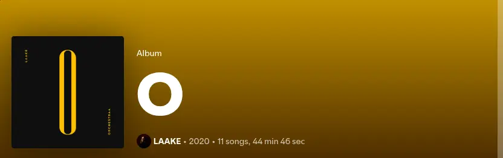
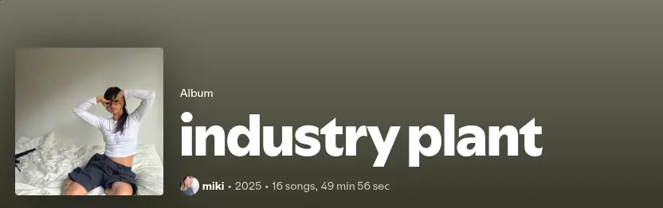
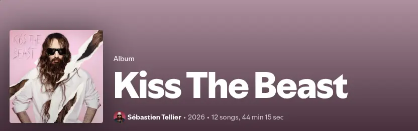
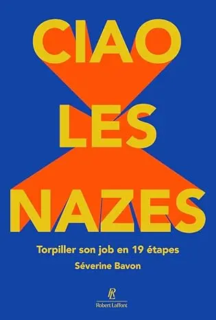
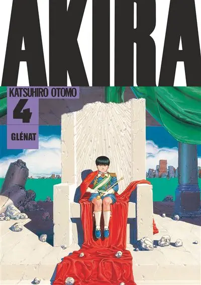
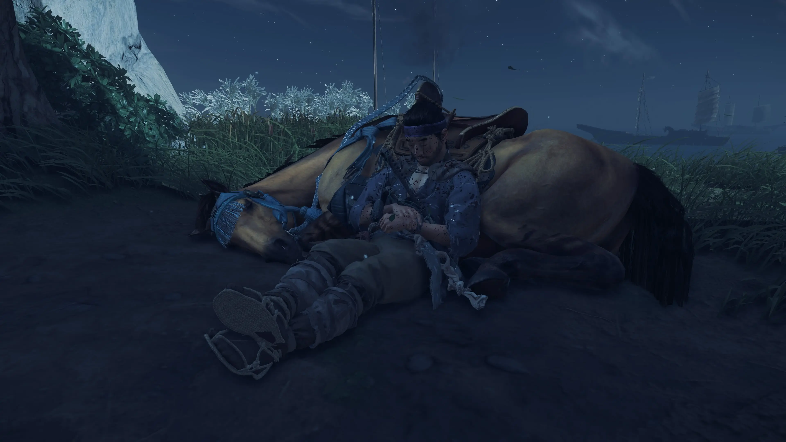

> Ce que je fais en ce moment, inspiré par [nownownow.com](https://nownownow.com/about)

## Travail

Je suis en mission chez Électro Dépôt depuis juillet 2024. Je travaille en particulier sur la refonte du système d'encaissement, et sur l'intégration des applications qui gravitent autour.

Mes cours pour l'année universitaire sont terminés. Je reprendrai les cours à la rentrée de septembre donc.

## Conférences

J'enchaîne toujours les confs avec mon talk "[Let's play Factorio]()", même si on arrive sur la fin de vie de ce talk qui a déjà bien tourné.

Les feedbacks sont toujours oufs.

En faisant le compte rapide de tête, plus de 1000 personnes ont vu le talk. Certaines l'ont même vu plusieurs fois. (on peut donc tromper 1 fois 1000 personnes 😅).

Let's play Factorio a été recalé à MixIT 2026 et Devoxx France 2026, mais je l'ai soumis à plusieurs autres confs, DevLille 2026, DevQuest 2026, Riviera Dev 2026, et BreizhCamp 2026.

J'ai une intervention de prévue au ENI Tech Fest 2026 en mars pour une table ronde.

On a aussi officiellement entamé l'organisation de Cloud Nord 2026, donc plus d'infos à venir prochainement.

## Musique

Mes dernières écoutes :

* Électro : Laake, Röyksopp
* Pop : Miki, Selah Sue, Gorillaz, Sébastien Tellier.

{class=images-grid-3}

## Lecture

En cours :

* Ciao les nazes: Torpiller son job en 19 étapes de Séverine Bavon
* Akira (tomes 1 à 6)

{class=images-grid-2}

Fini récemment :

* Cat's Eye (l'intégrale)
* Logocratie de Clément Viktorovitch

Ma pile :

* Les guerres de Lucas tome 2
* City Hunter tome 1
* Qui travaille vraiment de Denis Colombi

## Gaming

En cours :

* Need For Speed Unbound 🎯🏆
* Ghost of Tsushima 🎯🏆

Terminés récemment :

* Final Fantasy XVI 🏆
* Power Wash Simulator 2 🏆
* Lego Horizon Adventures 🏆

Backlog :

* Clair Obscur: Expedition 33
* Ghost of Yōtei
* Stray
* Control
* Monster Hunter Stories
