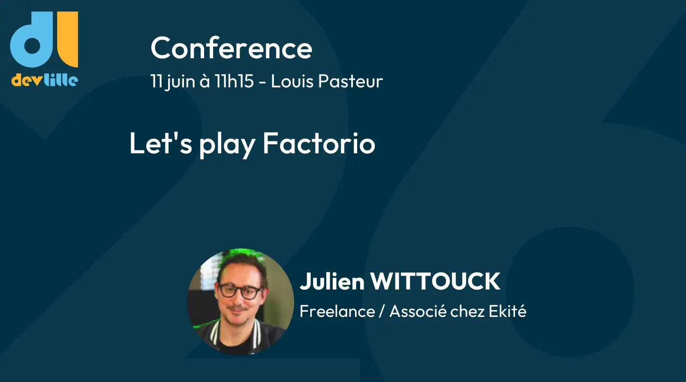
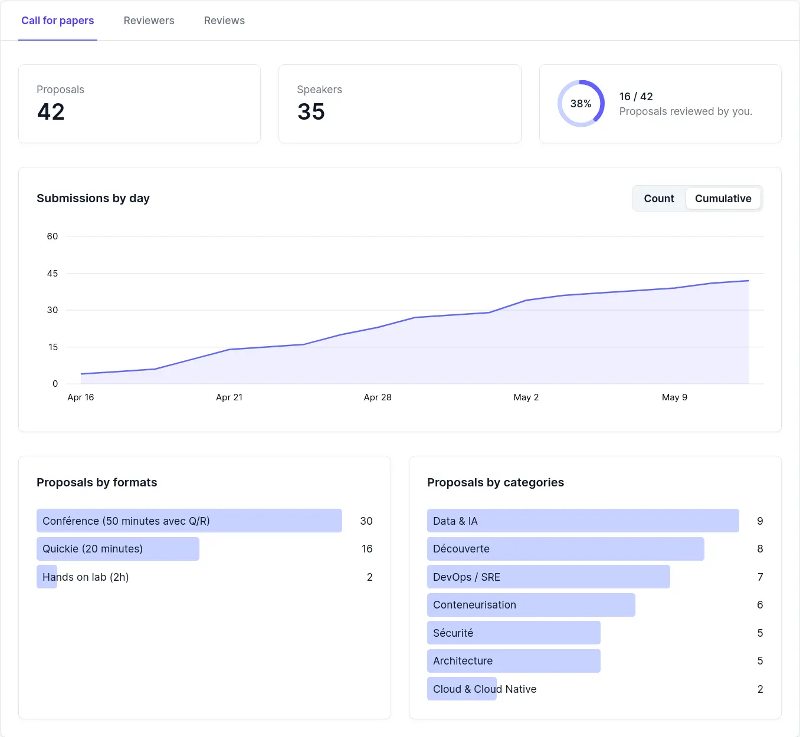
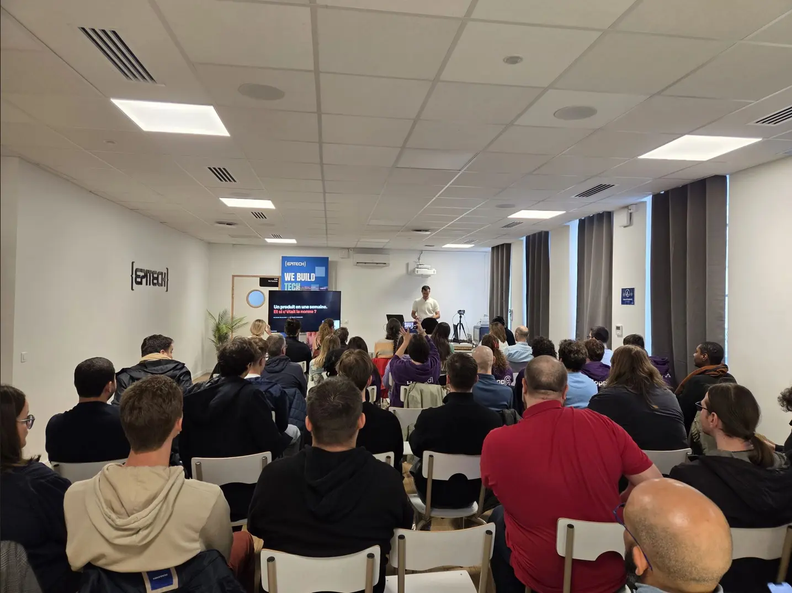
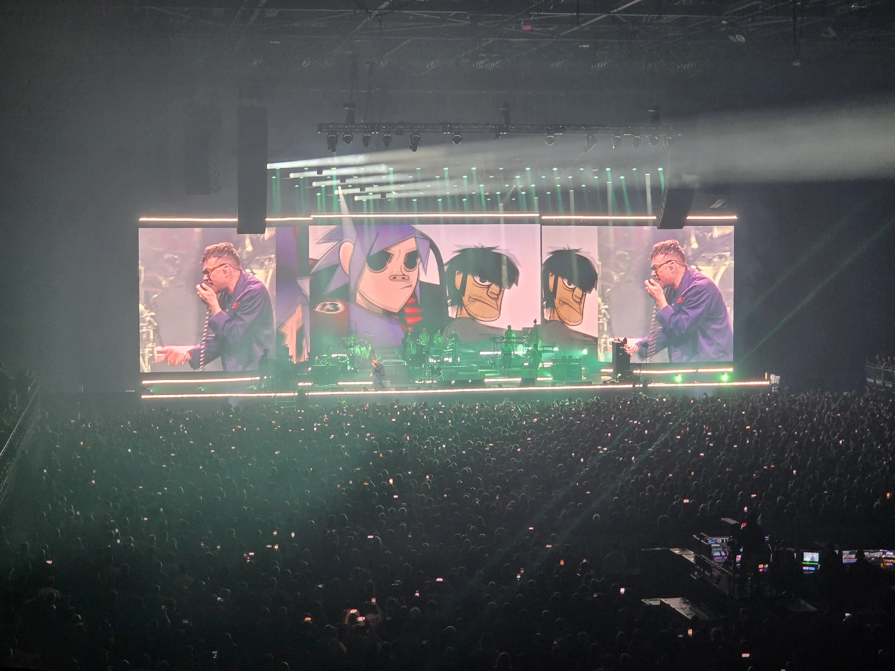
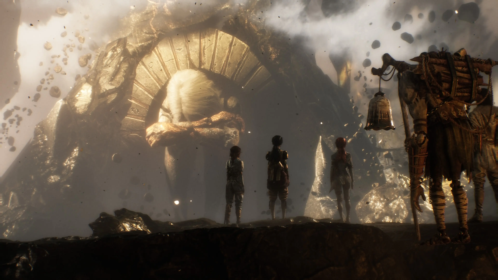

## Travail

Je suis en mission chez Électro Dépôt depuis juillet 2024. Je travaille en particulier sur la refonte du système d'encaissement, et sur l'intégration des applications qui gravitent autour.

Mes cours pour l'année universitaire 2026/2027 reprendront en septembre.
Je prévois une grosse mise à jour des contenus, pour supporter Spring Boot 4.

## Conférences

Sur cette fin de saison, j'ai quatre conférences de prévues :

* 🗓️ 11 juin - Let's Play Factorio au DevLille 2026 (Lille) : je joue à domicile, je suis content d'avoir cette session
* 🗓️ 18 juin - Pimp My Shell à Tech'Works 2026 (Lyon) : Un nouveau talk que je suis en train de préparer
* 🗓️ 26 juin - Let's Play Factorio à BreizhCamp 2026 (Rennes)
* 🗓️ 8 juillet - Let's Play Factorio à RivieraDev 2026 (Sophia Antipolis)

Je suis content d'avoir encore la chance et le plaisir de donner ma conf sur Factorio. Je pense que ce sont les dernières sessions, je ne la soumettrais probablement plus (non pas que je m'en lasse, mais je suis déjà allé partout ahaha).

Le CFP de Cloud Nord est déjà bien démarré (on en est à mi-chemin), et je suis très content des sujets que nous recevons.

Nous avons également organisé le Chti Tremplin, avec les amis de DevLille et Agi'Lille, avec 6 speakeuses et speakers. La soirée s'est bien passée, et les talks étaient incroyables. Donc je suis aussi content de l'issue de l'évènement. C'était l'occasion de rencontrer de nouvelles personnes, et de recroiser quelques copains, ça fait toujours plaisir.

## Musique

J'ai assisté au concert de _Gorillaz_ à Liverpool mi-mars, c'était vraiment chouette. J'ai aussi découvert la ville qui est un peu le "Dunkerque de l'Angleterre". J'ai passé un super week-end là-bas.

Forcément, je boucle sur leurs albums, dont le dernier, qui est excellent.
Je réécoute aussi _Blur_, en particulier _The Ballad of Darren_.

Côté Electro, j'ai découvert les playlists de _Sebastian_, conçues pour les défilés d'Yves Saint Laurent.
J'ai aussi re-découvert _Midnight Juggernauts_, dont l'album _Dystopia_ est ouf, et me sert de boost quand je bosse, ainsi que _Destroy Rock & Roll_ de _Mylo_.

J'ai aussi commandé la BO de _Clair Obscur : Expédition 33_ en vinyle, cette BO est folle.

## Lecture

En cours :

* _Qui travaille vraiment ?_ - _Denis Colombi_
* _Androides_ - Tomes 1 à 4

Fini récemment :

* _Ciao les nazes: Torpiller son job en 19_ étapes de _Séverine Bavon_
* _Akira_ (tomes 1 à 6)
* _Les guerres de Lucas_ tome 2

J'ai aussi pris un abonnement à Canard PC, j'attends mon premier numéro avec hâte.

## Gaming

En cours :

* Clair Obscur : Expédition 33 🎯🏆
* Monster Hunter Stories
* NFS Unbound

Terminés récemment :

* Ghost of Tsushima 🏆
* Exit 8 🏆 - Un petit jeu assez sympa, un ovni

Backlog :

* Saros : ça a l'air vraiment chouette, j'avais adoré Returnal
* Ghost of Yōtei
* Stray
* Control
