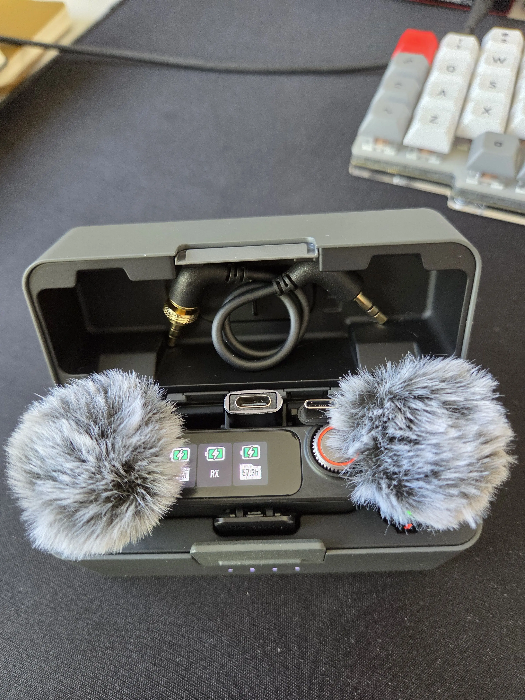
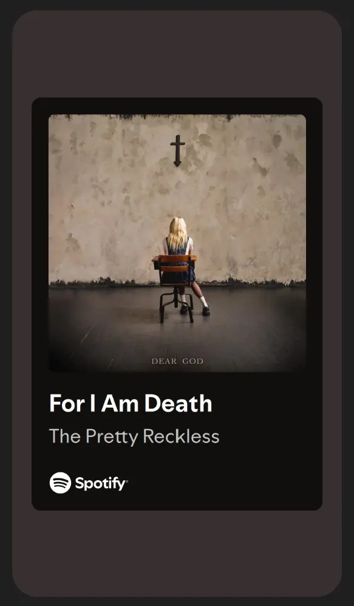
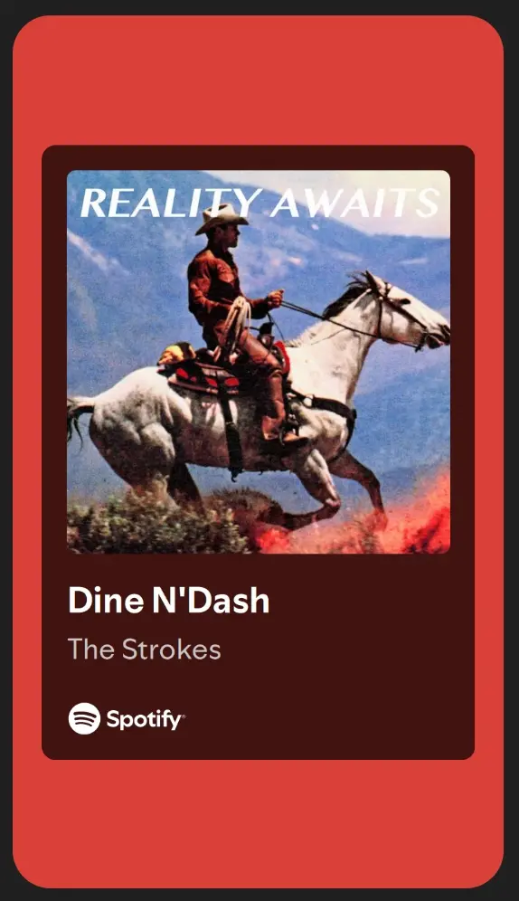
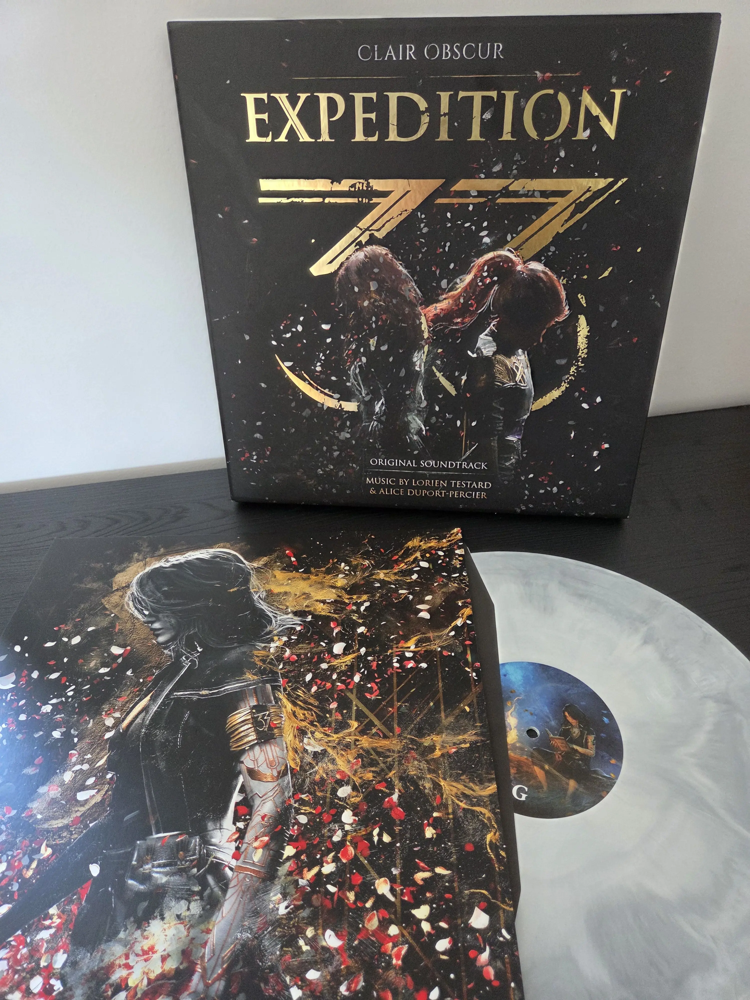
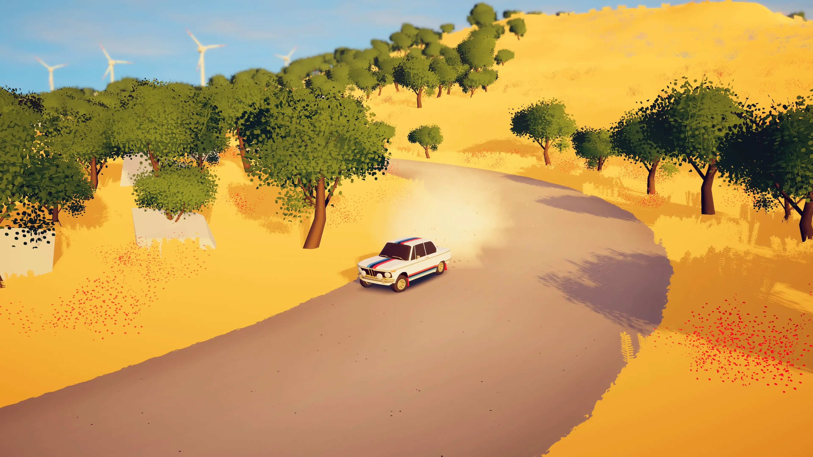
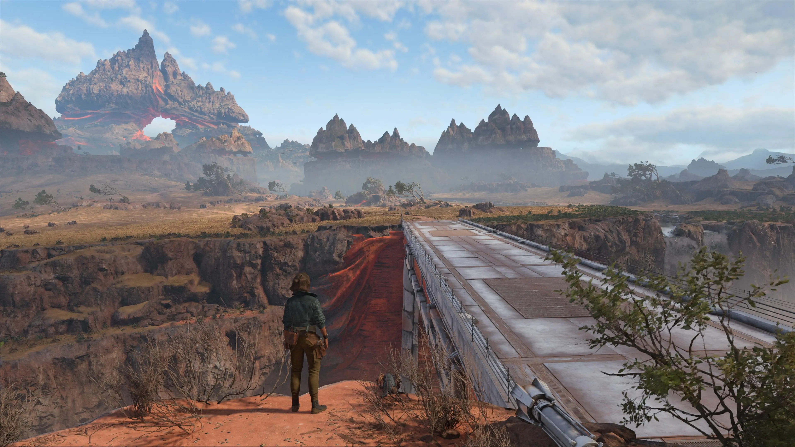

## Travail

Je suis en mission chez Électro Dépôt depuis juillet 2024. Je travaille en particulier sur la refonte du système d'encaissement, et sur l'intégration des applications qui gravitent autour.

Mes cours pour l'année universitaire 2026/2027 reprendront en septembre.
Je prévois une grosse mise à jour des contenus, pour supporter Spring Boot 4.

## Perso

Suite à ma séparation, j'ai emménagé dans un tout nouvel appart.

Il est très chouette, et je suis content de l'avoir aménagé à mon goût.

Ce déménagement m'a pas mal occupé l'esprit sur le mois de juillet, j'ai pris un peu de retard sur ce que je voulais faire, j'espère pouvoir rattraper ça sur le mois d'aout.

## Conférences

J'ai fini mon marathon de conférences de l'été, c'était vraiment intense (couplé à la préparation d'un déménagement, je ne conseille pas).

Mes récaps sont ici : 

* [DevLille 2026](/2026/06/12/devlille-2026/)
* [Tech Work Lyon](/2026/06/18/tech-work-lyon/)
* [Breizhcamp 2026](/2026/06/26/breizhcamp-2026/)
* [Riviera Dev 2026](/2026/07/08/riviera-dev-2026/)

Nous sommes toujours en train de préparer l'édition 2026 de Cloud Nord.

L'agenda est prêt, nous avons déjà bien avancé sur les différents devis pour la restauration et les apéros. Les places se vendent plutôt bien pour l'instant.

Nous avons aussi investi dans un peu de matos pour améliorer notre captation.
J'ai acheté des petits micros portables qui devraient nous permettre d'avoir un son de bonne qualité, et qui seront pratiques (ce sont des micros-cravate).

{class=images-grid-2}

## Musique

J'ai écouté récemment deux nouvelles sorties :

* The Pretty Reckless : Dear God
* The Strokes : Reality Awaits

{class=images-grid-2}

J'ai aussi reçu la BO de Clair Obscur : Expédition 33 en vinyle, une pépite ☺️

{class=images-grid-2}

## Lecture

Je n'ai pas eu beaucoup de temps pour lire ces derniers mois, ma pile ne se dépilera pas toute seule.

Fini récemment :

* _Qui travaille vraiment ?_ - _Denis Colombi_
* _Androides_ - Tomes 1 à 4

## Gaming

En cours :

* Far Cry 6 (je n'aurai probablement pas le courage de le finir)
* Star Wars Outlaws
* Wipeout Omega Collection
* Art of Rally
* Hardspace ShipBreakers

Terminés récemment :

* Clair Obscur : Expédition 33 (pas de 🏆, Simon est vraiment trop dur)

Backlog :

* 007 First Light : c'est clairement mon prochain jeu
* Saros : ça a l'air vraiment chouette, j'avais adoré Returnal
* Ghost of Yōtei (pour plus tard)
* Stray
* Control
