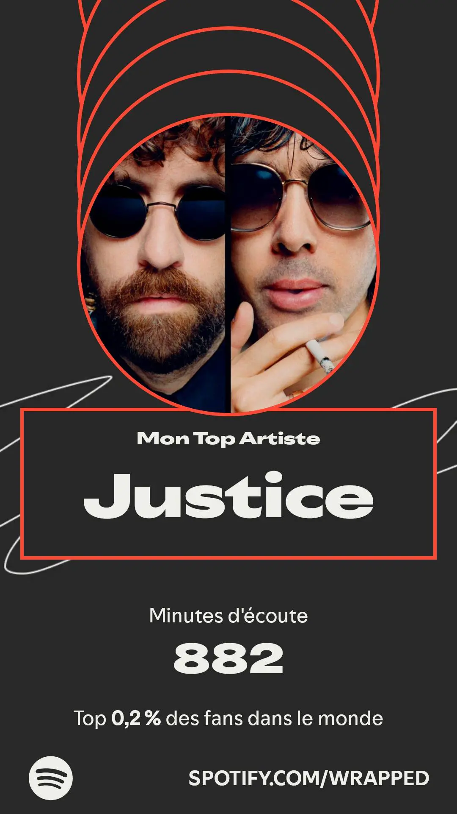
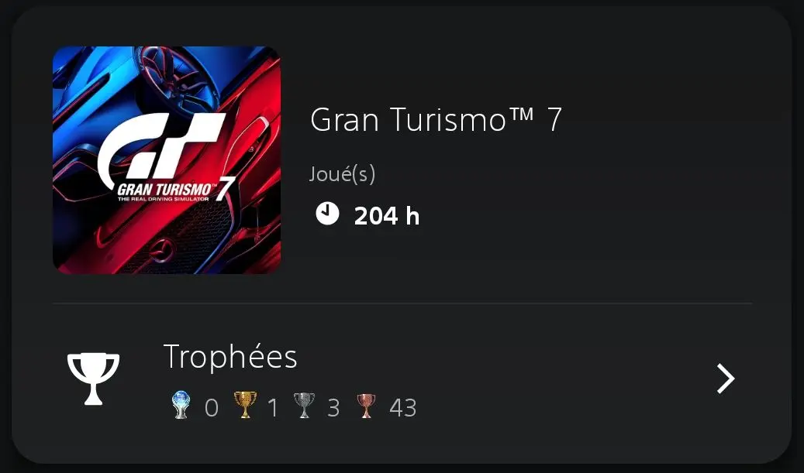
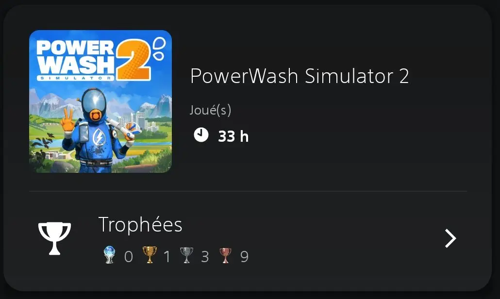

> Ce que je fais en ce moment, inspiré par [nownownow.com](https://nownownow.com/about)

## Travail

Je suis en mission chez Électro Dépôt depuis juillet 2024. Je travaille en particulier sur la refonte du système d'encaissement, et sur l'intégration des applications qui gravitent autour.

On approche aussi de la fin du semestre universitaire à l'Université de Lille, il me reste quelques séances de cours avant les vacances pour mon cours d'[ALOM](https://gitlab.univ-lille.fr/alom-2025) (Architecture Logicielle Orientée Microservices). Mon cours de [SRA-1](https://gitlab.univ-lille.fr/sra1-2025) s'est terminé mi-octobre.

## Conférences

J'enchaîne les confs avec mon talk "[Let's play Factorio]()", les salles sont pleines à chaque fois, et les feedbacks sont oufs.

{class=images-grid-3}

À venir et confirmées : Snowcamp 2026, Touraine Tech 2026, et Epitech Summit.

Je l'ai aussi soumit à MixIT 2026 et Devoxx France 2026, et je le soumettrai au DevLille 2026 et à DevQuest 2026 quand les CFP ouvriront.

## Musique

Je boucle toujours sur certains artistes : 

* Électro : Justice, Daft Punk, Röyksopp.
* Rock : Rage Against The Machine, The Pretty Reckless, Franz Ferdinand.

J'ai aussi acheté les vinyles de la BO de Death Stranding 1, celui du 2 ne devrait pas tarder à arriver dans ma boite aux lettres.

{class=images-grid-2}

## Lecture

En cours :

* Logocratie de Clément Viktorovitch
* Refactoring de Martin Fowler
* Cat's Eye tome 5

Fini récemment :

* Bolchoi Arena (tomes 1 à 3) de Aseyn et Boulet
* [Kubernetes : 50 solutions pour les postes de développement et les clusters de production]() 

Ma pile :

* Les guerres de Lucas tome 2
* Cat's Eye tomes 6, 7 et 8
* City Hunter tome 1

## Gaming

Terminés récemment :

* Need for Speed: Hot Pursuit 🏆
* Final Fantasy 🏆
* Death Stranding 2 : On the beach (histoire terminée, 🏆 à finir)

En cours :

* Gran Turismo 7
* Power Wash Simulator 2 🎯🏆
* Final Fantasy XVI 🎯🏆
* Blood Bowl 3 🎯🏆

{class=images-grid-3}