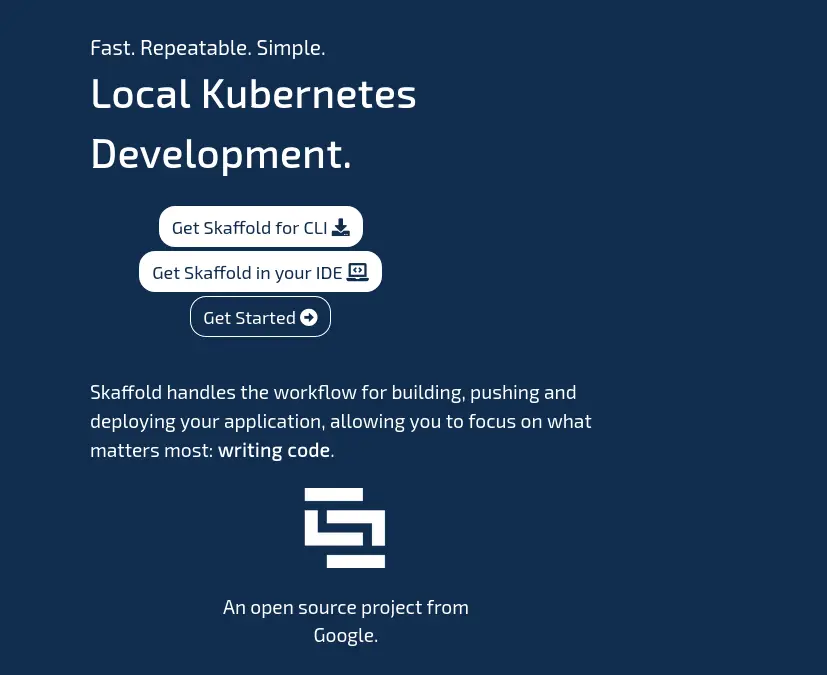
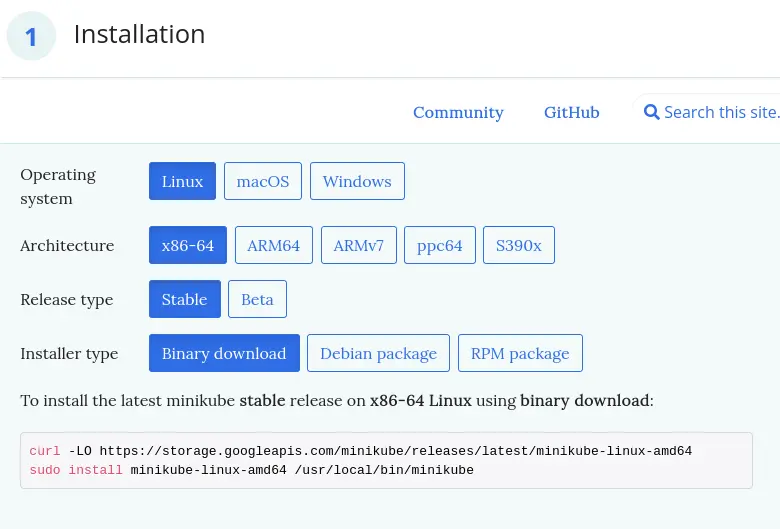
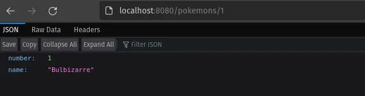

Lors du développement d'une application pour Kubernetes, le développeur est souvent lié à une boucle de feedback assez longue:
1. Développement
2. Contruction de l'image Docker (quelques secondes/minutes)
3. Push de l'image sur un registry
4. Déploiement sur Kubernetes (quelques minutes)

Cette boucle est généralement implémentée par des pipelines de CI/CD. Ces pipelines augmentent encore le temps entre le développement et une application démarrée sur Kubernetes. Ce temps est relativement long lorsqu'on compare un cycle de développement local auquel un développeur peut être habitué.

[`skaffold`](https://skaffold.dev), développé par Google, est un outil open-source en license Apache, qui permet d'implémenter cette boucle de développement sur un environnement Kubernetes local ou distant. La promesse de `skaffold` est de rendre le développement sur Kubernetes simple, rapide et reproductible.



`skaffold` implémente un *pipeline* qui se déroule en plusieurs étapes:
1. *build* : construction des images docker avec:
	* Docker (sur base d'un `Dockerfile`)
	* Buildpacks
	* Jib
2. *tag* de l'image docker en utilisant différentes stratégies :
	* l'identifiant du commit git (par défaut)
	* une date
	* des variables d'environnement
	* un hash des fichiers source
  * push de l'image sur un registry
  * chargement direct de l'image dans un cluster Kubernetes
3. *deploy* : déploiement de l'application sur Kubernetes (local ou distant) en utilisant:
	* `kubectl` et des fichiers yaml
	* `kustomize`
	* `helm`
4. *tail logs & port forward* : affiche les logs de l'application et redirige un port local
5. *status check* : attend la fin du bon déploiement de application

`skaffold` a besoin d'un code à déployer, ainsi qu'un accès à un cluster Kubernetes. L'accès au cluster se configure de la même manière que pour `kubectl`, à travers un fichier `~/.kube/config`. Pour la suite de cet article, j'utilise un cluster `minikube` que j'installe sur mon poste pour l'occasion.

## Déployer un cluster minikube localement
La première étape consiste à déployer un cluster `minikube` sur mon poste de développement.
Pour ce faire, le plus pratique est de suivre les étapes d'installation de l'outil détaillées [dans leur documentation d'installation](https://minikube.sigs.k8s.io/docs/start/).



Voici les commandes que j'ai exécuté pour installer `minikube` sur mon poste Linux :
```shell
$ curl -LO https://storage.googleapis.com/minikube/releases/latest/minikube-linux-amd64
sudo install minikube-linux-amd64 /usr/local/bin/minikube
```
`docker` étant déjà installé sur mon poste, je peux tout de suite démarrer un cluster Kubernetes local avec la commande `minikube start`:
```shell
$ minikube start
😄  minikube v1.24.0 on Debian bookworm/sid
🎉  minikube 1.26.0 is available! Download it: https://github.com/kubernetes/minikube/releases/tag/v1.26.0
💡  To disable this notice, run: 'minikube config set WantUpdateNotification false'

✨  Using the docker driver based on existing profile
👍  Starting control plane node minikube in cluster minikube
🚜  Pulling base image ...
🔄  Restarting existing docker container for "minikube" ...

🧯  Docker is nearly out of disk space, which may cause deployments to fail! (92% of capacity)
💡  Suggestion: 

    Try one or more of the following to free up space on the device:
    
    1. Run "docker system prune" to remove unused Docker data (optionally with "-a")
    2. Increase the storage allocated to Docker for Desktop by clicking on:
    Docker icon > Preferences > Resources > Disk Image Size
    3. Run "minikube ssh -- docker system prune" if using the Docker container runtime
🍿  Related issue: https://github.com/kubernetes/minikube/issues/9024

🐳  Preparing Kubernetes v1.22.3 on Docker 20.10.8 ...
🔎  Verifying Kubernetes components...
    ▪ Using image gcr.io/k8s-minikube/storage-provisioner:v5
    ▪ Using image k8s.gcr.io/ingress-nginx/kube-webhook-certgen:v1.1.1
    ▪ Using image k8s.gcr.io/ingress-nginx/controller:v1.0.4
    ▪ Using image k8s.gcr.io/ingress-nginx/kube-webhook-certgen:v1.1.1
🔎  Verifying ingress addon...
🌟  Enabled addons: storage-provisioner, default-storageclass, ingress
🏄  Done! kubectl is now configured to use "minikube" cluster and "default" namespace by default
```
Par défaut, `minikube` va générer un fichier de configuration pour `kubectl` dans `~/.kube/config`. La commande `kubectl` sera donc immédiatement utilisable:
```shell
$ kubectl get nodes
NAME       STATUS   ROLES                  AGE    VERSION
minikube   Ready    control-plane,master   1d     v1.22.3
```
Si la commande `kubectl` n'est pas installée, `minikube` l'intègre et elle est utilisable de cette manière:
```shell
$ minikube kubectl get nodes
NAME       STATUS   ROLES                  AGE    VERSION
minikube   Ready    control-plane,master   1d     v1.22.3
```
Pour ma part, j'ai installé `kubectl` avec l'outil de packaging de mon système en suivant [cette procédure](https://kubernetes.io/docs/tasks/tools/install-kubectl-linux/#install-using-native-package-management).
Une fois que `minikube` et `kubectl` sont installés, démarrés et configurés, je peux passer à l'installation de `skaffold`.
## Installation de skaffold
L'installation de `skaffold` est similaire à celle de `minikube` et `kubectl`.
J'ai suivi la procédure sur [dans leur documentation](https://skaffold.dev/docs/install/) et installé la version Linux avec ces commandes:
```shell
$ curl -Lo skaffold https://storage.googleapis.com/skaffold/releases/latest/skaffold-linux-amd64 && \
sudo install skaffold /usr/local/bin/
```
`skaffold` est maintenant disponible sur mon poste:
```shell
$ skaffold version
v1.39.1
```
## Configuration d'un projet
`skaffold` se configure avec un fichier `skaffold.yml` à positionner à la racine de votre projet.
J'ai pris pour exemple un projet Micronaut avec lequel je suis en train d'expérimenter:
```shell
.
├── micronaut-cli.yml
├── mvnw
├── mvnw.bat
├── pom.xml
├── README.md
└── src
    └── main
        ├── java
        │   └── com
        │       └── example
        │           ├── Application.java
        │           └── pokemons
        │               ├── PokemonController.java
        │               ├── Pokemon.java
        │               ├── PokemonRepository.java
        │               └── PokemonService.java
        └── resources
            ├── application.yml
            ├── bootstrap.yml
            └── logback.xml
```
La configuration initiale du projet se fait en utilisant la commande `skaffold init` . Cette commande propose différentes options ([documentation](https://skaffold.dev/docs/pipeline-stages/init/)) en interactif pour créer son fichier de configuration. Cette étape est plus simple qu'écrire le fichier à la main.
Comme je n'ai pas encore écrit de fichiers manifest Kubernetes pour mon application, `skaffold` a une option pour les générer: `--generate-manifests`.

La première étape consiste à configurer la phase de *build* de l'application, à savoir la construction de l'image docker. Plusieurs options seront proposées, en fonction de ce qui est déjà disponible dans le code : `Dockerfile`, configuration de `jib`, ou manifests Kubernetes.
Mon projet Micronaut a déjà une configuration pour `jib` dans son `pom.xml`:
```xml
<build>
  <plugins>
    <plugin>
        <groupId>com.google.cloud.tools</groupId>
        <artifactId>jib-maven-plugin</artifactId>
        <version>3.2.1</version>
    </plugin>
  </plugins>
</build>
```

`skaffold init` me propose alors de paramétrer ma phase de *build* avec Buildpacks ou Jib:

```shell
$ skaffold init --generate-manifests
? Which builders would you like to create Kubernetes resources for?  [Use arrows to move, space to select, <right> to all, <left> to none, type to filter]
> [ ]  Buildpacks (pom.xml)
  [ ]  Jib Maven Plugin (com.example:demo-app-pokemon-micronaut, pom.xml)
```
Je choisis l'option *Jib* étant donné que ce plugin est déjà configuré pour mon application.

L'étape suivante propose de configurer un port à forwarder pour mon image Docker, je saisis le port 8080 qui est le port par défaut de mon application:
```shell
? Select port to forward for pom-xml-image (leave blank for none): 8080
```
`skaffold` me propose ensuite un manifest Kubernetes et me demande si je souhaite générer les fichiers:
```shell
? Do you want to write this configuration, along with the generated k8s manifests, to skaffold.yaml? Yes
Generated manifest deployment.yaml was written
Configuration skaffold.yaml was written
You can now run [skaffold build] to build the artifacts
or [skaffold run] to build and deploy
or [skaffold dev] to enter development mode, with auto-redeploy
```
À noter que si des fichiers de déploiement Kubernetes sont déjà présents dans l'application, `skaffold` les détecte et les ajoute à sa configuration automatiquement.
Le fichier `deployment.yaml` généré pour Kubernetes est simple:
```yaml
apiVersion: v1
kind: Service
metadata:
  name: pom-xml-image
  labels:
    app: pom-xml-image
spec:
  ports:
  - port: 8080
    protocol: TCP
  clusterIP: None
  selector:
    app: pom-xml-image
---
apiVersion: apps/v1
kind: Deployment
metadata:
  name: pom-xml-image
  labels:
    app: pom-xml-image
spec:
  replicas: 1
  selector:
    matchLabels:
      app: pom-xml-image
  template:
    metadata:
      labels:
        app: pom-xml-image
    spec:
      containers:
      - name: pom-xml-image
        image: pom-xml-image
```
ainsi que le fichier `skaffold.yaml`
```yaml
apiVersion: skaffold/v2beta29
kind: Config
metadata:
  name: demo-app-pokemon-micronaut
build:
  artifacts:
  - image: pom-xml-image
    jib:
      project: com.example:demo-app-pokemon-micronaut
deploy:
  kubectl:
    manifests:
    - deployment.yaml
portForward:
- resourceType: service
  resourceName: pom-xml-image
  port: 8080
```
Le fichier généré contient de la configuration pour 3 étapes du pipeline de `skaffold`.

La phase de *build* est bien configurée pour construire une image Docker en utilisant *Jib*, l'image produite sera nommée `pom-xml-image`. Ce nom par défaut pourra être changé en modifiant ce fichier de configuration.

La phase de *deploy* est configurée pour déployer des manifests Kubernetes, ici le fichier `deployment.yaml` qui a été généré par la commande `skaffold init`. Ces fichiers manifest référencent l'image `pom-xml-image` dans la partie *Deployment* du manifest.
On voit donc ici comment on peut adapter cette configuration pour inclure d'autres fichiers, comme une *ConfigMap*.

J'ai pris le parti de déplacer les fichiers de manifest Kubernetes générés dans le répertoire `src/main/Kubernetes` de mon application et de renommer l'image générée.
Voici la structure de mon application après ces opérations:
```shell
.
├── micronaut-cli.yml
├── mvnw
├── mvnw.bat
├── pom.xml
├── README.md
├── skaffold.yaml
└── src
    └── main
        ├── java
        │   └── com
        │       └── example
        │           ├── Application.java
        │           └── pokemons
        │               ├── PokemonController.java
        │               ├── Pokemon.java
        │               ├── PokemonRepository.java
        │               └── PokemonService.java
        ├── kubernetes
        │   ├── configMap.yaml
        │   ├── deployment.yaml
        │   └── service.yaml
        └── resources
            ├── application.yml
            ├── bootstrap.yml
            └── logback.xml
```
Ainsi que le fichier `skaffold.yaml`:
```yaml
apiVersion: skaffold/v2beta29
kind: Config
metadata:
  name: demo-skaffold
build:
  artifacts:
  - image: demo-skaffold
    jib: {}
deploy:
  kubectl:
    manifests:
    - src/main/kubernetes/*.yaml
portForward:
- resourceType: service
  resourceName: demo-skaffold
  port: 8080
```
## Démarrage de mon projet
Une fois les fichiers générés, la commande `skaffold dev` va:
* construire l'image docker en utilisant le builder *Jib* configuré
* déposer cette image directement dans l'environnement du `minikube`
* déployer les fichiers de configuration Kubernetes
* ouvrir un port-forward sur mon port d'écoute 8080
* afficher les logs de mon application dans mon shell

```shell
$ skaffold dev   
Listing files to watch...
 - demo-skaffold
Generating tags...
 - demo-skaffold -> demo-skaffold:latest
Some taggers failed. Rerun with -vdebug for errors.
Checking cache...
 - demo-skaffold: Found Locally
Tags used in deployment:
 - demo-skaffold -> demo-skaffold:275bf648a141313e52f422d73ad69379be4f4d7c3e9e50fe3c16289da8391c33
Starting deploy...
 - configmap/demo-skaffold created
 - deployment.apps/demo-skaffold created
 - service/demo-skaffold created
Waiting for deployments to stabilize...
 - deployment/demo-skaffold is ready.
Deployments stabilized in 2.047 seconds
Port forwarding service/demo-skaffold in namespace default, remote port 8080 -> http://127.0.0.1:8080
Press Ctrl+C to exit
Watching for changes...
[backend]  __  __ _                                  _   
[backend] |  \/  (_) ___ _ __ ___  _ __   __ _ _   _| |_ 
[backend] | |\/| | |/ __| '__/ _ \| '_ \ / _` | | | | __|
[backend] | |  | | | (__| | | (_) | | | | (_| | |_| | |_ 
[backend] |_|  |_|_|\___|_|  \___/|_| |_|\__,_|\__,_|\__|
[backend]   Micronaut (v3.5.1)
[backend] 
[backend] 14:15:41.202 [main] INFO  i.m.context.env.DefaultEnvironment - Established active environments: [k8s, cloud]
[backend] 14:15:41.557 [main] INFO  io.micronaut.runtime.Micronaut - Startup completed in 803ms. Server Running: http://demo-skaffold-5bfb47c8fc-cvld4:8080
```


En quelques minutes, mon application est démarré sur mon cluster `minikube` local.
Je peux voir avec une commande `kubectl get all` que mes manifests ont bien été déployés et que mon application tourne:
```shell
$ kubectl get all
NAME                                 READY   STATUS    RESTARTS   AGE
pod/demo-skaffold-5bfb47c8fc-cvld4   1/1     Running   0          19m

NAME                    TYPE        CLUSTER-IP   EXTERNAL-IP   PORT(S)    AGE
service/demo-skaffold   ClusterIP   None         <none>        8080/TCP   19m
service/kubernetes      ClusterIP   10.96.0.1    <none>        443/TCP    1d

NAME                            READY   UP-TO-DATE   AVAILABLE   AGE
deployment.apps/demo-skaffold   1/1     1            1           19m

NAME                                       DESIRED   CURRENT   READY   AGE
replicaset.apps/demo-skaffold-5bfb47c8fc   1         1         1       19m

```
`skaffold` est aussi capable de faire du *hot-reload* sans configuration supplémentaire pour les applications buildées avec *jib*.
Il suffit de:
* modifier le code
* attendre quelques secondes que le code soit re-compilé et l'application est re-démarrée

```shell
Watching for changes...
Generating tags...
 - pom-xml-image -> pom-xml-image:latest
Some taggers failed. Rerun with -vdebug for errors.
Checking cache...
 - pom-xml-image: Not found. Building
Starting build...
Found [minikube] context, using local docker daemon.
Building [pom-xml-image]...
Target platforms: [linux/amd64]

...

Build [pom-xml-image] succeeded
Tags used in deployment:
 - pom-xml-image -> pom-xml-image:c6d646c3c9ba7ac130cfe23c31b2391584b4bddfce984b2cc1f1f2c711c9d509
Starting deploy...
Waiting for deployments to stabilize...
 - deployment/pom-xml-image is ready.
Deployments stabilized in 1.038 second
Port forwarding service/pom-xml-image in namespace default, remote port 8080 -> http://127.0.0.1:8080
Watching for changes...
```
C'est particulièrement pratique pour tester une application localement!
Si je veux arrêter de développer, j'utilise la combinaison de touches *CTRL+C*, qui va stopper l'application et faire le ménage sur le cluster Kubernetes:
```shell
^C
Cleaning up...
 - configmap "demo-skaffold" deleted
 - deployment.apps "demo-skaffold" deleted
 - service "demo-skaffold" deleted
```
## Conclusion
`skaffold` permet de rendre accessible au développeur le déploiement sur un cluster Kubernetes, local ou distant. Cet article a présenté son usage sur un cluster local `minikube`, mais `skaffold` fonctionne de manière indifférenciée sur un cluster distant. Il permet aussi de réutiliser des fichiers de configuration Kubernetes, Kustomize ou Helm existants, ce qui est très pratique si l'application dispose déjà de ce type de fichiers.

Le port forward est très bien intégré et pratique à l'usage (pas besoin de taper une commande `kubectl` supplémentaire).

La [documentation de `skaffold`](https://skaffold.dev/docs/) est très complète et indique tous les paramètres que chaque phase de son pipeline accepte et fourni aussi des liens vers des tutoriaux.

Enfin, `skaffold` est au coeur des plugins *Cloud Code* de Google, pour IntelliJ IDEA et VSCode pour l'exécution et le déploiement des application sur Kubernetes.

De nombreux [exemples](https://github.com/GoogleContainerTools/skaffold/tree/main/examples) sont disponibles sur le repository Github de `skaffold`, il y en aura surement un qui correspondra à votre type de projet si vous voulez expérimenter.

### Liens

* le repository Github de [GoogleContainerTools/skaffold](https://github.com/GoogleContainerTools/skaffold)
* le site web [skaffold.dev](https://skaffold.dev/)
* la [documentation](https://skaffold.dev/docs/)
* les [exemples de code sur Github](https://github.com/GoogleContainerTools/skaffold/tree/main/examples)