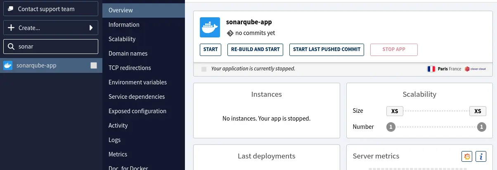
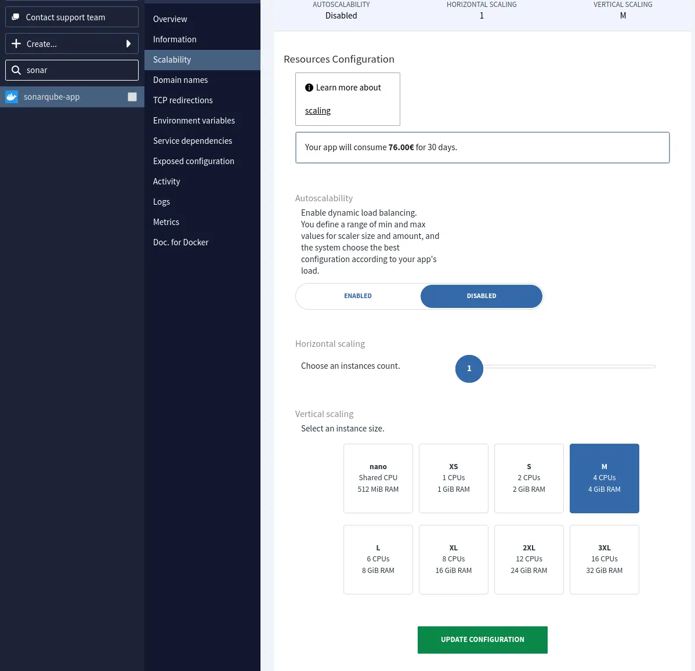
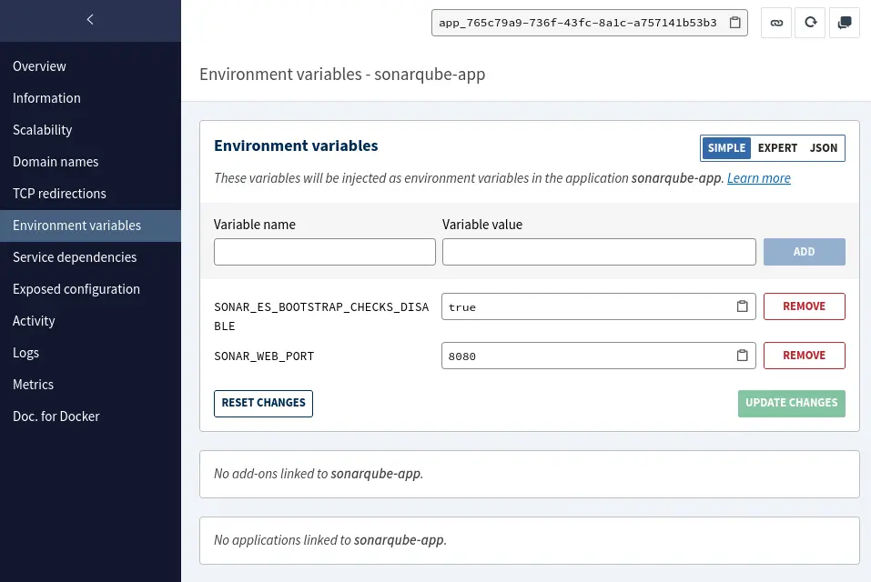
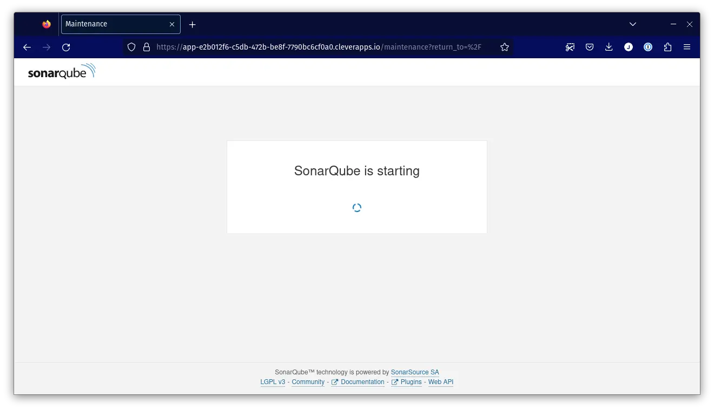
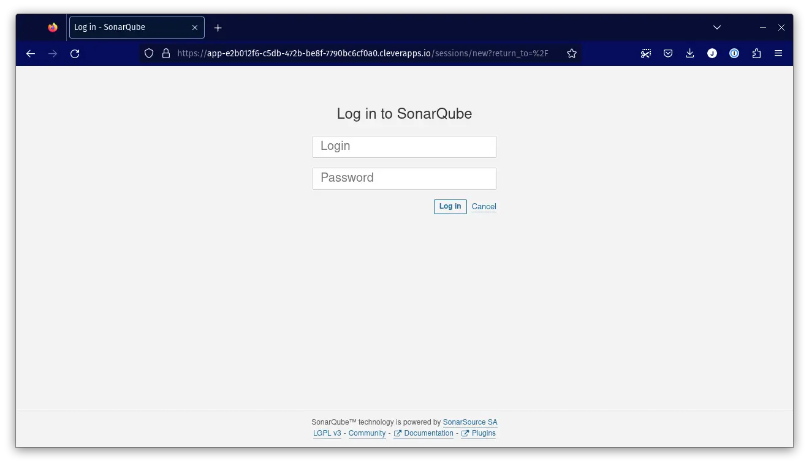
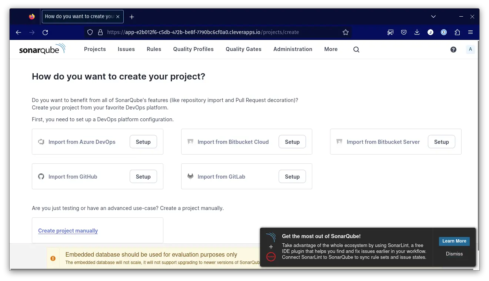
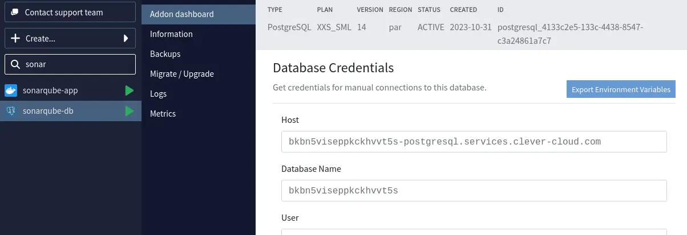
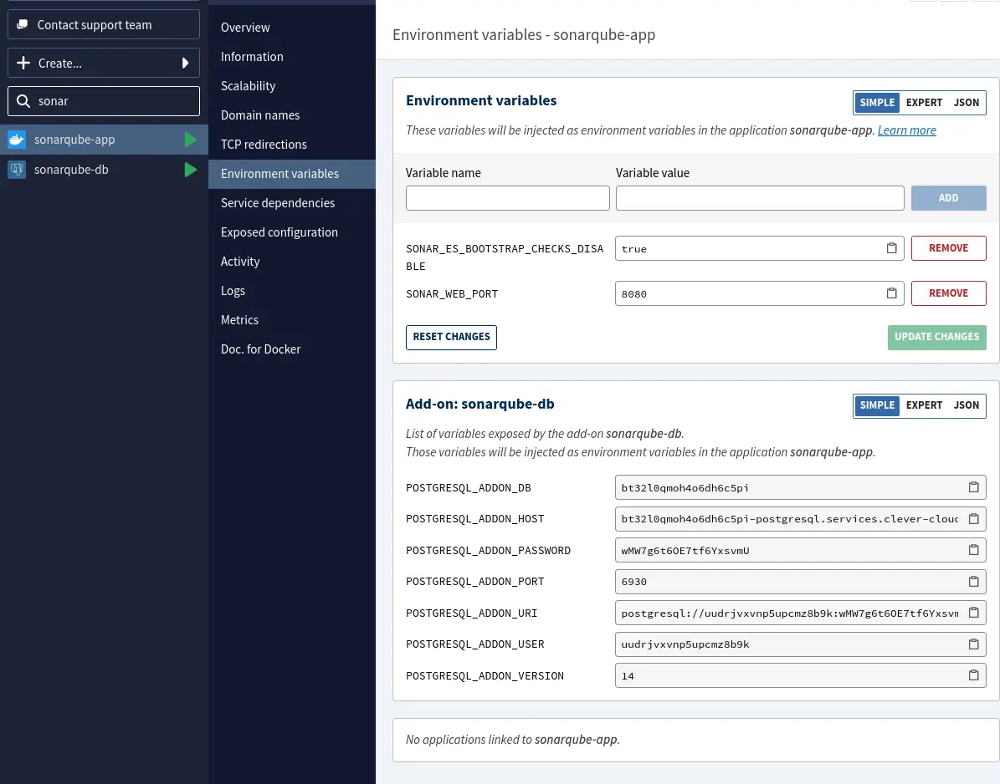

Dans cet article, nous allons voir comment déployer _SonarQube_ sur _Clever Cloud_ en deux temps. Le premier consistera en un déploiement très simple, qui est équivalent à une installation locale. Dans un second temps, nous utiliserons une base de données _PostgreSQL_ externalisée pour assurer la persistance des données.

Cet article suppose que vous avez déjà un compte actif sur _Clever Cloud_, et que votre CLI est installé et configuré.
L'installation du CLI est décrite dans [la documentation de _Clever Cloud_](https://www.clever-cloud.com/doc/getting-started/cli/).

# Le déploiement simple

La [documentation _SonarQube_](https://docs.sonarsource.com/sonarqube/latest/try-out-sonarqube/#installing-a-local-instance-of-sonarqube) propose de déployer une instance locale en utilisant la commande suivante&nbsp;:

```bash
$ docker container run -d \
  --name sonarqube \
  -e SONAR_ES_BOOTSTRAP_CHECKS_DISABLE=true \
  -p 9000:9000 \
  sonarqube:latest
```

_SonarQube_ fournit une [image _Docker_](https://hub.docker.com/_/sonarqube) prête à l'emploi que nous allons utiliser. Nous utiliserons le tag _Docker_ `10-community` pour nous assurer de rester sur la version majeure `10`.

La variable d'environnement `SONAR_ES_BOOTSTRAP_CHECKS_DISABLE` permet à _SonarQube_ d'ignorer les contrôles de démarrage du processus _Elasticsearch_ embarqué dans son serveur.

_SonarQube_ écoute par défaut sur le port `9000`.

Ces informations nous seront utiles par la suite&nbsp;!

## Création de l'application dans _Clever Cloud_

Nous allons tout d'abord créer un _repository_ Git qui hébergera notre code (et nos scripts si besoin), et qui sera utilisé par le CLI `clever` pour nos déploiements.

```bash
$ git init
```

Créer une application dans _Clever Cloud_ consiste en une ligne de commande&nbsp;:

```bash
$ clever create \
  --type docker \
  sonarqube-app

Your application has been successfully created!
```

Si vous déployez votre code dans une organisation, ajoutez le paramètre `--org` à votre ligne de commande&nbsp;:

```bash
$ clever create \
  --type docker \
  --org orga_a4fdf186-bcaa-4d9f-9249-b09d57bf4beb \
  sonarqube-app

Your application has been successfully created!
```

L'application ainsi créée apparaît dans la console _Clever Cloud_&nbsp;:



La commande `clever create` génère un fichier `.clever.json` dans notre répertoire courant qui contient les informations de notre application, en particulier son identifiant.

```json
{
  "apps": [
    {
      "app_id": "app_765c79a9-e316-460b-a75a-054738784efd",
      "org_id": "orga_a4fdf186-bcaa-4d9f-9249-b09d57bf4beb",
      "deploy_url": "https://push-n3-par-clevercloud-customers.services.clever-cloud.com/app_765c79a9-e316-460b-a75a-054738784efd.git",
      "name": "sonarqube-app",
      "alias": "sonarqube-app"
    }
  ]
}
```

Ce fichier peut être archivé dans _repository_ Git&nbsp;:

```bash
$ git add .clever.json && git commit -m "👷 : add .clever.json"
```

## Dimensionnement de l'instance

_SonarQube_ a besoin d'au moins 2&nbsp;Go de RAM pour fonctionner ainsi que 1&nbsp;Go de RAM disponible sur l'OS, nous allons donc utiliser une instance `M` qui disposera de 4&nbsp;Go de RAM au total.

La modification du type d'instance se fait également en une ligne de commande&nbsp;:

```bash
$ clever scale --flavor M

App rescaled successfuly
```

Une fois la commande exécutée, la modification est visible dans l'onglet _Scalability_ de l'application&nbsp;:



## Configuration des variables d'environnement

_Clever Cloud_ requiert que les applications déployées écoutent sur le port `8080`.

Nous avons également vu précédemment que par défaut _SonarQube_ écoute sur le port `9000`.

La configuration de notre instance _SonarQube_ peut se faire avec des variables d'environnement ([doc](https://docs.sonarsource.com/sonarqube/latest/setup-and-upgrade/configure-and-operate-a-server/environment-variables/)).

Nous allons donc configurer la variable d'environnement `SONAR_WEB_PORT` avec la valeur `8080`.
Nous allons également en profiter pour configurer la variable `SONAR_ES_BOOTSTRAP_CHECKS_DISABLE` qui était précisée dans la ligne de lancement `docker` issue de la documentation _SonarQube_.
Pour configurer ces variables, nous utilisons la commande `clever env set`&nbsp;:

```bash
$ clever env set SONAR_WEB_PORT 8080

Your environment variable has been successfully saved

$ clever env set SONAR_ES_BOOTSTRAP_CHECKS_DISABLE true

Your environment variable has been successfully saved
```

Les variables d'environnement configurées sont visibles sur la console _Clever Cloud_, dans l'onglet _Environment Variables_&nbsp;:



## Déploiement de l'image _Docker_

Une fois notre application créée et configurée, il nous faut la déployer.

Nous créons un simple `Dockerfile` dans notre _repository_&nbsp;:

```docker
FROM sonarqube:10-community
```

Puis nous déployons l'application en créant un _commit_, et en faisant un `clever deploy`&nbsp;:

```bash
$ git add Dockerfile && git commit -m "🐋 : init Dockerfile"
$ clever deploy

App is brand new, no commits on remote yet
New local commit to push is 371a4224151b9e9bb8888a403a9626c88a0b1312 (from refs/heads/main)
Pushing source code to Clever Cloud…
Your source code has been pushed to Clever Cloud.
Waiting for deployment to start…
Deployment started (deployment_a13a283f-5e63-45da-b675-666603212a18)
Waiting for application logs…

[...]

2023-10-31T09:16:39.007Z: 2023.10.31 09:16:37 INFO  ce[][o.s.s.p.ServerFileSystemImpl] SonarQube home: /opt/sonarqube
2023-10-31T09:16:39.007Z: 2023.10.31 09:16:37 INFO  ce[][o.s.c.c.CePluginRepository] Load plugins
2023-10-31T09:16:39.007Z: 2023.10.31 09:16:38 INFO  ce[][o.s.c.c.ComputeEngineContainerImpl] Running Community edition
2023-10-31T09:16:39.007Z: 2023.10.31 09:16:38 INFO  ce[][o.s.ce.app.CeServer] Compute Engine is started
2023-10-31T09:16:39.007Z: 2023.10.31 09:16:38 INFO  app[][o.s.a.SchedulerImpl] Process[ce] is up
2023-10-31T09:16:39.007Z: 2023.10.31 09:16:38 INFO  app[][o.s.a.SchedulerImpl] SonarQube is operational

Deployment successful
```

Le message `Deployment successful` indique que notre instance est bien démarrée&nbsp;!

Nous pouvons maintenant ouvrir notre instance de _SonarQube_ avec la commande&nbsp;:

```bash
$ clever open

Opening the application in your browser
```

La page de démarrage de _SonarQube_ s'ouvre&nbsp;:



Quelques instants plus tard, une fois que l'instance _SonarQube_ est complètement démarrée, la page de _login_ s'affiche&nbsp;:



Nous nous loguons avec les identifiants par défaut `admin` / `admin`, puis nous changeons le mot de passe du compte `admin`.
Une fois ces étapes effectuées, la page d'accueil de notre instance _SonarQube_ s'affiche&nbsp;:



Le message affiché en bas de page nous indique que notre déploiement est, certes, fonctionnel, mais non adapté à un usage en production. Nous allons donc maintenant utiliser une base de données externalisée.

# Externaliser la base de données

Une base de données externalisée va permettre de rendre nos données persistantes.
_SonarQube_ est compatible avec les bases de données _PostgreSQL_, _SQL Server_ et _Oracle_.

_Clever Cloud_ propose diverses bases de données dans la section _Add-On_ de la console, ou _via_ les commandes CLI `clever addon`. _PostgreSQL_ fait partie des bases de données supportées, ce qui est parfait pour notre instance de _SonarQube_&nbsp;!

## Créer l'_addon_ _PostgreSQL_

Pour lister les _addons_ disponibles, nous utilisons la commande `clever addon providers`, ce qui va nous permettre de récupérer l'identifiant de l'_addon_ _PostgreSQL_&nbsp;:

```bash
$ clever addon providers

addon-matomo      Matomo Analytics                Matomo is a web analytics application as a service.
addon-pulsar      Pulsar                          Namespace with all Pulsar possibilities
cellar-addon      Cellar S3 storage               S3-like online file storage web service
config-provider   Configuration provider          Expose configuration to your applications  (via environment variables)
es-addon          Elastic Stack                   Elasticsearch with Kibana and APM server as options
fs-bucket         FS Buckets                      Persistent file system for your application
jenkins           Jenkins                         Automation & CI with Clever Cloud runners
mailpace          MailPace - Transactional Email  Fast & Reliable Transactional Email
mongodb-addon     MongoDB                         A noSQL document-oriented database
mysql-addon       MySQL                           An open source relational database management system
postgresql-addon  PostgreSQL                      A powerful, open source object-relational database system
redis-addon       Redis                           Redis by Clever Cloud is an in-memory key-value data store, powered by Clever Cloud
```

L'_addon_ que nous allons utiliser est donc nommé `postgresql-addon`.

Nous listons ensuite les différentes versions de l'_addon_ _PostgreSQL_, et ses plans de facturation&nbsp;:

```bash
$ clever addon providers show postgresql-addon

PostgreSQL: A powerful, open source object-relational database system

Available regions: jed, mtl, par, rbx, rbxhds, scw, sgp, syd, wsw

Available plans
Plan dev
  Backups: Daily - 7 Retained
  Logs: No
  Max DB size: 256 MB
  Max connection limit: 5
  Memory: Shared
  Metrics: No
  Migration Tool: Yes
  Type: Shared
  vCPUS: Shared
Plan xxs_sml
  Backups: Daily - 7 Retained
  Logs: Yes
  Max DB size: 1 GB
  Max connection limit: 45
  Memory: 512 MB
  Metrics: Yes
  Migration Tool: Yes
  Type: Dedicated
  vCPUS: 1
  Available versions: 10, 11, 12, 13, 14 (default), 15
  Options for version 10:
    encryption: default=false
  Options for version 11:
    encryption: default=false
  Options for version 12:
    encryption: default=false
  Options for version 13:
    encryption: default=false
  Options for version 14:
    encryption: default=false
  Options for version 15:
    encryption: default=false
[...]
```

Le plan _xxs_sml_ est le plus petit plan avec des ressources dédiées. 1&nbsp;CPU, 512&nbsp;Mo de RAM et 1&nbsp;Go de stockage sont suffisants pour démarrer, sachant que le plan pourra être modifié à tout instant si besoin.

Nous pouvons maintenant créer notre _addon_ avec la commande `clever addon create`&nbsp;:

```bash
$ clever addon create \
  --plan xxs_sml \
  --org orga_a4fdf186-bcaa-4d9f-9249-b09d57bf4beb \
  postgresql-addon \
  sonarqube-db

Addon sonarqube-db (id: addon_2cc8bfaf-8800-43ef-87a0-4f162be73f2e) successfully created
```

Une fois la commande exécutée, notre base de données apparaît dans la console&nbsp;:



Nous pouvons ensuite lier notre base de données avec notre application. Ce lien va permettre de partager des variables d'environnement entre la base de données et notre application&nbsp;:

```bash
$ clever service link-addon sonarqube-db

Addon sonarqube-db successfully linked
```

Une fois l'application liée à la base de données, les variables d'environnement de la base de données apparaissent dans l'onglet _Environment Variables_ de notre application&nbsp;:



## Reconfigurer notre instance _SonarQube_

Notre addon _Clever Cloud_ expose des variables d'environnement _POSTGRESQL_ADDON_ qui vont nous servir pour configurer notre instance de _SonarQube_.
Cependant, _SonarQube_ se configure avec les variables d'environnement suivantes&nbsp;:

```
SONAR_JDBC_USERNAME
SONAR_JDBC_PASSWORD
SONAR_JDBC_URL
```

L'URL JDBC suit un schéma précis, qui est `jdbc:<driver>://<host>:<port>/<db>`. _Clever Cloud_ expose une variable d'environnement pour les `host`, `port` et `db`, donc nous pouvons calculer notre variable `SONAR_JDBC_URL` en utilisant ces variables. Voici donc la liste des variables fournies par l'_addon_ que nous allons utiliser&nbsp;:

```env
# pour SONAR_JDBC_USERNAME
POSTGRESQL_ADDON_USER
# pour SONAR_JDBC_PASSWORD
POSTGRESQL_ADDON_PASSWORD
# pour SONAR_JDBC_URL
POSTGRESQL_ADDON_HOST
POSTGRESQL_ADDON_PORT
POSTGRESQL_ADDON_DB
```

### Copie des variables d'environnement



Malheureusement, ni _SonarQube_ ni _Clever Cloud_ ne supporte de renommer ses variables d'environnement, ou de les interpoler.
Nous devons donc créer les variables d'environnement _SONAR_ avec des valeurs en dur, issues des variables d'environnement _POSTGRESQL_ADDON_.

Notez que cette approche implique que notre application doit être reconfigurée en cas de changement de variables d'environnement, ce qui n'est pas idéal.

Nous allons donc dans un premier temps récupérer les variables d'environnement de notre application, et les stocker dans un fichier avec la commande `clever env`. Nous chargeons ensuite le fichier créé avec la commande `source` pour avoir les variables d'environnement disponibles dans notre _shell_&nbsp;:

```bash
$ clever env --add-export > clever-env-vars.sh

$ source clever-env-vars.sh

$ echo $POSTGRESQL_ADDON_USER
u6qkhfs3dduj1rrlra99
```

Les commandes suivantes permettent de configurer la connexion à notre base de données avec les variables d'environnement _SONAR_&nbsp;:

```bash
$ clever env set SONAR_JDBC_USERNAME $POSTGRESQL_ADDON_USER
$ clever env set SONAR_JDBC_PASSWORD $POSTGRESQL_ADDON_PASSWORD
$ clever env set SONAR_JDBC_URL "jdbc:postgresql://${POSTGRESQL_ADDON_HOST}:${POSTGRESQL_ADDON_PORT}/${POSTGRESQL_ADDON_DB}"
```

Pour déployer notre instance avec sa nouvelle configuration, il faut simplement redémarrer l'application avec la commande `clever restart`&nbsp;:

```bash
$ clever restart
```

Une fois _SonarQube_ redémarré, il nous demande à nouveau de changer le mot de passe de l'utilisateur `admin` puisque le précédent mot de passe a été stocké dans la base de données embarquée, et donc perdu à la migration.

### Script de démarrage customisé



Malheureusement, ni _SonarQube_ ni _Clever Cloud_ ne supporte de renommer ses variables d'environnement, ou de les interpoler.
Nous allons donc ajouter un script dans notre image _Docker_ pour retravailler nos variables d'enviroonement.

L'image _Docker_ de _SonarQube_ utilise pour `ENTRYPOINT` un script nommé `/opt/sonarqube/docker/entrypoint.sh`.

Notre script que nous appelons `clever-entrypoint.sh` va donc positionner les variables d'environnement nécessaires au démarrage de _SonarQube_ et rappeler le script de _SonarQube_ &nbsp;:

```bash
#!/bin/sh

export SONAR_JDBC_USERNAME=$POSTGRESQL_ADDON_USER
export SONAR_JDBC_PASSWORD=$POSTGRESQL_ADDON_PASSWORD
export SONAR_JDBC_URL="jdbc:postgresql://${POSTGRESQL_ADDON_HOST}:${POSTGRESQL_ADDON_PORT}/${POSTGRESQL_ADDON_DB}"

exec /opt/sonarqube/docker/entrypoint.sh
```

Nous ajoutons ce script dans le répertoire `/opt/sonarqube/docker` au niveau de notre `Dockerfile`, nous modifions l'`ENTRYPOINT` de notre image pour pointer vers notre script&nbsp;:

```docker
FROM sonarqube:10-community

ADD clever-entrypoint.sh /opt/sonarqube/docker/

ENTRYPOINT ["/opt/sonarqube/docker/clever-entrypoint.sh"]
```

Un `git commit` suivi d'un `clever deploy` nous permettent de mettre à jour notre application avec le script embarqué et de pointer vers notre base de données.

```bash
$ git add Dockerfile clever-entrypoint.sh

$ git commit -m "🔧 : add custom entrypoint for Clever Cloud"

$ clever deploy
```

Une fois _SonarQube_ redémarré, il nous demande à nouveau de changer le mot de passe de l'utilisateur `admin` puisque le précédent mot de passe a été stocké dans la base de données embarquée, et donc perdu à la migration.

# Conclusion

Il est relativement facile de déployer _SonarQube_ sur _Clever Cloud_. L'image _Docker_ fournie par _SonarQube_ nous permet de démarrer rapidement une instance.

Les bases de données proposées par _Clever Cloud_ sont également pratiques pour démarrer rapidement. Cependant, le manque de souplesse de _SonarQube_ dans sa configuration et l'impossibilité de renommer des variables d'environnement sur _Clever Cloud_ rendent la dernière étape de la configuration peu pratique et peu robuste. Un peu de scripting permet de rendre cette étape plus propre.

Pour exécuter l'infrastructure proposée dans cet article, il vous en coûtera environ 81,25&nbsp;€/mois&nbsp;:

| article                      | prix/mois   |
| ---------------------------- | ----------- |
| PostgreSQL - XXS Small Space | 5,25&nbsp;€ |
| Node Docker - Plan M         | 76&nbsp;€   |

À titre de comparaison, un container de 4&nbsp;CPU et 4&nbsp;Go de RAM sur GCP Cloud Run coûte 174&nbsp;€/mois, avec l'option _CPU always allocated_ requise par _SonarQube_ pour exécuter ses traitements en arrière-plan. Cela fait de _Clever Cloud_ un excellent choix économique&nbsp;!


# Liens et références

* Les scripts de cet article sur [Github](https://github.com/juwit/sonarqube-clever-cloud).
* Photo de couverture par [Stephan Widua](https://unsplash.com/@stewi?utm_content=creditCopyText&utm_medium=referral&utm_source=unsplash) sur [Unsplash](https://unsplash.com/photos/white-satellite-dish-under-blue-sky-during-night-time-3YAIvBNlZM4?utm_content=creditCopyText&utm_medium=referral&utm_source=unsplash)