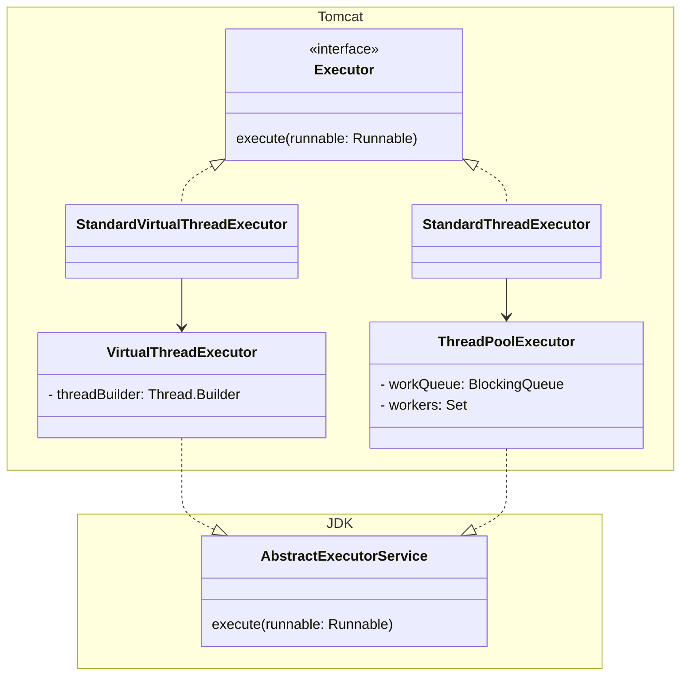

```mermaid
classDiagram
namespace Tomcat {
    class Executor{
        <<interface>>
        execute(runnable: Runnable)
    }
    class StandardThreadExecutor
    class StandardVirtualThreadExecutor

    class VirtualThreadExecutor {
        - threadBuilder: Thread.Builder
    }
    class ThreadPoolExecutor {
        - workQueue: BlockingQueue<Runnable>
        - workers: Set<Thead>
    }

}

namespace JDK {
    class AbstractExecutorService {
        execute(runnable: Runnable)
    }
}

Executor <|.. StandardThreadExecutor
Executor <|.. StandardVirtualThreadExecutor

StandardVirtualThreadExecutor --> VirtualThreadExecutor
VirtualThreadExecutor ..|> AbstractExecutorService

StandardThreadExecutor --> ThreadPoolExecutor
ThreadPoolExecutor ..|> AbstractExecutorService
```