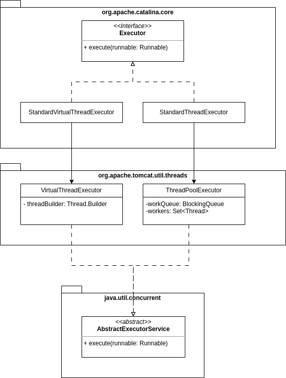

Apache Tomcat est le plus célèbre des conteneurs de Servlets Java.
Les versions se succèdent au fil des années. Avec Spring Boot, et son utilisation de la version &laquo;embedded&raquo;, son usage en tant que serveur &laquo;installé&raquo; a diminué, mais il reste encore au cœur de la majorité de nos micro-services, parfois sans que les développeurs s'en rendent compte.

Chaque version majeure de Tomcat apporte le support des nouvelles versions des API `Java EE` ou `JEE`.

La version ayant eu le plus d'impact sur les développeurs est la version 10, qui a intégré le support des API `jakarta`, en remplacement des anciennes API `javax`. Cette version 10 de Tomcat était liée à Java&nbsp;11, dans laquelle la suppression des packages `javax` liés à Java&nbsp;EE a eu lieu. Les modules supprimés sont documentés dans la [JEP&nbsp;320](https://openjdk.org/jeps/320). On y retrouve les tristement célèbres `java.xml.bind`, `javax.transaction` et `javax.activation`, qui ont donné du fil à retordre aux développeurs souhaitant migrer leurs applications.

Les versions de Tomcat sont donc à chaque fois compatibles avec une version minimale de Java, et des API `jakarta`.
Le tableau ci-dessous reprend la liste des versions compatibles&nbsp;:

| **Servlet Spec** | **Apache Tomcat Version** | **Supported Java Versions** | **Release date** |
| ---------------- | ------------------------- | --------------------------- | ---------------- |
| 6.1              | 11.0.x                    | 21 and later                | (version alpha)  |
| 6.0              | 10.1.x                    | 11 and later                | dec. 2020        |
| 4.0              | 9.0.x                     | 8 and later                 | oct. 2017        |
| 3.1              | 8.5.x                     | 7 and later                 | jan. 2014        |
| 3.0              | 7.0.x (archived)          | 6 and later                 | jan. 2011        |

La version 11 de Tomcat est donc destinée à la version 21 de Java.
Cette stratégie n'est pas surprenante en soi, la version 21 étant la dernière version LTS à date.

Même si Tomcat&nbsp;11 n'est pas encore en version finale, les travaux pour son développement durent depuis déjà plus d'un an à l'écriture de ces lignes. La première version _milestone_ de Tomcat&nbsp;11 a été publiée en décembre 2022&nbsp;!
La première version était prévue pour supporter Java&nbsp;11 (cf. la [_release note_ Tomcat 11.0.0-M1](https://archive.apache.org/dist/tomcat/tomcat-11/v11.0.0-M1/RELEASE-NOTES)).
La version Java&nbsp;17 a ensuite été choisie à partir de la _milestone_&nbsp;3 de Tomcat&nbsp;11 (cf. la [_release note_ Tomcat 11.0.0-M3](https://archive.apache.org/dist/tomcat/tomcat-11/v11.0.0-M3/RELEASE-NOTES)).
La version 21 a été choisie à partir de la _milestone_&nbsp;7 de Tomcat&nbsp;11, publiée en juin&nbsp;2023, soit 3&nbsp;mois avant la sortie de Java&nbsp;21 (cf. la [_release note_ Tomcat 11.0.0-M7](https://archive.apache.org/dist/tomcat/tomcat-11/v11.0.0-M7/RELEASE-NOTES)).

La version actuelle est la _milestone_&nbsp;16, publiée le 9&nbsp;janvier&nbsp;2024. C'est cette version qui sera testée dans cet article.

Un des principaux avantages de cette version 11, avec le support de Java&nbsp;21, est le support des _Virtual Threads_. Bien que le code nécessaire ait été ajouté à Tomcat en version&nbsp;10.1, on peut considérer que le support n'était qu'expérimental, puisque les _Virtual Threads_ n'ont été intégrés qu'en version _preview_ à partir de Java&nbsp;19, et en version finale en Java&nbsp;21.

## C'est quoi les _Virtual Threads_&nbsp;?

Avant d'explorer l'implémentation de Tomcat et son usage des _Virtual Threads_, un rapide rappel de ce qu'ils sont et de la manière dont ils fonctionnent.

Les _Virtual Threads_ sont des _Thread_ dits &laquo;légers&raquo;, parfois appelés &laquo;Green Threads&raquo; ou &laquo;Routines/Coroutines&raquo; dans d'autres langages. Ils sont mis en opposition aux _Threads_ dits &laquo;Plateforme&raquo;. Les _Threads_ plateforme sont des _Threads_ gérés directement par le système d'exploitation.

> Une excellente conférence de José Paumard sur le projet Loom, qui introduit les _Virtual Threads_ en Java, est visible sur [Youtube](https://www.youtube.com/watch?v=v7DzKOniNh0). Cette vidéo est une très bonne introduction à ce sujet.

### Les _Threads_ Plateforme

Lorsqu'un programme demande la création d'un _Thread_, le système d'exploitation stoppe l'exécution du code et crée le _Thread_, avec sa mémoire attribuée, appelée la _Stack_. Il redonne ensuite la main au programme pour qu'il continue son exécution.
Ces deux étapes impliquent, à chaque fois, que le CPU sauvegarde l'état courant de l'exécution du programme, et le restaure ensuite. C'est ce qu'on appelle un _context switch_, un changement de contexte d'exécution.

Lors de la création d'un _Thread_, le système d'exploitation doit donc effectuer plusieurs _context switches_, et allouer un peu de mémoire au _Thread_. Ces étapes ont donc un coût, en temps et en mémoire.

#### Le coût en temps

Le temps de création d'un _Thread_ dépend principalement du système d'exploitation et de sa charge actuelle.
Pour mesurer ce temps, un _benchmark_ écrit avec l'outil [JMH](https://github.com/openjdk/jmh) (dont l'utilisation vaudrait un article à elle seule) permet d'estimer le temps de démarrage d'un _Thread_ Java sur une machine&nbsp;:

```java
@BenchmarkMode(Mode.AverageTime)
@OutputTimeUnit(TimeUnit.MILLISECONDS)
public class ThreadsBenchmark {

    @Benchmark
    public void computeInMainThread(){
        // un calcul quelconque
        Blackhole.consumeCPU(1024);
    }

    @Benchmark
    public void computeInPlatformThread() throws InterruptedException {
        // exécution dans un thread plateforme
        var thread = Thread.ofPlatform().start(() -> {
            Blackhole.consumeCPU(1024);
        });
        thread.join(); // attente de la fin de l'exécution
    }

    public static void main(String[] args) throws RunnerException {
        Options opt = new OptionsBuilder()
                .include(ThreadsBenchmark.class.getSimpleName())
                .warmupIterations(1) // une itération de préchauffage de la JVM
                .measurementIterations(3) // 3 itérations de mesure
                .forks(1)
                .build();

        new Runner(opt).run();
    }

}
```

Les deux méthodes annotées `@Benchmark` sont exécutées en boucle pendant 10&nbsp;secondes pour mesurer le temps moyen de leur exécution, et cela 4&nbsp;fois en tout&nbsp;: une première fois pour préchauffer la JVM (_warm-up_), et 3&nbsp;fois pour mesurer les performances réelles. La ligne `forks(1)` permet de préciser de créer une JVM destinée à l'exécution des tests.

La première méthode effectue un calcul ô combien inutile, à travers la classe `Blackhole` fournie par JMH. La seconde méthode effectue ce même calcul, mais dans un _Thread_ plateforme et attend la fin de son exécution. De cette manière, on peut extrapoler le surcoût de l'exécution de la tâche dans un _Thread_, surcoût qui comprend donc la création du _Thread_, et sa suppression.

Le résultat de l'exécution du _benchmark_ est le suivant&nbsp;:

```bash
Benchmark                                 Mode  Cnt  Score    Error  Units
ThreadsBenchmark.computeInMainThread      avgt    3  0.002 ±  0.001  ms/op
ThreadsBenchmark.computeInPlatformThread  avgt    3  0.038 ±  0.015  ms/op
```

On observe que le `Blackhole.consumeCPU(1024)` du premier _benchmark_ s'exécute en moyenne en 0,002&nbsp;millisecondes. L'exécution de la même instruction dans un _Thread_ plateforme se fait en 0,038&nbsp;millisecondes. Le surcoût lié à la création et destruction du _Thread_ est donc de 0,036&nbsp;millisecondes.

> Créer un _Thread_ pour effectuer un calcul peut donc être contre-productif&nbsp;! 😱

#### Le coût en mémoire

Le coût en mémoire d'un _Thread_ est connu à l'avance et contrôlé par les paramètres `-Xss` ou `-XX:ThreadStackSize` de la JVM. Cependant, attention aux confusions. On parle bien ici de mémoire réservée, et non pas de mémoire effectivement utilisée. Pour un_Thread_qui ne remplit pas sa _Stack_, sa consommation réelle sera bien moindre.

La commande suivante permet de constater les valeurs par défaut de la mémoire d'un _Thread_ Java&nbsp;:

```bash
$ java -XX:+PrintFlagsFinal --version | grep -i ThreadStack

intx CompilerThreadStackSize = 1024 {pd product} {default}
intx ThreadStackSize         = 1024 {pd product} {default}
intx VMThreadStackSize       = 1024 {pd product} {default}
```

La valeur est exprimée en kilo-octets. Un _Thread_ réservera donc 1&nbsp;024&nbsp;ko de RAM, soit 1&nbsp;Mo. 200&nbsp;_Threads_ réserveront donc 200&nbsp;Mo de RAM native, en plus de la RAM allouée à la _heap_ Java.

### Les _Virtual Threads_

Les _Virtual Threads_ sont créés, orchestrés et exécutés directement par la JVM, qui se charge de gérer leur _Stack_ et leur exécution de manière interne. La création d'un _Virtual Thread_ n'implique donc pas forcément la création d'un _Thread_ plateforme.
Le coût de création d'un _Virtual Thread_ est donc bien inférieur au coût d'un _Thread_ plateforme, puisqu'il ne nécessite pas de _context switch_, ni d'allocation d'un bloc de mémoire.

On peut mesurer le coût temporel de la création d'un _Virtual Thread_ en ajoutant cette méthode à notre _benchmark_ précédent&nbsp;:

```java
@Benchmark
public void computeInVirtualThread() throws InterruptedException {
    var thread = Thread.ofVirtual().start(() -> {
        Blackhole.consumeCPU(1024);
    });
    thread.join();
}
```

Notez l'usage de `Thread.ofVirtual()` pour créer un _Virtual Thread_ en lieu et place du `Thread.ofPlatform()`.

Les durées d'exécution observées sont les suivantes&nbsp;:

```bash
Benchmark                                 Mode  Cnt  Score    Error  Units
ThreadsBenchmark.computeInMainThread      avgt    3  0.002 ±  0.001  ms/op
ThreadsBenchmark.computeInPlatformThread  avgt    3  0.037 ±  0.013  ms/op
ThreadsBenchmark.computeInVirtualThread   avgt    3  0.005 ±  0.002  ms/op
```

Le _benchmark_ utilisant les _Virtual Threads_ présente un surcoût d'exécution de 0,003&nbsp;millisecondes par rapport à l'exécution dans le _Thread_ principal, mais est largement inférieur au surcoût lié à l'exécution dans un _Thread_ plateforme.

> Le coût de création en temps d'un _Virtual Thread_ est donc 15&nbsp;fois inférieur à un _Thread_ plateforme.

Notez qu'avant l'avènement des _Virtual Threads_, le problème du coût de création des _Threads_ plateforme était souvent adressé par l'utilisation de _pools_ de _Threads_, qui permettent de réutiliser des _Threads_ existants (vive le recyclage ♻️), plutôt que de les recréer.

## L'implémentation de Tomcat



Dans le code de Tomcat, l'interface `Executor` décrit les objets qui ont pour responsabilité d'exécuter les requêtes entrantes. Depuis la version 10.1 de Tomcat, cette interface a deux implémentations. L'implémentation historique `StandardThreadExecutor`, qui s'appuie sur un _pool_ de _Threads_ _workers_ et une `BlockingQueue` de taille fixe pour les requêtes entrantes, et la nouvelle implémentation `StandardVirtualThreadExecutor` qui utilise un _Virtual Thread_ pour exécuter chaque requête entrante.

En fouillant dans le code de Tomcat, on peut observer cette implémentation dans la classe `VirtualThreadExecutor`, qui est utilisée par le `StandardVirtualThreadExecutor`&nbsp;:

```java
public class VirtualThreadExecutor extends AbstractExecutorService {

    private Thread.Builder threadBuilder;

    public VirtualThreadExecutor(String namePrefix) {
        threadBuilder = Thread.ofVirtual().name(namePrefix, 0);
    }

    @Override
    public void execute(Runnable command) {
        if (isShutdown()) {
            throw new RejectedExecutionException();
        }
        threadBuilder.start(command);
    }
}
```

> Il est par ailleurs surprenant que Tomcat ait choisi de développer son propre `ExecutorService`, au lieu d'utiliser celui construit par `Executors.newVirtualThreadPerTaskExecutor()`. Il semble que ce choix soit lié à la gestion de l'arrêt de l'`ExecutorService` qui est implémentée du côté du `ThreadPoolExecutor`.

## Le _benchmark_

Dans cette section, nous allons tester les performances de deux versions de Tomcat&nbsp;:

- la version&nbsp;10.1, sans support des _Virtual Threads_&nbsp;;
- la version&nbsp;11.0.0-M16, avec support des _Virtual Threads_ activés.

Pour monter l'environnement de test, j'ai installé une version 21 de Java, en particulier le _build_ _eclipse-temurin_ disponible chez [adoptium.net](https://adoptium.net/temurin/releases/?version=21)&nbsp;:

```bash
java --version
openjdk 21.0.1 2023-10-17 LTS
OpenJDK Runtime Environment Temurin-21.0.1+12 (build 21.0.1+12-LTS)
OpenJDK 64-Bit Server VM Temurin-21.0.1+12 (build 21.0.1+12-LTS, mixed mode, sharing)
```

J'ai aussi installé les versions 10 et 11 de Tomcat&nbsp;:

- la dernière version disponible de [Tomcat&nbsp;10](https://tomcat.apache.org/download-10.cgi), la 10.1.18&nbsp;;
- la dernière version disponible de [Tomcat&nbsp;11](https://tomcat.apache.org/download-11.cgi), la 11.0.0-M16.

Ma machine de test est équipée d'un CPU _11<sup>th</sup> Gen Intel(R) Core(TM) i7-1165G7 @ 2.80&nbsp;GHz_ et de 64&nbsp;Go de RAM (!).

Les JVM sont démarrées avec les options `-Xms512m -Xmx512m` pour positionner une taille de la _heap_ à 512&nbsp;Mo directement consommée.
L'option `-XX:NativeMemoryTracking=summary` permet d'observer la consommation mémoire de la JVM, pour analyser plus finement les tailles de mémoire réservées et consommées auprès du système d'exploitation.

```bash
export CATALINA_OPTS='-Xms512m -Xmx512m -XX:NativeMemoryTracking=summary'
```

> Je n'ai pas positionné de paramétrage propre au GC ou d'autres options, ce qui m'intéresse ce sont uniquement la consommation de RAM liée aux _Threads_ et les performances liées à des temps de réponse aux requêtes.

### La configuration de Tomcat&nbsp;11

Pour utiliser les _Virtual Threads_ dans Tomcat&nbsp;11, il faut paramétrer l'_Executor_ de Tomcat pour activer la classe qui instancie les _Virtual Threads_, en lieu et place de l'implémentation standard qui utilise un _pool_ de _Threads_ plateforme, et assigner l'_Executor_ au _Connector_ en charge d'écouter sur le port HTTP. Ce paramétrage n'est pas actif par défaut. Il se fait dans le fichier `settings.xml`, dans la balise `<Service>`, comme indiqué dans [la documentation](https://tomcat.apache.org/tomcat-11.0-doc/config/executor.html#Virtual_Thread_Implementation)&nbsp;:

```xml
<Service name="Catalina">

    <Executor
        name="virtualThreadsExecutor"
        className="org.apache.catalina.core.StandardVirtualThreadExecutor" />


    <Connector executor="virtualThreadsExecutor"
               port="8080" protocol="HTTP/1.1"
               connectionTimeout="20000"
               redirectPort="8443" />

    ...

</Service>
```

On paramètre donc le `StandardVirtualThreadExecutor` comme devant traiter les requêtes allouées au _Connector_ écoutant sur le port&nbsp;`8080`.

Aucune autre configuration n'est nécessaire sur le Tomcat&nbsp;11. Aucune configuration particulière n'est faite sur le Tomcat&nbsp;10.1 pour les tests.

### Les performances attendues

On s'attend, entre Tomcat&nbsp;10.1 et Tomcat&nbsp;11, avec l'utilisation des _Virtual Threads_, à avoir une empreinte mémoire réservée inférieure, ainsi que de meilleures performances à l'exécution des requêtes.
En principe, les _Virtual Threads_ utilisés par Tomcat&nbsp;11 ne devraient utiliser que quelques _Threads_ plateforme hôtes pour leur exécution, et donc limiter les _context switches_ en cas de charge importante.

### Démarrage et empreinte mémoire à vide

#### Tomcat&nbsp;10.1

Tomcat&nbsp;10.1 est démarré avec la commande `startup.sh`&nbsp;:

```bash
./startup.sh
Using CATALINA_BASE:   /opt/apache-tomcat-10.1.18
Using CATALINA_HOME:   /opt/apache-tomcat-10.1.18
Using CATALINA_TMPDIR: /opt/apache-tomcat-10.1.18/temp
Using JRE_HOME:        /opt/jdk-21.0.2+13
Using CLASSPATH:       /opt/apache-tomcat-10.1.18/bin/bootstrap.jar:/opt/apache-tomcat-10.1.18/bin/tomcat-juli.jar
Using CATALINA_OPTS:   -Xms512m -Xmx512m -XX:NativeMemoryTracking=summary
Tomcat started.
```

La récupération de l'empreinte mémoire de notre Tomcat se fait à l'aide des commandes `jps` et `jcmd`&nbsp;:

```bash
# listing des JVM en cours d'exécution
$ jps -l

# récupération directe de l'identifiant lié à Tomcat
$ jps -l | grep -v 'jps' | cut -d ' ' -f 1
# récupération de l'empreinte mémoire
$ jcmd $(jps -l | grep -v 'jps' | cut -d ' ' -f 1) VM.native_memory

Native Memory Tracking:

(Omitting categories weighting less than 1KB)

Total: reserved=2014475KB, committed=635935KB
       malloc: 26831KB #72747
       mmap:   reserved=1987644KB, committed=609104KB

-                 Java Heap (reserved=524288KB, committed=524288KB)
                            (mmap: reserved=524288KB, committed=524288KB)

-                    Thread (reserved=42108KB, committed=2792KB)
                            (thread #41)
                            (stack: reserved=41984KB, committed=2668KB)
                            (malloc=78KB #251) (peak=89KB #261)
                            (arena=46KB #80) (peak=317KB #52)

```

On observe que notre _Heap_ est bien réservée à 512&nbsp;Mo (524&nbsp;288&nbsp;KB), et que 41&nbsp;_Threads_ ont été démarrés (dont les 25&nbsp;_Threads_ liés à notre `Executor`), pour une consommation de 41&nbsp;Mo supplémentaires. Nous avons un total de mémoire consommée de près de 630&nbsp;Mo, car d'autres espaces sont réservés par la JVM (espaces de code, etc.).

En générant un peu de charge sur les applications exemples par défaut, on force Tomcat à instancier les _Threads_ supplémentaires pour atteindre les 200&nbsp;_Threads_.

La charge est générée avec la commande [`hey`](https://github.com/rakyll/hey), en utilisant 400 workers pour envoyer un million de requêtes à la _Servlet_ d'exemple.

```bash
$ hey -c 400 -n 1000000 http://localhost:8080/examples/servlets/servlet/HelloWorldExample
```

On récupère ensuite l'empreinte mémoire de notre Tomcat pour observer les nouvelles valeurs&nbsp;:

```bash
$ jcmd $(jps -l | grep -v 'jps' | cut -d ' ' -f 1) VM.native_memory

Native Memory Tracking:

(Omitting categories weighting less than 1KB)

Total: reserved=2214510KB, committed=671762KB
       malloc: 32306KB #93366
       mmap:   reserved=2182204KB, committed=639456KB

-                 Java Heap (reserved=524288KB, committed=524288KB)
                            (mmap: reserved=524288KB, committed=524288KB)

-                    Thread (reserved=237307KB, committed=24319KB)
                            (thread #231)
                            (stack: reserved=236544KB, committed=23556KB)
                            (malloc=494KB #1403) (peak=506KB #1413)
                            (arena=269KB #460) (peak=317KB #52)
```

On observe que le nombre de _Threads_ est passé à 231, et qu'on a maintenant plus de 230&nbsp;Mo réservés pour les _Threads_.

#### Tomcat&nbsp;11

Comme pour Tomcat&nbsp;10.1, Tomcat&nbsp;11 est démarré&nbsp;:

```bash
$ ./bin/startup.sh
Using CATALINA_BASE:   /opt/apache-tomcat-11.0.0-M16
Using CATALINA_HOME:   /opt/apache-tomcat-11.0.0-M16
Using CATALINA_TMPDIR: /opt/apache-tomcat-11.0.0-M16/temp
Using JRE_HOME:        /opt/jdk-21.0.2+13
Using CLASSPATH:       /opt/apache-tomcat-11.0.0-M16/bin/bootstrap.jar:/opt/apache-tomcat-11.0.0-M16/bin/tomcat-juli.jar
Using CATALINA_OPTS:   -Xms512m -Xmx512m -XX:NativeMemoryTracking=summary
Tomcat started.
```

La consommation mémoire observée&nbsp;:

```bash
$ jcmd $(jps -l | grep -v 'jps' | cut -d ' ' -f 1) VM.native_memory

Native Memory Tracking:

(Omitting categories weighting less than 1KB)

Total: reserved=2004350KB, committed=635010KB
       malloc: 26946KB #72371
       mmap:   reserved=1977404KB, committed=608064KB

-                 Java Heap (reserved=524288KB, committed=524288KB)
                            (mmap: reserved=524288KB, committed=524288KB)

-                    Thread (reserved=31835KB, committed=1719KB)
                            (thread #31)
                            (stack: reserved=31744KB, committed=1628KB)
                            (malloc=57KB #191) (peak=67KB #201)
                            (arena=34KB #60) (peak=317KB #52)
```

On observe qu'à froid, moins de _Threads_ sont alloués au démarrage, seulement 31 au lieu des 41 _Threads_ démarrés par Tomcat&nbsp;10.1.

Après avoir passé une charge identique au test du Tomcat&nbsp;10.1, toujours avec la commande`hey`&nbsp;:

```bash
$ hey -c 400 -n 1000000 http://localhost:8080/examples/servlets/servlet/HelloWorldExample
```

On récupère à nouveau l'empreinte mémoire de Tomcat&nbsp;11&nbsp;:

```bash
$ jcmd $(jps -l | grep -v 'jps' | cut -d ' ' -f 1) VM.native_memory

Native Memory Tracking:

(Omitting categories weighting less than 1KB)

Total: reserved=2022976KB, committed=655120KB
       malloc: 37380KB #88191
       mmap:   reserved=1985596KB, committed=617740KB

-                 Java Heap (reserved=524288KB, committed=524288KB)
                            (mmap: reserved=524288KB, committed=524288KB)

-                    Thread (reserved=40054KB, committed=2798KB)
                            (thread #39)
                            (stack: reserved=39936KB, committed=2680KB)
                            (malloc=74KB #239) (peak=87KB #255)
                            (arena=44KB #76) (peak=317KB #52)

```

On observe que Tomcat a instancié quelques _Threads_ en plus, pour passer à 39 et on atteint donc les 39&nbsp;Mo de _stack_ alloués.
On économise donc pas loin de 200&nbsp;Mo comme attendu.

> Attention, cette mémoire est bien de la mémoire réservée, et non pas l'empreinte de la mémoire réelle consommée (dénommée _committed_). Les OS utilisent des mécanismes de mémoire virtuelle qui permettent de promettre de la mémoire à un _process_ qui la demande, même si la mémoire n'est pas disponible physiquement. Cette mémoire n'est pas écrite sur la RAM tant qu'elle n'est pas réellement consommée.

Comme on pouvait s'y attendre, l'empreinte de la mémoire réservée par Tomcat pour les _Threads_ est plus faible. Cependant, comme cette mémoire n'est pas utilisée, l'impact sur les performances est faible. L'intérêt des _Virtual Threads_ ne réside pas principalement dans cette éventuelle économie.

### Performances avec une Servlet simple

Pour mesurer les performances de Tomcat&nbsp;10 et 11, j'utilise la commande `hey`, pour exécuter 1&nbsp;million de requêtes, dans 400&nbsp;_workers_ différents.

> Notez que je lance cette commande sur la même machine que ma machine de test, ce qui n'est clairement pas idéal, mais c'est suffisant pour ces tests.

Je requête la Servlet `HelloWorldExample`, qui est fournie avec Tomcat. Cette Servlet affiche simplement une page web contenant le message _Hello World_.

#### Tomcat&nbsp;10.1 - Threads Plateforme

```
hey -c 400 -n 1000000 http://localhost:8080/examples/servlets/servlet/HelloWorldExample

Summary:
  Total:	8.4899 secs
  Slowest:	0.0997 secs
  Fastest:	0.0000 secs
  Average:	0.0034 secs
  Requests/sec:	117787.3647

  Total data:	387000000 bytes
  Size/request:	387 bytes

Response time histogram:
  0.000 [1]	|
  0.010 [991307]	|■■■■■■■■■■■■■■■■■■■■■■■■■■■■■■■■■■■■■■■■
  0.020 [8096]	|
  0.030 [167]	|
  0.040 [16]	|
  0.050 [22]	|
  0.060 [5]	|
  0.070 [0]	|
  0.080 [223]	|
  0.090 [129]	|
  0.100 [34]	|


Latency distribution:
  10% in 0.0017 secs
  25% in 0.0023 secs
  50% in 0.0030 secs
  75% in 0.0040 secs
  90% in 0.0054 secs
  95% in 0.0066 secs
  99% in 0.0097 secs

```

Sur ce premier tir avec Tomcat&nbsp;10.1, le temps moyen d'exécution est de 3,4&nbsp;millisecondes, et 99&nbsp;% des requêtes ont reçu une réponse en moins de 9,7&nbsp;millisecondes.

#### Tomcat&nbsp;11 - _Virtual Threads_

Le même test a été lancé sur Tomcat&nbsp;11 configuré avec des _Virtual Threads_&nbsp;:

```
hey -c 400 -n 1000000 http://localhost:8080/examples/servlets/servlet/HelloWorldExample

Summary:
  Total:	7.7188 secs
  Slowest:	0.1194 secs
  Fastest:	0.0000 secs
  Average:	0.0031 secs
  Requests/sec:	129554.4854

  Total data:	387000000 bytes
  Size/request:	387 bytes

Response time histogram:
  0.000 [1]	|
  0.012 [998863]	|■■■■■■■■■■■■■■■■■■■■■■■■■■■■■■■■■■■■■■■■
  0.024 [588]	|
  0.036 [138]	|
  0.048 [10]	|
  0.060 [0]	|
  0.072 [102]	|
  0.084 [245]	|
  0.096 [13]	|
  0.107 [36]	|
  0.119 [4]	|


Latency distribution:
  10% in 0.0015 secs
  25% in 0.0021 secs
  50% in 0.0028 secs
  75% in 0.0037 secs
  90% in 0.0048 secs
  95% in 0.0056 secs
  99% in 0.0080 secs
```

Le temps moyen d'exécution est de 3,1&nbsp;millisecondes, et 99&nbsp;% des réponses ont été données en moins de 9&nbsp;millisecondes.
On a une amélioration des performances de près de 10&nbsp;% pour une simple Servlet&nbsp;!





On peut facilement interpréter cette amélioration. Les performances accrues sont probablement liées au fait que le système d'exploitation ne doit pas _switcher_ entre l'exécution de 200&nbsp;_Threads_ en paralèlle dans le cas de Tomcat&nbsp;11, ce qui occasionne donc plus de temps disponible, et donc des meilleurs temps de réponse.

### Performances avec une Servlet effectuant un appel bloquant

Pour aller un peu plus loin, nous allons exécuter un tir de performances similaire, avec une Servlet effectuant un appel bloquant de 50&nbsp;millisecondes avec `Thread.sleep(50)`&nbsp;:

```java
public class ThreadInfo extends HttpServlet {

    @Override
    public void doGet(HttpServletRequest request, HttpServletResponse response) throws IOException, ServletException {
        try {
            Thread.sleep(50L); // fais dodo
        } catch (InterruptedException ex) {
        }
    }

    @Override
    public void doPost(HttpServletRequest request, HttpServletResponse response) throws IOException, ServletException {
        doGet(request, response);
    }

}
```

Quel est l'impact attendu&nbsp;?
Pour Tomcat&nbsp;10.1, qui dispose de 200&nbsp;_Threads_ maximum, on s'attend à obtenir un débit de 4&nbsp;000&nbsp;requêtes par seconde maximum (200 _Threads_ \* 1&nbsp;000&nbsp;ms&nbsp;/&nbsp;50&nbsp;ms), donc un temps d'exécution total de 250&nbsp;secondes (1&nbsp;million de requêtes / 4&nbsp;000&nbsp;req / s).

Pour Tomcat&nbsp;11, non limité par des _Threads_, on s'attend à obtenir un débit similaire au test de la Servlet précédente sans les appels bloquants.

#### Tomcat&nbsp;10.1 - _Threads_ plateforme - appels bloquants

Le tir de performances sur Tomcat&nbsp;10.1 donne le résultat suivant&nbsp;:

```
$ hey -c 400 -n 1000000 http://localhost:8080/examples/servlets/servlet/ThreadInfo

Summary:
  Total:	252.0313 secs
  Slowest:	0.1661 secs
  Fastest:	0.0501 secs
  Average:	0.1006 secs
  Requests/sec:	3967.7610

  Total data:	133460003 bytes
  Size/request:	133 bytes

Response time histogram:
  0.050 [1]	|
  0.062 [24721]	|■
  0.073 [73]	|
  0.085 [12]	|
  0.097 [3051]	|
  0.108 [943320]	|■■■■■■■■■■■■■■■■■■■■■■■■■■■■■■■■■■■■■■■■
  0.120 [3356]	|
  0.131 [4993]	|
  0.143 [4193]	|
  0.155 [16063]	|■
  0.166 [217]	|


Latency distribution:
  10% in 0.1002 secs
  25% in 0.1004 secs
  50% in 0.1006 secs
  75% in 0.1010 secs
  90% in 0.1016 secs
  95% in 0.1024 secs
  99% in 0.1451 secs
```

Les 250&nbsp;secondes attendues pour le temps d'exécution sont bien réelles et on observe un débit à 3&nbsp;967&nbsp;requêtes par seconde. 99&nbsp;% des requêtes ont une réponse en moins de 145&nbsp;millisecondes. Cette performance n'est pas terrible, quand on met en lumière le fait que l'opération bloquante n'est que de 50&nbsp;millisecondes. La requête la plus rapide a bien été exécutée en 50&nbsp;millisecondes, mais en moyenne, l'exécution est de 100&nbsp;millisecondes.

Cette lenteur supplémentaire est liée au temps d'attente des requêtes pour obtenir un _Thread_ disponible. Passé le premier lot de 200&nbsp;requêtes, les autres attendent 50&nbsp;millisecondes avant d'obtenir un _Thread_, qui lui même bloque pendant 50&nbsp;millisecondes le traitement d'autres requêtes. Le débit observé de moins de 4&nbsp;000&nbsp;requêtes par seconde est bien lié à la contrainte des 200&nbsp;_Threads_ bloqués et occupés pendant 50&nbsp;millisecondes chacun.

#### Tomcat&nbsp;11 - _Virtual Threads_ - appels bloquants

Le même tir de performances sur Tomcat&nbsp;11 configuré avec les _Virtual Threads_ donne un résultat complètement différent&nbsp;:

```
$ hey -c 400 -n 1000000 http://localhost:8080/examples/servlets/servlet/ThreadInfo

Summary:
  Total:	126.8828 secs
  Slowest:	0.3636 secs
  Fastest:	0.0501 secs
  Average:	0.0507 secs
  Requests/sec:	7881.2884

  Total data:	129884989 bytes
  Size/request:	129 bytes

Response time histogram:
  0.050 [1]	|
  0.081 [999544]	|■■■■■■■■■■■■■■■■■■■■■■■■■■■■■■■■■■■■■■■■
  0.113 [115]	|
  0.144 [93]	|
  0.175 [114]	|
  0.207 [132]	|
  0.238 [0]	|
  0.270 [0]	|
  0.301 [0]	|
  0.332 [0]	|
  0.364 [1]	|


Latency distribution:
  10% in 0.0502 secs
  25% in 0.0503 secs
  50% in 0.0504 secs
  75% in 0.0507 secs
  90% in 0.0512 secs
  95% in 0.0517 secs
  99% in 0.0544 secs
```

On observe que le temps moyen de réponse à une requête est bien de 50&nbsp;millisecondes. Aucune surcharge liée à du _context switch_ n'est observée ici. 99&nbsp;% des requêtes obtiennent une réponse en 54&nbsp;millisecondes.

Attention cependant, on observe que le débit est de seulement 7&nbsp;900&nbsp;requêtes par seconde. La limitation ici est liée au nombre de _workers_ positionné à 400 sur la ma commande `hey`. La commande n'envoie pas suffisamment de requêtes pour atteindre le débit théorique maximum.

Un second test avec le nombre de _workers_ à 1&nbsp;000 permet d'observer la différence de débit&nbsp;:

```
$ hey -c 1000 -n 1000000 http://localhost:8080/examples/servlets/servlet/ThreadInfo

Summary:
  Total:	50.8318 secs
  Slowest:	0.2331 secs
  Fastest:	0.0501 secs
  Average:	0.0507 secs
  Requests/sec:	19672.7068

  Total data:	128987581 bytes
  Size/request:	130 bytes

Response time histogram:
  0.050 [1]	|
  0.068 [983411]	|■■■■■■■■■■■■■■■■■■■■■■■■■■■■■■■■■■■■■■■■
  0.087 [277]	|
  0.105 [59]	|
  0.123 [28]	|
  0.142 [27]	|
  0.160 [0]	|
  0.178 [124]	|
  0.197 [271]	|
  0.215 [309]	|
  0.233 [205]	|


Latency distribution:
  10% in 0.0501 secs
  25% in 0.0502 secs
  50% in 0.0502 secs
  75% in 0.0504 secs
  90% in 0.0512 secs
  95% in 0.0523 secs
  99% in 0.0568 secs
```

Avec 1&nbsp;000&nbsp;_workers_, le temps moyen de réponse reste autour de 50&nbsp;millisecondes. 99&nbsp;% des requêtes reçoivent une réponse en moins de 58&nbsp;millisecondes. Le débit passe à 19&nbsp;000&nbsp;requêtes par seconde&nbsp;!

On atteint malheureusement ici les limites de ma machine, puisque à ce stade quelques erreurs sont observées&nbsp;: `dial tcp 127.0.0.1:8080: socket: too many open files`.

Cependant, ces performances laissent deviner qu'il serait possible d'aller encore plus loin.

## Bonus, avec Spring Boot&nbsp;3

> 🤓 &laquo; Julien, tu es bien gentil avec tes Servlets, mais plus personne n'en développe.&nbsp;&raquo;

Cette partie &laquo;bonus&raquo; teste le même comportement, mais avec Spring Boot&nbsp;3&nbsp;!

### Configurer Spring Boot&nbsp;3

Malheureusement, il n'est pas possible pour le moment d'utiliser Tomcat&nbsp;11 avec Spring Boot&nbsp;3.
Néanmoins, Spring Boot&nbsp;3 a intégré le support des _Virtual Threads_ et de l'_Executor_ _VirtualThreadExecutor_ à Tomcat&nbsp;10&nbsp;!

Pour utiliser les _Virtual Threads_ dans Spring Boot&nbsp;3, il faut positionner la _properties_ suivante&nbsp;:

```properties
spring.threads.virtual.enabled=true
```

Aucune autre modification n'est nécessaire&nbsp;!

Pour comprendre comment cette _properties_ opère sa magie, il faut parcourir le code de Spring Boot.
Cette _properties_ est interprétée par l'annotation `@ConditionalOnThreading` et configure un `TomcatVirtualThreadsWebServerFactoryCustomizer`&nbsp;:

```java
@Configuration(proxyBeanMethods = false)
@ConditionalOnClass({ Tomcat.class, UpgradeProtocol.class })
public static class TomcatWebServerFactoryCustomizerConfiguration {

  @Bean
  @ConditionalOnThreading(Threading.VIRTUAL)
  TomcatVirtualThreadsWebServerFactoryCustomizer tomcatVirtualThreadsProtocolHandlerCustomizer() {
    return new TomcatVirtualThreadsWebServerFactoryCustomizer();
  }

}
```

Le `TomcatVirtualThreadsWebServerFactoryCustomizer` configure le Tomcat _embedded_ pour utiliser l'_Executor_ `VirtualThreadExecutor`&nbsp;:

```java
public class TomcatVirtualThreadsWebServerFactoryCustomizer
		implements WebServerFactoryCustomizer<ConfigurableTomcatWebServerFactory>, Ordered {

	@Override
	public void customize(ConfigurableTomcatWebServerFactory factory) {
		factory.addProtocolHandlerCustomizers(
				(protocolHandler) -> protocolHandler.setExecutor(new VirtualThreadExecutor("tomcat-handler-")));
	}
}
```

Dans notre code, un simple `@Controller` Spring permet de recréer le comportement équivalent à la Servlet utilisée pour le _benchmark_ précédent&nbsp;:

```java
@RestController
public class ThreadController {

    @GetMapping("/")
    String getThreadName() throws InterruptedException {
        Thread.sleep(50L); // gros dodo
        return Thread.currentThread().getName();
    }
}
```

Avec la _properties_ `spring.threads.virtual.enabled=false`, on obtient les performances suivantes, similaires à ce qu'on avait en utilisant Tomcat&nbsp;10.1, sans support des _Virtual Threads_&nbsp;:

```
$ hey -c 400 -n 1000000 http://localhost:8080

Summary:
  Total:	253.9172 secs
  Slowest:	0.2498 secs
  Fastest:	0.0501 secs
  Average:	0.1013 secs
  Requests/sec:	3938.2910

  Total data:	21459960 bytes
  Size/request:	21 bytes

Response time histogram:
  0.050 [1]	|
  0.070 [22735]	|■
  0.090 [353]	|
  0.110 [949895]	|■■■■■■■■■■■■■■■■■■■■■■■■■■■■■■■■■■■■■■■■
  0.130 [7069]	|
  0.150 [19591]	|■
  0.170 [67]	|
  0.190 [74]	|
  0.210 [99]	|
  0.230 [46]	|
  0.250 [70]	|


Latency distribution:
  10% in 0.1004 secs
  25% in 0.1008 secs
  50% in 0.1014 secs
  75% in 0.1021 secs
  90% in 0.1036 secs
  95% in 0.1058 secs
  99% in 0.1352 secs
```

Les temps de réponse sont autour de 100&nbsp;millisecondes, pour un débit de moins de 4&nbsp;000&nbsp;requêtes par seconde, et 99&nbsp;% des requêtes reçoivent une réponse en moins de 135&nbsp;millisecondes.

Avec la _properties_ `spring.threads.virtual.enabled=true`, on obtient les performances suivantes, qui sont similaires aux performances de Tomcat&nbsp;11 avec les _Virtual Threads_&nbsp;:

```
$ hey -c 400 -n 1000000 http://localhost:8080

Summary:
  Total:	126.7462 secs
  Slowest:	0.1738 secs
  Fastest:	0.0501 secs
  Average:	0.0507 secs
  Requests/sec:	7889.7847

  Total data:	20941836 bytes
  Size/request:	20 bytes

Response time histogram:
  0.050 [1]	|
  0.062 [999571]	|■■■■■■■■■■■■■■■■■■■■■■■■■■■■■■■■■■■■■■■■
  0.075 [15]	|
  0.087 [68]	|
  0.100 [0]	|
  0.112 [65]	|
  0.124 [0]	|
  0.137 [61]	|
  0.149 [57]	|
  0.161 [16]	|
  0.174 [146]	|


Latency distribution:
  10% in 0.0502 secs
  25% in 0.0503 secs
  50% in 0.0504 secs
  75% in 0.0507 secs
  90% in 0.0513 secs
  95% in 0.0519 secs
  99% in 0.0539 secs
```

Les temps de réponse sont autour de 50&nbsp;millisecondes, pour un débit d'un peu moins de 8&nbsp;000&nbsp;requêtes par seconde, et 99&nbsp;% des requêtes obtiennent une réponse en moins de 53&nbsp;millisecondes&nbsp;!



## Conclusion

Les résultats sont impressionnants. En utilisant le `VirtualThreadExecutor`, dans Tomcat&nbsp;11, on observe déjà 10&nbsp;% de gains de performances sans rien faire de particulier, pour des Servlets n'effectuant pas d'appel bloquant.

Mais c'est vraiment à partir du moment où des appels bloquants sont effectués que les gains de performances sont les plus importants. Sur un Tomcat avec 200&nbsp;_Threads_ plateforme, une fois les 200 _Threads_ bloqués, les autres requêtes sont mises en attente, ce qui occasionne des temps de réponse moyens plus longs. Ces impacts semblent purement annulés avec l'utilisation des _Virtual Threads_, puisque le nombre de _Threads_ n'est plus limité.
Le débit théorique d'une application n'est maintenant plus limité par son nombre de _Threads_.

Pour aller plus loin, l'utilisation des _Virtual Threads_ dans Tomcat rendrait presque inutile l'utilisation des approches de programmation réactive. Le fait de rendre les _Threads_ peu coûteux à instancier, lié à leur mode d'exécution sur un _Thread_hôte, limite la charge déportée sur le système d'exploitation en _context switches_, et maximise l'utilisation du CPU.

Il n'est maintenant plus problématique de bloquer un _Thread_.

On peut déjà bénéficier de ces améliorations de performances avec Spring Boot&nbsp;3 et Tomcat&nbsp;10.1, à condition de bien utiliser une JVM&nbsp;21. Donc pourquoi se priver&nbsp;?

À suivre lors de la sortie future de Tomcat&nbsp;11, quelle en sera l'intégration dans Spring Boot. Spring Boot ayant annoncé supporter Java&nbsp;17 en version de base, la _properties_ `spring.threads.virtual.enabled` restera toujours disponible, avec probablement une valeur `false` par défaut.

## Liens et références

- [JEP&nbsp;320](https://openjdk.org/jeps/320) - Suppression des modules Java EE et CORBA
- [JEP&nbsp;444](https://openjdk.org/jeps/444) - _Virtual Threads_
- Documentation de [Tomcat](https://tomcat.apache.org/)
- [RELEASE-NOTES Tomcat&nbsp;11.0.0-M16](https://archive.apache.org/dist/tomcat/tomcat-11/v11.0.0-M16/RELEASE-NOTES)
- [Tomcat&nbsp;11 Virtual Thread Implementation](https://tomcat.apache.org/tomcat-11.0-doc/config/executor.html#Virtual_Thread_Implementation) - Configuration des _Virtual Threads_ dans Tomcat
- [Virtual Threads](https://docs.spring.io/spring-boot/docs/3.2.2/reference/htmlsingle/#features.spring-application.virtual-threads) - Configuration des _Virtual Threads_ dans Spring Boot
- [Programmation Concurrente et Asynchrone&nbsp;: Loom en Java&nbsp;20 et 21](https://www.youtube.com/watch?v=v7DzKOniNh0) - José Paumard
- [JMH](https://github.com/openjdk/jmh)&nbsp;: Java Microbenchmark Harness
- [hey](https://github.com/rakyll/hey)&nbsp;: HTTP load generator, ApacheBench (ab) replacement
- Photo de couverture par [Ache Dipro](https://unsplash.com/@achedipro?utm_content=creditCopyText&utm_medium=referral&utm_source=unsplash) sur [Unsplash](https://unsplash.com/photos/a-close-up-of-a-cat-in-a-box-Eel_-6mI6as?utm_content=creditCopyText&utm_medium=referral&utm_source=unsplash)
