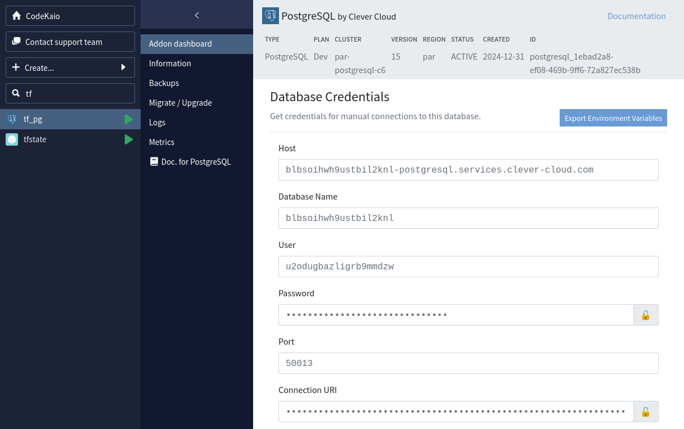

Pour les besoins des cours que je donne à l'Université de Lille, j'ai dû configurer des bases de données PostgreSQL et un serveur Vault sur Clever Cloud (l'installation et la configuration d'un Vault sur Clever Cloud feront l'objet d'un article consacré).

Étant aussi un grand utilisateur de Terraform ([qui l'eût cru ?]()), j'en ai profité pour automatiser tout ça avec mon outil préféré.

Cet article décrit comment utiliser le _provider_ Terraform de Clever Cloud pour instancier une base de données et récupérer ses accès.
La première étape consistera à configurer un _backend_ pour y stocker le fichier d'état de Terraform (_state_), la seconde étape consistera à créer la base de données en elle-même.

Pour pouvoir reproduire le contenu de cet article, vous aurez besoin d'un compte sur [Clever Cloud](https://www.clever-cloud.com/), ainsi que des CLI Clever Cloud et Terraform (ou OpenTofu) installés sur votre machine.

Le code de cet article est aussi disponible sur GitHub : https://github.com/juwit/terraform-clevercloud-playground.

Cet article a été écrit avec des commandes Terraform, mais fonctionne également avec les commandes OpenTofu équivalentes.

## Création d'un bucket avec Terraform

La création d'un _bucket_ se fait en 2 étapes, la création de l'_add-on_ Cellar, puis la création du _bucket_ en lui-même.

Nous écrivons alors un premier _root-module_  Terraform, qui contiendra le code correspondant à la création de notre _bucket_.

### Configurer le provider Clever Cloud

La configuration du _provider_ de Clever Cloud est décrite dans la documentation de son _provider_ Terraform sur [registry.terraform.io](https://registry.terraform.io/providers/CleverCloud/clevercloud/latest/docs).

Un premier fichier `versions.tf` permet de déclarer l'utilisation du _provider_ Clever Cloud :

```terraform
terraform {
  required_providers {
    clevercloud = {
      source = "CleverCloud/clevercloud"
      version = "0.5.1"
    }
  }
}
```

Un fichier `provider.tf` permet ensuite de déclarer l'instanciation du _provider_ :

```terraform
provider "clevercloud" {
  # Configuration options
}
```

Plutôt que d'utiliser des paramètres en dur, je déclare les différents paramètres requis par le _provider_ avec des variables d'environnement.

```shell
export CC_ORGANISATION=orga_6cd71100-5957-4a42-90b8-74cbbdef19a7
export CC_OAUTH_TOKEN=7abcc4ad51024d788a033066e6ae2bd5
export CC_OAUTH_SECRET=54707b61e5ff44a08137f64fa2bbf4ce
```

La commande `clever login` permet de récupérer les valeurs des variables `CC_OAUTH_TOKEN` et `CC_OAUTH_SECRET` :


La valeur de la variable `CC_ORGANISATION` se récupère directement dans la console de Clever Cloud.

L'exécution de `terraform init` permet ensuite d'installer le _provider_ localement :

```shell
$ terraform init

Initializing the backend...
Initializing provider plugins...
- Finding clevercloud/clevercloud versions matching "0.5.1"...
- Installing clevercloud/clevercloud v0.5.1...
- Installed clevercloud/clevercloud v0.5.1 (self-signed, key ID DFAF28F92CC465CC)
Partner and community providers are signed by their developers.

Terraform has been successfully initialized!

You may now begin working with Terraform. Try running "terraform plan" to see
any changes that are required for your infrastructure. All Terraform commands
should now work.
```

### Création de l'add-on et du bucket.

Le _provider_ Clever Cloud propose 2 ressources nous permettant de créer un _add-on_ Cellar et un _bucket_, ce dernier devant référencer l'_add-on_ dans lequel il sera créé :

```terraform
resource "clevercloud_cellar" "this" {
  # le nom que l'on souhaite donner à notre add-on
  name = "tfstate"
}

resource "clevercloud_cellar_bucket" "backend_bucket" {
  cellar_id = clevercloud_cellar.this.id
  # le nom que l'on souhaite donner à notre bucket
  id        = "tfstate-bucket"
}
```

L'exécution `terraform plan` permet de vérifier la bonne configuration du code :

```shell
$ terraform plan

Terraform used the selected providers to generate the following execution plan. Resource actions are indicated with the
following symbols:
  + create

Terraform will perform the following actions:

  # clevercloud_cellar.this will be created
  + resource "clevercloud_cellar" "this" {
      + host       = (known after apply)
      + id         = (known after apply)
      + key_id     = (known after apply)
      + key_secret = (sensitive value)
      + name       = "tfstate"
      + region     = "par"
    }

  # clevercloud_cellar_bucket.backend_bucket will be created
  + resource "clevercloud_cellar_bucket" "backend_bucket" {
      + cellar_id = (known after apply)
      + id        = "tfstate-bucket"
    }

Plan: 2 to add, 0 to change, 0 to destroy.

──────────────────────────────────────────────────────────────────────────────────────────────────────────────────────────

Note: You didn't use the -out option to save this plan, so Terraform can't guarantee to take exactly these actions if you
run "terraform apply" now.
```

La création de l'_add-on_ se fait ensuite avec la commande `terraform apply` :

```shell
$ terraform apply
clevercloud_cellar.this: Creating...
clevercloud_cellar.this: Creation complete after 2s [id=cellar_07eb54fc-34a9-4ed9-b802-b9c587741659]
clevercloud_cellar_bucket.backend_bucket: Creating...
clevercloud_cellar_bucket.backend_bucket: Creation complete after 0s [id=tfstate-bucket]

Apply complete! Resources: 2 added, 0 changed, 0 destroyed.
```

Une fois cette commande exécutée, l'_add-on_ et le _bucket_ apparaissent dans la console :


### Récupération des informations d'accès au bucket

Les informations d'accès au _bucket_ sont affichées dans la console Clever Cloud, mais il est aussi possible de les extraire de nos ressources Terraform avec des _outputs_.

Le fichier `outputs.tf` permet d'exposer ces valeurs :

```terraform
output "cellar_keys" {
  sensitive = true
  value = {
    host       = clevercloud_cellar.this.host
    key_id     = clevercloud_cellar.this.key_id
    key_secret = clevercloud_cellar.this.key_secret
  }
}
```

Les valeurs des attributs de la ressource `clevercloud_cellar` sont `sensitive`, l'_output_ les utilisant doit donc être aussi marqué `sensitive`.

La commande `terraform refresh` permet ensuite de recalculer les _outputs_, puis `terraform output cellar_keys` permet de les récupérer :

```shell
$ terraform output

cellar_keys = <sensitive>

$ terraform output cellar_keys

{
  "host" = "cellar-c2.services.clever-cloud.com"
  "key_id" = "c62c0e82ed7542ec962657e4fd76cb4e"
  "key_secret" = "6c47d99041aa43e29d05dbdce20d3f34"
}
```

Ces informations nous permettront de configurer le _backend_ pour notre second _root-module_.

Voici la structure qui a donc été créée pour cette étape : 

```text
.
└── backend
    ├── main.tf
    ├── outputs.tf
    ├── provider.tf
    └── versions.tf
```

## Création d'une base de données PostgreSQL

Dans un nouveau _root-module_, nous créons comme précédemment un fichier `provider.tf` et `versions.tf` pour déclarer l'utilisation du _provider_ Clever Cloud.

### Configuration du backend

Les _buckets_ Clever Cloud peuvent être utilisés comme _backend_ pour le _state_ Terraform.

Il faut alors utiliser le _backend_ `s3` et adapter un peu sa configuration, dans un fichier `backend.tf` :

```terraform
terraform {
  backend "s3" {
    bucket = "tfstate-bucket"
    key    = "terraform.tfstate"

    region = "eu-west-1"

    endpoints = {
      s3 = "https://cellar-c2.services.clever-cloud.com"
    }

    # désactivation des contrôles liés à AWS S3
    skip_credentials_validation = true
    skip_requesting_account_id  = true
    skip_s3_checksum            = true
  }
}
```

Les clés d'accès sont récupérées de l'étape précédente, et exportées en variables d'environnement :

```shell
export AWS_ACCESS_KEY_ID=c62c0e82ed7542ec962657e4fd76cb4e
export AWS_SECRET_ACCESS_KEY=6c47d99041aa43e29d05dbdce20d3f34
```

La commande `terraform init` permet ensuite de configurer le _provider_ Clever Cloud, ainsi que le _backend_ s3 pointant vers notre _bucket_ :

```shell
$ terraform init

Initializing the backend...

Successfully configured the backend "s3"! Terraform will automatically
use this backend unless the backend configuration changes.
Initializing provider plugins...
- Reusing previous version of clevercloud/clevercloud from the dependency lock file
- Using previously-installed clevercloud/clevercloud v0.5.1

Terraform has been successfully initialized!

You may now begin working with Terraform. Try running "terraform plan" to see
any changes that are required for your infrastructure. All Terraform commands
should now work.
```

### Initialisation de la base de données

La base de données peut ensuite être initialisée avec le code Terraform suivant :

```terraform
resource "clevercloud_postgresql" "this" {
  name   = "tf_pg"
  plan   = "dev"
  region = "par"
}
```

L'exécution de `terraform plan` permet de vérifier que tout est correct :

```shell
$ terraform plan -out tfplan

Terraform used the selected providers to generate the following execution plan. Resource actions are indicated with the
following symbols:
  + create

Terraform will perform the following actions:

  # clevercloud_postgresql.this will be created
  + resource "clevercloud_postgresql" "this" {
      + creation_date = (known after apply)
      + database      = (known after apply)
      + host          = (known after apply)
      + id            = (known after apply)
      + name          = "tf_pg"
      + password      = (known after apply)
      + plan          = "dev"
      + port          = (known after apply)
      + region        = "par"
      + user          = (known after apply)
    }

Plan: 1 to add, 0 to change, 0 to destroy.

──────────────────────────────────────────────────────────────────────────────────────────────────────────────────────────

Saved the plan to: tfplan

To perform exactly these actions, run the following command to apply:
    terraform apply "tfplan"
```

Une fois les vérifications effectuées, la commande `terraform apply` permet d'exécuter la création de la base de données :

```shell
$ terraform apply tfplan
clevercloud_postgresql.this: Creating...
clevercloud_postgresql.this: Creation complete after 1s [id=addon_e4dd9dd4-bc97-4b5a-9a2e-11f6c80b083a]

Apply complete! Resources: 1 added, 0 changed, 0 destroyed.
```

La base de données apparaît alors dans la console Clever Cloud :



La ressource `clevercloud_postgresql` permet également de récupérer les informations de connexion à la base de données.

Le fichier `outputs.tf` suivant permet de les exposer :

```terraform
output "postgresql_credentials" {
  value = {
    host     = clevercloud_postgresql.this.host
    port     = clevercloud_postgresql.this.port
    database = clevercloud_postgresql.this.database
    user     = clevercloud_postgresql.this.user
    password = clevercloud_postgresql.this.password
  }
}
```

L'exécution de `terraform refresh` permet ensuite de les récupérer dans la console :

```shell
$ terraform refresh
clevercloud_postgresql.this: Refreshing state... [id=addon_e4dd9dd4-bc97-4b5a-9a2e-11f6c80b083a]

Outputs:

postgresql_credentials = {
  "database" = "blbsoihwh9ustbil2knl"
  "host" = "blbsoihwh9ustbil2knl-postgresql.services.clever-cloud.com"
  "password" = "nGeASi8d9fjINdjpdax9aYzeP5TIpa"
  "port" = 50013
  "user" = "u2odugbazligrb9mmdzw"
}
```

Après cette dernière étape, nous avons la structure de code suivante (que vous pouvez retrouver en intégralité sur le _repository_ GitHub [terraform-clevercloud-playground](https://github.com/juwit/terraform-clevercloud-playground)) :

```text
.
├── backend
│   ├── main.tf
│   ├── outputs.tf
│   ├── provider.tf
│   └── versions.tf
└── postgresql
    ├── backend.tf
    ├── main.tf
    ├── outputs.tf
    ├── provider.tf
    └── versions.tf
```

## En conclusion

Le _provider_ Terraform Clever Cloud permet une utilisation basique des services et il est plutôt simple à utiliser. Il est maintenu à jour par les équipes de Clever Cloud, ce qui est un bel effort de leur part, bravo à eux !

Pendant l'écriture de cet article, j'ai rencontré quelques points d'amélioration sur le _provider_, auxquels je vais probablement contribuer avec quelques _pull-requests_ sur GitHub :

* la documentation du _provider_ Clever Cloud manque de quelques exemples fonctionnels de code pour pouvoir démarrer rapidement ;
* la documentation de Clever Cloud ne mentionne aucun cas d'usage de leur _provider_ Terraform, c'est dommage car cela ne rend pas visible que Clever Cloud propose aussi une approche d'_infrastructure as code_ ;
* l'utilisation de Cellar comme _backend_ a nécessité plusieurs expérimentations avant de trouver le bon paramétrage, cette utilisation mériterait une documentation en bonne et due forme ;
* l'argument `organisation` du bloc _provider_ est obligatoire, ce qui va à l'encontre de son utilisation avec une variable d'environnement ;
* les attributs de la ressource `clevercloud_postgresql` pourraient être marqués `sensitive`, en particulier le `user` et `password` .

Le prochain article traitera de l'installation et de la configuration d'un serveur Vault sur Clever Cloud !

## Liens et références

* Exemples de code de cet article sur [GitHub](https://github.com/juwit/terraform-clevercloud-playground)
* Page d'accueil de [Clever Cloud](https://www.clever-cloud.com/)
* Installation du [CLI Clever Cloud](https://www.clever-cloud.com/developers/doc/cli/getting_started/)
* Installation du [CLI Terraform](https://developer.hashicorp.com/terraform/install)
* Installation du [CLI OpenTofu](https://opentofu.org/docs/intro/install/)
* Documentation du _provider_ [Terraform Clever Cloud](https://registry.terraform.io/providers/CleverCloud/clevercloud/latest) :
  * Ressource [`clevercloud_cellar`](https://registry.terraform.io/providers/CleverCloud/clevercloud/latest/docs/resources/cellar)
  * Ressource [`clevercloud_cellarbucket`](https://registry.terraform.io/providers/CleverCloud/clevercloud/latest/docs/resources/cellar_bucket)
  * Ressource [`clevercloud_postgresql`](https://registry.terraform.io/providers/CleverCloud/clevercloud/latest/docs/resources/postgresql)
* Documentation du _backend_ Terraform [S3](https://developer.hashicorp.com/terraform/language/backend/s3)