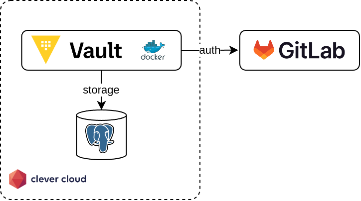
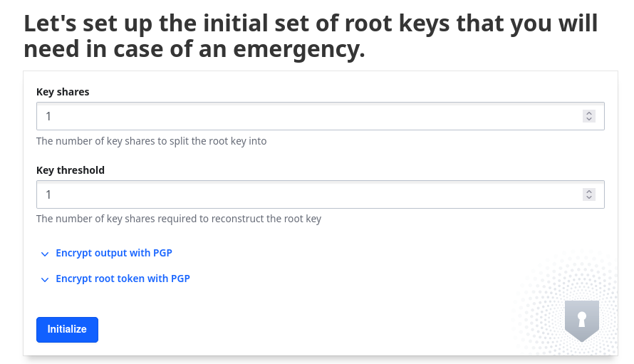
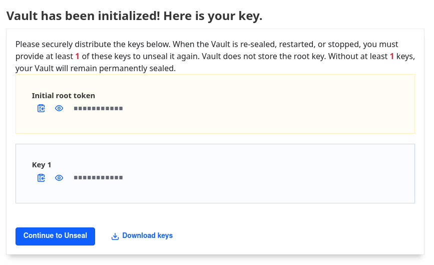
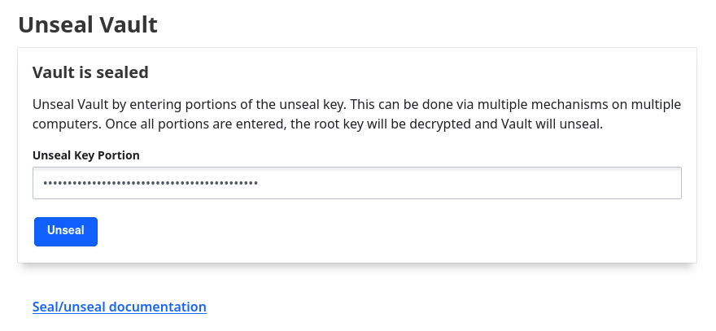
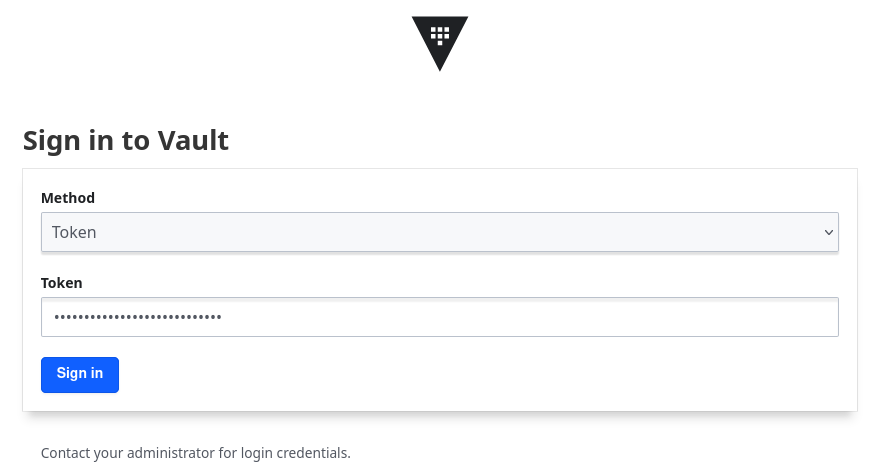
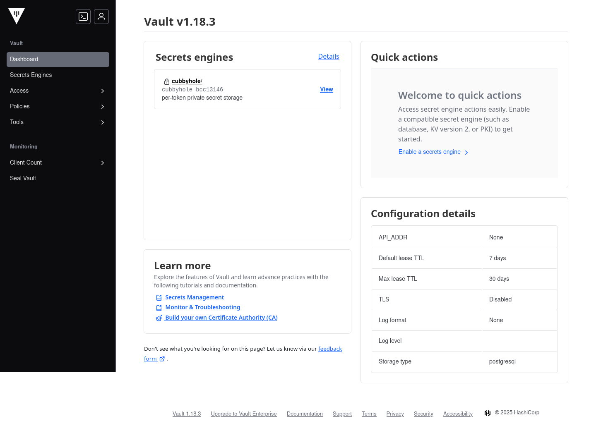
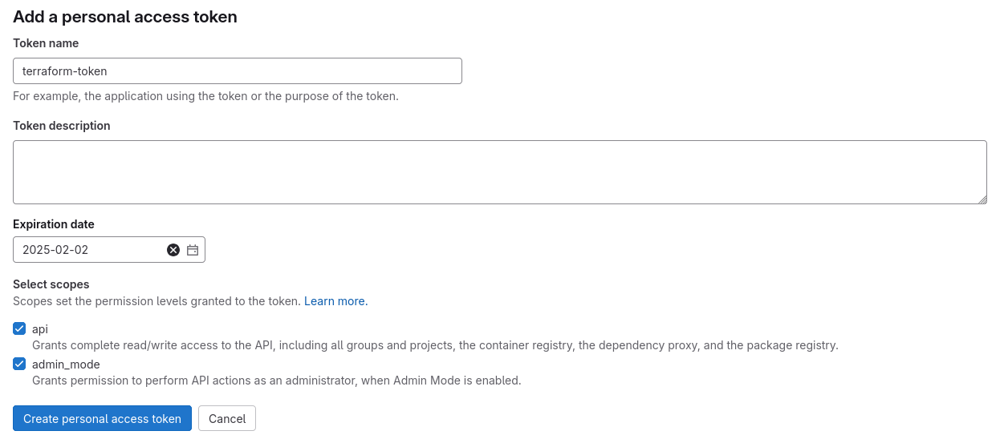

Pour les besoins des cours que je donne à l'Université de Lille, j'ai eu besoin de configurer un serveur Vault sur Clever Cloud.

Et [bien entendu](), j'ai fait tout ça avec Terraform.

Cet article décrit comment utiliser le provider Terraform de Clever Cloud pour déployer un serveur Vault, le configurer pour l'authentification OIDC avec GitLab et y stocker quelques secrets à titre d'exemple.

Le code de cet article est aussi disponible sur GitHub : https://github.com/juwit/terraform-clevercloud-playground.

> Cet article a été écrit avec des commandes Terraform, mais fonctionne également avec les commandes OpenTofu équivalentes.

## Architecture cible

Avant d'entrer dans la mise en pratique, il convient ici d'expliquer quelques choix illustrés par le schéma suivant.



Clever Cloud propose de déployer des applications dans de [nombreux langages](https://www.clever-cloud.com/developers/doc/applications/). Pour héberger une instance Vault, le plus simple semblait d'utiliser une instance Docker.

Par défault, Vault propose l'utilisation du backend de stockage _Integrated storage_ pour le stockage des données. Étant donné la nature du déploiement avec une instance Docker sur un seul nœud, le fait que Clever Cloud ne supporte pas le stockage persistent pour ce type d'instance, il m'a semblé judicieux d'utiliser un backend de stockage externalisé. Parmi les options proposées par Vault, 3 options sont envisageables sur Clever Cloud : les bases de données MySQL ou PostgreSQL, ou S3 _via_ l'implémentation _Cellar_ fournie par Clever Cloud.

Le stockage externalisé sur S3 ne supporte pas la haute disponibilité et pourrait s'avérer incompatible avec l'implémentation _Cellar_ (cf. [les adaptations requises par le backend Terraform S3 pour Cellar]()), donc je l'ai directement écarté et j'ai privilégié l'implémentation avec PostgreSQL.

L'authentification _via_ GitLab permet à mes étudiants d'utiliser leur compte GitLab existant, en exploitant l'instance GitLab fournie par l'Université de Lille. C'est donc très pratique pour eux (pas besoin d'avoir un compte ailleurs) et pour moi (pas besoin de provisionner des comptes).
J'aurai aussi pu utiliser une instance KeyCloak pour implémenter l'authentification, mais cela aurait complexifié inutilement l'implémentation.

A noter aussi que je ne suis pas expert Vault, donc je ne suis pas à l'abri d'avoir fait une erreur de configuration quelque-part, donc attention si vous utilisez cette configuration en production :)

## SetUp de Terraform

Dans un article précédent, j'ai déjà expliqué comment configurer [Terraform pour Clever Cloud](), ainsi que comment [configurer un backend _via_ un bucket Cellar]().
Ces étapes ne sont pas décrites ici pour ne pas alourdir cet article, mais sont bien nécessaires.

## Création de la base de données avec Terraform

La première étape consiste à créer une base de données consacrée à Vault.
Avec Terraform, la création de la base de données se fait avec le code suivant :

```terraform
resource "clevercloud_postgresql" "vault_storage" {
  name   = "vault_storage"
  plan   = "dev"
  region = "par"
}
```

Vault nécessite que le schéma de la base de données soit initialisé avant que l'application ne soit démarré.
Le schéma est fourni dans la [documentation](https://developer.hashicorp.com/vault/docs/configuration/storage/postgresql) du backend :

```sql
CREATE TABLE vault_kv_store (
  parent_path TEXT COLLATE "C" NOT NULL,
  path        TEXT COLLATE "C",
  key         TEXT COLLATE "C",
  value       BYTEA,
  CONSTRAINT pkey PRIMARY KEY (path, key)
);

CREATE INDEX parent_path_idx ON vault_kv_store (parent_path);
```

Ce script peut être passé à la main via `psql`, ou dans la console Clever Cloud.

Il est aussi possible d'utiliser un `provisionner` Terraform pour exécuter le script après la création de la base de données :

```terraform
resource "clevercloud_postgresql" "vault_storage" {
  name = "vault_storage"
  plan = "dev"
  region = "par"

  provisioner "local-exec" {
    # wait for the database to be up
    command = "sleep 10 && psql -f vault-schema.sql"
    environment = {
      PGHOST = self.host
      PGPORT = self.port
      PGDATABASE = self.database
      PGUSER = self.user
      PGPASSWORD = self.password
    }
  }
}
```
Ici, le provisioner `local-exec` est utilisé pour exécuter la commande `psql` après avoir attendu quelques secondes, le temps que la base de données soit effectivement créée.
Les variables d'environnement nécessaires à l'exécution de `psql` sont également positionnées.

> Je ne suis pas un grand fan de l'exécution de provisionners, car ils impliquent une dépendance avec la machine qui exécute Terraform. Ici, c'est le binaire `psql` et la commande shell `sleep` qui sont nécessaires.

## Création de l'instance Vault avec Terraform

Une fois la base de données créée et le schéma initialisé, on peut créer l'instance Docker pour notre Vault sur Clever Cloud avec le code suivant :

```terraform
resource "clevercloud_docker" "vault_instance" {
  name = "vault_instance"

  # auto-scaling disabled
  smallest_flavor = "XS"
  biggest_flavor = "XS"

  # auto-scaling disabled
  min_instance_count = 1
  max_instance_count = 1

  # nice host
  additional_vhosts = ["vault-instance.cleverapps.io"]
  redirect_https = true

  # URL for the storage backend
  environment = {
    VAULT_LOCAL_CONFIG = jsonencode(
      {
        "storage" : { "postgresql" : {} },
        "listener" : [{ "tcp" : { "address" : "0.0.0.0:8080", "tls_disable" : true } }],
        "default_lease_ttl" : "168h",
        "max_lease_ttl" : "720h",
        "ui" : true
      })
    VAULT_PG_CONNECTION_URL = "postgres://${clevercloud_postgresql.vault_storage.user}:${clevercloud_postgresql.vault_storage.password}@${clevercloud_postgresql.vault_storage.host}:${clevercloud_postgresql.vault_storage.port}/${clevercloud_postgresql.vault_storage.database}"
  }
}
```

Les variables d'environnement permettent de passer sa configuration à Vault (plutôt que d'utiliser un fichier).
C'est un des aspects bien pratique de l'image Docker de Vault (documenté sur https://hub.docker.com/r/hashicorp/vault).

Une fois l'application Docker créée, on peut récupérer son identifiant Clever Cloud avec un output :

```terraform
output "vault_instance_id" {
  description = "Clever Cloud id for the instance. Use with `clever link` before deploying."
  value = clevercloud_docker.vault_instance.id
}
```

Cet output permettra d'exécuter les commande `clever link` et `clever deploy` pour déployer l'instance Vault :

```shell
$ terraform output -raw vault_instance_id        

app_72d4b5a4-1ab8-4653-a825-9be0c62e0fa1
```

## Déploiement de Vault

Le déploiement d'une application Docker sur Clever Cloud passe par l'écriture d'un `Dockerfile` et l'exécution de la commande `clever deploy`

Le Dockerfile est simpliste :

```dockerfile
FROM hashicorp/vault:1.18

CMD ["server"]
```

On part d'une version fixée de Vault, la version 1.18 étant la plus récente à l'heure de l'écriture de ces lignes, et on surcharge la commande exécutée par Vault au démarrage de l'application avec la directive `CMD ["server"]`.
Par défault, Vault démarre en mode "développement", avec la commande `CMD ["server", "-dev"]`. Si vous souhaitez simplifier vos tests, vous pouvez conserver cette directive par défaut, mais elle est déconseillée pour de la production, donc je l'ai désactivée dans cet article.

Après avoir créé un repository Git pour notre fichier et commité celui-ci, le déploiement se fait en 2 commandes :

```shell
$ clever link app_72d4b5a4-1ab8-4653-a825-9be0c62e0fa1

Your application has been successfully linked!

$ clever deploy

Remote application is app_id=app_72d4b5a4-1ab8-4653-a825-9be0c62e0fa1, alias=vault_instance, name=vault_instance
Remote application belongs to orga_0331b635-5a61-4786-8f2f-dee81a1b8970
App is brand new, no commits on remote yet
New local commit to push is c6eb36c12ee5ca4a6f0cbcaa2683310856ef7f42 (from refs/heads/main)
Pushing source code to Clever Cloud
Your source code has been pushed to Clever Cloud.
Waiting for deployment to start
Deployment started (deployment_f5deb5ec-e9af-4f19-a5c2-978356632954)
Waiting for application logs
Couldn't start vault with IPC_LOCK. Disabling IPC_LOCK, please use --cap-add IPC_LOCK
==> Vault server configuration:
Administrative Namespace:
                     Cgo: disabled
   Environment Variables: APP_HOME, APP_ID, CC_APP_ID, CC_APP_NAME, CC_COMMIT_ID, CC_DEPLOYMENT_ID, CC_ENVIRON_UPDATE_TOKEN, CC_ENVIRON_UPDATE_URL, CC_INSTANCE_ID, CC_OWNER_ID, CC_PRETTY_INSTANCE_NAME, CC_REVERSE_PROXY_IPS, CC_USE_PULSAR_LOGSCOLLECTION, COMMIT_ID, HOME, HOSTNAME, INSTANCE_ID, INSTANCE_NUMBER, INSTANCE_TYPE, NAME, PATH, PORT, PWD, SHLVL, VAULT_LOCAL_CONFIG, VAULT_PG_CONNECTION_URL, VERSION
              Go Version: go1.23.3
              Listener 1: tcp (addr: "0.0.0.0:8080", cluster address: "0.0.0.0:8081", disable_request_limiter: "false", max_request_duration: "1m30s", max_request_size: "33554432", tls: "disabled")
               Log Level:
                   Mlock: supported: true, enabled: false
           Recovery Mode: false
                 Storage: postgresql (HA disabled)
                 Version: Vault v1.18.3, built 2024-12-16T14:00:53Z
             Version Sha: 7ae4eca5403bf574f142cd8f987b8d83bafcd1de
2025-01-03T14:25:52.301Z [INFO]  proxy environment: http_proxy="" https_proxy="" no_proxy=""
2025-01-03T14:25:52.333Z [INFO]  incrementing seal generation: generation=1
2025-01-03T14:25:52.333Z [WARN]  no `api_addr` value specified in config or in VAULT_API_ADDR; falling back to detection if possible, but this value should be manually set
2025-01-03T14:25:52.336Z [INFO]  core: Initializing version history cache for core
2025-01-03T14:25:52.336Z [INFO]  events: Starting event system
==> Vault server started! Log data will stream in below:
Application start successful
Successfully deployed in 0 minutes and 28 seconds
```

Au démarrage, Vault indique la configuration est bien chargée, et affiche quelques warnings.

> Il n'est pas possible à ma connaissance de force un `--cap-add IPC_LOCK` sur Clever Cloud, mais je ne pense pas que ce paramètre posera problème.

Une fois le démarrage terminé, la commande `clever open` permet d'ouvrir un navigateur web sur notre instance de Vault !

```shell
$ clever open

Opening the application in your browser
```

## Initialisation du Vault

Lors de sa première ouverture, Vault doit être initialisé, puis déverrouillé, Ces étapes permettent de créer ses clés de déverrouillage (_unseal keys_), ainsi que le token d'accès `root` qui permettra d'utiliser l'API dans un premier temps.

Ces opérations doivent être faites une seule fois à la création du serveur Vault et doivent être faites manuellement via le CLI Vault ou sa console.



Une fois le nombre de clés choisies, ainsi que les différentes options de chiffrement, Vault génère les clés et les met à disposition sur l'écran suivant :



> Ces clés ne doivent être perdues en aucune circonstance !

Après avoir stocké les clés en lieu sûr, l'écran suivant nous invite à déverrouiller Vault en saisissant une clé de déverrouillage.
Lorsque suffisamment de clés auront été entrées, Vault sera déverrouillé et prêt à l'utilisation.



Une fois Vault déverrouillé, l'écran de login apparaît, il est alors possible de se logger avec le token d'accès `root` obtenu aux étapes précédentes :



La console de Vault est maintenant disponible :



## Créer une policy puis un token pour Terraform

Maintenant que Vault est initialisé et déverrouillé, nous allons créer une policy puis un token pour Terraform, afin d'éviter d'utiliser le token `root` en permanence.

Après avoir positionné les variables d'environnement `VAULT_ADDR` et `VAULT_TOKEN` :

```shell
export VAULT_ADDR=https://vault-instance.cleverapps.io

# root token
export VAULT_TOKEN=hvs.EXRwc6DumFdDhLk4N8Xa
```

Nous exécutons alors le code Terraform suivant :

```terraform
resource "vault_policy" "terraform" {
  name   = "terraform-policy"
  policy = file("terraform-policy.hcl")
}

resource "vault_token" "terraform_token" {
  display_name = "terraform-token"
  policies = ["terraform-policy"]
  renewable = false
}

output "terraform_token" {
  sensitive = true
  value = vault_token.terraform_token.client_token
}
```

La policy contient des droits d'administration pour Vault (requis pour Terraform). Elle a été copiée depuis le repository GitHub [hashicorp-education/learn-vault-codify](https://github.com/hashicorp-education/learn-vault-codify/blob/main/community/policies/admin-policy.hcl).

Le token alors obtenu peut être utilisé pour le reste des opérations avec Terraform :

```shell
$ terraform output -raw terraform_token
 
hvs.rHfvBm3fVdXzedYefPQZwFtYotDMByf3iNh2qGnvnLACfpuhMT2GpE3hyzwAH2gGuV7EhQHbVDkZ9coPRG2Aa3aXFJv
```

## Initialisation de la configuration OIDC avec GitLab



## Récupération de secrets

## Liens et références

* Exemples de code de cet article sur [GitHub](https://github.com/juwit/terraform-clevercloud-playground)
* Page d'accueil de [Clever Cloud](https://www.clever-cloud.com/)
* Installation du [CLI Clever Cloud](https://www.clever-cloud.com/developers/doc/cli/getting_started/)
* Installation du [CLI Terraform](https://developer.hashicorp.com/terraform/install)
* Installation du [CLI OpenTofu](https://opentofu.org/docs/intro/install/)
* Documentation du provider [Terraform Clever Cloud](https://registry.terraform.io/providers/CleverCloud/clevercloud/latest):
  * Ressource [`clevercloud_postgresql`](https://registry.terraform.io/providers/CleverCloud/clevercloud/latest/docs/resources/postgresql)
  * Ressource [`clevercloud_docker`](https://registry.terraform.io/providers/CleverCloud/clevercloud/latest/docs/resources/docker)
* Documentation de [Vault](https://developer.hashicorp.com/vault/docs) :
  * L'image Docker de Vault sur [dockerhub](https://hub.docker.com/r/hashicorp/vault)
  * Configuration du [storage PostgreSQL](https://developer.hashicorp.com/vault/docs/configuration/storage/postgresql)
  * Policy exemple d'administration sur GitHub [hashicorp-education/learn-vault-codify](https://github.com/hashicorp-education/learn-vault-codify/blob/main/community/policies/admin-policy.hcl)
* Documentation du provider [Terraform Vault](https://registry.terraform.io/providers/hashicorp/vault/latest/docs):
  * Ressource [`vault_policy`](https://registry.terraform.io/providers/hashicorp/vault/latest/docs/resources/policy)
  * Ressource [`vault_token`](https://registry.terraform.io/providers/hashicorp/vault/latest/docs/resources/token)
