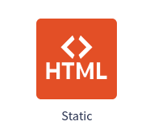
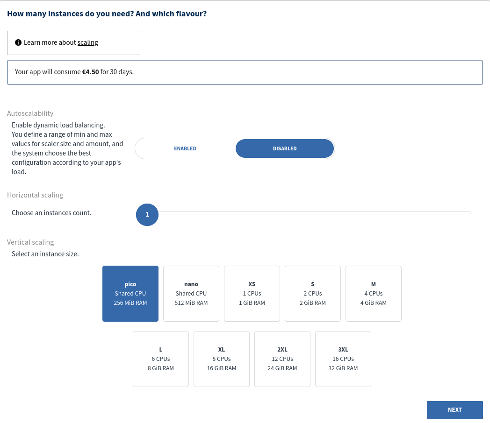
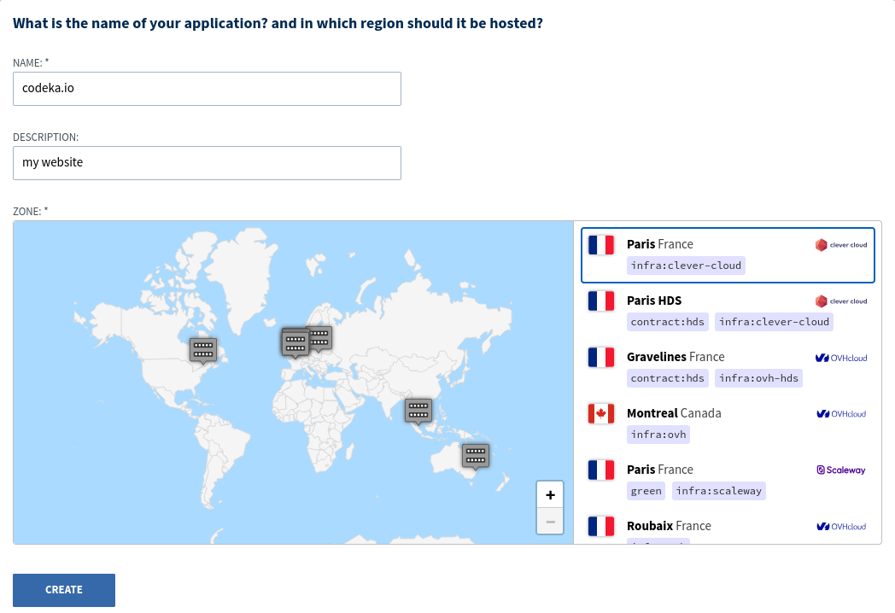
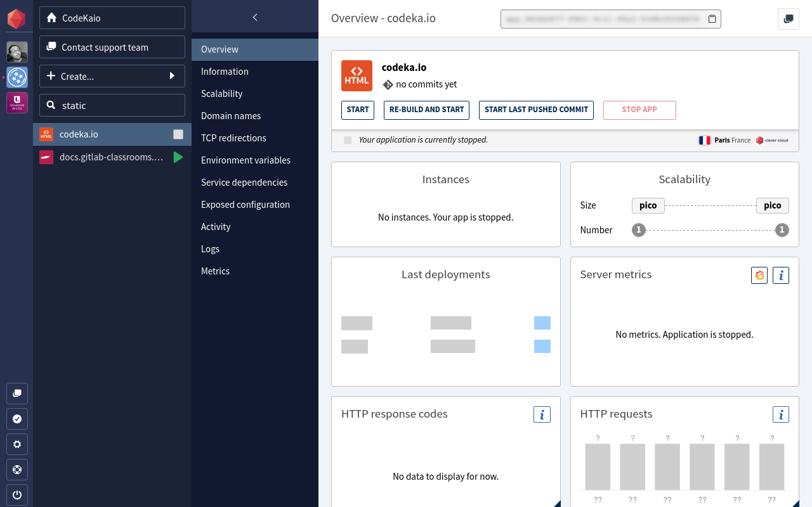
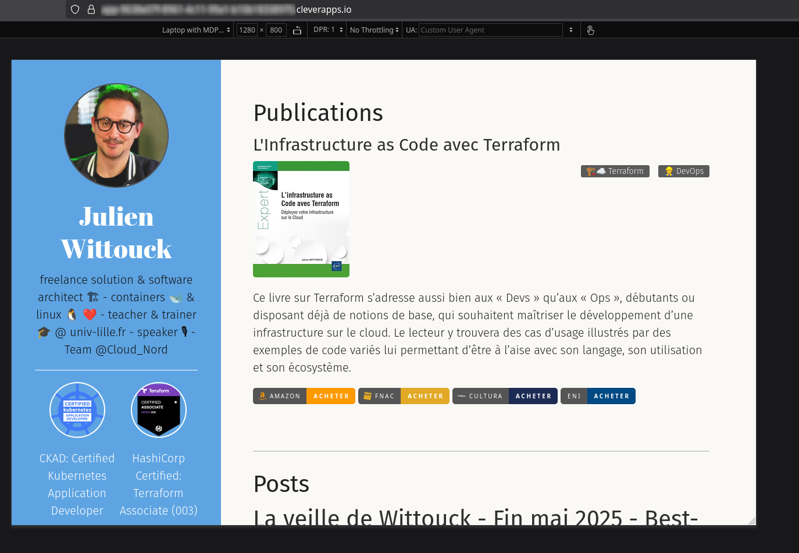
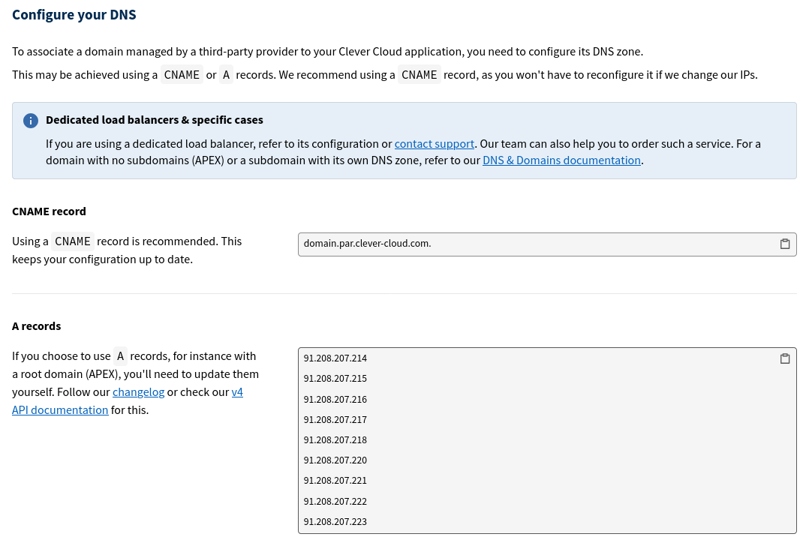

Il y a quelques jours, je suis tombé sur ce post de David Legrand sur Bluesky :

<blockquote class="bluesky-embed" data-bluesky-uri="at://did:plc:rlpsf5c2y5jkfifwp3klcrzf/app.bsky.feed.post/3lqrqpdld3c2j" data-bluesky-cid="bafyreigxquchzyduo3eyj2cuoyna6dsaqzpmnpp2vittiremc5mlwwtihy" data-bluesky-embed-color-mode="light"><p lang="en">🚀 We work on 3 new runtimes on @clever-cloud.com 
 : Linux, Static and... V. Want to test? Let me know! 

Want to know more ? ▶️ github.com/CleverCloud/...

😍 Thanks to the teams across Clever Cloud for the mutual efforts to ease how we provide new runtimes to customers!<br><br><a href="https://bsky.app/profile/did:plc:rlpsf5c2y5jkfifwp3klcrzf/post/3lqrqpdld3c2j?ref_src=embed">[image or embed]</a></p>&mdash; David Legrand ☁️ 🤘 (<a href="https://bsky.app/profile/did:plc:rlpsf5c2y5jkfifwp3klcrzf?ref_src=embed">@davlgd.fr</a>) <a href="https://bsky.app/profile/did:plc:rlpsf5c2y5jkfifwp3klcrzf/post/3lqrqpdld3c2j?ref_src=embed">June 4, 2025 at 1:55 PM</a></blockquote><script async src="https://embed.bsky.app/static/embed.js" charset="utf-8"></script>

J'ai donc sauté sur l'occasion pour demander à tester ce nouveau runtime.

Cet article présente donc comment *ce site*, que vous êtes en train de lire, a été déployé dans ce tout nouveau runtime sur Clever Cloud !

<!--more-->

## La création de l'application

Déployer sur Clever Cloud, c'est toujours très facile. Ça consiste principalement en quelques commandes CLI :

```shell
$ clever create --type TYPE APP_NAME
```

Mais comme je teste en avant-première, le type _static_ n'est probablement pas encore implémenté dans le CLI.
Je crée donc mon application dans Clever Cloud en utilisant la console :



Au niveau de la scalabilité, je pars sur une instance _pico_, qui est la plus petite disponible.
_A priori_, ce format d'instance devrait être suffisant pour servir mes articles de blog, c'est ce que mentionne David dans son post en tout cas.



Enfin, je choisis d'_hoster_ mon application sur l'infrastructure de Clever Cloud.



Une fois ces étapes validées, l'application statique apparaît bien dans ma console.



## Le déploiement

Maintenant que l'application est créée, le déploiement se fait en deux commandes, que j'exécute sur le _CLI_ cette fois-ci.

La première commande consiste à associer mon répertoire à l'application que je viens de créer :
```shell
$ clever link app_701cce73-7499-4e14-9059-519fae4f1875
Your application has been successfully linked!
```

La seconde est le déploiement en lui-même (j'ai un peu tronqué l'output de la commande par souci de clarté) :

```shell
$ clever deploy

Remote application is app_id=app_701cce73-7499-4e14-9059-519fae4f1875, alias=codeka.io, name=codeka.io
Remote application belongs to orga_5e0f424c-f593-4d79-9863-5d1d3f17b25e
App is brand new, no commits on remote yet
New local commit to push is 11370c5e5ebb5fd0e502ea9f2502cc3b5848f0e2 (from refs/heads/main)
Pushing source code to Clever Cloud…
Your source code has been pushed to Clever Cloud.
Waiting for deployment to start…
Deployment started (deployment_6ff2e8cb-f9b8-4231-bedf-db2ce0497f87)
Waiting for application logs…
2025-06-05T13:53:35.830Z: [INFO] No Clever Cloud specific configuration file detected. Continuing…[INFO] Using Python version 2[INFO] Changing current directory to /home/bas/app_701cce73-7499-4e14-9059-519fae4f1875…[INFO] We are now in /home/bas/app_701cce73-7499-4e14-9059-519fae4f1875, let's build and run the app.[INFO] Deploying commit ID 11370c5e5ebb5fd0e502ea9f2502cc3b5848f0e2[INFO] Hugo configuration file detected
2025-06-05T13:53:35.830Z: Start building sites …
2025-06-05T13:53:35.830Z: hugo v0.147.7+extended linux/amd64 BuildDate=unknown
2025-06-05T13:53:49.083Z:                   │ FR  │ EN
2025-06-05T13:53:49.083Z: ──────────────────┼─────┼─────
2025-06-05T13:53:49.084Z:  Pages            │ 107 │  23
2025-06-05T13:53:49.084Z:  Paginator pages  │   4 │   0
2025-06-05T13:53:49.084Z:  Non-page files   │  85 │   0
2025-06-05T13:53:49.084Z:  Static files     │ 184 │ 184
2025-06-05T13:53:49.084Z:  Processed images │  44 │   0
2025-06-05T13:53:49.084Z:  Aliases          │   6 │   2
2025-06-05T13:53:49.084Z:  Cleaned          │   0 │   0
2025-06-05T13:53:49.084Z: Total in 13269 ms
2025-06-05T13:53:49.461Z: [INFO] Creating build cache archive[INFO] build cache archive successfully created[INFO] No cron to setup
2025-06-05T13:53:49.461Z: Uploading application build cache archive… file is 134M before compression.
2025-06-05T13:54:26.611Z: Application start successful
2025-06-05T13:54:27.092Z: [INFO] No Clever Cloud specific configuration file detected. Continuing…[INFO] Using Python version 2[INFO] Changing current directory to /home/bas/app_701cce73-7499-4e14-9059-519fae4f1875…[INFO] We are now in /home/bas/app_701cce73-7499-4e14-9059-519fae4f1875, let's build and run the app.[INFO] Deploying commit ID 11370c5e5ebb5fd0e502ea9f2502cc3b5848f0e2[INFO] No cron to setup[INFO] Successfully deployed in 0 minutes and 12 seconds
Deployment successful
```

Tout semble bien se passer. Mon site est bien détecté comme un site utilisant `hugo`, et il est construit automatiquement.

Un `clever open` permet d'ouvrir l'application directement dans mon navigateur :

```shell
$ clever open
Opening the application in your browser
```

Et là, bim, 404 !


En effet, il faut positionner quelques variables d'environnement pour que tout fonctionne correctement (merci David Legrand pour le topo d'ailleurs) :

Quand hugo génère le contenu du site, il dépose ses fichiers par défaut dans un répertoire `/public`. Il faut donc indiquer au serveur web que c'est bien ce répertoire qui doit être servi. La variable d'environnement `CC_WEBROOT` permet d'indiquer ce répertoire.

Il est aussi possible de préciser la version de hugo avec `CC_HUGO_VERSION` et de modifier les commandes avec `CC_BUILD_COMMAND`.

A priori, hugo n'est pas détecté quand `CC_WEBROOT` est modifié (cf. [cette discussion sur GitHub](https://github.com/CleverCloud/Community/discussions/66#discussioncomment-13381026)), donc je précise la commande `CC_BUILD_COMMAND=hugo` pour forcer son utilisation.

Je précise donc juste mes deux variables `CC_WEBROOT=/public` et `CC_BUILD_COMMAND=hugo`, et je ne précise pas les autres pour garder leur valeur par défaut :

```shell
$ clever env set CC_WEBROOT "/public"
Your environment variable has been successfully saved

$ clever env set CC_BUILD_COMMAND "hugo"
Your environment variable has been successfully saved
```

Un `restart` est alors nécessaire pour la bonne prise en compte de la variable, on peut aussi re-forcer un déploiement complet avec `clever deploy --force` :

```shell
$ clever restart
```

Et après quelques minutes, le site est disponible : 



## La bascule DNS

Maintenant que le site est buildé et disponible, je peux enregistrer mon domaine et basculer mon DNS chez Clever Cloud.

L'enregistrement du domaine côté Clever Cloud se fait en une commande :

```shell
$ clever domain add codeka.io
Your domain has been successfully saved
```

La configuration du DNS est expliquée directement dans la console :



Comme j'utilise un domain racine, j'ai dû déclarer les records de type `A` dans ma zone DNS :

```text
IN A 91.208.207.214
IN A 91.208.207.215
IN A 91.208.207.216
IN A 91.208.207.217
IN A 91.208.207.218
IN A 91.208.207.220
IN A 91.208.207.221
IN A 91.208.207.222
IN A 91.208.207.223
```

Une fois la modification des DNS passée, tout est ok et mon site est disponible en ligne.

Vous êtes donc en train de lire cet article depuis un site static déployé sur Clever Cloud 🎉

## Performances

### Build

Le temps de build est tout à fait correct.

Mon site n'est pas des plus gros (une centaine de pages). Le build de mon site se fait en une quinzaine de secondes, et le démarrage également. Le temps total d'un déploiement est d'environ une minute. C'est le même ordre de grandeur que les déploiements que je faisais sur GitHub Pages par le passé.

### Requêtes et débit

Un test rapide avec `ab` donne les stats suivantes :

```shell
$ ab -k -n 500 -c 50 https://codeka.io/
This is ApacheBench, Version 2.3 <$Revision: 1923142 $>
Copyright 1996 Adam Twiss, Zeus Technology Ltd, http://www.zeustech.net/
Licensed to The Apache Software Foundation, http://www.apache.org/

Benchmarking codeka.io (be patient)
Completed 100 requests
Completed 200 requests
Completed 300 requests
Completed 400 requests
Completed 500 requests
Finished 500 requests


Server Software:        
Server Hostname:        codeka.io
Server Port:            443
SSL/TLS Protocol:       TLSv1.3,TLS_AES_256_GCM_SHA384,2048,256
Server Temp Key:        X25519 253 bits
TLS Server Name:        codeka.io

Document Path:          /
Document Length:        47110 bytes

Concurrency Level:      50
Time taken for tests:   0.313 seconds
Complete requests:      500
Failed requests:        0
Keep-Alive requests:    500
Total transferred:      23702000 bytes
HTML transferred:       23555000 bytes
Requests per second:    1597.97 [#/sec] (mean)
Time per request:       31.290 [ms] (mean)
Time per request:       0.626 [ms] (mean, across all concurrent requests)
Transfer rate:          73974.77 [Kbytes/sec] received

Connection Times (ms)
              min  mean[+/-sd] median   max
Connect:        0    2   7.5      0      31
Processing:     8   22  11.9     19      89
Waiting:        7   19   6.8     18      87
Total:          8   24  16.4     19      99

Percentage of the requests served within a certain time (ms)
  50%     19
  66%     19
  75%     20
  80%     20
  90%     54
  95%     66
  98%     77
  99%     88
 100%     99 (longest request)
```

Les performances sont clairement au rendez-vous, en tout cas largement suffisantes pour héberger un site statique comme le mien ⚡️

## Conclusion

Pour 4.5 € euros / mois, et pour la simplicité d'utilisation, ce nouveau type d'application Clever Cloud vaut vraiment le coup. Avec les accès aux logs, la customization des instances possibles et l'hébergement en France 🇫🇷, je dis bye-bye GitHub Pages 👋
