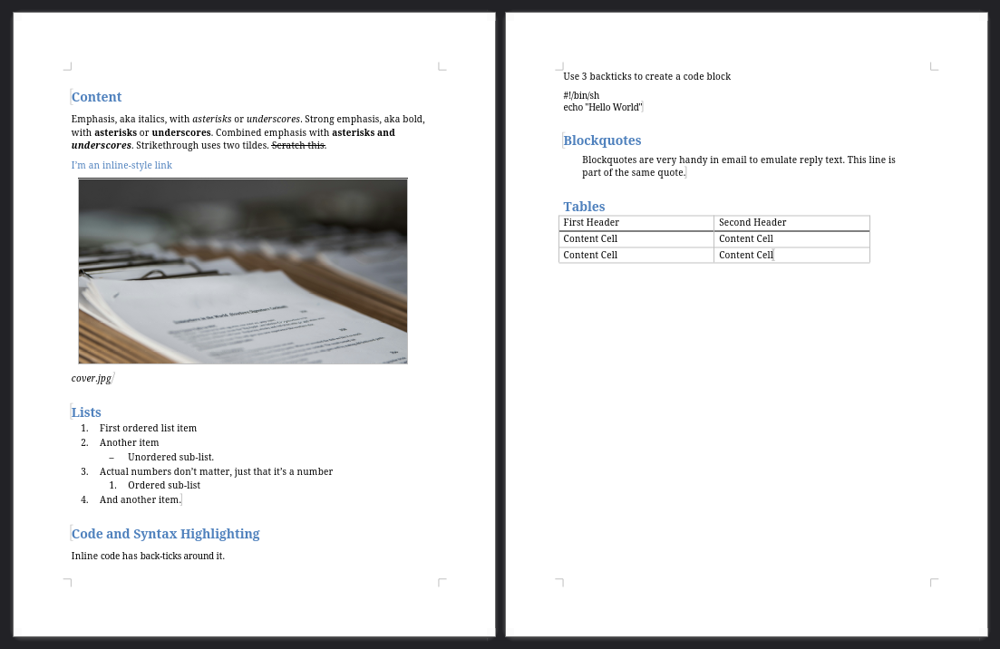
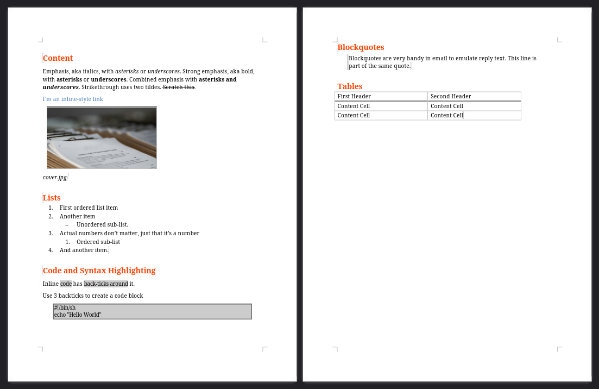
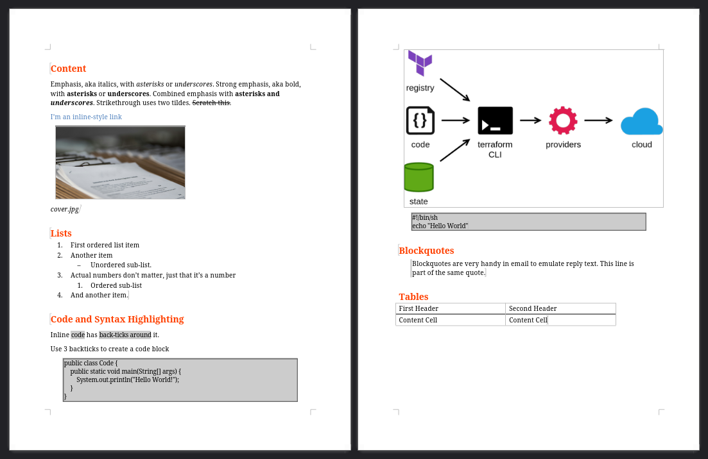

Lors d'une discussion concernant l'écriture de mon livre, j'ai expliqué quels outils j'ai utilisé.
Parmi ces outils, j'ai eu un usage de _pandoc_ pour convertir du texte du format markdown en fichier `.docx`.

Pour le rendu du manuscrit, mon éditeur m'a demandé un rendu au format `.docx`, avec la contrainte d'un document par chapitre.
Les documents devaient suivre une feuille de style particulière qui était fournie. La feuille de style contenait les styles pour les titres, citations, blocs de code, etc.

Je pense que ce format est le plus pratique pour les équipes de l'éditeur.
Mais la perspective de travailler dans Word ne m'enchantait pas (d'ailleurs, j'utilise LibreOffice sur mes postes Linux), je voulais pouvoir archiver mon travail sur _Git_, et inclure dans mes chapitres du code réellement fonctionnel.
J'ai donc cherché un moyen de pouvoir travailler dans un format de type _markdown_, que je pouvais pré-processer.

## _pandoc_ et _markdown_

_pandoc_ est un outil de conversion de documents. Il gère de nombreux formats en entrée et en sortie, dont le _markdown_ et le _docx_ !

Après avoir installé l'outil, on peut convertir des documents. L'option `-o` permet de préciser le fichier de sortie, le format est détecté à partir de l'extension du fichier :

```shell
# générer un doc html
$ pandoc file.md -o file.html

# générer un word
$ pandoc file.md -o file.docx
```

La génération par défaut en format _docx_ est tout à fait correcte et prend en compte les différents niveaux de titre, la gestion du gras et de l'italique, le code et les blocs de citation, ainsi que les listes, tableaux et images. Bref, tout ce qu'on peut basiquement faire en _markdown_.

Le markdown suivant :

~~~markdown
# Content

Emphasis, aka italics, with *asterisks* or _underscores_.
Strong emphasis, aka bold, with **asterisks** or __underscores__.
Combined emphasis with **asterisks and _underscores_**.
Strikethrough uses two tildes. ~~Scratch this.~~

[I'm an inline-style link](https://www.google.com)


# Lists

1. First ordered list item
2. Another item
    * Unordered sub-list.
1. Actual numbers don't matter, just that it's a number
    1. Ordered sub-list
4. And another item.

# Code and Syntax Highlighting

Inline `code` has `back-ticks around` it.

Use 3 backticks to create a code block

```shell
#!/bin/sh
echo "Hello World"
```

# Blockquotes

> Blockquotes are very handy in email to emulate reply text.
> This line is part of the same quote.

# Tables

| First Header  | Second Header |
| ------------- | ------------- |
| Content Cell  | Content Cell  |
| Content Cell  | Content Cell  |
~~~

est transformé en _docx_ avec la commande `pandoc sample.md -o sample.docx`

Le résultat n'est pas des plus stylés, mais est déjà plutôt pas mal, on voit bien que markdown est bien supporté :


[sample.docx](sample.docx)

## Rendre le document stylé

Lorsqu'il génère le fichier _docx_, _pandoc_ peut utiliser un document qui lui servira de référence pour les styles.
La première étape consiste alors à générer le document de référence en utilisant la commande `pandoc -o custom-reference.docx --print-default-data-file reference.docx`.
Cette commande génère alors le document contenant les styles par défaut.

Le contenu de ce document importe peu, il contient quelques éléments pouvant servir de test, seuls seront utilisés les styles.

Les styles utilisés par pandoc sont décrits dans [sa documentation](https://pandoc.org/MANUAL.html#option--reference-doc).

À noter que le code source inline est représenté par le style de caractères _Verbatim Char_, et le code source en blocs prendra le style de paragraphe _Source Code_ (qui n'est pas créé par défaut dans le document de référence).

Pour redimensionner les images, il est aussi possible de préciser leur taille en attribut :

```markdown
{ width=50% }
```

Une fois ce document personnalisé, on génére les fichiers _docx_ en utilisant l'option `--reference-doc=custom-reference.docx` :

```shell
pandoc sample.md -o sample-with-style.docx --reference-doc=custom-reference.docx
```


[sample-with-style.docx](sample-with-style.docx)

## Pré-processing

L'utilisation du format texte markdown étant donc possible, je souhaitais pouvoir pré-processer mes fichiers markdown pour :

* inclure du code source réel dans le document
* générer mes diagrammes au format drawio en png et les inclure dans le document généré

J'ai donc écrit un peu de script qui fait tout ça.

### Inclure le code depuis des fichiers externes

Il est possible avec _pandoc_ d'exécuter des filtres pendant l'exécution de la transformation. L'utilisation des filtres n'est cependant pas très bien documentée, et s'appuie sur la manipulation d'un AST au format JSON. Cette approche, bien que plutôt propre, me semblait quand même compliquée pour simplement inclure du code dans mes fichiers.

J'ai donc trouvé une autre solution plus simple : dans mes fichiers _markdown_, j'utilise une syntaxe de _Commentaires_ pour recréer une espèce de macro, que je fais pré-processer par un script shell.

La macro d'inclusion de code que j'ai utilisée est celle-ci :

```markdown
[//]: # (INCLUDECODE FICHIER_A_INCLURE)
```

La syntaxe `[//]: # ()` correspond à l'équivalent d'un commentaire markdown (cf [ce stackoverflow](https://stackoverflow.com/a/20885980)).
J'ai alors simplement utilisé un commentaire `INCLUDECODE` devant être suivi du nom du fichier à inclure.

Pour pré-processer ces _macros_, j'utilise la puissance du shell et le fait que _pandoc_ accepte le contenu du document à transformer sur `STDIN`.
Les 2 commandes suivantes ont un comportement identique (au delta de l'exécution d'un `cat` en plus) :

```shell
# direct
$ pandoc sample.md -o sample.docx

# pipes
$ cat sample.md | pandoc -o sample.docx
```

Avec ce fonctionnement, il est facile de glisser un script shell entre deux :

```shell
$ cat sample.md |
 ./include-code-macro.sh |
 pandoc -o sample.docx
```

Le script shell intercepte les lignes correspondant à la macro et insère le contenu du fichier référencé :

```shell
#!/bin/bash

regex='\[\/\/\]: # \(INCLUDECODE (.*)\)'

# Process input line by line
while IFS= read -r line; do
  # Extract the filename using regex
  if [[ "$line" =~ $regex ]]; then
    filename="${BASH_REMATCH[1]}"

    # Find the file
    if [[ $? -eq 0 ]]; then
      # Output the file content wrapped in code blocks
      echo '```'
      cat "$filename"
      echo '```'
    fi
  else
    # Output the line as is
    echo "$line"
  fi
done

exit 0
```

Ce petit script (très moche) fait permet donc d'inclure facilement mes fichiers externes.
Cela me permet de les modifier sur le côté, et de regénérer mes documents d'un coup.

### Générer des diagrammes _drawio_ et les inclure

Pour gérer des diagrammes _drawio_ à la volée, j'ai simplement suivi le même principe : une syntaxe de type _macro_ et un script pour la traiter.

La macro pour extraire un diagramme est du même type :

```markdown
[//]: # (DIAGRAM FICHIER_A_INCLURE)
```

Et le script est aussi similaire, il utilise le CLI de _drawio_ pour exporter le diagramme dans un `.png`, qui est ensuite inclus dans le markdown :

```shell
regex='\[\/\/\]: # \(DIAGRAM (.*)\)'

# Process input line by line
while IFS= read -r line; do
  # Extract the filename using regex
  if [[ "$line" =~ $regex ]]; then
    filename="${BASH_REMATCH[1]}"

    # Find the file
    if [[ $? -eq 0 ]]; then
      # export drawio diagram
      drawio -x -f png --width 1024 -t "$filename" >/dev/null 2>&1
      exported_file=$(basename "$filename" .drawio)
      # add markdown for exported diagram
      echo ""
    fi
  else
    # Output the line as is
    echo "$line"
  fi
done

exit 0
```

J'aurais aussi pu utiliser directement une directive d'image de cette manière :

```markdown

```

mais j'ai préféré rester avec mon format de macro. Cela me laissait la possibilité de factoriser mes scripts et d'introduire d'autres macros si besoin (besoin que je n'ai pas eu évidemment, _YAGNI_ comme on dit).

Je m'étais aussi laissé la possibilité d'affiner les scripts pour redimensionner précisément les diagrammes, ou inclure du code entre 2 lignes, mais je n'en ai pas eu le besoin non plus.

### La commande définitive

En cumulant tout ce qu'on a vu, la commande suivante fait l'inclusion du code, la génération des diagrammes à la volée, et la conversion en `.docx` avec un style fourni :

```shell
$ cat sample.md |
  ./include-code-macro.sh |
  ./include-diagram-macro.sh |
  pandoc -o sample-final.docx --reference-doc=custom-reference.docx
```

Le document généré par cette commande est maintenant complet :


[sample-final.docx](sample-final.docx)

## Conclusion

_pandoc_ permet de générer des documents Word assez propres de mon point de vue.
Avec un peu de travail sur la feuille de style, il est assez facile de personnaliser le rendu des documents.

C'est d'ailleurs cette façon de générer les documents que j'ai utilisée pour écrire (et compiler) mon livre !

En utilisant la puissance du shell, il est relativement facile de scripter l'inclusion d'éléments externes comme du code source, des diagrammes ou d'autres fichiers.

## Liens et références

* [Installation de pandoc](https://pandoc.org/installing.html)
* [Option `--reference-doc`](https://pandoc.org/MANUAL.html#option--reference-doc)
* Les commentaires en markdown sur [StackOverFlow](https://stackoverflow.com/a/20885980)

Photo de couverture par [Arisa Chattasa](https://unsplash.com/@golfarisa?utm_content=creditCopyText&utm_medium=referral&utm_source=unsplash) sur [Unsplash](https://unsplash.com/photos/white-printer-paper-close-up-photography-0LaBRkmH4fM?utm_content=creditCopyText&utm_medium=referral&utm_source=unsplash)