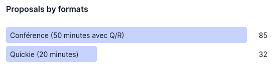
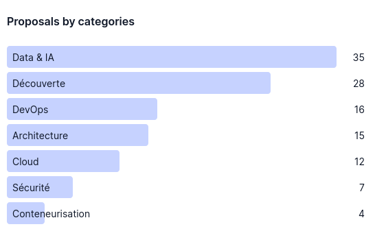
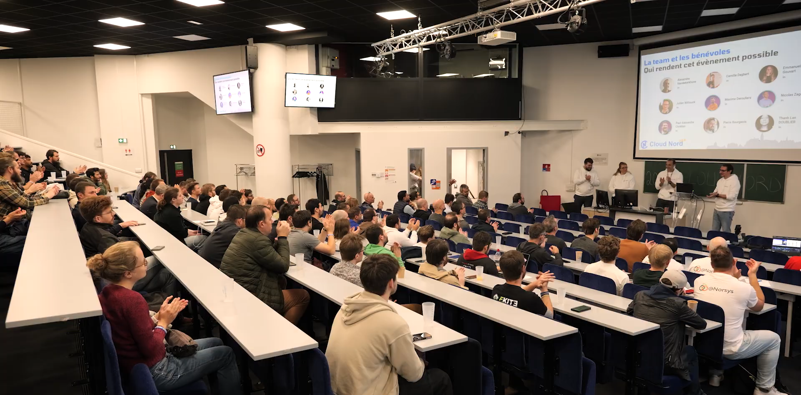
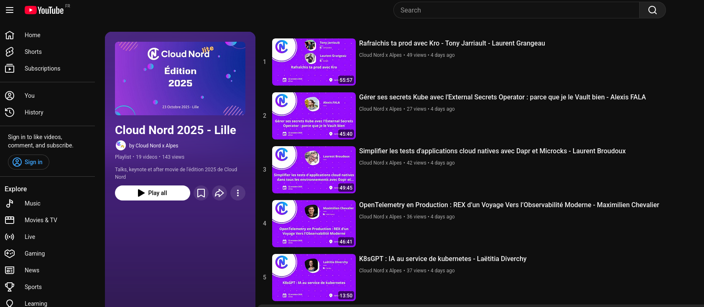

Le 23 octobre dernier, c'était la 6ème édition de [Cloud Nord](https://cloudnord.fr).

Je suis un fidèle de cette conférence depuis longtemps. J'avais loupé la première édition qui avait eu lieu pendant le confinement en visio, mais j'y ai assisté dès la deuxième édition. J'ai été speaker lors de la 4ème édition, (avec mon talk ["Laissez tomber vos Dockerfile, adoptez un buildpack !"]()) puis depuis l'année dernière, j'en suis un des organisateurs.

Ce jeudi 23 octobre 2025, j'ai eu l'honneur de faire l'ouverture de la journée pour accueillir les participants (après une mini-game de Factorio en patientant, on ne se refait pas).

Ce post raconte principalement les dessous de l'organisation de cette conf qui me tient particulièrement à cœur.

<!--more-->

## Ce sont les bénévoles qui vont vivre la conférence

Je commence cet article par un point qui est souvent oublié ou méconnu : la plupart des conférences sont organisées par des bénévoles, et c'est aussi le cas de Cloud Nord.

Nous (les orgas) ne nous rémunérons pas avec l'argent des sponsorings et de la billetterie. Tout le temps que nous passons à organiser la conférence se fait sur notre temps perso, ou sur notre temps pro si nos entreprises soutiennent la démarche.
Pour ma part, c'est mon statut de freelance qui me permet d'y investir beaucoup de temps.

Le jour J, vous pouvez bien sûr croiser les orgas de la conf, mais aussi quelques bénévoles qui viennent nous aider ponctuellement, pour scanner les billets, distribuer des repas, ou passer les micros dans les salles.
C'est aussi grâce à l'aide des ces personnes que notre conf peut avoir lieu.
Donc, je profite de ces quelques mots pour remercier ces bénévoles qui ont participé à Cloud Nord 2025 💙.

J'ajoute aussi que les speakers ne sont pas payés par la conférence pour venir y parler.
Les speakers bénéficient souvent du soutien de leur entreprise pour venir parler en conférence (qui rémunère la journée, le déplacement, etc.).

Ces quelques points étant dits, je peux maintenant détailler l'organisation de Cloud Nord 2025.

## Une édition qui n'a failli pas avoir lieu

Si vous suivez d'autres orgas sur les réseaux sociaux, vous avez probablement vu les difficultés de quelques conférences cette année.

Le contexte économique étant serré depuis 2024, les sponsors sont frileux à investir quelques milliers d'euros pour soutenir ce genre d'évènement.

J'ai tout d'abord été touché par le message des organisateurs de Sunny Tech, qui appelait début janvier au soutien des sponsors sur [leur blog](https://sunny-tech.io/blog/2025-soutien/). La perspective qu'une conférence nationale comme Sunny Tech n'aie pas lieu pour faute de financement semblait irréelle.

Plus proche de moi, c'est l'équipe du DevLille qui a aussi eu des [craintes sur l'aspect financier](https://www.linkedin.com/posts/emmanueldemey_pour-le-devlille-nous-recherchons-encore-activity-7297880177273978880-E8P4?utm_source=share&utm_medium=member_desktop&rcm=ACoAAAnJockBYMCZmKvFfK2Ytyqf-fRZDwyzaKc). Cette situation m'a poussé à pousser quelques [coups de gueule](https://www.linkedin.com/posts/julien-wittouck_trucs-que-jai-entendu-et-qui-m%C3%A9nervent-activity-7336650859713363969-yczH?utm_source=share&utm_medium=member_desktop&rcm=ACoAAAnJockBYMCZmKvFfK2Ytyqf-fRZDwyzaKc) sur les réseaux, et à proposer aux orgas de la conf de proposer un pack de [sponsoring pour les freelances](https://www.linkedin.com/posts/devlille_devlille-confaezrencetech-sponsoring-activity-7311330827554975745-eRBh?utm_source=share&utm_medium=member_desktop&rcm=ACoAAAnJockBYMCZmKvFfK2Ytyqf-fRZDwyzaKc) que j'ai [immédiatement pris](https://www.linkedin.com/posts/devlille_un-grand-merci-%C3%A0-julien-wittouck-tr%C3%A8s-activity-7320460421851762688-1OSp?utm_source=share&utm_medium=member_desktop&rcm=ACoAAAnJockBYMCZmKvFfK2Ytyqf-fRZDwyzaKc).

Forcément, cette situation allait nous impacter à Cloud Nord.
Notre conférence étant plus petite, les sponsors devraient être encore moins enclin à nous financer.

Nous nous sommes plusieurs fois posés la question si Cloud Nord aurait lieu cette année.
L'édition 2024 avait coûté pas loin de 60k€, trouver ces financements en six mois avec le contexte actuel semblait compromis.

### Est né : "Cloud Nord lite"

Après pas mal de discussions entre nous, et des échanges avec les autres conférences locales (l'AgiLille particulièrement) pour connaître leur budget, nous avons décidé de partir sur une édition de Cloud Nord "lite" : budget réduit (on a ciblé entre 15 et 20k€) et donc moins de partenaires sponsors à aller chercher.

Le budget 2024 de Cloud Nord était grosso-modo découpé comme ceci :

* 26k€ pour la location des salles et de l'atrium d'EuraTechnologies ;
* 16k€ pour la captation vidéo dans les différentes salles ;
* 15k€ pour la restauration (petit dèj, dèj, goûter et after) pour les 400 participants ;
* 2k€ pour le dîner des speakers (pour une 40aine de personnes) ;
* 1.5€ en prestations diverses (photos et sous-titrage).

Pour faire une édition à budget réduit, pas le choix, il faut quitter EuraTechnologies, qui représente 1/3 du budget 2024.

Nous avons alors envisagé plusieurs options :

* des cinémas comme le faisait le DevFest de Lille (au Kinépolis)
* une école ou université (comme le fait l'AgiLille)

Nous avons pu rapidement visiter les locaux de l'Université Catholique de Lille, qui nous a proposé plusieurs options, dans leurs différents bâtiments. Nous cherchions un hall pour pouvoir accueillir 6 à 8 stands, et 250 à 300 personnes, et 1 ou 2 salles de type amphithéatre pour pouvoir y tenir les conférences.

Nous sommes tombés sous le charme des locaux de la Faculté de Droit (bâtiment Robert Schuman), un hall suffisamment spacieux pour nos stands, et deux jolis amphithéâtres de cours, avec des sièges confortables.
Et du point de vue du budget, les tarifs sont imbattables : moins de 4k€ pour la location du hall et des salles.

Cloud Nord 2025 pourrait avoir lieu.

Nous avons décidé de nommer cette édition "Cloud Nord lite", le but étant de faire comprendre à nos participants que le format avait changé, mais que la conférence gardait le même ADN.

## Notre budget 2025

D'autres communications seront faites sur notre budget 2025 (je veux pousser une démarche de transparence, mais ça prend du temps d'écrire tout ça, pour rappel nous sommes bénévoles 😅).
Il me semblait néanmoins intéressant dans cet article de détailler un peu quelques points "pognon".

### Combien ça coûte Cloud Nord ?

Voici notre budget pour cette édition 2025 :

* 4k€ pour la location du hall et des 2 amphis de l'Université Catholique De Lille ;
* 8k€ pour la restauration (petit dèj, dèj, goûter et after) pour les 250 participants ;
* 1500€ pour le dîner des speakers.

Vous l'avez compris, environ 14k€ pour accueillir 250 personnes, en comparaison aux 60k€ pour accueillir 400 personnes l'année précédente, nous avons fait des économies !
Donc dans le doute, nous sommes partis sur un budget très serré, en nous disant qu'au pire, on pourrait ajouter des dépenses supplémentaires.
Étant donné que le lieu nous a coûté réellement très peu cher, nous avons pu garder une restauration de qualité (c'est important pour les participants de bien manger, et la qualité des repas de notre nouveau prestataire a beaucoup plu).

Au fur et à mesure de l'arrivée des ventes de packs de sponsoring, avec le budget qui s'éclaircit, on a pu activer des dépenses supplémentaires : 

* 1000€ pour le photographe ;
* 1000€ de goodies.

Ce sont clairement des choses auxquelles nous avions renoncé au départ, et c'est une bonne surprise que nous ayons pu prendre un photographe, qui nous a également réalisé l'after-movie (qui arrivera bientôt sur notre chaine Youtube).
Nous avions donc aussi un peu de budget pour offrir quelques goodies, des bracelets aux participants et speakers (idée piquée à Sunny Tech), et des éco-cups.
Nous nous sommes aussi faits imprimer des sweats brandés Cloud Nord pour les orgas, d'un blanc éclatant, mais salissant (oups 🫗).

On arrive donc à environ 16k€ de budget.

Le poste "Captation Vidéo" a disparu de notre budget entre les éditions 24 et 25. Pour assurer cette édition avec le financement de seulement six sponsors physiques (le hall pouvant uniquement accueillir six stands tout juste), il semblait impossible de pouvoir financer une captation en gardant des tarifs de sponsoring corrects.

### Comment on finance tout ça ?

Pour assumer ces coûts, il nous faut le soutien financier de sponsors, sans qui la journée ne peut pas avoir lieu.
La contrepartie est simple : les sponsors amène le financement de la conférence, on leur fait de la comm et ils peuvent discuter avec les participants le jour J (quel que soit leur objectif) et participer à la conf.

Pour financer ces 16k€, nous avons découpé notre sponsoring comme suit :

* 6 packs "physiques" à 1500€ pièce
* des packs "digital" à 750€ (en espérant en vendre 2 ou 3 au moins)
* des billets "inclusivité" financés par les sponsors (250€ pour 5 billets)
* un pack petit dèj, un pack speaker diner, un pack after à 1000€ pièce
* un talk sponsorisé à 1000€ (je ne suis pas à l'aise avec ce principe, mais on pourrait en reparler)

Par chance, nous avons vendu tous nos packs et collecté pas loin de 15k€, le reste reposant sur la billetterie, qui nous a rapporté environ 5k€.

Car oui, si les billets sont aussi peu cher pour la journée, c'est grâce aux sponsors qui permettent de financer la journée.

Si vous êtes forts en calcul, vous aurez compris qu'on a donc eu environ 20k€ de recettes, et 16k€ de dépenses, il reste donc 4k€.
Cet argent n'ira bien entendu pas dans nos poches, mais servira de trésorerie de départ pour la prochaine édition. Cela nous permettra de pouvoir payer les premières dépenses de l'organisation avant de recevoir l'argent des sponsors, ce qui nous apportera de la sérénité (parce qu'on n'a pas envie de devoir jongler entre les factures, ou d'avancer des frais).

Cette aisance budgétaire nous permettra plusieurs choses dont nous (orgas) discuterons pour la prochaine édition :

* revenir sur un format plus important (peu probable)
* payer un barista pour avoir des cafés haut de gamme (comme c'est fait à DevOxx)
* baisser le tarif de notre billetterie
* payer un service de captation vidéo
* payer un service de sous-titrage (comme on l'avait fait l'année dernière)

Vu que cette édition a été fortement appréciée, il est vraissemblable que Cloud Nord 2026 ait un format identique, mais avec quelques trucs en plus, ce ne sont pas les idées qui manquent.

## Les dessous de l'organisation

Organiser une conf, c'est beaucoup de travail.
Nous avons réellement commencé à y travailler début juin (après avoir réservé le lieu avec les équipes de la catho).

Pour vous donner une idée du temps qu'on a pu y passer, nous avions une réunion hebdomadaire de 30m de synchro tous les lundis midi.
Ça représente donc une bonne 10aine d'heures passées en réunion.

Et ça ne compte pas le temps passé à faire des mails et des appels ou visios avec les sponsors, les différents prestataires, etc.

### Le site web et les réseaux sociaux

Pour communiquer sur la conférence, nous utilisons beaucoup LinkedIn. La majorité de notre communauté (2 000 personnes) est présente sur ce réseau, donc c'est le canal parfait.
Vous m'avez aussi probablement vu beaucoup communiquer sur la conf sur mon compte perso, avec le style qui m'est propre.

Pour regrouper toutes nos informations pratiques, nous avons aussi publié un nouveau site web vitrine, qui contient notre programme, les informations sur le lieu, les speakers, etc.
Nous avons forké le site web de Sunny Tech, adapté à nos couleurs (il reste un flammy 🦩 sur la page 404), et déployé tout sur une instance gratuite Firebase en utilisant un peu de Terraform et des GitHub Actions.
Je pense que j'ai dû passer au total une bonne semaine sur le site, entre la mise en place initiale, l'adaptation du thème et du contenu, et la mise en place du planning.
Le site est d'ailleurs sur GitHub pour les curieux : https://github.com/cloud-nord/website-v2.

Même après la conférence, le site doit être mis à jour : désactivation de la billetterie, publication des liens vers les feedbacks et les vidéos, etc.
La prochaine mise à jour aura lieu lorsque nous aurons les photos officielles et l'after-movie.

Ensuite cette version du site sera archivé et cèdera sa place à la version 2026, probablement au mois d'avril/mai, lorsque nous aurons décidé des premiers points (date et lieu principalement).

### Le CFP et la sélection des speakers

Pour notre CFP, nous utilisons [conference-hall.io](https://conference-hall.io/), comme beaucoup de conférences. Cela nous évite à devoir développer notre propre outil. D'autres outils existent, mais comme nous maîtrisons déjà conference-hall, et qu'il s'intègre bien avec OpenPlanner (pour la construction de la page planning de notre site), il serait contre-productif d'en changer.

Nous avons reçu 117 propositions au CFP cette année.
Nous sommes très fier de ce nombre, les speakers apprécient notre conf et souhaitent y participer.
Par comparaison, l'année dernière, nous avions eu 133 propositions. Notre édition "lite" a donc eu plus de succès qu'espéré du point de vue des speakers.

Si on passe 5 minutes à relire chaque proposition, cela représente encore une bonne dizaine d'heures de travail de relecture.
Ensuite, il reste encore un peu de temps pour la délibération, la confirmation avec les speakers et la gestion des éventuels backups si on reçoit des refus.

Comme tous les ans, nous avons fait un appel à la communauté pour avoir de l'aide sur la relecture du CFP.
Le but est de pouvoir élargir nos points de vue sur les propositions, et de rendre la sélection la moins biaisée possible.

Huit personnes se sont prêtées à l'exercice, j'en profite pour les remercier ici 💙. Merci à Nicolas, Laëtitia, Priscillia, Jacqueline, Fabien, Pierre, Sébastien et Olivier.

À l'issue du CFP, et après confirmation des speakers, nous avons pu publier l'agenda sur notre site.

J'avais déjà publié quelques stats sur le CFP sur les réseaux sociaux, mais je les remet ici.
Nous avions donc 18 créneau de talk. 6 créneaux "quickie" de 20 minutes, et 12 créneaux de conférence de 50 minutes.
Sachant que nous avions un quickie réservé à Flora (issue du tremplin), et un créneau de conférence acheté par un sponsor, il reste donc 16 talks à sélectionner.

16 sur 117. Autant dire que la sélection est difficile.

Au niveau des formats, pas de surprise, la répartition est bien celle attendue. Sur les catégories par contre, les catégories Data et IA, et Découverte ont reçu le plus de propositions.
J'en ai déjà parlé, mais à Cloud Nord, même si nous avons laissé une large place à l'IA cette année, ce n'est pas le coeur de notre ligne éditoriale. Donc si on exclut les 2 talks découverte que nous avons sélectionné, autant dire que vous avez toutes vos chances avec un talk sur les containers.

Re-clarifier notre ligne éditoriale fait partie de ma TODO list pour l'année prochaine, afin de mieux guider les candidates et candidats speakers, et aussi les reviewers du CFP. Cette ligne éditoriale sera publiée sur notre site, en amont de l'ouverture du CFP.

Mon article [« Leeloo Dallas Multipass - Répondre aux 5 éléments d'un CFP »]() servira probablement de point de départ comme instructions pour les speakers. J'irai aussi collecter les excellents articles que j'ai pu voir sur d'autres conférences pour m'inspirer.

### Le grand jour

Préparer le lieu pour l'arrivée de 250 personnes, c'est aussi un peu de travail.
Nous avons passé un peu de temps début septembre pour prendre des mesures et imaginer le plan des lieux et la disposition des stands.
La veille de la conférence, une partie de l'équipe était là pour accueillir les sponsors et les guider dans l'installation de leur stand.
Nous avons aussi fléché (à l'arrache) l'accès et les salles, organisé un peu la salle pour les speakers, et testé les amphis (câblage, micros, projection, etc).

Le jour J, une partie de l'équipe (dont votre dévoué serviteur) était présente dès 7h30 pour tout préparer, brieffer les bénévoles, et se préparer à accueillir les participants.

Toute l'équipe était d'accord pour que ce soit votre serviteur qui prenne la parole pour l'ouverture de la journée. C'est un exercice avec lequel je suis à l'aise, et que j'apprécie beaucoup. Donc j'avais passé un peu de temps à préparer les slides de présentation de l'ouverture de journée.
Notre keynote d'ouverture s'étant décommandé quelques jours avant (le vendredi juste avant), il nous fallait meubler le créneau d'ouverture, j'ai donc travaillé une présentation d'ouverture de journée qui tiendrait en 20 minutes.
Les slides sont disponibles ici : [Ouverture de journée Cloud Nord 2025.pdf](Ouverture%20de%20journ%C3%A9e%20Cloud%20Nord%202025.pdf)

Prendre la parole de bon matin devant ce public, c'était clairement mon kiff de la journée.

En l'absence de captation professionnelle, et comme j'ai un peu de matos pour mon setup de télétravail (comprendre une webcam et un micro qui ne sont pas ceux de mon ordinateur portable), je me suis proposé d'improviser la captation d'une des salles. Maxime suivi avec son matos perso.

Pour l'occasion, j'ai donc préparé un de mes NUC pour pouvoir y faire l'enregistrement : un linux tout propre, un OBS tout propre avec quelques scènes pré-paramétrées et suffisamment d'espace disque pour enregistrer la journée.
Le but étant de minimiser le temps de montage à la fin, et de faire le maximum en live sur OBS.

J'ai également acheté (sur le compte de ma société) une carte acquisition vidéo, des câbles HDMI et USB-C longs (10m), donc 250€ de matos environ.

> Promis, si l'année prochaine je refais la captation moi-même, je nettoie mon clavier et je fais un peu de _cable-management_. Mais je garde la machine avec la tête de mort 💀

J'ai donc passé la journée entre captation d'une salle, brieffing des speakers pour les aider à s'installer, time-keeping des sessions, passation du micro pour les questions en fin de talk.

Autant dire que la journée fue longue, mais j'ai pu assister à tous les talks au premier rang 😁

### Le remballage

Après la conférence et après l'after (dont j'ai pu profiter tranquillement), nous avons dû tout remballer.
Les sponsors ont démonté leurs stands, nous avons collecté tous les déchets, et éco-cups qui traînaient, et essayé de rendre les lieux propre au maximum.

Nous avons quitté le lieu aux alentours de 22h. Grosse journée.

Je pense que nous pouvons clairement nous améliorer sur la cloture de la journée. Nous avons un peu trop traîné à remballer (il faut bien profiter un peu aussi), et nous avons clairement manqué de bras.
Il y avait quelques points auxquels on n'avait pas pensé, en particulier au matériel qui devait être récupéré le lendemain.
On fera mieux l'année prochaine.

### Les vidéos

Même si on a essayé de capter les vidéos avec pour objectif de minimiser le travail après-coup, il faut faire un peu de travail de montage : cut avant/après, ajustement du son, et intégration d'une intro et d'un outro.

Pour l'outro, j'ai repris la vidéo que nous avions diffusé sur les écrans le jour J, à laquelle j'ai ajouté une musique de fond libre de droits. Pour les intros j'ai repris les petites vidéos Remotion qui sont générés dans OpenPlanner, et que nous avons utilisé pour la comm des talks sur nos résaux.

J'ai aussi incrusté les vidéos dans une fenêtre "Cloud Nord 2025".

Tout ça c'est un peu fait à l'arrache, mais le rendu est pas si mal.

Puis ensuite il a fallu uploader tout ça sur Youtube, créer la playlist, et programmer la publication.
Il m'a aussi fallu m'y reprendre à plusieurs reprises avec certaines vidéos. Une vidéo n'a pas été acceptée par Youtube car elle diffusait du contenu sous licence, j'ai dû masquer le contenu avec un overlay. Une autre m'a donné du fil à retordre sur le montage car le projecteur et la captation n'avaient pas bien fonctionnées.

J'ai passé environ une quinzaine d'heures (sur 2 jours) pour tout faire. Je voulais faire ça le plus rapidement possible pour être tranquille.

Les vidéos sont disponibles sur Youtube : https://www.youtube.com/playlist?list=PLVQhat0Bx0WB-fhbbQ0bQkhfTLAZIU2IU

Je pense que pour une captation faite à l'arrache par des amateurs, le résultat est quand même pas si mal.
On fera probablement mieux l'année prochaine, mais c'est mieux que rien pour cette édition "lite".

C'est plaisant de voir que les vidéos sont lues, et qu'il y a eu quelques commentaires et des partages sur les réseaux sociaux.

## Conclusion

Je pense que j'ai fait le tour de pas mal de choses dans cet article. Je n'ai pas tout raconté, mais l'essentiel des dessous de l'orga (en tout cas les sujet sur lesquels j'ai directement travaillé) y est.

Dans les prochaines semaines, nous allons partager un resto avec les membres de l'équipe, pour débrieffer de cette édition, et commencer à nous organiser pour la prochaine.

Car oui, dès février, nous allons reprendre le travail sur l'organisation de la prochaine édition, avec la troisième édition du Ch'ti Tremplin, qui cette année se fera avec le DevLille et l'AgiLille.

Vu les feedbacks que nous avons eus de cette édition 2025, aussi bien des sponsors, des speakers, et des participants, il est vraisemblable que Cloud Nord 2026 soit de la même formule : une conf sur 2 tracks, toujours ciblée sur les sujets tech pointus, avec un public peut être un peu plus nombreux (300 personnes au lieu de 250). 

Mais tout ça, on en reparlera l'année prochaine 👋
