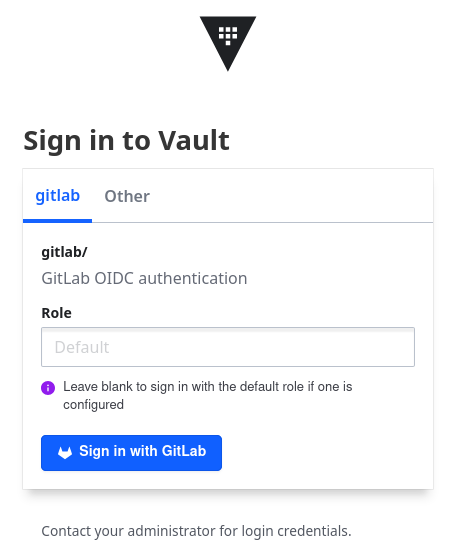

Cet article décrit comment utiliser Terraform et le _provider_ Vault pour configurer l'authentification OIDC avec GitLab. À titre d'exemple, quelques secrets seront aussi stockés dans le Vault.

Le code de cet article est aussi disponible sur GitHub : https://github.com/juwit/terraform-clevercloud-playground/tree/main/vault.

> Cet article a été écrit avec des commandes Terraform, mais fonctionne également avec les commandes OpenTofu équivalentes.

L'installation et la configuration initiale d'un Vault sur Clever Cloud est décrite dans l'article [Vault sur Clever Cloud](/posts/2025-01-03-vault-on-clever-cloud).

## Création d'une policy puis un token pour Terraform

Lors de l'initialisation de Vault, on récupère un _token_ `root`. Utiliser ce _token_ pour effectuer l'ensemble des opérations sur notre Vault n'est pas raisonnable. La première étape va alors consister à utiliser ce _token_ `root`, pour en créer un nouveau qui sera consacré à Terraform. Ce nouveau _token_ disposera de droits élevés, mais pourra être plus facilement invalidé en cas de fuite de données. Et tout ça, nous le faisons en Terraform !

Après avoir positionné les variables d'environnement `VAULT_ADDR` et `VAULT_TOKEN` (avec le _token_ `root` de Vault) :

```shell
export VAULT_ADDR=https://vault-instance.cleverapps.io

# root token
export VAULT_TOKEN=hvs.EXRwc6DumFdDhLk4N8Xa
```

> Ce token est bien entendu un faux 🏴‍☠️️. Cela ne sert à rien d'essayer de l'utiliser chez vous 😆

La configuration du _provider_ Vault est simple, puisqu'il se configure avec les variables d'environnement :

```terraform
terraform {
  required_providers {
    vault = {
      source  = "hashicorp/vault"
      version = "4.5.0"
    }
  }
}

provider "vault" {
}
```

Nous exécutons alors le code Terraform suivant :

```terraform
resource "vault_policy" "terraform" {
  name = "terraform-policy"
  policy = file("terraform-policy.hcl")
}

resource "vault_token" "terraform_token" {
  display_name = "terraform-token"
  policies = ["terraform-policy"]

  ttl       = "24h"
  renewable = true
}

output "terraform_token" {
  sensitive = true
  value     = vault_token.terraform_token.client_token
}
```

La _policy_ contient des droits d'administration pour Vault (requis pour Terraform). Elle a été copiée depuis le _repository_ GitHub [hashicorp-education/learn-vault-codify](https://github.com/hashicorp-education/learn-vault-codify/blob/main/community/policies/admin-policy.hcl).

Elle contient en particulier une règle qui permet la création des _mounts_, ainsi qu'une règle permettant la création des secrets dans le _mount_ qui sera consacré à nos utilisateurs GitLab :

```hcl
path "sys/mounts/*"
{
  capabilities = ["create", "read", "update", "delete", "list", "sudo"]
}

path "gitlab_users_secrets/*"
{
  capabilities = ["create", "read", "update", "delete", "list", "sudo"]
}
```

Le _token_ peut être utilisé pour le reste des opérations avec Terraform, on l'obtient avec la commande `terraform output` :

```shell
$ terraform output -raw terraform_token
 
hvs.rHfvBm3fVdXzedYefPQZwFtYotDMByf3iNh2qGnvnLACfpuhMT2GpE3hyzwAH2gGuV7EhQHbVDkZ9coPRG2Aa3aXFJv
```

> Encore un faux _token_ pour l'exemple ici 🏴‍☠️

Le code de cette première partie est disponible dans le sous-répertoire [03-terraform-token](https://github.com/juwit/terraform-clevercloud-playground/tree/main/vault/03-terraform-token) du _repository_ GitHub.

## Initialisation de la configuration OIDC avec GitLab

Pour cette deuxième partie, le code Terraform que nous allons produire sera dans un nouveau _root module_.
Le code est disponible dans le sous-répertoire [04-oidc-configuration](https://github.com/juwit/terraform-clevercloud-playground/tree/main/vault/04-oidc-configuration) du _repository_ GitHub. 

La configuration du _provider_ Vault est similaire en tout point à celle de l'étape précédente :

```terraform
terraform {
  required_providers {
    vault = {
      source  = "hashicorp/vault"
      version = "4.5.0"
    }
  }
}

provider "vault" {
}
```

Les variables d'environnement à utiliser sont l'URL de Vault, ainsi que le token issu de l'étape précédente : 

```shell
export VAULT_ADDR=https://vault-instance.cleverapps.io

# root token
export VAULT_TOKEN=hvs.rHfvBm3fVdXzedYefPQZwFtYotDMByf3iNh2qGnvnLACfpuhMT2GpE3hyzwAH2gGuV7EhQHbVDkZ9coPRG2Aa3aXFJv
```

Maintenant que Vault est configuré pour être utilisé avec Terraform, on peut configurer l'authentification OIDC avec GitLab.

La première étape consiste alors à créer dans GitLab une application OIDC représentant le Vault.

En fonction de votre instance GitLab et de vos droits d'accès, la création de cette application pourra être faite directement dans la zone d'administration de GitLab, dans un groupe, ou sur votre profil personnel. Ces 3 options sont décrites dans la documentation de GitLab [Configure GitLab as an OAuth 2.0 authentication identity provider](https://docs.gitlab.com/ee/integration/oauth_provider.html).

Pour cet article, j'ai créé l'application dans mon profil personnel.


Il est important de bien saisir l'URL de redirection qui sera utilisée par Vault. Ce format est précisé dans la documentation de Vault [OIDC authentication](https://developer.hashicorp.com/vault/docs/auth/jwt#oidc-authentication). Cette URL prend la forme `https://{host:port}/ui/vault/auth/{path}/oidc/callback`.
Concernant les _scopes_, seul `openid` est obligatoire pour l'utilisation de l'authentification.

Une fois ces informations saisies, on peut valider la création de l'application :


Après validation, GitLab génère un _Application ID_ et un _Secret_ qui permettront de configurer Vault.
Le secret peut également être regénéré à tout instant.

Une fois ces informations récupérées, la configuration de GitLab en tant que _provider_ OIDC pour Vault se fait avec les ressources Terraform `vault_jwt_auth_backend` et `vault_jwt_auth_backend_role`. La première ressource permet de configurer l'authentification avec Gitlab, la seconde permet de configurer comment le _token_ émis par GitLab sera interprété et quelles sont les _policies_ Vault à assigner à la personne authentifiée :

```terraform
resource "vault_jwt_auth_backend" "gitlab_oidc" {
  description = "GitLab OIDC authentication"
  path        = "gitlab"
  type        = "oidc"

  oidc_discovery_url = var.gitlab_url
  oidc_client_id     = var.gitlab_application_id
  oidc_client_secret = var.gitlab_secret
  bound_issuer       = var.gitlab_url

  tune {
    listing_visibility = "unauth"
  }

  default_role = "gitlab-user"
}

resource "vault_jwt_auth_backend_role" "gitlab_user" {
  _backend_         = vault_jwt_auth_backend.gitlab_oidc.path
  role_name       = "gitlab-user"
  token_policies  = ["read-secrets-policy"]

  user_claim            = "name"
  role_type             = "oidc"
  allowed_redirect_uris = ["${var.vault_url}/ui/vault/auth/${vault_jwt_auth_backend.gitlab_oidc.path}/oidc/callback"]
}
```

Les paramètres `oidc` correspondent aux informations récupérées à l'étape précédente.
La valeur `gitlab` pour le paramètre `path` permet de s'assurer que notre instance Vault utilisera bien cette valeur pour la génération de son URL de redirection, qui doit donc être compatible avec celle déclarée dans GitLab.
Le paramètre `tune.listing_visibility` permet de rendre visible le mode d'authentification aux utilisateurs non authentifiés avec la valeur `unauth`. Enfin, on donne un rôle par défaut à nos utilisateurs afin de pouvoir leur donner des accès à des secrets par la suite.

On déclare également le rôle `gitlab-user`. Ce rôle permet de préciser quelle _policy_ aura le _token_ de l'utilisateur, ainsi que quel _claim_ OIDC sera utilisé pour identifier l'utilisateur dans Vault. Il faut aussi indiquer quelles sont les URLs de redirections autorisées par ce rôle.

La _policy_ associée à ce rôle permettra de lire des secrets dans un _mount_ destiné aux utilisateurs de GitLab :

```terraform
resource "vault_mount" "gitlab_secrets" {
  path        = "gitlab_users_secrets"
  type        = "kv"
  options = { version = "2" }
  description = "Secrets for the GitLab users"
}

resource "vault_policy" "read_secrets" {
  name = "read-secrets-policy"

  policy = <<EOT
# List, create, update, and delete key/value secrets at secret/
path "${vault_mount.gitlab_secrets.path}/*"
{
  capabilities = ["create", "read", "update", "delete", "list"]
}

EOT
}
```

Le _mount_ est alors visible dans Vault :


On peut alors créer quelques secrets d'exemple avec des données aléatoires :

```terraform
locals {
  secrets_count = 5
}

resource "random_pet" "username" {
  count = local.secrets_count
}

resource "random_password" "password" {
  count  = local.secrets_count
  length = 16
}

resource "vault_kv_secret_v2" "secret" {
  count = local.secrets_count

  data_json = jsonencode({
    username = random_pet.username[count.index].id
    password = random_password.password[count.index].result
  })
  mount = vault_mount.gitlab_secrets.path
  name  = random_pet.username[count.index].id
}
```

Une fois les secrets créés, ils sont visibles directement dans Vault :


> Mon préféré est le `supreme-caribou` ahah 😆

## Connexion avec GitLab

Tout est maintenant en place.

Lorsqu'on accède à la page de _login_ de Vault, l'authentification _via_ GitLab est proposée.



Lors d'une première authentification, GitLab demandera à l'utilisateur de confirmer qu'il souhaite bien utiliser son compte GitLab pour s'authentifier à notre instance :


Une fois l'authentification terminée, l'utilisateur a accès aux secrets :


## En conclusion

Cet article a présenté comment mettre en œuvre un serveur Vault pour configurer l'authentification _via_ un _provider_ OIDC, en l'occurrence GitLab.

Cette configuration n'est malheureusement pas automatisable entièrement à l'heure de l'écriture de ces lignes.
En effet, bien qu'il existe un _provider_ Terraform pour GitLab, aucune API ne permet de créer les applications OIDC au niveau d'un groupe ou d'un utilisateur, mais uniquement au niveau de l'instance GitLab en elle-même (cf. la documentation [Applications API](https://docs.gitlab.com/ee/api/applications.html)), ce qui restreint l'usage de cette API aux administrateurs de GitLab.
Néanmoins, si votre instance GitLab est auto-gérée, il peut être intéressant d'envisager l'utilisation de la ressource Terraform [`gitlab_application`](https://registry.terraform.io/providers/gitlabhq/gitlab/latest/docs/resources/application).

## Liens et références

* Exemples de code de cet article sur [GitHub](https://github.com/juwit/terraform-clevercloud-playground/tree/main/vault)
  * [Génération de la policy et du token Terraform](https://github.com/juwit/terraform-clevercloud-playground/tree/main/vault/03-terraform-token)
  * [Configuration Gitlab OIDC](https://github.com/juwit/terraform-clevercloud-playground/tree/main/vault/04-oidc-configuration)
* Installation du [CLI Terraform](https://developer.hashicorp.com/terraform/install)
* Installation du [CLI OpenTofu](https://opentofu.org/docs/intro/install/)
* Documentation de [Vault](https://developer.hashicorp.com/vault/docs) :
  * L'image Docker de Vault sur [dockerhub](https://hub.docker.com/r/hashicorp/vault)
  * Configuration du [storage PostgreSQL](https://developer.hashicorp.com/vault/docs/configuration/storage/postgresql)
  * _Policy_ exemple d'administration sur GitHub [hashicorp-education/learn-vault-codify](https://github.com/hashicorp-education/learn-vault-codify/blob/main/community/policies/admin-policy.hcl)
  * Configuration de l'[OIDC authentication](https://developer.hashicorp.com/vault/docs/auth/jwt#oidc-authentication)
* Documentation du _provider_ [Terraform Vault](https://registry.terraform.io/providers/hashicorp/vault/latest/docs) :
  * Ressource [`vault_mount`](https://registry.terraform.io/providers/hashicorp/vault/latest/docs/resources/mount)
  * Ressource [`vault_policy`](https://registry.terraform.io/providers/hashicorp/vault/latest/docs/resources/policy)
  * Ressource [`vault_token`](https://registry.terraform.io/providers/hashicorp/vault/latest/docs/resources/token)
  * Ressource [`vault_jwt_auth_backend`](https://registry.terraform.io/providers/hashicorp/vault/latest/docs/resources/jwt_auth_backend)
  * Ressource [`vault_kv_secret_v2`](https://registry.terraform.io/providers/hashicorp/vault/latest/docs/resources/kv_secret_v2)
* GitLab :
  * [Configure GitLab as an OAuth 2.0 authentication identity provider](https://docs.gitlab.com/ee/integration/oauth_provider.html)
* Photo de couverture par [Ray Hennessy](https://unsplash.com/@rayhennessy?utm_content=creditCopyText&utm_medium=referral&utm_source=unsplash) sur [Unsplash](https://unsplash.com/photos/brown-fox-on-snow-field-xUUZcpQlqpM?utm_content=creditCopyText&utm_medium=referral&utm_source=unsplash)