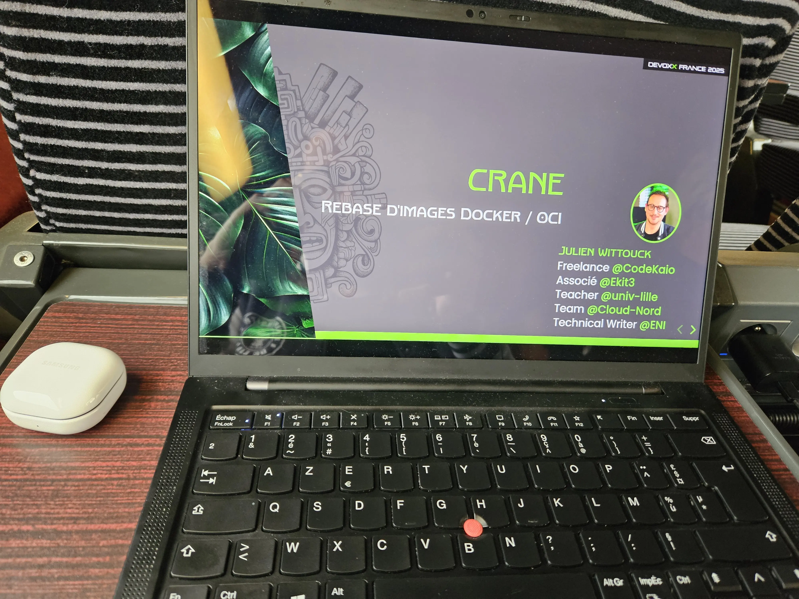
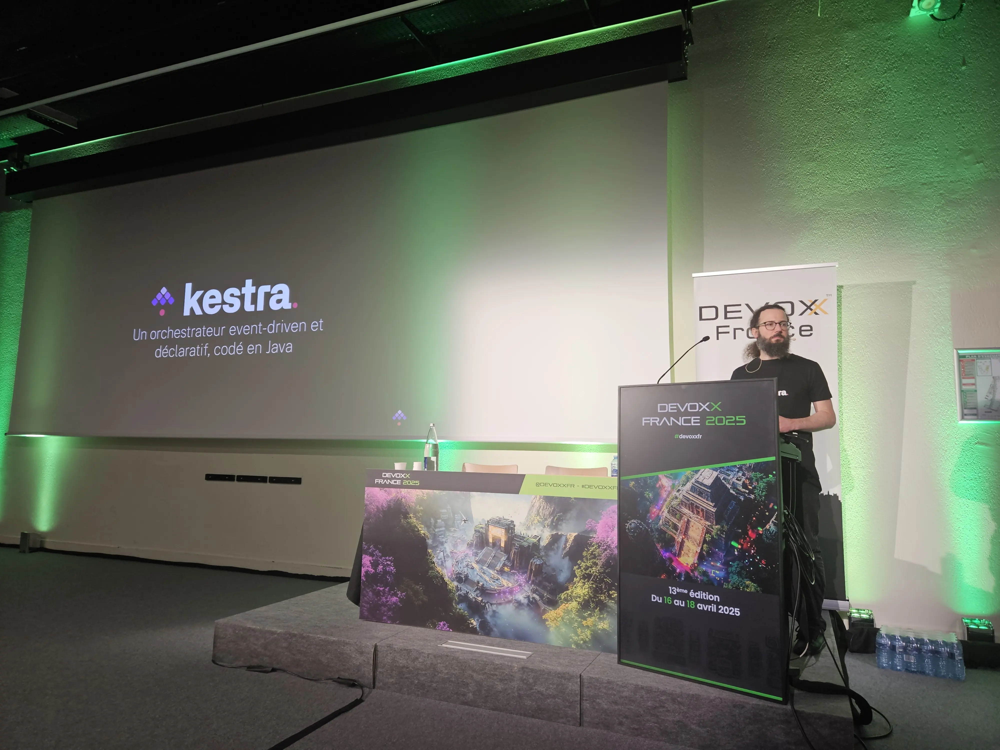
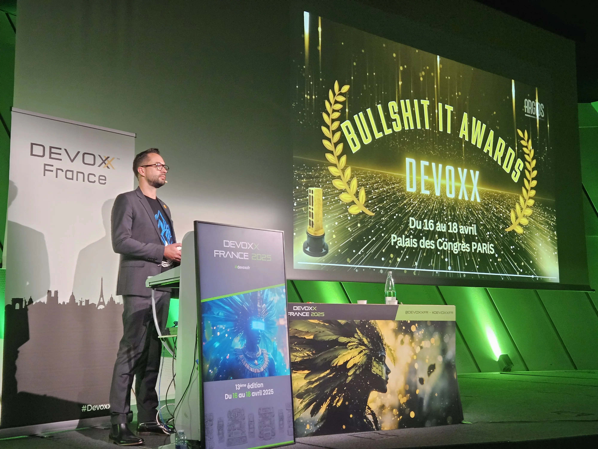
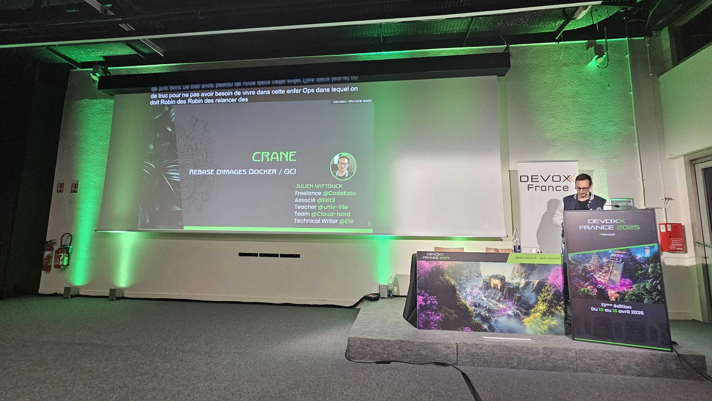
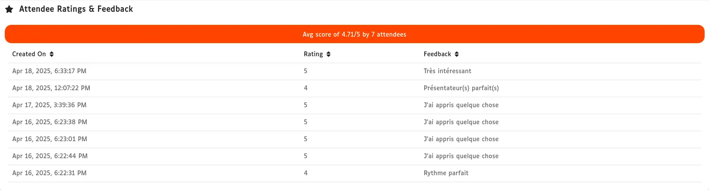
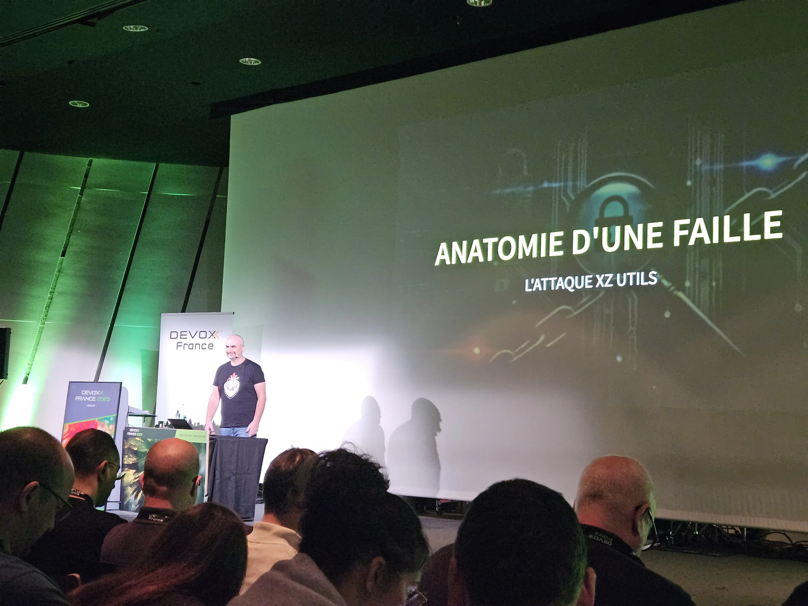
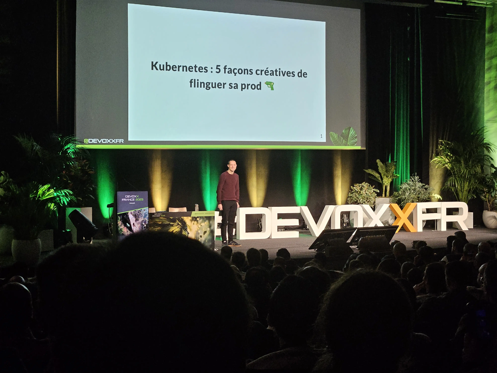
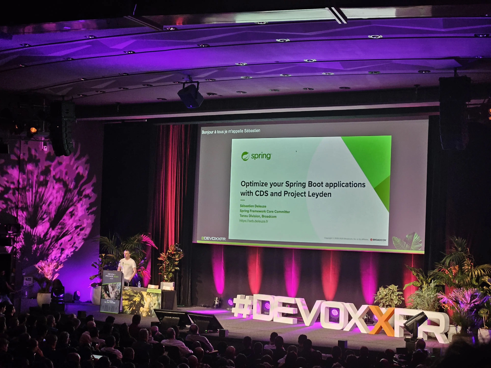
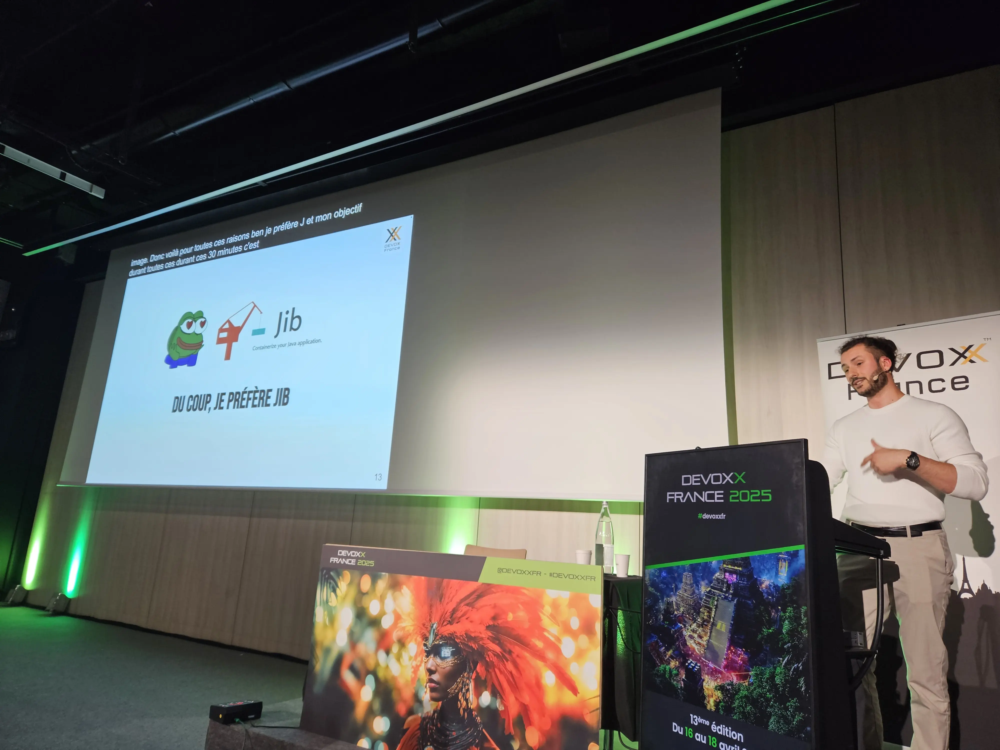
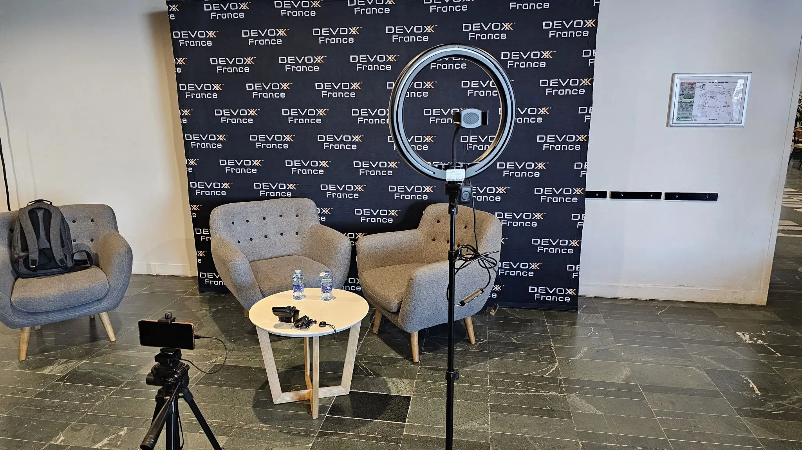

Pour la deuxième année consécutive, j'ai la chance d'être speaker à DevOxx France.
Le pass de speaker me permet d'assister aux trois jours de la conférence (dont les billets partent plus vite que ceux d'un concert d'AC/DC).

Ce post fait le bilan de ma participation à cette édition 2025, sur les deux plans, en tant que speaker et en tant que participant.

## DevOxx, c'est quand même ouf

Être speaker permet de découvrir les coulisses de l'organisation. En observant un peu les fameux _gilets rouges_ (tenue officielle des organisateurs), on peut se rendre compte du travail colossal de l'organisation d'une conférence comme DevOxx France (rien à voir avec ma conf pref : [Cloud Nord](https://cloudnord.fr/)). 15 salles, ça nécessite 15 _gilets rouges_ pour briefer les speakers, et 15 ingés pour la partie technique (micro, équipement de captation). Sans compter l'accueil et la remise des badges, la bagagerie, la logistique pour la distribution des repas, le point info, etc.
Les orgas sont aux petits soins et très nombreux.

L'aspect technique est parfait. Sur chaque pupitre, deux câbles HDMI permettent de brancher des ordinateurs. Un commutateur permet de switcher facilement d'une source à une autre, ce qui facilite les présentations avec deux speakers. Un compteur de temps est aussi mis dans le champ de vision du speaker. Le temps restant pour la présentation défile (toujours trop vite), une lumière jaune s'allume quand il reste quelques minutes (3 à 5 en fonction des formats), une lumière rouge signale quand le temps est écoulé.

> Petit bémol, dans ma salle, ce compteur était pile dans l'alignement du pupitre, il fallait que je me décale légèrement pour pouvoir le voir. Rien de très gênant.

Le top départ de chaque conférence est incroyable, avec les lumières qui s'éteignent, la vidéo d'introduction qui est diffusée, et les lumières qui se rallument avec les projecteurs sur les speakers. C'est impressionnant à voir, on est tout de suite dans l'ambiance. Et quand on présente un talk, vivre ce moment derrière le pupitre provoque des frissons.

4500 personnes par jour, c'est vertigineux. La journée du mercredi est quand même plus calme. Le jeudi et le vendredi, le monde présent est presque oppressant, quand tous les participants se retrouvent autour des stands ou des distributeurs de café. J'ai pris plusieurs fois un peu de temps pour me mettre à l'écart et souffler un peu, et aussi soulager mes pieds, parce qu'on marche beaucoup !

J'étais aussi curieux de la quantité de café qui est écoulée sur la journée. J'ai appris au détour d'une discussion rapide avec une des personnes s'occupant du service du café que les thermos de café en libre-service étaient de plus de 50 litres ! Il faut être deux pour les porter et les déposer sur les tables !

## Mercredi

Mercredi, après avoir un peu révisé dans le train, je suis arrivé vers 9h30, j'ai donc loupé la keynote. En arrivant, ça m'a permis de faire un peu le tour des stands, de prendre un café tranquillement pour m'accoutumer à l'ambiance si particulière du lieu. J'avais déjà prévu mon programme de la journée : quelques talks le matin, aller soutenir mon pote Romain le midi, faire une pause pour exécuter les scripts de prépa de ma démo en début d'aprèm, puis présenter mon talk !

### Bring the Action : Using GraalVM in Production - Alina Yurenko

Cela fait plusieurs années qu'Alina nous présente l'utilisation de GraalVM. Cette année, elle se concentre sur la facilité d'utilisation de la compilation native (quelques lignes dans notre `pom.xml`), sur les options à ajouter pour accélérer la compilation lorsqu'on développe, et sur la compatibilité des librairies. Elle a également fait un focus sur les performances des binaires compilés en présentant quelques tirs de perfs (similaires à la JVM, mais sans le temps de warmup). Autre nouveauté intéressante, GraalVM commence à supporter WebAssembly, ce qui permettra à terme de pouvoir compiler du Java pour l'exécuter dans un navigateur !

> Cette présentation tout en démo montre bien les évolutions de GraalVM native, orientées _expérience développeur_. Cela donne clairement envie de tester sur un projet !

### Kestra : un orchestrateur open source, event driven et déclaratif, codé en Java - Loïc Mathieu

Dans ce lunch talk (15 minutes, ça va vite !), mon pote Loïc a présenté Kestra, son architecture, et a fait une démo d'écriture et d'exécution d'un workflow simple dans l'interface Kestra, et a présenté l'écosystème des plugins Kestra. Il a aussi expliqué les avantages d'avoir choisi Java pour le développement de cet outil, en particulier l'utilisation de Nashorn (qui sera remplacé à terme par GraalVM polyglot), pour exécuter les scripts écrits dans le langage du choix du développeur.

> J'ai apprécié re-découvrir ces éléments, même si 15 minutes sur ce sujet, c'est un peu court ! J'ai eu l'occasion de rediscuter du fonctionnement de Kestra avec Loïc, au détour d'un couloir, donc ma curiosité a été satisfaite 😃

### BullShit IT Awards : Célébrons les erreurs des équipes Tech ! - Romain Rozewicz

Une salle comble pour mon pote Romain ! Romain nous présente les meilleures pépites qu'il a pu voir ou entendre sur des projets IT ! Le public a été mis à contribution pour voter pour la meilleure pépite. Une conf décalée, qui sera aussi rejouée au DevLille cette année.

> J'ai voté pour "PR ouverte depuis 72 jours, 19 commentaires, 0 merge". Bonne ambiance dans la salle, le public semble avoir apprécié le show. Chaque pépite a été applaudie sous les rires du public. Bravo 💙

### OpenRewrite : Refactoring as code - Jérôme Tama

Jérôme nous explique comment fonctionne OpenRewrite, et comment écrire notre propre code de refactoring. Le cas d'usage présenté est assez concret (migration JUnit 4 à 5) et illustre bien l'intérêt de l'outil.

> Un outil intéressant. Par contre, écrire les migrations soit même semble quand même assez compliqué. Mais à tester en utilisant les recettes contribuées par la communauté.

### Rebase d'image Docker/OCI avec crane - Julien Wittouck

Je ne pouvais pas manquer mon propre talk 😅
Cela s'est plutôt bien passé de mon point de vue. J'ai même eu le temps de jouer une démo que je m'étais gardé sur le côté au cas où.

L'abstract et les slides sont dispo ici : [Rebase d'images Docker/OCI avec crane](/talks/talk-rebase-crane).

Je n'ai pas eu énormément de feedbacks sur l'appli, mais ils sont tous positifs !

### Un p'tit tour sur les stands

J'ai pas mal discuté avec les potes de Clever Cloud, des nouveautés à venir, et du sursaut de souveraineté récent qu'ont certains de leurs clients. Cela montre une prise de conscience qui sera intéressante à creuser. Ils m'ont aussi offert leur nouveau t-shirt, qui est d'une qualité incroyable comme c'est le cas tous les ans.

Sur le stand de Michelin, une animation _Gran Turismo_ était organisée : 1 tour de circuit du Mans, dans un siège baquet, avec volant. J'ai posé le deuxième temps et gagné une casquette Michelin plutôt cool.
J'ai un peu discuté avec Redis et MongoDb également.

### La soirée des speakers

J'ai fait un saut rapide à la soirée des speakers. C'est assez impressionnant de voir tout ce monde. Nous avons un peu discuté, mangé un bout et dégusté un verre de vin. Comme j'étais quand même assez fatigué par cette journée, je n'y ai pas passé beaucoup de temps.

## Jeudi

Jeudi, j'arrive boosté au Palais des congrès. Malheureusement, il y a déjà la queue pour rentrer dans l'amphi bleu pour les keynotes. J'opte donc pour une tactique alternative : café + croissant, et salle Maillot qui est une bonne salle d'_overflow_.

### Keynote : Langage, IA et propagande : la guerre des récits a déjà commencé - Elodie Mielczareck

Elodie présente les différents étages de la correspondance entre le langage et le monde réel. Elle évoque des termes qu'on observe souvent dans l'actualité, en particulier la notion de "post-vérité" et les thèmes abordés par le film Matrix autour de la notion du réel.

> Assez inspirant, parfois difficile à suivre. Je pense que je re-visionnerai cette keynote pour m'assurer de comprendre ces notions que j'ai eu un peu de mal à appréhender (le café met 30 minutes à faire effet, on était un peu juste là ☕😅)

### Keynote : La territorialisation des infrastructures comme levier de pouvoir - Ophélie Coelho

En s'appuyant sur son travail de recherche et sur des cartes géographique des câbles sous-marin et de la localisation des centres de données, Ophélie met en avant le pouvoir et le contrôle que peuvent avoir des entreprises ou des états sur nos communications réseau. Elle met aussi en avant l'importance du logiciel dans ce jeu, tout en haut du modèle OSI.

> Là encore, c'est un sujet qui résonne pas mal avec les sursauts de souveraineté qu'on observe en ce moment. Le lien entre géopolitique et numérique est indiscutable. Je pense que je vais acheter son livre "[Géopolitique du numérique. L’impérialisme à pas de géants](https://shs.cairn.info/geopolitique-du-numerique--9782708254022?lang=fr)" pour me renseigner plus en détail.

### Anatomie d'une faille - Olivier Poncet

Olivier retrace les différentes étapes qui ont mené à l'implémentation de la faille dite 'xz' de l'année dernière. De l'ingénierie sociale pour "infiltrer" les maintainers du paquet cible, à l'ingénierie technique pour intégrer le code malveillant dans les paquets, jusqu'à la découverte "accidentelle" de la faille.

> Beaucoup de gens ont cité cette conférence comme étant une de leurs préférées de cette édition de DevOxx 2025. C'est aussi le cas pour moi. Le travail de recherche qu'a produit Olivier sur ce talk est impressionnant et on découvre (avec la pédagogie qui le caractérise) les détails de cette faille, qui est complètement folle. C'est bien construit, et c'est effrayant.

### Kubernetes : 5 façons créatives de flinguer sa prod 🔫 - Denis Germain

Avec l'émoji dans le titre 🔫. Denis présente cinq cas issus de ses expériences, qui ont conduit à une prod en PLS. Des erreurs bêtes liées à des suppressions de ressources Helm, des cas d'erreurs en cascade liées à des liveness checks. Au delà des erreurs, Denis présente aussi les actions mises en place pour que cela ne se reproduise plus, backups du cluster, admission controller et policies Kyverno ou OPA.

> Un talk plein d'humour, sous la forme d'un REX. C'est bien expliqué et on repart avec des solutions concrètes pour éviter de reproduire ces cas chez nous (on aura au moins été prévenu). Un de mes talks préférés sur cette édition.

### Comment builder Java depuis ses sources - Antoine Dessaigne

Antoine explique sous forme de démo les étapes pour builder un JDK, en partant du `git clone`, pour finir avec un `./java --version`.
L'environnement de build est construit au fur et à mesure avec des `apt install`. Le process de build est pour finir assez simple, mais contient des dépendances amusantes issues de certains modules de Java : `alsa` pour la partie gestion du son, `cups` pour le code d'impression. Chose intéressante, le build cross-plateforme a été évoqué, et semble assez simple à mettre en place.

> J'étais curieux de ce talk. Je n'ai jamais pris le temps de builder moi-même un jdk, donc je voulais savoir ce que ça impliquait. C'est beaucoup plus simple que ce que j'imaginais. Je testerai probablement l'image Docker qu'il a mis à disposition pour me faire une idée.

### Communiquer à 36000 km : l'art de l'efficacité avec moins d'un Watt - Paul Pinault

Un talk sur les communications IOT via satellite. On y parle de modulation de fréquences, de consommation électriques, de gain d'une antenne satellite, et de la différence entre les constellations de satellites et les géostationnaires.

> J'ai compris 10% de ce talk. Néanmoins, c'est assez intéressant de voir que le sujet reste accessible au commun des mortels en termes d'implémentation et de coût. Un talk à voir pour s'ouvrir l'esprit et découvrir le monde du satellite.

### Optimisez vos applications Spring Boot avec CDS et Project Layden - Sébastien Deleuze

Sébastien (qui développe Spring chez Broadcom) présente le CDS (pour _Class Data Sharing_) appliqué à Spring Boot. Une nouvelle option a été introduite dans Spring Boot 3.3 pour faciliter l'export du dump `-Dspring.context.exit=onRefresh`. Il présente aussi rapidement l'_AOT cache_ du projet Leyden, qui vise à encore étendre le CDS pour améliorer les performances au démarrage.

> CDS a été introduit avec Java 5 ! Mais il a été amélioré au fur et à mesure des versions de Java, et les fonctionnalités illustrées sont disponibles depuis Java 10. C'est intéressant de voir un cas d'usage de cette ancienne feature de Java outillé par Spring Boot, et cela semble assez facile d'utilisation pour être utilisable en production. 

### Jib : Osez le Dockerless pour vos projets Java ! - Ludovic Chombeau

Ludovic présente Jib, un plugin maven qui permet de builder des images OCI sans avoir besoin de Docker. Il nous explique comment est constituée une image OCI, et comment Jib construit ses images différemment de ce que fait Docker. Plusieurs démos expliquent aussi les étapes nécessaires à la configuration du plugin. Enfin, il présente aussi un REX de l'utilisation de cet outil chez Leroy Merlin.

> Un talk que je connais par coeur, puisque j'ai coaché Ludo dans son écriture. Je me devais d'être présent pour le soutenir pour son premier DevOxx !
> L'outil vaut vraiment le détour ! Tout autant que les Buildpacks.

### Un p'tit tour sur les stands

Ce jeudi, j'ai eu des discussions intéressantes sur les stands de _Red Hat_ avec Zineb Bendhiba, ainsi que sur les stands de _Gatling_ et _Google_. J'ai d'ailleurs récupéré deux paires de chaussettes chouettes chez _Red Hat_ et _Gatling_, ainsi qu'une peluche chez _Red Hat_ que j'ai donné à mon pote Romain pour sa fille.
J'ai aussi re-joué à _Gran Turismo_ sur le stand de _Michelin_, et j'ai pû essayer le jeu avec un casque de VR : c'est bluffant, mais mon cerveau m'a fait comprendre qu'il ne comprenait pas ce qu'il se passe 😅. C'est chouette pour jouer quelques tours. 

## Vendredi

Vendredi petite journée, je me suis couché assez tard, et je voulais rentrer sur Lille aux alentours de 18h, donc je suis parti assez tôt, et je n'ai donc assisté qu'à quelques talks.
Je suis arrivé au Palais des congrés vers 8h30, et j'ai directement pris une place en salle Maillot pour l'overflow des keynotes.
Nous avons aussi pris le temps avec mon pote Romain d'[enregistrer un rush de pas loin d'une heure](https://www.linkedin.com/posts/julien-wittouck_michelin-michelinit-devoxxfr-activity-7318937665716842497-B_Ry), en discutant de nos impressions respectives sur la conférence.

### Keynote : Plongez dans l’Ère Quantique : décryptez et anticipez la révolution à venir - Fanny Bouton

Fanny nous présente dans les grandes lignes les enjeux autour de l'informatique quantique. Bonne nouvelle : l'Europe a un train d'avance, avec des startups qui construisent des ordinateurs quantiques sur différentes technologies. OVH a d'ailleurs investit dans une des ces machines. Elle nous explique également que les perspectives sont lointaines, et les cas d'usages concrets sont encore à trouver. Elle met aussi en avant l'aspect multi-compétences de l'informatique quantique, entre les développeurs qui doivent trouver de nouvelles façons de coder, et les ingénieurs qui doivent trouver de nouvelles façons d'héberger ces machines avec leurs propres contraintes. Notre informatique traditionnelle n'est pas encore prête à être remplacée et ne le sera peut-être jamais.

> Une keynote intéressante pour s'ouvrir l'esprit. Je n'avais pas la vision de tous ces enjeux. D'ici 15 à 20 ans (!), il faudra penser à se former 🧑‍🎓

### Keynote : Les LLM rêvent-ils de cavaliers électriques ? - Thibaut Giraud

Dans sa keynote, Thibaut débunke la vision du perroquet stochastique des LLM. Les LLM ne seraient pas uniquement des générateurs de mots les plus probables.
Pour nous ouvrir l'esprit, il nous présente une vision du jeu d'échecs sous la forme de la [notation descriptive](https://fr.wikipedia.org/wiki/Notation_descriptive). Il montre que certains modèles de LLM spécialisés sont capables de jouer des parties avec le niveau d'un joueur moyen classé (donc plus fort que moi ♟️). Il explique aussi que la représentation de l'état du plateau peut être observée dans l'état des neurones du modèle lorsqu'il "réfléchit" à un coup, comme un joueur se représente le plateau dans son esprit.

> C'est assez bluffant de voir que ces modèles spécialisés arrivent à jouer au niveau d'un joueur classé. Et la perspective de l'équivalent de la représentation mentale du tableau est assez vertigineuse.

### Pour une autre idée de la CI, sur la machine du développeur, avec Dagger - Yves Brissaud

Yves nous présente les différentes solutions de CI existantes et leur historique. Puis il présente Dagger, qui permet d'exploiter la puissance des machines des développeurs pour exécuter une partie de la CI.
Il présente avec une démo le développement d'un pipeline, ainsi que les concepts autours de la modularisation du code et la réutilisabilité des modules.

> Le concept est intéressant, et c'est bluffant d'efficacité. Le truc qui m'a le plus impressionné est la capacité de développer un module dans un langage et de le consommer dans un autre. Comme tout est container, c'est assez facile et tout s'intègre parfaitement.

### Envie de booster ta carrière ? Open source-toi ! - David Pilato

David nous raconte dans ce talk son histoire personnelle, qui l'a amené de simple contributeur à ElasticSearch, en répondant à des questions sur des forums, à son métier d'évangéliste pour Elastic aujourd'hui.

> C'est assez intéressant de voir ce parcours, et de se rendre compte de l'impact qu'une personne peut avoir sur une communauté, et inversement. Un talk inspirant.

### Un p'tit tour sur les stands (et sur le circuit du Mans 🏎️, encore... 😅)

Ce vendredi, j'ai tenté le QCM "Java pour les seigneurs Sith" sur le stand de SCIAM. J'ai eu la note honorable de 2 / 10. C'était un des QCM les plus difficiles, donc j'ai appris quelques subtilités de mon langage préf.
J'ai aussi un peu discuté avec Sonatype, et je suis allé rejouer à _Gran Turismo_ pour le kiff (on ne se refait pas 😅).
Je suis parti de la conf assez tôt, autour de 14h. Avec mon pote Romain, nous avons un peu fait le bilan de ces 3 jours autour d'une bière, et discuté de notre avenir de speaker respectifs ! Puis nous sommes repartis vers Lille en milieu d'après-midi, la tête bien remplie, avec l'envie certaine de revenir l'année prochaine.

## Conclusion

Je suis très content d'avoir assisté à cette édition 2025. C'est aussi ma deuxième participation consécutive en tant que speaker ! Donc je me sens aussi un peu privilégié d'assister aux 3 jours de la conférence.
Cette année, avec Ekité, nous avons embarqué Romain et moi six de nos salariés pour la journée du mercredi. Ils étaient aussi très contents de leur journée.
DevOxx, c'est quand même la conférence incontournable en France. Les talks sont de qualité, l'ambiance est unique, l'amphi bleu est icônique.

Je suis content des talks que j'ai vu, et j'ai aussi une liste de talks que j'ai loupé, il va donc falloir que je prenne un peu de temps pour regarder quelques-unes des vidéos quand elles seront sorties (je partagerai aussi ma liste ici).

L'organisation de DevOxx me donne aussi des idées pour Cloud Nord, même si nos moyens ne sont clairement pas les mêmes !
Vivement l'année prochaine.
