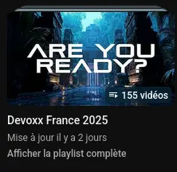

En ce début de mois de mai, il fait beau, donc on n'a pas très envie de passer du temps sur son ordi à scroller pour faire sa veille.
Alors on lit la veille de Wittouck !

> Sur pas mal de liens, j'ai oublié de noter les sources qui m'ont permis de les découvrir (oups), je vais faire attention à ce point pour la prochaine édition.

<!--more-->

## 🛜 Internet

* [DevOxx France 2025](https://www.youtube.com/playlist?list=PLTbQvx84FrATiYy0se8yoHJHicXtmDbB-) sur Youtube

> La playlist de Devoxx France 2025 se remplit avec des vidéos masquées, donc la publication devrait bientôt être faite 🤞
> 

* [Professeur Fabrizio Bucella](https://www.youtube.com/@FabrizioBucella/shorts) sur Youtube.

> J'ai découvert les _shorts_ de ce professeur belge par hasard. Il nous explique des principes de physique en quelques minutes, principalement avec un tableau noir et une craie. C'est incroyable de pédagogie, plein d'humour et de bel accent belge 🇧🇪. Salukes.

* [Thoughts on Bluesky Verification](https://steveklabnik.com/writing/thoughts-on-bluesky-verification/?utm_source=pocket_list) par [Steve Klabnik](https://bsky.app/profile/steveklabnik.com) sur [Bluesky](https://bsky.app/profile/steveklabnik.com/post/3lne4frl43s2d)

> Un article intéressant qui détaille quelques éléments du protocole AT implémenté par BlueSky et en particulier les enregistrements qui permettent la vérification (coche bleue).

## 🔒 Sécurité

L'actualité principale de ce mois d'avril a été l'annonce de la fin du financement des programmes CVE et CWE par le gouvernement fédéral Américain, _via_ l'entité MITRE. Le gouvernement est depuis revenu en arrière et a prolongé le financement de 11 mois, mais cette annonce a inquiété toute la sphère sécu. Et l'ombre de la fin du financement plane toujours.
À noter que le financement de _NVD_ (la _National Vulnerability Database_) qui est aussi utilisée par des outils comme _OWASP Dependency Check_ ne serait pas directement impacté par un arrêt du financement de MITRE (car étant financés par une autre entité fédérale). Ces outils continueraient à fonctionner (ouf).

Plusieurs liens autour de ce sujet :

* [La lettre envoyée aux membres du _board_ CVE](https://bsky.app/profile/tib3rius.bsky.social/post/3lmulrbygoe2g) _via_ [Tib3rius](https://bsky.app/profile/tib3rius.bsky.social) sur Bluesky

> Ce document semble être la première information sur l'arrêt du financement

Suite à cette annonce, et pour assurer sa pérennité et son indépendance aux financements du gouvernement américain, la _CVE Foundation_ a été officialisée :

* [CVE Foundation](https://www.thecvefoundation.org/)

> Ce document décrit principalement les enjeux du programme et les buts principaux de la fondation : une gouvernance internationale et la transparence sur la gestion des financements.

Pour comprendre les événements : 

* [CVE Program Funding Reinstated—What It Means And What To Do Next](https://www.forbes.com/sites/kateoflahertyuk/2025/04/16/cve-program-funding-cut-what-it-means-and-what-to-do-next/) _via_ [Gergely Orosz](https://bsky.app/profile/gergely.pragmaticengineer.com) sur [BlueSky](https://bsky.app/profile/gergely.pragmaticengineer.com/post/3lmwpojt55c27)

> Cet excellent article résume ce qu'il s'est passé sur ces quelques jours, depuis l'annonce de la fin du financement, et quelle pourrait être la suite.

Enfin, il serait peut-être intéressant de creuser l'alternative européenne : _EUVD_ (pour _European Union Vulnerability Database_), qui reprend aussi les données de CVE, mais permettrait une indépendance en cas de coupure de CVE, qui semble maintenant partiellement protégé par la fondation, mais reste encore sous gouvernance Américaine.

* [EUVD](https://euvd.enisa.europa.eu/homepage) : La page d'accueil de la base de données _EUVD_, portée par l'_ENISA_ (_European Union Agency For CyberSecurity_)

> Je pense que cette base de données pourrait devenir une alternative fiable à la NVD américaine. À voir si des outils comme OWASP DC ou OWASP DT sont forkés / paramétrables pour se brancher sur ces données. Je n'ai pas trouvé comment télécharger le JSON avec les EUVD 😅

## ☕ Java

* [What's new in Maven 4?](https://maven.apache.org/whatsnewinmaven4.html)

> Maven 4 n'est pas encore sorti, mais dévoile une partie de ses fonctionnalités : Java 17 par défaut (en replacement de Java 5 ?), Des modifications sur le format du pom avec la séparation du pom de _build_ du pom de consommation. Et aussi l'officialisation du type `bom` comme type de package. `mvnd` reste un projet à part. Un guide de migration est aussi déjà disponible.

* [javac on WebAssembly](https://graalvm.github.io/graalvm-demos/native-image/wasm-javac/)

> Cette info a été _teasée_ par Alina Yurenko à DevOxx France 2025. GraalVM développe la capacité à compiler du code en WebAssembly (l'exécution de WebAssembly est déjà implémentée par GraalVM Polyglot). Cela ouvre de nouvelles possibilités : exécuter du code Java dans un browser, sans avoir besoin de runtime particulier !

## 🧠 IA

* [AI 2027](https://ai-2027.com)

> Un article qui imagine l'évolution de l'IA dans les années à venir. L'article prend beaucoup en compte le contexte géopolitique actuel comme inspiration. On frise la science-fiction (surtout sur la fin, qu'on peut choisir entre deux scenarios). À lire absolument.

## 👷 DevOps

* [OpenTofu Joins CNCF](https://thenewstack.io/opentofu-joins-cncf-new-home-for-open-source-iac-project/?utm_source=pocket_list) _via_ [TheNewStack](https://thenewstack.io)

> La CNCF a accepté l'intégration de OpenTofu en tant que projet _sandbox_. C'est une belle étape de franchie pour ce fork de Terraform, qui s'inscrit donc bien dans la durée.

---

La prochaine publication est prévue autour du 16 mai 🗓️

Photo de couverture par [Michiel Leunens](https://unsplash.com/@leunesmedia?utm_content=creditCopyText&utm_medium=referral&utm_source=unsplash) sur [Unsplash](https://unsplash.com/photos/white-ceramic-mug-on-white-ceramic-saucer-beside-bread-on-white-ceramic-plate-0wIHsm2_1fc?utm_content=creditCopyText&utm_medium=referral&utm_source=unsplash)