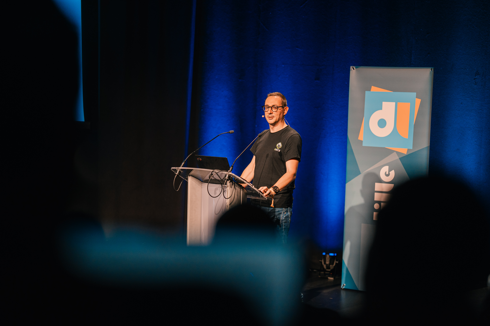
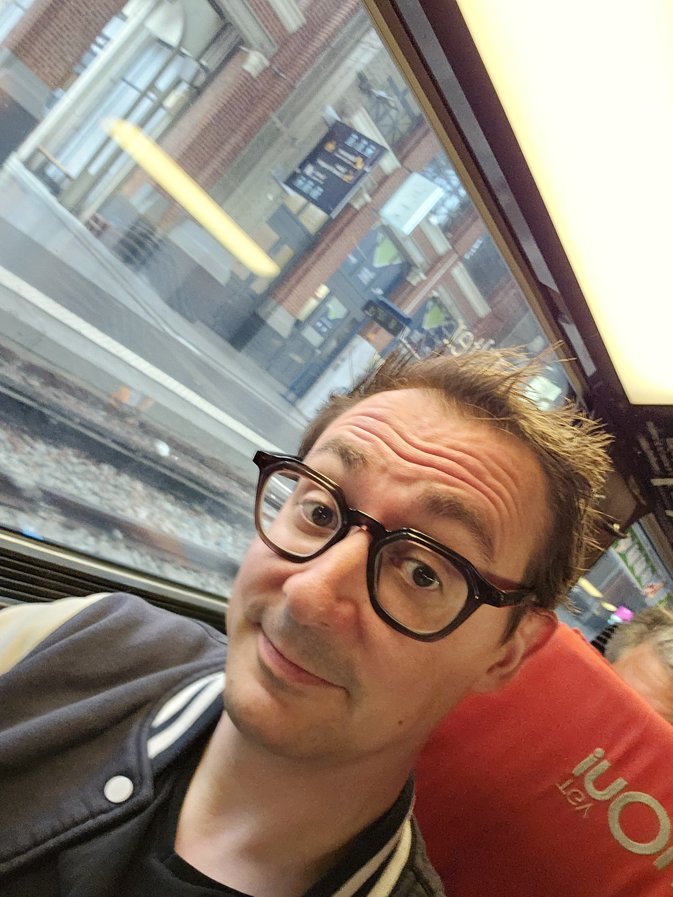
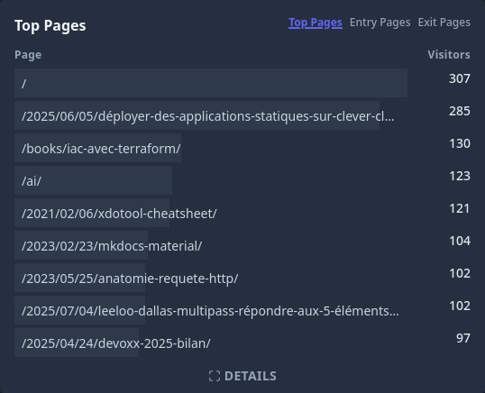
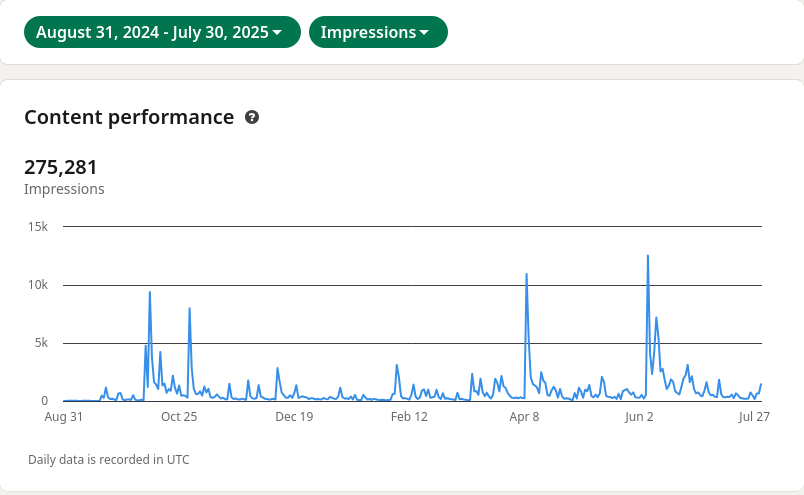
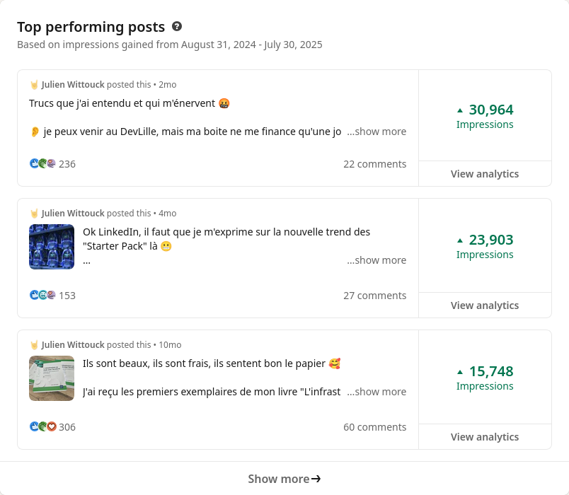
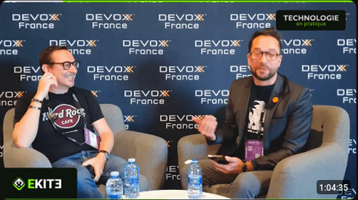

Maintenant que l'été est bien avancé, il est intéressant pour moi de faire le bilan de mon année 2024-2025.
C'est la première fois que je fais ce genre d'exercice. C'est l'occasion de prendre un peu de recul et de voir si je continue ou pas certaines activités l'année prochaine.

Mine de rien, l'année était quand même bien chargée.

<!--more-->

## Conférences et talks

Cette saison, j'ai eu le plaisir d'assister à pas mal de conférences :

* Cloud Nord le 10 octobre 2024 (en tant qu'orga) ;
* Clever Cloud Fest le 7 février (j'ai fait un passage express) ;
* Devoxx France du 16 au 18 avril (en tant que speaker) ;
* DevLille les 12 et 13 juin (en tant que speaker) ;
* Sunny-Tech les 26 et 27 juin (en tant que speaker).

Ça représente un total de neuf jours en conf, c'est pas mal du tout.

Mis en perspective, ça ne représente que 5% de mon temps (sur une base de 200 jours / an), donc je pourrais assister à plus de conférences.
Pour 2025-2026, je vais essayer de garder au moins le même rythme.

### Mes talks

Pour la saison, j'avais travaillé trois sujets de talk :

* "OpenTofu - 2 ans après" : pour dresser le bilan après le _drama_ et le _fork_ ;
* ["Rebase d'image Docker/OCI avec crane"](talks/talk-rebase-crane) : une démo technique d'un concept qui me travaillait depuis près de deux ans ;
* ["Let's play Factorio"](talks/talk-lets-play-factorio) : un talk de vulgarisation fun, dans un de mes jeux préférés.

J'ai soumis ces talks un peu partout, et j'ai eu la chance de pouvoir donner 3 sessions :

* "Rebase d'image Docker/OCI avec crane" à Devoxx France (30 minutes) ;
* "Rebase d'image Docker/OCI avec crane" au DevLille (45 minutes) ;
* "Let's play Factorio" à SunnyTech (50 minutes).

{class=images-grid-2}

"Let's play Factorio" sera aussi rejoué sur la saison 2025-2026.
Ce talk me travaillait depuis près de deux ans, je suis content d'avoir enfin eu l'occasion de l'écrire et de le donner.

> C'est le talk le plus cool que j'ai eu l'occasion de donner. Un pur kiff. Le public de Sunny-Tech a kiffé aussi 💙

Le sujet sur OpenTofu n'a été accepté à aucune conf, mais je le retravaillerai pour le reproposer l'année prochaine. J'ai aussi arrêté de le soumettre quand mes deux autres sujets ont été acceptés, pour ne pas (trop) me mettre en difficulté.

Du point de vue du temps de préparation de ces talks, j'ai une métrique qui semble correcte d'année en année : une heure de prépa par minute sur scène.

J'ai donc passé une trentaine d'heure à préparer la première session de "Rebase d'image Docker/OCI avec crane" et une dizaine d'heures pour l'adapter au format un peu plus long du DevLille.
"Let's play Factorio" m'a demandé pas loin de cent heures de préparation. C'est ce que j'imaginais, car ce talk a un format bien particulier. J'espère pouvoir le rejouer plusieurs fois l'année prochaine pour essayer de "l'amortir".

> J'ai joué à Factorio sur mon temps de travail 😅

### Le coût financier

Tout ça mis bout à bout, en prenant en compte mes déplacements, ça représente presque une trentaine de jours.
J'avais bloqué dans mon emploi du temps les semaines avant les confs pour finaliser les préparations. Je ne compte pas les nuits presques blanches à cogiter ou angoisser.

Pour les déplacements, je voyage systématiquement en train. J'aime prendre des trains directs, ça permet de me poser et d'éviter un stress supplémentaire lié à un changement de gare sur Paris. Je sais que certains d'entre vous ont un kink pour mes photos de train avec ma tête fatiguée, je vous ai donc rassemblé ces photos ici 😅

{class=images-grid-3}

> Mon comptable fait probablement la même tête que moi sur la dernière photo quand il voit les coûts listés plus bas 😬

Les différents trajets en train m'ont coûté environ 600 euros.
On peut ajouter aux déplacements les nuits d'hôtel, qui m'ont coûté approximativement 1200 euros.

Si j'ajoute à ça le temps que j'ai passé en préparation, transport et en conférence, soit les trente jours cités plus haut, temps que je valorise sur un TJM de 750 euros, cela représente un investissement de près de 25 000 euros.
Soyons bien clairs avec ces chiffres. Ce n'est pas de l'argent que j'ai sorti de ma poche. Ça représente le chiffre d'affaires supplémentaire que j'aurai pu faire si j'avais presté plutôt que d'aller en conf.

Étant donné que les confs font partie des choses que je préfère, il va sans dire que je ne réfléchis même pas à faire ces investissements. J'estime que mes prestations sont justement là pour moi pouvoir financer ces activités.

C'est pour moi le principal avantage à mon statut de freelance, ça fait directement partie de ma veille.

### Cloud Nord

C'est la troisième année que je m'implique dans cette conférence que j'affectionne particulièrement.
Après avoir été relecteur au CFP, l'année dernière, j'avais rejoint officiellement les organisateurs bénévoles de Cloud Nord.
J'étais donc présent sur l'édition 2024 en tant qu'orga. Si vous y êtes venus, j'ai probablement scanné vos billets le matin, ou je vous ai accueilli dans une des salles l'après-midi.

> Il est chouette notre nouveau site web  💙

Cette année, je m'implique de nouveau dans l'organisation de la conférence.
Nous avons retravaillé [notre site web](https://cloudnord.fr/) (à partir du template d'OpenPlanner et de Sunny-Tech) et trouvé un nouveau lieu et de nouveaux partenaires de restauration.
Le sujet du moment est celui du CFP, il est d'ailleurs toujours possible de [postuler](https://conference-hall.io/cloud-nord-2025) jusqu'au 17 août. Le planning de la journée sera publié la semaine suivante, je vise la date du 22 août.

## Les cours

Une des activités que j'apprécie également est l'enseignement.

Cette année, j'ai donné :

* 68 heures à l'Université de Lille sur les thèmes Java / Spring ;
* 88 heures dans des écoles privés sur le thème IaC / Terraform.

J'aurais au total enseigné mon art (ahaha) à près de 70 étudiants de diverses formations.

Pour ces cours, j'ai la chance d'être soutenu par un sponsor qui finance une organisation dans laquelle mes étudiants déploient leurs TPs : Clever Cloud.
Pour la saison prochaine, Scaleway a également accepté de sponsoriser cette activité avec des crédits pour les TPs de mes étudiants.

J'estime le coût de ces sponsorings à environ 300 euros au total.
C'est clairement un coût que je pourrais prendre à ma charge, mais le sponsoring permet d'éviter de devoir surveiller en permanence le billing associé à ces comptes, donc c'est un véritable plus.

Clever Cloud, Scaleway, si vous lisez ces lignes : un énorme merci à vous 💙

## Mon site

La saison 2024-2025 a aussi été pour moi une saison de reprise d'écriture.
Cette saison, j'ai écrit 17 articles (en comptant celui-ci) que j'ai publiés ici.

Parmi ces articles, ["La veille de Wittouck"]() que j'ai lancée au mois de mars représente six articles. Cette série est en pause depuis fin mai (j'étais trop pris par les confs de l'été), elle reviendra à la rentrée.

Pour la période du 1er septembre au 1er août, 1800 personnes ont visité [codeka.io](https://codeka.io), pour un total de 2600 pages lues.

L'article ayant eu le plus de succès est [Déployer des applications statiques sur Clever Cloud]().
Je pense que cela s'explique par le fait que Clever Cloud ait repartagé cet article, ainsi que le pote [Denis Germain](https://blog.zwindler.fr/).
C'est aussi un des articles les plus récents, peut-être que mon audience se construit petit à petit.

Parmi les pages les plus visitées, il y a également trois "anomalies".
La page [xdotool cheatsheet]() est visitée presque exclusivement depuis la Russie. Je suppose qu'elle est bien référencée chez Yandex. C'est aussi une des rares pages que j'avais traduite en anglais.
Les deux autres anomalies sont les pages [Créer un site web de documentation statique avec MkDocs]() et [Anatomie d'une requête HTTP]().
Ces deux pages sont plutôt bien référencés sur Google et Bing, et reçoivent un flux de visites constant. Vu que leur contenu date un peu, ça m'a poussé à ajouter un warning sur l'entête des pages ayant plus de deux ans pour éviter que les lecteurs ne soient induits en erreur.

Ce site est développé avec [Hugo](https://gohugo.io/), le code source du site est d'ailleurs disponible sur [GitHub](https://github.com/CodeKaio/codeka.io).
J'ai compté 214 commits sur ce repository entre le 1er septembre 2024 et aujourd'hui (`git log --since='2024-09-01' --oneline | wc -l`).
Les commits représentent la publication des articles et leur correction, mais aussi les nombreuses adaptations que je fais sur le thème du site. Je suis plutôt satisfait de l'état actuel.

Pour la saison prochaine, je vais essayer de maintenir le rythme. J'ai trois drafts en cours sur des sujets autour de Java, et déjà cinq autres sujets à traiter. Mon calendrier éditorial de début de saison 2025-2026 est déjà plein.

## Mes réseaux sociaux

J'ai réduit ma présence sur les réseaux sociaux à deux réseaux : [LinkedIn](https://www.linkedin.com/in/julien-wittouck/) et [Bluesky](https://bsky.app/profile/codeka.io).
Je n'ai pas désactivé mon compte [Twitter](https://x.com/CodeKaio) (je n'arrive pas à dire "X"), mais je ne publie plus dessus, et je m'y connecte très rarement, trop de bots, de contenu p*rn et de racisme.

Je poste principalement le contenu de ma veille, ainsi que mes articles. Sur Bluesky, je poste aussi du contenu plus "perso", comme les jeux auxquels je joue ou les séries que je regarde. Mon LinkedIn ne contient pas ce type de contenu plus perso.

J'ai extrait mes stats LinkedIn pour la rédaction de ce bilan, et je suis plutôt impressionné par le résultat : 275k vues sur la saison.

Les posts les plus performants sont ceux que je qualifierai de "coup de gueule". Ce n'est pas très surprenant pour ce réseau.

Je n'ai pas trouvé comment extraire le nombre de posts que j'ai publié sur l'année, mais comme j'essaye d'avoir un rythme de un à deux posts par semaine, j'ai probablement posté un peu plus de 70 fois, sans compter les reposts.

## Mon livre

Vous l'avez probablement vu, mon livre "L'infrastructure as Code avec Terraform" est sortie pendant cette saison (le 10 octobre pour être précis).
436 pages dont l'accouchement ont été compliquées. Avec la sortie du livre, ça a été pour moi l'occasion d'en faire la promotion sur mes réseaux et aussi de m'essayer à l'exercice rigolo des dédicaces.

Entre mon pote et associé Romain, qui a tenu à être le premier à avoir sa dédicace (le jour de la sortie), mon pote Renaud qui m'a claqué son exemplaire sous le nez alors qu'on était au bar, et mon pote Benjamin qui a voulu une dédicace avec un smack de rouge à lèvres, je n'ai pas été déçu de l'expérience.

Je n'ai pas tenu les comptes, mais j'ai dû en dédicacer au moins 25, c'est toujours un moment un peu spécial.

{class=images-grid-3}

Chercher et trouver son propre livre dans les rayons à la Fnac et au Furet du Nord est aussi un moment plutôt ouf.

Pour en faire la promo, j'ai eu aussi l'occasion de participer à une [table ronde](https://youtu.be/vBfCVjh2sgg) organisée par mon éditeur ENI, ainsi que de publier un article dans leur [newsletter](https://www.linkedin.com/pulse/pourquoi-adopter-linfrastructure-code-iac-editions-eni-g4rwe).

On a aussi enregistré avec Romain un épisode spécial de son podcast "Technologie en pratique", qui est disponible sur [Youtube](https://youtu.be/L4pmn1wTpTg). On y parle du livre, de la démarche d'écriture, en toute transparence.

À ce jour, 350 exemplaires papier ont été vendus. Avec un prix de vente de 39,9 euros (contrôlé par l'éditeur), et des royalties de 10%, j'ai pour l'instant touché un peu moins de 1000 euros.

## Podcasts

Au-delà de la promo de mon livre, j'ai pu participer avec Romain à l'enregistrement de quelques épisodes de ses podcasts. Certains des enregistrements ont plus d'un an, mais sont parus cette saison :

* [Méfiez-vous de la hype](https://youtu.be/QFUwKoq9Rmc) avec William Leemans
* [Craftmanship](https://youtu.be/NJ-lLdRbS2k) avec Edouard Cattez
* [L'IA ça existe depuis des années](https://youtu.be/7RDcsUYK-1Q) avec Deniz Pekin
* [Ils sont organisateurs d'événements techs](https://youtu.be/Sp1o_nFMtvM) avec Emmanuel Demey
* [Devoxx 25 : le débrief](https://youtu.be/XpEhtay8qXQ) avec Romain

## Jeux vidéos

Pour finir ce bilan, les jeux vidéos auxquels j'ai joué cette saison, il y en a une paire :

* Factorio (sans blague) ;
* Death Stranding 2 : On the beach (mon jeu du moment) ;
* Monster Hunter Wilds ;
* Need For Speed Hot Pursuit ;
* Gran Turismo 7 (toujours de temps en temps, au volant) ;
* Balatro (quel enfer ce jeu) ;
* Humanity (platiné) ;
* The Stanley Parable ;
* Robocop rogue city (platiné) ;
* Dynasty Warriors 9 (ne me jugez pas) ;
* Dave the Diver (platiné) ;
* God of War Ragnarock (platiné) ;
* Star Wars Jedi Survivor.

J'ai une affection particulière pour Death Stranding, donc c'est sans aucun doute mon jeu préféré de cette année. J'avais même précommandé la manette, que je trouve très cool. Une fois terminé, je m'attaquerai à Clair Obscur : Expedition 33.

## Conclusion

La saison 2024-2025 a effectivement été plutôt chargée. Sachant qu'à côté de tout ça, j'ai une mission au 3,5/5ème, et j'aime aussi avoir quelques prestas impactantes avec des TPE/PME.

L'année prochaine, il est certain que je vais intensifier la partie conférence. Je vais aussi maintenir les cours que je donne dans les différents établissements, sans en prendre plus.

La saison 2025-2026 sera donc assez similaire à la saison passée, la promo du livre en moins.

Je vais aussi devoir renouveler ma certification Terraform, et en profiter pour passer la nouvelle. Je ne pense pas que je renouvellerai la certification CKAD. C'était un bon exercice, mais je suis déjà suffisamment en maitrise sur ce sujet. 

Je verrai par contre pour passer les certifications des clouds Français, pour celles qui existent et sont disponibles. Je pense que ça peut être un facteur différenciant du point de vue de certains clients, et ce sera l'occasion de me mettre en avant dans une approche de partenariat.

Attendez-vous donc à toujours lire des articles sur ce site, et de toujours voir passer des photos de ma tronche depuis le TGV 😅
