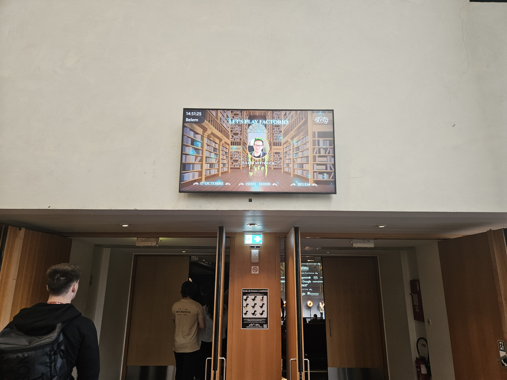

Cette semaine, j'avais la chance d'être au DevFest de Nantes 2025, pour y présenter mon talk ["Let's play Factorio"]().

C'était mon premier DevFest, et c'était un réel plaisir de croiser speakers, participants, et orgas. J'ai bien profité des deux jours de la conférence, à travers les conférences des autres speakers, les rencontres, et les attentions apportées particulièrement aux speakers.

Cette édition spéciale de ["La veille de Wittouck"]() liste les différents talks auxquels j'ai pu assister, et mon feedback général sur cette conférence très particulière. Comme je l'ai fait pour l'article consacré à [DevOxx 2025](), j'amenderai cet article dans quelques semaines pour y mettre les liens des replay vidéos lorsqu'ils seront disponibles.

<!--more-->

## Une ambiance unique

Dès l'arrivée au DevFest de Nantes, on est mis dans l'ambiance. Cette année, le thème est "le monde enchanté des contes et légendes". On a donc des trolls, des fées et des personnages mystiques partout, dans les jingles de lancement des conférences, sur les affiches, sur les t-shirts des orgas, et aussi sur les stands des sponsors qui ont beaucoup joué le jeu.
Au détour des couloirs, on croise certains orgas déguisés en troll (le troll mignon), en fées, ou en chevalier. C'est très rigolo, et ça contribue beaucoup à l'ambiance.

On se plaît à rechercher toutes les références cachées dans le générique de lancement, entre Blanche Neige et les 7 Logos Androids, Linux Hansel et Linux Gretel, et le petit Chaperon rouge et son Firefox à la place du grand méchant loup.
Mention spéciale au RTFM qui apparaît projetté sur le mur d'une salle.

2500 personnes sont présentes pour cet évènement, et les différentes salles sont à l'image de ces chiffres. La plus grande salle peut accueillir plus de 1500 personnes, une salle intermédiaire accueille 800 personnes. La salle Belem, dans laquelle j'ai eu la chance d'être speaker, dispose de 400 places.
Les salles sont belles, spacieuses, et les sièges de type "cinéma" sont bien confortables.

Des clins d'œil au thème de la conférence sont présents un peu partout, entre les pupitres, les écrans secondaires, les motifs projettés sur les murs, et les MC parfois déguisés, on est vite plongés et maintenus dans l'ambiance.

Les sponsors et exposants sont nombreux, ESN et entreprises ont répondu présentes, une trentaine de stands sont répartis dans le grand hall, sur deux niveaux. Comme on le voit sur d'autres confs, les stands proposent des activités et goodies, et aussi parfois de quoi manger (et de quoi boire).

Entre deux conférences, le hall est plein à craquer. J'ai été agréablement surpris, même s'il y a beaucoup de monde, le hall n'est pas si bruyant que ça, et on arrive à tenir une conversation à un niveau de voix raisonnable.
Le lieu a l'air plutôt accessible (même si je ne suis pas directement concerné, ça me semble important), j'ai l'impression que plusieurs personnes circulaient en fauteuil de manière plutôt fluide, donc c'est aussi un très bon point pour le lieu !

## Une expérience parfaite en tant que speaker

Une chose est certaine, les orgas sont aux petits soins pour les speakers. L'accueil particulier réservé aux speakers est très confortable : salle au calme avec massages, café et petit-déjeuner, et petits cadeaux. On se sent réellement privilégiés.
La salle speaker permet de passer un moment calme et relaxant, aussi bien pour se préparer à son talk, mais aussi pour faire une pause entre deux sessions et souffler un peu (ou écrire son article de blog).
Nous avions également une zone réservée pour nos repas, ce qui nous permet de ne pas avoir à faire la queue si on veut manger rapidement et retourner se concentrer ou s'isoler.
Les discussions entre speakers sont bienveillantes et toujours agréables, c'est toujours sympa de re-croiser des speakers avec qui on avait fait connaissance à d'autres confs, et de rencontrer de nouvelles personnes.

On se surprend à avoir des moments où on félicite un speaker pour un talk qu'on a apprécié, et où il nous transmet le même message. C'est assez rigolo, ce sont des rencontres amusantes, qu'on gardera forcément en mémoire.

Le traditionnel dîner des speakers s'est tenu la veille de la conférence au Carrousel des mondes marins, lieu emblématique de l'île de Nantes. J'ai vécu ma meilleure vie en faisant un tour de carrousel (pas de pompon à attraper par contre, sous prétexte que nous sommes adultes).

Concernant les salles, être sur scène, dans ces dispositions d'amphithéâtre, avec le public souriant est réellement plaisant.

L'organisation dans les différentes salles est impeccable techniquement. Les branchements sont simples et efficaces, deux écrans sont disponibles en retour pour le speaker, pour y afficher un retour simple d'écran, et un compteur de temps pour pouvoir bien gérer le timing de sa présentation.

Pour ma part, je n'ai eu aucun problème technique, le flux vidéo et sonore a bien fonctionné. L'ingénieur son qui m'a équipé était très efficace, on a pu faire quelques tests de son (pour la musique du jeu) avant que le public rentre dans la salle, pour s'assurer que tout aller bien marcher, et c'était le cas. Bravo !

Ce côté pro aide beaucoup, on se sent rassuré, et on peut ainsi se concentrer sur son talk en toute sérénité.

De mon expérience de speaker, c'est probablement la plus impeccable que j'ai eu, aussi bien sur l'accueil que sur la technique. Bravo à toute l'équipe.

## Les talks - Jour 1

Les talks couvrent de nombreux thèmes. Avec 8 tracks en paralèlle, et plus de 100 speakeuses et speakers, il y en a pour tous les publics, de débutant à expert.
C'est aussi un des intérêts de ces conférences plutôt généralistes.

Dans le public, on croise des débutants, des expérimentés, des étudiants, des personnes en reconversion. Chacun pourra y trouver son compte.

Pour ma part, je me suis plutôt intéressé aux talks autour des technologies sur lesquelles j'avais déjà une expertise, pour essayer d'aller plus loin, et de compléter mes connaissances.
Je fait déjà beaucoup de veille par ailleurs, donc ce n'était pas trop le but de ma présence, et je sais aussi que les talks sont enregistrés, donc j'irai probablement voir les vidéos de certains talks que j'ai loupé ou mis de côté.

### La keynote d'ouverture - Advice Well Taken par Ilina Dasha

Après avoir vu le magnifique générique d'ouverture, la keynote d'ouverture intitulée "Advice Well Taken", était articulée autour du concept de "Techlore", le Folklore Tech.
Nous y avons découvert le travail de documentation mené par Ilina Dasha, au travers d'interviews qu'elle a réalisées et dont elle a diffusé quelques extraits.

On y a vu notamment certaines pratiques DIY, comme mettre son téléphone dans un sachet congélation pour pouvoir écouter de la musique sous la douche, ou utiliser du dentifrice pour réparer des micro-rayures sur les écrans (là je pense qu'on est clairement sur du Folklore Tech).
On a aussi vu l'interview d'une personne dont le téléphone s'éteint à chaque fois qu'il rentre dans son lieu de travail.
Quelques phrases un peu marquantes, à propos de FaceID également : "Tout le monde l'utilise, donc ça doit aller", ou "Le côté pratique l'emporte beaucoup trop sur les questions de fond".

De quoi se poser quelques questions sur la perte de connaissance par rapport à ces outils dont on dépend tant, et dont le fonctionnement pourra finir par être assimilé à de la magie.

> On a tous dans notre entourage des gens qui associent un côté magique ou démoniaque à leur téléphone, leur ordinateur, ou leur grille-pain connecté. C'est intéressant de voir ce lore documenté sans jugement avec ce projet artistique.

### SELECT 'amazing_features' FROM "postgresql" par Kevin Davin

Dans un talk très dense, Kévin Davin nous a présenté beaucoup de fonctionnalités méconnues de PostgreSQL. Certaines de ces fonctionnalités étant présentes dans le standard SQL (version 2023), d'autres étant propres à PostgreSQL ou à une extension.

Kévin a commencé par rappeler l'ordre d'exécution du pipeline SQL, et qu'il ne savait à rien D'ÉCRIRE SON SQL EN CRIANT (en _CAPS LOCK_).
Il a ensuite énuméré plusieurs fonctionnalités dont les _Common Table Expressions_, dont l'aspect le plus intéressant permet de refactorer les requêtes pour les rendre plus lisibles, et par effet de bord de pouvoir paralléliser l'exécution de plusieurs sous-requêtes
J'ai aussi découvert le système de type qui permet de déclarer des nouveaux types dans le moteur de base de données et d'y donner des contraintes, qui pourront être vérifiées directement par la BDD à la manipulation des données.

Mention spéciale aussi pour les _Foreign Data Wrappers_ qui permettent de consommer des données externes à PostgreSQL (fichiers ou sorties standard de scripts) comme étant des tables. Cette fonctionnalité ouvre plein de possibilité, en particulier pour faciliter les migrations. Il devient possible de faire des jointures entre deux bases de données à travers le réseau (au détriment des performances bien entendu). Bluffant.

Je découvre aussi dans ce talk FerretDB, qui implémente le protocole MongoDb pour PostgreSQL, ça donne envie de tester.

> Bravo à Kévin pour son sang-froid, puisqu'il a malheureusement subi des problèmes de clignotement d'écran lors de son talk. Il a particulièrement bien géré la situation, et a même réussi à nous expliquer certains concepts sans slides pendant quelques minutes.

### Détectives de la prod : résoudre l'enquête avant le crash par Sébastien Ferrer

Sébastien nous présente les enjeux de son quotidien : faire tourner en production une cinquantaine d'applications.

Après avoir rappelé quelques principes et acronymes, comme le _TTA_ / _TTR_ (_Time To Ack_ et _Time To Restore_) et les différents niveaux de priorité, il a utilisé quelques cas d'exemple liés à ses expériences d'incidents survenus en production pour illustrer l'enjeu principal : restaurer le service avant tout. La résolution des problèmes (avec l'analyse de la cause racine _via_ une méthode des 5 Whys) pouvant être faite plus tard.

Il a également partagé quelques astuces simples pour avoir des logs exploitables : utiliser des champs structurés pour avoir le plus de données de contexte.
Il a aussi donné quelques bonnes pratiques de monitoring et des exemples de dashboards intéressants pour surveiller les services, ou avoir un résumé de l'état d'une application lors d'un changement d'équipe jour/nuit.

Un talk que tous les _Devs_ devraient avoir vu pour prendre conscience des enjeux du _Run_.

> Ce talk était plein d'humour, et d'humilité. J'ai beaucoup apprécié le ton employé par Sébastien. J'ai aussi eu le plaisir de pouvoir échanger quelques mots avec lui directement. Quelqu'un que je recroiserai avec plaisir à l'avenir.

### État des lieux de la Souveraineté du Cloud : Des Clouds Publics aux Clouds Confidentiels par Seifeddin Mansri

Seifeddin a d'abord commencé par présenté quelques enjeux autour de la souveraineté du Cloud : Juridique (adapté au territoire où sont stockées les données et à l'éventuelle extra-territorialité), Technique avec les outils utilisés et la sécurité associé, Opérationnel avec les entités de confiance pour la gestion, et ce qu'il a qualifié de Sémantique, regroupant surtout les notions d'auditabilité.

Il a ensuite évoqué les usages de Cloud Privé, Public, Hybrides et Multi-Cloud, pour ensuite parler de manière un peu plus détaillée des implémentations de Cloud de confiance (S3NS et Bleu), et le SecNumCloud.

> Les enjeux des différents fournisseurs de Cloud sont plutôt bien expliqués par Seifeddin.
> Ses listings des différentes offres sont forcément incomplètes, car il est impossible de lister tous les fournisseurs en seulement quelques minutes, mais son talk donne quand même un bel overview de l'état des lieux du Cloud.
> 
> Je fais ici un aparté, qui vient compléter le discours de Seifeddin avec mon avis et mes convictions. Cet avis n'enlève bien sûr rien au travail qu'a fait Seifeddin sur ce talk. Si jamais tu lis ces lignes, sache que ces mots ne te sont pas destinés, mais sont plutôt destinés à des décideurs ou à des politiques.
> 
> Je ne suis pas convaincu par l'approche des Clouds de Confiance. La dépendance aux Hyperscalers américains reste trop prépondérante à mon sens. Seul la clé de chiffrement et le déploiement des patchs est contrôlé par Thalès (dans le cas de S3NS), l'offre reste un GCP ou un Azure standard, et même réduit puisque toutes les fonctionnalités ne sont pas disponibles, avec une complexité contractuelle accrue (2 fournisseurs à co-gérer).
> 
> Je trouve quand même un peu hypocrite le discours qui dit que certains providers ne sont pas au niveau des HyperScalers en termes de fonctionnalités, et d'aller ensuite opter pour une solution réduite comme S3NS ou Bleu sous couvert de SecNumCloud (qui n'ont même pas encore leur certification), alors que des providers Européens sont également disponibles et certifiés (Cloud Temple, OVH sur certains services, Outscale), et que d'autres sont en cours de qualification, comme Scaleway.

### Let's Play Factorio par Julien Wittouck

C'était pour moi la deuxième édition de mon talk. Et quelle édition incroyable !

Technique parfaite. Salle comble (400 personnes pour venir me voir, des personnes ont été refusées à l'entrée car la salle était pleine). MC au top. Public accroché et conquis dès les premières minutes. J'ai adoré voir les sourires et les yeux des spectateurs briller à l'affichage du menu et des différents tableaux du jeu.

Environ 30% du public avait déjà joué au jeu, ou le connaissait, j'étais donc déjà en terrain conquis.

J'ai particulièrement aimé intéragir avec le public. L'humour a fait mouche, les réactions du public devant certains parallèles que j'ai introduits étaient géniales.
Je me suis senti bien, sur cette scène, et j'ai l'impression que ça a bien marché.

J'ai même eu quelques questions.

Bien qu'elles seront dans la vidéo, je les remets ici (de mémoire, ainsi que certains échanges informels que j'ai eu sur le côté) :

"Combien de temps as-tu passé sur la préparation ?"
> Une bonne centaine d'heures comptées. Pas forcément toutes in-game, beaucoup de temps passé à cogiter sur le talk (idée que j'avais depuis près de 2 ans), beaucoup de temps passé à manipuler le jeu pour essayer d'illustrer certains principes, et enfin au moins 80 heures dans le jeu pour préparer tous les tableaux présentés. J'ai passé pas loin de 2 heures dans le train aller vers Nantes pour améliorer la première transition en train et l'_habiller_ un peu mieux, afin d'embarquer les spectateurs dans le jeu.

"As-tu pensé à représenter les notions de testing comme des TU ?"
> Tester c'est douter. Dans le jeu, on teste directement en production. Je pense que je vais y réfléchir un peu, mais ça me semble difficile représenter un test qui passe ou qui échoue dans le jeu.

"Est-ce que tu as pensé à faire ce talk dans Satisfactory ?"
> J'aime aussi beaucoup ce jeu, mais le côté 3D et vue à la première personne serait un peu compliqué à suivre pour les participants, je risquerai de me perdre dans l'usine, et ils serait impossible  de pouvoir dézoomer et avoir cette représentation haut-niveau que je voulais montrer.

"Combien d'heures as-tu dans le jeu ?"
> J'ai 300 heures listées sur Steam, dont la petite centaine passées pour la préparation, les répétitions et les 2 sessions données. J'avais aussi acheté le jeu en early accès il y a très longtemps (en 2014 ou 2015 je crois), toutes ces heures je ne sais pas les dénombrer.

Les feedbacks sont justes incroyables, j'ai rarement vu autant d'engagement sur des talks (le public du DevFest est très généreux sur cette partie j'ai l'impression). J'ai 189 votes _Fun_. Sur 400 personnes présentes dans la salle, presque une sur deux a mis un vote. Je pense que le QRCode in-game a bien chauffé le public.
La page web derrière le QRCode (https://linktr.ee/lets_play_factorio) a reçu plus de 300 visites.

Il m'a fallu un peu de temps après le talk pour me remettre de mes émotions.
Je suis passé très rapidement à l'after party, et c'était la fin de ma première journée.

## Les talks - Jour 2

J'était plutôt fatigué ce vendredi, j'ai bien tenu la matinée, mais j'ai eu un énorme coup de barre après le déjeuner.
Entre les émotions encore présentes de la veille, et les intéractions sociales nombreuses, c'était assez épuisant pour moi.

J'ai pu profiter d'un créneau libre pour me faire masser en salle speaker, et j'ai pris un peu de temps au calme pour commencer à rédiger ces lignes, et discuter avec d'autres speakers.

### Karpenter + Keda : Le duo gagnant du FinOps par Guillaume Membré et Sébastien Fourreau

Je connaissais déjà Keda, mais pas spécialement Karpenter, donc c'était pour moi l'occasion de découvrir cet outil.

Les deux speakers travaillent pour RCA qui édite l'outil "MEG : Mon Expert en Gestion", dont je suis utilisateur avec mon cabinet comptable, c'est un point de détail assez rigolo.

Ils ont commencé par expliquer les enjeux autour du coût d'une infrastructure Kubernetes (managée sur AWS dans leur cas), avec les différents éléments qui sont en partie non-prédictibles (load-balancing et coûts réseau). 

Ils ont ensuite expliqué le use-case de leur application, avec une courbe de charge sur les horaires de travail des comptables, donc leur charge est plutôt prédictible, et bien adapté à une optimisation FinOps sur des horaires de nuit par exemple.

Ils ont ensuite expliqué le fonctionnement de Keda, et l'usage qu'ils en ont fait avec un nombre de pods dimensionné en fonction de cette charge prédictible.

Ils ont ensuite présenté Karpenter, en particulier la gestion des node-pools AWS, et l'utilisation combinée d'instances on-demand et spot. La consolidation des nodes a aussi été expliquée. Le terme de "Défragmentation" a été utilisé plusieurs fois et me semble plutôt bien expliquer ce que fait Karpenter.

Les speakers ont enfin montré les gains réalisés sur leur facture Cloud, qui sont assez significatifs (je n'ai plus les chiffres exactes en tête, mais il me semble qu'on parle de 30%).

> Les cas d'usage présentés avec la courbe de charge prédictible, me parle beaucoup puisque j'ai les même enjeux sur mes projets actuels.
> On peut utiliser Keda dans n'importe quel cluster Kubernetes, donc pour cette partie aucun problème, par contre Karpenter me semble quand même bien lié à l'écosystème AWS (même si en principe chaque provider pourrait implémenter son propre _driver_), ce qui en diminue l'intérêt.
> La défragmentation des nodes est le concept le plus intéressant, mais attention déplacement des pods en masse, et aux centres de gravité qu'une grosse machine pourrait créer. C'est bien entendu à utiliser avec un bon niveau de maîtrise des outils déjà standards dans Kubernetes (topologyConstraints, affinity et anti-affinity, etc.).

### Limits, Requests, QoS, PriorityClasses, on balaie ce que vous pensiez savoir sur le scheduling dans Kubernetes par Denis Germain et Quentin Joly

Denis et Quentin se sont livrés à l'exercice du talk en binôme, et ont utilisé leur relation de manager/managé avec beaucoup d'humour.
Denis en a d'ailleurs profité pour mentionner son livre, _Kubernetes : 50 solutions pour les postes de développement et les clusters de production_ (que je vais lire dans les prochaines semaines), qui lui a aussi permis de découvrir des distributions Kubernetes qu'il a utilisé pour ce talk.

Avec 6 ou 7 démos (je n'ai pas compté, et il semblerait qu'ils aient sauté une démo pendant la présentation ?), Denis et Quentin ont expliqué le fonctionnement des différents paramètres listés dans le titre de leur conférence et surtout l'impact qu'ils ont sur nos applications en particulier au niveau des performances et du scheduling.

Ils ont commencé avec les _limits_ et _requests_ dans Kubernetes, mettre en avant les impacts de ces paramètres avec quelques schémas très clairs et plusieurs démos.

> Je ne connaissais pas l'implémentation du throttling de CPU dans les cgroups Linux, et je comprends donc maintenant mieux pourquoi mettre une limite de CPU sur un pod est une FBI (Fausse Bonne Idée). Je partageais cet avis mais pour d'autres raisons (en particulier la possibilité de Burst le CPU si besoin vu que des ressources sont peut-être disponibles sur la machine), donc ça fait une corde de plus à mon arc d'arguments.

Ils ont ensuite présenté les 3 classes de _QoS_ de Kubernetes, _Guaranteed_, _Burstable_ et _BestEffort_, et leur impact sur l'ordre d'éviction des pods en cas de ressources insuffisantes.

Enfin, ils ont présenté la notion de _PriorityClasses_, que je ne connaissais pas. Ces classes arbitraires (définies par l'utilisateur), permettent de prioriser le scheduling des pods (c'est bien nommé), et donc d'aller occuper des ressources qui pourraient être réclamées d'autres pods plus prioritaires.
Denis a d'ailleurs cité un cas d'usage d'un Jobs en tâche de fond, qui occupent des ressources et qui sont dé-schedulés si un autre workload en a besoin.

> En discutant avec mon voisin Guillaume Moirod pendant cette partie, il m'a évoqué un cas d'usage que je qualifierait de génie, en couplant un Pod _placeholder_ à priorité très faible, qui vient forcer les cluster auto-scalers à créer des nodes, en prévision de jobs qui seraient poussés par un GitLab Runner. On "pré-chaufferai" ici des nodes, pour booster les temps de démarrage des jobs. Il faut que j'écrive un post sur ce sujet !

> Un de mes talks préférés de cette conférence, et la complicité des deux speakers et leur humour (dont on ne sait pas s'il est prévu ou improvisé) m'a beaucoup fait rire.

### Voyage Guidé au pays de l'inaccessibilité par Thanh Lan Doublier

> Je n'ai pas pris de notes lors de cette session, donc je l'écris de mémoire. Lan, si tu lis ces lignes, Lan, je m'excuse d'avance si mes propos sont inexacts, je sais que tu n'hésiteras pas à venir me corriger ou compléter mon propos.

Lan, qui était déguisée en fée munie de sa baguette magique pour l'occasion (sa télécommande de présentation), nous a partagé les enjeux autour de l'accessibilité, dans un quickie de 20 minutes (ce talk est une adaptation d'un talk plus long qu'elle avait déjà donné par ailleurs).

Elle commence par présenter ses propres handicaps dans un discours sincère et touchant. Puis elle nous explique que presque 1 Français sur 3 est concerné par une forme de handicap (quel qu'il soit), soit la population de la Belgique. Ignorer ces populations revient à ignorer autant de clients potentiels. Ce discours pourrait faire réagir les entreprises.

À travers quelques exemples concrets, comme l'accès à une fonctionnalité de sous-titre qui apparaît ou disparaît en fonction des fournisseurs de vidéo, ou qui n'est pas assez réglable (taille et contraste), elle nous explique que les réglementations sont un bon point de départ, et que l'accessibilité est à prendre en compte dès le début des projets (pour éviter me mettre un ascenseur à l'arrière d'un bâtiment et forcer les personnes handi à faire 2km de plus que les valides).

> Un joli talk plein de sincérité, qui présente des vécus concrets, et qui doit aider à ouvrir les esprits sur ces sujets.

### Keynote de Fermeture - La joute de Faltazi

C'est à travers un duel d'improvisation entre deux acteurs talentueux, animé par un maître de céromonie incroyable, que le DevFest de Nantes nous propose de clore cette édition.

Nous voici plongés dans le monde de Faltazi, un monde fictif au lore médiéval-fantastique. Nos deux acteurs doivent s'affronter en joute d'improvisation, pour gagner des légumes (poireaux, navets, et la fameuse courge bleue).
Le gagnant de la joute, en cinq manches, sera celui qui constituera, à la fin, la meilleure soupe.

C'est donc complètement décalé, et forcément génial.

Nous avons eu droit à la quête du fromage magique, l'éveil du champignon spécial, une collaboration douteuse entre deux architectes de nuage (leur métier équivalent à nos architectes Cloud), à la tirade entre un forgeron maladroit, son père et un marteau qui parle, et à une vision étrange d'un capitaine de bateau transportant des containers.

> Beaucoup de rires pour fermer ce DevFest. Ça collait bien avec le thème de l'édition 2025. Les acteurs étaient fantastiques, et la participation du public sur les votes et les propositions des thèmes

## Merci à toute l'équipe

Pour conclure cet article, je voudrais remercier particulièrement l'équipe du DevFest de Nantes. L'organisation d'un évènement d'une telle ampleur est un travail titanesque, et c'est fait avec brio.

L'attention apportée aux speakers est exceptionnelle (on a vraiment été chouchoutés du début à la fin). Le public est très agréable, plein de bienveillance.

Vous posez la barre très haut. Un immense merci, et un grand bravo.

C'est aussi toujours un plaisir un peu particulier de croiser des speakers déjà rencontrés ailleurs, ou d'en rencontrer de nouveaux.
Pour ma part, c'est toujours un peu intimidant ce genre d'évènement, je rencontre des gens dont je suis admiratif et que j'aime aller écouter en conférence.

Je reviens également chargé d'émotions. J'ai réalisé sur cette édition une des meilleures prestations de ma vie avec Let's Play Factorio. My God, que c'était incroyable de voir cette salle pleine à craquer, que c'était chouette de rire avec le public. Et j'ai toujours du mal à croire les feedbacks que j'ai reçus.
J'espère pouvoir continuer ce genre d'activité à l'avenir. C'est clairement le truc qui me fait le plus kiffer dans ma vie professionnelle.

Concernant la suite, la semaine prochaine, je serai de l'autre côté du miroir, pour Cloud Nord 2025.
Let's Play Factorio aura aussi le droit à une troisième session, au DevFest de Lyon, le 28 novembre prochain (devant un public plus réduit cette fois), et j'espère pouvoir encore donner ce talks quelques fois, je pense que je vais avoir du mal à m'en lasser.

---

La prochaine publication est prévue autour du 31 octobre 2025 🗓️