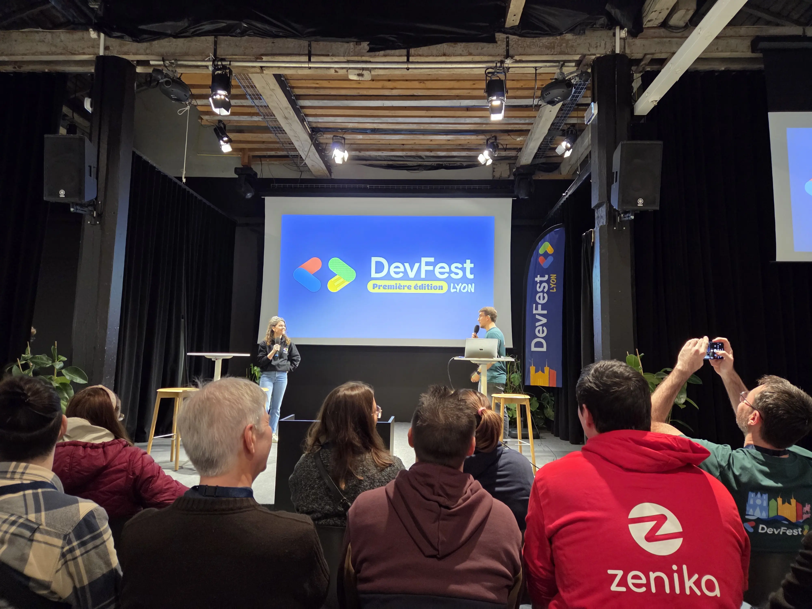
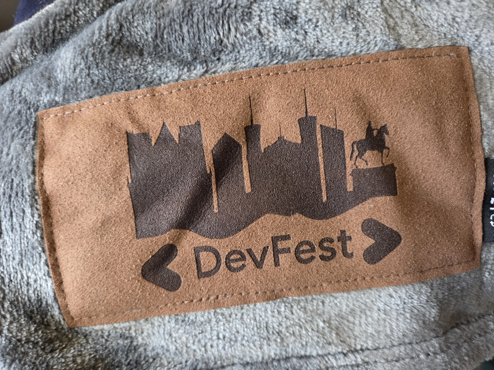
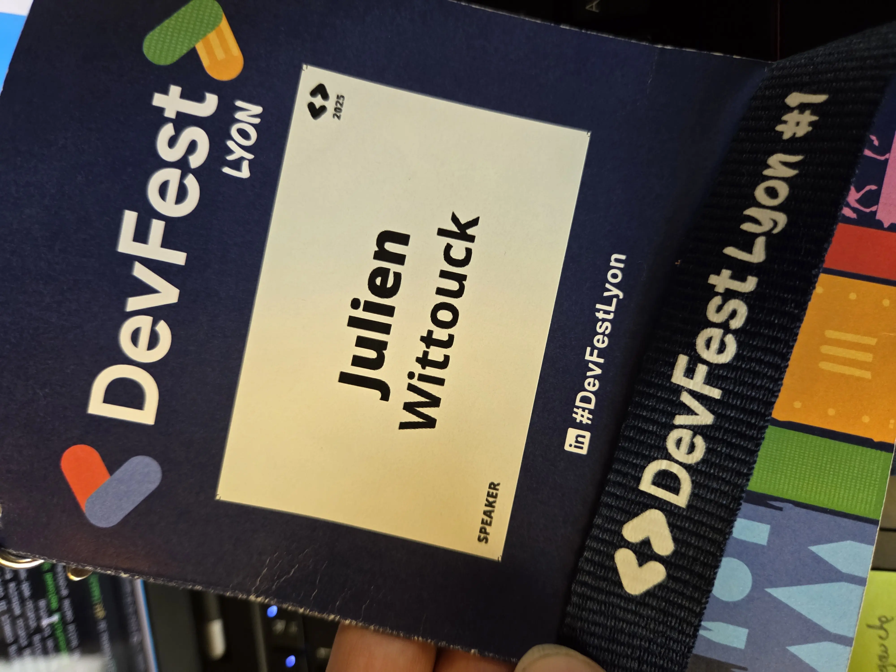
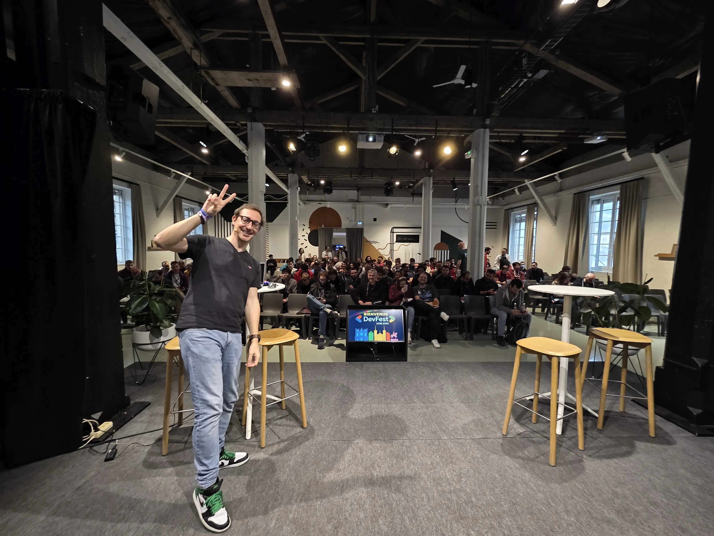
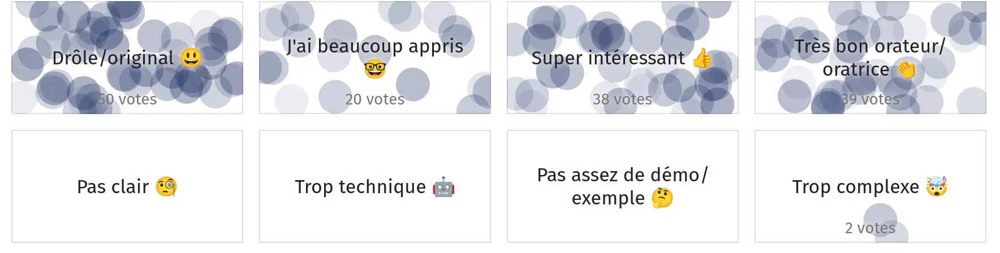
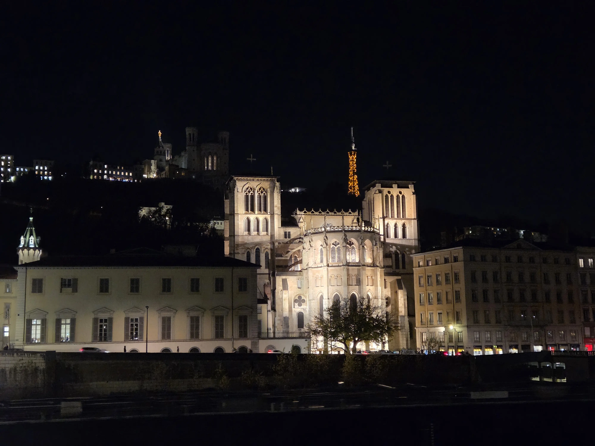

Cette semaine, j'étais sur Lyon pour assister à la première édition du DevFest de Lyon et y donner la 3ème session de mon talk "[Let's play Factorio]()" (on ne m'arrête plus 😅).

Et c'était bien chouette.

<!--more-->

## Un tout nouvel événement

Comme l'on dit les orgas de ce tout nouvel événement au mot d'ouverture (Mickaël Alves et Margaux Pirat sur scène, Olivier Perez, Anthony Donnet et Michaël Da Silva en coulisses), jusqu'à hier, Lyon n'avait pas son DevFest.

C'est maintenant le cas, et quel DevFest !

Sold-out plus d'un mois à l'avance, 314 propositions reçues au CFP pour 16 créneaux de talk, on voit que le public Lyonnais était en attente de cet événement.

## Les orgas aux petits soins des speakers

La traditionnelle soirée des speakers s'est déroulée au bar à vin "Les Canailles de Raphaël".

On a pu y rencontrer l'équipe des orgas au grand complet, ainsi que les bénévoles, la photographe et les 2 MC (maîtres de cérémonie) venus aider pour animer la journée : Estelle Landry et Mathieu Mure.
Je pense que c'est une bonne idée d'inviter toute l'équipe ainsi que les bénévoles qui contribuent à la réussite de la journée. C'est une belle manière de récompenser les personnes pour leur investissement personnel. Nous avons eu la même approche cette année à Cloud Nord, nous y avions invité les bénévoles qui avaient contribués aux CFP, la démarche avait été aussi appréciée.

La soirée des speakers est toujours un moment privilégié (et traditionnel). J'étais très content de croiser les autres speakers, dont certain que je connaissais déjà, et pouvoir en rencontrer d'autres que j'avais simplement aperçu lors d'autres confs 😊. 

Pour le jour J, une salle speakers nous a été mise à disposition, avec boissons, bonbons, brioche à la praline (miam).
Nous avons également eu le droit à un shooting photo personnel (hâte de recevoir ma future photo de profil 💙) ainsi qu'à un petit cadeau pour nous tenir chaud dans les soirées d'hiver qui approchent : un joli plaid brandé "DevFest Lyon".

Ce sont toutes ces petites attentions qui font de ces événements un réel plaisir pour les speakeuses et les speakers. Merci à toute l'équipe pour cet accueil chaleureux.

## La barre est mise très haute

Concernant le jour J, un seul mot : Bravo.

De mon point de vue, l'organisation est impeccable. L'équipe a pensé à tout.

L'accueil est chaleureux dès la remise des badges. Badges qui contiennent le programme de la journée, ainsi que les QR Codes à scanner vers les pages du site et des feedbacks. C'est une bonne idée et c'est plutôt pratique (j'avais déjà vu ça au DevFest de Nantes).

L'accent est mis sur le côté "collector" de certains goodies, comme le sticker "J'étais au 1er DevFest Lyon", et sur le tour de cou du badge. C'est très rigolo, et ça fonctionne plutôt bien.

Les orgas sont attentifs, disponibles et s'assurent que tout se passe bien. On voit bien la quantité de travail qui a été investie dans la préparation de la journée. En plus de l'équipe principale, les bénévoles venus aider sont aussi des habitués des conférences, je pense que ces atouts précieux ont dû aussi bien aider à ne rien oublier à la préparation en amont.

Le lieu "L'embarcadère" est parfait pour ce type d'évènement. Les salles de conférence sont très belles (la grande halle 🤩).
C'est très agréable d'être sur scène dans cette salle, et d'y prendre la parole, surtout devant une salle presque comble.

La technique est rodée, aussi bien sur le son que sur la vidéo.
Pas de captation pour cette première édition, il faudra se contenter des photos (qui vont être cool, la photographe a l'air de faire du super travail), mais je suis certain que les orgas ajouteront ça l'année prochaine.

Les MC animent parfaitement les transitions entre les talks, et sont aux petits soins pour aider à l'installation sur scène, apporter bouteille d'eau et vérifier que tout va bien. Un grand merci à Estelle qui a fait mon intro 💙. Ça aide vraiment à démarrer un talk dans les meilleures conditions, et à évacuer le stress en détendant l'atmosphère avec quelques blagues bien ciblées 😅.

La sélection des talks est solide (et je dis pas ça parce que j'en fait partie 😅), toutes les speakeuses et tous les speakers ont assuré. Je ne fais pas le récap des confs que j'ai vues hier, mais chacune d'entre elles était impeccable, bravo à toutes et à tous !

Le public est souriant, bienveillant, et généreux en feedbacks et discussions. L'ambiance globale de ce DevFest est définitivement très (très) sympa.

Le traiteur local a proposé une nourriture très bonne et variée (mention spéciale aux ravioles 😋).

Les pas moins de 10 sponsors présents proposent les minis-jeux et animations qu'on voit sur les différentes conférences, avec les traditionnels lots à gagner.

La soirée "Meet & Greet" était sponsorisée par Zenika qui a apporté une pompe à bière. J'étais un peu déçu de ne pas avoir les vins de la région à déguster (on s'est bien rattrapés plus tard dans la soirée), mais la bière était bonne, et les discussions avec les potes étaient toujours agréables.

## Rdv l'année prochaine

Une chose est certaine, j'aurai plaisir à revenir pour la prochaine édition du DevFest de Lyon.
Que ce soit en tant que speaker (🤞) ou en tant que participant. Cette nouvelle conférence se place déjà sur le podium des meilleures conférences en France.

Bravo à toute l'équipe, aux MC et aux bénévoles, et aux sponsors pour leur soutien.

Bravo aux speakeuses et aux speakers pour vos talks, et merci pour les échanges que j'ai pu avoir avec certains d'entre vous, j'ai hâte de vous recroiser à d'autres événements !

Merci pour l'accueil incroyable à Lyon, et à l'année prochaine 💙

