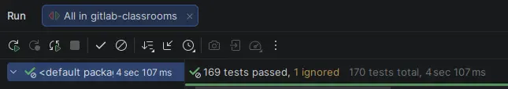

Un des projets que je maintiens activement est [GitLab Classrooms](projects/gitlab-classrooms).

Le code de ce projet est écrit en Spring Boot 3 et Java 25.
Avec la sortie récente de Spring Boot 4, je voulais faire la montée de version de ce projet rapidement.

Pour ça, j'ai donc deux possibilités : soit je fais la montée de version à la main, soit j'utilise un outil pour le faire automatiquement.

J'en ai donc profité pour tester OpenRewrite.

<!--more-->

## OpenRewrite

[OpenRewrite](https://docs.openrewrite.org/) est un outil qui permet d'exécuter des opérations de refactoring sur du code Java.
Il s'appuie sur un concept de recette (le terme utilisé est _recipes_), qui implémente des transformations sur le code.

J'avais découvert cet outil lors du [talk de Jérôme Tama à Devoxx France 2025](https://www.youtube.com/watch?v=aYHb7sLhsoQ).

## La recette Spring Boot 4

Une [recette de migration Spring Boot 4](https://docs.openrewrite.org/recipes/java/spring/boot4/upgradespringboot_4_0-community-edition) est disponible pour la version communautaire.

En parcourant le code de la recette sur [Github](https://github.com/openrewrite/rewrite-spring/blob/main/src/main/resources/META-INF/rewrite/spring-boot-40.yml), il semble que la recette fait une grande partie de ce qui est indiqué dans le guide de migration de Spring :

* la montée de version du pom `spring-boot-starter-parent`
* les modifications liées aux changements de coordonnées de certains artifacts maven
* la migration vers Spring Framework et Spring Security 7
* la mise à jour des properties dépréciées
* la mise à jour vers testcontainers 2
* la migration vers les starters modulaires

> [!INFO]
> La recette évolue régulièrement, donc peut-être qu'elle fait encore plus de choses au moment où vous lisez cet article.

La recette prend la forme d'un fichier YAML, et elle est accompagnée de code qui implémente les différentes transformations :

> Je ne rentre pas dans les détails du fonctionnement d'OpenRewrite, allez voir le talk de Jérôme Tama indiqué plus haut pour plus d'informations.

```yaml
type: specs.openrewrite.org/v1beta/recipe
name: org.openrewrite.java.spring.boot4.UpgradeSpringBoot_4_0
displayName: Migrate to Spring Boot 4.0
description: >-
  Migrate applications to the latest Spring Boot 4.0 release. This recipe will modify an application's build files,
  make changes to deprecated/preferred APIs.
tags:
  - spring
  - boot
recipeList:
  - org.openrewrite.java.spring.boot3.UpgradeSpringBoot_3_5
  - org.openrewrite.java.spring.framework.UpgradeSpringFramework_7_0
  - org.openrewrite.java.spring.security7.UpgradeSpringSecurity_7_0
  - org.openrewrite.java.spring.batch.SpringBatch5To6Migration
  - org.openrewrite.java.spring.boot4.SpringBootProperties_4_0
  - org.openrewrite.java.spring.boot4.ReplaceMockBeanAndSpyBean
  - org.openrewrite.hibernate.MigrateToHibernate71
  - org.openrewrite.java.testing.testcontainers.Testcontainers2Migration
  - org.openrewrite.java.spring.boot4.MigrateToModularStarters
  - org.openrewrite.java.dependencies.UpgradeDependencyVersion:
      groupId: org.springframework.boot
      artifactId: "*"
      newVersion: 4.0.x
      overrideManagedVersion: false
  - org.openrewrite.java.dependencies.UpgradeDependencyVersion:
      groupId: org.springframework.boot
      artifactId: spring-boot-dependencies
      newVersion: 4.0.x
      overrideManagedVersion: true
  - org.openrewrite.maven.UpgradePluginVersion:
      groupId: org.springframework.boot
      artifactId: spring-boot-maven-plugin
      newVersion: 4.0.x
  - org.openrewrite.maven.UpgradeParentVersion:
      groupId: org.springframework.boot
      artifactId: spring-boot-starter-parent
      newVersion: 4.0.x
  - org.openrewrite.gradle.plugins.UpgradePluginVersion:
      pluginIdPattern: org.springframework.boot
      newVersion: 4.0.x

  # Replace deprecated starters with their new names
  # https://github.com/spring-projects/spring-boot/wiki/Spring-Boot-4.0-Migration-Guide#deprecated-starters
  - org.openrewrite.java.dependencies.ChangeDependency:
      oldGroupId: org.springframework.boot
      oldArtifactId: spring-boot-starter-oauth2-authorization-server
      newArtifactId: spring-boot-starter-security-oauth2-authorization-server
  - org.openrewrite.java.dependencies.ChangeDependency:
      oldGroupId: org.springframework.boot
      oldArtifactId: spring-boot-starter-oauth2-client
      newArtifactId: spring-boot-starter-security-oauth2-client
  - org.openrewrite.java.dependencies.ChangeDependency:
      oldGroupId: org.springframework.boot
      oldArtifactId: spring-boot-starter-oauth2-resource-server
      newArtifactId: spring-boot-starter-security-oauth2-resource-server
  - org.openrewrite.java.dependencies.ChangeDependency:
      oldGroupId: org.springframework.boot
      oldArtifactId: spring-boot-starter-web
      newArtifactId: spring-boot-starter-webmvc
  - org.openrewrite.java.dependencies.ChangeDependency:
      oldGroupId: org.springframework.boot
      oldArtifactId: spring-boot-starter-web-services
      newArtifactId: spring-boot-starter-webservices
  # https://github.com/spring-projects/spring-boot/wiki/Spring-Boot-4.0-Migration-Guide#aop-starter-pom
  - org.openrewrite.java.dependencies.RemoveDependency:
      groupId: org.springframework.boot
      artifactId: spring-boot-starter-aop
      unlessUsing: org.aspectj.lang.annotation.*
  - org.openrewrite.java.dependencies.ChangeDependency:
      oldGroupId: org.springframework.boot
      oldArtifactId: spring-boot-starter-aop
      newArtifactId: spring-boot-starter-aspectj
```

La doc d'OpenRewrite indique qu'on peut utiliser une simple commande _Maven_ pour effectuer la migration :

```shell
mvn -U org.openrewrite.maven:rewrite-maven-plugin:run \
  -Drewrite.recipeArtifactCoordinates=org.openrewrite.recipe:rewrite-spring:RELEASE \
  -Drewrite.activeRecipes=org.openrewrite.java.spring.boot4.UpgradeSpringBoot_4_0 \
  -Drewrite.exportDatatables=true
```

> Plutôt pratique, car je n'aurai pas à modifier mon `pom.xml`, ni ajouter de fichier de configuration dans mon projet pour pouvoir effectuer cette migration en one-shot.

L'exécution de la commande prend quelques secondes et affiche les opérations effectuées (j'ai beaucoup nettoyé les logs pour que ce soit plus lisible) :

```shell
[INFO] --- rewrite:6.25.0:run (default-cli) @ gitlab-classrooms ---
[INFO] Using active recipe(s) [org.openrewrite.java.spring.boot4.UpgradeSpringBoot_4_0]
[INFO] Using active styles(s) []
[INFO] Validating active recipes...
[INFO] Project [gitlab-classrooms] Resolving Poms...
[INFO] Project [gitlab-classrooms] Parsing source files
[INFO] Running recipe(s)...
[INFO] Printing available datatables to: target/rewrite/datatables/2025-12-12_17-33-51-247

[WARNING] Changes have been made to pom.xml by:
[WARNING]     org.openrewrite.java.spring.boot4.MigrateToModularStarters
[WARNING]     org.openrewrite.maven.UpgradeParentVersion: {groupId=org.springframework.boot, artifactId=spring-boot-starter-parent, newVersion=4.0.x}
[WARNING]     org.openrewrite.java.testing.testcontainers.Testcontainers2Migration

[WARNING] Changes have been made to src/main/resources/application-local.properties by:
[WARNING]     org.openrewrite.text.FindAndReplace: {find=javax., replace=jakarta., filePattern=**/*.js;**/*.ts;**/*.properties}

[WARNING] Changes have been made to src/test/java/fr/univ_lille/gitlab/classrooms/adapters/jpa/PostgresqlJPAAdaptersTest.java by:
[WARNING]     org.openrewrite.java.testing.testcontainers.Testcontainers2Migration
[WARNING]     org.openrewrite.java.spring.boot4.MigrateToModularStarters

[WARNING] Changes have been made to src/test/java/fr/univ_lille/gitlab/classrooms/mvc/ExportControllerMVCTest.java by:
[WARNING]     org.openrewrite.java.spring.boot4.ReplaceMockBeanAndSpyBean
[WARNING]         org.openrewrite.java.ChangeType: {oldFullyQualifiedTypeName=org.springframework.boot.test.mock.mockito.MockBean, newFullyQualifiedTypeName=org.springframework.test.context.bean.override.mockito.MockitoBean}

[...]

[WARNING] Please review and commit the results.
[WARNING] Estimate time saved: 1h 16m
[INFO] ------------------------------------------------------------------------
[INFO] BUILD SUCCESS
[INFO] ------------------------------------------------------------------------
[INFO] Total time:  20.769 s
[INFO] Finished at: 2025-12-12T17:33:51+01:00
[INFO] ------------------------------------------------------------------------
```

OpenRewrite semble s'être correctement exécuté et indique que plusieurs fichiers ont été modifiés. Un `git status` permet de se rendre compte de ce qui a été impacté :

```shell
git status
On branch feature/migration-spring-boot-4
Changes not staged for commit:
  (use "git add <file>..." to update what will be committed)
  (use "git restore <file>..." to discard changes in working directory)
	modified:   pom.xml
	modified:   src/main/resources/application-local.properties
	modified:   src/test/java/fr/univ_lille/gitlab/classrooms/adapters/jpa/PostgresqlJPAAdaptersTest.java
	modified:   src/test/java/fr/univ_lille/gitlab/classrooms/api/UploadJunitGradingRestControllerMVCTest.java
	modified:   src/test/java/fr/univ_lille/gitlab/classrooms/assignments/AssignmentScoreServiceImplTest.java
	modified:   src/test/java/fr/univ_lille/gitlab/classrooms/assignments/AssignmentServiceImplTest.java
	modified:   src/test/java/fr/univ_lille/gitlab/classrooms/domain/classrooms/ClassroomStudentControllerTest.java
	modified:   src/test/java/fr/univ_lille/gitlab/classrooms/mvc/ClassroomControllerMVCTest.java
	modified:   src/test/java/fr/univ_lille/gitlab/classrooms/mvc/ExportControllerMVCTest.java
	modified:   src/test/java/fr/univ_lille/gitlab/classrooms/mvc/assignments/AssignmentMVCControllerMVCTest.java
	modified:   src/test/java/fr/univ_lille/gitlab/classrooms/mvc/assignments/StudentAssignmentResetGradeMVCControllerMVCTest.java
	modified:   src/test/java/fr/univ_lille/gitlab/classrooms/mvc/dashboard/DashboardControllerMVCTest.java
	modified:   src/test/java/fr/univ_lille/gitlab/classrooms/quiz/QuizAnswerControllerMVCTest.java
	modified:   src/test/java/fr/univ_lille/gitlab/classrooms/quiz/QuizEditionControllerMVCTest.java
	modified:   src/test/java/fr/univ_lille/gitlab/classrooms/quiz/QuizServiceImplTest.java

no changes added to commit (use "git add" and/or "git commit -a")
```

* le `pom.xml` (ce qui était attendu en premier lieu)
* les fichiers de configuration properties (certaines properties ont été renommées)
* les fichiers de test (surtout pour la dépréciation de `@MockBean` et `@SpyBean`)

Un `git diff` permet de vérifier tout ça :

```shell
git diff pom.xml

@@ -6,7 +6,7 @@
     <parent>
         <groupId>org.springframework.boot</groupId>
         <artifactId>spring-boot-starter-parent</artifactId>
-        <version>3.5.6</version>
+        <version>4.0.0</version>
         <relativePath/> <!-- lookup parent from repository -->
     </parent>
 
@@ -44,7 +44,7 @@
-        <jacoco-maven-plugin.version>0.8.13</jacoco-maven-plugin.version>
+        <jacoco-maven-plugin.version>0.8.14</jacoco-maven-plugin.version>

@@ -57,7 +57,7 @@
         <dependency>
             <groupId>org.springframework.boot</groupId>
-            <artifactId>spring-boot-starter-web</artifactId>
+            <artifactId>spring-boot-starter-webmvc</artifactId>
         </dependency>

@@ -67,12 +67,12 @@
         <dependency>
             <groupId>org.springframework.boot</groupId>
-            <artifactId>spring-boot-starter-oauth2-client</artifactId>
+            <artifactId>spring-boot-starter-security-oauth2-client</artifactId>
         </dependency>
 
         <dependency>
             <groupId>org.springframework.boot</groupId>
-            <artifactId>spring-boot-starter-oauth2-resource-server</artifactId>
+            <artifactId>spring-boot-starter-security-oauth2-resource-server</artifactId>
         </dependency>
         
@@ -91,8 +91,8 @@
         <dependency>
-            <groupId>org.flywaydb</groupId>
-            <artifactId>flyway-core</artifactId>
+            <groupId>org.springframework.boot</groupId>
+            <artifactId>spring-boot-starter-flyway</artifactId>
         </dependency>
         
@@ -127,22 +127,32 @@
+    <dependency>
+      <groupId>org.springframework.boot</groupId>
+      <artifactId>spring-boot-starter-webmvc-test</artifactId>
+      <scope>test</scope>
+    </dependency>
+
+    <dependency>
+      <groupId>org.springframework.boot</groupId>
+      <artifactId>spring-boot-starter-data-jpa-test</artifactId>
+      <scope>test</scope>
+    </dependency>
 
@@ -136,7 +136,7 @@
 
         <dependency>
             <groupId>org.testcontainers</groupId>
-            <artifactId>postgresql</artifactId>
+            <artifactId>testcontainers-postgresql</artifactId>
             <scope>test</scope>
         </dependency>
         
         <dependency>
-            <groupId>org.springframework.security</groupId>
-            <artifactId>spring-security-test</artifactId>
+            <groupId>org.springframework.boot</groupId>
+            <artifactId>spring-boot-starter-security-test</artifactId>
             <scope>test</scope>
         </dependency>
```

Au niveau du `pom.xml`, tout s'est bien passé, l'ensemble des modifications attendues ont bien été appliquées.

La nouvelle architecture modulaire de Spring Boot 4 a bien été traitée.

Le code de tests a aussi bien été nettoyé des anciens `@MockBean` dépréciés :

```text
@@ -37,10 +37,10 @@ class ClassroomControllerMVCTest {
     @Autowired
     private MockMvc mockMvc;
 
-    @MockBean
+    @MockitoBean
     private ClassroomService classroomService;
 
-    @MockBean
+    @MockitoBean
     private Gitlab gitlab;
```

et certaines properties (qui étaient en commentaires) ont bien été renommées.

```text
 # generate full creation sql script if needed
-spring.jpa.properties.javax.persistence.schema-generation.create-source=metadata
-spring.jpa.properties.javax.persistence.schema-generation.scripts.action=update
-spring.jpa.properties.javax.persistence.schema-generation.scripts.create-target=update.sql
+spring.jpa.properties.jakarta.persistence.schema-generation.create-source=metadata
+spring.jpa.properties.jakarta.persistence.schema-generation.scripts.action=update
+spring.jpa.properties.jakarta.persistence.schema-generation.scripts.create-target=update.sql
```

## Les ajustements que j'ai dû faire à la main

En sortie de cette exécution, mon code ne compile pas.

Un import dans ma configuration Spring Security n'est pas résolu

```java
import org.springframework.boot.actuate.autoconfigure.security.servlet.EndpointRequest;
```

car cette classe a été déplacée dans un autre package :

```java
import org.springframework.boot.security.autoconfigure.actuate.web.servlet.EndpointRequest;
```

Une fois ces petits ajustements faits, je lance mes tests unitaires.

Cette fois-ci, j'obtiens un message d'erreur lié à Spring Security au démarrage :

```text
Caused by: java.lang.IllegalArgumentException: pattern must start with a /
```

Je n'avais pas fait attention à cette modification dans les guides de migration, donc je suis peut-être passé à travers. Quoi qu'il en soit, ce n'est pas une modification très compliquée, je l'ai facilement appliquée.

Une fois ces derniers ajustements faits, les tests passent correctement 🎉 :



## Conclusion

Cela m'a pris environ 1h pour migrer mon projet de Spring Boot 3.5 vers Spring Boot 4.0.

OpenRewrite m'a clairement facilité le travail, il a modifié toutes mes dépendances, et migré les annotations dépréciées (ce qui aurait été fastidieux).
J'ai quand même dû finaliser la migration à la main, et je n'ai pas pu me passer de la lecture du [Spring Boot 4.0 Migration Guide](https://github.com/spring-projects/spring-boot/wiki/Spring-Boot-4.0-Migration-Guide).

Je pense que le support de Spring Boot 4 dans OpenRewrite n'en est qu'à ses débuts (la version qui introduit le support a été publiée le 5 décembre 2025, et la mise à jour pour l'architecture modulaire a été publiée le 16 décembre), donc il n'est pas impossible que les opérations que j'ai dû faire manuellement soient automatisées dans le futur.

Quoi qu'il en soit, 1h de travail pour migrer un projet d'environ 3 000 lignes de code, je pense que c'est plutôt efficace.
