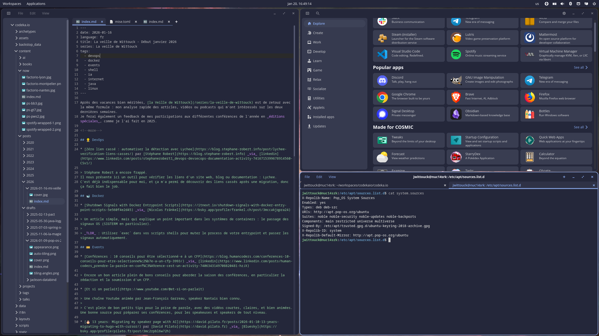
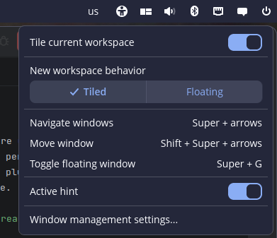
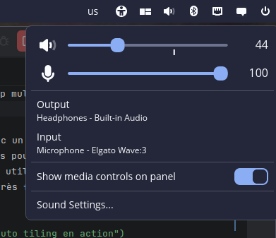
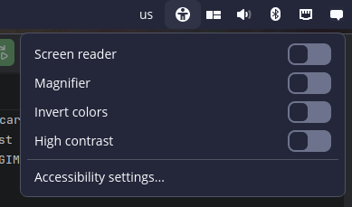
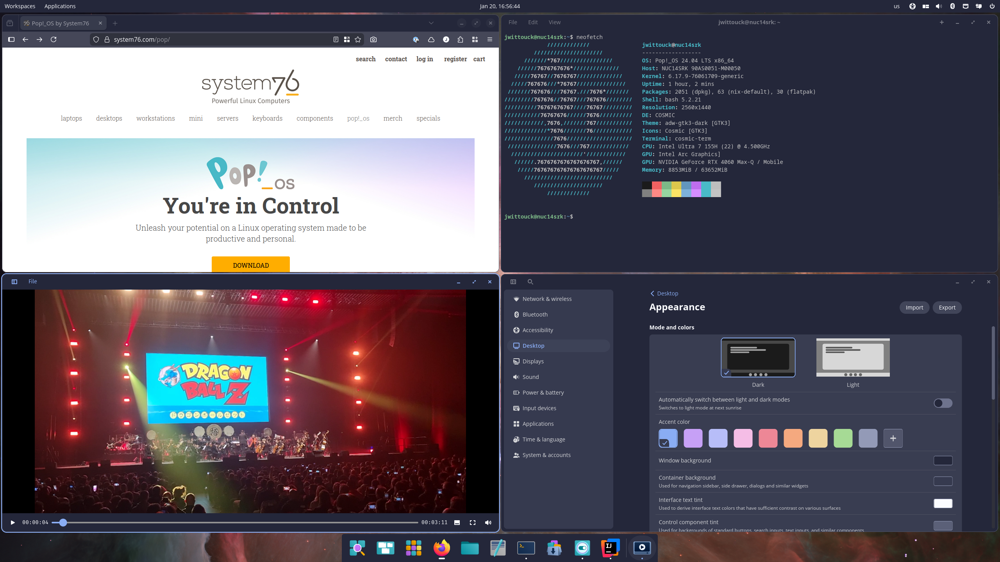
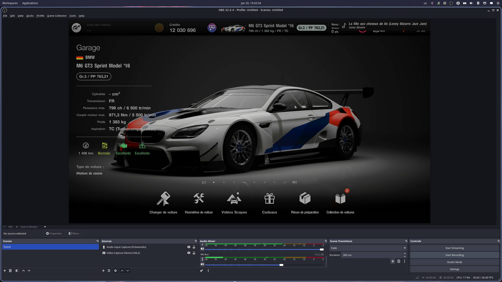
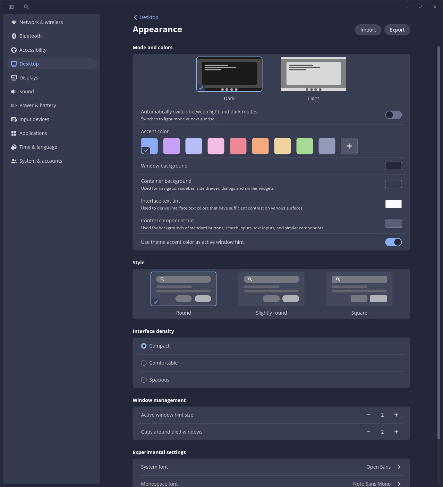

I've been using the **Pop!_OS** Linux distribution for almost five years. 
I've always liked their approach to auto-tiling, which is a feature that is missing from GNOME (although plugins exist).

After a few months spent on Manjaro Linux, and a few struggles related to hazardous version upgrades that broke my system several times, and with the recent release of **Pop!_OS 24.04**, it was time for me to return to this distribution to get an opinion on the highly expected desktop environment: COSMIC.

<!--more-->

## A brand new desktop environment: COSMIC

Pop!_OS hasn't had a major release for a long time (the previous version, 22.04, was released in April 2022).
Their effort was mainly focused on the development of their COSMIC desktop environment, which lasted more than three years.

The promise is strong: an environment written in Rust for good performance and stability, an environment designed from the start to support auto-tiling, as well as workspaces in a multiscreen context.
COSMIC is also designed from the start to integrate with Wayland, replacing X11.

COSMIC aims to be a complete environment and therefore offers a set of included software, which provides roughly the same tools as the GNOME suite, namely:

* a terminal: COSMIC Terminal
* a text editor: COSMIC Text Editor
* a file explorer: COSMIC Files
* a media player: COSMIC Media Player
* a configuration manager: COSMIC Settings
* an application store: COSMIC Store

> Yes, they didn't push themselves too hard for the names, but at least it's easy to remember 😅

Suffice it to say that we understand that the development of all these applications must have taken time to be able to offer this complete environment.

All these tools are far from basic, and particular care has been taken in their implementation.

The terminal supports tabs, as well as a horizontal or vertical split with shortcut keys to facilitate keyboard navigation (a bit like the Tilix terminal).
The text editor also allows opening files in several tabs, offers basic syntax highlighting, and also has a project mode that displays the contents of a complete directory, and even has basic Git management (which displays a diff on an edited file).
The configuration manager allows you to configure everything you can imagine (in the style of GNOME Settings).
The application store allows you to quickly search for software and install it in three clicks.

## The distribution

Pop!_OS (which is top 5 on [DistroWatch](https://distrowatch.com/table.php?distribution=popos), even if that means little except that there is a certain hype around this distro) is a Linux distribution based on Ubuntu. It is developed by _System76_, an American company that sells Linux laptops. We therefore find the usual tools: _apt_ and _flatpak_ for installing packages (no _snap_ by default, and that's for the better).

Two versions of the ISO to download are available: a standard version and a version including Nvidia drivers (the option I chose since I have a small GPU in my machine). There is also versions for ARM architectures. I don't have an ARM machine to test, but I think it can be interesting for some home-labs.
The ISOs are quite heavy (2.8GB and 3.3GB for the version with Nvidia drivers).
Installation is easy with a graphical helper, as found in all distributions.

During installation, we configure the partitions, the system language, and the first system user. Disk encryption can also be activated with a password (I don't know if a Yubikey-type key or a key _via_ the machine's TPM can be used, which would be interesting, I might dig into this part if I have time).

Pop!_OS also offers to install a recovery partition, to be able to repair the system in case of problems, without losing data, the reinstallation then does not touch `/home`.

Regarding the provided Linux kernel, Pop!_OS provides version 6.17 at the time of writing this article, not the most recent version then, but it was the last version available at the time of the distribution release, I think the following versions will arrive in the coming weeks.
The Nvidia driver is in version 580 (not the last version available either, but I'm not against the idea of being one or two versions behind the upstream).

Firefox and Thunderbird versions 146 and 128 are also installed by default, and the LibreOffice suite is installed with version 24.2.

For main software installation, the COSMIC Store does the job well, but we sometimes tend to not know how to choose between the `apt` and `flatpak` versions.
I often opt for the `flatpak` versions because they are more recent than those available in the `apt` repos, but it's a personal choice, and it's especially true for some non-critical applications (GIMP, Inkscape, OBS Studio, etc.)

## First impressions
 
> It's pretty.

COSMIC is pleasant to use. It's far from a revolution, but it's quite fresh. GNOME users won't be lost, as COSMIC looks a lot like it. The nuance being that no additional plugin is needed to have a complete and customizable desktop environment.

The desktop is set to floating windows by default, auto-tiling is activated with one click in the taskbar widget. You can also change the audio source/output, or manipulate Bluetooth and Network connections in the taskbar. It's practical and avoids having to open an extra tool or window to change an audio output.

{class=images-grid-3}

Workspaces are practical to manipulate, it is possible to have workspaces in horizontal or vertical mode, and in the case of a multiscreen setup to be able to share them by screen or separate them.
Basic accessibility options are also available, the zoom works well and correctly follows the mouse (I think it will be practical in conferences). Use the `Super` key and scroll to activate it, practical and intuitive.

Auto-tiling is pleasant to use, even with a multiscreen setup. I'm still going to have to remap the keys intended for moving windows for my split keyboard (the shortcuts are designed to use the keyboard arrows).
Dragging a window with the mouse is also straightforward, and you quickly manage to arrange the windows as you wish.

Screen management is inspired by that of GNOME. Note that the settings are rather fine, you can set different scaling and refresh rates for each screen (especially practical if your screens are not identical), and it works well.

> On my desktop setup, I have two 24-inch screens in 2560x1440 resolution, I kept them at 100% display, which is quite comfortable. I activated auto-tiling by default, and separate vertical workspaces for each screen.
On my laptop, I have a 14-inch screen in 2880x1800 resolution, a fractional scaling at 150% is more comfortable.

An important point to say: EVERYTHING WORKED WELL.

It is, I think, good enough to be able to mention it (SHOUTING!).

On day 1, without any trouble or specific tuning, I was able to:
* print on my laser network printer;
* connect several Bluetooth headphones;
* use my microphone (Elgato Wave 3) and webcam (Logitech Streamcam) for a video call;
* share my screen;
* take screenshots;
* capture some video with OBS Studio connected to my PS5!

And just as important if you know me:

* install Steam;
* and last but not least, play Factorio 🏭⚙️!

All this without any trouble.
It's expected for any modern Linux distribution, but I expected some more significant trouble, especially with such a recent desktop environment.

It is possible to customize the theme, with a Dark or Light mode, and you can change the global colors of the interface, as well as the rounded corners and other small options, which is nice.
The fonts offered by default are `Open Sans` and `Noto Sans Mono`, the rendering is clean and sharp.

## Apps, applets, and themes

COSMIC offers developers an SDK for developing applications and applets that integrate with COSMIC. The apps and applets can then be distributed on the COSMIC Store with the `flatpak` format.

Everything is developed in Rust, which seems like a much more solid choice than GNOME extensions which are developed in JavaScript. A code template for [applets](https://github.com/pop-os/cosmic-applet-template) and [applications](https://github.com/pop-os/cosmic-app-template) is maintained on GitHub.
There is a `libcosmic` library that allows communication with the desktop environment.

There are already quite a few applications developed by the community, [the COSMIC Community page](https://system76.com/cosmic/community) lists some of them, and a GitHub organization [cosmic-utils](https://github.com/cosmic-utils) hosts their code.

> I am looking forward with great impatience to an emoji picker applet 🤓 

## Little troubles and frustrations

I noticed some slowness (freezes) when copying files _via_ the file explorer (copying many files at once, several GB). There are opened issues on GitHub about this; I think it will be fixed quickly.

The screenshot tool works well for capturing full windows and desktop, but is a bit slow for capturing with a screen area selection; same remark, it's not impossible that the problem will be solved quickly.

I also have a keyboard mapping issue (more annoying) only with IntelliJ, but more related to Wayland than COSMIC.
By digging a little, I discovered that IntelliJ did not use Wayland, but X11 by default. It seems that Wayland includes a compatibility layer with Xorg so that all this works. In short, to check and fix this point, I found [the solution in a documentation page](https://blog.jetbrains.com/platform/2024/07/wayland-support-preview-in-2024-2/).

## In conclusion

I'm rather convinced and impressed by COSMIC, I've been using it for a few weeks, and I haven't encountered any major issues. It works well, it's quite pretty (if you like the style of GNOME), easily customizable.

After a good twenty days of use, I didn't feel like going back to GNOME, there is nothing I couldn't do, so it's a great sign. COSMIC is mature, stable (even if there are still minor performance problems).

So, that's it, in 2026 I'm staying on Pop!_OS, it was worth the wait.

## Links and references

* [Pop!_OS 24.04](https://system76.com/pop/)
* The [official documentation](https://support.system76.com/) of Pop!_OS
* The [COSMIC Community](https://system76.com/cosmic/community) page
* The [cosmic-utils](https://github.com/cosmic-utils) GitHub
* Pop!_OS on [DistroWatch](https://distrowatch.com/table.php?distribution=popos)
* [libcosmic](https://github.com/pop-os/libcosmic?) to develop:
  * [applets](https://github.com/pop-os/cosmic-applet-template)
  * [applications](https://github.com/pop-os/cosmic-app-template)
