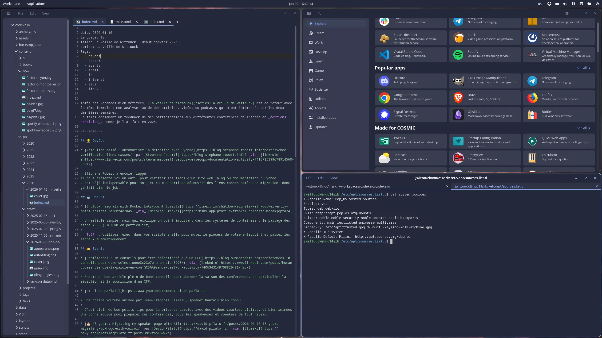
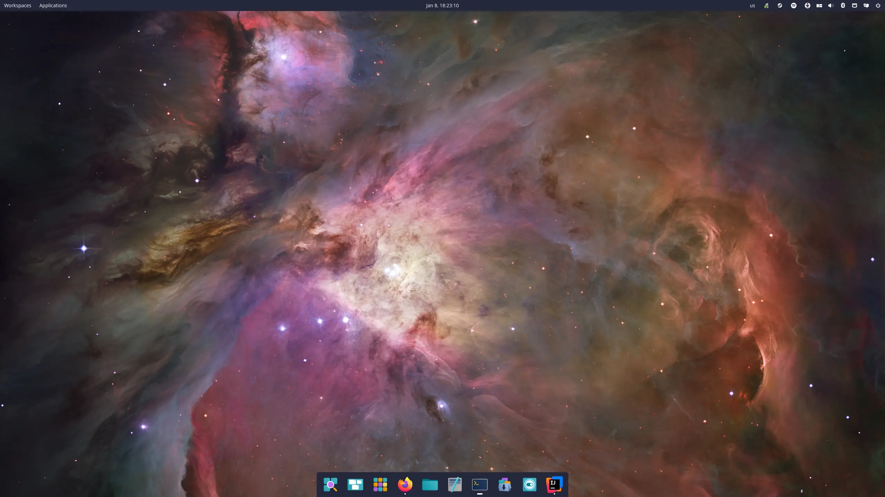
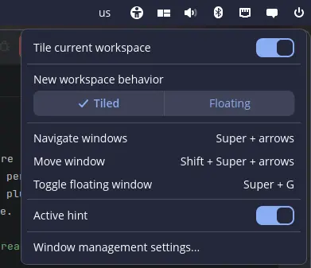
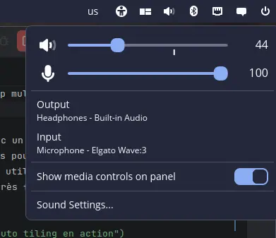
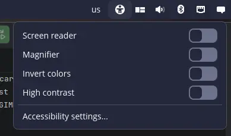
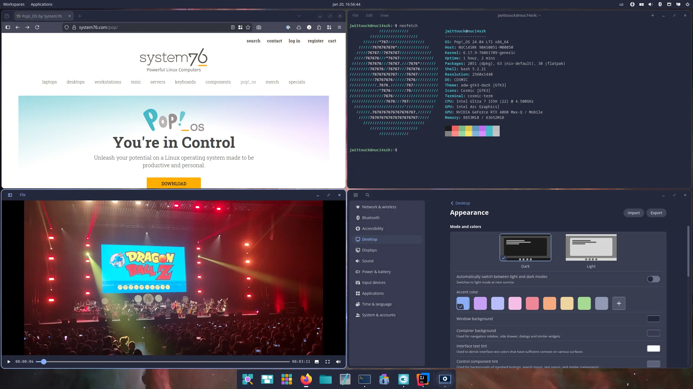
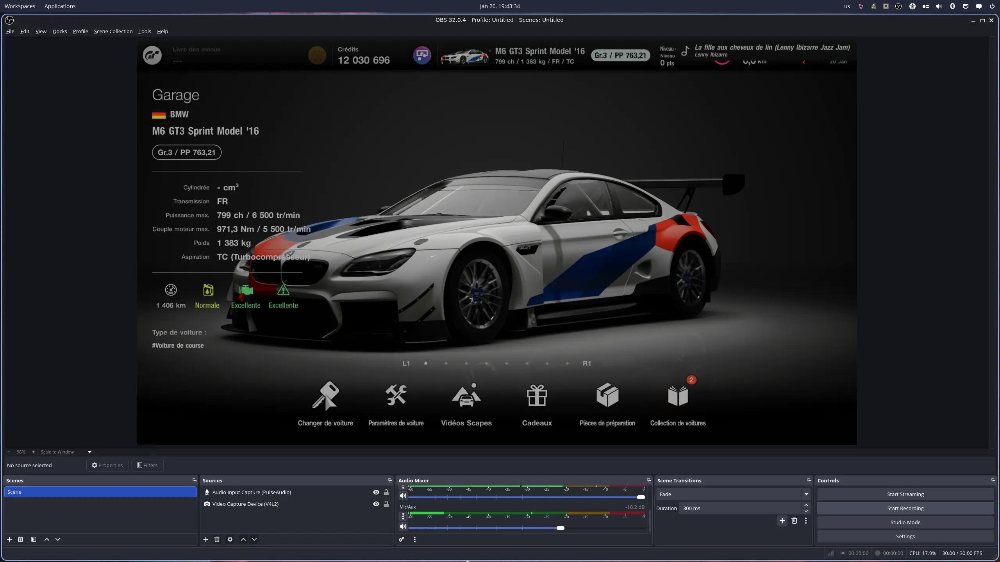
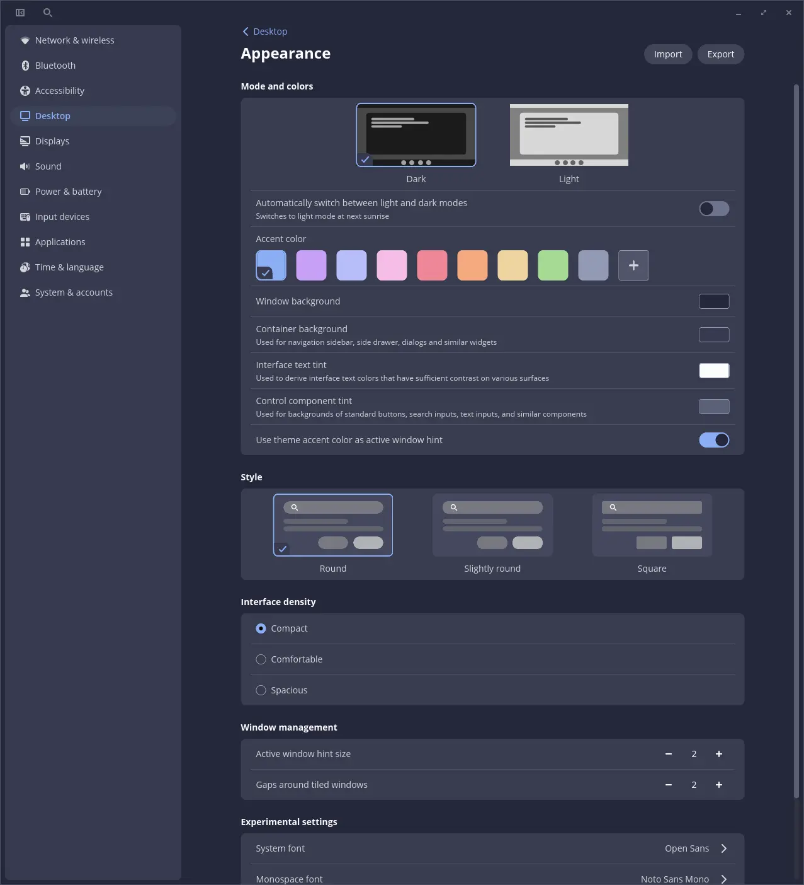

J'utilise la distribution Linux **Pop!_OS** depuis presque cinq ans. 
J'ai toujours apprécié leur démarche autour de l'auto-tiling, qui est une fonctionnalité qui manque cruellement à GNOME (bien que des plugins existent).

Après quelques mois passés sous Manjaro Linux, et des galères liées à des montées de version hasardeuses qui ont plusieurs fois cassé mon système, et avec la sortie récente de Pop!_OS 24.04, il était temps pour moi de revenir sur cette distribution pour me faire un avis sur l'environnement très attendu : COSMIC.

<!--more-->

## Le nouvel environnement de bureau : COSMIC

Pop!_OS n'a pas eu de mise à jour majeure depuis longtemps (la version précédente, 22.04, était sortie en avril 2022 donc)
La raison est simple, leur effort était principalement concentré autour du développement de leur environnement de bureau COSMIC, qui a duré plus de trois ans.

La promesse est forte : un environnement écrit en Rust pour avoir de bonnes performances et de la stabilité, un environnement pensé dès le départ pour supporter l'auto-tiling, ainsi que les workspaces dans un contexte multi-écran.
COSMIC est aussi pensé dès le départ pour s'intégrer avec Wayland, en remplacement de X11.

COSMIC se veut être un environnement complet, et propose donc un ensemble de logiciels inclus, qui fournissent à peu près les mêmes outils que la suite GNOME, à savoir :

* un terminal : COSMIC Terminal
* un éditeur de texte : COSMIC Text Editor
* un explorateur de fichiers : COSMIC Files
* un lecteur multimedia : COSMIC Media Player
* un gestionnaire de configuration : COSMIC Settings
* un store d'applications : COSMIC Store

> Oui, ils ne se sont pas foulés pour les noms, mais au moins c'est facile à retenir 😅

Autant dire qu'on comprend que le développement de toutes ces applications a dû prendre du temps pour pouvoir offrir cet environnement complet.

Tous ces outils sont loin d'être basiques et un soin particulier a été apporté à leur implémentation.

Le terminal supporte des onglets, ainsi qu'un split horizontal ou vertical avec des touches de raccourcis pour faciliter la navigation au clavier (un peu à la tilix).
L'éditeur de texte permet aussi d'ouvrir des fichiers dans plusieurs onglets, propose une coloration syntaxique basique, et a aussi un mode "projet" qui affiche le contenu d'un répertoire complet, et a même une gestion Git basique (qui affiche un diff sur un fichier édité).
Le gestionnaire de configuration permet de configurer tout ce qu'on peut imaginer (à la manière de GNOME Settings).
Le store d'applications permet de rechercher rapidement des logiciels et de les installer en 3 clicks.

## La distribution

Pop!_OS (qui est top 5 sur [DistroWatch](https://distrowatch.com/table.php?distribution=popos), même si ça ne veut pas dire grand-chose hormis qu'il y a une hype certaine autour de cette distrib) est une distribution Linux basée sur Ubuntu. Elle est développée par System76, une société américaine qui vend des ordinateurs portables sous Linux uniquement. On y retrouve donc les outils habituels : _apt_ et _flatpak_ pour l'installation de paquets (pas de _snap_ par défaut, et c'est tant mieux).

Au niveau de l'ISO à télécharger, 2 versions sont disponibles : une version simple, et une version embarquant les drivers Nvidia (l'option que j'ai choisie, puisque j'ai un petit GPU dans ma machine). Il existe aussi une version pour les architectures ARM. Je n'ai pas de machine ARM pour tester, mais je pense que ça peut être intéressant pour certains home-labs.
Les ISOs sont assez lourds (2.8Go et 3.3Go pour la version avec les drivers Nvidia).
L'installation est simple, avec un helper graphique comme on en trouve dans toutes les distributions.

Lors de l'installation, on configure les partitions, la langue du système, le premier user, bref, du classique. On peut aussi activer le chiffrement du disque facilement avec un mot de passe (je ne sais pas si on peut utilisé une clé type Yubikey ou une clé _via_ le TPM de la machine, ce qui serait intéressant, je creuserai peut-être cette partie si j'en ai le temps).

Pop!_OS propose aussi d'installer une partition de recovery, pour pouvoir réparer le système en cas de problème, sans perdre les données, la réinstallation ne touche alors pas au `/home`.

Au niveau du noyau fourni, on est sur une version 6.17 à l'écriture de cet article, pas la version la plus récente donc, mais c'était la dernière version disponible au moment de la release de la distribution, je pense que les versions suivantes arriveront dans les semaines qui viennent.
Le driver Nvidia est en version 580 (pas la dernière version disponible non plus, mais je ne suis pas contre l'idée d'avoir une ou deux versions de retard).

Sont également installés par défaut Firefox et Thunderbird en versions 146 et 128, et la suite LibreOffice en version 24.2.

Pour l'installation des logiciels, le COSMIC Store fait bien l'affaire, mais on a parfois tendance à ne pas savoir choisir entre les versions `apt` et `flatpak`.
J'opte souvent pour les versions `flatpak` car elles sont plus récentes que celles disponibles dans les repos `apt`, mais c'est un choix personnel, et ça vaut surtout pour quelques applications non-critiques (GIMP, Inkscape, OBS Studio, etc.)

## Premières impressions
 
> Et bien c'est joli.

COSMIC est agréable à utiliser. C'est loin d'être une révolution, mais c'est assez frais. Les utilisateurs de GNOME ne seront pas perdus, puisque COSMIC lui ressemble beaucoup. La nuance étant qu'il ne faut pas de plugin supplémentaire pour avoir un environnement de bureau complet et customisable.

Le bureau est paramétré en fenêtre flottante par défaut, l'auto-tiling s'active d'un click dans le widget de la barre des tâches. On peut aussi facilement changer de source/sortie audio, ou manipuler les connexions Bluetooth, Réseau dans la barre des tâches. C'est pratique et ça évite de devoir ouvrir un supplémentaire pour changer une sortie audio.

{class=images-grid-3}

Les workspaces sont pratiques à manipuler, il est possible d'avoir des workspaces en mode horizontal ou vertical, et en cas de setup multi-écran de pouvoir les partager par écran ou les séparer.
Les options d'accessibilité basiques sont aussi disponibles, le zoom fonctionne bien et suit correctement la souris (je pense que ce sera pratique en conf). Il suffit d'utiliser la touche `Super` et de scroller pour l'activer, pratique et intuitif.

L'auto-tiling est agréable à utiliser, même avec un setup multi-écrans. Il va quand même falloir que je remappe les touches prévues pour déplacer les fenêtres pour mon clavier split (les raccourcis sont conçus pour utiliser les flêches du clavier).
Glisser une fenêtre à la souris se fait aussi très facilement, et on arrive vite à arranger les fenêtres comme on le souhaite.

La gestion des écrans est inspirée de celle de GNOME. À noter que les paramétrages sont plutôt fins, on peut régler un scaling différent pour chaque écran (surtout pratique s'ils ne sont pas identiques), et ça fonctionne bien.

> Sur mon setup de bureau, j'ai deux écrans 24 pouces en résolution 2560x1440, je les ai conservés en affichage à 100%, ce qui est plutôt confortable. J'ai activé l'auto-tiling par défaut, et des workspaces verticaux séparés pour chaque écran.
Sur mon laptop, j'ai un écran 14 pouces en 2880x1800, un scaling partiel à 150% est plus confortable.

Un point important : TOUT A FONCTIONNÉ DU PREMIER COUP.

C'est, je pense, suffisamment bien pour pouvoir le mentionner (EN CRIANT !).

J'ai pu facilement :
* imprimer ;
* connecter plusieurs casques Bluetooth ;
* utiliser mon micro et ma webcam pour une visio ;
* partager mon écran ;
* prendre des screenshots ;
* capturer un peu de video avec OBS Studio connecté à ma PS5 !

Et tout aussi important :

* installer Steam ;
* et jouer à Factorio 🏭⚙️ !

Tout ça sans aucune galère.
C'est du niveau attendu pour toute distribution Linux moderne, mais je m'attendais à quelques galères plus importantes, surtout avec un environnement aussi récent.

Il est possible de personnaliser le thème, avec un mode Dark ou Light, et on peut facilement changer les couleurs globale de l'interface, ainsi que les arrondis et d'autres petites options, ce qui est chouette.
Les polices de caractère proposées par défaut sont `Open Sans` et `Noto Sans Mono`, le rendu est propre et net.

## Les apps, applets, et themes

COSMIC propose aux développeurs un SDK pour le développement d'applications et d'applets s'intégrant à COSMIC. Les applis et applets peuvent ensuite être distribuées sur le COSMIC Store avec le format `flatpak`.

Tout se développe en Rust, ce qui semble être un choix bien plus solide que les extensions GNOME qui sont développées en JavaScript. Un template de code pour les [applets](https://github.com/pop-os/cosmic-applet-template) et les [applications](https://github.com/pop-os/cosmic-app-template) est maintenu sur GitHub.
Il existe donc une librairie `libcosmic` qui permet de communiquer avec l'environnement de bureau.

Il existe déjà pas mal d'applications développées par la communauté, [la page Community de COSMIC](https://system76.com/cosmic/community) en liste quelques-unes, et une organisation GitHub [cosmic-utils](https://github.com/cosmic-utils) en héberge le code.

> J'attends avec la plus grande impatience une applet de sélection d'emoji 🤓 

## Les petites galères et frustrations

J'ai constaté quelques lenteurs (freeze) lors de copie de fichiers _via_ l'explorateur de fichiers (copie de beaucoup de fichiers d'un coup, plusieurs Go). Il y a des issues sur GitHub à ce sujet, je pense que ça sera vite réglé.

L'outil de screenshot fonctionne bien pour la capture de fenêtres complètes et de bureau, mais est un peu lent pour la capture avec une sélection de zone d'écran, même remarque, il n'est pas impossible que le problème soit vite réglé.

J'ai aussi un souci de mapping clavier (plus embêtant) uniquement avec IntelliJ, mais plus lié à Wayland qu'à COSMIC.
En fouillant un peu, j'ai découvert que IntelliJ n'utilisait pas Wayland, mais X11 par défaut. Il semble que Wayland embarque une couche de compatibilité avec Xorg pour que tout ça fonctionne. Bref, pour vérifier et régler ce point, j'ai trouvé [la solution dans une page de documentation](https://blog.jetbrains.com/platform/2024/07/wayland-support-preview-in-2024-2/).

## En conclusion

Je suis plutôt convaincu par COSMIC, je l'utilise depuis quelques semaines, et je n'ai pas rencontré de souci majeur. Ça marche bien, c'est plutôt joli (si on aime le style de GNOME), facilement personnalisable.

Après une bonne vingtaine de jours d'utilisation, je n'ai pas eu l'envie de revenir sur GNOME, il n'y a rien que je n'ai pas su faire, donc c'est un très bon signe. COSMIC est mature, stable (même s'il reste des petits problèmes mineurs de perfs).

Donc, ça y est, en 2026 je reste sur Pop!_OS, ça valait le coup d'attendre.

## Liens et références

* [Pop!_OS 24.04](https://system76.com/pop/)
* La [documentation officielle](https://support.system76.com/) de Pop!_OS
* La page [Community de COSMIC](https://system76.com/cosmic/community)
* Le GitHub [cosmic-utils](https://github.com/cosmic-utils)
* Pop!_OS sur [DistroWatch](https://distrowatch.com/table.php?distribution=popos)
* [libcosmic](https://github.com/pop-os/libcosmic?) pour développer :
  * des [applets](https://github.com/pop-os/cosmic-applet-template)
  * des [applications](https://github.com/pop-os/cosmic-app-template)
