Dans ma tournée des conférences tech de France pour jouer à Factorio, je suis passé par Touraine Tech, la semaine dernière.
Comme toujours, c'est l'occasion de faire de nouvelles rencontres et de croiser les autres speakeuses et speakers.

Voici donc le récap de ma visite à Touraine Tech, pour cette 8ᵉ édition, mais la première pour moi.

<!--more-->

## Back to school, les bancs de la fac

Touraine Tech 2026 a eu lieu à la Faculté des Sciences et Techniques de l'Université de Tours.

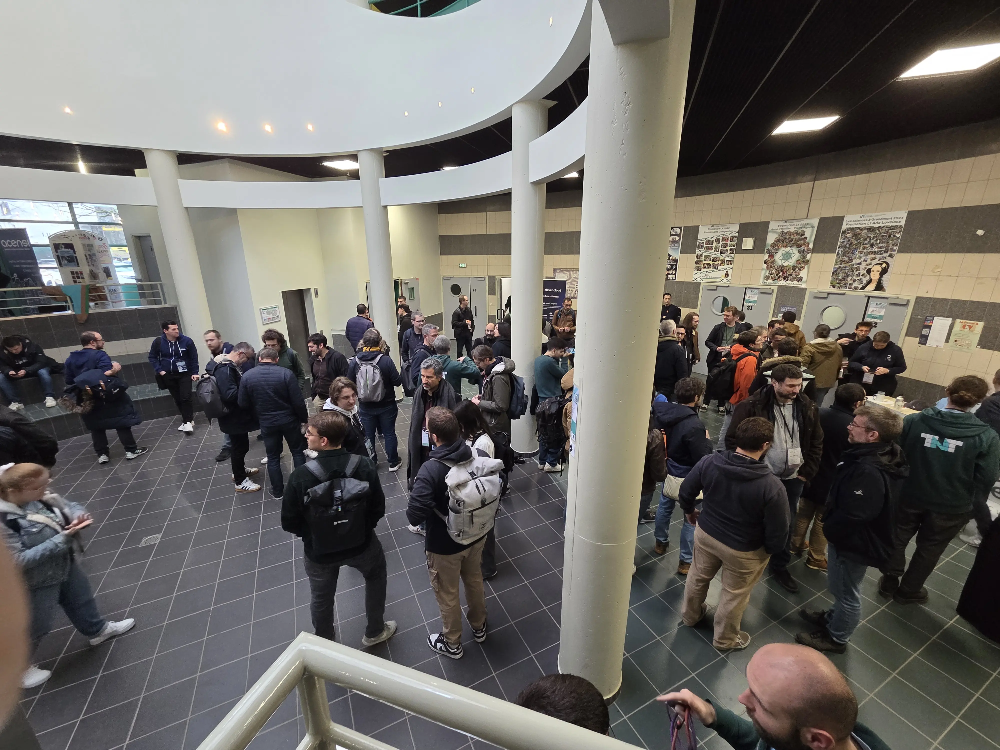

C'est amusant de se balader dans les couloirs de la fac et de s'assoir dans les amphis.
On retrouve sur les tables les âmes d'artistes des étudiants de Tours.

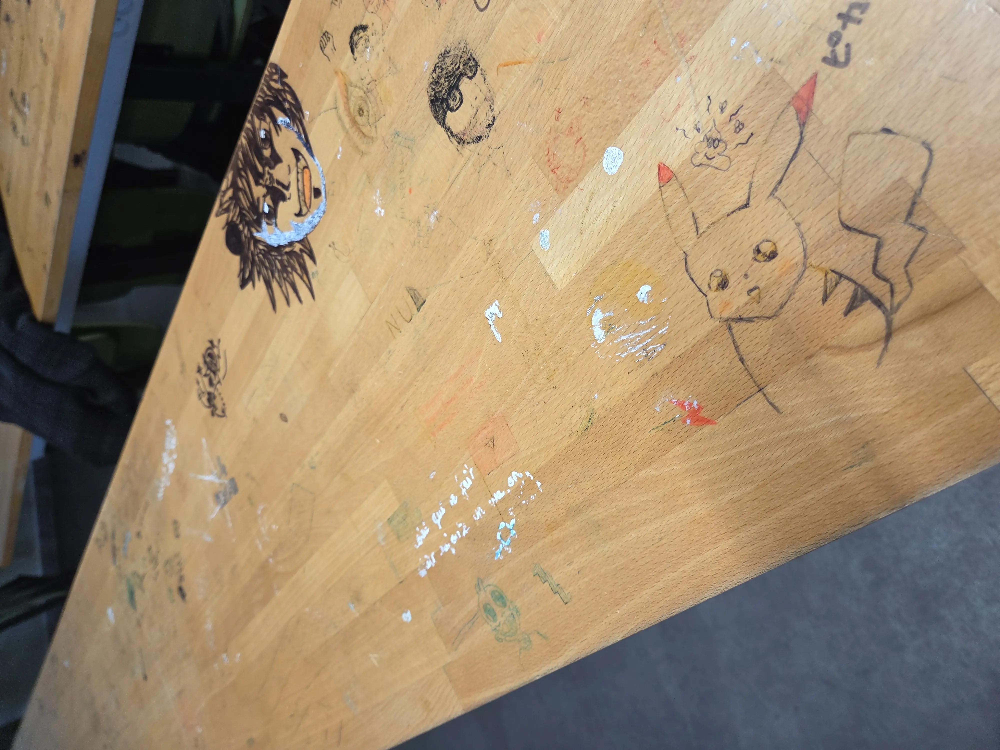

Les amphis sont très beaux. En tant que speaker, c'est un plaisir d'être présent devant le public dans de si belles salles. Le public de Touraine Tech est très sympa, souriant, et généreux en feedbacks. J'ai ressenti un bon _mood_ sur ces deux jours.

## Les talks du jeudi

La journée du jeudi était déjà bien chargée, j'ai assisté à cinq talks plus la keynote du matin et celle du soir.

### Keynote - Tech Vs Bots - Debuggons la démocratie - par Clément Hammel

Dans cette première keynote, Clément Hammel explique le principe de _social listening_ et montre quelques exemples d'analyse des réseaux sociaux.

Un des exemples mis en avant est celui de la mobilisation du monde agricole par rapport à la crise de la dermatose nodulaire contagieuse récente.
Il nous explique alors la méthode d'analyse qui consiste à sélectionner un ensemble de tweets (en Français, et dans un temps limité, de l'ordre de quelques jours), les regrouper en fonction de mots clés dans les bios des auteurs, et détecter des communautés _via_ les interactions entre les auteurs et les tweets, ainsi que détecter la duplication de contenus.

Le résultat met en avant une cartographie avec les polarités des différentes communautés.
Sont aussi analysées les dates de création des comptes, avec des pics de création pendant certains événements.

Le constat est sans appel, la manipulation politique de cette crise (mais aussi d'autres évènements) est évidente, puisque les agriculteurs, premiers concernés par cet évènement, sont très peu présents dans le discours face aux mouvements politiques, face aux comptes associés à des ingérences étrangères, et autres mouvements contestataires (anti-vax, théoristes du complot, etc.).

Pour conclure, Clément pousse la réflexion au monde de l'IA Gen, qui est entraînée sur ces contenus (en particulier Grok, entraîné sur le contenu de Twitter donc) : la propagande russe infiltre l'IA Gen.

Il nous a également présenté l'initiative Française VigiNum (unique au monde), qui vise à surveiller les tendances sur les réseaux sociaux, et détecter les tentatives d'ingérences qui pourraient être menées par certains états, ainsi que quelques axes permettant de riposter face à ces attaques.

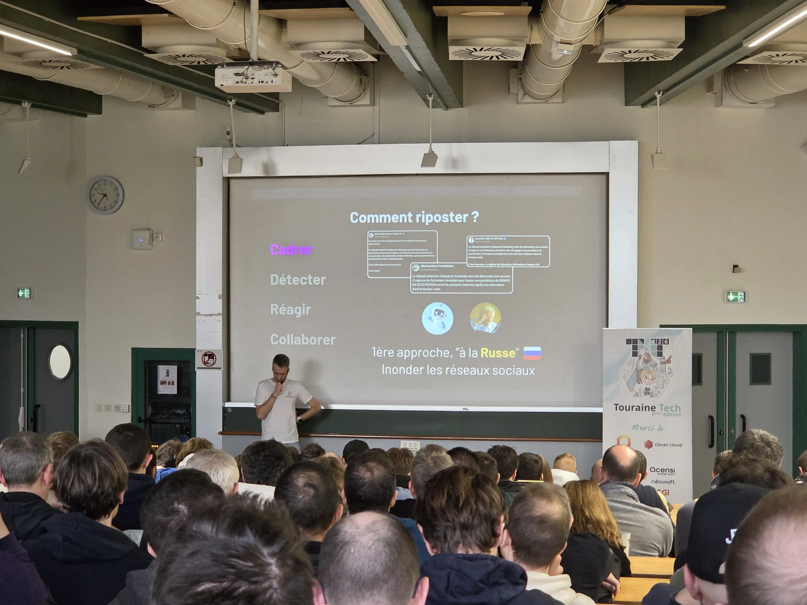

> Le thème des réseaux sociaux est celui qui a été choisi par les orgas pour les deux keynotes du jeudi et vendredi.
> C'est quand même assez angoissant d'observer ce qu'il se passe, mais il est important d'en être informé pour pouvoir avoir un regard critique sur tout ça (même si on a déjà un avis sur ce qu'il se passe sur Tweeter).

### L'architecture hexagonale au pays des irréductibles développeurs - par Nathan Castelein et Ambre Person

_Ordralfabétix_ (Ambre avec ses couettes et muni de son poisson pas frais) et _Cétautomatix_ (Nathan avec son tablier et son marteau), présentent chacun leur vision de l'architecture hexagonale, pour alimenter _Jarvix_, l'_Intelligence Armoricaine_.

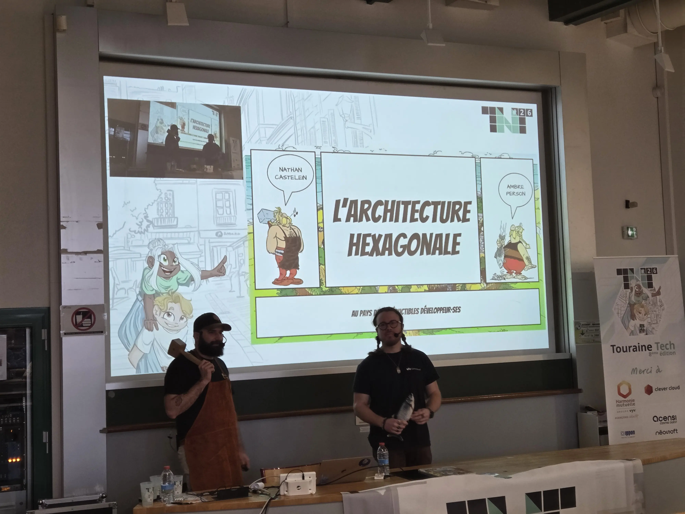

Le ton est vite posé. Ce talks est un des plus drôles que j'ai vus récemment. Tout est prétexte à un jeu de mots en _ix_ : une partie de _Chifoumix_ : Menhir/Parchemin/Serpe, la commande `curlix` pour exécuter des requêtes HTTP, le serveur de cache _Redix_.

Le jeu entre les deux speakers fonctionne bien, sur fond de rivalité éternelle entre ces deux personnages.

Les règles de l'architecture hexagonale sont bien présentées et illustrées avec le village d'Astérix et ses portes gardées, et par des implémentations en Java et en Go du métier de druide pour préparer la recette de la potion magique. Et c'est là tout l'intérêt du talk, d'y voir illustrés ces deux implémentations très différentes, et comment les concepts de ports et adapters peuvent être repris dans ces langages aux concepts différents.

Et on y découvre enfin la recette de la potion magique (j'en ai une photo, mais c'est un secret).

> C'est un talk que je conseillerai à mes étudiants, et qui a beaucoup plus au public. Bravo aux speakers.
> 
> Ce talk m'a donné envie d'intégrer une section sur l'architecture hexagonale dans Factorio. Ça traînait dans ma tête depuis un moment, mais ça s'est débloqué en voyant le village illustré, donc ça m'aura bien servi.

### Le hasard fait bien les tests - par David Pilato

Les tests un peu _flaky_, on connait. Parfois, certains éléments aléatoires et difficiles à reproduire font échouer des tests.

David présente l'utilisation de [_Randomized Testing_](https://labs.carrotsearch.com/randomizedtesting.html), une librairie de tests Java développée par Carrot Search, qui s'intègre avec JUnit.

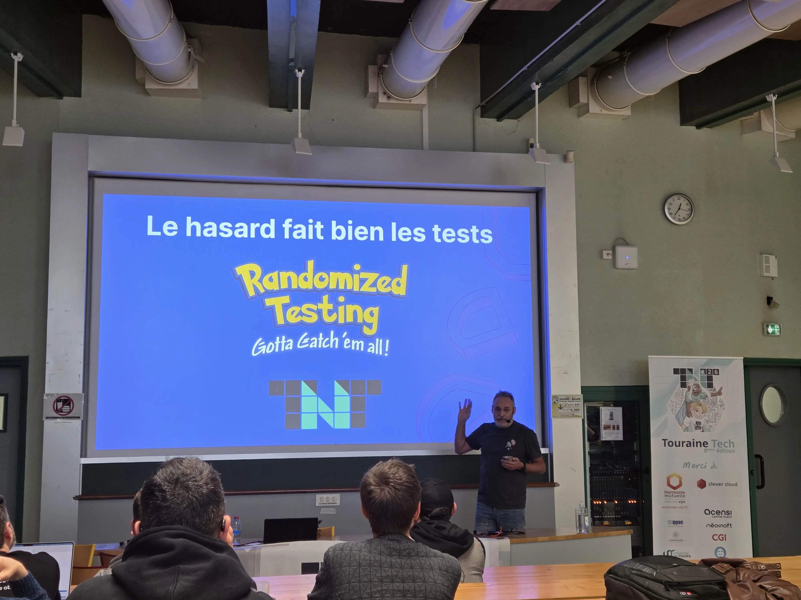

Randomized Testing permet de facilement générer des données aléatoires de tout type (nombres, chaînes de caractères, dates, locales, etc), pour les utiliser dans les tests.
Chaque exécution est associée à un _seed_ qui va rendre le test reproductible.
Un axe est aussi d'exécuter les tests dans des répétitions pour maximiser les cas couverts.

Un seul point négatif : la librairie est conçue pour être utilisée avec JUnit&nbsp;4 uniquement, ce qui est un peu limitant pour les projets récents utilisant JUnit 5 ou 6.

### Metal-As-A-Service : Gérer votre bare-metal en MaaS, comme si c'était une machine virtuelle ! - par Julien Briault

On ne présente plus Julien, bénévole aux Restos du Coeur, et porteur de l'initiative _Le Cloud du Coeur_. Cette fois-ci, il nous présente les challenges associée à la gestion de serveurs en bare-metal.

L'utilisation de serveurs en bare-metal offre des performances brutes, et des latences très basses, ce qui permet d'absorber des pics de traffic liés aux évènements annuels des restos, comme le concert des Enfoirés.

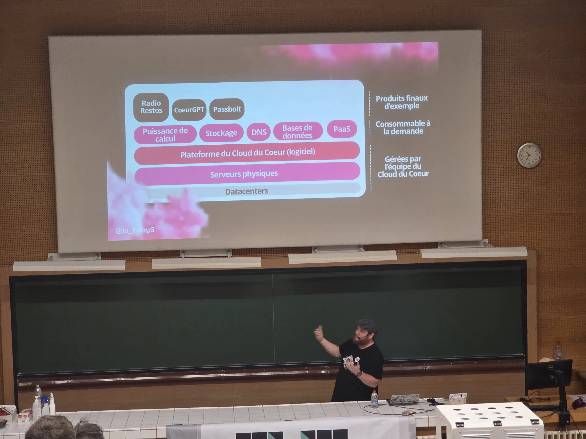

Après avoir expliqué les challenges de la gestion du bare-metal, pour démarrer les machines installées dans un rack, pouvoir y installer un OS et exécuter du post-provisionning avec des scrips Cloud-Init, Julien a présenté l'utilisation de MaaS de Canonical, qui permet d'installer n'importe quel OS (Linux ou Windows) sur n'importe quel Hardware (en fonction des marques, HPE, DELL, etc.), l'intégration à leur CLI, ainsi que la surcouche maison OpenBareMetal qui permet de faire de l'auto-scaling de bare-metal, et donc aller économiser des coûts énergétiques.

C'est bluffant.

> Je ne pense pas que je testerai ces approches, car je n'ai pas de cas d'usage, mais c'est toujours intéressant de découvrir ce qu'il se passe derrière nos infras. Ça contribue beaucoup à la compréhension et à la démystification du Cloud.
> 
> Si vous ne les avez pas vu, allez aussi jetter un oeil aux autres talks de Julien sur le Cloud du Coeur, ça vaut le détour.

### Fatigués de la POO ? Passez à la DOP ! - Par Jérôme Tama

Un talk qui parcours les évolutions de Java depuis la version 8 jusqu'aux versions récentes.
L'approche est de proposer en live un refactoring de code, d'une application Java 8, sous la forme d'un Kata.

L'approche est pédagogique, et les features des Java apparaissent naturellement petit à petit. Bref, c'est bien amené.

> Je demanderai probablement à Jérôme l'autorisation de réutiliser son Kata pour mes cours, car il est très clair, et présente les nouveautés une-à-une. L'intérêt de chaque feature transparaît immédiatement dans le code.

### Un voyage dans le temps sur le passé, le présent et l'avenir de la protection de la mémoire - par Laurent Grangeau

Laurent liste l'ensemble des mécanismes de protection de la mémoire, les failles et les évolutions depuis les premières années de l'informatique, jusqu'aux approches actuelles (qui ciblent maintenant souvent les GPU). La plus grande partie des mécanismes sont hardware (implémenté par le CPU), et d'autres sont logicielles (comme le sandboxing).

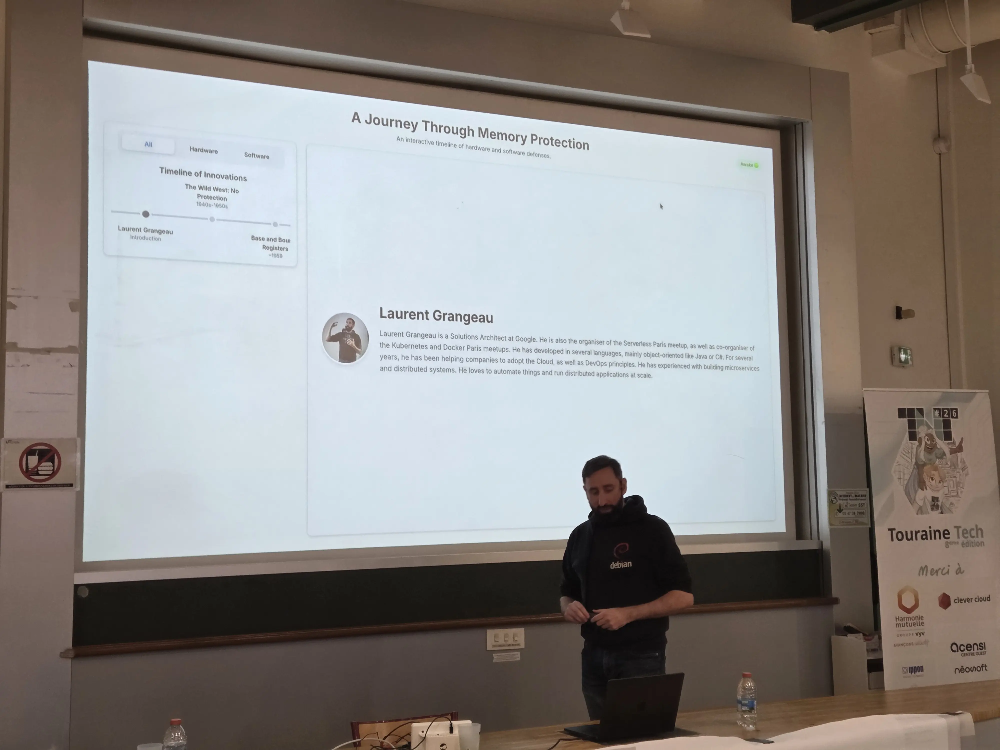

On re-découvre les concepts de pagination, de mémoire virtuelle, de segmentation.
Le talk est très dense, et beaucoup de mécanismes sont présentés, c'est exhaustif.

> Un bon rappel du fonctionnement de la mémoire. C'est dense et technique, mais c'est intéressant pour se refaire l'_overview_ de ce qui existe.

### Keynote du Jeudi soir : Speechless - par Jean-François Garreau

Un exercice d'improvisation, animé par Jean-François, avec quatre speakers de légende : Estelle Landry, Aurélie Vache, Mickael Alves, et Sébastien Ferrer; plus deux membres du jury : Marjorie Aubert et Thierry Chantier.
Un bel exercice, très drôle, pendant lequel le public participe au choix des sujets.

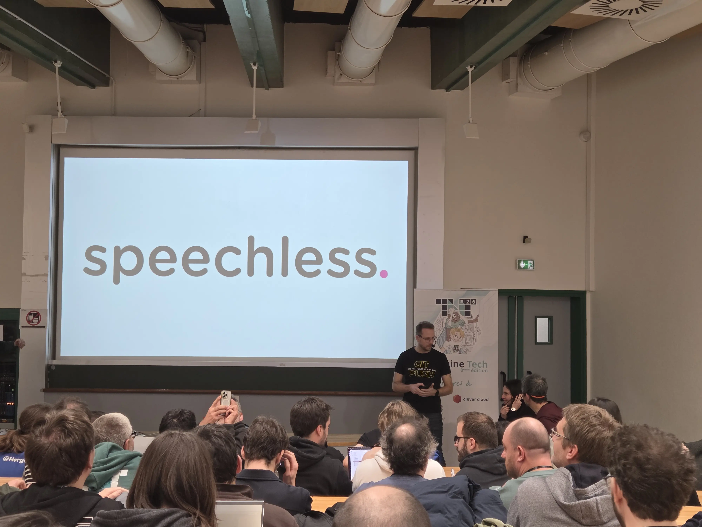

On a eu le droit à quatre belles impros, parfois sur des thèmes glissants. Une bonne rigolade pour finir la journée.

## Les talks du vendredi

Le vendredi matin, j'étais très fatigué (j'ai passé une mauvaise nuit). Après la keynote, j'ai donc passé la matinée à peaufiner mon talk (j'ai fignolé la partie sur l'architecture hexagonale que j'avais ajouté la veille) et à discuter avec les speakers dans notre salle réservée.

J'ai profité du regain d'énergie de l'heure du midi pour aller voir quelques talks _Lightning_ de 15 minutes.

### Keynote - Gray Hat, Black Hat, Users : comment protéger une plateforme de 85M d'utilisateurs face à des menaces hybrides - Par Mikael Robert et Yohan Boyer

Mikael et Yohan sont co-fondateurs du réseau social Yubo, réseau social Français 🇫🇷, avec pour cible des utilisateurs de la Gen Z (donc _obviously_, je ne connaissais pas ce réseau).

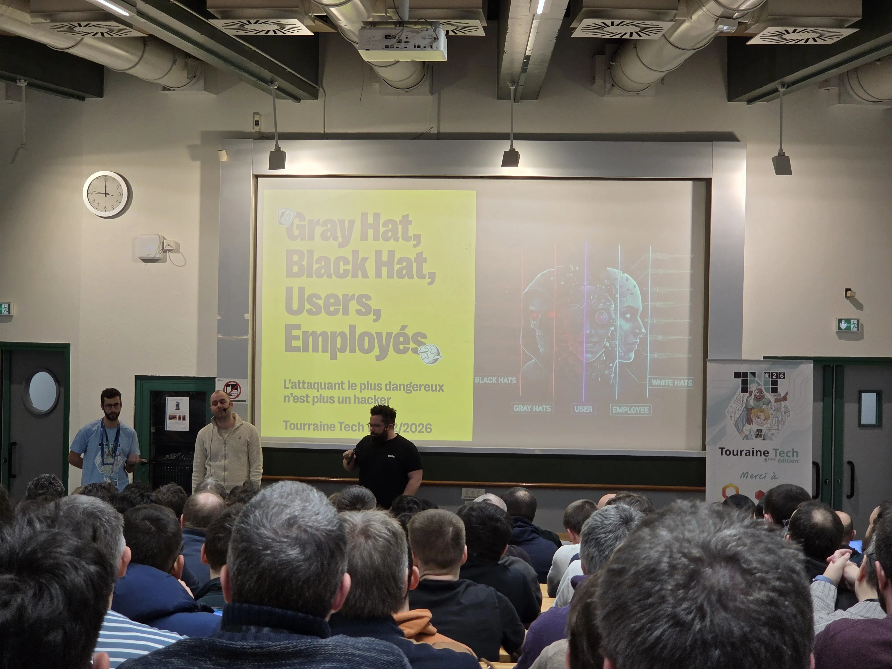

Ils nous présentent les challenges de développer et opérer un réseau social, dont les utilisateurs peuvent parfois essayer de détourner les usages du réseau.
Les hackers sont donc des ados, qui apprennent à bidouiller sur Youtube et Tiktok. On est loin de l'image du Hacker qu'on a dans notre imaginaire collectif.
Les usages détournés peuvent potentiellement être du scam, du doxing, de la sextorsion, ou plus légèrement exploiter une race-condition ou un process mal optimisé pour accéder à des fonctionnalités normalement payantes gratuitement.

Parmi les tentatives d'exploitation dont ils ont dû se prémunir, plusieurs cas sont rigolos, comme celui d'une tentative d'infiltration _via_ le recrutement, avec des CVs visiblement faux, conçus pour appâter les recruteurs, et visant probablement à se faire embaucher pour aller exploiter les données de l'entreprise de l'intérieur.

Ce sont des challenges auxquels on est pas forcément habitués, donc c'est toujours intéressants de découvrir ce monde du hacking des réseaux sociaux.

> Le message principal est donc que le risque vient aussi de l'intérieur et des usages détournés. La surveillance des signaux dits "faibles" prend une place importante. 

### Mieux écrire, mieux trouver : Diátaxis comme guide de documentation - par Alexis "Horgix" Chotar

Alexis présente rapidement le concept de Diataxis, framework d'organisation de documentation.

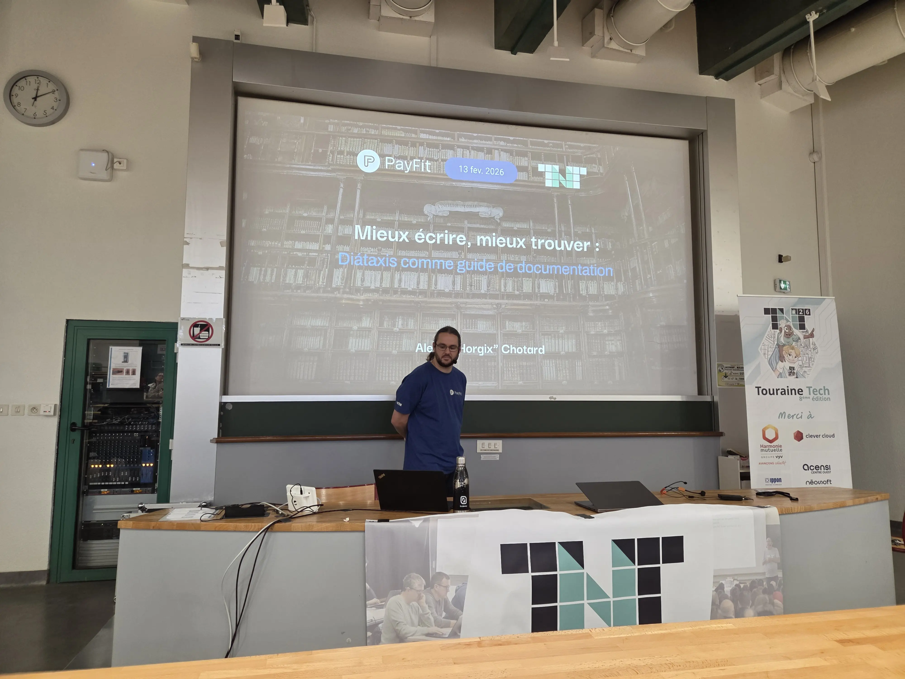

Ce framework propose d'organiser la doc selon 2 axes, en 4 parties : les tutoriels et how-tos visant à documenter des actions, et les explications et la références plus portées sur la connaissance.

Quelques tips intéressants, en particulier ne pas hésiter à lier les articles de documentation, ainsi qu'être le plus spécifique possible.

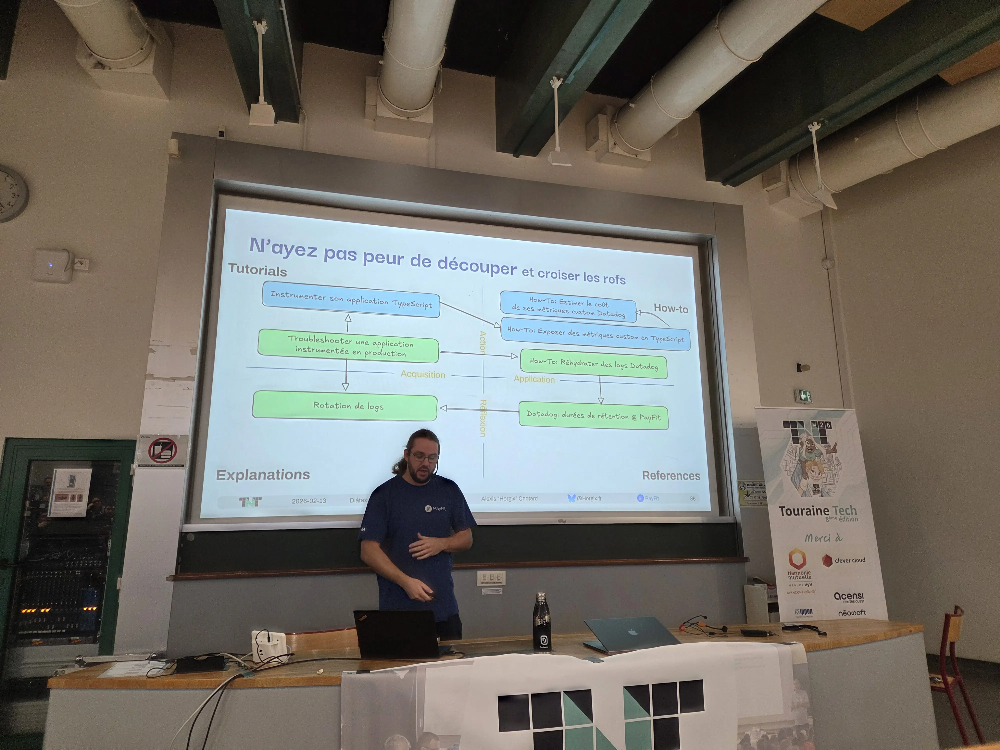

> J'ai bien aimé l'approche avec les exemples sur la photo précédente, qui aide à se projetter dans l'organisation proposée par le framework.
> Comme l'a dit Alexis, le mieux, c'est de se lancer !

### Déchaînez le Chaos : Tester la résilience de votre application avec Chaos Monkey - par Erwan Le Tutour

Erwan présente les approches de Chaos Monkey, qui ont été popularisées par Netflix, avec la Simian Army.

Il nous présente ici très concrètement comment mettre en place un Chaos Monkey dans une application Spring Boot en utilisant le starter `chaos-monkey-spring-boot` développé par CodeCentric, qui développe aussi Spring Boot Admin.

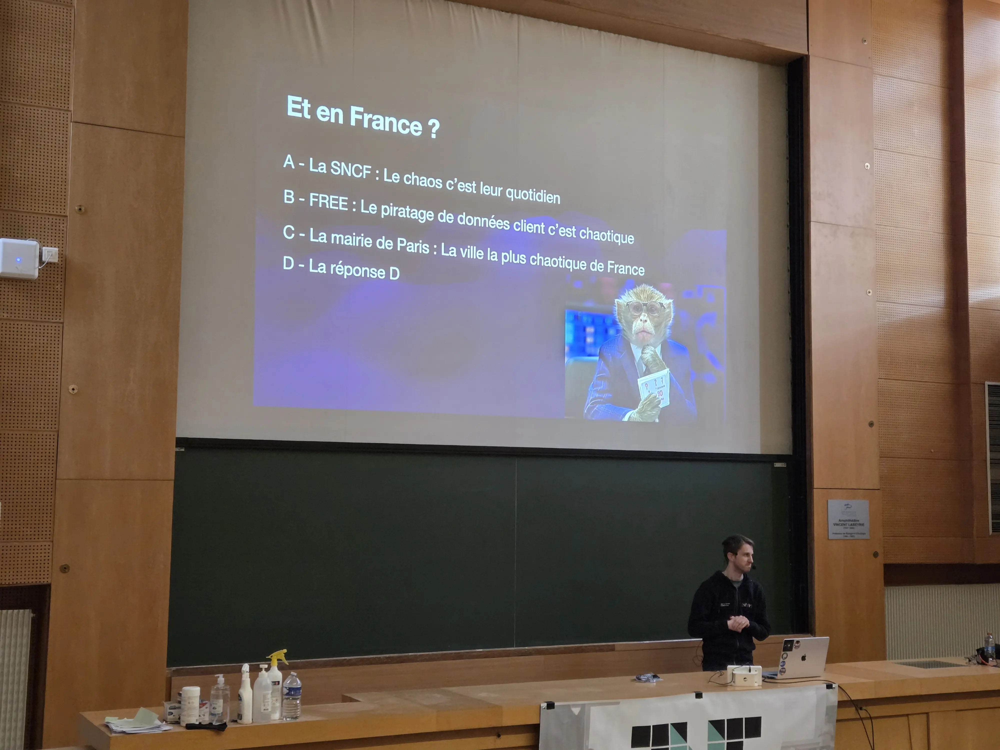

La démo est intéressante, Erwan nous montre comment activer le Chaos Monkey, sur les différentes couches de notre application, pour y introduire des latences ou des erreurs. À tester couplé avec des tirs de charge pour observer comment les applications se comportent et améliorer leur résilience.

> Probablement une brique que je vais tester à l'avenir, vu que c'est tout pile dans ma stack !

### Tricher pour mieux apprendre : 30 minutes par jour pour rester curieux dans nos métiers de la tech - par Yann Schepens

Yann nous parle de veille techno, et nous propose de prendre 30 minutes chaque jour, sur notre temps de travail pour faire de la veille.
Il nous invite à pratiquer, lancer des projets persos, partager.

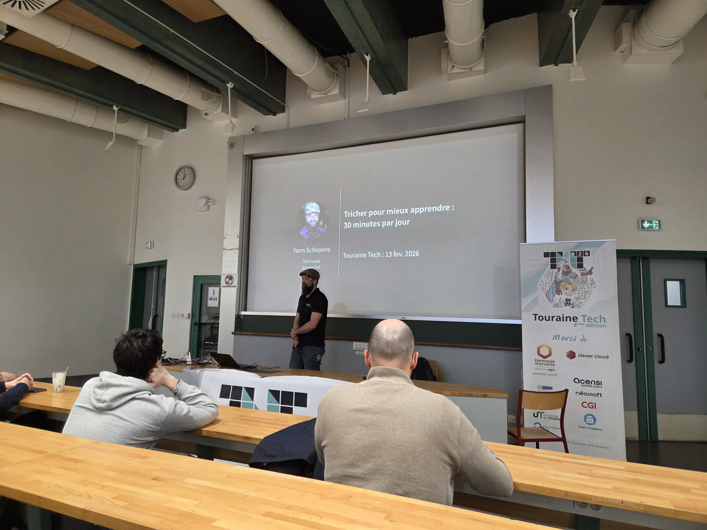

L'idée la plus pertinente à mon sens : faire sa veille 30 minutes avant le daily. Cela permet de bien gérer le temps, de ne pas déborder.
30 minutes par jour, ça représente une dizaine d'heures par mois, donc cette "triche" permet quand même de cumuler pas mal de temps, c'est une bonne astuce si on a pas encore de temps consacré à la veille.

> Je reste convaincu que la veille est probablement une des pratiques les plus importantes de nos métiers.
> C'est toujours intéressant de voir ce que font les autres.

### Au secours, mes images pourrissent mes perfs - par Antoine Caron et Mathieu Mure

Un talk tout en déguisements, et sur le thème du jeu Hadès. La mise en scène est chouette.

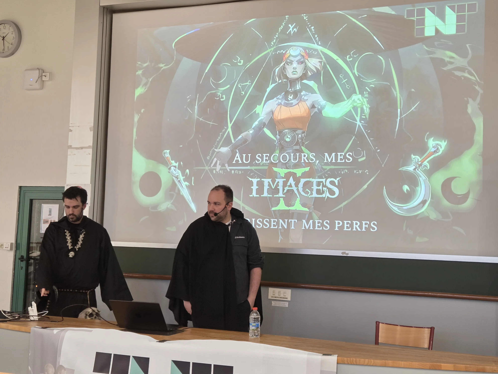

Antoine et Mathieu nous présentent l'histoire de l'utilisation des images sur le web, depuis la photo des Cernettes (première photo publiée sur internet), en passant par les différents formats, des BMP, GIF, en passant par les JPG et PNG, jusqu'aux formats modernes AVIF ET WEBP, dont les codecs sont issus du monde de la vidéo.

Ils nous listent avec humour les piliers de l'enfer : des JPG non-transparents, aux images qui ne chargent pas, à l'image de 20 pixels affichée en grand donc floue, à l'image de 4000 pixels affichée en tout petit.

Mais au delà de cet aspect humoristique, ils nous partagent des axes d'amélioration très concrets : l'utilisation des formats modernes qui sont très légers, le redimensionnement des images et la mise à disposition au browser d'un `srcset` pour lui permettre de choisir parmi les formats, les `lazy loading` et `fetchpriority` pour aller chercher des images au bon moment.

Une architecture est aussi proposée pour redimensionner les images à la volée et les conserver en cache, plutôt que de faire ces redimensionnements au build (pas comme sur ce blog donc), à base de Strapi, imgproxy, d'un bucket et d'une BDD pour le stockage, et d'un Varnish ou d'un CDN pour le cache.
C'est plutôt intéressant pour des sites publics, je testerai probablement une ou deux de ces astuces dans les prochains mois.

> J'avais déjà entamé un travail sur les images de ce blog sur les bons conseils d'Antoine, il m'a redonné des idées supplémentaires avec ce talk. J'en avais pas besoin ahah.

### Local-first et sync-engines, l'architecture du futur ? - par Benjamin Legrand

Benjamin présente les problèmes liés aux architectures classiques _n-tiers_, avec le Frontend qui communique à un Backend, avec des requêtes HTTP par exemple. Ces communications sont sources d'attente côté utilisateur en cas de latence réseau, et on met en place des mécanismes pour y palier : loaders et spinners. La gestion d'erreur est également un problème en soi, ainsi que la disponibilité du Backend qui doit être maximale, sous peine de rendre le Frontend inutilisable.

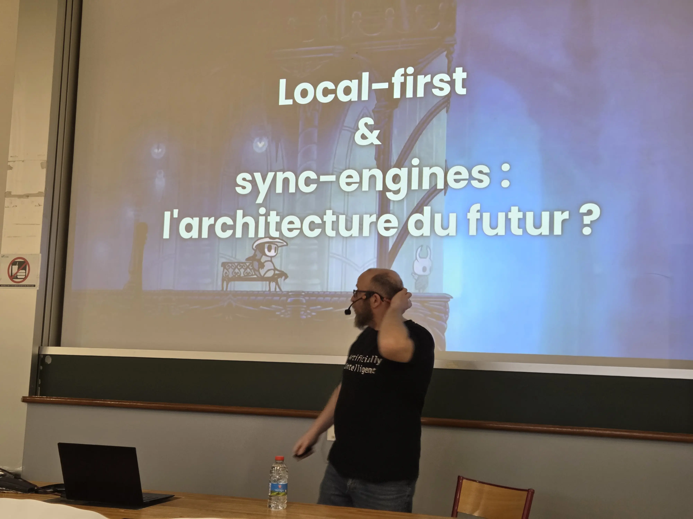

Il présente ensuite les approches _local-first_, qui consistent à avoir une base de données locale au Frontend (type _IndexedDB_ ou _sqLite_), couplée à un moteur de synchronisation.

Les avantages sont nombreux : plus besoin de _spinner_, l'accès réseau devient optionnel car l'application peut fonctionner en mode déconnecté, les données peuvent être plus facilement sécurisées et privées si besoin, le Frontend devient alors aussi plus tolérant aux pannes du Backend.

Côté Frontend, l'utilisation de _live-queries_ permet d'implémenter le lien entre les écrans et la base de données facilement (ainsi que le refresh pour les données synchronisées entrantes). Côté moteur de synchronisation, la plupart des moteurs du marché proposent l'utilisation d'un _CRDT_ (pour _Conflict-free Replicated Data Type_), une espèce d'API de Documents à la MongoDb, pour implémenter la synchronisation simplement.

_localfirst.fm_ fournit une vision complète de l'ensemble des libraries ou frameworks qui suivent ces principes.

> J'avais déjà vu ce genre d'architecture par le passé. Le principal problème est pour moi le besoin de déplacer (ou dupliquer) les règles de gestion dans le Frontend, mais je trouve l'approche intéressant quand l'application Web est le seul canal.

## Keynote de fin : Une belle démarche de transparence

La keynote de cloture du vendredi soir (juste après ma game de Factorio), a été l'occasion pour les orgas de remercier tout le monde : sponsors, speakeuses et speakers, et le public présent.

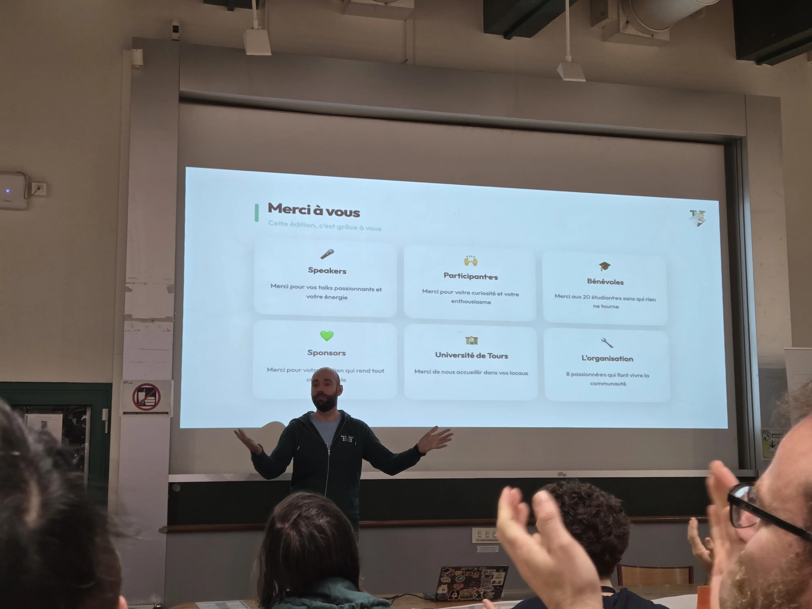

L'équipe d'orga en a profité pour afficher la situation financière de l'association derrière l'évènement.
Pas de surprise, comme partout, les dernières années sont difficiles. Touraine Tech 2026 est quand même à l'équilibre, mais sans le soutien des sponsors, on voit que ça va être difficile.

Je souhaite à toute l'équipe que les sponsors se remobilisent les prochaines années, pour que ce bel event puisse perdurer.

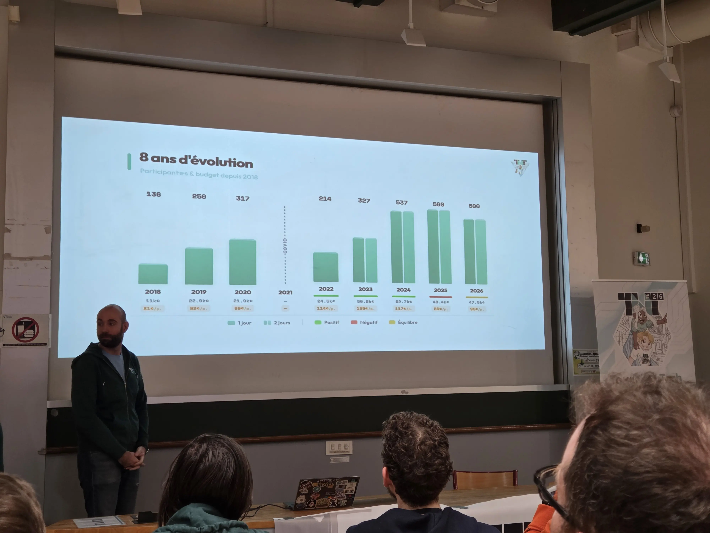

## En conclusion

J'ai passé une super conférence. L'accueil des orgas aux petits soins, les soirées autour d'un verre et d'une planche qui passent beaucoup trop vite, la qualité des interventions, et le public définitivement très agréable. Tout ça fait que je reviendrai avec plaisir à Touraine Tech 2027.

---

> J'ajouterai les liens vidéos des talks ici quand ils seront dispos, ce qui me permettra aussi de les revoir, ou de voir ceux que j'ai loupés.
