Following the good advice from my friend [Antoine Caron](https://blog.slashgear.dev/), I took some time this week to optimize my site.

The site you're reading is a static site built with Hugo.

I had already done some work on compressing the various resources, mainly images, but I stopped there.
In this article, I detail how I optimized the build of this site to minimize loading times, and how I improved its security by following the best practices promoted by MDN.

<!-- more -->

## The Lighthouse score

To do initial work on this site's performance, I used a [Lighthouse analysis](https://pagespeed.web.dev/analysis/https-codeka-io/we5dukzmku?form_factor=desktop) (quite standard).

Lighthouse lets you get a view of an application or website's performance in just a few minutes, for both desktop and mobile targets.
It also lets you validate certain accessibility properties, such as contrast, presence of alternative text for screen readers, etc.

I think it's a good starting point.

Here are my site's current scores, for mobile and desktop browsing:

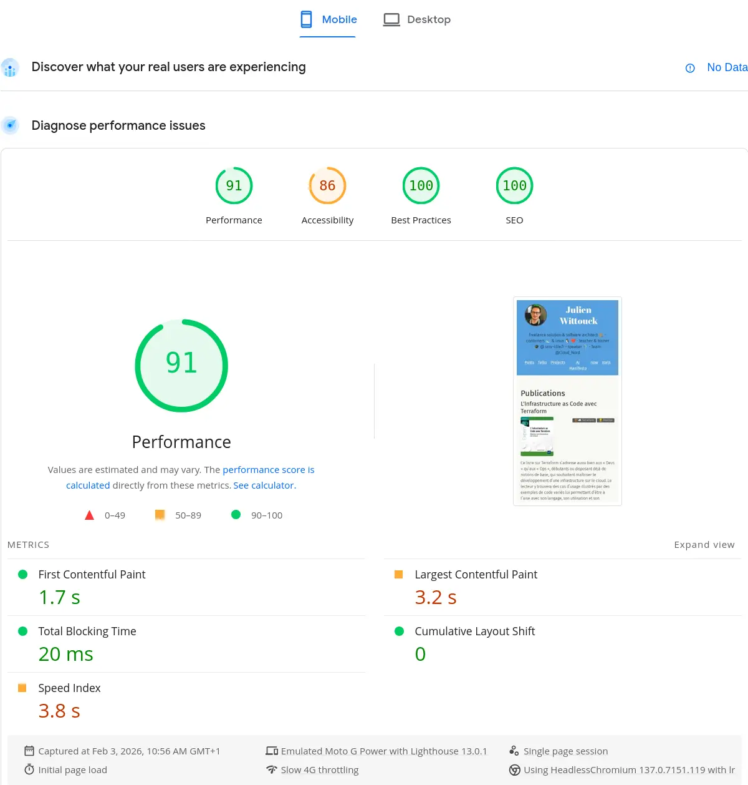
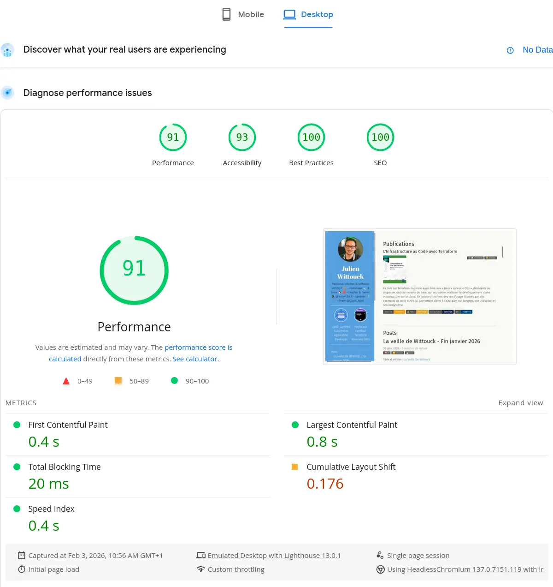
{ class="images-grid-2" }

These scores may seem interesting on the homepage, but they degrade significantly on certain pages.
Here are the scores for my Factorio talk page:

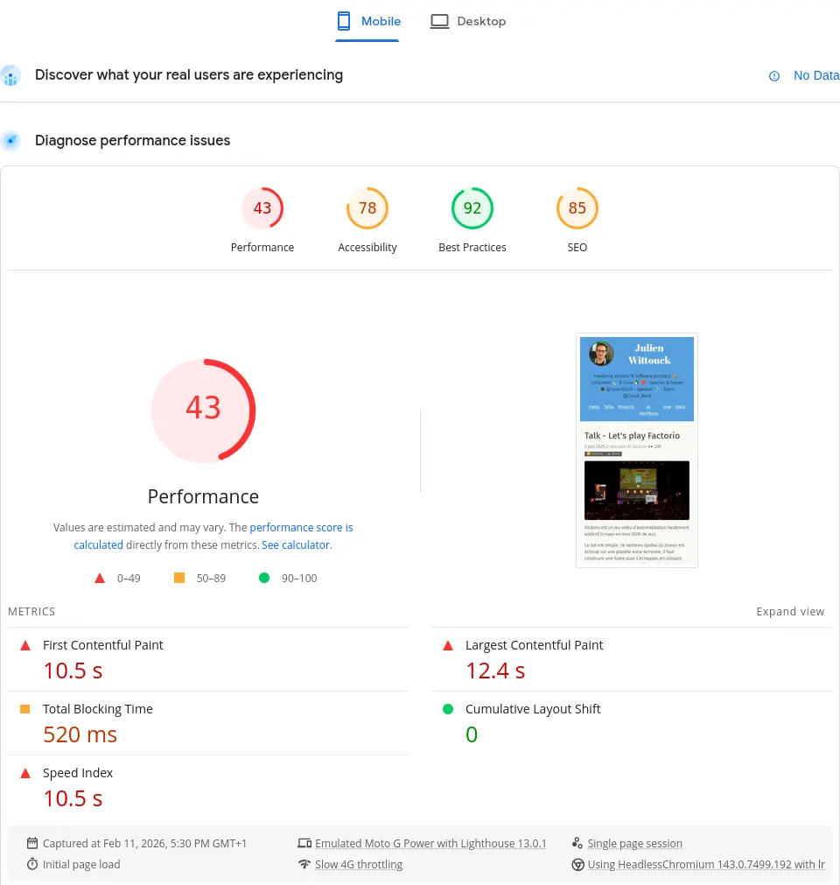
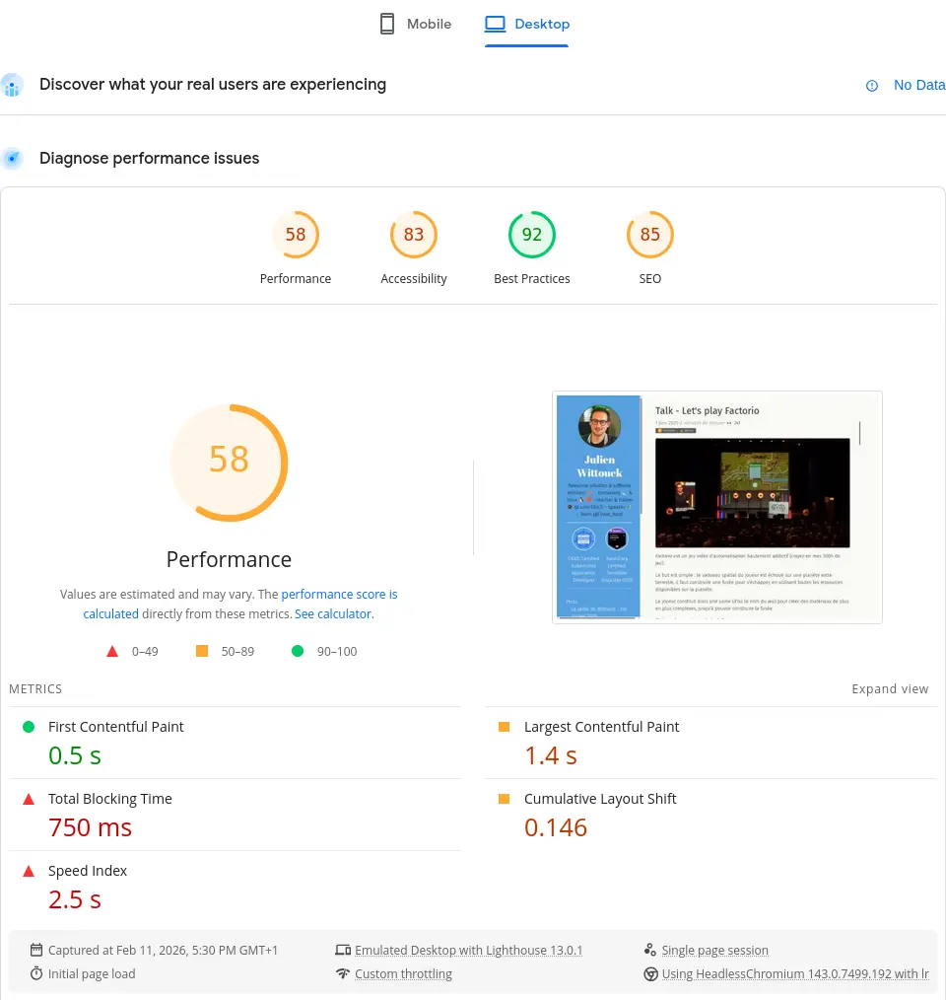
{ class="images-grid-2" }

> I clearly have room for improvement on accessibility and performance. Things aren't going well there at all.

Without going into detail and analyzing what this tool reports, let's dive right into the main topic.

## Minifying HTML, CSS, and JS

A first step involves minifying static resources: HTML, CSS, and JS.

This step is very simple to implement, as Hugo already supports it.
You just need to add the `--minify` flag during the build to ask Hugo to minify all resources.

My build command in my `mise.toml` is as follows:

```toml
[tasks.build]
description = "Build the site with Hugo"
run = "hugo --gc --minify --destination public"
```

This produces minified HTML files like this one:

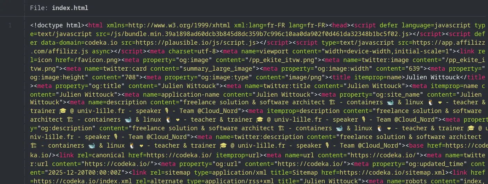

No surprises or difficulties here, we can quickly move on to the next step 🚶

> I included this section for completeness; my static resources were already minified. But I wanted a complete approach and to verify this point too.

## Converting images to webp

I often use photos I've captured with my smartphone (for conference articles), screenshots or diagrams (made on draw.io most often), or stock photos I find to illustrate my veille (tech watch) articles.

These photos are often heavy (several megabytes) and high resolution, and a simple action is to resize these photos and recompress them in webp or avif format.

Not sure which format to use, I opted for webp for two reasons: Hugo supports [webp format natively](https://gohugo.io/functions/images/process/#format) (not avif), and avif support seemed slightly less than webp in browsers.

> It's quite possible I'll change my mind on this quickly and switch to avif as soon as Hugo supports it.

I started by converting my images to webp.
I did this in one shot with a script using the `cwebp` CLI for Linux:

```shell
# parallelize conversions to use all available CPUs
JOBS="$(nproc)"
# find images
find . -type f -iname '*.jpg' -o -iname '*.jpeg' -o -iname '*.png' \
# convert to webp
  | xargs -n 1 -P "$JOBS" -I IMG sh -c 'cwebp -q 75 IMG -o $(echo "IMG" | sed "s/\.[^.]*$/.webp/")'
```

Then a big `sed` to replace the references in my markdown:

```shell
sed -Ei 's/\.(jpe?g|png)$/\.webp/I' **/*.md

find . -type f -iname '*.jpg' -o -iname '*.jpeg' -o -iname '*.png' | rm
```

The images are now in webp format, which will save some space and download time for readers.

I haven't calculated the size reduction, but for source images, we must be close to 60% of their original size:

```shell
❯ ls -alh
.rw-r--r-- jwittouck jwittouck  65 KB Tue Dec 30 12:17:33 2025 clever-addon-create.png
.rw-rw-r-- jwittouck jwittouck  20 KB Fri Feb 20 10:28:43 2026 clever-addon-create.webp
.rw-r--r-- jwittouck jwittouck  69 KB Tue Dec 30 12:17:33 2025 clever-env.png
.rw-r--r-- jwittouck jwittouck  26 KB Fri Feb 20 10:28:43 2026 clever-env.webp
.rw-r--r-- jwittouck jwittouck  48 KB Tue Dec 30 12:17:33 2025 clever-open-starting.png
.rw-r--r-- jwittouck jwittouck  15 KB Fri Feb 20 10:28:43 2026 clever-open-starting.webp
```

## Resizing to desired sizes

Hugo supports recompressing images in different formats on the fly (which could have replaced my scripts, but it was better not to do this at build time), but not automatic resizing - you have to implement the mechanism yourself.
To be able to resize images on the fly (at build time), the best solution seems to be using a Hugo img hook, which allows you to override the markdown rendering and put whatever code you want there.

The default hook is as follows:

```go

```

An image declared in Markdown like this:

```markdown

```

Will have the following HTML equivalent:

```html

```

To resize images to a maximum width of 820px (the width used on this site's content column), I use the following hook:

```go
{{- $image := .Page.Resources.GetMatch .Destination -}}

{{- $width := math.Min 820 $image.Width -}}
{{- $resizeOpts := printf "%dx webp q75 lanczos" (int $width) -}}

{{- with $image.Resize $resizeOpts -}}

{{- end -}}
```

The magic happens in the first few lines.
I resize the image to a maximum width of 820px (or less if the image is smaller).

The HTML generated by Hugo for my images is now as follows:

```html

```

With resizing and webp conversion, I'm optimizing images for display in my site's format, at build time, while keeping the images in webp at their original resolution.

I can go even further by working with a `srcset` to offer the browser different sized images depending on the viewport size, which prevents downloading an 820px wide image for a display that's only 480px.

By reworking the hook to generate multiple images of different dimensions, I get the following code:

```go
{{- $image := .Page.Resources.GetMatch .Destination -}}

{{- $width820 := math.Min 820 $image.Width -}}
{{- $resizeOpts := printf "%dx webp q75 lanczos" (int $width820) -}}
{{- $img820 := $image.Resize $resizeOpts -}}

{{- $width480 := math.Min 480 $image.Width -}}
{{- $resizeOpts := printf "%dx webp q75 lanczos" (int $width480) -}}
{{- $img480 := $image.Resize $resizeOpts -}}


```

The generated HTML looks like this:

```html

```

Very basically, I'm resizing images to 2 sizes, 820px and 480px, and asking the browser to use the 480px version for all screen sizes below 480px and the 820px version for all other sizes.

We can go a bit further, but we've already done good work on images, it's time to move to the next step.

> These resizings are done at build time, meaning each article will exponentially increase build time (2 resizings per image).
> I'll probably need to find another way soon, maybe an S3 cache, but it's a good start.

## Pre-compressing static resources

Now that the images are lighter and resized at build time by Hugo, I can tackle compressing the already minified resources (HTML, CSS, and JS).

Before moving on to pre-compression itself, we need to look at how the resources will be served.

My site is hosted on Clever Cloud, in a static instance.
I wrote an article about this last year: [Deploy static apps on Clever Cloud](/2025/06//2025-06-05-static-apps-clever).

Clever Cloud lets you use Caddy to serve static files simply by adding a `Caddyfile` to the project root.

This option will let me configure Caddy to serve the site's public directory:

```Caddyfile
# Clever Cloud needs us to listen on port 8080
:8080

file_server {
	# Clever Cloud serves the public directory
    root public
}

# Ask Caddy to compress static files 
encode
```

When handling a request, Caddy will serve static files, and potentially compress HTTP responses by setting the Content-Encoding header, thanks to the encode directive. The formats used by default by Caddy are zstd and gzip, and only relevant resources are compressed (already compressed formats like jpg are not re-compressed).

This compression saves bandwidth and speeds up page loading.

However, compression uses a bit of CPU on the fly.
It's then interesting to pre-compress static resources at the build phase to save some CPU.

A Caddy directive lets you serve pre-compressed static files: `precompressed`.
Caddy will then look for compressed variants of files, in the form of sidecar files.
Next to each static file, you need to generate compressed variants and name them using extensions like .gz, .br, and .zst for example.

Hugo doesn't let you generate these compressed variants itself, so I need to use a small script that will execute at the end of the build phase.

I created a `precompress` script in my `mise.toml` file:

```toml
[tasks.build]
description = "Build the site with Hugo"
run = "hugo --gc --minify --destination public"

[tasks.precompress]
description = "Precompress static resources"
run = '''
COMPRESSREGEX=".*(html|css|js|xml|ico|svg|md|pdf)$"
find public/ -type f -regextype egrep -regex $COMPRESSREGEX | xargs zstd --keep --force -19
find public/ -type f -regextype egrep -regex $COMPRESSREGEX | xargs gzip --keep  --force --best
'''
```

I implemented compression with gzip using the highest compression level possible (`--best`), and with zstd with the highest compression as well (`-19`). The compression level mainly impacts compression, but little on decompression, so let's maximize the various levels.
I skipped the br format because it requires installing an additional binary on my Clever Cloud instances, and gz and zst are already more than sufficient: zst will be supported by modern browsers in the most recent versions, gzip will serve as a reasonable default format.

To run this script, just tell Clever Cloud to execute `mise run precompress` as a post-build hook, with the `CC_POST_BUILD_HOOK` environment variable:

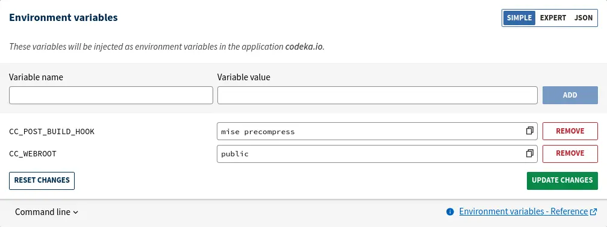

The `precompress` script is inspired by a [blog post from Scott Laird](https://scottstuff.net/posts/2025/03/09/precompressing-content-with-hugo-and-caddy/) that I found while doing some research.
It searches for all files matching the given regex, and uses zstd to compress these files.

Running these scripts produces the following output:

```bash
[precompress] $ COMPRESSREGEX=".*(html|css|js|xml|ico|svg|md|pdf)$"
245 files compressed : 80.99% (  83.3 MiB =>   67.4 MiB)                       B ==> 98%^T
```

We can validate that the built files are pre-compressed as expected, with .gz and .zst extensions:

```bash
$ ls public/
2020         404.html.zst  fonts           index.xml.zst                           projects
2021         ai            fr              js                                      robots.txt
2022         ai-manifesto  icons           logo_blue.png                           series
2023         books         images          logo_transparent_background.png         sitemap.xml
2024         credentials   index.html      now                                     sitemap.xml.gz
2025         css           index.html.gz   page                                    sitemap.xml.zst
2026         ekite         index.html.zst  posts                                   stats
404.html     en            index.xml       pp_ekite_itvw.png                       tags
404.html.gz  favicon.png   index.xml.gz    pp_ekite_itvw_hu_41404e93ad715bdf.webp  talks
```

And check the compressed file sizes:

```bash
$ ls -al public/index.*
.rw-rw-r-- jwittouck jwittouck  33 KB Wed Feb 11 12:15:21 2026 index.html
.rw-rw-r-- jwittouck jwittouck 9.4 KB Wed Feb 11 12:15:21 2026 index.html.gz
.rw-rw-r-- jwittouck jwittouck 9.0 KB Wed Feb 11 12:15:21 2026 index.html.zst
.rw-rw-r-- jwittouck jwittouck  67 KB Wed Feb 11 12:15:22 2026 index.xml
.rw-rw-r-- jwittouck jwittouck  18 KB Wed Feb 11 12:15:22 2026 index.xml.gz
.rw-rw-r-- jwittouck jwittouck  17 KB Wed Feb 11 12:15:22 2026 index.xml.zst
```

> We still have a nice gain with gzip and zstd compression, around 75%.

To then serve the pre-compressed files, you need to add the [`precompressed`](https://caddyserver.com/docs/caddyfile/directives/file_server#precompressed) directive in the Caddyfile:

```Caddyfile
# Clever Cloud needs us to listen on port 8080
:8080

file_server {
	# Clever Cloud serves the public directory
    root public
    # serve precompressed files
    precompressed
}

# Ask Caddy to compress static files 
encode
```

The `precompressed` directive will look for .zst and .gz files in order to serve them first, and use on-the-fly compression as a fallback.

We can then simply verify that the compressed files are served compressed with a curl command.

Here's what was returned before compression:

```bash
$ curl --head https://codeka.io

Content-Length: 34963
Content-Type: text/html; charset=utf-8
Server: Caddy
```

And the same command after compression:

```bash
$ curl --compressed --head https://codeka.io

HTTP/1.1 200 OK
Content-Encoding: zstd
Content-Type: text/html; charset=utf-8
Server: Caddy
Content-Length: 9
```

We go from a 34KB HTML page to 9KB of compressed data, without impacting server CPU since compression happens at build!

## Security headers

The final step in this configuration is to modernize the headers served to implement some additional security.

Now that Caddy serves the site and I have a Caddyfile that I can control, I can easily control the HTTP headers returned.

To know what to do, on Antoine's advice, I used the [MDN Observatory](https://developer.mozilla.org/en-US/observatory) analyzer:

Here's my score, once again not very flattering:

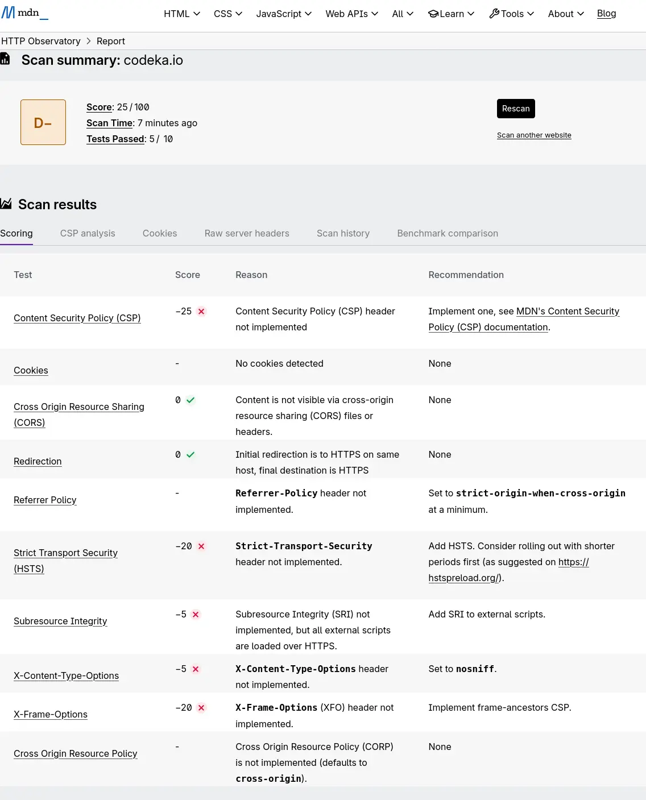

> Once again, the analysis result is poor, since no optimization had been done. There's work to be done on this part!

### HSTS and easy headers

The first interesting header to use is Strict-Transport-Security.

This header has the effect of forcing browsers to use HTTPS.
Although I've already configured an HTTP to HTTPS redirect on my domain with Clever Cloud, it's an additional security measure.

MDN's recommendation is to set this value:

```
Strict-Transport-Security: max-age=63072000
```

In my Caddyfile, nothing simpler, I add the Strict-Transport-Security header:

```Caddyfile
# Clever Cloud needs us to listen on port 8080
:8080

file_server {
	# Clever Cloud serves the public directory
    root public
    precompressed
}

# Custom headers for security
header {
	Strict-Transport-Security "max-age=63072000"
    X-Content-Type-Options nosniff
}

# Ask Caddy to compress static files 
encode
```

I do the same for the X-Content-Type-Options header, which essentially prevents a style tag from loading anything other than CSS.

### Content-Security-Policy

This header, a bit more complex to implement, tells the browser what security policy to apply when executing scripts from external sources to the website.
It's a security measure to protect against XSS (Cross-Site Scripting) injections.

The header must declare all accepted sources (domains) for loading scripts, styles, images, and other resources.
Using this header also has the effect of disabling inline CSS and JS, which is rather a good practice.

After removing all inline styles from my site, I configured the header in my Caddyfile:

```Caddyfile
# Clever Cloud needs us to listen on port 8080
:8080

file_server {
	# Clever Cloud serves the public directory
    root public
    precompressed
}

# Custom headers for security
header {
	Strict-Transport-Security "max-age=63072000"
	X-Content-Type-Options nosniff
	
	Content-Security-Policy "
	    script-src 'self' codeka.io plausible.io;
	    connect-src 'self' codeka.io plausible.io;
	    
	    frame-src 'self' plausible.io www.youtube-nocookie.com openfeedback.io;
	    frame-ancestors 'none';
	    
	    img-src 'self' img.shields.io;
	    
	    default-src 'self';
	"
}

# Ask Caddy to compress static files 
encode
```

For the script-src and connect-src directives, since I use plausible.io to track visits to my articles, its script must be able to load and open outgoing connections. Similarly, I have iframes (booo) on my talk pages that reference YouTube videos and OpenFeedback.io feedback. So I must also authorize these resources with the frame-src directive. The frame-ancestor directive blocks using my site in an external iframe (it wasn't entirely necessary, but it doesn't hurt to add it).
The img-src directive lets me authorize images coming from shields.io, which I use to display some badges.
Finally, the default-src directive serves as a fallback for all possible directives, and indicates that only my site is an authorized source.

## So what does it give?

After all these modifications, here are the Lighthouse analysis results:

Here are my site's current scores, for mobile and desktop browsing:

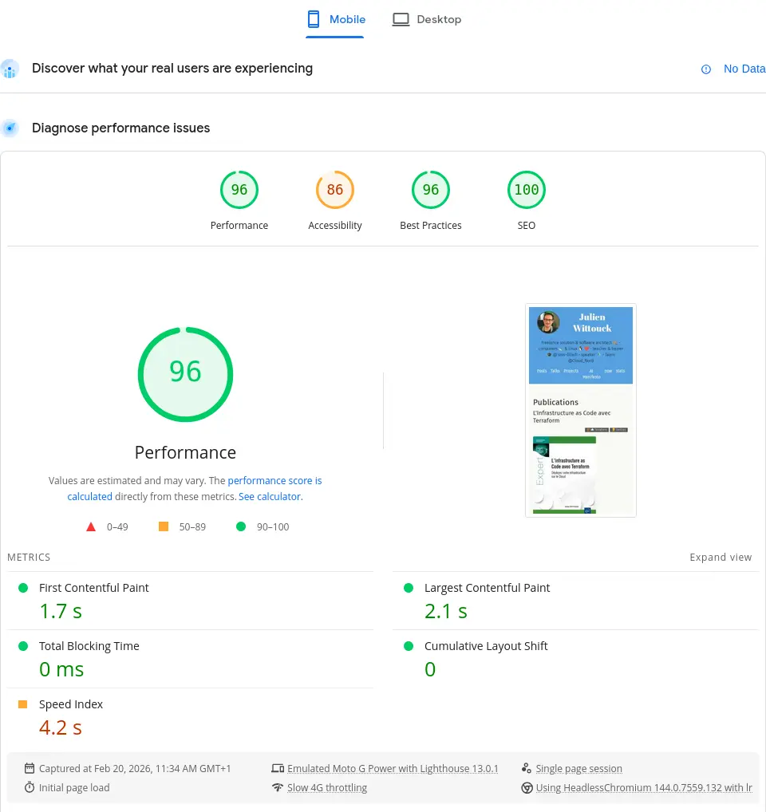
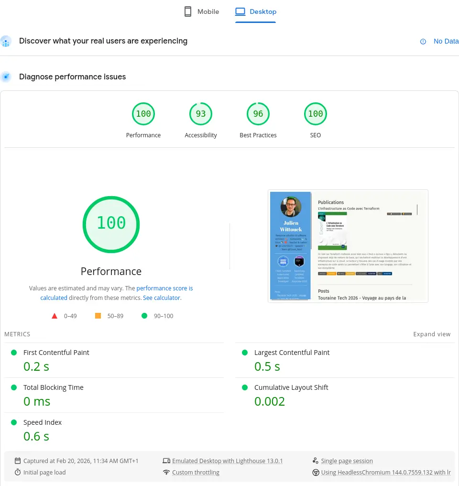
{ class="images-grid-2" }

96 and 100 in performance on the homepage, better than the initial 91, mission accomplished here.

For the page that had a really bad result, the result is a bit more mixed:

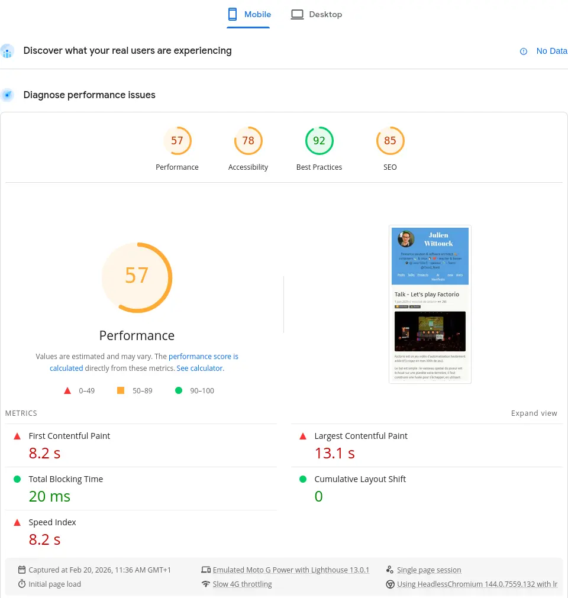
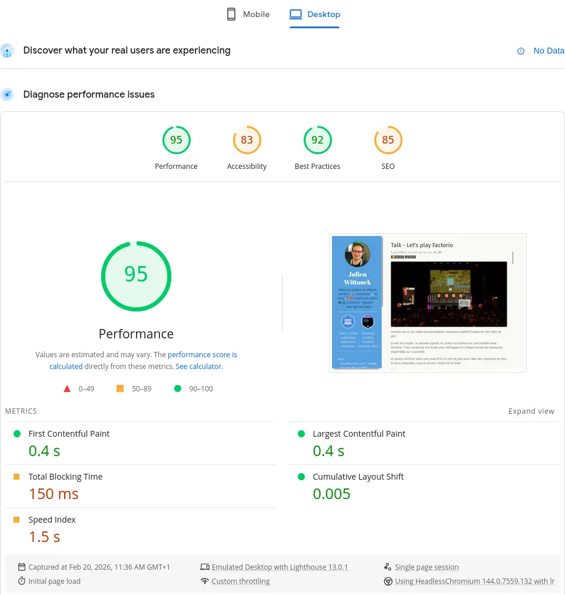
{ class="images-grid-2" }

The initial scores were 43 on mobile and 58 on desktop.
Digging a bit, it's the iframes that are killing the performance, so I can't do much about it.

On the security headers side, I reached perfection with a nice score of 105/100, an A+, instead of the initial D-:

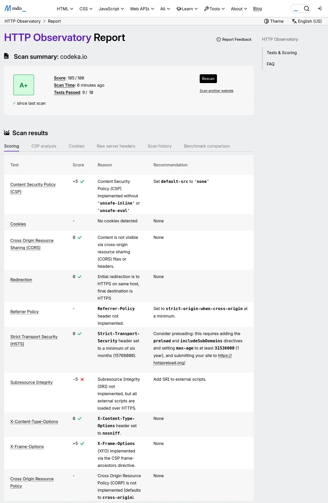

## Conclusion

It took me a good half-day to implement all these mechanisms, but I came out with a better understanding of security and HTTP compression.
I also discovered Caddy, and improved my mise.toml file.

And the result is no small thing. The optimization is real (even though I didn't take the time to measure everything precisely).

For most of my readers, the compression impact will probably be minimal, because on high-performance networks, the difference in loading time may not be felt much.
But with compression done only at build time, it's also less CPU consumed, which should allow me to stay on the smallest instances for my site as long as possible.

I'll still need to address the build time issue, which could become a problem down the road. I might test an architecture with a small Varnish cache in front of a bucket.

## Links and references

* Hugo documentation:
  * Configuring [image optimization with Hugo](https://gohugo.io/configuration/imaging/#quality)
  * Hugo's [Resize method](https://gohugo.io/methods/resource/resize/)
  * [Formats supported by Hugo](https://gohugo.io/functions/images/process/#format)
  * [Hugo's image render hook](https://gohugo.io/render-hooks/images/#article)

* Caddy documentation:
  * The [`encode` directive](https://caddyserver.com/docs/caddyfile/directives/encode#syntax)
  * The [`precompressed` directive](https://caddyserver.com/docs/caddyfile/directives/file_server#precompressed)

* MDN documentation:
  * [Responsive Images](https://developer.mozilla.org/en-US/docs/Web/HTML/Guides/Responsive_images)  
  * [MDN HTTP Observatory](https://developer.mozilla.org/en-US/observatory)
  * [Content-Security-Policy](https://developer.mozilla.org/en-US/docs/Web/HTTP/Reference/Headers/Content-Security-Policy)
  * [HTTP Strict Transport Security implementation](https://developer.mozilla.org/en-US/docs/Web/Security/Practical_implementation_guides/TLS#http_strict_transport_security_implementation)
  * [MIME type verification](https://developer.mozilla.org/en-US/docs/Web/Security/Practical_implementation_guides/MIME_types)

* [Precompressing Content With Hugo and Caddy](https://scottstuff.net/posts/2025/03/09/precompressing-content-with-hugo-and-caddy/)

* The excellent talk by Antoine Caron and Hubert Sablonière: [La compression Web : comment (re)prendre le contrôle ?](https://www.youtube.com/watch?v=LWd0hr6ljZk)

* The article by Denis Germain, who did the same thing as me this week: [Optimisation webperf : AVIF et pré-compression pour le blog](https://blog.zwindler.fr/2026/02/19/optimisation-webperf-avif-precompression/)
