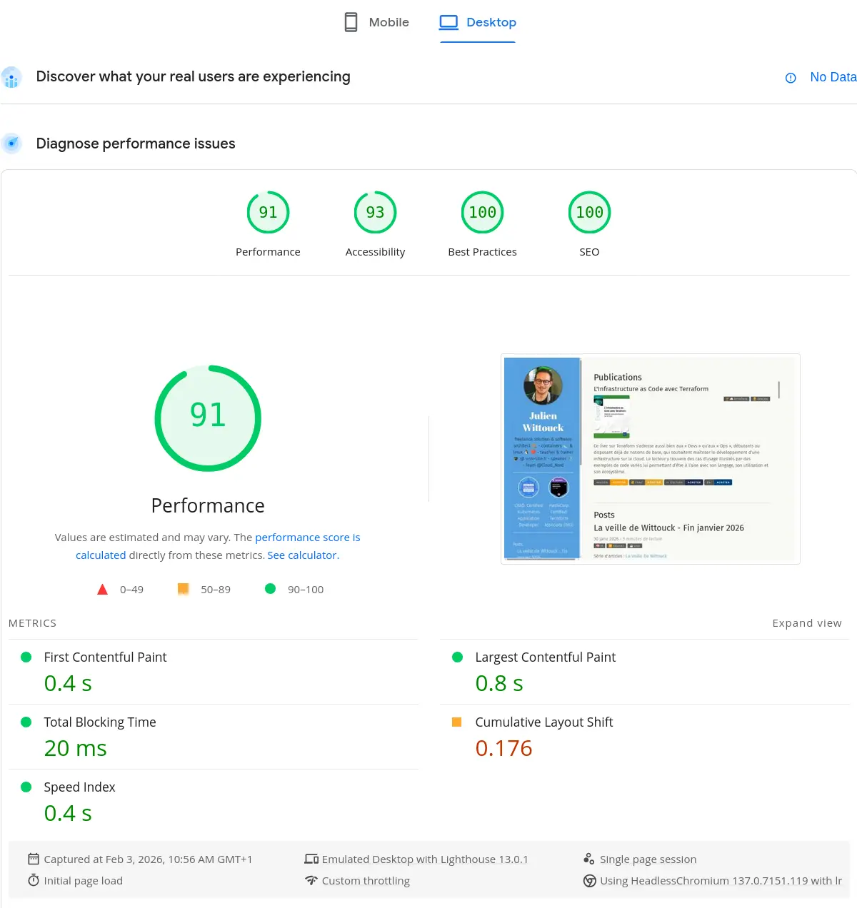
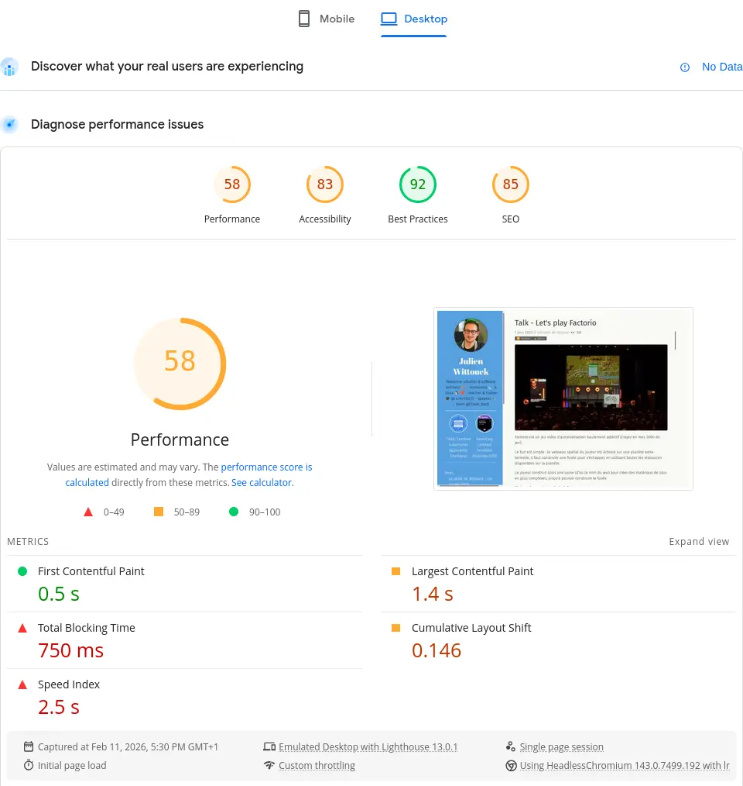
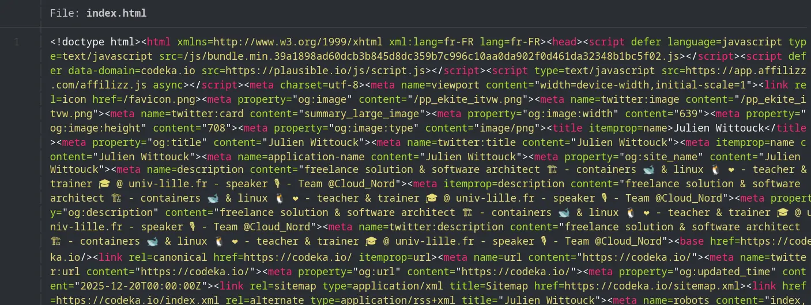
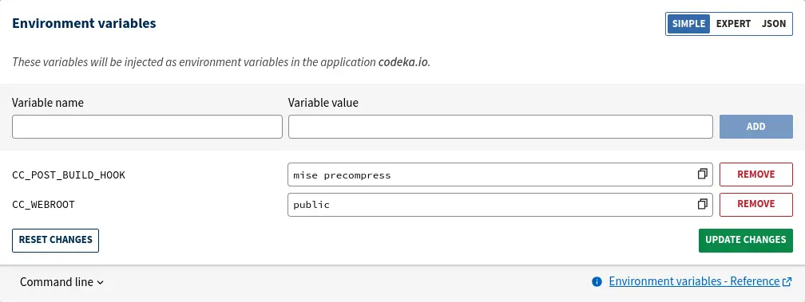
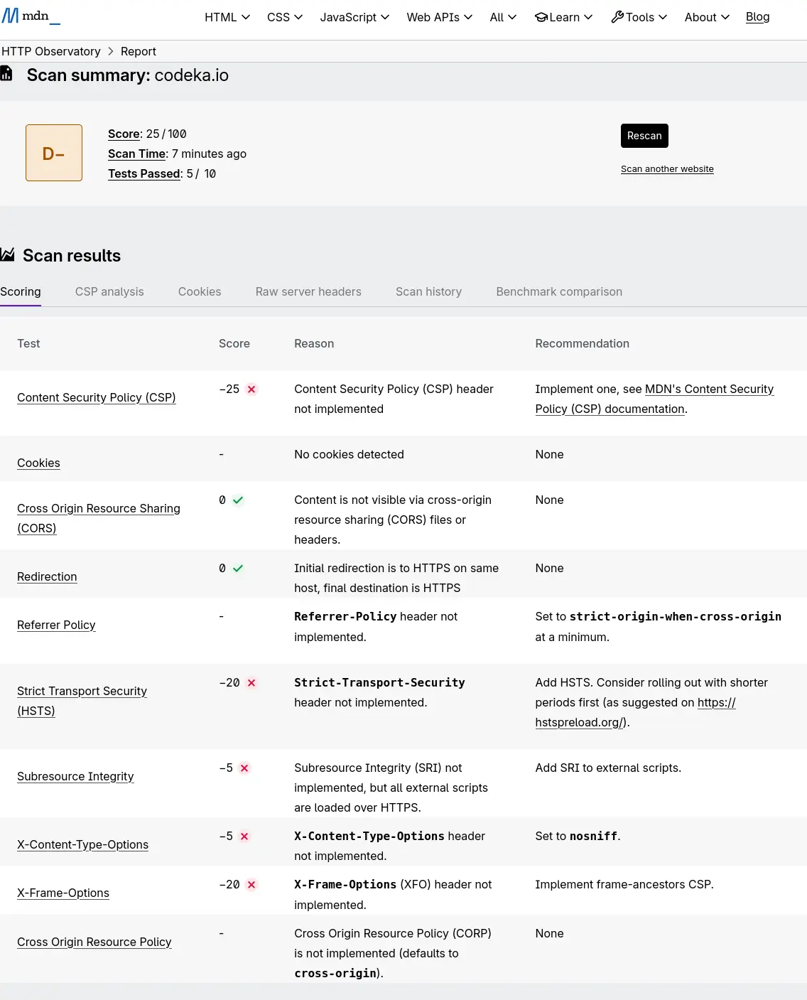
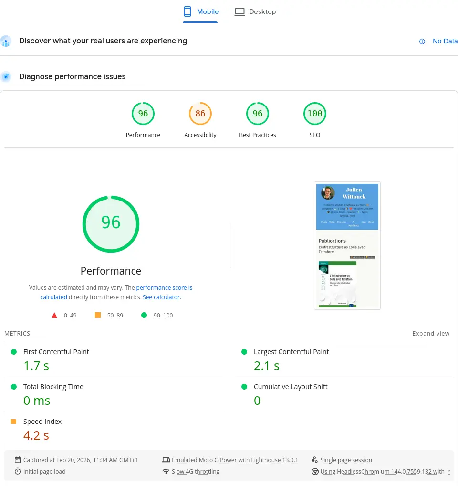
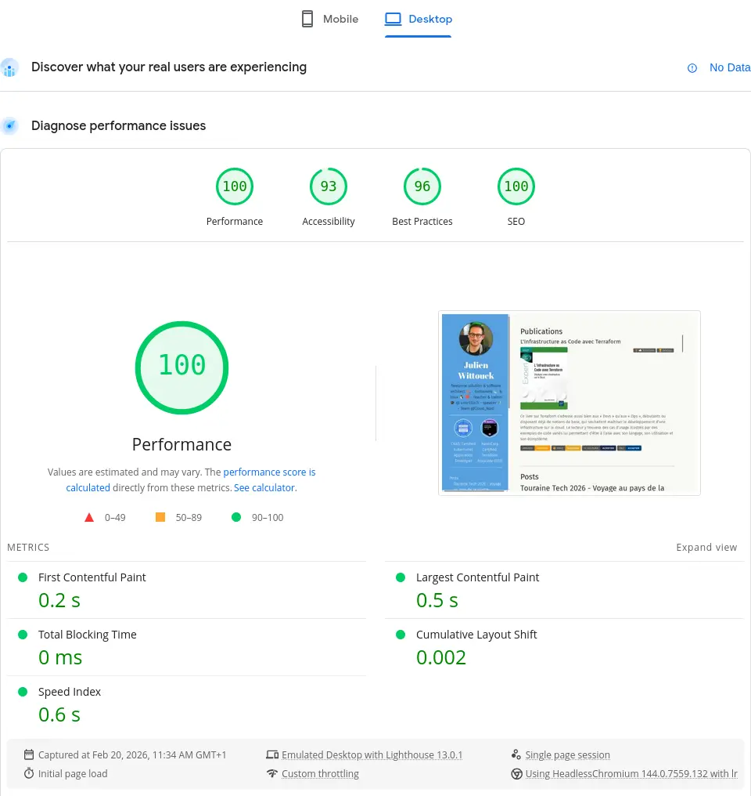
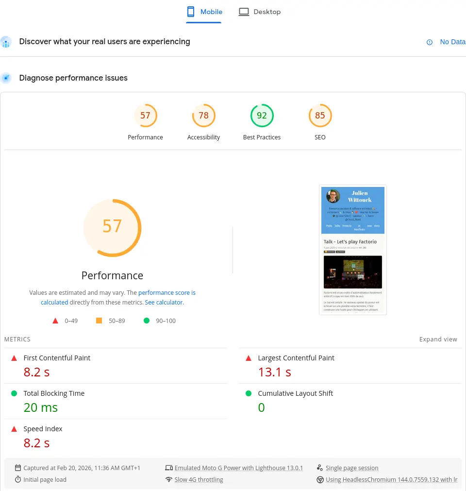
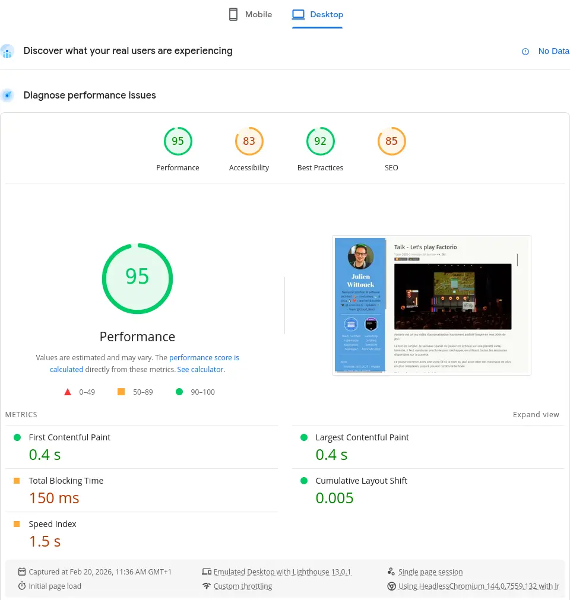
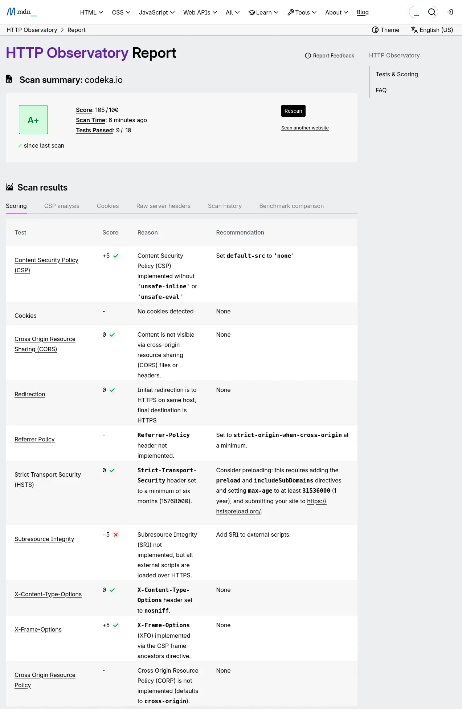

Sur les bons conseils du pote [Antoine Caron](https://blog.slashgear.dev/), j'ai pris temps cette semaine d'optimiser un peu mon site.

Ce site que vous êtes en train de lire est un site statique, buildé avec Hugo.

J'avais déjà un peu travaillé la compression des différentes ressources, principalement les illustrations, mais je m'étais arrêté à ça.
Dans cet article, je détaille comment j'ai optimisé le build de ce site, pour minimiser les temps de chargement, et comment j'ai amélioré sa sécurité en suivant les bonnes pratiques poussées par MDN.

<!-- more -->

## Le score Lighthouse

Pour faire un premier travail sur les performances de ce site, j'ai utilisé [une analyse LightHouse](https://pagespeed.web.dev/analysis/https-codeka-io/we5dukzmku?form_factor=desktop) (assez classique).

Lighthouse permet en quelques minutes d'avoir une vue des performances d'une application ou d'un site web, à la fois pour une cible _Desktop_ et _Mobile_.
Il permet aussi de valider certaines propriétés d'accessibilité, comme des contrastes, la présence de texte alternatif pour les lecteurs d'écran, etc.

C'est, je pense, un bon point de départ.

Voici les scores de mon site à l'heure actuelle, pour une navigation mobile et desktop :



{ class="images-grid-2" }

Ces scores peuvent sembler intéressants sur la page d'accueil, mais ils se dégradent fortement sur certaines pages.
Voici les scores pour la page de mon talk sur Factorio :



{ class="images-grid-2" }

> J'ai clairement une marge d'amélioration sur l'accessibilité et les performances. Ça va pas du tout là.

Sans rentrer dans le détail et l'analyse de ce qui est remonté par cet outil, on va tout de suite s'attaquer au vif du sujet.

## Minification des HTML, CSS et JS.

Une première étape consiste à minifier les ressources statiques, HTML, CSS et JS.

Cette étape est très simple à mettre en place, car elle est déjà supportée par Hugo.
Il suffit lors du build d'ajouter le flag `--minify` pour demander à Hugo de minifier toutes les ressources.

Ma commande de build est la suivante dans mon `mise.toml` :

```toml
[tasks.build]
description = "Build le site avec Hugo"
run = "hugo --gc --minify --destination public"
```

Ce qui produit des fichiers HTML minifiés de ce type :



Pas de surprise ni de difficulté sur cette première partie, hop, on peut passer rapidement à autre chose 🚶

> J'ai mis cette partie à titre d'exhaustivité, mes ressources statiques étaient déjà minifiées. Mais je voulais avoir une approche complète, et aussi vérifier ce point.

## Conversion des images en webp

J'utilise souvent des photos que j'ai capturées avec mon smartphone (pour les articles de conférence), des captures d'écran ou des schémas (produit sur draw.io le plus souvent), ou des photos _stock_ que je vais chercher pour illustrer mes articles de veille.

Ces photos sont souvent lourdes (plusieurs mégaoctets) et en haute résolution, et une action simple consiste à redimensionner ces photo et les recompresser au format _webp_ ou _avif_.

Ne sachant pas trop quel format utiliser, j'ai opté pour _webp_ pour deux raisons : Hugo supporte le [format _webp_ nativement](https://gohugo.io/functions/images/process/#format) (pas le _avif_) et le support de _avif_ semblait un peu inférieur à _webp_ sur les navigateurs.

> Il n'est pas impossible que je change d'avis sur ce point rapidement, et que je bascule sur _avif_ dès que Hugo le supporte.

J'ai donc commencé par convertir mes illustrations en _webp_.
J'ai fait ça en one-shot avec un script et le CLI `cwebp` pour Linux :

```shell
# parallélisation des conversions pour utiliser tous les CPU disponibles
JOBS="$(nproc)"
# recherche des images
find . -type f -iname '*.jpg' -o -iname '*.jpeg' -o -iname '*.png' \
# conversion en webp
  | xargs -n 1 -P "$JOBS" -I IMG sh -c 'cwebp -q 75 IMG -o $(echo "IMG" | sed "s/\.[^.]*$/.webp/")'
```

Puis un gros `sed` pour remplacer les références dans mes markdown :

```shell
sed -Ei 's/\.(jpe?g|png)$/\.webp/I' **/*.md

find . -type f -iname '*.jpg' -o -iname '*.jpeg' -o -iname '*.png' | rm
```

Les images sont maintenant en format _webp_, ce qui va me faire gagner un peu de place, et du temps de téléchargement pour les lecteurs.

Je n'ai pas fait le calcul de la réduction de taille, mais sur les images sources, on ne doit pas être loin des 60% de leur taille d'origine :

```shell
❯ ls -alh
.rw-r--r-- jwittouck jwittouck  65 KB Tue Dec 30 12:17:33 2025 clever-addon-create.png
.rw-rw-r-- jwittouck jwittouck  20 KB Fri Feb 20 10:28:43 2026 clever-addon-create.webp
.rw-r--r-- jwittouck jwittouck  69 KB Tue Dec 30 12:17:33 2025 clever-env.png
.rw-rw-r-- jwittouck jwittouck  26 KB Fri Feb 20 10:28:43 2026 clever-env.webp
.rw-r--r-- jwittouck jwittouck  48 KB Tue Dec 30 12:17:33 2025 clever-open-starting.png
.rw-rw-r-- jwittouck jwittouck  15 KB Fri Feb 20 10:28:43 2026 clever-open-starting.webp
```

## Redimensionnement aux tailles souhaitées

Hugo supporte la recompression des images dans différents formats à la volée (qui aurait pu remplacer mes scripts, mais il vallait mieux ne pas faire ça au build), mais pas leur redimensionnement automatique, il faut implémenter soi-même la mécanique.
Pour pouvoir redimensionner les images à la volée (au build donc), la meilleure solution semble d'utiliser un hook _img_ Hugo, qui permet de surcharger la traduction du markdown et d'y mettre le code qu'on souhaite.

Le hook utilisé par défaut est le suivant :

```go

```

Une image déclarée en Markdown de cette manière :

```markdown

```

aura pour équivalent HTML le code suivant :

```html

```

Pour redimensionner les images à une taille maximale de 820px (la taille utilisée sur la colonne de contenu de ce site), j'utilise le hook suivant :

```go
{{- $image := .Page.Resources.GetMatch .Destination -}}

{{- $width := math.Min 820 $image.Width -}}
{{- $resizeOpts := printf "%dx webp q75 lanczos" (int $width) -}}

{{- with $image.Resize $resizeOpts -}}

{{- end -}}
```

La magie a lieu sur les premières lignes.
Je redimensionne l'image à la taille maximale de 820px (ou moins si l'image est plus petite).

Le HTML généré par Hugo pour mes images est maintenant le suivant :

```html

```

Avec le redimensionnement et la conversion en webp, j'optimise les images pour leur affichage sur le format de mon site, au build, en conservant les images en webp sur leur résolution originale.

Je peux même aller encore un peu plus loin en travaillant avec un `srcset` pour proposer au navigateur des images de différentes tailles en fonction de la taille d'affichage de la vue, ce qui permet de ne pas télécharger une image de 820 pixels de large pour un affichage qui n'en comporte que 480.

En retravaillant le hook pour générer plusieurs images de dimensions différentes, j'obtiens le code suivant :

```go
{{- $image := .Page.Resources.GetMatch .Destination -}}

{{- $width820 := math.Min 820 $image.Width -}}
{{- $resizeOpts := printf "%dx webp q75 lanczos" (int $width820) -}}
{{- $img820 := $image.Resize $resizeOpts -}}

{{- $width480 := math.Min 480 $image.Width -}}
{{- $resizeOpts := printf "%dx webp q75 lanczos" (int $width480) -}}
{{- $img480 := $image.Resize $resizeOpts -}}


```

Le code HTML généré ressemble donc à ça :

```html

```

Très basiquement, je redimensionne les images en 2 tailles, `820px` et `480px`, et je demande au navigateur d'utiliser la version de `480px` pour toutes les tailles d'écran inférieures à `480px` et la version de `820px` pour toutes les autres tailles.

On peut encore aller un peu plus loin, mais on a déjà fait un bon travail sur les images, il est tant de passer à une étape suivante.

> Ces redimensionnements sont donc faits au build, autant dire que chaque article va augmenter le temps de build de manière exponentielle (2 redimensionnements par image).
> Il va probablement falloir que je trouve un autre moyen prochainement, peut-être un petit cache S3, mais c'est un bon début.

## Pré-compression des ressources statiques

Les images étant maintenant plus légères et redimensionnées au build par Hugo, je peux m'atteler à la compression des ressources déjà minifiées (HTML, CSS et JS donc).

Avant de passer à la pré-compression en elle-même, il faut regarder comment les ressources seront servies.

Mon site est hébergé chez Clever Cloud, dans une instance de type _static_.
J'avais écrit un article à ce sujet l'année dernière : [Déployer des applications statiques sur Clever Cloud](/2025/06//2025-06-05-static-apps-clever).

Clever Cloud permet d'utiliser Caddy pour servir les fichiers statiques simplement en ajoutant un `Caddyfile` à la racine du projet.

Cette option va me permettre de pouvoir configurer Caddy pour servir le répertoire `public` du site :

```Caddyfile
# Clever Cloud needs us to listen on port 8080
:8080

file_server {
	# Clever Cloud serves the public directory
    root public
}

# Ask Caddy to compress static files 
encode
```

Lors de l'exécution d'une requête, Caddy va servir les fichiers statiques, et potentiellement compresser les réponses HTTP en alimentant le headers `Content-Encoding`, grâce à la directive `encode`. Les formats utilisés par défaut par Caddy sont `zstd` et `gzip`, et seules les ressources pertinentes sont compressées (les formats déjà compressés comme `jpg` ne sont pas re-compressés).

Cette compression permet d'économiser de la bande passante et accélère le temps de chargement des pages.

Cependant, la compression se fait en utilisant un peu de CPU à la volée.
Il est alors intéressant de pré-compresser les ressources statiques à la phase de build pour économiser un peu de CPU.

Une directive Caddy permet de servir des fichiers statiques pré-compressés : `precompressed`.
Caddy va alors rechercher des variantes compressées des fichiers, sous la forme de fichiers sidecar.
À côté de chaque fichier statique, il faut donc générer les variantes compressées et les nommer en utilisant les extensions `.gz`, `.br` et `.zst` par exemple.

Hugo ne permet pas de générer ces variantes compressées de lui-même, donc je dois utiliser un petit script qui s'exécutera en fin de la phase de build.

J'ai donc créé un script `precompress` dans mon fichier `mise.toml` :

```toml
[tasks.build]
description = "Build le site avec Hugo"
run = "hugo --gc --minify --destination public"

[tasks.precompress]
description = "Precompress static resources"
run = '''
COMPRESSREGEX=".*(html|css|js|xml|ico|svg|md|pdf)$"
find public/ -type f -regextype egrep -regex $COMPRESSREGEX | xargs zstd --keep --force -19
find public/ -type f -regextype egrep -regex $COMPRESSREGEX | xargs gzip --keep  --force --best
'''
```

J'ai implémenté la compression avec `gzip` en utilisant le plus haut niveau de compression possible (`--best`), et avec `zstd` avec la plus forte compression également (`-19`). Le niveau de compression a surtout un impact à la compression, mais peu à la décompression, donc autant maximiser les différents niveaux.
J'ai fait l'impasse sur le format `br` parce qu'il nécessite d'installer un binaire supplémentaire sur mes instances Clever Cloud, et que `gz` et `zst` sont déjà bien suffisants : `zst` sera supporté par les navigateurs modernes dans les versions les plus récentes, `gzip` fera office de format par défaut raisonnable.

Pour exécuter de script, il suffit d'indiquer à Clever Cloud d'exécuter `mise run precompress` en tant que hook post-build, avec une variable d'environnement `CC_POST_BUILD_HOOK` :



Le script `precompress` est inspiré d'un [article de blog de Scott Laird](https://scottstuff.net/posts/2025/03/09/precompressing-content-with-hugo-and-caddy/) sur lequel je suis tombé en faisant quelques recherches.
Il recherche l'ensemble des fichiers matchant la regex donnée, et utilise `zstd` pour compresser ces fichiers.

L'exécution de ces scripts produit la sortie suivante : 

```bash
[precompress] $ COMPRESSREGEX=".*(html|css|js|xml|ico|svg|md|pdf)$"
245 files compressed : 80.99% (  83.3 MiB =>   67.4 MiB)                       B ==> 98%^T
```

On peut valider que les fichiers buildés sont précompressés comme souhaité, avec les extensions `.gz` et `.zst` :

```bash
$ ls public/
2020         404.html.zst  fonts           index.xml.zst                           projects
2021         ai            fr              js                                      robots.txt
2022         ai-manifesto  icons           logo_blue.png                           series
2023         books         images          logo_transparent_background.png         sitemap.xml
2024         credentials   index.html      now                                     sitemap.xml.gz
2025         css           index.html.gz   page                                    sitemap.xml.zst
2026         ekite         index.html.zst  posts                                   stats
404.html     en            index.xml       pp_ekite_itvw.png                       tags
404.html.gz  favicon.png   index.xml.gz    pp_ekite_itvw_hu_41404e93ad715bdf.webp  talks
```

et vérifier la taille des fichiers compressés :

```bash
$ ls -al public/index.*
.rw-rw-r-- jwittouck jwittouck  33 KB Wed Feb 11 12:15:21 2026 index.html
.rw-rw-r-- jwittouck jwittouck 9.4 KB Wed Feb 11 12:15:21 2026 index.html.gz
.rw-rw-r-- jwittouck jwittouck 9.0 KB Wed Feb 11 12:15:21 2026 index.html.zst
.rw-rw-r-- jwittouck jwittouck  67 KB Wed Feb 11 12:15:22 2026 index.xml
.rw-rw-r-- jwittouck jwittouck  18 KB Wed Feb 11 12:15:22 2026 index.xml.gz
.rw-rw-r-- jwittouck jwittouck  17 KB Wed Feb 11 12:15:22 2026 index.xml.zst
```

> On a encore un joli gain avec les compressions `gzip` et `zstd`, de l'ordre de 75%.

Pour ensuite servir les fichiers précompressés, il faut ajouter la [directive `precompressed`](https://caddyserver.com/docs/caddyfile/directives/file_server#precompressed) dans le `Caddyfile` :

```Caddyfile
# Clever Cloud needs us to listen on port 8080
:8080

file_server {
	# Clever Cloud serves the public directory
    root public
    # serve precompressed files
    precompressed
}

# Ask Caddy to compress static files 
encode
```

La directive `precompressed` recherchera dans l'ordre les fichiers `.zst` et `.gz` pour les servir en priorité, et utilisera comme _fallback_ une compression à la volée.

On peut ensuite simplement vérifier que les fichiers compressés sont bien servis compressés avec une commande `curl`.

Voici ce qui était renvoyé _avant_ la compression :

```bash
$ curl --head https://codeka.io

Content-Length: 34963
Content-Type: text/html; charset=utf-8
Server: Caddy
```

et la même commande après la compression :

```bash
$ curl --compressed --head https://codeka.io

HTTP/1.1 200 OK
Content-Encoding: zstd
Content-Type: text/html; charset=utf-8
Server: Caddy
Content-Length: 9
```

On passe d'une page HTML de 34ko à une donnée compressée de 9ko, sans impacter le CPU du serveur puisque la compression se fait au build !

## Headers de sécurité

La dernière étape de cette configuration consiste à moderniser les headers servis pour implémenter un peu de sécurité supplémentaire.

Maintenant que Caddy sert le site et que j'ai un `Caddyfile` sur lequel j'ai la main, je peux contrôler les headers HTTP renvoyés facilement.

Pour savoir quoi-faire, sur les conseils d'Antoine, j'ai utilisé l'analyseur du [MDN Observatory](https://developer.mozilla.org/en-US/observatory) :

Voici mon score, encore une fois peu flatteur :



> Encore une fois, le résultat de l'analyse est médiocre, puisqu'aucune optimisation n'avait été faite. Il y a du travail sur cette partie !

### HSTS et headers faciles

Le premier header intéressant à utiliser est le `Strict-Transport-Security`.

Ce header a pour effet de forcer les navigateurs à utiliser HTTPS.
Bien que j'ai déjà configuré une redirection HTTP vers HTTPS sur mon domaine avec Clever Cloud, c'est une mesure de sécurité supplémentaire.

La recommandation de MDN est de positionner cette valeur :

```text
Strict-Transport-Security: max-age=63072000
```

Dans mon Caddyfile, rien de plus simple, j'ajoute le header `Strict-Transport-Security` :

```Caddyfile
# Clever Cloud needs us to listen on port 8080
:8080

file_server {
	# Clever Cloud serves the public directory
    root public
    precompressed
}

# Custom headers for security
header {
	Strict-Transport-Security "max-age=63072000"
    X-Content-Type-Options nosniff
}

# Ask Caddy to compress static files 
encode
```

Je fais la même chose pour le header `X-Content-Type-Options`, qui permet d'éviter en substance qu'une balise `style` charge autre chose que du CSS.

### Content-Security-Policy

Ce header, un peu plus complexe à mettre en œuvre, indique au navigateur quelle politique de sécurité appliquer à l'exécution des scripts provenant de sources externes au site web.
C'est une mesure de sécurité permettant de se prémunir des injections de type XSS (Cross-Site Scripting).

Le header doit déclarer l'ensemble des sources (domaines) acceptés pour le chargement des scripts, styles, images et autres ressources.
Utiliser ce header a aussi pour effet de désactiver le CSS et le JS "inline", ce qui est plutôt une bonne pratique.

Après avoir supprimé tous les styles inlines de mon site, j'ai configuré le header dans mon Caddyfile :

```Caddyfile
# Clever Cloud needs us to listen on port 8080
:8080

file_server {
	# Clever Cloud serves the public directory
    root public
    precompressed
}

# Custom headers for security
header {
	Strict-Transport-Security "max-age=63072000"
	X-Content-Type-Options nosniff
	
	Content-Security-Policy "
	    script-src 'self' codeka.io plausible.io;
	    connect-src 'self' codeka.io plausible.io;
	    
	    frame-src 'self' plausible.io www.youtube-nocookie.com openfeedback.io;
	    frame-ancestors 'none';
	    
	    img-src 'self' img.shields.io;
	    
	    default-src 'self';
	"
}

# Ask Caddy to compress static files 
encode
```

Pour les directives `script-src` et `connect-src`, étant donné que j'utilise plausible.io pour suivre les visites de mes articles, son script doit pouvoir être chargé, et ouvrir des connexions sortantes. De la même manière, j'ai des iframes (bouh) sur les pages de mes talks qui référencent les videos Youtube ainsi que les feedbacks OpenFeedback.io. Je dois donc aussi autoriser ces ressources, avec la directive `frame-src`. La directive `frame-ancestor` bloque l'utilisation de mon site dans une iframe externe (ce n'était pas tout à fait nécessaire, mais ça ne coûte pas grand chose de l'ajouter).
La directive `img-src` permet d'autoriser les images qui proviennent de shields.io, que j'utilise pour afficher quelques badges.
Enfin, la directive `default-src` sert de fallback pour toutes les directives possibles, et indique que seul mon site est une source autorisée. 

## Et ça donne quoi ?

Après toutes ces modifications, voici les résultats de l'analyse LightHouse :

Voici les scores de mon site à l'heure actuelle, pour une navigation mobile et desktop :



{ class="images-grid-2" }

96 et 100 en performance sur la page d'accueil, on est mieux que les 91 initiaux, mission accomplie ici.

Pour la page qui avait un résultat vraiment mauvais, le résultat est un peu plus mitigé :



{ class="images-grid-2" }

Les scores initiaux étaient de 43 en mobile et de 58 en desktop.
En fouillant un peu, ce sont les `iframes` qui plombent les perfs, donc je n'y pourrai pas grand chose.

Côté headers de sécurité, j'ai atteint la perfection avec le joli score de 105/100, soit un A+, à la place du D- initial :



## Conclusion

Ça m'a pris une bonne demi-journée pour mettre en place tous ces mécanismes, mais j'en ressors avec une meilleure compréhension de la sécurité et de la compression en HTTP.
J'ai aussi découvert Caddy, et amélioré mon fichier `mise.toml`.

Et le résultat n'est pas des moindres. L'optimisation est réelle (même si je n'ai pas pris le temps de tout mesurer précisément).

Pour la plupart de mes lecteurs, l'impact de la compression sera probablement minime, car sur des réseaux performants, la différence de temps de chargement ne se ressentira peut-être pas beaucoup.
Mais avec une compression effectuée uniquement au build, c'est aussi une du CPU de moins de consommé, ce qui devrait pouvoir m'assurer de rester sur des instances les plus petites pour mon site le plus longtemps possible.

Il me restera à adresser le sujet du temps de build, qui risque de poser problème à terme. Je testerai peut-être une architecture avec un petit cache Varnish devant un bucket.

## Liens et références

* Documentation de Hugo :
  * Configuration de l'[optimisation des images avec Hugo](https://gohugo.io/configuration/imaging/#quality)
  * La [méthode Resize de Hugo](https://gohugo.io/methods/resource/resize/)
  * Les [formats supportés par Hugo](https://gohugo.io/functions/images/process/#format)
  * [Le hookimage de Hugo](https://gohugo.io/render-hooks/images/#article)

* Documentation de Caddy :
  * [La directive `encode`](https://caddyserver.com/docs/caddyfile/directives/encode#syntax)
  * [La directive `precompressed`](https://caddyserver.com/docs/caddyfile/directives/file_server#precompressed)

* Documentation MDN :
  * [Responsive Images](https://developer.mozilla.org/en-US/docs/Web/HTML/Guides/Responsive_images)  
  * [MDN HTTP Observatory](https://developer.mozilla.org/en-US/observatory)
  * [Content-Security-Policy](https://developer.mozilla.org/en-US/docs/Web/HTTP/Reference/Headers/Content-Security-Policy)
  * [HTTP Strict Transport Security implementation](https://developer.mozilla.org/en-US/docs/Web/Security/Practical_implementation_guides/TLS#http_strict_transport_security_implementation)
  * [MIME type verification](https://developer.mozilla.org/en-US/docs/Web/Security/Practical_implementation_guides/MIME_types)

* [Precompressing Content With Hugo and Caddy](https://scottstuff.net/posts/2025/03/09/precompressing-content-with-hugo-and-caddy/)

* L'excellent talk de Antoine Caron et Hubert Sablonière : [La compression Web : comment (re)prendre le contrôle ?](https://www.youtube.com/watch?v=LWd0hr6ljZk)

* L'article de Denis Germain, qui a fait la même chose que moi cette semaine : [Optimisation webperf : AVIF et pré-compression pour le blog](https://blog.zwindler.fr/2026/02/19/optimisation-webperf-avif-precompression/)
