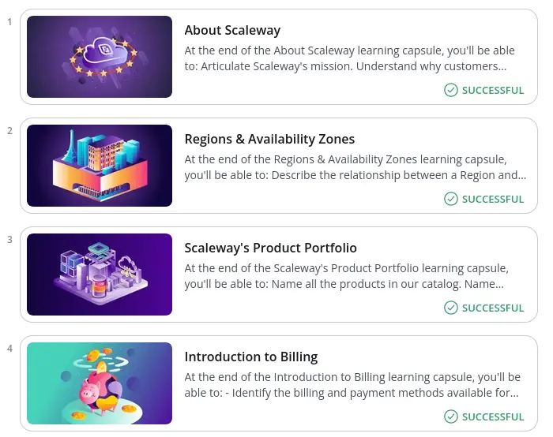
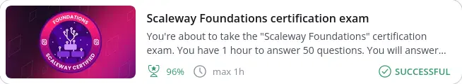
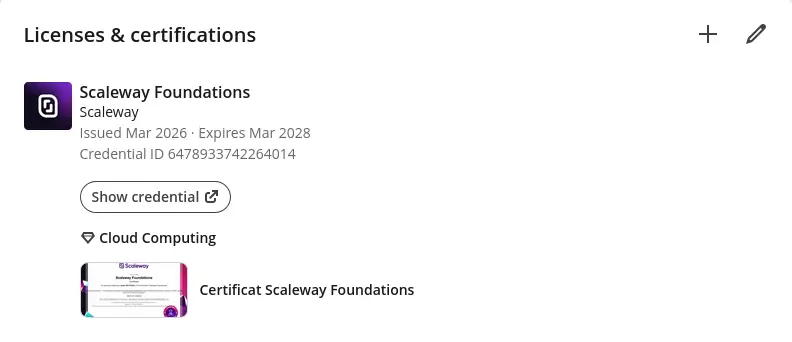

Cela faisait quelque temps que je voulais investir sur les offres de Cloud souveraines.
Je connaissais déjà pas trop mal l'écosystème _Scaleway_, pour l'avoir pratiqué avec quelques clients, et pour m'en servir sur des projets perso et avec mes étudiants en TP.

J'ai donc décidé de m'y mettre sérieusement, et d'entamer le parcours de certification sur _Scaleway_ sur les prochaines semaines.

## Le programme de certification Scaleway

Scaleway propose depuis peu (un an je crois) un programme de certification.
Ce programme est constitué pour l'instant de quatre certifications différentes :

* Scaleway Foundations
* Scaleway Associate : Network
* Scaleway Associate : Security & Identity
* Scaleway Associate : Kubernetes

Ensemble, elles forment un parcours adaptés à tous les profils tech, mais avec quand même un fort penchant vers les profils _Ops_.

La certification _Foundations_ est donc la première à passer, les autres pouvant, je pense, être ensuite passées dans n'importe quel ordre.

Chaque certification coûte 300€ HT.
Le processus pour s'y inscrire passe par un formulaire de contact sur le site de Scaleway, puis un passage de commande.
Une fois la commande validée, un accès est donné à la plateforme 360Learning qui permet d'accéder au contenu de la certification.

## Le contenu de la certification _Foundations_

Pour préparer le passage de l'examen, un module de _e-learning_ complet est donc dispo sur la plateforme 360Learning une fois l'inscription validée.
Il est alors possible de suivre le contenu à son rythme, tout se fait en ligne sur cette plateforme (y compris l'examen).

Un document [Scaleway Foundations Exam Guide](https://scaleway-learning-exam-guides-shared.s3.nl-ams.scw.cloud/Scaleway%20Foundations%20Exam%20Guide.pdf), fourni par Scaleway, reprend aussi l'ensemble du contenu de la certification et des thèmes abordés. Il est très bien rédigé, et permet de bien comprendre le contenu de la certification et le passage de l'exam.

Ce module de _e-learning_ comporte pas moins de 35 étapes, qui doivent être faites dans l'ordre.
Chaque étape traîte d'un thème différent, et est composée d'un _slide-deck_ présentant le sujet. Les decks comportent entre 5 et 25 à 30 slides pour les plus complets. Certains decks contiennent également des vidéos explicatives, issues de la documentation officielle.

> En _rushant_ les contenus que je maitrisais déjà, j'ai passé un peu plus d'une heure sur l'ensemble des contenus.

Chaque étape est aussi accompagnée d'une question finale, qui prend la forme d'un choix multiple ou d'une question "Vrai ou Faux" le plus souvent.
Cette question permet de vérifier un point particulier sur le sujet vu dans les decks.

Après avoir répondu à la question, vous obtiendrez la correction de la question, et l'étape sera validée pour pouvoir passer à la suivante.
Il ne faut pas forcément avoir bien répondu pour pouvoir avancer, mais c'est quand même mieux si vous y arrivez, c'est bon signe pour la suite !

> Soyez bien attentif sur les questions, puisque certaines questions sont revenues dans l'examen, en tout cas la typologie des questions posée est la même que celle de l'examen !

Le contenu porte donc sur les thèmes suivants :

* généralités sur Scaleway : produits (dont dedibox), régions et AZZZ, billing, support, documentation ;
* IAM : users/groups/applications et policies ;
* les offres de compute : bare-metal, apple silicon, instances ;
* les offres de storage : block, objet, bases de données managées ;
* les offres de containers : Kapsule, Kosmos, registry, et serverless containers ;
* les notions de networking : VPC, gateways, load-balancers, edge ;
* les offres d'intégration : NATS, Topics & Queues ;
* les offres d'hosting classiques : DNS, Dedibox et Web Hosting ;
* les produits IA : APIs et inférence managée.

C'est donc assez vaste. Chaque thème est présenté, mais sans rentrer dans le détail. Ce qui est important ici, c'est bien de comprendre l'ensemble de l'écosystème, des avantages et inconvénients de chaque offre, et leurs possibilités respectives.
Il ne s'agit pas de savoir configurer un serveur ou une base de données, mais de savoir par exemple, quel est le mode de facturation de chaque offre, ou de savoir quelles sont les bonnes pratiques pour s'assurer de la haute disponibilité (et donc comprendre le mode instance simple Vs HA).

Pour les personnes ayant déjà une première expérience du Cloud (sur Scalewau ou ailleurs), il n'y a pas de surprise, les notions abordées sont basiques. Pour les personnes n'ayant jamais travaillé sur un Cloud, le contenu est assez complet et couvre bien les aspects les plus importants. Ces personnes devront probablement passer plus de temps sur le contenu, pour bien les ingérer (une bonne journée je suppose, voire deux jours). C'est grosso-modo ce que confirme Scaleway dans leur [guide de passage de la certification](https://scaleway-learning-exam-guides-shared.s3.nl-ams.scw.cloud/Scaleway%20Foundations%20Exam%20Guide.pdf).

## L'examen

Une fois tous les contenus du module de _e-learning_ parcourus, l'accès à l'examen est débloqué.

L'examen prend la forme de 50 questions à répondre en ligne, toujours sur la plateforme 360Learning.
Il dure une heure maximum. Plusieurs passages sont autorisés (à confirmer, je n'ai pas noté cette partie, je ne sais pas si on a le droit à deux passages, ou deux échecs).

> Pour ma part, je l'ai passé assez rapidement (oui je flex 💪), je l'ai passé en un peu moins de 20 minutes.

Les questions sont données sur une page web unique, avec un menu sur le côté permettant de naviguer d'une question à une autre.
Une fois une question "validée", il est toujours possible d'y revenir pour en changer la réponse.

Les questions peuvent être de différents types :

* questions vrai ou faux ;
* questions à choix multiple, avec une seule réponse possible ;
* questions à choix multiple, avec plusieurs réponses possibles (le nombre de réponses attendues est indiqué) ;
* phrases "fill-in-the-blanks" : assez surprenant, ce sont des phrases à trous, qu'il faut compléter avec des mots pré-définis ;
* association entre 2 thèmes : il faut relier ensemble un produit et sa définition par exemple

Tous ces types sont bien décrits au démarrage de l'examen, et sont ceux décrits dans le guide du passage de la certification.

Les questions ne sont pas données dans un ordre particulier, donc on passe d'un thème à un autre. C'est assez commun, les autres certifications suivent aussi souvent le même principe.

Pour valider l'examen, il faut obtenir un score de 70% de bonnes réponses.

> J'ai fait 96%, je re-flex 💪, en mode premier-de-la-classe 🤓
> 

Une fois l'examen validé, le résultat est obtenu immédiatement, et il est possible de télécharger le certificat, ainsi que de publier le résultat sur les réseaux sociaux, un bouton permet d'ajouter la certif directement sur le profil LinkedIn.

## Mon avis

Cette certification est le point de départ incontournable pour celles et ceux qui veulent s'initier à _Scaleway_, et qui souhaitent acquérir une première connaissance des produits.

Comme elle ne s'appuie que sur du contenu théorique et que l'examen est un QCM, elle est plutôt adaptée aux débutants, mais aussi, je pense, aux profils moins tech, décideurs ou agilistes par exemple. Je pense que ces profils pourront tirer parti des connaissances pour aider à la décision ou mieux comprendre des architectures ou des orientations techniques.

Je suis content de l'avoir passée et de l'avoir réussie. C'est très motivant pour la suite !

## Liens et références

* Le programme ["Scaleway Learning"](https://www.scaleway.com/en/scaleway-learning/)
* Le [guide du passage de la certification](https://scaleway-learning-exam-guides-shared.s3.nl-ams.scw.cloud/Scaleway%20Foundations%20Exam%20Guide.pdf) "Scaleway Foundations"