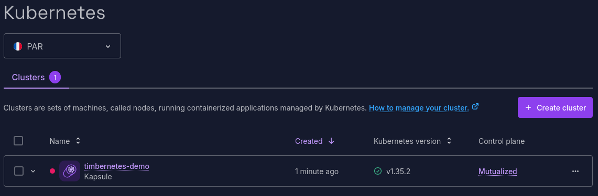
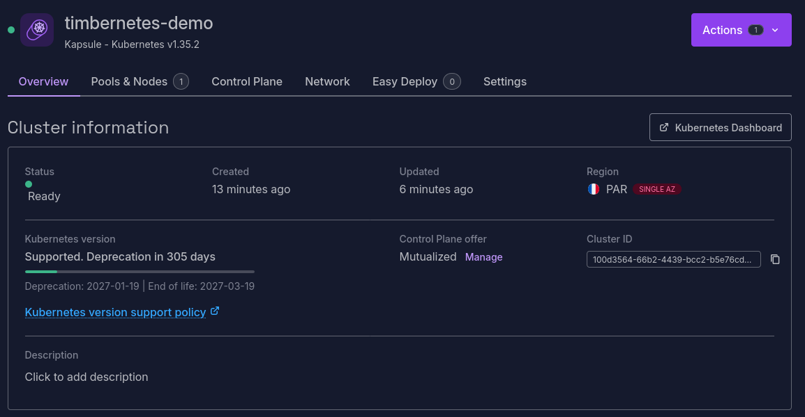
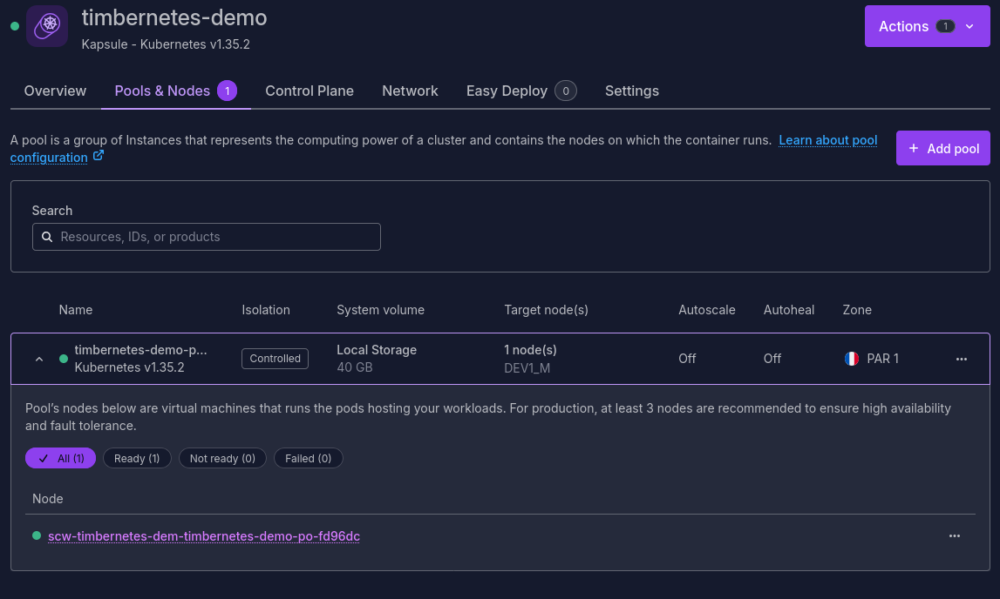
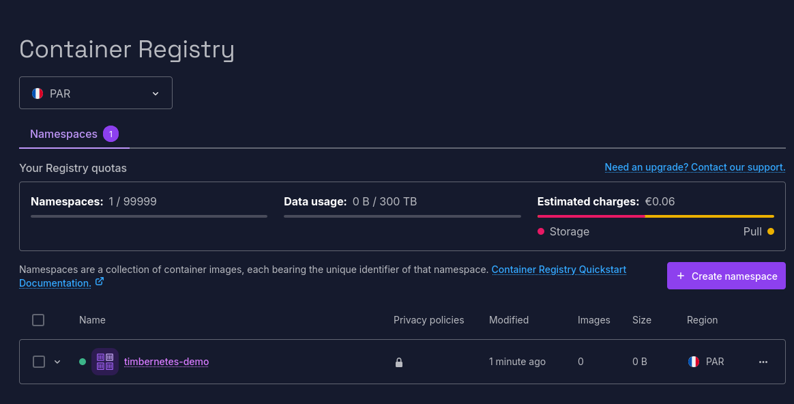
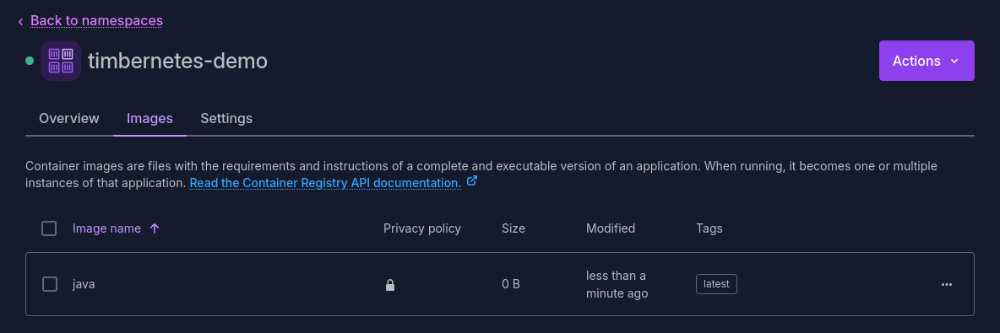
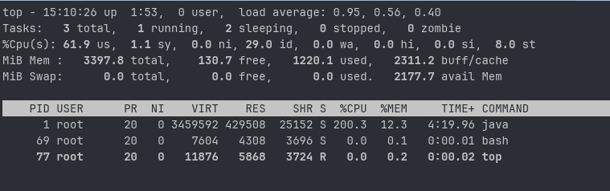

La version 1.35 de Kubernetes, nommée "Timbernetes", est sortie le 17 décembre dernier (ça passe vite !) et est déjà disponible sur toutes les bonnes plateformes de Cloud.

Une des nouveautés importantes de cette version est le passage en _Stable_ des _In-place updates of Pod resources_. Le principe de cette feature est de permettre de modifier _à chaud_, sans redémarrage donc, les ressources CPU ou RAM allouées à un _Pod_ ou à un _Container_.

Dans cet article, j'explore cette feature, en particulier pour des applications Java.

<!--more-->

## Une appli simple pour faire un bench

Pour pouvoir tester cette feature, je veux pouvoir charger un peu le CPU et la Heap d'une JVM. J'ai donc demandé à OpenCode / DevStral de me générer une petite appli qui utilise JMH pour bencher un bon vieux _fibonnaci_ :

```java
public class CPUStress {

    @Benchmark
    public void fibonacciCalculation(Blackhole blackhole) {
        for (int i = 0; i < 50; i++) {
            var result = fibonacci(i);
            blackhole.consume(result);
        }
    }

    private long fibonacci(int n) {
        if (n <= 1) return n;
        long a = 0, b = 1;
        for (int i = 2; i <= n; i++) {
            long temp = a + b;
            a = b;
            b = temp;
        }
        return b;
    }
}
```

Côté bench de RAM, on va simplement allouer des tableaux d'octets pour gonfler la RAM avec du vide, le but étant de remplir la Heap :

```java
@State(Scope.Thread)
public class MemoryStress {

    private static final int MB_TO_ALLOCATE = 50;

    private final List<byte[]> memory = new ArrayList<>();

    @Benchmark
    public void allocateMemory(Blackhole blackhole) {
        try {
            memory.add(new byte[MB_TO_ALLOCATE * 1024 * 1024]);
            blackhole.consume(memory);
        } catch (OutOfMemoryError e) {
            memory.clear();
            System.gc();
            blackhole.consume(0L);
        }
    }
}
```

J'expose aussi un petit runner que je déclenche avec une requête HTTP, pour démarrer le bench :

```java
public class BenchmarkRunner {

    String runBenchmark() throws Exception {
        File tempFile = Files.createTempFile("jmh-result", ".txt").toFile();
        try {
            Options options = new OptionsBuilder()
                    .mode(Mode.Throughput)
                    .timeUnit(TimeUnit.SECONDS)
                    .forks(0)
                    .threads(2)
                    .result(tempFile.getAbsolutePath())
                    .resultFormat(ResultFormatType.TEXT)
                    .build();

            Runner runner = new Runner(options);
            runner.run();

            return Files.readString(tempFile.toPath());
        } finally {
            tempFile.delete();
        }
    }
}
```

Le bench est lancé sans forker la JVM, ce qui va me permettre de voir quel est l'impact d'un redimensionnement de la JVM pendant son exécution.
J'ai exposé le démarrage du bench dans un endpoint HTTP `/stress/start` et la récupération des résultats dans `/stress/results`.

## Exposer quelques métriques avec Micrometer

En complément, mon appli Java va aussi exposer quelques petites métriques au format Prometheus, pour que je puisse regarder comment la JVM réagit aux différents tirs.

J'ai donc importé la dépendance _micrometer-registry-prometheus_ dans mon projet :

```xml
<dependency>
    <groupId>io.micrometer</groupId>
    <artifactId>micrometer-registry-prometheus</artifactId>
</dependency>
```

J'ai ensuite ajouté deux implémentations basiques de gauges : une première qui va exposer le nombre de CPU visibles par la JVM, et la charge constatée par l'OS :

```java
public class CPUGauges {

    public void register(MeterRegistry registry) {
        Gauge.builder("cpu.count",
                        Runtime.getRuntime()::availableProcessors)
                .register(registry);

        Gauge.builder("process.cpu.load",
                        ManagementFactory.getOperatingSystemMXBean()::getSystemLoadAverage)
                .register(registry);
    }
}
```

Pour la mémoire, j'expose la mémoire maximale visible par le runtime (qui correspond à ma taille de Heap Java), ainsi que la quantité de Heap utilisée.

```java
public class MemoryGauges {

    public void register(MeterRegistry registry) {
        Gauge.builder("jvm.memory.max.mb",
                        () -> Runtime.getRuntime().maxMemory() / (1024.0 * 1024.0))
                .register(registry);

        Gauge.builder("jvm.memory.used.mb",
                        () -> ManagementFactory.getMemoryMXBean().getHeapMemoryUsage().getUsed() / (1024.0 * 1024.0))
                .register(registry);
    }
}
```

Ces gauges sont alors exposées sur un endpoint HTTP `/metrics` :

```java
public class MetricsServer {
    
    public MetricsServer(int port) throws IOException {
        var registry = new PrometheusMeterRegistry(PrometheusConfig.DEFAULT);
        
        new CPUGauges().register(this.registry);
        new MemoryGauges().register(this.registry);

        var server = HttpServer.create(new InetSocketAddress(port), 0);
        server.createContext("/metrics", httpExchange -> {
            String response = registry.scrape();
            httpExchange.getResponseHeaders().set("Content-Type", "text/plain; version=0.0.4");
            httpExchange.sendResponseHeaders(200, response.getBytes().length);
            try (OutputStream os = httpExchange.getResponseBody()) {
                os.write(response.getBytes());
            }
        });
        server.start();
    }
}
```

Lorsque je démarre l'application sur ma machine, j'obtiens les métriques suivantes :

```http request
GET localhost:8080/metrics

cpu_count 22.0
process_cpu_load 0.4892578125
jvm_memory_max_mb 15920.0
jvm_memory_used_mb 33.128868103027344
```

J'ai packagé mon application avec un `Dockerfile` simple :

```dockerfile
FROM maven:3.9-eclipse-temurin-25 AS build
WORKDIR /app
COPY pom.xml .
COPY src ./src
RUN mvn clean package -DskipTests

FROM eclipse-temurin:25-jre
WORKDIR /app
COPY --from=build /app/target/timbernetes-demo-1.0-SNAPSHOT.jar app.jar
EXPOSE 8080
ENTRYPOINT ["java", "-XX:MinRAMPercentage=80.0", "-XX:MaxRAMPercentage=80.0", "-jar", "app.jar"]
```

Lorsque la JVM démarre, elle viendra prendre 80% de la RAM disponible pour la Heap.

En faisant un test rapide avec Docker, je peux vérifier que mes métriques sont correctes, en contraignant le nombre de CPU et la RAM visibles par le container :

```shell
docker image build -t timbernetes-demo .

docker container run --rm --cpus=2 --memory=512m -p 8080:8080 timbernetes-demo
```

```http request
GET localhost:8080/metrics

cpu_count 2.0
process_cpu_load 0.2646484375
jvm_memory_max_mb 396.375
jvm_memory_used_mb 4.075630187988281
```

## Instancier un cluster sur Scaleway

Pour pouvoir expérimenter et jouer avec ces features, j'ai choisi d'utiliser un cluster que j'instancie sur Scaleway.
Ça me permet de valider un vrai comportement de production, là où utiliser un _minikube_ ou un _kind_ en local pourrait avoir des comportements différents.

Armé de mon meilleur _CLI_, j'enchaine donc les commandes.

Je commence par lister les versions disponibles.

```bash
$ scw k8s version list
NAME     AVAILABLE CNIS                           AVAILABLE CONTAINER RUNTIMES
1.35.2   [cilium cilium_native calico kilo none]  [containerd]
1.34.5   [cilium cilium_native calico kilo none]  [containerd]
1.33.9   [cilium calico kilo none]                [containerd]
1.32.13  [cilium calico kilo none]                [containerd]
```

La version 1.35.2 est celle qui m'intéresse aujourd'hui, je vais donc pouvoir déployer un cluster avec cette version :

```bash
# création du cluster
$ scw k8s cluster create name=timbernetes-demo version=1.35.2

ID                100d3564-66b2-4439-bcc2-b5e76cd6d1fb
Type              kapsule
Name              timbernetes-demo
Status            creating
Version           1.35.2
Region            fr-par
ClusterURL        https://100d3564-66b2-4439-bcc2-b5e76cd6d1fb.api.k8s.fr-par.scw.cloud:6443
DNSWildcard       *.100d3564-66b2-4439-bcc2-b5e76cd6d1fb.nodes.k8s.fr-par.scw.cloud
CreatedAt         now
UpdatedAt         now
UpgradeAvailable  false
PrivateNetworkID  5bfa5834-48fc-41bd-8d47-5f0c1059522c
CommitmentEndsAt  now
ACLAvailable      true
IamNodesGroupID   -
PodCidr           100.64.0.0/15
ServiceCidr       10.32.0.0/20
ServiceDNSIP      10.32.0.10
```

Le cluster est créé immédiatement. Les paramètres par défaut sont suffisants pour mes tests.

Le cluster apparaît dans la console :



Une fois le cluster créé, il faut lui ajouter un _node-pool_, avec une petite machine _DEV1-M_ (3CPU et 4G de RAM) qui sera bien suffisante pour mes test :

```bash
# création du node-pool
$ scw k8s pool create cluster-id=100d3564-66b2-4439-bcc2-b5e76cd6d1fb name=timbernetes-demo-pool node-type=DEV1-M size=1

ID                8a27e395-19d7-439c-88ae-0a2d81680321
ClusterID         100d3564-66b2-4439-bcc2-b5e76cd6d1fb
CreatedAt         now
UpdatedAt         now
Name              timbernetes-demo-pool
Status            scaling
Version           1.35.2
NodeType          dev1_m
Autoscaling       false
Size              1
MinSize           0
MaxSize           1
ContainerRuntime  containerd
Autohealing       false
Zone              fr-par-1
RootVolumeType    l_ssd
RootVolumeSize    40 GB
PublicIPDisabled  false
SecurityGroupID   edf33b11-933e-473c-9f36-f86cd3da1037
Region            fr-par
```

Après quelques minutes, le cluster est dispo :





Je peux générer mon fichier `kubeconfig`, et vérifier que tout fonctionne bien :

```bash
$ scw k8s kubeconfig get 100d3564-66b2-4439-bcc2-b5e76cd6d1fb > kubeconfig.yaml

kubectl get nodes

NAME                                             STATUS   ROLES    AGE     VERSION
scw-timbernetes-dem-timbernetes-demo-po-fd96dc   Ready    <none>   1m55s   v1.35.2
```

Je vais aussi avoir besoin d'un container registry pour y stocker l'image de mon application, je le crée en une commande :

```bash
$ scw registry namespace create name=timbernetes-demo
ID              16244ac8-828b-4b5d-a15e-d7508330c3ec
Name            timbernetes-demo
Description     -  
Status          ready
StatusMessage   -
Endpoint        rg.fr-par.scw.cloud/timbernetes-demo
IsPublic        false
Size            0 B
CreatedAt       now
UpdatedAt       now
ImageCount      0
Region          fr-par
```



J'authentifie mon CLI Docker au registry avec un `docker login` :

```bash
$ docker login rg.fr-par.scw.cloud/timbernetes-demo -u nologin --password-stdin <<< "$SCW_SECRET_KEY"
```

Puis, je pousse mon image sur le registry :

```bash
$ docker tag timbernetes-demo rg.fr-par.scw.cloud/timbernetes-demo/java:latest

$ docker push rg.fr-par.scw.cloud/timbernetes-demo/java:latest
```



Tout est prêt pour pouvoir déployer l'application et lancer les tests.
 
## Déployer l'appli

Pour déployer l'application, rien de plus simple, je déploie un simple pod :

```yaml
apiVersion: v1
kind: Pod
metadata:
  name: timbernetes-demo
  labels:
    app: timbernetes-demo
spec:
  containers:
  - name: timbernetes-demo
    image: rg.fr-par.scw.cloud/timbernetes-demo/java:latest
    ports:
    - containerPort: 8080
      name: metrics
    - containerPort: 8081
      name: stress
    resources:
      limits:
        cpu: "1"
        memory: "512Mi"
      requests:
        cpu: "1"
        memory: "512Mi"
```

```bash
$ kubectl apply -f pod.yaml

pod/timbernetes-demo created
```

Je démarre avec un unique CPU et 512Mo de RAM.
Une fois le pod déployé, j'ouvre 2 ports pour pouvoir appeler les métriques, et déclencher les tests.

```bash
$ kubectl port-forward timbernetes-demo 8080:8080 8081:8081

Forwarding from 127.0.0.1:8080 -> 8080
Forwarding from [::1]:8080 -> 8080
Forwarding from 127.0.0.1:8081 -> 8081
Forwarding from [::1]:8081 -> 8081
```

Je regarde les métriques à froid :

```http request
GET localhost:8080/metrics

cpu_count 1.0
process_cpu_load 0.18505859375
jvm_memory_max_mb 396.375
jvm_memory_used_mb 4.081321716308594
```

Le CPU unique affecté au pod est bien visible, ainsi que les 512Mo de RAM, donc 80% sont alloués à la Heap (les 400Mo visibles donc).

Il est temps de lancer les tests.

## Les tests

Pour ces tests, je vais suivre le scénario suivant :

* Lancer un premier stress-test avec un dimensionnement de 1 CPU et 512Mo RAM
* Modifier la taille du pod pour le passer à 2CPU et 1Go de RAM
* Relancer un stress-test
* Remodifier la taille du pod pour revenir à 1 CPU et 512Mo de RAM
* Relancer un dernier stress-test

Je m'attends à voir le nombre de CPU modifiés, et les résultats des tests adaptés en fonction. Par contre, pour la RAM, je m'attends à ce qu'il ne se passe rien, puisque la RAM consommée par la JVM est fixée au redémarrage, allouer de la RAM supplémentaire sera donc inutile.

### Premier tir

Je démarre le premier tir avec un curl :

```http request
GET localhost:8081/stress/start

200 OK
Started benchmark
```

Pendant le premier Benchmark, CPUStress, le CPU est bien chargé, la RAM ne bouge pas :

```shell
cpu_count 1.0
process_cpu_load 0.80859375
jvm_memory_max_mb 396.375
jvm_memory_used_mb 5.6450958251953125
```

Pendant le second Benchmark, on voit que la RAM se rempli, et est nettoyée une fois pleine :

```shell
cpu_count 1.0
process_cpu_load 0.99267578125
jvm_memory_max_mb 396.375
jvm_memory_used_mb 353.49063873291016
```

Le benchmark donne les résultats suivants :

```text
Benchmark                        Mode  Cnt        Score        Error  Units
CPUStress.fibonacciCalculation  thrpt    5  1853767.056 ± 303895.231  ops/s
MemoryStress.allocateMemory     thrpt    5       44.607 ±      2.511  ops/s
```

Cela nous fait un point de départ.

### Redimensionnement du pod et deuxième tir

C'est là que ça devient rigolo.

On commence par redimensionner le pod pour qu'il prenne 2 CPU et 1Go de RAM, avec un `kubectl patch` :

```bash
$ kubectl patch pod timbernetes-demo --subresource resize --patch \
  '{"spec":{"containers":[{"name":"timbernetes-demo","resources":{"limits":{"cpu":"2","memory":"1Gi"},"requests":{"cpu":"2","memory":"1Gi"}}}]}}'

pod/timbernetes-demo patched
```

On peut lister les events du pod pour voir que le resizing est bien fait, et que le pod n'a pas été redémarré, la modification est bien faite à chaud :

```bash
& kubectl events --for pod/timbernetes-demo
LAST SEEN           TYPE      REASON              OBJECT                 MESSAGE
16m                 Normal    Scheduled           Pod/timbernetes-demo   Successfully assigned default/timbernetes-demo to scw-timbernetes-dem-timbernetes-demo-po-1b7caa
16m                 Normal    Pulling             Pod/timbernetes-demo   Pulling image "rg.fr-par.scw.cloud/timbernetes-demo/java:latest"
15m                 Normal    Pulled              Pod/timbernetes-demo   Successfully pulled image "rg.fr-par.scw.cloud/timbernetes-demo/java:latest" in 14.487s (27.916s including waiting). Image size: 109821985 bytes.
15m                 Normal    Created             Pod/timbernetes-demo   Container created
15m                 Normal    Started             Pod/timbernetes-demo   Container started
113s                Normal    ResizeStarted       Pod/timbernetes-demo   Pod resize started: {"containers":[{"name":"timbernetes-demo","resources":{"limits":{"cpu":"2","memory":"1Gi"},"requests":{"cpu":"2","memory":"1Gi"}}}],"generation":2}
112s                Normal    ResizeCompleted     Pod/timbernetes-demo   Pod resize completed: {"containers":[{"name":"timbernetes-demo","resources":{"limits":{"cpu":"2","memory":"1Gi"},"requests":{"cpu":"2","memory":"1Gi"}}}],"generation":2}
```

Les deux dernières lignes font bien état de la modification.

Quand je requête à nouveau le endpoint `/metrics`, j'obtiens alors la réponse suivante :

```http request
GET localhost:8080/metrics

cpu_count 2.0
process_cpu_load 0.04296875
jvm_memory_max_mb 396.375
jvm_memory_used_mb 362.24312591552734
```

On observe que le nombre de CPU visibles par le JVM a changé, c'est une bonne nouvelle.
Par contre, comme on l'attendait, la Heap maximale que peut consommer la JVM n'a pas changé. La Heap est configurée au démarrage de la JVM et n'est donc pas redimensionnée à chaud, même si le pod a plus de RAM disponible.

Une fois le stress test lancé, on observe les métriques suivantes :

```http request
GET localhost:8080/metrics

cpu_count 2.0
process_cpu_load 1.90654296875
jvm_memory_max_mb 396.375
jvm_memory_used_mb 355.3716583251953
```

Un `top` dans le container permet de confirmer ce qu'on voit avec la métrique, le process utilise 200% de CPU, les 2 coeurs sont bien exploités par la JVM.


### Redimensionnement et dernier tir

Pour compléter les tests, je redimensionne à nouveau le pod, cette fois-ci avec des valeurs à la baisse, pour revenir aux valeurs initiales : 

```bash
kubectl patch pod timbernetes-demo --subresource resize --patch \
  '{"spec":{"containers":[{"name":"timbernetes-demo","resources":{"limits":{"cpu":"1","memory":"512Mi"},"requests":{"cpu":"1","memory":"512Mi"}}}]}}'
  
pod/timbernetes-demo patched
```

Les évènements sur le pod affichent bien que le resizing a été exécuté :

```bash
kubectl events --for pod/timbernetes-demo
LAST SEEN   TYPE     REASON            OBJECT                 MESSAGE
53s         Normal   ResizeStarted     Pod/timbernetes-demo   Pod resize started: {"containers":[{"name":"timbernetes-demo","resources":{"limits":{"cpu":"1","memory":"512Mi"},"requests":{"cpu":"1","memory":"512Mi"}}}],"generation":3}
52s         Normal   ResizeCompleted   Pod/timbernetes-demo   Pod resize completed: {"containers":[{"name":"timbernetes-demo","resources":{"limits":{"cpu":"1","memory":"512Mi"},"requests":{"cpu":"1","memory":"512Mi"}}}],"generation":3}
```

La métrique affiche de nouveau 1 CPU disponible, aucun changement au niveau de la RAM comme attendu :

```http request
GET localhost:8080/metrics

cpu_count 1.0
process_cpu_load 0.03466796875
jvm_memory_max_mb 396.375
jvm_memory_used_mb 206.46312713623047
```

Pas de surprise non plus sur ce redimensionnement qui est aussi effectué à chaud.

Enfin, pour observer ce qu'il se passerai avec un redimensionnement sur une RAM déjà consommé, j'opère un redimensionnement à une valeur de RAM inférieure à celle que consomme déjà le pod.
Je dois m'attendre à un OOMKill, puis un redémarrage du pod, qui reprendra donc un taille de Heap à 80% de la RAM disponible, vu que ce dimensionnement est fait au démarrage de la JVM.

```bash
$ kubectl patch pod timbernetes-demo --subresource resize --patch   '{"spec":{"containers":[{"name":"timbernetes-demo","resources":{"limits":{"cpu":"1","memory":"128Mi"},"requests":{"cpu":"1","memory":"128Mi"}}}]}}'
pod/timbernetes-demo patched
```

Cette fois-ci, lorsque je regarde les évènements du pod, j'observe une erreur : 

```bash
$ kubectl events --for pod/timbernetes-demo
32s         Normal    ResizeStarted     Pod/timbernetes-demo   Pod resize started: {"containers":[{"name":"timbernetes-demo","resources":{"limits":{"cpu":"1","memory":"128Mi"},"requests":{"cpu":"1","memory":"128Mi"}}}],"generation":5}
32s         Warning   ResizeError       Pod/timbernetes-demo   Pod resize error: {"containers":[{"name":"timbernetes-demo","resources":{"limits":{"cpu":"1","memory":"128Mi"},"requests":{"cpu":"1","memory":"128Mi"}}}],"generation":5,"error":"cannot decrease memory limits: [attempting to set pod memory limit (134217728) below current usage (418054144), attempting to set container \"timbernetes-demo\" memory limit (134217728) below current usage (418054144)]"}
```

Kubernetes refuse de redimensionner le pod à chaud, car la RAM consommée est supérieure à la nouvelle taille de RAM, ce qui est cohérent.

## Conclusion

Le redimensionnement des ressources à chaud fonctionne à merveille, et le comportement de la JVM est bien celui auquel on s'attendait : le nombre de CPU est détecté dynamiquement, et les threads schedulés par la JVM peuvent exploiter pleinement les coeurs ajoutés.

Concernant la RAM, étant donné que la JVM fix sa quantité de Heap au démarrage, et que cette valeur ne peut pas être ajustée au runtime, modifier la RAM allouée à un pod Java n'a aucun effet.

Des [drafts de JEP](https://openjdk.org/jeps/8359211) proposent que les différents _Garbage Collector_ (G1, ZGC et Serial) soient modifiés pour pouvoir ajuster à chaud la taille de la Heap en fonction de l'environnement dans lequel s'exécute la JVM. Ces évolutions permettraient donc à terme de pouvoir bénéficier pleinement de cette feature de Kubernetes.

Les VPA (_Vertical Pod Autoscaler_) ont également un nouveau mode appelé `InPlaceOrRecreate` qui permet de redimensionner les pods sans les redémarrer, et de forer une recréation si le redimensionnement n'est pas possible. Cette fonctionnalité rend maintenant l'utilisation des VPA pertinentes pour des applications Java. On peut imaginer qu'un pod verrai son nombre de CPU ajusté à chaud, plutôt que de faire de la scalabilité horizontale.

Il faut cependant limiter cet usage à au CPU, et utiliser un VPA est toujours incompatible avec un HPA, donc l'intérêt reste encore un peu limité.

Voici un exemple de VPA pour une application Java :

```yaml
apiVersion: autoscaling.k8s.io/v1
kind: VerticalPodAutoscaler
metadata:
  name: timbernetes-demo-vpa
spec:
  targetRef:
    apiVersion: "apps/v1"
    kind: Deployment
    name: timbernetes-demo
  updatePolicy:
    updateMode: "InPlaceOrRecreate"
  resourcePolicy:
    containerPolicies:
    - containerName: "timbernetes-demo"
      minAllowed:
        cpu: 100m
      maxAllowed:
        cpu: 2
      controlledResources:
      - cpu
      controlledValues: RequestsAndLimits
```

## Liens et références

Kubernetes :
* [Release](https://kubernetes.io/blog/2025/12/17/kubernetes-v1-35-release/) note de Kubernetes 1.35 : Timbernetes
* La [KEP #1287](https://github.com/kubernetes/enhancements/tree/master/keps/sig-node/1287-in-place-update-pod-resources) In-Place Update of Pod Resources
* L'article de blog pour promouvoir la feature : [Kubernetes 1.35: In-Place Pod Resize Graduates to Stable](https://kubernetes.io/blog/2025/12/19/kubernetes-v1-35-in-place-pod-resize-ga/)
* La page de documentation [Resize CPU and Memory Resources assigned to Containers](https://kubernetes.io/docs/tasks/configure-pod-container/resize-container-resources/)
* La page de documentation [Resize CPU and Memory Resources assigned to Pods](https://kubernetes.io/docs/tasks/configure-pod-container/resize-pod-resources/)
Scaleway :
* La documentation Scaleway : [Kapsule & Kosmos release calendar](https://www.scaleway.com/en/docs/kubernetes/reference-content/version-support-policy/#scaleway-kubernetes-kapsule--kosmos-release-calendar)
* La documentation du CLI Scaleway : [Creating and managing a Kubernetes Kapsule with CLI (v2)](https://www.scaleway.com/en/docs/kubernetes/api-cli/creating-managing-kubernetes-lifecycle-cliv2/)
* [Scaleway Instances datasheet](https://www.scaleway.com/en/docs/instances/reference-content/instances-datasheet/)
JMH :
* Le tuto de Baeldung [Microbenchmarking with Java](https://www.baeldung.com/java-microbenchmark-harness)
Java :
* [JEP draft: Automatic Heap Sizing for G1](https://openjdk.org/jeps/8359211)
* [JEP draft: Automatic Heap Sizing for ZGC](https://openjdk.org/jeps/8377305)
* [JEP draft: Automatic Heap Sizing for the Serial Garbage Collector](https://openjdk.org/jeps/8350152)