Cette année encore (comme les deux années précédentes), j'étais présent à Devoxx France.

Cette fois-ci, pas de talk pour moi, j'étais donc en "simple visite", ce qui enlève un élément de stress (ce n'est pas plus mal non plus).

J'ai donc bien profité des trois jours, entre les différents talks, les discussions animées, les rencontres inattendues.
Je vous raconte tout ça.

<!--more-->

## Mercredi

Je suis arrivé mercredi matin, vers 9h. Après avoir déposé mes affaires au vestiaire, et avec les keynotes déjà en cours, j'en ai profité pour faire un tour rapide dans le hall des exposants, et pour retrouver mon associé Romain et mes collègues techs de chez Ekité (au nombre de six) qui étaient là uniquement pour la journée du mercredi.
On s'est vite séparés pour aller ensuite voir les sujets qui nous intéressaient, mais on a pu se recroiser tout au long de la journée et faire une petite photo de groupe dans la soirée.

J'ai aussi passé beaucoup de temps à discuter sur les stands (surtout Clever Cloud 💙) et avec les personnées croisées dans les couloirs, je suis aussi parti un peu tôt pour pouvoir déposer mes affaires à l'hôtel et retrouver un pote sur Paris. Donc, je n'ai pas vu beaucoup de talks ce mercredi.

### G1, ZGC, Shenandoah, ... avec tous ces GCs dans Java, je choisis lequel ? - Antoine Dessaigne

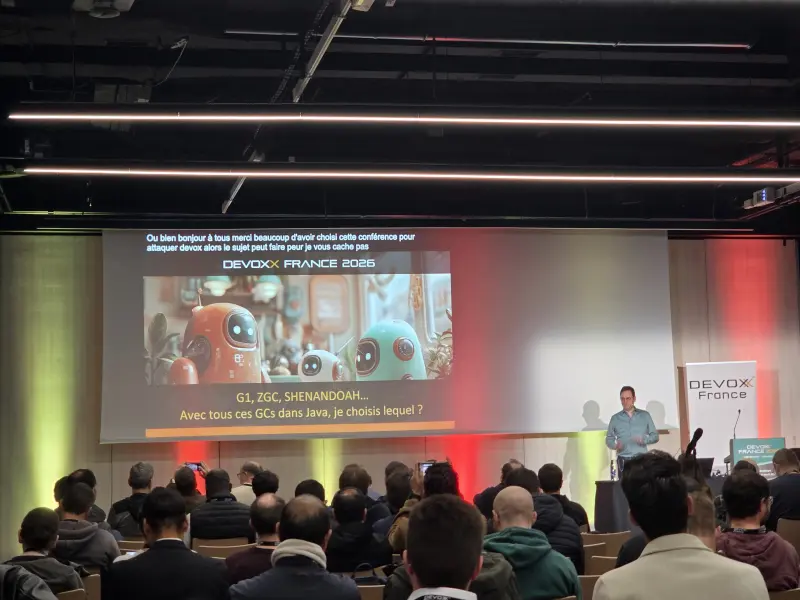

Vu la file d'attente au niveau de l'amphi bleu pour aller assister au talk de Julien Topçu et Josian Chevalier, je me suis donc rabattu sur le talk d'Antoine Dessaigne, qui nous a expliqué l'histoire et le fonctionnement des GC en Java, et nous a donné des pistes pour nous aider au choix.

J'avais déjà vu une version vidéo de ce talk, Antoine m'avait démandé mon avis et je lui avais partagé les choses que j'avais aimées, et je lui avais donné quelques axes d'amélioration (en toute simplicité).
Je trouve qu'il a bien amélioré le talk, qui est très fluide, et aussi très visuel.
Les collègues que j'ai emmenés avec moi sur ce talk ont eu l'air d'apprécier aussi l'aspect pédagogique.

Antoine nous a donc présenté le fonctionnement de la mémoire en Java, les différents GC, et quelques points importants pour nous aider à choisir.

Le GC Epsilon m'a bien plu, et a surpris l'audience : il ne fait pas de garbage collection, uniquement de l'allocation de mémoire. Il faut que je pense à l'utiliser dans mes CLI.

### TamboUI : making 2026 the Year of Java in the Terminal - Cédric Champeau - Max Rydahl Andersen

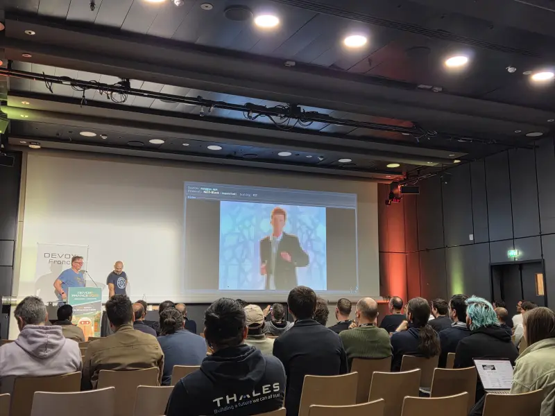

Plus tard, j'ai assisté à la présentation de Tamboui.
Je suis allé voir ce talk puisque j'en prépare un sur les environnements shell pour une future conférence. C'était l'occasion de voir dans quelle mesure je pourrai me servir de cette librairie pour me coder un petit outil si jamais j'en ai le besoin.
Le talk était en anglais, j'ai eu un peu de mal à suivre certaines parties, mais au global, c'était plutôt impressionnant.

L'outil est complet, et propose des widgets et composants utilisables directement.
La bonne surprise est le modèle de programmation, qui propose aussi bien de travailler très bas niveau (rendu des "cellules" du shell), ou très haut niveau (composant).
Il est possible d'afficher des images en haute résolution, des vidéos et d'intéragir avec la souris assez facilement, c'est bluffant.

Chose intéressante, le facteur limitant de performances n'est pas Java, mais les I/O que peut accepter le shell. C'est clairement overkill de rafraichir le shell à 60 ou 120 FPS, mais c'est possible.

### HTTP/3 : 37 ans d’histoire du protocole HTTP - Chris Navas

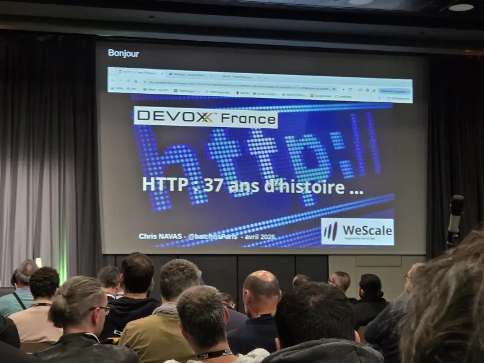

Retour sur l'histoire du protocole HTTP, et de ses évolutions récentes, HTTP/2 (qui date déjà de 2014) et HTTP/3 qui date de 2022.

Alors que HTTP 1.1 et 2 reposaient sur TCP, HTTP/3 reposent sur UDP.
La promesse est une meilleure utilisation du multiplexage, pour transmettre plusieurs documents en parallèle, sans avoir le phénomène de head-of-line blocking lié à TCP et des packets perdus.

Le speaker parle aussi de l'établissement d'une connexion sécurisée immédiate, sans "round-trip" : QUIC comporte une espèce de cache TLS, qui permet d'envoyer immédiatement un paquet de données si on a déjà effectué une connexion au serveur.

Le taux d'adoption de HTTP/3 est déjà important (près de 20% si ma mémoire est bonne).
Mais on voit que ce sont les adopteurs de HTTP/2 qui ont basculé en version 3 surtout.

Le fait que HTTP/3 est supporté par les CDN principaux (des clouds US) doit aider.
Attention cependant, le speaker rappelle que les CDN "coupent" le traffic HTTP/3 et que le traffic interne reste souvent en HTTP/1. L'intérêt est donc plus faible.

## Jeudi

Jeudi, je suis arrivé vers 8h30, et j'ai pu entrer dans l'amphi bleu (parmi les derniers, merci Fanny) pour assister aux deux keynotes.

Comme c'était mon premier passage dans l'amphi bleu, c'était aussi ma première découverte des vidéos d'introduction étendues pour cet amphi. Les "publicités" refaites avec les mascottes robotiques de cette édition ont l'air de bien avoir amusé l'amphi.

### Keynote - Le développeur face à l'IA : du prototypage rapide à la fin des intermédiaires ? - Nicolas Grenié

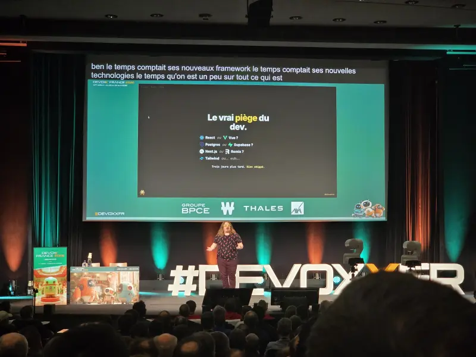

La première Keynote parlait du _vibe coding_. Le speaker m'a _trigger_ quand il a dit qu'un dev perdait son temps à choisir sa stack (je n'aime pas l'idée de déléguer un choix avec ses conséquences à une IA), on comprend plus tard que l'usage qu'il prône est surtout autour du prototypage.

Je retiens surtout la question d'une personne du public : "On a chiffré 500 jours, et le POC vibe codé a été fait en 5, comment on fait pour justifier les 495 jours d'écart ?". La réponse du speaker : "Tes 495 jours servent à réécrire la merde qui a été générée par l'IA".

La conclusion semble bien être que l'IA est cantonnée aux POCs et aux projets persos dans cette vision.

### Keynote - L’IA sur le terrain : l’humain au cœur de la valeur - Marjory Canonne

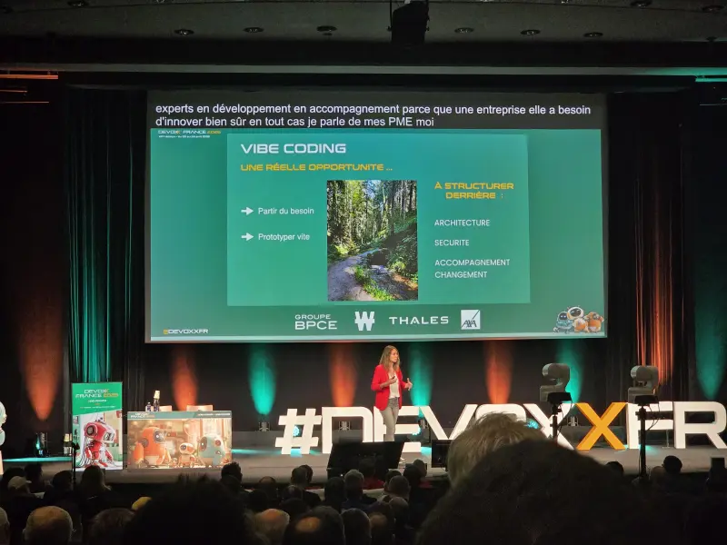

La deuxième keynote sentait bon le sapin (dans le bon sens). La speakeuse nous a également parlé du vibe coding et des opportunités d'expérimentation que ça apporte, en insistant aussi sur les étapes qui suivent, architecture, sécurité.
 
Le message le plus important de cette keynote est de repartir des besoins réels, et pas de la techno. L'IA n'est pas une fin en soi.
 
### Julien - Rabatteur de speakers

Cette année, mon associé Romain avait un badge "Presse" offert par les orgas de Devoxx, et enregistrait ses podcasts au niveau de la zone speaker. Pour lui filer un coup de main, j'ai proposé aux speakers que je croisais de passer le voir pour se faire interviewer. Merci à celles et ceux qui ont bien voulu se prêter à l'exercice.

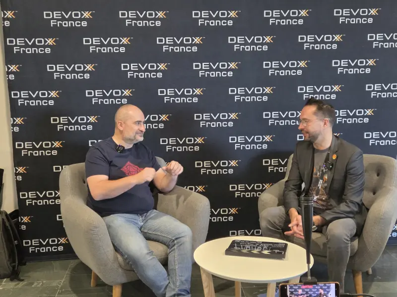

J'en ai profité pour assister à l'interview d'Olivier Poncet, que je croise avec plaisir à chaque conférence (il est décidément partout). J'ai trouvé intéressante la discussion entre Olivier et Romain, principalement parce que j'ai découvert qu'Olivier s'organisait d'une manière similaire à la mienne : il a sanctuarisé un job au 4/5ème pour pouvoir travailler sur ses confs, ses vidéos, et les cours qu'il donne.

### Bye bye Vendor Lock-in : Standardisez vos Feature Flags avec OpenFeature - Thomas Poignant

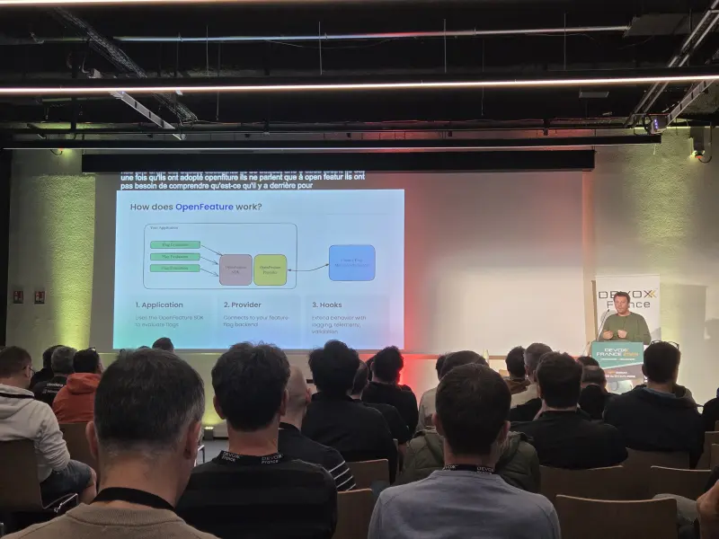

Bien que je connaissais déjà OpenFeature (je l'ai découvert il y a environ 2 ans), je voulais voir ce talk pour voir comment le projet avait avancé.

OpenFeature est maintenant en phase Incubating à la CNCF, ce qui montre une belle maturité. Les providers disponibles sont nombreux, et j'apprends aussi qu'un provider a décidé de ne pas développer son propre SDK mais uniquement un provider OpenFeature, ce qui est un excellent signal pour ce projet.
J'ai aussi découvert l'intégration avec OpenTelemetry et les hooks, qui ont l'air plutôt pratiques.

Une question reste en suspens pour moi, mon voisin de gauche (il se reconnaitra) a tendance à utiliser les features flags avec un contexte attaché pour implémenter du RBAC, bonne idée ou pas ? On ne le saura peut-être jamais 😅

### Silence is Coming: Survivre au chaos dans une archi événementielle distribuée - Jounad Tourvieille - Flora Njofang

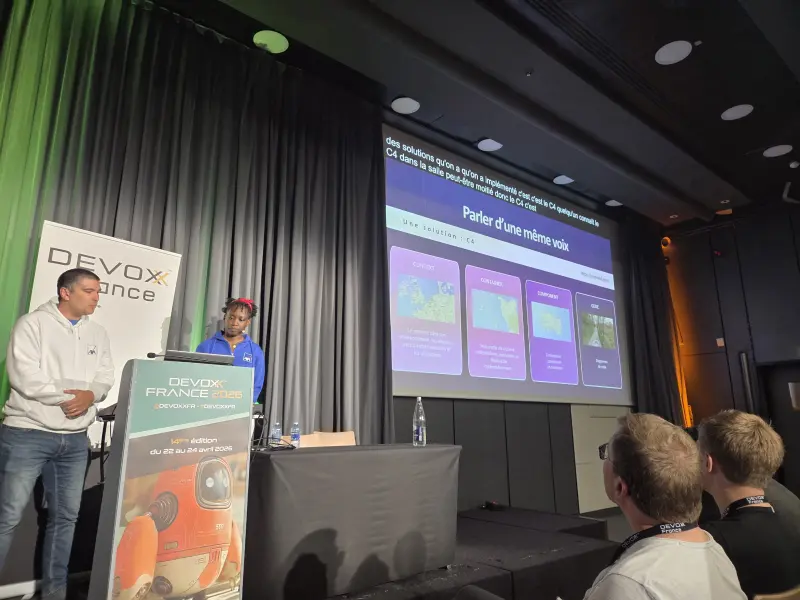

Je suis passé voir ce talk pour soutienir Flora, qui avait participé au tremplin des speakers organisé par Cloud Nord et DevLille l'année dernière. C'était donc l'occasion d'aller l'encourager.

Ici, le sujet n'est pas technique. Ce REX parle de communication. L'outil proposé pour répondre aux enjeux de la synchronisation des équipes est C4 Model. Les différents niveaux de représentation s'adressent à des profils différents, et les utiliser permet d'avoir une vision partagée.
Je connaissais déjà les approches "as-code" de C4 avec PlantUML et Structurizr. Pas de surprise sur les outils, mais des bonnes idées organisationnelles surtout.

Parmi les bonnes idées que je retiens : poser une gouvernance claire sur la responsabilité de la mise à jour des schémas : les architectes responsables du niveau C1, les tech leads C2 et C3, les devs le niveau C4 ; partager les modèles et schémas dans un repo unique à l'entreprise ; et construire une arborescence de fichiers en miroir à l'organisation de l'entreprise pour mieux s'y retrouver.

### Se retourner la tête avec les quiz Java de José et Jean-Michel - José Paumard - Jean-Michel Doudoux

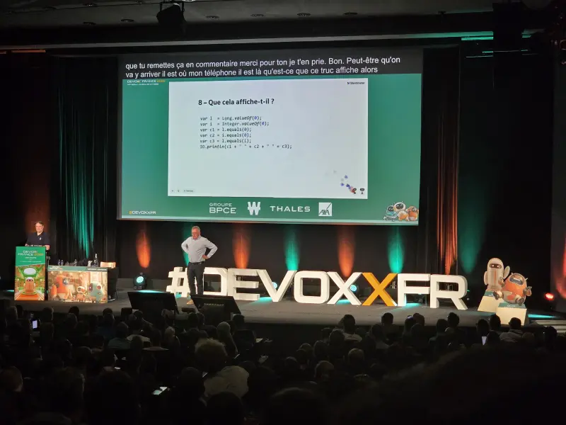

Probablement un des talks que j'ai préféré sur ces 3 jours.

Dans un format hyper original, Jean-Michel Doudoux (qu'on ne présente plus), nous pose quelques-unes de ses questions de QCM, toujours pleines de subtilités et de petits pièges sur mon langage pref : Java.
Le public est invité à y répondre avec son smartphone (750 participants en live !). Et José se prête également à l'exercice sur scène.

Il était amusant de voir José découvrir les questions, et formuler sa réponse. En parallèle, le public discute, entre voisins, on se dit "je pense que c'est la B, tu dis quoi ? Attends, là ça compile pas ce code ?". L'amphi bleu était bien vivant sur cette session.

Il était aussi amusant de voir José tomber dans certains pièges (et emmener le public avec lui). Couplé aux explications de Jean-Michel, avec l'exécution du code, c'était un quiz très dynamique. Un format qui devrait replaire à l'avenir.

### Jujutsu, la cerise sur le git, oh ! - Siegfried Ehret

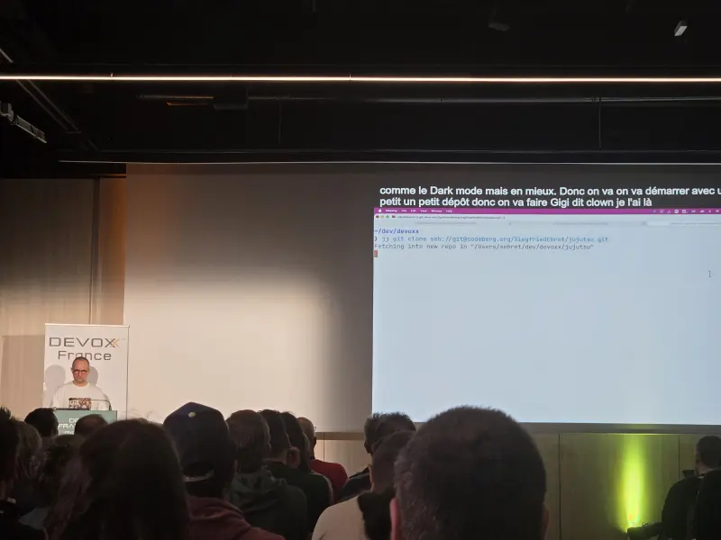

Tout en démo, Siegfried nous présente l'utilisation de Jujutsu (`jj`) sur un projet exemple. Les premières commandes sont simples, la gestion du rebase est bluffante, la compatibilité avec Git permet d'utiliser JJ en co-localisation avec Git, ce qui est aussi intéressant.

La conclusion de Seigfried m'a fait sourire : ne demandez pas à votre manager si vous pouvez installer JJ, vu que ça marche avec Git, ça ne pose pas de problème.

À tester.

### Mise : un multi-outil pour votre poste de Dev & Ops  - Rémi Verchère

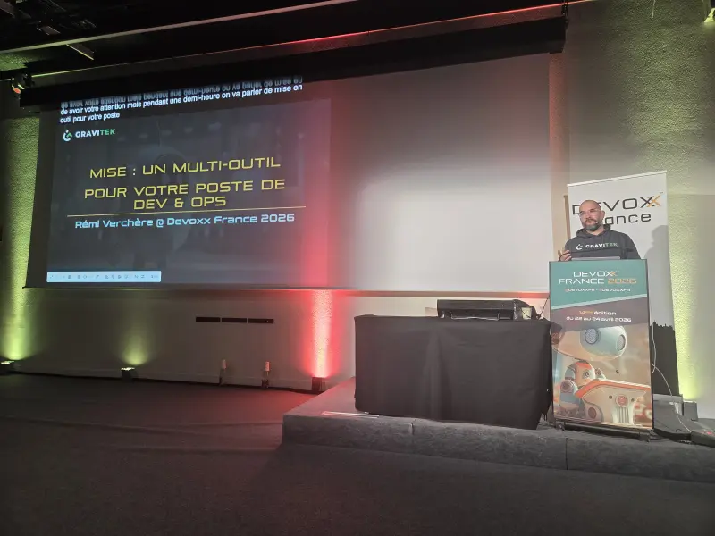

Suite à [mon article sur l'outil `mise`](/posts/2025/2025-12-19-mise-en-place/), j'avais un peu échangé avec Rémi sur cet outil que j'utilise au quotidien et qu'il utilisait déjà un peu.
Dans nos discussions, il m'avait aussi notifié qu'il soumettait cette conf, et m'avait envoyé ses slides en avant-première, pour me partager ce qu'il allait présenter.

Il est allé vraiment loin, tout y passe (ou presque) : les outils, les variables d'environnement, les tasks, l'intégration avec fnox. C'était très dense pour un talk de 30 minutes !

Cas intéressant, il nous explique aussi comment utiliser `mise` dans une CI pour unifier le tooling, comment sécuriser la récupération des tools avec le mode "paranoid". Il nous a aussi présenté son usage autour du switch de contexte k8s pour ses différents environnements avec des hooks.

Je pensais connaitre le sujet, j'ai quand même appris des trucs.
Rémi a aussi cité mon article dans les ressources intéressantes sur le sujet. C'est pas bon pour mes chevilles ça 😅

### La soirée au calme

C'était une journée assez chargée somme-toute. Je me suis eclipsé après le talk de Rémi pour aller partager un verre avec Romain, et débriefer de sa journée d'enregistrements, en me disant que j'allais peut-être repasser à la soirée ensuite.

Mais ma fatigue en a décidé autrement.

## Vendredi

Dernier jour, la fatigue s'accumule, les jambes commencent aussi à peser. J'ai décidé pour ne pas m'épuiser d'alléger ma journée, et d'aller voir uniquement les quelques talks que je ne voulais pas manquer. Je devais aussi passer sur certains stands, pour avoir des discussions plus poussées sur certains produits que je veux tester.

Mon train retour était prévu à 17h45, j'avais déjà renoncé, en prenant mon billet retour, aux derniers tools-in-action de la journée.
Je sais que j'aurai des talks à aller voir en vidéo pour compléter mon Devoxx.

J'avais aussi les yeux très fatigués (c'est encore le cas), vous m'avez probablement vu avec mes lunettes teintées toute la journée.

### Les Value Types ne sont pas ℂomplexes - Clément de Tastes - Rémi Forax

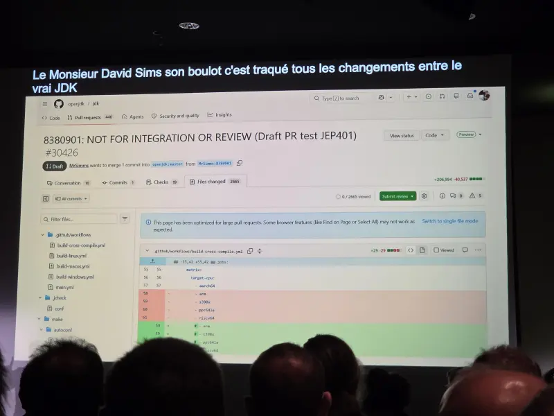

On commence par une présentation des algorithmes de Mandelbrot, qui produit les fractales qui sont toujours impressionnantes.
Une formule mathématique, s'appuyant sur des nombres complexes (`i²=-1`) est implémentée avec des `records`. Et là, les performances s'effondrent (x15).

Les value types, portées par le projet Valhalla depuis maintenant plusieurs années (2014 !), permettent de déclarer des classes sans identité (sans pointeur) et sont directement stockées "à plat" sur la stack ou la heap.
Les optimisations de performance sont alors folles : le CPU peut charger directement les valeurs depuis la stack, sans passer de temps à résoudre des adresses mémoire.
Une contrainte est alors ajoutée : l'immutabilité des champs (je ne suis pas certain d'en avoir compris la raison).
Quelques exemples de code ont été partagés, et les performances semblent au rendez-vous.

L'implémentation du nouveau mot-clé `value` est uniquement portée par la JVM et pas par le compilateur. 

Le talk se conclut rapidement (ils étaient un peu juste sur le timing _a priori_), en évoquant une fonctionnalité aussi attendue poussée par Valhalla : la possibilité de déclarer un type null-restricted avec le marqueur bang _!_.
Cette fonctionnalité permet à Valhalla d'éviter de devoir gérer un bit marqueur pour indiquer qu'un champ d'un value type est ` null`, autrement cette obligation a un impact sur la mémoire consommée et sur l'efficacité de la récupération des valeurs (entre la RAM et le CPU).

On voit aussi un screenshot de la PR du projet : +206,994 -40,537, sur un unique commit (probablement squashé), la PR des enfers, qui montre l'impact de la fonctionnalité sur le code de la JVM.

Une inquiétude de mon côté, que ce mot clé ne soit pas bien compris (qui connait _volatile_ ?), et qu'il soit mis  systématiquement sur toutes les classes sans comprendre les impacts (dont je ne suis pas certain d'avoir tous compris moi-même).

### Et si écrire du SQL redevenait cool ? - Sebastien Ferrer

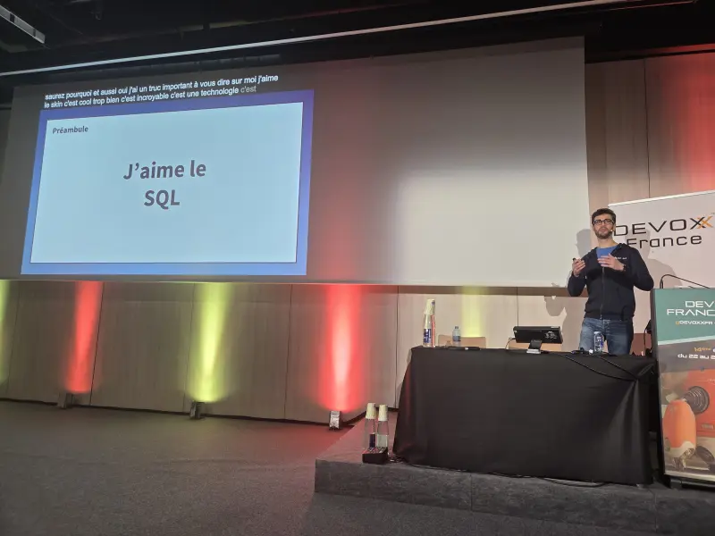

Je suis passé voir ce lunch talk en soutien au pote Sébastien. 

Il nous a alors répété plusieurs fois "J'aime le SQL" (oui Sébastien, tu nous l'avais déjà dit ahah).

Il nous explique alors les avantages et inconvénients d'utiliser un ORM, et nous présente une alternative originale : `sqlc`.

`sqlc` est un CLI qui prend des fichiers `.sql` (schémas, migrations, requêtes), pour générer du code dans le langage de notre choix (Sébastien a illustré avec du Go). Les accès à la base de données sont donc SQL-first, ce qui est intéressant pour s'assurer de la bonne maitrise des requêtes jouées. Le typage des différentes structures et fonctions générées par l'outil, à partir du schéma et des champs des requêtes est aussi intéressant : on sait à la compilation que le code correspondra bien au schéma.

Point négatif, les requêtes dynamiques ne peuvent pas être supportées.

J'ai bien envie d'aller regarder comment l'outil génère du code en Java.

### Kubernetes et la JVM - Alain Regnier - Jean Michel Doudoux

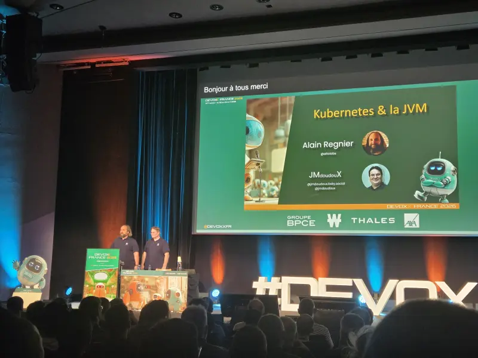

Alain nous présente certains concepts de Kubernetes, de mon point de vue plutôt classiques, principalement les request/limits et les probes. Jean Michel revient ensuite sur le fonctionnement de la JVM et nous explique les impacts de ces concepts k8s sur la JVM.

Les parties les plus intéressantes : les ergonomics de la JVM, qui décident au démarrage d'un certain nombre de paramètres, comme le GC sélectionné, la taille de la Heap, et le nombre de threads alloués au ForkJoinPool et aux carrier threads des threads virtuels.

Les précos sont celles auxquelles je m'attendais : allouer 75% de la RAM dispo à la heap avec MaxRamPercentage (et augmenter cette valeur avec la taille de la RAM). Faire attention au choix du GC, et faire attention au throttle de CPU, qui a tendance à détruire les performances de la JVM.

Je portais un discours similaire il y a déjà quelques années avec [mon BBL sur Spring Boot, Docker et Kubernetes](/talks/bbl-spring-boot-and-containers-dos-donts/).

Il nous rappelle aussi que la compilation native n'est pas magique, puisque les optimisations C2 ne sont jamais faites, donc un binaire natif peut être moins performant qu'une JVM sur la durée. Même combat pour les AOT cache ou CRAC, qui ne marchent pas dans tous les cas.

J'ai par contre découvert que la JVM pouvait logger les ergonomics à son démarrage, ce qui est bien pratique.

### Éloge de la simplicité - Frédéric Leguédois

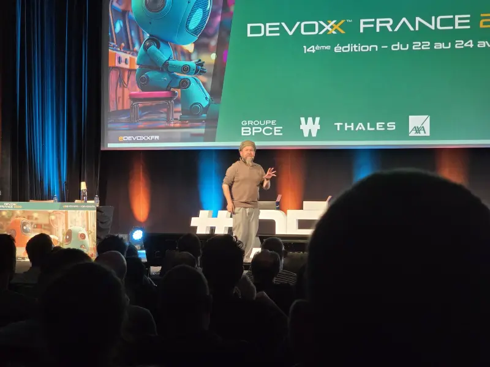

Dans un one-man-show dont il a le secret, Frédéric nous propose de réfléchir à l'agilité telle qu'elle est pratiquée en entreprise.

Des outils qu'on n'aime pas, mais qu'on conserve par souci d'unification, des plannings inutiles, des calculs de ROI farfelus.
Chercher à prédire le futur avec un planning est inutile, mais on continue de le faire, de synchroniser des plannings.
Tout ça est du temps perdu.

L'analogie avec le fonctionnement des urgences, qu'il illustre avec 2 boites à chaussures, est révélatrice : dans un hôpital, l'inconnu est partout (arrivée de patients, dégradation de leur état de santé dans la salle d'attente, durée de la consultation dans les box), et le système tient avec des règles de tri et de priorisation simples.
Tout ça, sans l'ombre d'un Scrum Master ni d'un planning.

Mais nous, IT, faisons des plannings et réunions, pour paraître sérieux. Ce qui nous ralentit, et ne permet pas d'aider nos utilisateurs. Notre planning ne les intéresse pas, puisque par définition, c'est un mensonge, au mieux une prédiction à laquelle on pourra appliquer un facteur 2 (une bonne estimation donc), ou un facteur 10 (une estimation normale). 

Un bon retour aux sources, un de mes talks préférés de cette édition.
Le public de l'amphi bleu a apprécié, et beaucoup ri aux situations mises en avant.

C'était très théâtral également. Une belle perf d'orateur, avec une occupation de toute la scène, des temps de pause, de la répétition. Ce talk est aussi très inspirant sur cet aspect technique.

## Retour à Lille

À la sortie de ce talk, je me suis dirigé vers le vestiaire pour récupérer mes affaires et me mettre en route transquillement.
Puis je suis parti, avec une petite heure de marge sur l'heure de mon train pour être safe.

Pour moi, cette édition de Devoxx était "pépouze" comme je l'ai dit plusieurs fois. Ne pas avoir de talk enlève quand même beaucoup de stress, j'ai pu pas mal profiter des talks et des discussions avec tout celles et ceux que j'ai eu la chance de croiser. 

J'ai gardé de côté quelques talks que j'ai zappé (fatigue, discussion, ou conflit de créneau), je regarderai les vidéos lors de leur sortie (en général, elles sont publiées rapidement, souvent début mai), et je les partagerai au fil de l'eau avec ma veille habituelle.

Ça reste quand même des journées intenses et fatiguantes, aussi bien physiquement : on marche beaucoup, on reste souvent debout à discuter aussi ; que mentalement : on ingère beaucoup de connaissances dans un temps très réduit sur des thèmes très différents.

Les salariés de Ekité étaient présents uniquement le mercredi, mais j'ai l'impression qu'ils ont passé une bonne journée également. Romain avait aussi l'air content de ses enregistrements de podcasts et de ses rencontres.

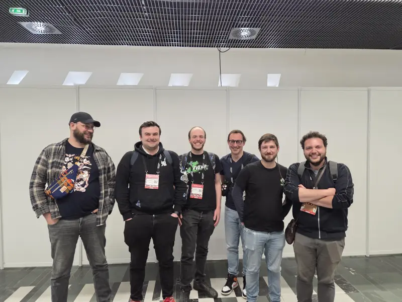

Bisous aux personnes que j'ai croisé (sans ordre particulier) : Loïc, Olivier, Fanny, Sébastien, Julien (x3), Renaud, Matthieu, Nicolas (x2), Horacio, Jérôme, Denis, Quentin, Stéphane, Guillaume (x2), David, François (x2), Flora, Rémi, Estelle, Aurélie, Laurent, Nathan, et probablement plein d'autres que j'ai juste salué d'un coucou de loin ou d'une tape sur l'épaule.

Merci aux orgas, merci aux polos rouges (vous êtes toutes et tous géniaux). Merci aux sponsors. Bravo aux speakeuses et speakers.
C'était une belle édition.

Vivement l'année prochaine (pour [jouer à Factorio](/talks/talk-lets-play-factorio/) dans l'amphi bleu ?).