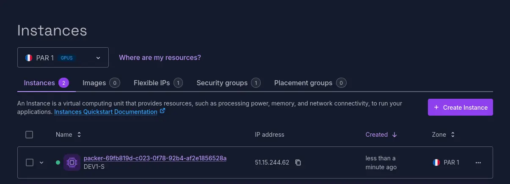
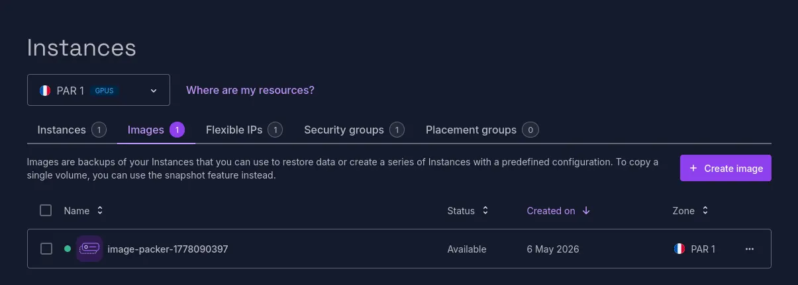

Pour mes expérimentations sur Tangled, je souhaitais tester l'auto-hébergement des _knot_ et _spindles_ dans des machines virtuelles (les explications arrivent dans un futur article).

C'était donc l'occasion de rejouer un peu sur Scaleway, et avec _Packer_.

<!--more-->

Cet article n'a pas pour but d'expliquer comment fonctionne _Packer_, mais plutôt comment l'utiliser pour créer des Golden Images sur Scaleway.
Si vous avez besoin d'un tuto, allez voir l'[excellente formation de Stéphane Robert](https://blog.stephane-robert.info/docs/infra-as-code/provisionnement/packer/). 

## Installation et configuration de Packer

`mise use packer` et c'est parti !

Il existe d'[autres moyens d'installer Packer](https://developer.hashicorp.com/packer/install), mais étant donné que mon outil préf du moment sait l'installer, je ne vois pas pourquoi j'irai me compliquer la vie 😅

La configuration de [Packer pour Scaleway](https://developer.hashicorp.com/packer/integrations/scaleway/scaleway) se fait avec un premier bloc `packer`, dans un fichier que j'appelle `packer.pkr.hcl` :

```hcl
packer {
  required_plugins {
    scaleway = {
      version = ">= 1.4.0"
      source  = "github.com/scaleway/scaleway"
    }
  }
}
```

La commande `packer init .` permet ensuite d'installer le plugin nécessaire au bon fonctionnement de Packer (le `.` désigne le répertoire courant, tous les fichiers `.pkr.hcl` sont analysés).

```shell
❯ packer init .

Installed plugin github.com/scaleway/scaleway v1.4.0 in "/home/jwittouck/.config/packer/plugins/github.com/scaleway/scaleway/packer-plugin-scaleway_v1.4.0_x5.0_linux_amd64"
```

## Extractions de clés d'API Scaleway

Pour pouvoir appeler les API Scaleway et démarrer des VM, _Packer_ a besoin de clés d'accès.

Ces sont à fournir en variable d'environnement à _Packer_, avec les noms habituels pour Scaleway : `SCW_ACCESS_KEY` et `SCW_SECRET_KEY`. L'identifiant du projet dans lequel créer les VM est les images se configure avec la variable `SCW_DEFAULT_PROJECT_ID`.

Pour extraire des variables, plutôt qu'utiliser celles de mon compte personnel Scaleway, j'ai créé une application _Packer_ dans Scaleway, qui fera office de compte de service.

Je crée aussi une policy _Packer_, affectée à mon application, qui aura la permission _InstancesFullAccess_, pour pouvoir créer et détruire des VM, ainsi que _BlockStorageFullAccess_ pour pouvoir gérer les images.

```shell
$ scw iam application create name=packer

ID              d64438b9-0f2c-44ec-a771-a2dab4ccc56d
Name            packer

$ scw iam policy create name=packer \
    application-id=d64438b9-0f2c-44ec-a771-a2dab4ccc56d \
    rules.0.project-ids.0=3ac1d602-fcc5-471f-a0ee-2e8185c9c987 \
    rules.0.permission-set-names.0=InstancesFullAccess \
    rules.0.permission-set-names.1=BlockStorageFullAccess
    
ID                bf4030f3-21be-4c6f-a330-44a5533bea86
Name              packer
Description       -
OrganizationID    d2f60dce-f716-4e45-96cb-3837fe56f0d9
CreatedAt         now
UpdatedAt         now
Editable          true
Deletable         true
Managed           false
NbRules           0
NbScopes          0
NbPermissionSets  0
ApplicationID     d64438b9-0f2c-44ec-a771-a2dab4ccc56d
```

> Les UUID sont des faux ici, je vous vois bande de 🏴‍☠️

Enfin, j'extrais des clés d'API que je conserve précieusement.

```shell
$ scw iam api-key create \
  application-id=d64438b9-0f2c-44ec-a771-a2dab4ccc56d \
  default-project-id=3ac1d602-fcc5-471f-a0ee-2e8185c9c987
  
AccessKey         SCW44MH8NAR23D2X11B7
SecretKey         471d4d3f-a0d0-4900-84e4-d5af16223123
ApplicationID     d64438b9-0f2c-44ec-a771-a2dab4ccc56d
```

Je stocke ces clés dans ma configuration `fnox` (en lieu et place de variables d'environnement), avec mon identifiant de projet, et je suis prêt à démarrer :

```shell
$ fnox set SCW_DEFAULT_PROJECT_ID
Enter secret value ************
✓ Set secret SCW_DEFAULT_PROJECT_ID

$ fnox set SCW_ACCESS_KEY
Enter secret value ************
✓ Set secret SCW_ACCESS_KEY

$ fnox set SCW_SECRET_KEY
Enter secret value ************
✓ Set secret SCW_SECRET_KEY
```

> J'aurai aussi pu faire des `export` de variable ou les configurer avec `mise set`, mais `fnox` fait bien le travail, et je peux pusher mon fichier de configuration dans le repo avec les secrets chiffrés.

## Préparation de la source

Je déclare ma VM source dans un fichier `scaleway.pkr.hcl`.

Cette source sera la VM initiale, qui servira à la création de ma golden image.

Je prends comme image de base une Ubuntu 26.04 (les `debian` fan-boys, pas taper).

```hcl
source "scaleway" "ubuntu" {
  image = "ubuntu_resolute"
  zone = "fr-par-1"
  commercial_type = "DEV1-S"
  ssh_username = "root"
  ssh_private_key_file = "~/.ssh/id_ed25519"
}
```

Le choix de la zone est important, car il va conditionner la zone sur laquelle pourra être créée la future VM. En fonction de votre use-case, il pourra être intéressant de créer des images sur de multiples zones.

Les paramètres `ssh_username` et `ssh_private_key_file` permettent d'indiquer à _Packer_ comment se connecter à la VM pour exécuter ses scripts. Utiliser `root` n'est clairement pas ouf, mais sur ces images de base, je pense qu'on a pas réellement le choix.

La récupération de la liste possible des images de base se fait avec la commande `scw marketplace image list` (j'ai un peu nettoyé le listing, mais c'est l'idée) :

```shell
❯ scw marketplace image list
ID                                    LABEL                          NAME                             CATEGORIES
9218d2c4-9de4-483d-85cb-0a0bcf85c1e8  almalinux_10                   AlmaLinux 10                     [distribution]
cfb3fa01-6406-4be8-9e9d-29daee2582fa  centos_stream_9                Centos Stream 9                  [distribution]
193cdddd-0b0b-43b5-84a6-f0d88ebe7611  debian_trixie                  Debian 13 (Trixie)               [distribution]
3ecc8da3-d8e5-41a3-a08e-3032fc9a43e3  fedora_44                      Fedora 44                        [distribution]
01b98a95-2325-428c-ada3-33874b54e293  rockylinux_10                  Rocky Linux 10                   [distribution]
63cb3ba6-570a-48f8-a5b8-29c9650e6980  ubuntu_resolute                Ubuntu 26.04 Resolute Raccoon    [distribution]
61e26f58-5d36-4772-b9fc-516863c78855  windows_server_2025_core       Windows Server 2025 Core         [distribution]
```

## Déclaration du build

Le bloc build permet de définir le provisionning de l'image : binaires à installer, scripts et commandes à exécuter.

Pour tester ma configuration, je vais simplement exécuter un `apt update` dans un provisionner shell :

```hcl
build {
  sources = ["source.scaleway.ubuntu"]
  provisioner "shell" {
    inline = [
      "apt update",
    ]
  }
}
```

Je lance la commande `packer build .` pour construire mon image :

```shell
❯ packer build .
scaleway.ubuntu: output will be in this color.

==> scaleway.ubuntu: Pre-validating image name: image-packer-1778090397 in zone fr-par-1
==> scaleway.ubuntu: Pre-validating snapshot names
==> scaleway.ubuntu: Using existing SSH private key
==> scaleway.ubuntu: Creating server...
==> scaleway.ubuntu: Waiting for server to become active...
==> scaleway.ubuntu: Using SSH communicator to connect: 51.15.244.62
==> scaleway.ubuntu: Waiting for SSH to become available...
==> scaleway.ubuntu: Connected to SSH!
==> scaleway.ubuntu: Provisioning with shell script: /tmp/packer-shell2753320730
```

Le build est en cours, l'instance en cours de construction est alors visible sur la console Scaleway :



Le build continue, avec l'exécution de mon `apt update` :

```shell
==> scaleway.ubuntu:
==> scaleway.ubuntu: WARNING: apt does not have a stable CLI interface. Use with caution in scripts.
==> scaleway.ubuntu:
==> scaleway.ubuntu: Get:1 http://security.ubuntu.com/ubuntu resolute-security InRelease [136 kB]
==> scaleway.ubuntu: Hit:2 https://ppa.launchpadcontent.net/scaleway/stable/ubuntu resolute InRelease
==> scaleway.ubuntu: Get:3 http://security.ubuntu.com/ubuntu resolute-security/main amd64 Packages [23.7 kB]
==> scaleway.ubuntu: Hit:4 http://fr-par-1.clouds.archive.ubuntu.com/ubuntu resolute InRelease
==> scaleway.ubuntu: Get:5 http://security.ubuntu.com/ubuntu resolute-security/main Translation-en [12.9 kB]
==> scaleway.ubuntu: Get:6 http://security.ubuntu.com/ubuntu resolute-security/main amd64 Components [792 B]
==> scaleway.ubuntu: Get:7 http://security.ubuntu.com/ubuntu resolute-security/main amd64 c-n-f Metadata [968 B]
==> scaleway.ubuntu: Get:8 http://security.ubuntu.com/ubuntu resolute-security/universe amd64 Packages [28.8 kB]
==> scaleway.ubuntu: Get:9 http://security.ubuntu.com/ubuntu resolute-security/universe Translation-en [8968 B]
==> scaleway.ubuntu: Get:10 http://security.ubuntu.com/ubuntu resolute-security/universe amd64 Components [15.9 kB]
==> scaleway.ubuntu: Get:11 http://security.ubuntu.com/ubuntu resolute-security/universe amd64 c-n-f Metadata [628 B]
==> scaleway.ubuntu: Get:12 http://fr-par-1.clouds.archive.ubuntu.com/ubuntu resolute-updates InRelease [136 kB]
==> scaleway.ubuntu: Hit:13 http://fr-par-1.clouds.archive.ubuntu.com/ubuntu resolute-backports InRelease
==> scaleway.ubuntu: Get:14 http://fr-par-1.clouds.archive.ubuntu.com/ubuntu resolute-updates/main amd64 Packages [58.9 kB]
==> scaleway.ubuntu: Get:15 http://fr-par-1.clouds.archive.ubuntu.com/ubuntu resolute-updates/main Translation-en [17.8 kB]
==> scaleway.ubuntu: Get:16 http://fr-par-1.clouds.archive.ubuntu.com/ubuntu resolute-updates/main amd64 Components [792 B]
==> scaleway.ubuntu: Get:17 http://fr-par-1.clouds.archive.ubuntu.com/ubuntu resolute-updates/main amd64 c-n-f Metadata [1132 B]
==> scaleway.ubuntu: Get:18 http://fr-par-1.clouds.archive.ubuntu.com/ubuntu resolute-updates/universe amd64 Packages [28.5 kB]
==> scaleway.ubuntu: Get:19 http://fr-par-1.clouds.archive.ubuntu.com/ubuntu resolute-updates/universe Translation-en [8756 B]
==> scaleway.ubuntu: Get:20 http://fr-par-1.clouds.archive.ubuntu.com/ubuntu resolute-updates/universe amd64 Components [15.9 kB]
==> scaleway.ubuntu: Get:21 http://fr-par-1.clouds.archive.ubuntu.com/ubuntu resolute-updates/universe amd64 c-n-f Metadata [624 B]
==> scaleway.ubuntu: Get:22 http://fr-par-1.clouds.archive.ubuntu.com/ubuntu resolute-updates/restricted amd64 Packages [29.4 kB]
==> scaleway.ubuntu: Get:23 http://fr-par-1.clouds.archive.ubuntu.com/ubuntu resolute-updates/restricted Translation-en [6588 B]
==> scaleway.ubuntu: Fetched 532 kB in 1s (590 kB/s)
==> scaleway.ubuntu: Reading package lists...
==> scaleway.ubuntu: Building dependency tree...
==> scaleway.ubuntu: Reading state information...
==> scaleway.ubuntu: 25 packages can be upgraded. Run 'apt list --upgradable' to see them.
==> scaleway.ubuntu: Waiting for any user data apply to finish if provided...
==> scaleway.ubuntu: Shutting down server...
==> scaleway.ubuntu: Backing up server to image: image-packer-1778090397
==> scaleway.ubuntu: Creating snapshot for volume: a97bd8fd-6bcd-499f-8e72-3ace8d793517
==> scaleway.ubuntu: Creating image from snapshots: image-packer-1778090397
==> scaleway.ubuntu: Destroying server...
Build 'scaleway.ubuntu' finished after 1 minute 20 seconds.

==> Wait completed after 1 minute 20 seconds

==> Builds finished. The artifacts of successful builds are:
--> scaleway.ubuntu: An image was created: 'image-packer-1778090397' (ID: e09912f5-d652-4236-946e-1acb62a8d9a6) in zone 'fr-par-1' based on snapshots [(: 8d087b45-f300-4b80-8fc7-7335724e30fa)]
```

Une fois le build terminé, mon image apparaît dans la console Scaleway :



Je n'ai plus qu'à instancier une VM utilisant mon image, mais ça, c'est une autre histoire.

## Liens et références

Packer :

* [Install Packer](https://developer.hashicorp.com/packer/install)
* [Scaleway Packer integration](https://developer.hashicorp.com/packer/integrations/scaleway/scaleway)
* La documentation du [builder Scaleway pour Packer](https://developer.hashicorp.com/packer/integrations/scaleway/scaleway/latest/components/builder/scaleway)
* [Formation Packer : du template de base à l'automatisation complète](https://blog.stephane-robert.info/docs/infra-as-code/provisionnement/packer/) - Stéphane Robert