Avec la chute progressive de GitHub, on voit de plus en plus de messages d'entreprises ou de projets qui cherchent à en sortir.

Au-delà de l'hébergement d'un simple service Git, GitHub, c'était aussi une plateforme de réseau social. Les développeurs partagent leur code, et on y découvre de nouveaux projets. C'est devenu au fur et à mesure des années le lieu où l'Open Source vit (bien que le code source de GitHub lui-même soit fermé, un comble !).

Tangled se pose comme une alternative à GitHub : un hébergement Git (presque classique), les interactions sociales qui l'accompagnent (stars, issues, etc.), l'hébergement de sites statiques (comme les GitHub Pages), et l'exécution de pipelines (similaire à GitHub Actions).

Et tout ça avec des notions d'auto-hébergement, liées à l'AT Protocol, pour le code et les pipelines.

Ça a l'air plutôt complet, et c'est encore en version _alpha_, donc la stabilité et les features vont continuer à évoluer dans les prochains mois.

J'ai testé ça pour vous.

<!--more-->

## Tangled c'est quoi ?

Tangled, c'est donc une plateforme "sociale" d'hébergement de code. La plateforme a été lancée en mars 2025, et bénéficie d'une petite hype récente.

Voyez Tangled comme une alternative à GitHub, ou même GitLab.

Pour fonctionner, Tangled s'appuie sur trois éléments distincts :

* l'AT Protocol pour l'authentification des utilisateurs, et le stockage des données sociales (stars, issues, PRs, etc.)
* des serveurs Git, nommés _knots_ pour le stockage des données du code
* des runners de CI nommées _spindle_

Tangled héberge aussi son propre PDS AT Protocol (`tngl.sh`).
Si vous n'avez pas encore de compte AT Protocol (comme un compte Bluesky), vous pourrez en créer un qui sera hébergé sur `tngl.sh`. Si vous avez déjà un compte AT Protocol, sur un PDS appartenant à Bluesky ou un autre comme Eurosky, vous pouvez utiliser ce compte, sans avoir à en créer un nouveau.

Le PDS de Tangled est [hébergé en Finlande](https://tangled.org/privacy#eu-data-hosting). Le reste est déclaré étant hébergé en Europe, sans plus de détails communiqués, mais les adresses IP derrière le domaine `tangled.org` sont associées à UpCloud en Suède.

L'utilisation de l'AT Protocol est une idée de génie. Toutes les données relatives à Tangled sont stockées sur votre PDS, dans des records préfixés `sh.tangled`. En cas de migration de compte sur un autre PDS, les données vous suivent.

Voici en exemple un screenshot des records AT Protocol de mon compte (qui est toujours sur un PDS opéré par Bluesky, _shame on me_) :

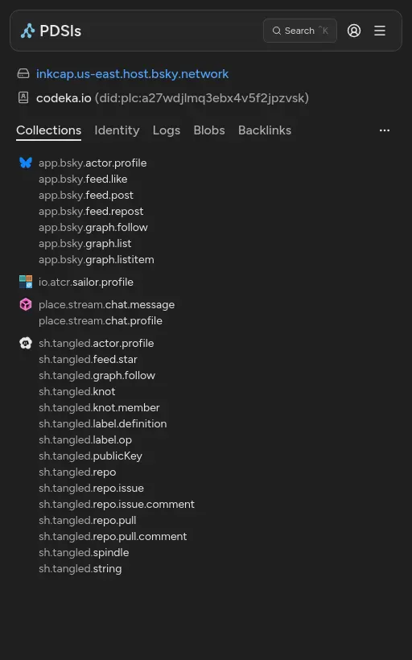

Pour l'hébergement des données Git, ce sont les _knots_ de Tangled qui sont utilisés. Les _knot_ sont de simples serveurs Git, auto-hébergeables, qui sont connectés à l'application principale avec un petit binaire custom (qui permet d'écouter les évènements AT Protocol principalement). Encore une fois, Tangled a son propre _knot_, qui permet d'héberger le code sans avoir besoin de démarrer sa propre instance.
Mais si vous souhaitez héberger votre propre _knot_, pour conserver la maitrise de vos données Git, [c'est aussi possible](#héberger-son-propre-knot).

Enfin, le même principe s'applique pour les _spindle_, qui sont les runners de CI.
Ici aussi, Tangled propose son propre _spindle_, mais [il est possible d'en auto-héberger un](#héberger-son-propre-spindle).

Tangled est entièrement Open Source, il est donc aussi possible d'auto-héberger sa propre instance de l'App (bien que ce soit peut-être très compliqué, je n'ai pas essayé cette partie).

Enfin, Tangled est développé en Go, et utilise Nix un peu partout, à la fois pour l'environnement de développement des contributeurs, mais aussi pour l'auto-hébergement des composants, ainsi que dans les pipelines de CI. Je pense que cet aspect contribue aussi à la hype de Tangled.

## Le setup du compte

Si vous avez déjà un compte AT Protocol (Bluesky principalement), la création de votre compte sur Tangled se fait simplement en se connectant avec votre compte existant.

Les données relatives à Tangled sont alors stockées sur votre PDS.

> Je n'ai pas encore migré mon compte sur un PDS indépendant, comme celui de Eurosky, donc je ne sais pas concrètement comment cette étape fonctionne dans ce cas, mais pas de doute que ça fonctionne.

Une fois cette première étape franchie, on a accès à la plateforme.

La page d'accueil présente une timeline avec les activités d'autres personnes, et quelques repos _Trending_.

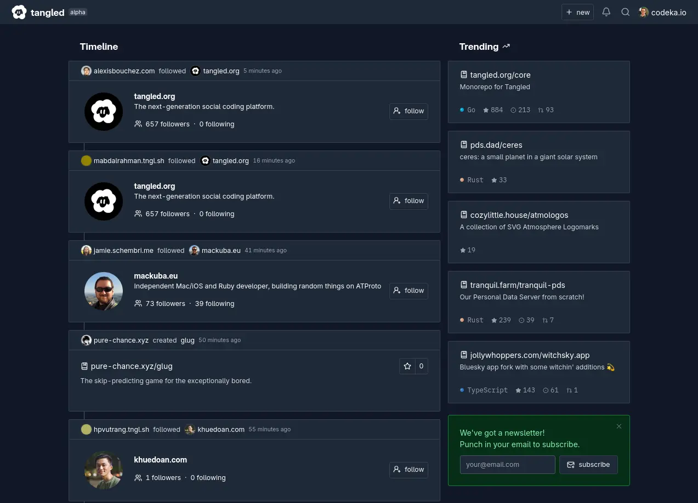

Comme pour tous les hébergements Git, il y a un peu de setup à faire : configurer les clés SSH qui permettront de pousser le code et configurer les adresses mails qui permettent de rattacher les commits au compte.

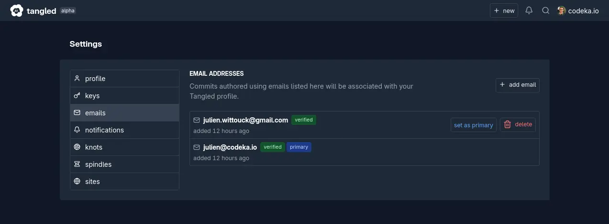

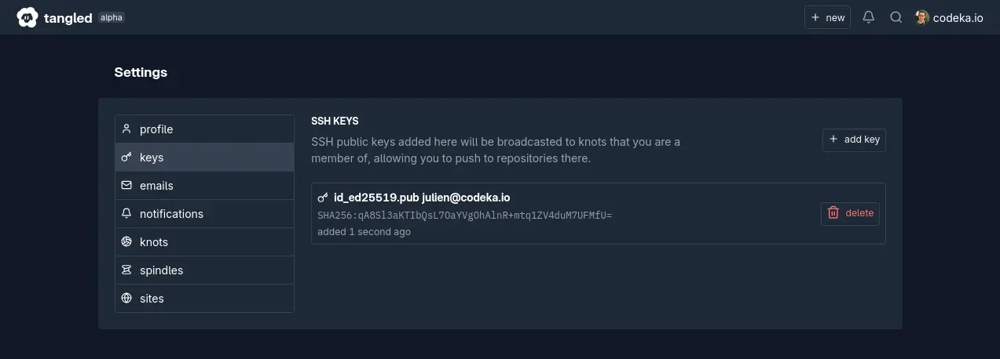

Pour l'aspect social, on peut aussi configurer son profil, avec une photo, une bio et quelques liens. On peut aussi sélectionner quels repos seront mis en avant sur sa page de profil avec les _Pinned Repos_.

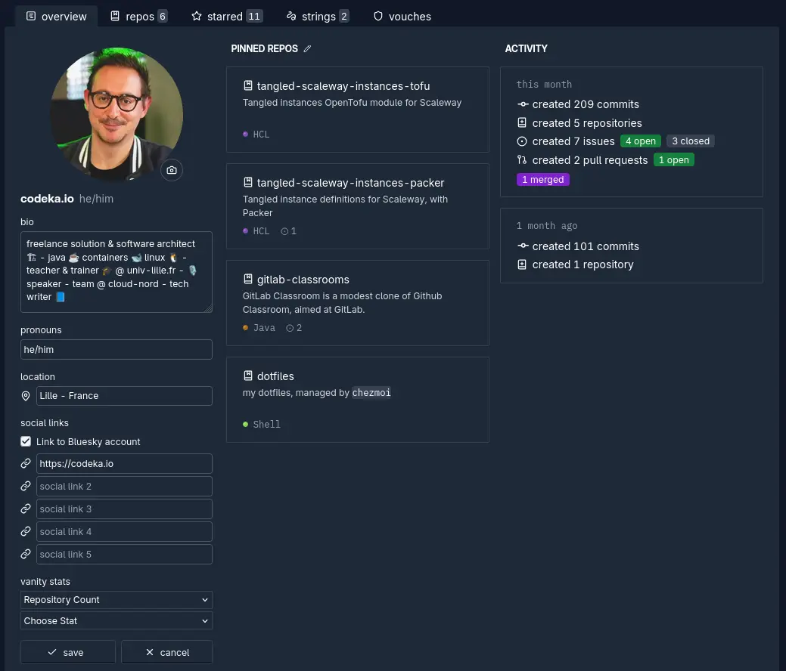

Tangled supporte aussi la vérification de la signature des commits (uniquement avec des clés SSH pour l'instant).
Pour cette partie, il faut configurer votre fichier `.gitconfig`, en indiquant votre clé SSH dans `user.signingkey`, en forçant le format `ssh` pour gpg, et en activant `gpgsign` dans `commit` et `tag`:

```text
[user]
    email = julien@codeka.io
    name = Julien WITTOUCK
    signingkey = /home/jwittouck/.ssh/id_ed25519.pub
[gpg]
    format = ssh
[commit]
    gpgsign = true
[tag]
    gpgsign = true
```

Une fois toutes ces étapes prêtes, on peut commencer à coder et importer des repos !

## Gestion du code

Tangled, c'est avant tout une plateforme Git. On peut très simplement créer des repos et y pousser du code, jusque-là rien de surprenant.

On peut en plus héberger son propre _knot_, qui permet de stocker les repos Git sur nos propres serveurs.

### Créer un nouveau repo

La création d'un repo se fait en quelques clics.

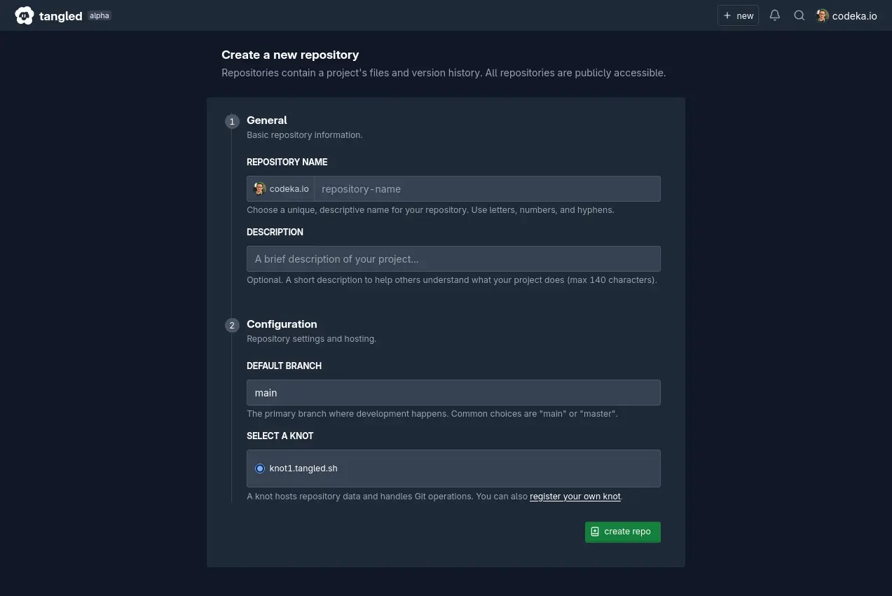

Une subtilité dans la création du repo est la sélection du _knot_, qui est le serveur qui héberge le repo. Je reviendrai sur ce point plus loin, en détaillant la partie liée à l'auto-hébergement.

Une fois le repo crée, on nous propose simplement d'y pousser le code.

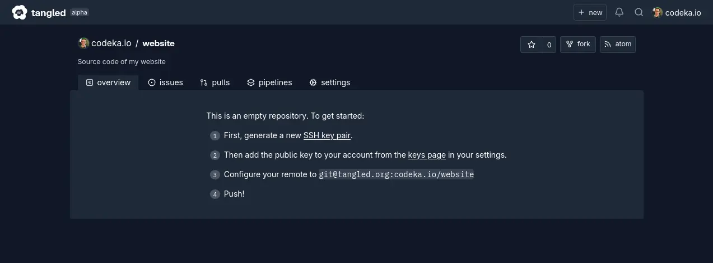

J'ajoute le repo à mes remote Git avec la commande `git remote`, puis je pousse le code avec `git push`.

```shell
$ git remote add tangled git@tangled.org:codeka.io/website

$ git push tangled
The authenticity of host 'tangled.org (2a04:3541:8000:1000:24de:d2ff:fe7c:6eaf)' can't be established.
ED25519 key fingerprint is SHA256:fLyp6ivr5HqmGI8yJiPYstTiJa2AXF/RAa9kF/ur1xo.
This key is not known by any other names.
Are you sure you want to continue connecting (yes/no/[fingerprint])? yes
Warning: Permanently added 'tangled.org' (ED25519) to the list of known hosts.

Welcome to Tangled's hosted knot! 🧶

Enumerating objects: 4145, done.
Counting objects: 100% (4145/4145), done.
Delta compression using up to 22 threads
Compressing objects: 100% (3858/3858), done.
Writing objects: 100% (4145/4145), 615.41 MiB | 9.50 MiB/s, done.
Total 4145 (delta 1993), reused 309 (delta 72), pack-reused 0
remote: Resolving deltas: 100% (1993/1993), done.
To tangled.org:codeka.io/website
 * [new branch]      main -> main
```

Le code apparait bien dans le repo, première étape franchie !

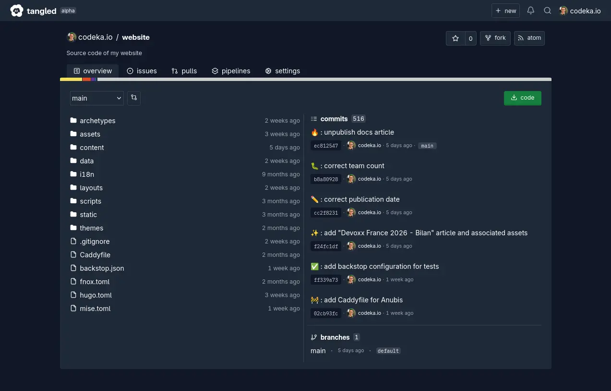

Rien de particulier à signaler sur ces points, les push/pull fonctionnent bien.

Au niveau de l'interface de visualisation d'un repo, on retrouve en premier lieu le code et l'historique des commits, pas besoin d'aller dans un sous-menu pour y accéder, ce que je trouve pratique.

On peut facilement naviguer entre les branches et les tags.
Le `README.md` du projet est affiché sous le code.

Au niveau des settings d'un repo, on y configure la description, une URL de site web ainsi que des topics (qui serviront peut-être à pouvoir rechercher des repos à l'avenir).

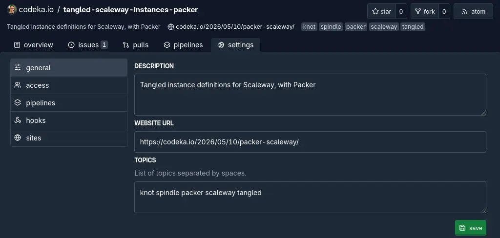

Il est aussi possible de donner des accès à d'autres utilisateurs, qui pourront alors _push_ du code directement sur le repo.

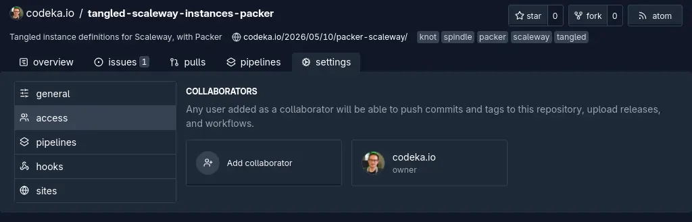

Pour le côté social, on peut poser une _star_ sur un repo, le _forker_ et même s'abonner à un flux atom qui permet de suivre les issues, PR, commits et tags d'un projet.
Je trouve l'idée du flux atom très intelligente. Cela évite d'être bombardés de mails de notifications et de pouvoir filtrer et ranger le suivi dans un client RSS.

> Pour toutes ces fonctionnalités, pas de grande surprise, c'est plutôt classique.

### Héberger son propre _knot_

Le _knot_ est le serveur qui héberge les données de Git.

Pour héberger un _knot_, il faut un serveur et un domaine DNS auquel le _knot_ sera accessible, avec exposition sur internet.
Le _knot_ doit également être accessible en HTTPS, un certificat SSL valide est donc aussi nécessaire.

Plusieurs méthodes d'installation sont proposées par Tangled : sur une VM _via_ [Nix](https://tangled.org/tangled.org/core/blob/master/nix/modules/knot.nix), _via_ une installation manuelle (à base de scripts), ou _via_ une image Docker.

Par simplicité, j'ai donc décidé de créer une VM Debian sur Scaleway, et d'y installer mon _knot_ avec _docker compose_ (là où je me sens le plus à l'aise pour débugger si je rencontre un problème).

Aucune specification minimale n'est indiquée pour l'installation, j'ai donc pris une machine minuscule (1vCPU et 1G de RAM). Le but est surtout que le service tourne, je ne m'attends pas particulièrement à ce qu'il soit performant.

Après avoir installé Docker et le plugin _compose_ (je vous passe ces étapes), je récupère le fichier [`docker-compose.yml`](https://tangled.org/tangled.org/knot-docker/blob/main/docker-compose.yml) de Tangled.

Il est relativement simple, il contient un container pour le _knot_, et un container pour _Caddy_, avec l'exposition en HTTPS.

L'image du _knot_ est disponible sur le [registry _ATCR_](https://atcr.io/r/tangled.org/knot#overview) (lui aussi lié à AT Proto).

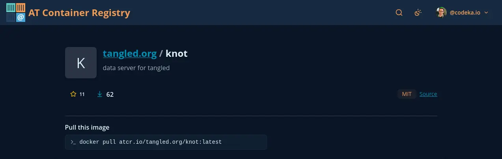

La récupération de l'image (qu'on peut aussi builder soi-même bien entendu), nécessite un compte sur `atcr.io`. Encore une fois, il suffit de se connecter avec son compte AT Protocol sur atcr, et ensuite d'utiliser un [_App Password_](https://bsky.app/settings/app-passwords) pour effectuer le `docker login` :

```shell
$ docker login atcr.io
Username: codeka.io
Password:

Login Succeeded
```

Pour démarrer, le _knot_ a besoin de plusieurs informations : le nom DNS qui sert à l'exposer et l'identifiant AT Protocol _did_ du compte utilisateur qui possède le _knot_.

```shell
export KNOT_SERVER_HOSTNAME=knot.codeka.io
export KNOT_SERVER_OWNER=did:plc:a27wdjlmq3ebx4v5f2jpzvsk
```

```shell
$ docker-compose up -d

 ✔ Image caddy:alpine                    Pulled        4.4s
 ✔ Image atcr.io/tangled.org/knot:latest Pulled        9.3s
 ✔ Network tangled_default               Created       0.3s
 ✔ Container tangled-knot-1              Started       2.0s
 ✔ Container tangled-frontend-1          Started       1.7s
```

Une fois que tout est démarré, j'accède à l'URL de mon _knot_ :

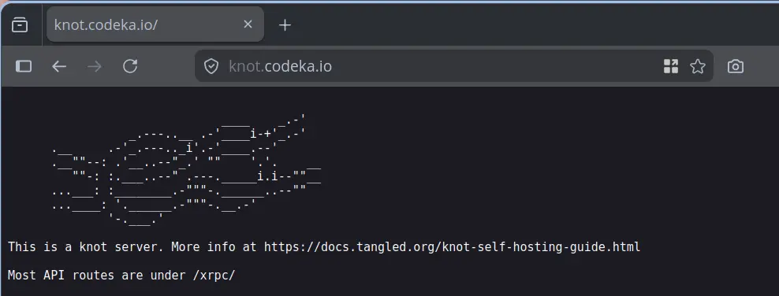

De retour dans l'interface de Tangled, je peux maintenant ajouter mon _knot_ à mon compte utilisateur, _via_ les settings de mon compte :

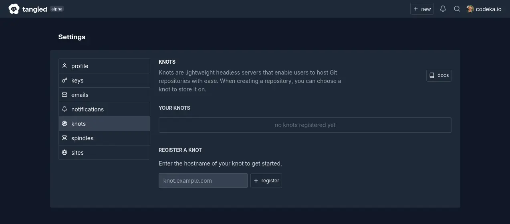

 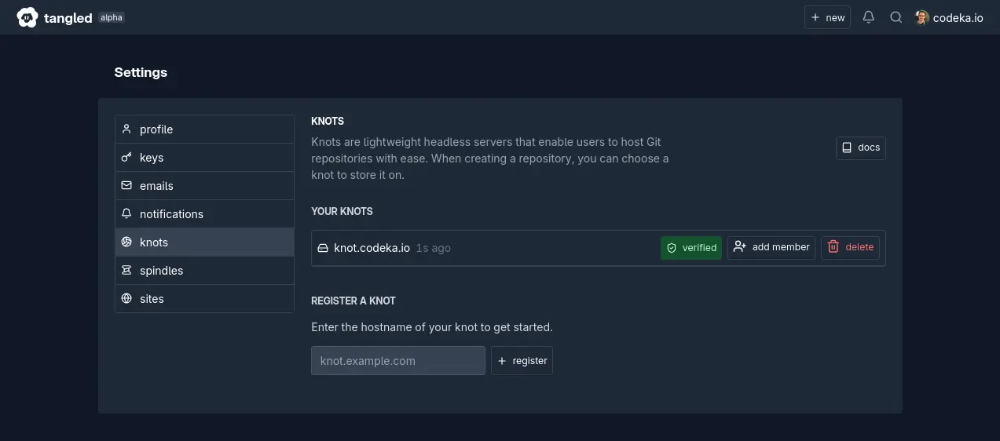

Une fois que mon knot est ajouté dans Tangled, lorsque je veux créer un repository, mon knot est proposé dans le formulaire.

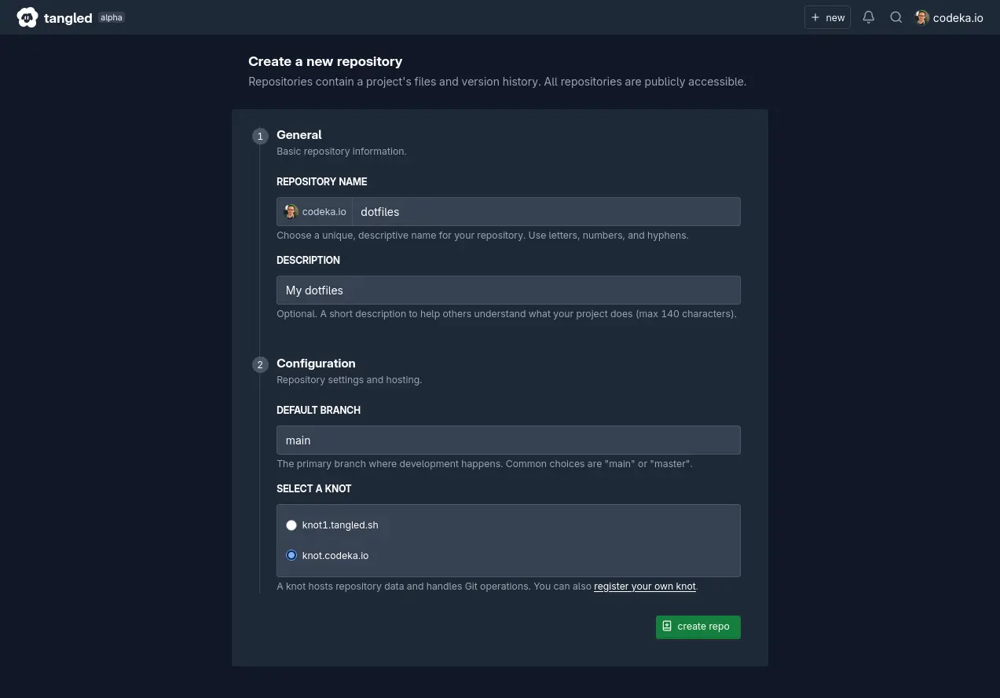

Lorsque le repo est créé, il apparaît alors sur mon _knot_, dans un répertoire portant pour nom son "did" AT Protocol :

```shell
tangled@tangled-knot:/home/tangled/repositories# ls
did:plc:uam62c7dmtnxgca3jlad63kg
```

Et voilà ! Les pull/push de mon code pourront maintenant atterrir sur mon propre _knot_ !

> Je n'ai pas trouvé de procédure permettant de migrer un repo existant vers un autre _knot_. Je pense que c'est le genre de feature qui arrivera dans les prochaines semaines ou les prochains mois.

### Utiliser un _knot_ sans Tangled ?

Le _knot_ est bien un serveur Git classique (boosté à l'AT Proto). Il est aussi possible de cloner des repos et de pusher du code sans passer par Tangled.

La subtilité est que les repository sont créés avec un identifiant AT Protocol (et pas leur nom), mais sinon tout ressemble à un Git classique.

Par exemple, je peux cloner un repo en utilisant directement l'URL de mon knot et le did d'un repo :

```shell
$ git clone git@knot.codeka.io:did:plc:zfbeaslfchzzd2tbmjqjl4mt
Cloning into 'zfbeaslfchzzd2tbmjqjl4mt'...

Welcome to CodeKaio knot!

remote: Enumerating objects: 161, done.
remote: Counting objects: 100% (161/161), done.
remote: Compressing objects: 100% (145/145), done.
remote: Total 161 (delta 107), reused 0 (delta 0), pack-reused 0 (from 0)
Receiving objects: 100% (161/161), 19.65 KiB | 1.09 MiB/s, done.
Resolving deltas: 100% (107/107), done.
```

Ce fonctionnement ouvre clairement la possibilité de migrer du code facilement, simplement en enregistrant un repo Git existant comme un _knot_ ou de pouvoir utiliser plusieurs interfaces pour le même repo de code, comme coupler Tangled avec Forgejo ou Gitea.

Ce n'est pour l'instant pas outillé par Tangled, mais c'est une perspective intéressante pour faciliter les migrations entrantes ou sortantes.

## Issues et PR

En plus du code, on attend d'une plateforme de développement d'avoir une gestion d'issues et de pull requests. Tangled propose son implémentation qui est assez complète, comme on l'imagine, et avec quelques petites originalités.

### Les issues et les labels

Concernant la gestion des issues et des labels, Tangled propose un système similaire à GitHub.

Les issues sont composées d'un titre, d'une description (tous deux en markdown) et de labels.

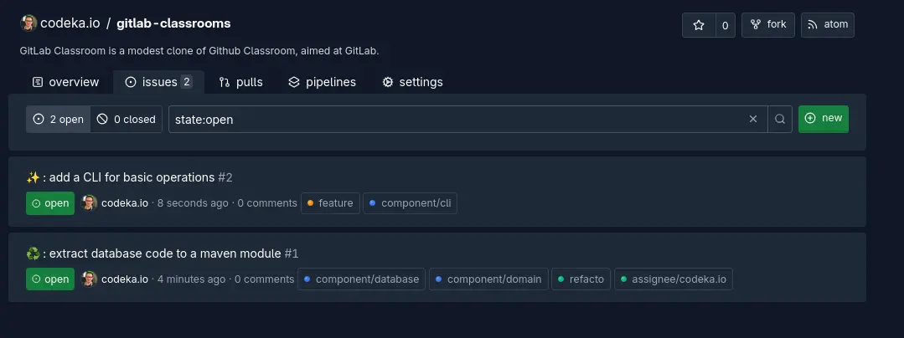

Chaque nouveau repo est initialisé avec des labels basiques (retenez bien ce terme) : "documentation", "duplicate", "good-first-issue", "wontfix".

Il est aussi possible de créer ses propres labels basiques, depuis la page de configuration d'un repo.

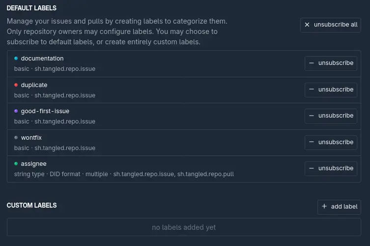

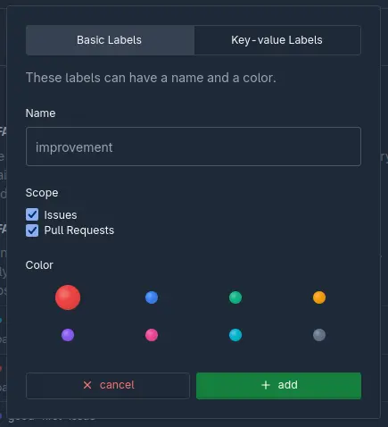

> Comble de la tristesse, les noms de labels ne peuvent pas contenir d'emoji 😢 (en tout cas pour l'instant).

En plus des labels basiques, il existe des labels "Key-Value".
Ces labels portent un nom, et une valeur associée, donnée quand on applique le label à une issue ou une PR. La valeur peut être une chaîne de caractères, un _did_ AT Protocol, ou un nombre, et même être multiple.

Les cas d'usages des labels "Key-Value" sont intéressants, et le premier cas présenté par Tangled est un label "assignee", qui a pour valeur un _did_, donc la personne à qui on a assigné l'issue.
Il est ainsi possible d'avoir par exemple un label "component" qui référence le ou les composants impactés, ou même des labels de chiffrage (pour les foufous).

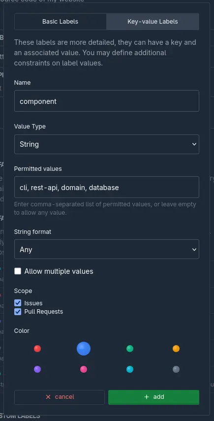

Sur une issue, les labels sont ensuite présentés sous la forme d'un petit formulaire, à côté de l'issue, ce qui est vraiment bien fait et pratique.

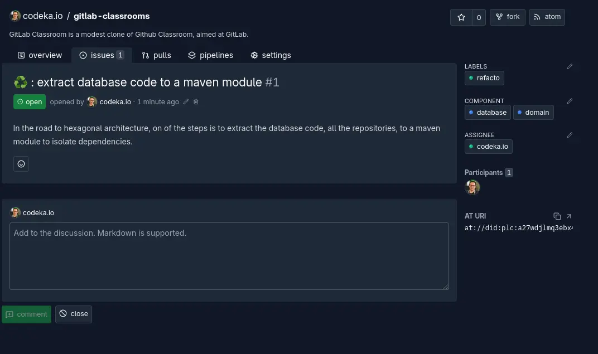

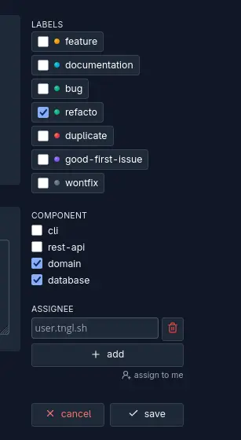

La flexibilité qu'offre ce système de labels est vraiment cool, je pense qu'on en trouvera des usages originaux dans le futur, mais c'est déjà très pratique de mon point de vue.

### Ouvrir une pull request

Ouvrir une PR sur Tangled est assez similaire à d'autres outils.

Pour ce faire, il faut se rendre sur le repo souhaité, dans l'onglet _Pull Requests_ et cliquer sur le bouton "New".

Le formulaire propose alors de comparer deux branches, un fork, ou de simplement poser un `git diff` ou un patch manuellement.

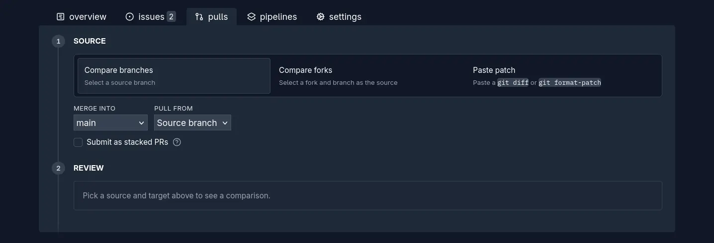

Il est aussi possible d'ajouter un titre et une description, qui sont optionnelles, Tangled arrive à e extrait les informations du premier commit pour alimenter ces champs.

Pouvoir créer une PR juste à partir d'un diff permet de soumettre de petits patchs sans avoir à forker les repo. C'est une excellente idée.

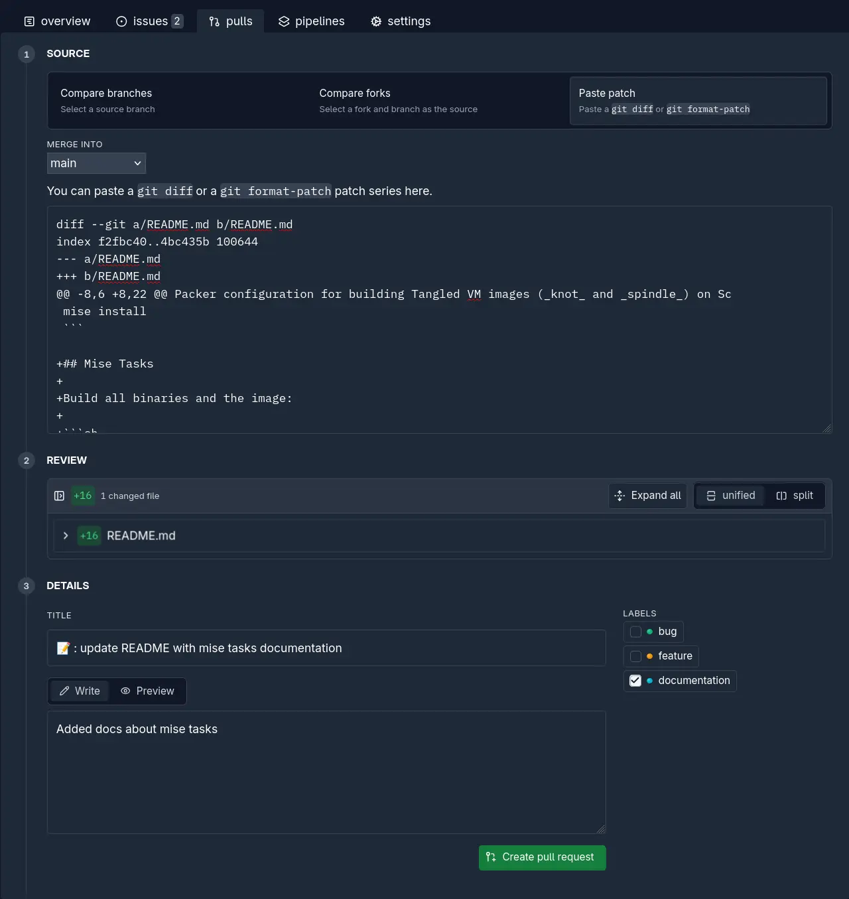

La vue d'une PR est bien organisée, le code est mis en avant, les commentaires et l'historique des actions sont sur le côté. Ici, c'est bien le code qui est roi 👑

On n'est pas tellement perdus, on y retrouve tout ce qu'on peut faire habituellement.

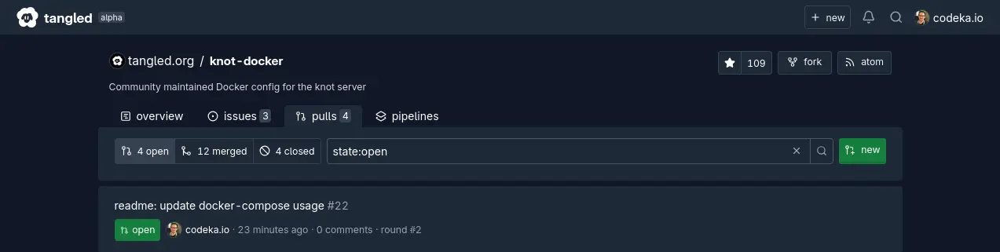

Les PR sont stockées sous la forme de records AT Protocol, dans le PDS de l'utilisateur qui ouvre la PR. L'URI du record est visible dans l'interface de Tangled.

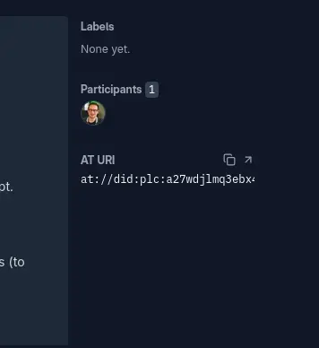

On peut alors directement voir le record AT Protocol, avec ses différents champs.
On y retrouve les informations sur la PR (titre et description), les _rounds_ correspondent aux push successifs, et référencent le blob qui contient le patch de la PR.

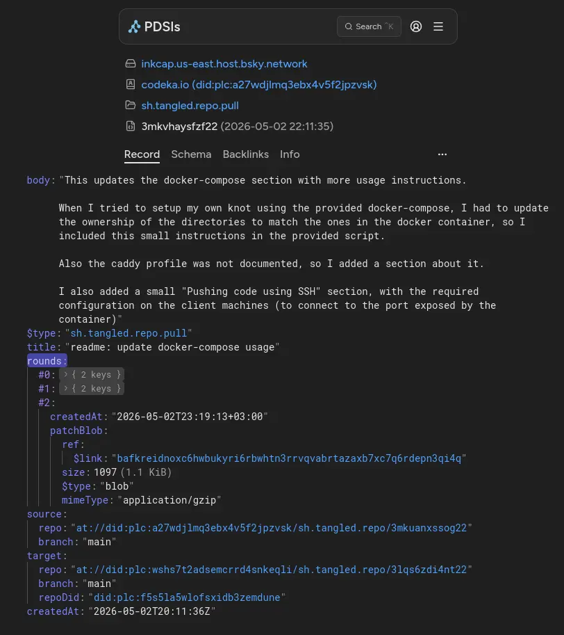

## Intégration continue

Pas de bonne plateforme sans intégration continue.

Il est possible pour chaque repository de configurer des _webhooks_, qui sont transmis à chaque _push_ de code. Ils permettent de se câbler sur des intégrations continues classiques, comme Jenkins, ou d'intégrer d'autres outils (la documentation de Tangled cite pour exemple une [intégration Discord](https://docs.tangled.org/webhooks#example-integrations)).

Au-delà des webhooks, Tangled propose son propre système d'intégration continue basique. Les pipelines sont décrits en YAML, d'inspiration GitHub Actions, et exécutés par des _spindle_.

### Pipelines

Les pipelines d'intégration continue sont décrits par des fichiers présents dans un répertoire `.tangled/workflows` à la racine des repos.

La syntaxe des pipelines est très proche de celle de GitHub Actions, mais avec une approche plus déclarative, en particulier sur la gestion du `clone` et des dépendances.

Un workflow décrit quelles actions déclenchent l'exécution du pipeline (un `git push`, l'ouverture d'une PR, ou un déclenchement manuel), comment le repo doit être cloné, quelles dépendances sont nécessaires à l'exécution du pipeline, et quelles étapes sont à exécuter.

On va donc retrouver dans un pipeline 4 blocs de configuration : `when`, `clone`, `dependencies`, et `steps`. On doit aussi déclarer un `engine` (seul "nixery" est disponible pour le moment), et on peut ajouter des variables d'environnement avec un bloc `environment`.

À ce titre, la [documentation](https://docs.tangled.org/spindles#pipelines) est plutôt complète, et donne un exemple de pipeline qui peut servir de base de travail :

```yaml
when:
  - event: ["push", "pull_request"]
    branch: ["main"]

engine: "nixery"

clone:
  skip: false
  depth: 1
  submodules: false

dependencies:
  nixpkgs:
    - nodejs
    - go

environment:
  GOOS: "linux"
  GOARCH: "arm64"

steps:
  - name: "Build backend"
    command: "go build"
  - name: "Build frontend"
    command: "npm run build"
    environment:
      NODE_ENV: "production"
```

L'exécution des pipelines s'appuie sur des images Docker.
Ces images sont créées en utilisant [Nixery](https://nixery.dev/) (d'où la déclaration de l'`engine`), qui s'appuie donc sur Nix, et qui optimise la gestion des dépendances des pipelines dans des layers Docker.
Je ne connaissais pas cet outil, c'est encore ici une idée de génie.

Les dépendances sont déclarées dans le YAML de cette manière :

```yaml
dependencies:
  nixpkgs:
    - nodejs
    - go
```

Elles sont résolues en exécutant les pipelines dans une image Docker qui contiendra les deux packages demandés, plus les packages `bash`, `git`, `coreutils` et `nix`. L'image Docker qui sera récupérée est alors `nixery.tangled.sh/bash/git/coreutils/nix/nodejs/go`.

Pour accompagner l'exécution des pipelines, Tangled propose une gestion de secrets minimaliste (clé/valeur), qui est backée par OpenBao.

Ajouter des secrets se fait simplement dans les settings d'un repo :

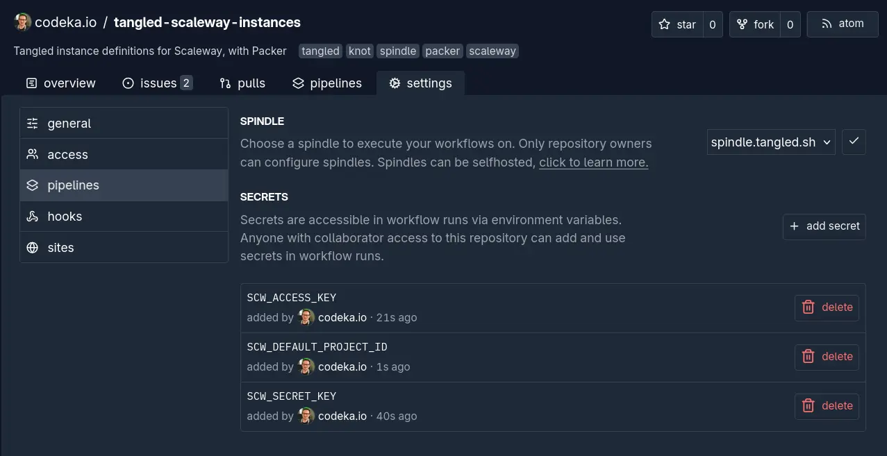

Les secrets sont alors injectés en variable d'environnement. C'est ici encore une fois assez classique. À noter que les secrets sont _write only_ dans l'interface de Tangled.
Les secrets sont stockés au niveau du _spindle_ (et pas dans un record AT Proto, ni au niveau de Tangled lui-même), ce qui est une bonne chose en termes de sécurité.

La vue _pipelines_ d'un repo permet de lister l'ensemble des pipelines qui ont été exécutés, ainsi que leur état.

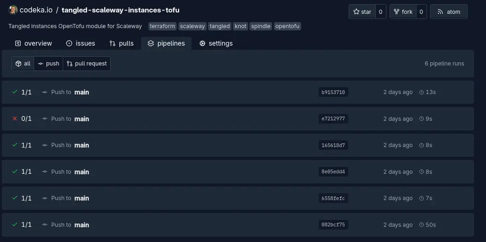

Cliquer sur un pipeline permet d'accéder à ses logs.

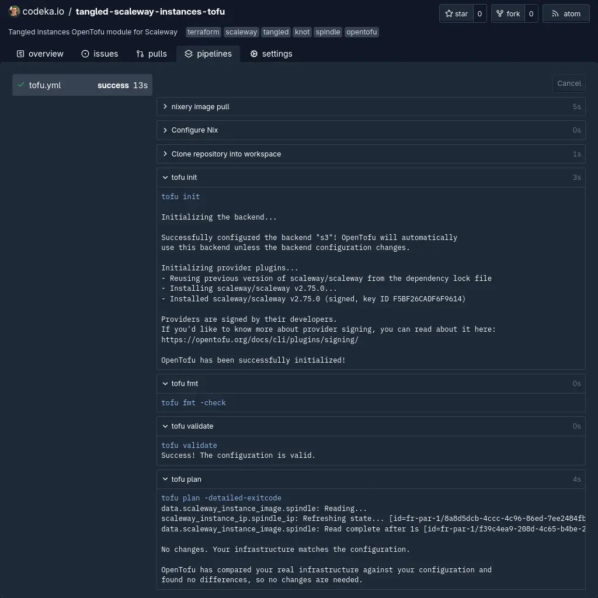

Un bouton permet aussi d'annuler l'exécution d'un pipeline en cours.

> C'est pour l'instant très basique, mais ça a le mérite d'exister et d'être assez simple d'utilisation.
> Pour l'instant, il n'est pas possible de déclencher des pipelines manuellement depuis l'interface, ni de configurer des workflows complexes (comme ceux qu'on peut faire avec GitLab CI par exemple, avec un DAG et des étapes facultatives).
> Ce sont peut-être des features qui seront développées dans les futures versions.

### Héberger son propre spindle

L'intégration continue sur Tangled est assurée par les _spindles_.

Les _spindles_ sont des exécuteurs de pipeline, similaire à ce que sont les runners GitLab CI ou GitHub Actions.

La sélection d'un _spindle_ se fait au niveau des settings d'un repo.

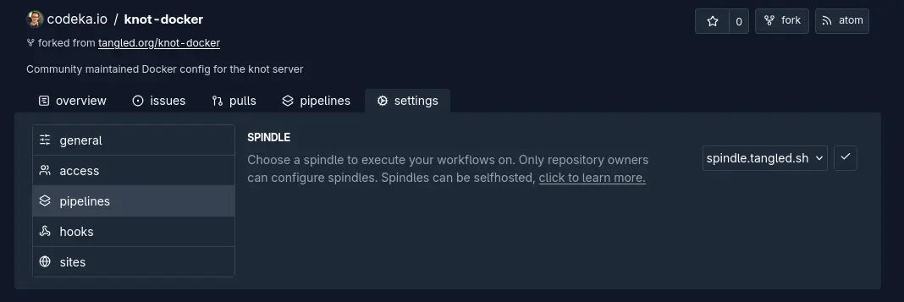

De la même manière que le _knot_, il est possible d'héberger son propre _spindle_ sur un serveur.

Pour ce faire, j'ai suivi la procédure de la documentation [Spindles self-hosting guide](https://docs.tangled.org/spindles#self-hosting-guide).

Sur une VM, après avoir installé `mise` (oui encore lui ahaha), j'ai buildé le binaire _spindle_ avec les commandes suivantes :

```shell
$ git clone https://tangled.org/tangled.org/core
Cloning into 'core'...
remote: Enumerating objects: 27593, done.
remote: Counting objects: 100% (27593/27593), done.
remote: Compressing objects: 100% (7335/7335), done.
remote: Total 27593 (delta 20524), reused 25711 (delta 19179), pack-reused 0 (from 0)
Receiving objects: 100% (27593/27593), 18.90 MiB | 15.63 MiB/s, done.
Resolving deltas: 100% (20524/20524), done.

$ cd core/
$ mise use go
$ go mod download
$ go build -o cmd/spindle/spindle cmd/spindle/main.go
```

J'ai ensuite configuré les deux variables d'environnement nécessaires (comme pour le _knot_), qui sont `SPINDLE_SERVER_HOSTNAME` et `SPINDLE_SERVER_OWNER`, puis j'exécute le _spindle_ :

```shell
tangled@tangled-spindle:~$ ./bin/spindle
2026/05/15 14:38:08 INFO spindle/db: migration applied successfully migration=repos-to-repo-did
2026/05/15 14:38:08 INFO spindle: using sqlite secrets provider path=/home/tangled/spindle.db
2026/05/15 14:38:08 INFO spindle: tap db not yet created, marking resync nudge done migration=force-tap-repo-resync-v1 path=tap.db
2026/05/15 14:38:08 INFO spindle: initialized queue queueSize=100 numWorkers=2
2026/05/15 14:38:08 INFO spindle: initialized workflow semaphore maxConcurrentWorkflows=8
2026/05/15 14:38:08 INFO spindle/jetstream: adding did to in-memory filter did=did:plc:a27wdjlmq3ebx4v5f2jpzvsk
2026/05/15 14:38:08 INFO spindle: owner set did=did:plc:a27wdjlmq3ebx4v5f2jpzvsk
2026/05/15 14:38:08 INFO spindle: embedded tap: using random admin password
2026/05/15 14:38:08 INFO spindle/jetstream: done waiting for did
2026/05/15 14:38:08 WARN spindle: couldn't get last time us, starting from now error="sql: no rows in result set"
2026/05/15 14:38:08 INFO spindle: found last time_us time_us=1778855888237012
2026/05/15 14:38:08 INFO spindle/jetstream: connecting to websocket component=jetstream-client url="wss://jetstream1.us-west.bsky.network/subscribe?cursor=1778855888237012&wantedCollections=sh.tangled.spindle.member"
2026/05/15 14:38:08 INFO spindle: no pre-existing cursor in database system=tap component=firehose relayUrl=https://bsky.network
2026/05/15 14:38:08 INFO spindle: connecting to firehose system=tap component=firehose url=wss://bsky.network/xrpc/com.atproto.sync.subscribeRepos cursor=0 retries=0
2026/05/15 14:38:08 INFO spindle/embedtap: tap http server listening bind=[::1]:2480
2026/05/15 14:38:08 INFO spindle: starting tap client url=http://[::1]:2480
2026/05/15 14:38:08 INFO spindle: starting spindle server address=0.0.0.0:6555
2026/05/15 14:38:08 INFO spindle: starting knot event consumer
2026/05/15 14:38:08 INFO spindle/eventconsumer: starting consumer config="{map[] 0x159d7e0 15m0s 1h0m0s 10s 5 100 0xc000340e30 false 0xc000144630}"
2026/05/15 14:38:08 INFO spindle: websocket connected system=tap component=server
2026/05/15 14:38:08 INFO spindle: connected to tap service subscription_code=101
2026/05/15 14:38:08 INFO spindle: tap declare: known owner DIDs registered count=0
2026/05/15 14:38:08 INFO spindle: established tap connection
2026/05/15 14:38:08 INFO spindle: connected to firehose system=tap component=firehose
2026/05/15 14:38:08 INFO spindle/jetstream: starting websocket read loop component=jetstream-client
```

De retour dans l'interface de Tangled, dans les settings de mon profil, j'ajoute mon _spindle_ :

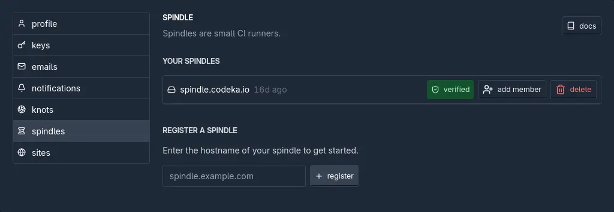

Puis sur mes repos, je peux ensuite venir sélectionner mon _spindle_ pour l'exécution des pipelines :

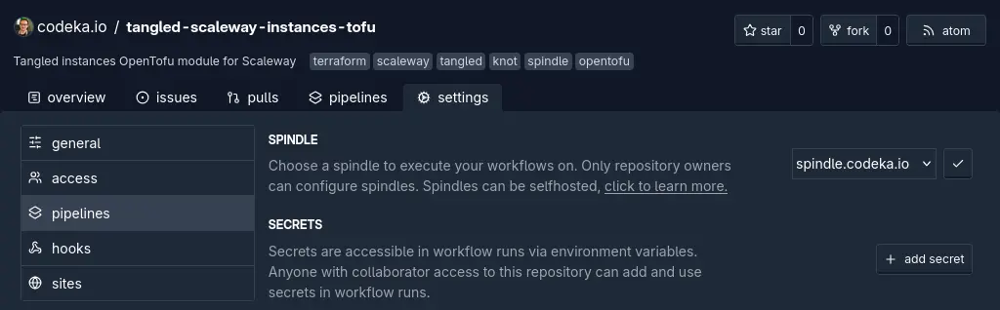

Les pipelines que je déclencherai seront donc maintenant exécutés sur mon propre _spindle_ !

Les logs de mes pipelines sont alors stockés dans mon _spindle_, (et remontés dans l'interface de Tangled à la consultation).

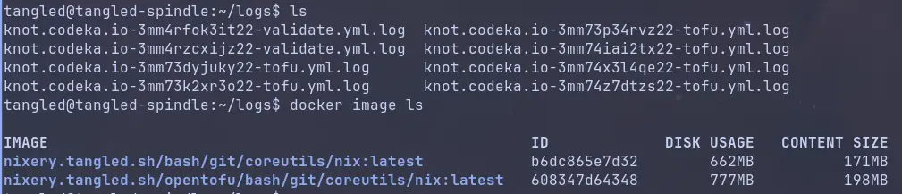

> Héberge son propre _spindle_ est assez facile, et permet dans une certaine mesure que les secrets des pipelines ne soient pas stockés ailleurs.
> Pour aller au bout de l'auto-hébergement d'un _spindle_, on peut aussi [configurer sa propre instance d'OpenBao](https://docs.tangled.org/spindles#secrets-with-openbao) pour y stocker les secrets des pipelines.
> C'est une étape que je n'ai pas encore faite, mais que je ferai dans les prochaines semaines.

## Autres features

En plus de tout ça, il y a deux autres fonctionnalités sur Tangled qui viennent encore s'inspirer de GitHub.

### Strings

Les strings sont des snippets partageables, l'équivalent d'un _gist_ dans GitHub.

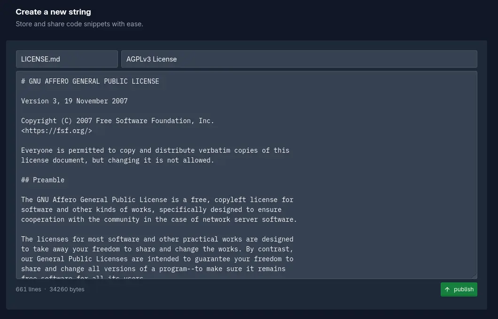

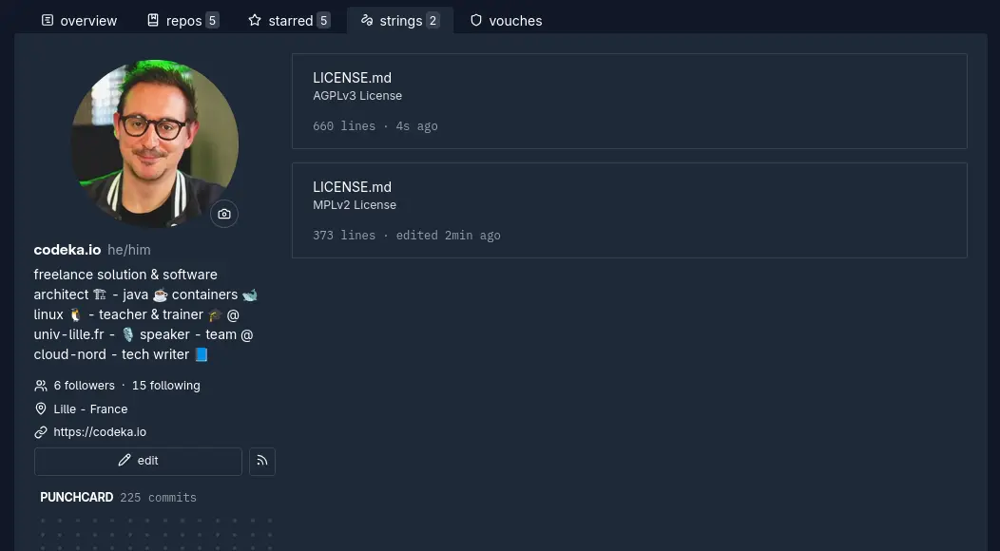

Les strings peuvent alors être partagés avec leur lien, qui est public.

Attention, le contenu des strings est bien public, et stocké sur les PDS dans un record AT Proto. Attention à ce que vous y stockez.

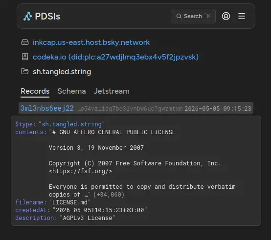

### Vouching

Le _vouching_, inspiré par [_vouch_](https://github.com/mitchellh/vouch/) de Mitchell Hashimoto, permet d'introduire la notion de confiance dans la plateforme.

Il permet de _vouch_ (témoigner) ou _denounce_ (signaler) d'autres utilisateurs avec lesquels on a intéragit.
Le but est de créer un écosystème de confiance, en particulier pour éloigner les contributions de mauvaise qualité (souvent générés avec un LLM d'ailleurs).

Chaque témoignage ou signalement doit être accompagné d'un commentaire. Les informations sont alors visibles sur le cercle direct (vous avez vous même _vouched_ ou _denounced_ quelqu'un), ou indirect (quelqu'un que vous avez _vouched_ ou _denounced_ a _vouched_ ou _denounced_ quelqu'un d'autre).

Un article détaillé a été publié à ce sujet sur le blog de Tangled : [combat LLM spam by building a web of trust](https://blog.tangled.org/vouching/).

Les _vouch_ sont encore une fois stockées sur l'AT Protocol, dans le PDS des utilisateurs qui les émettront.

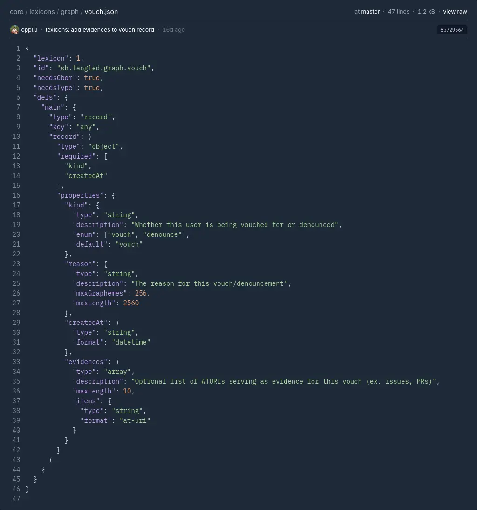

> Je n'ai pas réellement testé cette feature. À voir comment elle prend par la suite. En tout cas, c'est intéressant que ce soit une fonctionnalité native de Tangled, et que ce soit encore une fois une fonctionnalité implémentée sur l'AT Protocol.

## Les trucs qui manquent à mon avis

### Pas de regroupements de repos (orgas/groupes)

Il n'est pour l'instant pas possible de créer d'organisation qui ne serait pas rattachée à un compte humain, et d'y faire rejoindre des utilisateurs.

J'ai bien l'approche de GitLab, avec la notion de groupes, c'est peut-être aussi quelque chose qui manque un peu.
C'est souvent pratique pour regrouper des projets ensemble.

L'astuce de contournement semble donc de créer un compte AT Protocol pour l'organisation (asso, entreprise ou autre, ou même le projet), et de donner des droits d'accès repo par repo aux contributeurs. C'est un peu lourds, et ça nécessite peut-être de switcher entre plusieurs comptes.

### Pas de gestion de release

La notion de _release_ est également manquante pour le moment.
Il est possible, au niveau des tags, d'attacher des fichiers (comme des binaires compilés ou des packages), le code source du tag est attaché par défaut.
Ce qui manque principalement, c'est la possibilité d'attacher un _CHANGELOG_ ou des _RELEASE NOTES_ sur une version particulière.

### Pas d'opérations de maintenance sur les repos

Il ne semble pas possible pour l'instant, de faire quelques opérations sur les repos comme les renommer, ou les transférer.

Ce n'est peut-être pas très grave en soit, mais ça risque d'être un peu limitant, surtout si on multiplie les forks.

Avec l'auto-hébergement des _knot_, il serait aussi intéressant de pouvoir voir sur quel _knot_ est hébergé un repo, et de pouvoir transférer un repo d'un _knot_ à un autre.

### Pas de repos privés (mais je ne pense pas que ce soit possible)

Par nature, les données de Tangled étant hébergées sur AT Proto, il n'est pas possible d'avoir de données privées.

Le code, les issues, les PR, les strings, tout ça est public.
C'est probablement un frein à l'adoption de Tangled pour un certain nombre d'utilisateurs.

Pour ma part, j'ai quelques repos privés sur GitLab qui contiennent des données de mes clients (du code, mais aussi des docs).

Ce besoin ne pouvant pas être porté sur Tangled. Tangled ne pourra donc pas remplacer complètement GitLab, ou GitHub en l'état (et je ne vois pas comment ils pourraient). Mais pour des projets entièrement open-source, aucun problème.

### L'outillage et la doc pas encore très développés

Pour l'instant, la documentation n'est pas encore très fournie, et elle est très orientée autour de l'hébergement de ses propres _knot_ et _spindle_.

Comme Tangled ressemble beaucoup à GitHub, on n'est pas surpris, ni perdu, mais je pense qu'on peut facilement passer à côté de certaines fonctionnalités, qui ne sont pas visibles immédiatement.
Il est possible de contribuer à la documentation, dans le mono repo de Tangled : https://tangled.org/tangled.org/core/blob/master/docs/DOCS.md.
Toute la documentation est dans un immense fichier markdown pour le moment. Cela risque d'évoluer rapidement puisque j'ai du mal à imaginer comment il serait pratique de maintenir ça.

Concernant l'automatisation, il semble exister une API qu'on peut appeler, mais elle n'est pas du tout documentée. Pour l'instant donc, _exit_ l'automatisation avec un CLI, sauf à _reverse engineerer_ l'API ou à éditer directement des records AT Protocol.

Un CLI non officiel nommé [tang](https://tangled.org/onev.cat/tang) est en cours de développement, et l'équipe de Tangled a annoncé un CLI pour 2026 (dans leur annonce de levée de fonds).

## La communauté et l'avenir de la plateforme

J'ai beaucoup parlé de l'outil et de comment il fonctionne, mais pas encore de la communauté et des différents projets qui sont hébergés sur Tangled.

Pour l'instant, on y trouve beaucoup de projets s'appuyant sur AT Protocol (surprise ?) : PDSls, Streamplace, Rocksky, Standard.site, Leaflet ; ainsi que tous leurs contributeurs.

C'est d'ailleurs assez passionnant à explorer. 
En suivant la timeline, et en allant voir les repos _starés_ par certains profils, j'ai découvert pas mal de projets intéressants qui m'ont donné envie de tester (standard.site est le prochain sur ma liste).

On retrouve aussi quelques personnalités de l'Open Source parmi les utilisateurs de la plateforme, en particulier [Dan Abramov](https://tangled.org/danabra.mov) (ex-React) et [Mitchell Hashimoto](https://tangled.org/mitchellh.com) (ex-HashiCorp et mainteneur de Ghostty).

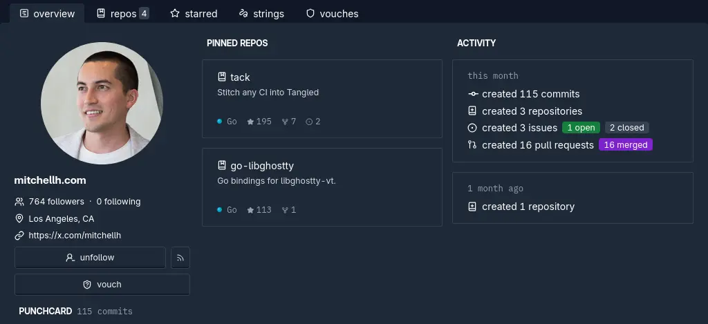

Mitchell Hashimoto a d'ailleurs démarré un nouveau projet sur Tangled, `tack`, qui permet de remplacer le moteur de CI par une autre solution que les _spindle_. Cela fait probablement partie de ses tests pour jouer avec la plateforme et voir s'il pourrait y héberger le code de Ghostty.

Pour l'instant, Tangled semble assez cantonné à ce type de projets. Cela pourrait changer avec le temps, la plateforme est encore jeune, et il suffirait que quelques projets populaires rejoignent Tangled pour que beaucoup d'utilisateurs viennent s'y installer (peut-être Ghostty dans les prochains mois ?).

La communauté de Tangled est plutôt active sur leur serveur Discord public. On peut dialoguer avec les mainteneurs de la plateforme. Pendant les trois dernières semaines, j'ai pas mal testé et bricolé avec la plateforme et mon propre _knot_ et _spindle_, j'ai ouvert quelques issues qui ont eu des réponses, un peu discuté avec des membres de la commu, j'ai été à chaque fois content des échanges. C'est aussi peut-être cette proximité et cette communauté ouverte qui pourrait faire le succès de Tangled.

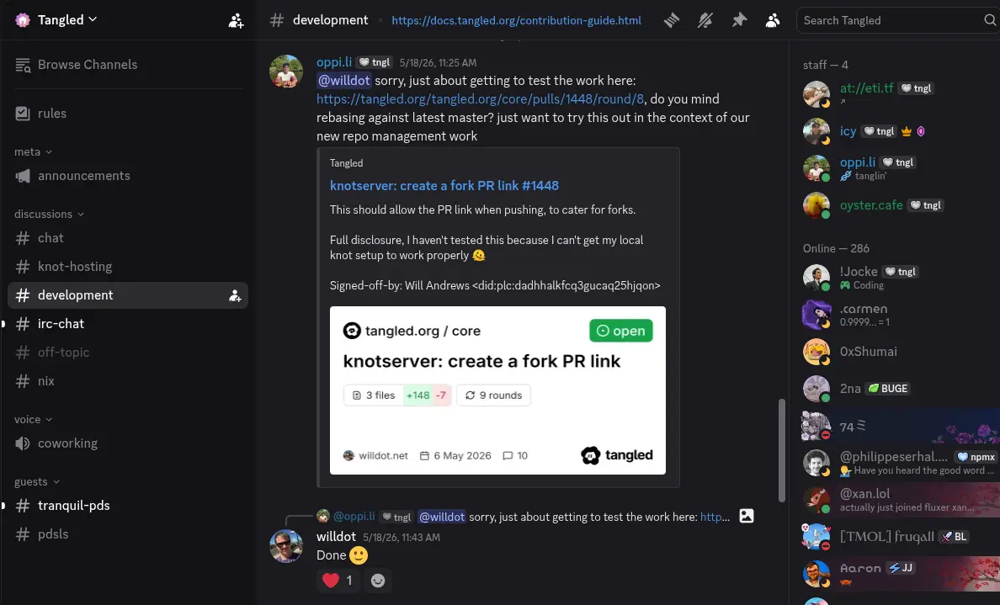

Une des questions qu'on pourrait se poser, c'est "est-ce que Tangled est pérenne ?".

Début mars 2026, l'équipe a annoncé une [levée de fonds de 3.8 millions d'euros](https://blog.tangled.org/seed/). Cela devrait financer l'équipe et l'infrastructure de Tangled pour un bon moment.
Étant donné que la plateforme est auto-hébergeable, il est possible de créer sa propre instance isolée de Tangled, et le stockage des données sur l'AT Proto (même partiel), devrait rendre possible une réversibilité.

Une fois l'argent de la levée de fonds dépensé, il est vraisemblable que Tangled cherche des revenus.
Vu que l'IA n'est clairement pas dans leur ADN (et c'est tant mieux), ils ne suivront probablement pas le chemin d'un assistant de code coûteux (sauf si leurs investisseurs mettent un coup de pression sur ce sujet).
Je penche plutôt sur un avenir avec de la vente de services d'hébergement de _knot_ et _spindle_.

## Conclusion

Tangled est actuellement en version _alpha_. Et cette qualification implique des instabilités. Sur mes 3 semaines de test, j'ai expérimenté plusieurs coupures, des erreurs 500 lors de la navigation dans des repos, et même un bug lors de la suppression d'un repo qui l'a laissé dans un état instable (supprimé du PDS et du _knot_ mais pas de l'App). Ça bouge beaucoup, et on voit la plateforme évoluer de semaine en semaine.

On est donc bien encore dans une phase expérimentale.
Si vous cherchez une plateforme stable et mature, Tangled n'est pas pour vous (en tout cas pour l'instant).
Si vous cherchez une plateforme pour héberger du code d'entreprise, Tangled n'est pas pour vous, par sa nature complètement ouverte.

Par contre, si vous êtes intéressé par l'AT Protocol, ou vous cherchez un endroit cool pour héberger du code open-source, Tangled est une bonne option.
La plateforme est encore jeune, et ne bénéficie par de la visibilité qu'offre GitHub. Mais cette situation pourrait changer avec le temps (qui se souvient de Sourceforge avant l'hégémonie de GitHub ?).

Tangled m'a ouvert une porte sur l'AT Protocol. Je ne connaissais pas plus que ça les concepts, et au fil des découvertes des projets, j'ai découvert un écosystème riche, avec une approche de la décentralisation qui me plaît bien.

En tout cas, pour mes projets jouets, j'ai décidé que je préférais les confier à Tangled plutôt qu'à GitHub.
Je conserverai mes projets en miroir sur GitHub et GitLab (et peut-être ailleurs aussi ?), histoire de pouvoir leur donner une visibilité supplémentaire, mais la `remote` git principale de mes projets (et de ce site) sera Tangled.

Git est par nature un système décentralisé. AT Protocol l'est également.
Je pense que Tangled fait bien matcher les deux.

## Liens et références

* [Tangled](https://tangled.org/)
  * [Tangled Blog](https://blog.tangled.org)
  * [Tangled Docs](https://docs.tangled.org/)
  * [Mon profil](https://tangled.org/codeka.io)
  * [Le code source de Tangled](https://tangled.org/tangled.org/core)
* _Knots_
  * [Knot self-hosting guide](https://docs.tangled.org/knot-self-hosting-guide#knot-self-hosting-guide)
  * [Module Nix](https://tangled.org/tangled.org/core/blob/master/nix/modules/knot.nix)
  * [Image Docker](https://tangled.org/tangled.org/knot-docker)
* _Spindles_
  * [Pipelines](https://docs.tangled.org/spindles#pipelines)
  * [Self-hosting guide](https://docs.tangled.org/spindles#self-hosting-guide)
  * [Secrets with OpenBao](https://docs.tangled.org/spindles#secrets-with-openbao)
* _Vouching_
  * [combat LLM spam by building a web of trust](https://blog.tangled.org/vouching/)
  * https://github.com/mitchellh/vouch/