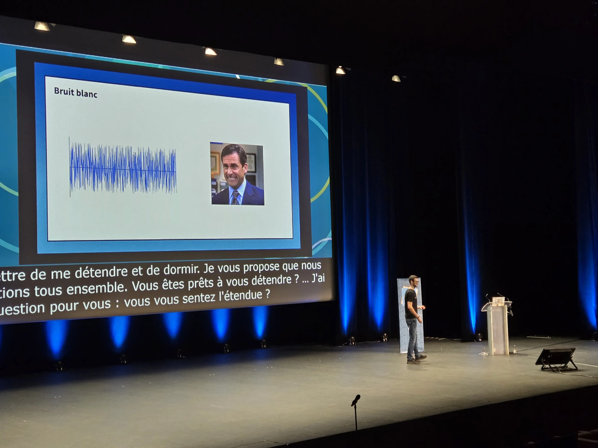
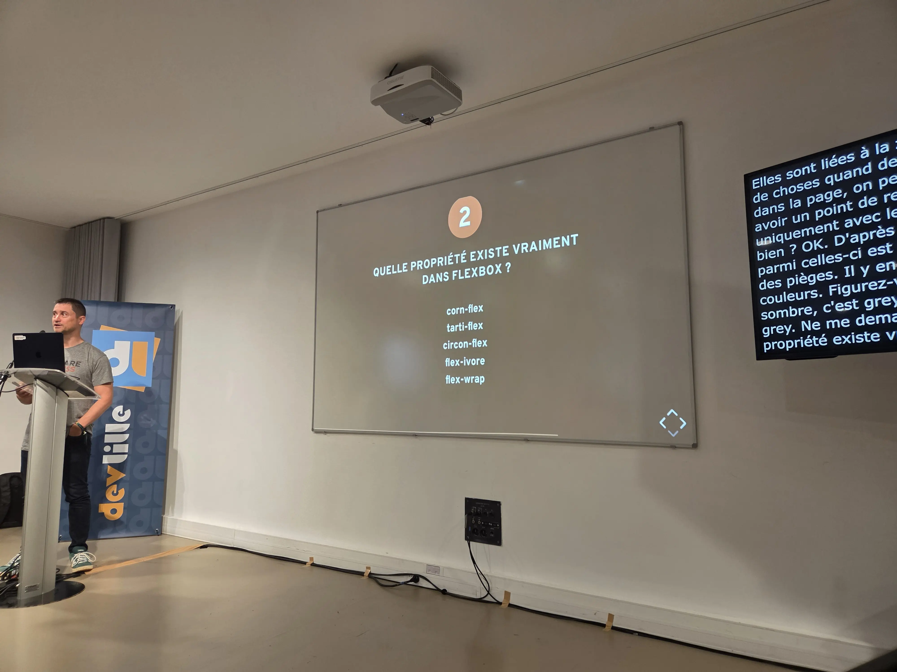
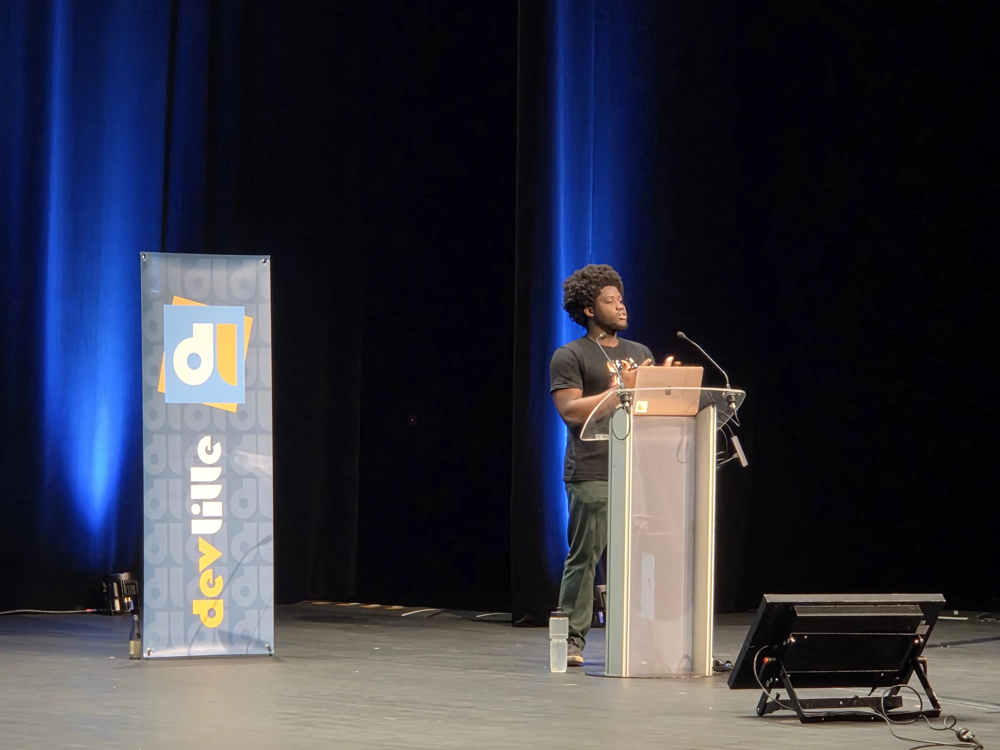
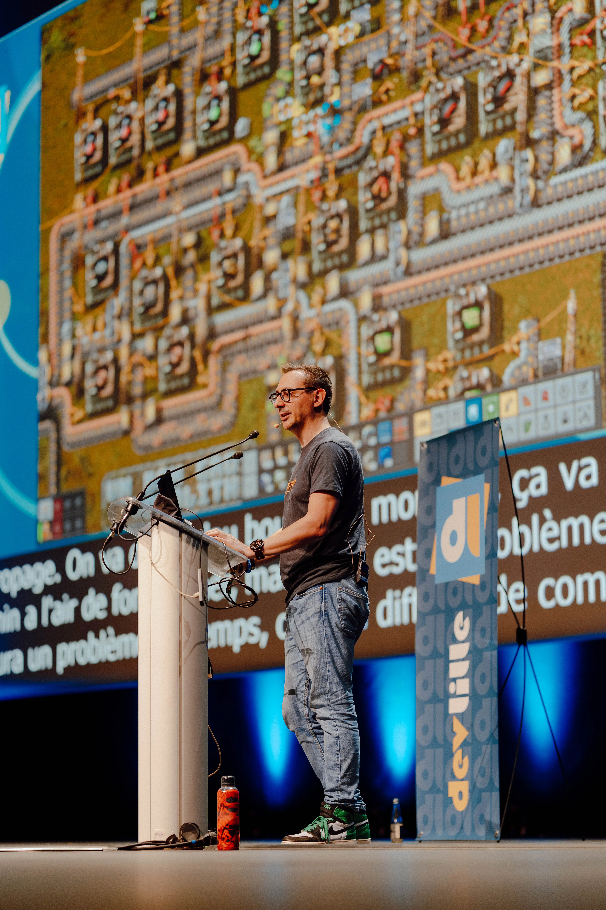

Ce début d'été, j'étais en marathon de conférences. DevLille, Tech'Work à Lyon, Breizhcamp à Rennes, et Riviera Dev à Sophia Antipolis.

Je vous raconte tout ça : ce que j'ai vu, ce que j'ai apprécié.

Ce premier article est consacré au DevLille, qui a eu lieu les 11 et 12 juin 2026.

<!--more-->

## DevLille 2026

DevLille est toujours une conférence particulière pour moi.
J'y assiste depuis la première édition.

Cette année, j'ai participé avec 4 rôles différents :

* en tant que speaker avec mon talk "Let's play Factorio"
* en tant que sponsor avec ma propre structure de freelance, CodeKaio
* en tant que sponsor avec Ekité
* en tant que maître de cérémonie

Encore une fois, j'ai adoré cette édition du DevLille. Retrouver les potes est clairement le meilleur de ces évènements pour moi, donc j'ai assisté à peu de talks. J'avais d'ailleurs déjà vu pas mal des sujets à l'affiche sur d'autres conférences. J'ai aussi enregistré deux podcasts avec Romain, qui paraîtront vers la rentrée.

## Sculpter le bruit : Retour d'expérience sur la génération de textures sonores - Par Sébastien Ferrer

Dans son talk, Sébastien nous explique ce qu'est le son, et comment en générer. De manière visuelle.

Et c'est là tout le génie de ce talk.
Avec des slides bourrés d'animations, il nous explique les notions de fréquence et d'amplitude, ainsi que la visualisation du son avec un spectrogramme.

Il nous parle ensuite des différents types de bruits colorés, blancs, rose et bruns. Ainsi que l'effet de ces bruits sur son acouphène.

Les slides sont bluffants, et la présentation pleine de sincérité et d'humour.

## Les petites aventures de CSS, saison 2026 - par Raphaël Goetter

Pour ce talk, j'étais le MC de la salle.
Je m'étais donc renseigné sur Raphael, que je ne connaissais pas.
Par contre, les gens qui comme moi, ont débuté l'informatique en bidouillant du HTML et CSS connaissent le site qu'il a fondé : Alsacréations.

Dans son talk, Raphaël passe en revue les noveautés de CSS.
Le talk était ponctué de questions/réponses, et de beaucoup de démos et d'exemples.
Moi qui déteste le front, j'ai quand même passé un bon moment. Le public a également apprécié.

## Qu'est-ce que OID4VP : le protocole derrière les portefeuilles numériques européens - par Gilbert Djamena

Gilbert avait participé à l'édition 2026 du Ch'ti Tremplin, organisé avec DevLille, Cloud Nord et AgiLille.
Et il avait gagné sa place à l'agenda du DevLille !

Je n'avais pas vu son talk lors de la soirée du tremplin (j'étais en train de gérer l'apéro), donc c'était un talk que je ne voulais pas louper, à la fois par curiosité par rapport au sujet, et pour soutenir Gilbert pour son premier talk en conférence !

Il nous explique alors en détail le fonctionnement du protocole OID4VP, qui permet à des sites web d'accéder à des informations de l'utilisateur à travers un portefeuille numérique. Le but est de pouvoir fournir une information vérifiée (comme la majorité de l'utilisateur) sans dévoiler d'autres informations (identité, date de naissance, ...).

Le protocole est bien expliqué, étape par étape, et la démo mettait en œuvre un site web ainsi qu'une appli mobile de portefeuille numérique.
C'était excellent, et Gilbert a eu de super feedbacks !

## Let's play Factorio

Moment particulier pour moi, puisque c'est la première fois que je donnais le talk sur Lille.
Toute la team Ekité était présente au premier rang pour y assister.

Bien que le créneau horaire n'était pas idéal, j'ai eu quand même pas mal de monde dans la salle, et le talk a encore bien fonctionné.
Et les photos de Nicolas Detrez sont incroyables !

## Discussions et podcasts

Comme d'habitude, mon pote et associé Romain a passé ses journées à enregistrer des podcasts avec les speakers, orgas, sponsors et participants.

J'ai enregistré avec lui deux sessions, une avec les copains de Clever Cloud, et une autre avec le pote Manu Demey.
Les vidéos et podcasts devraient être publiés à la rentrée.

## Liens

Les vidéos du DevLille sont disponibles sur [Youtube](https://www.youtube.com/playlist?list=PLXbqr_rv1t4N3LXk2aP80NQjIbymwpA2S).
