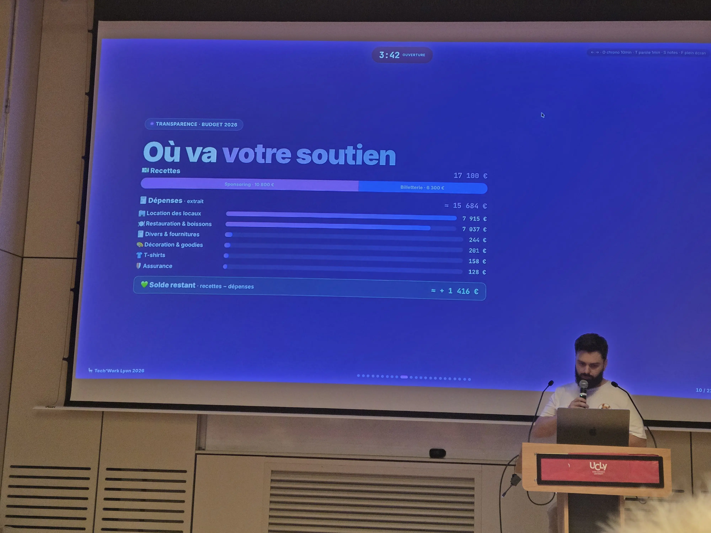
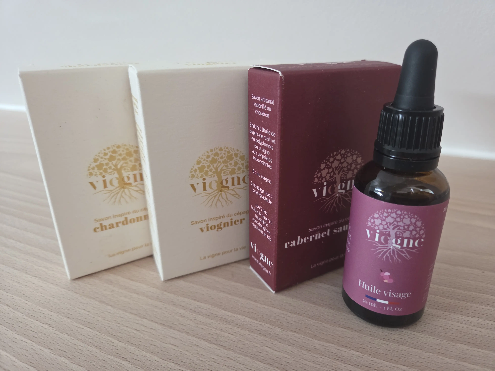
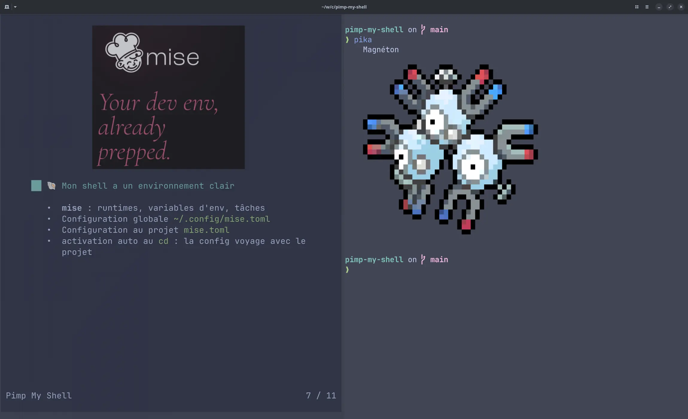
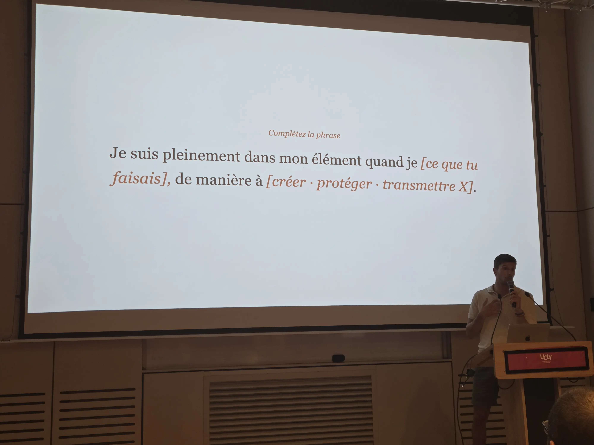

Ce début d'été, j'étais en marathon de conférences. DevLille, Tech'Work à Lyon, Breizhcamp à Rennes, et Riviera Dev à Sophia Antipolis.

Je vous raconte tout ça : ce que j'ai vu, ce que j'ai apprécié.

Ce deuxième article est consacré au Tech Work, qui a eu lieu le 18 juin 2026.

<!--more-->

## Tech Work

Tech'Work est une nouvelle conférence à Lyon.
Elle est issue de quatre communautés locales, et vient remplacer la conférence Tech'n'Wine qui avait eu lieu l'année dernière.

Pour cette conférence, j'avais proposé un nouveau sujet de talk que je voulais tester : [_Pimp My
Shell_](/talks/talk-pimp-my-shell/).

Présenter un nouveau sujet est toujours difficile pour moi, et j'étais encore très à l'arrache. J'ai passé une grande partie de la veille et du jour J à préparer le talk, revoir les démos, et tester les slides. Je n'ai pas réellement profité de la conférence (j'ai bien profité des soirées par contre).

J'ai donc seulement assisté aux deux keynotes.

En keynote d'ouverture, j'ai beaucoup apprécié la démarche de transparence de la part des orgas, qui dévoilent leur budget dans les détails.
C'est toujours intéressant de savoir où va l'argent, et ça me permet aussi d'avoir des idées et des points de comparaison pour Cloud Nord.

J'ai aussi bien aimé l'idée de faire venir des artisants de la région.
J'ai acheté quelques savons artisanaux fabriqués avec du marc de raisin, et dont les parfums sont inspirés des sépages !

## Pas besoin de berger : faire émerger le leadership sans y laisser sa laine - par Alexis Monville

On commence par une keynote, très interactive avec le public. Le propos est axé autour de la conscience de ses émotions et de sa communication, pour mettre les personnes en confiance, en écoute, et en responsabilité.

Je me rends compte que je n'ai pas pris de photo pendant cette keynote, ni même de notes. J'étais assez fatigué, et assez peu réceptif.

## Pimp My Shell

Pour mon talk, j'avais une petite quinzaine de personnes présentes dans la salle.
J'ai donc profité de ce petit comité pour avoir plus d'intéractions avec les participants.

La grande majorité de mes slides et de mes démos ont fonctionné, donc je suis globalement content de ce nouveau sujet.
J'ai encore des ajustements, puisque c'est assez dense, même pour un format de 50 minutes, donc il va falloir que je supprime un peu de contenu pour être plus à l'aise.

Je suis aussi content d'avoir trouvé un format de présentation qui reste immersif (dur de faire aussi bien que Factorio ahah).

## Quand l'IA sait tout faire, qu'est-ce qui nous reste ? - par Donatien Delalu Möller

Donatien est un ancien militaire (!), devenu développeur, puis coach.
Il nous raconte son parcours, et comment "naviguer l'incertitude", concept que l'on apprend malheureusement pas dans nos parcours scolaires.

Le talk était plutôt inspirant, plutôt que de faire les choix qui nous rassurent, pourquoi ne pas faire les choix qui résonnent avec nos tripes.
