Ce début d'été, j'étais en marathon de conférences. DevLille, Tech'Work à Lyon, Breizhcamp à Rennes, et Riviera Dev à Sophia Antipolis.

Je vous raconte tout ça : ce que j'ai vu, ce que j'ai apprécié.

<!--more-->

## Breizhcamp

Fin juin, j'ai ensuite enchaîné sur Breizhcamp, à Rennes.

C'était mon premier Breizcamp, j'avais hâte de découvrir cette conf !

Cette édition a eu lieu pendant une vague de canicule, les températures ont dépassé les 40 degrés, et il faisait très chaud dans les amphis. Certains speakers ont même annulé leur venue, car donner une conf dans ces conditions était réellement difficile.

Fort heureusement, les orgas aux petits soins. De grandes bonbonnes d'eau fraîche étaient à disposition, et souvent renouvellées, ce qui permettait de rester frais.

Un grand bravo aux sponsors sur place, qui ont proposé le meilleur goodies de la conférence : l'éventail !

## Le mercredi

Le mercredi matin, j'avais quelques réunions auxquelles je devais assister. J'ai donc loupé la matinée et suis arrivé à la conférence en début d'aprèm.

### Dev & Ops : des clients comme les autres ? - par Fanny Klauk

La pote Fanny nous parle des enjeux liés au développement d'une plateforme interne. Considérer les Dev et les Ops comme des clients, les accueillir, les bichonner, pour que leur expérience soit optimale.

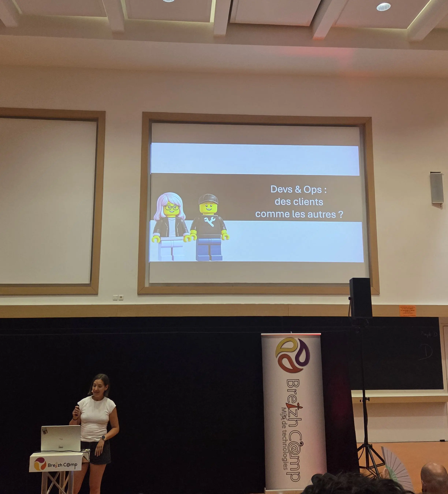

Fanny ré-explique l'importance de l'onboarding pour accueillir les développeurs, ainsi que les éléments importants sur des outils internes qui en général sont imposés, donc autant faire les choses le mieux possible pour embarquer nos développeurs.

Un outil mal conçu ne sera pas utilisé, et sera compensé par de la dette invisible (les fameux scripts shell dans un coin).

Bref, toutes les pratiques orientées utilisateur, qui sont habituellement mises en place sur les produits, ont aussi leur intérêt sur des outils internes.

### Rejouer une partie, rejouer le système de la matrice : des replays de jeux vidéo à l’event sourcing - par Pierre Fervel

Dans ce talk plutôt original, Pierre nous explique comment fonctionne un replay de jeu vidéo. Plutôt qu'enregistrer l'écran, le jeu enregistre les différents évènements (le joueur qui se déplace, qui saute), et le moment où ces évènements ont eu lieu.

Cette approche permet facilement de revoir une partie : il suffit de ré-exécuter les évènements avec le moteur du jeu.

Cette approche implique d'avoir développé le jeu en suivant les principes de l'event-sourcing.

L'event-sourcing permet alors d'avoir cette capacité à rejouer certains évènements, de "remonter dans le temps", et de pouvoir observer les états précédents d'un système.

 J'ai bien aimé les démos de ce talk, très claires pour illustrer l'approche.

## Le jeudi

### 🔑 🔒 A la découverte de l'algo de chiffrement Diffie-Hellman - par Brieuc Le Faucheur

Comment fonctionnent les algorithmes de chiffrement ? Comment Signal réussit à chiffrer des conversations en point à point ? C'est grâce aux algos de Diffie-Hellman. La promesse du talk était de faire l'impasse sur les maths, et de se concentrer sur les algos, promesse tenue.

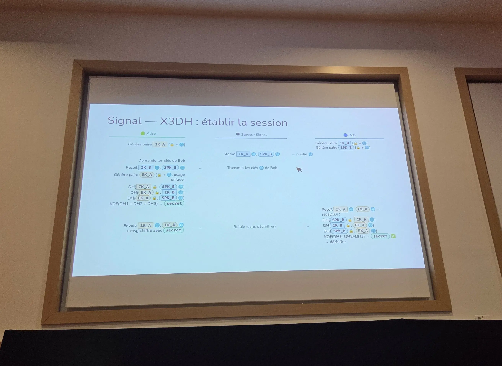

Un talk qui rappelle les cours théoriques que j'ai eu sur les bancs de la fac.

### Noms de domaines : la grande histoire des petites extensions - par Benoît Masson et Théo Bougé

Ça faisait un moment que j'avais envie de voir cette conférence, et j'ai donc sauté sur l'occasion.

Benoît et Théo travaillent chez OVH, dans les équipes qui gèrent les noms de domaines.
Ils nous expliquent quels sont les types de domaines, TLD pour _Top Level Domain_ (`.com` ou `.org` par exemple), CLD pour les _Countries_ (`.fr` ou `.be` donc).

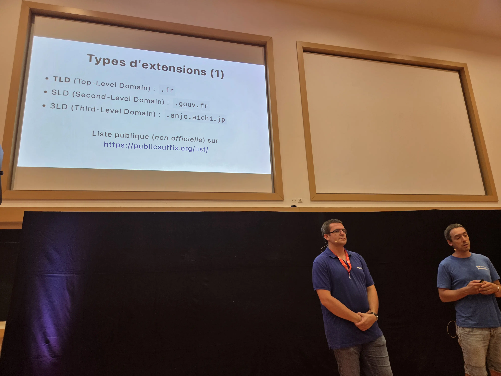

On revoit l'historique des domaines, et les hypes qui sont liées, comme le `.ai` qui appartient à l'île d'Anguilla, et les aspects géo-politiques liés à certains domaines étant sous la gouvernance d'états pas toujours très cool.

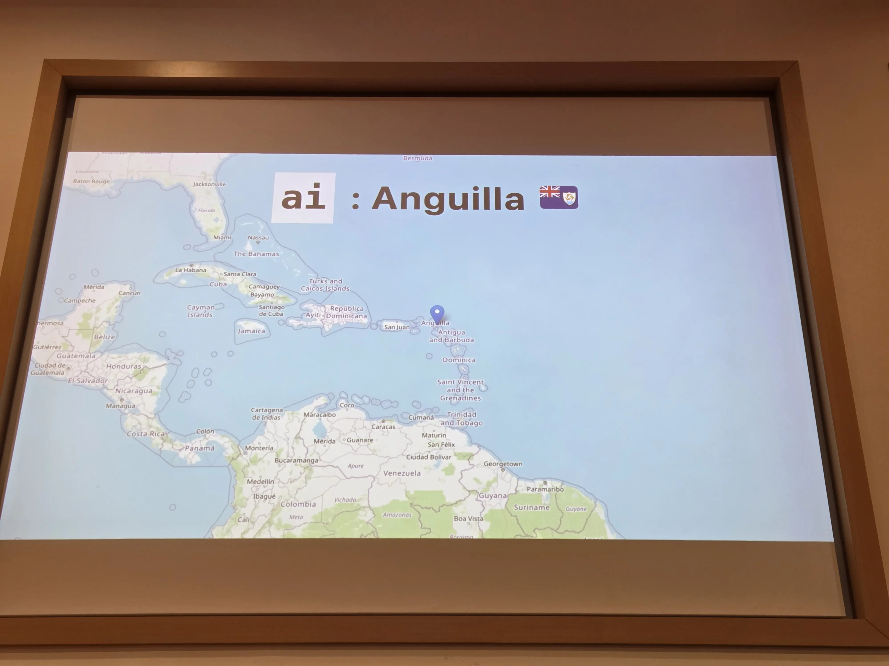

Mention spéciale pour le domaine `.sucks`, qui se vend plutôt bien _a priori_ (surtout pour éviter le squatting).

### Green Architecture : moins de gras, plus d’impact, plus d'efficacité ! - par Thierno Diallo et David De Carvalho

Thierno et David on présenté rapidement sur ce tools-in-actions le framework "API Green Score".
Le but étant de mesurer l'impact environnemental d'une API, d'obtenir une note, et de viser à l'améliorer.

C'était aussi pour moi l'occasion de re-croiser le pote Thierno, qui est maintenant un habitué des conférences sur ce type de sujet.

### Souveraineté numérique, quelles solutions pour quels enjeux ? - par Ambre Person

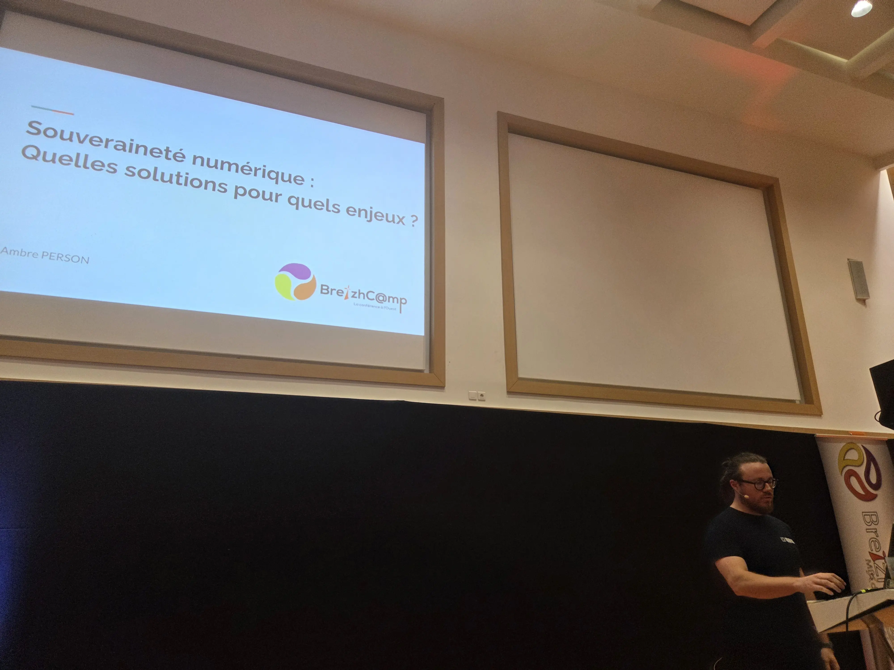

Dans ce format court, Ambre remet en avant les enjeux liés à la souveraineté numérique, les risques de dépendance, de coupure, les expositions aux lois extra-territoriales.

Le message est clair et bien porté.

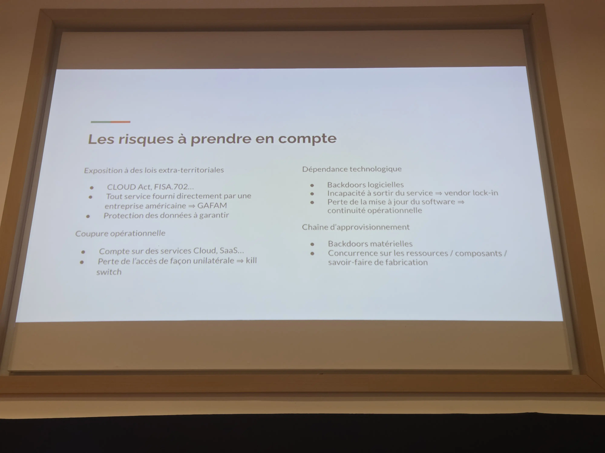

## Le vendredi

### Enshittification, ou la face cachée du numérique - par Karine Sabatier

Pourquoi les entreprises dégradent-elles leurs produits, au détriment des utilisateurs : pour gaver les actionnaires, qui ont financé la gratuité !

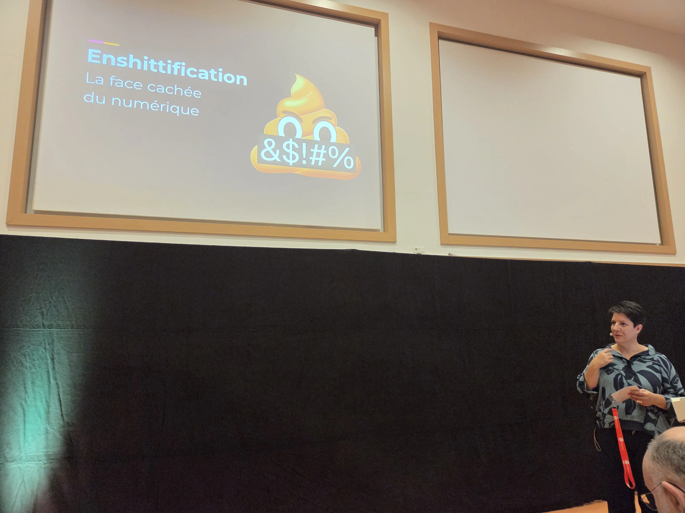

Karine nous explique le phénomène d'_Enshittification_, qu'on pourrait traduire par "merdification", avec trois étapes très facilement identifiables.

Je ne m'attendais pas à ce que ce phénomêne soit aussi bien documenté et aussi délibéré.

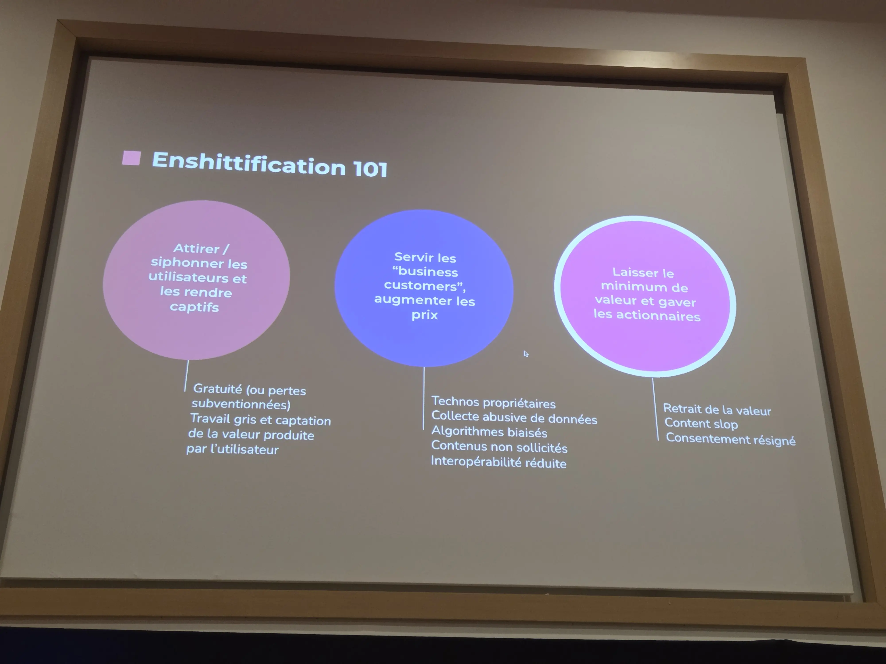

On y redécouvre aussi le concept de travail gris, qui a servit à alimenter les algorithmes et les IA.

C'est édifiant.

### Let's play Factorio

Cette fois, j'avais la chance de donner mon talk juste après la keynote du vendredi.

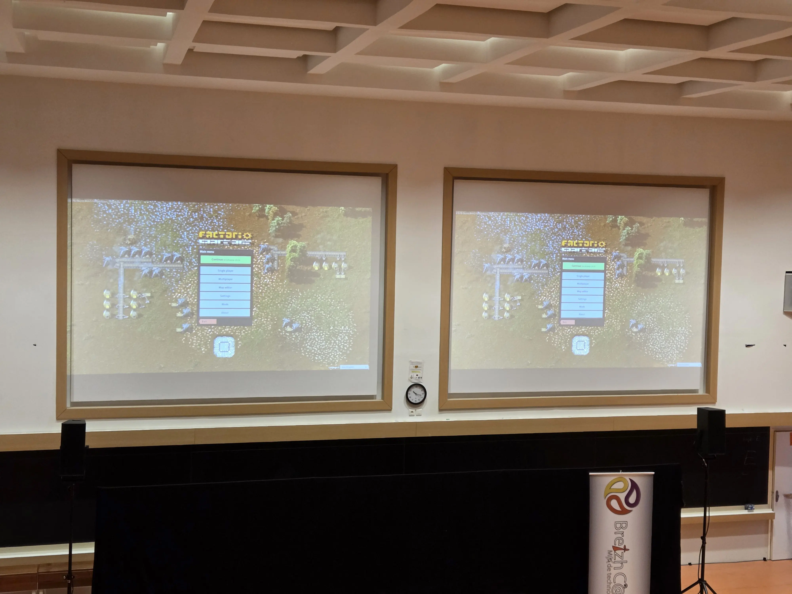

J'ai eu un public plutôt nombreux, malgré la chaleur dans les amphis.
J'ai aussi passé un bon moment et le talk a encore une fois bien marché, et les feedbacks ont été généreux.

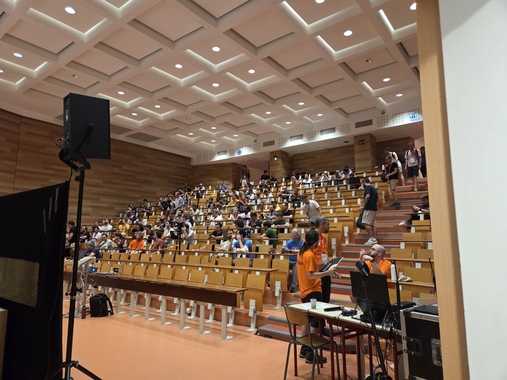

### Petit guide pratique des UUID - par Maxime Reynier

Dans ce quicky, Maxime présente les différentes normes UUID (on connaît surtout la v4 en fait).

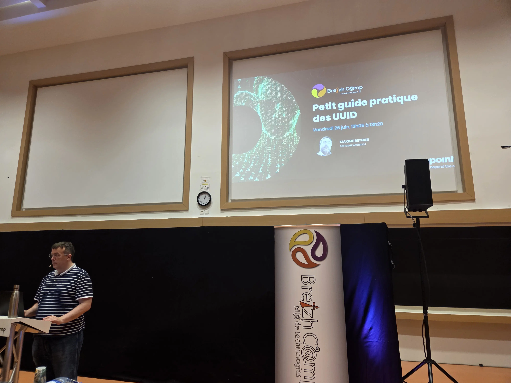

J'y découvre que le numéro de la version est visible directement dans l'UUID (xxxxx-xxxx-4xxx-xxxx-xxxxxx).

La version 7 introduit un timestamp et permet de trier les données, ce qui est particulièrement intéressant pour des identifiants.

### Direct en production ! - par Christian Sperandio

Hot Take !

Christian nous propose d'arrêter d'utiliser des environnements hors-prod.
Après tout, les installations en production échouent quand même !

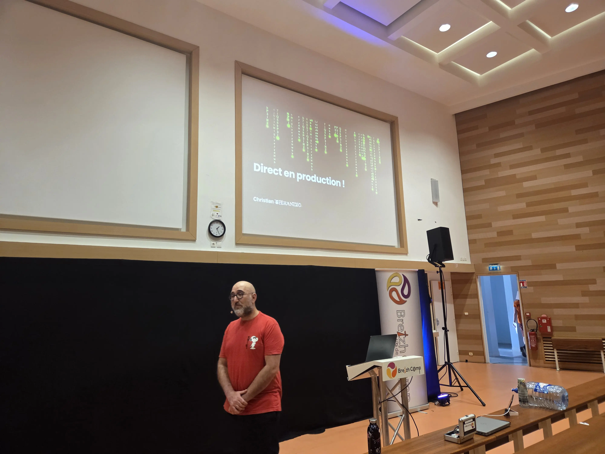

Une stratégie de feature-flipping est essentielle, mais j'ai du mal à m'imaginer travailler directement en production avec certaines dépendances (paiements par exemple).

### Rust pour le développement d'applications métier haut-niveau ! 🦀 - par Stéphane Trebel

Mon coup de coeur de ce Breizhcamp.
Je ne fais pas de Rust, en tout cas pas encore.

Stéphane nous présente avec un ton très cool et beaucoup d'humour les features de son langage pref.

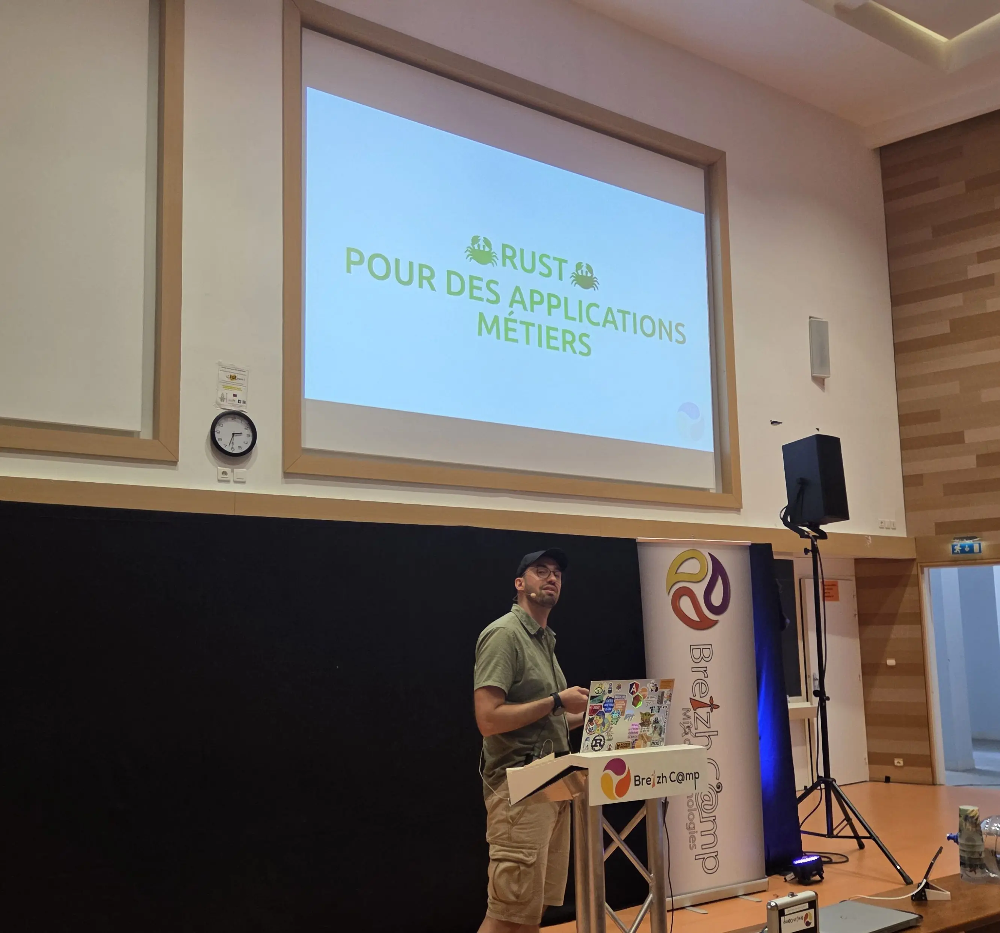

Et bien ça donne envie de tester.

Il nous montre aussi quelques frameworks et librairies, qui permettent de faire tout ce qu'on souhaite en Rust, qui n'est clairement pas cantonné aux CLI ou au Kernels.

### 🧰 Les dev containers, la boîte à outils ultime pour les devs ? - par Stéphane Philippart

Stéphane nous présente dans un tools-in-action les dev containers, qui facilitent l'on-boarding des développeurs : il n'y a qu'a avoir Docker d'installé, et il suffit d'écrire un fichier Json !

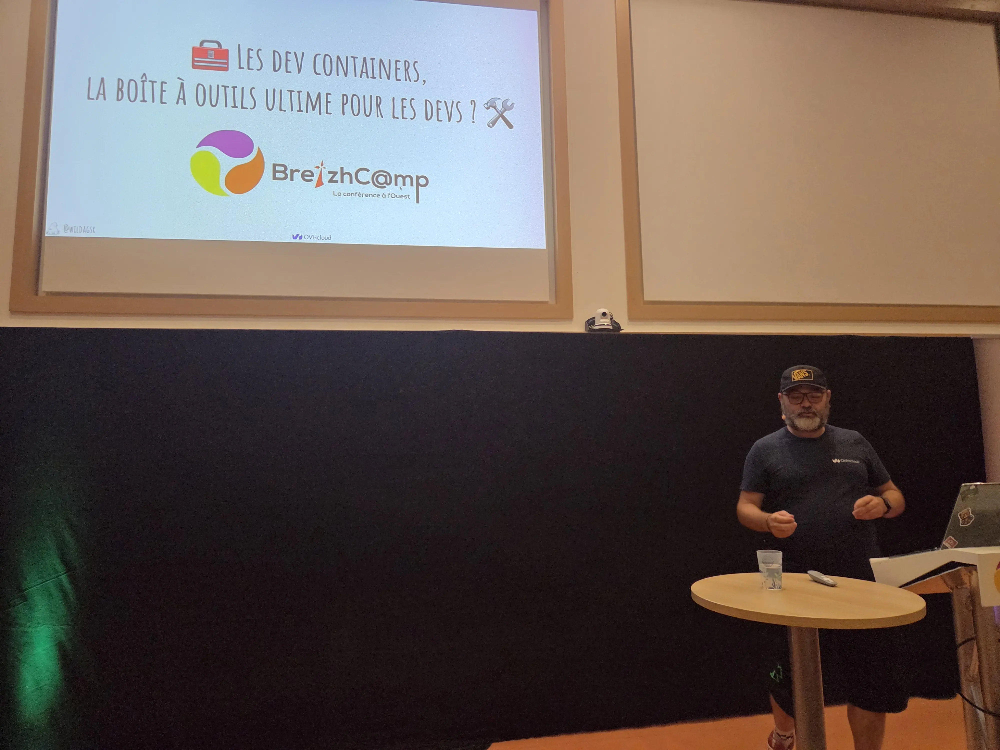

C'est également pratique lorsqu'on travaille sur plusieurs machines différentes, pour s'assurer que la configuration soit bien répliquée.

Il nous explique aussi comment créer notre propre "plugin" et le publier, afin de faciliter l'utilisation d'une stack complète.

Le gros point noir reste l'intégration qui est surtout bien gérée avec VSCode, mais IntelliJ a amélioré son intégration depuis quelques versions.

### Keynote de fermeture

En Keynote de fermeture, l'équipe de Breizhcamp a pris la parole pour expliquer les dessous de la conférence, et ce qu'implique d'être speaker, de la rédaction du CFP au jour J sur scène.

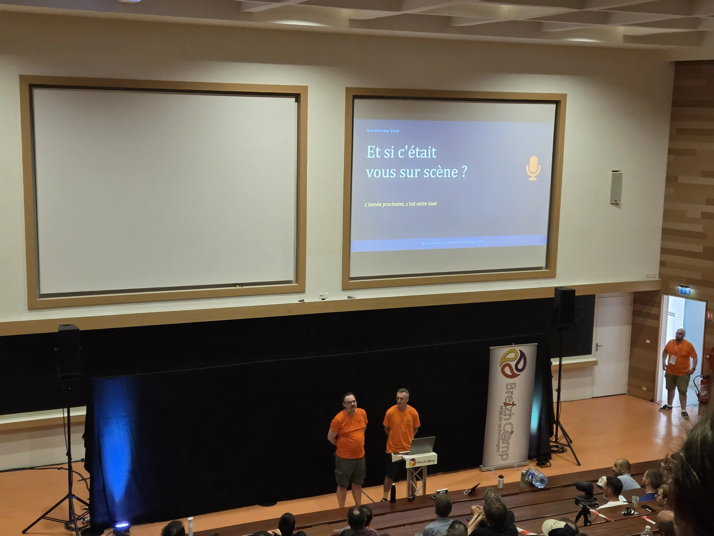

C'était un beau message d'encouragement, j'espère que le message fera mouche et que de nouvelles personnes candidateront !
