Ce début d'été, j'étais en marathon de conférences. DevLille, Tech'Work à Lyon, Breizhcamp à Rennes, et Riviera Dev à Sophia Antipolis.

Je vous raconte tout ça : ce que j'ai vu, ce que j'ai apprécié.

<!--more-->

## Riviera Dev

Début juillet, c'est Riviera Dev, la dernière conférence avant les vacances.
Et il y a bien un air de vacances à Sophia Antipolis, les accents chantants, les cigales et le soleil.

C'était également mon premier Riviera Dev, et je ne savais pas vraiment à quoi m'attendre.

Mention spéciale pour le camion Barista, qui préparait des cafés glacés incroyables (le cold brew, une pépite).

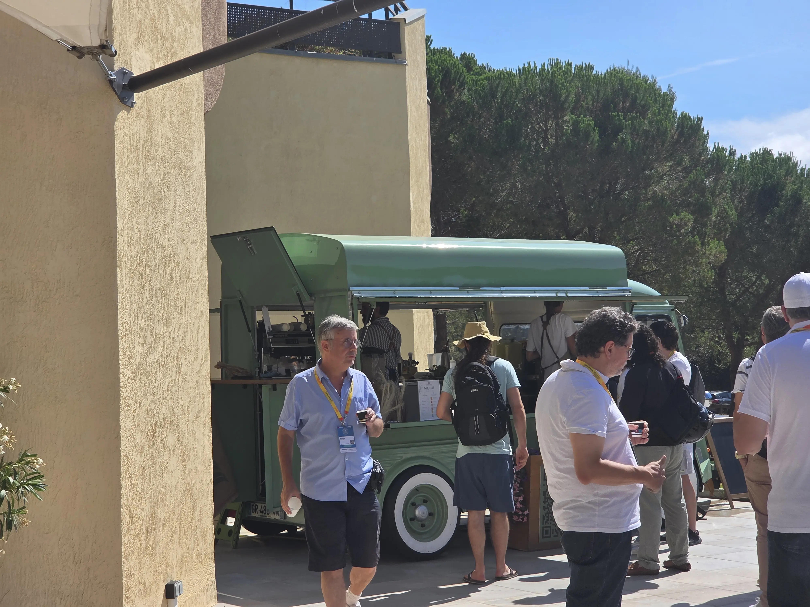

## Le lundi

Le lundi est la journée consacrée aux deep-dive et aux labs.
Cette journée accueille moins de monde que les autres (surtout les speakers qui sont présents les 3 jours).
Je ne suis pas habituellement un grand fan de ces formats, mais je me suis laissé porté par les sujets.

### Hackez votre supply chain pour apprendre à la sécuriser - par Marc Langlais et Sherine Khoury

J'ai donc entamé mon Riviera Dev avec trois heures de sécurité !
Marc et Sherine on parcouru toute la supply-chain, de la production de code, au build, en passant par les dépendance et la distribution de binaires.

À chaque étape, un attaquant peut intervenir, et prendre le contrôle, injecter des failles etc.
Les démos étaient assez impressionnantes, avec des attaques qui tiraient parti des pipelines de CI pour extraire des secrets, ou qui venaient remplacer les images de base pour y introduire des binaires malveillants.

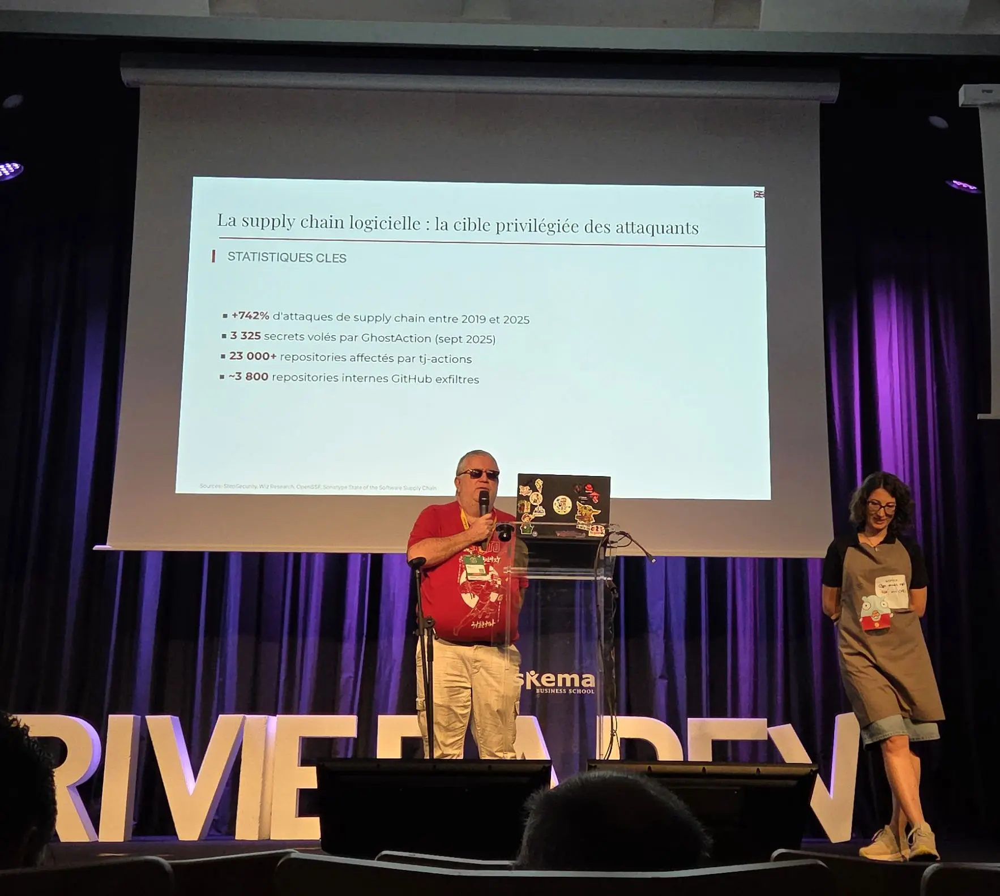

Beaucoup d'outils ont été listés pour se protéger, signer les images, rechercher les secrets, générer des SBOMs.

Un talk très riche !

### Initier votre démarche Platform Engineering - par Frederic Leger et Émilien Escalle

Je suis déjà familier des démarches de Platform Engineering, j'étais donc venu à ce lab pour découvrir d'autres approches (en particulier ArgoCD que je connais moins).

En petits groupes, nous avons repris et orchestré des pipelines Github actions qui étaient fournis, pour déployer une application sur des environnement de test et de production.

J'ai bien aimé l'utilisation de `mise` ainsi que le début de "ChatOps", avec des déploiements déclenchés par des commandes `/deploy` à indiquer dans les PR Github.

L'atelier a plutôt bien fonctionné, avec un déploiement qui était fonctionnel à la fin des trois heures.

## Le mardi

Le mardi et mercredi sont donc des journées de conférence classique.

Après les mots d'introduction et les keynotes, a lieu un évènement un peu particulier appelé "le marché aux poissons".
Tous les speakeurs montent alors sur scène et ont trente secondes pour pitcher leur talk.
C'est assez inhabituel et plein d'humour.

Une des particularités de Riviera Dev est d'avoir des sujets atypiques, nommés "We're not just coders" : ateliers de yoga, de danse, de barbecue. Tout y passe.

J'ai donc testé ces formats, afin de passer aussi un peu de temps de détente.

### Keynote d'ouverture

Comme pour beaucoup de conférences en ce moment, l'équipe de Riviera Dev a commencé par prendre la parole pour remercier les sponsors et faire un point "budget" en toute transparence.

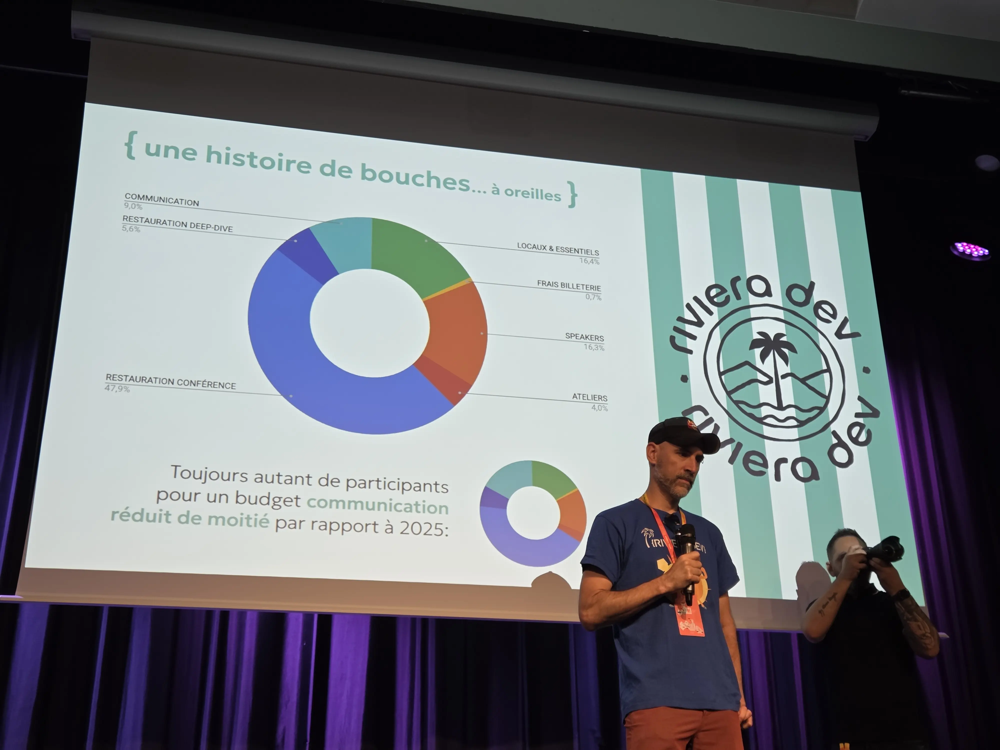

La restauration représente près de 50% du budget de la conférence ! Il faut dire qu'on y mange bien !

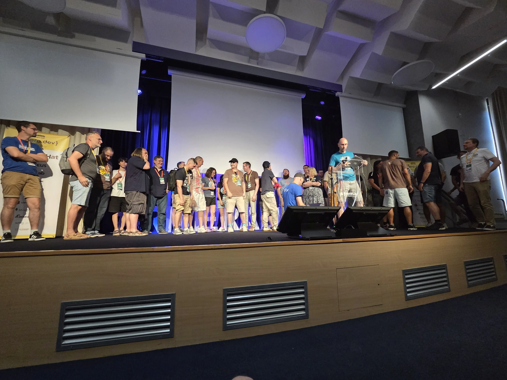

### Bio-Refactoring : Migrez votre posture vers une architecture fluide - par Raphaël Semeteys et Hajer Mabrouk

Pour bien commencer la journée, un premier atelier "We're not just coders".
Raph et Hajer nous proposent un atelier de mouvements de "recalibrage" corporel, un peu dans l'esprit du Yoga, mais beaucoup plus facile d'accès.

Nous y avons fait des mouvements simples, en musique, pour nous reconnecter avec notre corps.

C'était très chouette de démarrer la journée comme ça !

### JBang, un fichier Java pour les gouverner tous ? - par Stéphane Philippart

Stéphane a accepté de remplacer au pied levé une autre personne absente.

Il nous a présenté JBang, avec sa syntaxe, sa gestion de dépendances, pour développer des petits scripts ou des CLI complets.

Le partage de scripts dans le catalogue et leur installation en une simple commande semble très pratique.

### Six and a half ridiculous things to do with Quarkus - par Holly Cummins

Holly nous présente plusieurs cas "d'usage", un générateur de meme, un outil de mesure de consommation énergétique qui mesure en "lemon-batteries", un filtre qui convertit du texte en "gen-alpha", une implémentation du langage "Rockstar" et une extension Minecraft qui pop des poules lorsqu'il y a un évènement dans l'appli.

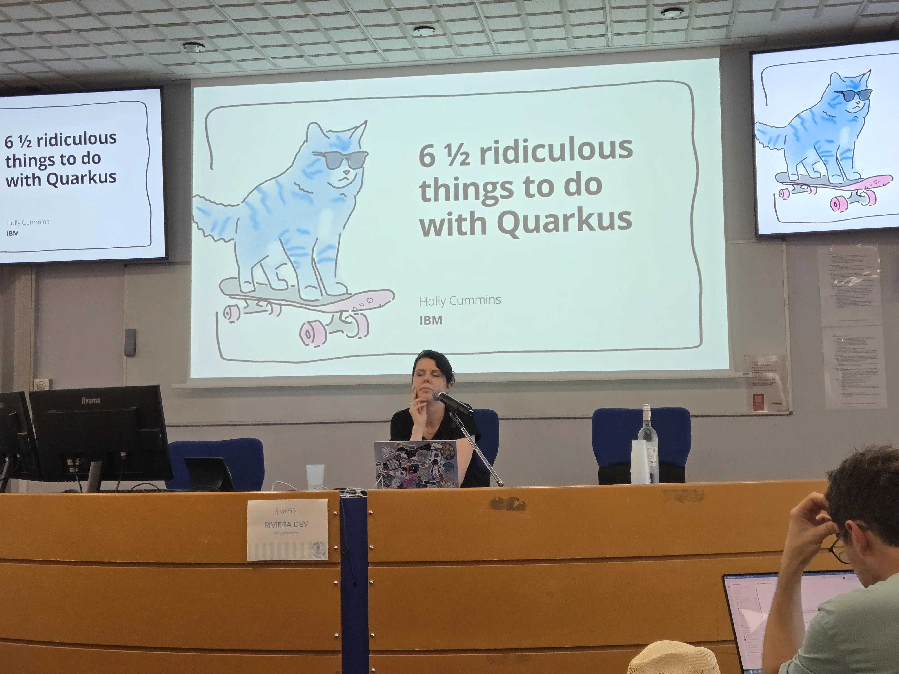

Très amusant de voir ce qui est possible de faire, et aussi de découvrir quelles sont les difficultés sur certains usages (qui aurait cru que AWT était compliqué à utiliser ahah)

### Makers de père en fils - par Matthias Gougouzian et Sylvain Gougouzian

Enfin j'avais l'occasion de voir ce talk !

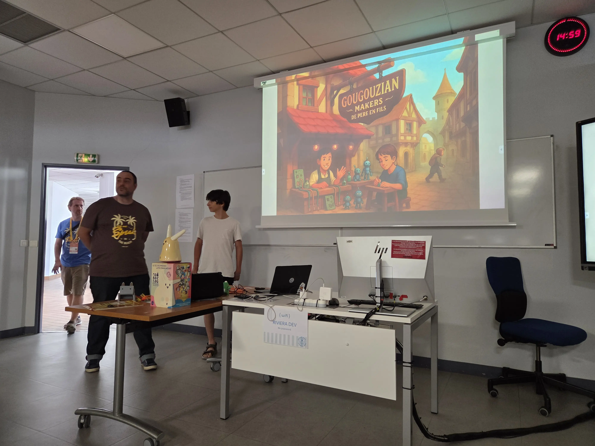

Sylvain et Matthias nous expliquent leur projet de refonte d'un Nabaztag, à base d'impression 3D, de petits moteurs, d'un peu de code et de Raspberry.

Une réelle démarche projet, avec un POC, un MVP, des choix pragmatiques.

C'était très touchant de voir ce talk père/fils, avec Matthias qui vanne son père dès qu'il se détend sur scène.

### Questions pour un conteneur - édition Supply Chain - par Aurélie Vache et Sherine Khoury

Une nouvelle édition des questionnaires intéractifs proposés par Aurélie et Sherine.

Cette fois, le sujet c'est la supply chain, ça tombe bien, j'ai assisté au deep-dive la veille.

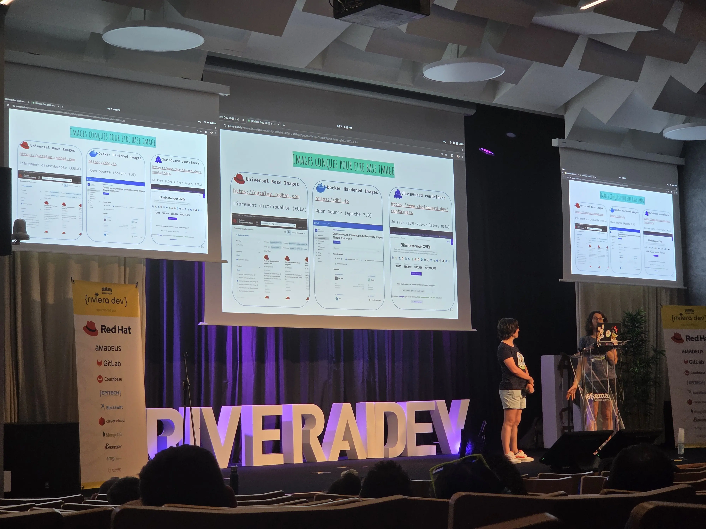

On y reparle d'outils, de SBOMs. C'est très poussé, même en ayant vu le deep-dive, j'ai fait plusieurs erreurs.

### Object Calisthenics : simplifier le code pour retrouver le métier - par Jacqueline Rwanyindo

La pote Jacqueline nous présente des règles de conception orientée objet, pour reprendre la main sur le code et remettre le code métier en avant.

On y retrouve les différents principes SOLID, la loi de Demeter, et des règles d'encapsulation.

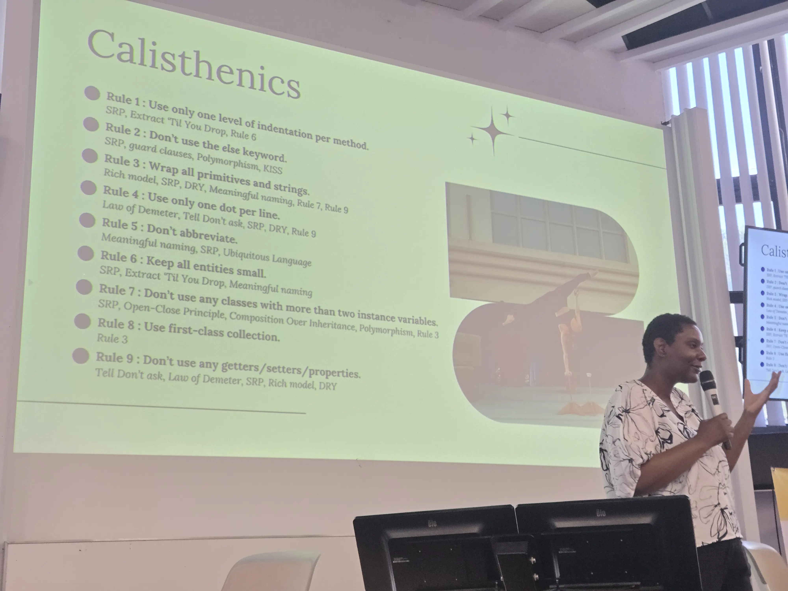

Le talk était très clair et bien illustré, parfait pour un petit format, je vais pouvoir le recommander à mes étudiants et aux développeurs junior que je croise.

## Le mercredi

### Les projets IT à l’heure de l’IA : quels bouleversements pour les équipes projets et les organisations ? - par Antoine Sabot-Durand et Laurence Dupré

Une Keynote sur l'IA, avec un regard particulier apporté sur les impacts humains. Comment de pas délester sa réflexion à l'IA, au risque de perdre compréhension, jugement et autonomie ? Comment former des seniors si on remplace les juniors par l'IA ?

Un des volets intéressants évoqués dans la conférence est le processus d'apprentissage, qui se retrouve amputé des phases de pratique (c'est l'IA qui fait) et des phases de correction (c'est l'IA qui s'est trompée). Le résultat : on n'apprends pas (comme quand on triche à un exam en fait).

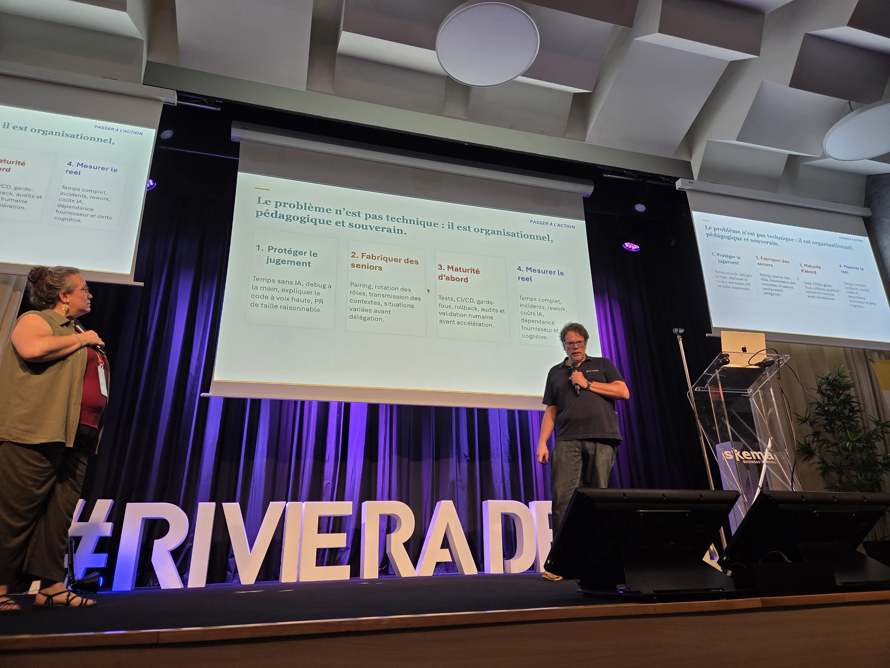

Autre angle marquant, l'importance de la gestion de la connaissance, qui ne repose plus sur du savoir humain, mais dans des documents markdown, dispersé dans des prompts et conversations IA.

### Let's play Factorio

J'avais la chance d'être dans le grand amphi pour cette nouvelle édition de ma conférence.

Après être passé au marché aux poissons en pitchant mon talk (gardez bien vos sièges, il n'y a que 500 places :D ), j'ai pu une nouvelle fois jouer ma game sur scène.

Le public était réceptif, j'ai encore eu des super feedbacks.

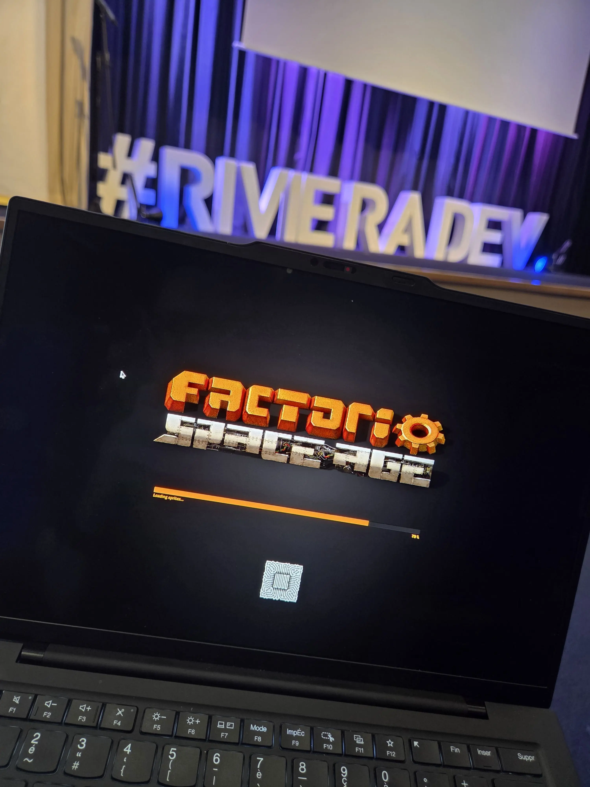

### Everyday I'm Shufflin'! - par Giovanna Monti

LMFAO !

Juste en lisant le titre de cette session, je sais que j'allais y assister.

Giovanna nous a proposé un petit cours de Shuffle Dance, dans la salle de gym, devant un miroir.
Elle nous a décomposé 2 mouvements de base, qu'on a ensuite enchaîné sur une petite chorégraphie bien cool.

C'était un peu cardio, on s'est bien amusés, probablement une des sessions qui m'a le plus marquée !

### À la découverte de Agent Development Kit (ADK) pour développer des agents IA en Java - par Guillaume Laforge

Guillaume nous présent ADK, avec pas mal de démos en Java.
On peut facilement orchestrer plusieurs agents, qui délèguent des traitements à d'autres, avec des gestions séquentielles ou en parallèle.
Chaque agent peut alors avoir son propre modèle et son propre prompt, et utiliser des _tools_ prédéfinis ou customisés.

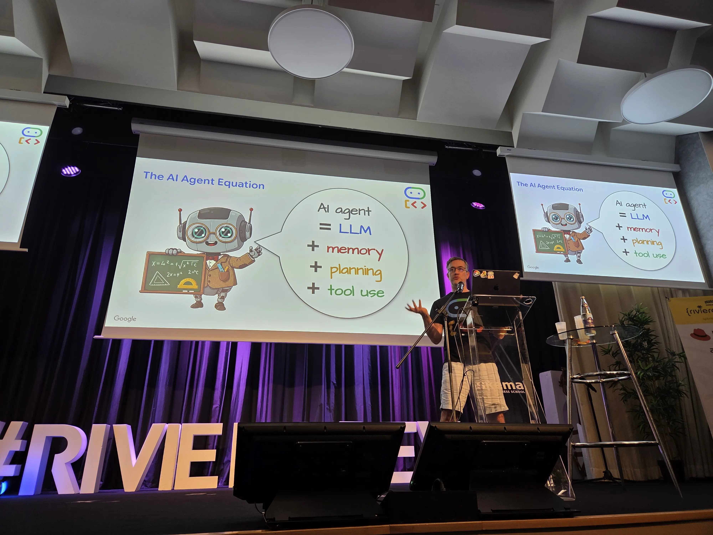

La lib a l'air bien faite et simple d'utilisation, à tester.

### Orchestrez vos agents IA pour organiser un dîner presque parfait - par Thierry Chantier

Même sujet que le précédent, orchestrer des agents IA, mais avec une autre approche.

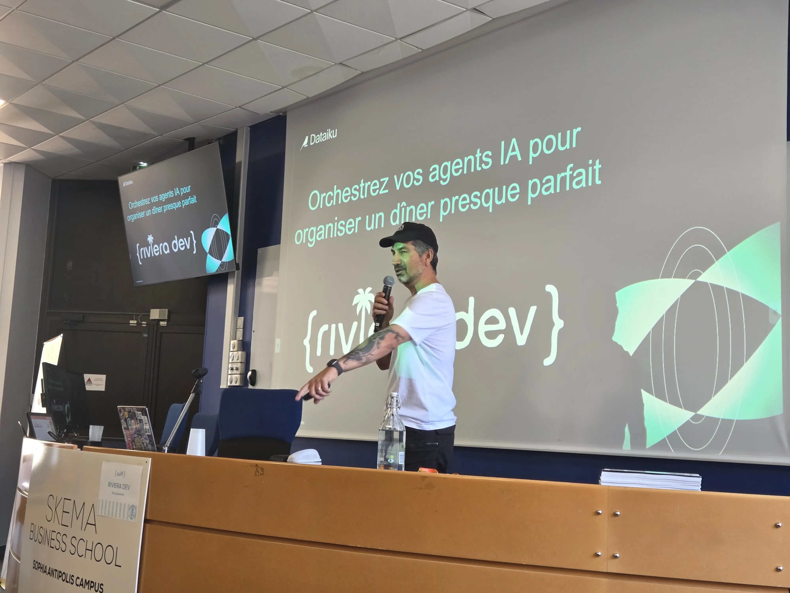

Cette fois-ci, on est en Python, avec un framework nommé CrewAi, avec plusieurs agents qui doivent concevoir un menu, et proposer le vin qui matche.

### How to paint miniatures like a Pro! - par Roberto Cortez

Encore une session "We're not just coders".

Roberto arrive avec son sac à dos, sort sa petite boite métallique, aligne les figurines, les peintures, et c'est parti.

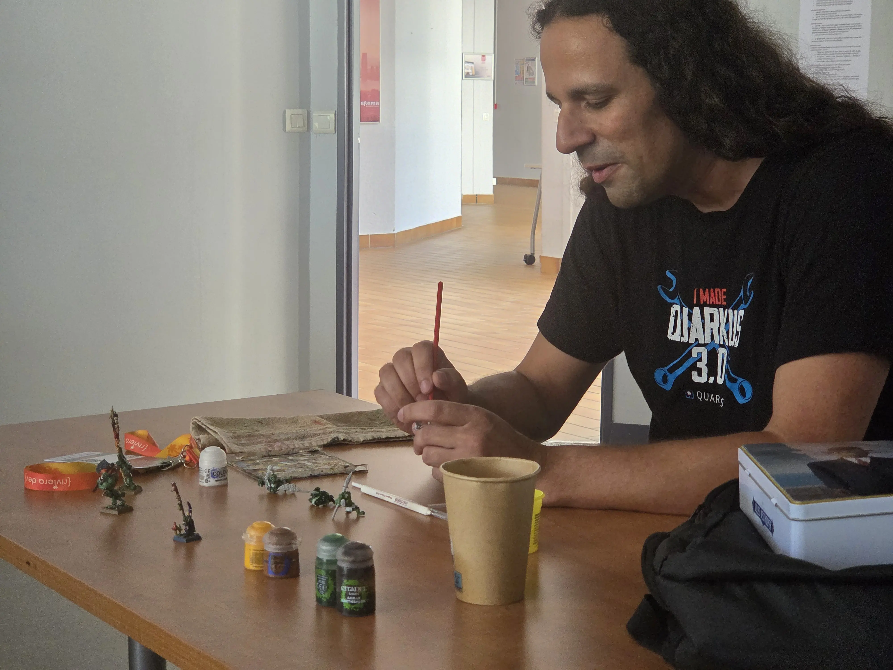

Il nous explique les différentes étapes de la peinture d'une figurine, de la sous-couche aux détails, les techniques de base, et il en profite pour peindre un peu quelques figurines.

La petite salle était pleine à craquer, c'était une session très sympa.

(J'ai encore des Warhammer 40k qui traînent dans un coin, je me retiens de ne pas re-sombrer dans ce hobby)

### Dual-Stack pour toujours ? La réalité d’IPv6 dans Kubernetes - par Donia Chaiehloudj

Donia nous présente l'état de déploiement d'IPv6, et le fonctionnement de Kubernetes.
Beaucoup de services restent disponible uniquement en IPv4 (coucou Github), donc l'approche dual-stack (chaque _Pod_ a 2 IP), permet d'être compatible au maximum.
Ça implique des ponts DNS et NAT (DNS64 et NAT64), qui complexifient les infrastructures.

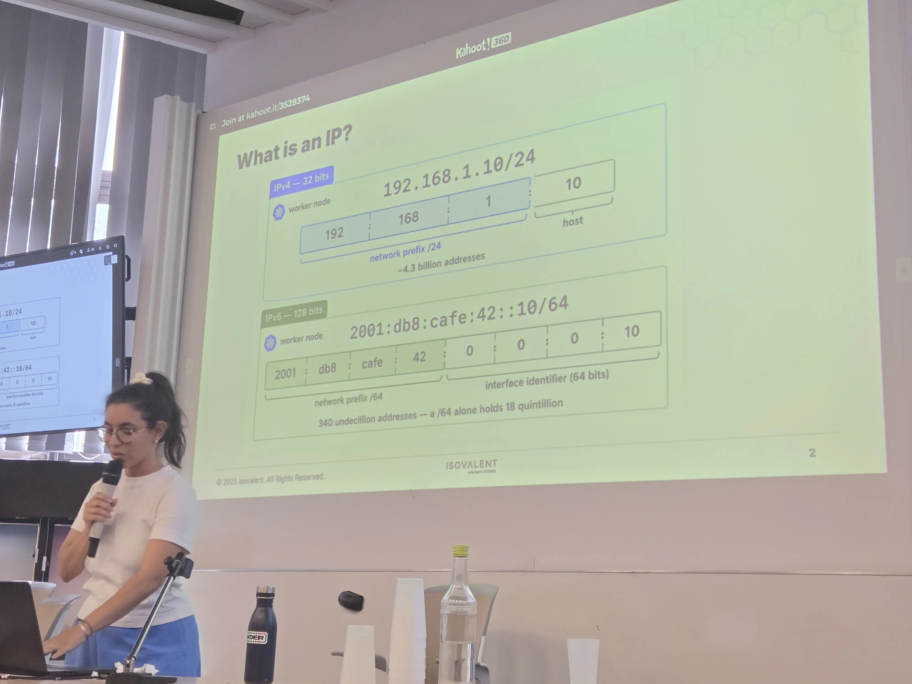

Un chouette talk réseau, très clair.

## La fin du Marathon

Riviera Dev était donc la dernière conférence de la saison.

Il est temps de prendre un repos bien mérité, vivement la rentrée quand même :D