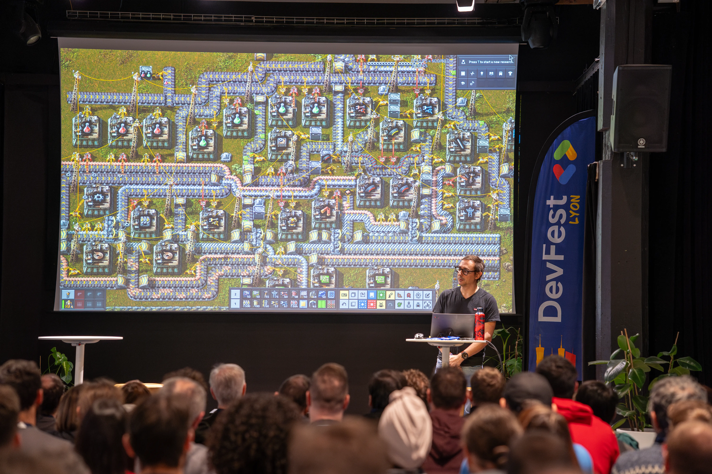
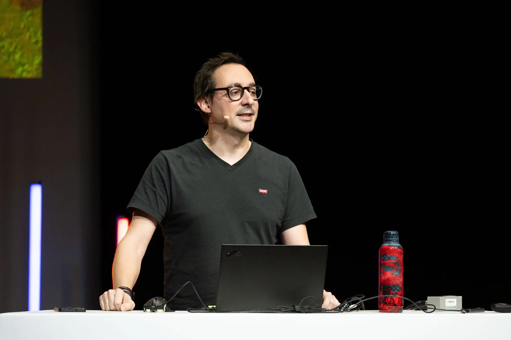
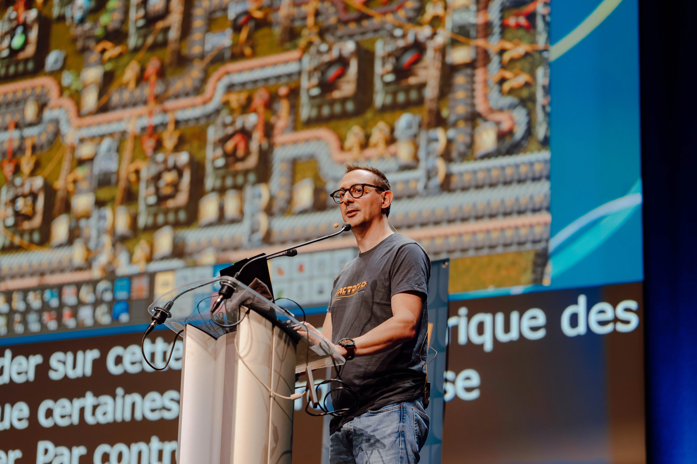
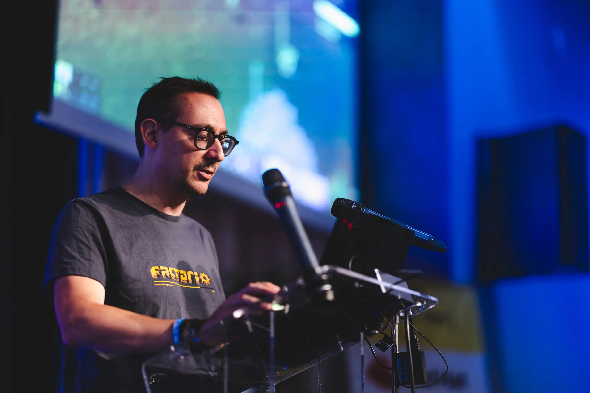
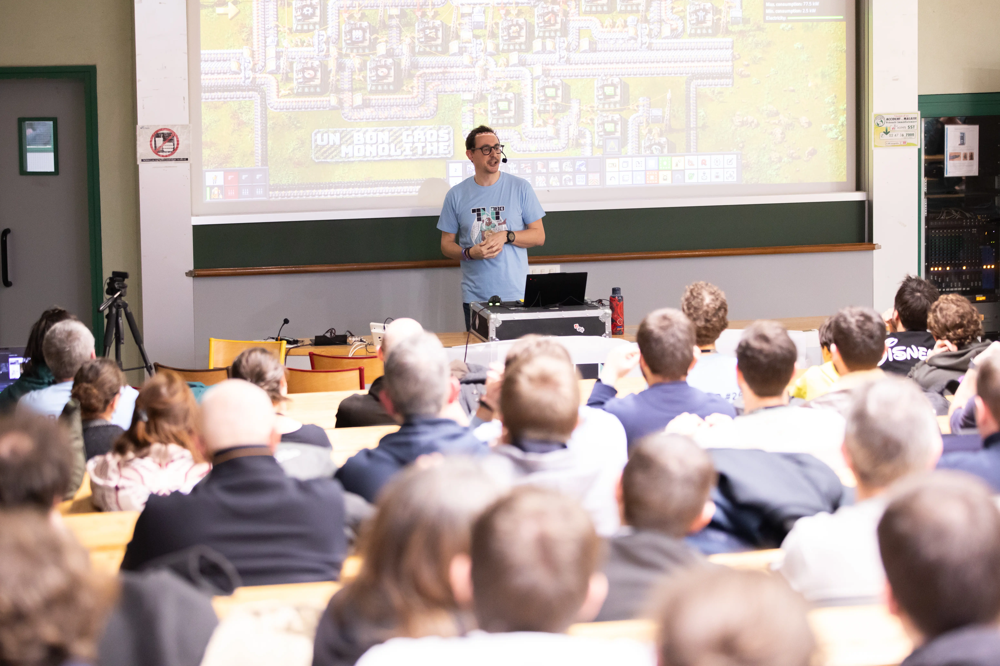
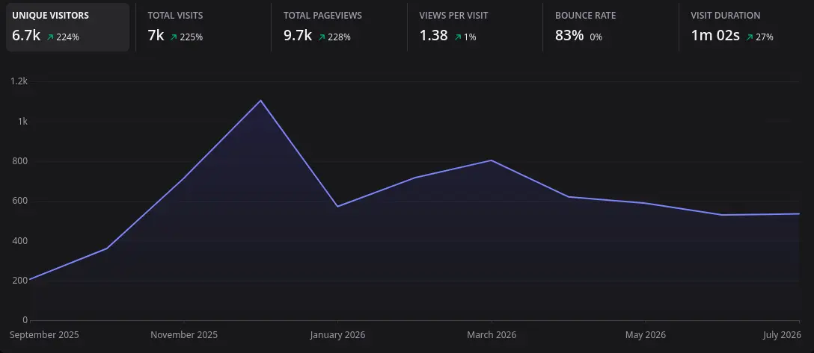
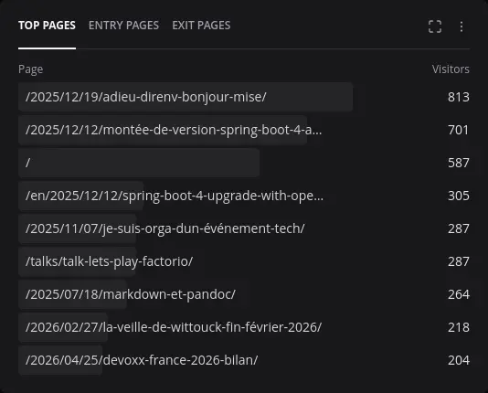
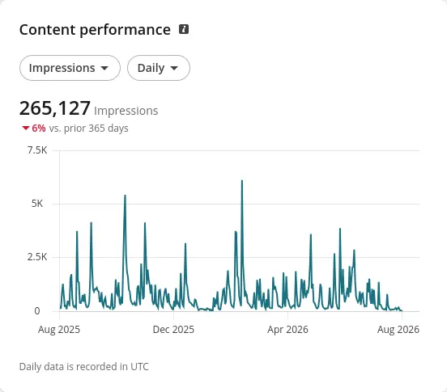

Comme l'année dernière, je profite de la journée avant mon départ en congés pour faire le bilan de mon année 2025-2026.
Beaucoup de conférences cette année, et pas mal d'articles sur ce blog.

<!--more-->

## Conférences et talks

Cette saison, j'ai eu le plaisir d'assister à pas mal (beaucoup) de conférences :

* DevFest Nantes 2025, les 16 et 17 octobre (en tant que speaker) ;
* Cloud Nord, le 23 octobre 2025 (en tant qu'orga) ;
* DevFest Lyon 2025, le 28 novembre 2025 (en tant que speaker) ;
* Epitech Summit Paris 2026, le 29 janvier (en tant que speaker) ;
* Cloud Native Day France 2026, le 3 février (en tant que participant pour une séance de dédicaces) ;
* Touraine Tech 2026, les 12 et 13 février (en tant que speaker) ;
* ENI Tech Fest 2026, le 24 mars (en tant que speaker pour une table ronde) ;
* Le Forum In Cyber Europe, le 2 avril (en tant que participant) ;
* Devoxx France 2026, du 22 au 24 avril (en tant que participant) ;
* DevLille 2026, les 11 et 12 juin (en tant que speaker et sponsor) ;
* Tech'Work Lyon 2026, le 18 juin (en tant que speaker) ;
* Breizhcamp 2026, du 24 au 26 juin (en tant que speaker) ;
* Riviera Dev, du 6 et 8 juillet (en tant que speaker).

Ça représente un total de 23 jours en conf. C'est plus de 10% de mon temps (sur une base de 200 jours / an).

J'ai aussi essuyé quelques de refus aux CFP :

* Cloud Toulouse
* Sunny Tech
* DevQuest
* BDX I/O
* MiXiT
* DevOxx France

On ne peut pas être pris partout, je pense que je suis déjà particulièrement chanceux d'avoir autant eu l'occasion d'être speaker cette année.

J'ai dû aussi annuler ma venue à SnowCamp 2026 à la dernière minute, désolé pour les orgas qui ont aussi dû gérer ça de leur côté.

### Mes talks

Pour la saison, j'avais travaillé trois sujets de talk :

* ["Let's play Factorio"](talks/talk-lets-play-factorio) : que j'avais donné pour la première fois en fin de saison dernière à Sunny Tech, et que j'ai joué 8 fois en tout
* ["Pimp My Shell"](talks/talk-pimp-my-shell) : un nouveau sujet sur mes environnements shell, que j'ai testé à Tech'Work
* "Docteur Cloud ☁️ : Comment j’ai appris à ne plus m’en faire 😟 et à aimer Donald Trump 💙" : un sujet autour de la souveraineté, qui a été refusé partout où je l'ai soumis, mais que j'avais donné à une session de remise de diplômes.

{class=images-grid-3}

J'ai encore des dates de prévues pour "Let's play Factorio". Je ne m'en lasse pas, donc je le soumettrai tant qu'il est accepté.
Avec le temps de préparation que j'ai passé sur ce talk, je suis réellement content d'avoir pu le donner autant, et qu'il aie reçu un tel accueil.

J'ai comptés dans les feedbacks (en cumulant les feedbacks des 8 sessions) :

* Drôle/Original: 569 feedbacks
* J'ai beaucoup appris: 183 feedbacks
* Super intéressant: 392 feedbacks
* Très bon orateur : 475 feedbacks

La lecture des messages laissés par le public est toujours très touchant.

J'avoue qu'en allant relire les messages, et en comptant ces feedbacks, j'en ai les larmes aux yeux 🥲.
Je n'ai pas compté les gens présents dans les différentes salles, mais je pense qu'environ 1500 personnes ont vu mon talk cette année. Ce qui est vertigineux.

Merci d'avoir fait confiance à ce talk 😊

Et désolé pour les personnes que j'ai embarqué dans le jeu 😅

### Le coût financier

23 jours de conférence, pour un total d'environ 2000 euros (sponsoring DevLille, billets FIC et DevOxx France)
24 nuits d'hôtel, pour un total d'environ 3000 euros.
9 allers-retour en train, pour un total d'environ 1200 euros
1 aller-retour en avion pour un montant de 500 euros.

Cela représente au total près de 6700 euros, et ce montant est en deçà de l'investissement réel, car je ne compte pas les frais de restauration ainsi que les différents taxis/uber et tickets de transport que j'ai dû acheter pour ces déplacements, ainsi que les quelques parkings pour ma voiture.

Encore une fois, si on ajoute à ces montants le "manque à gagner" lié au fait que je ne vends pas mon temps sur ces journées, je suis à investissement de plus de 30 000 euros. 

Évidemment, c'est mon statut de freelance qui me permet de faire ce choix et de pouvoir investir autant dans cette activité qui me fait kiffer.

Quand je vois ces chiffres, je me dis que j'ai vraiment de la chance, et je suis content d'être capable de m'offrir ça.

### Cloud Nord

C'est la quatrième année que je m'implique dans cette conférence que j'affectionne particulièrement.

L'année dernière, nous avons dû réduire la voilure pour notre conférence.
Vous l'avez probablement vu ou lu ailleurs, les années ne sont pas bonnes pour les conférences en raison de la crise économique.
Les sponsors sont frileux. Les participants sont moins nombreux (les entreprises financent moins les billets).

J'en avait parlé longuement dans mon article [Je suis orga d'un événement tech](2025/11/07/je-suis-orga-dun-événement-tech/).

Cette année, je m'implique de nouveau dans l'organisation de la conférence.
Nous visons le même format que l'année dernière, pour ne pas prendre de risques.

Notre CFP a rencontré un joli succès (111 candidatures). Le gros du travail d'orga a été dépilé avant les vacances, on s'occupera des détails à la rentrée.
Le [programme](https://cloudnord.fr/schedule/day-1/) est chouette. On espère que le public sera content.

Nous avons déjà vendu environ 70 billets, ce qui est un bon début. La billetterie est ouverte [par ici](https://www.helloasso.com/associations/cloud-nord/evenements/cloudf-nord-2026) au passage.

## Les cours

Une des activités que j'apprécie également est l'enseignement.

Cette année, j'ai donné :

* 68 heures à l'Université de Lille sur les thèmes Java / Spring ;

Par manque de temps, j'ai arrêté d'enseigner dans les écoles privées "full-alternance".
Je pense que je ne reprendrai plus de cours avec ce type de structure (qui est aussi d'ailleurs en mal-être, avec les réformes de l'alternance et l'arrivée de l'IA).

Pour ces cours, comme depuis plusieurs années, j'ai la chance d'être soutenu par un sponsor qui finance une organisation dans laquelle mes étudiants déploient leurs TPs : Clever Cloud.

J'estime le coût de ces sponsorings à environ 300 euros au total.
C'est clairement un coût que je pourrais prendre à ma charge, mais le sponsoring permet d'éviter de devoir surveiller en permanence le billing associé à ces comptes, donc c'est un véritable plus.

Clever Cloud, si vous lisez ces lignes : un énorme merci à vous 💙

## Mon site

La saison 2025-2026 a été plutôt productive.

Cette saison, j'ai écrit 34 articles (en comptant celui-ci) que j'ai publiés ici.
C'est le double de l'année dernière (17).

Parmi ces articles, ["La veille de Wittouck"]() que j'ai lancée au mois de mars représente quinze articles.
J'ai atteint le rythme que je souhaitais, à savoir 1 ou 2 articles par mois sur cette série.

Mes feedbacks de conférence représentent huit articles.

Et j'ai écrit neuf articles "originaux", sur des sujets variés.

Pour la période du 1er septembre au 1er août, 6700 1800 personnes ont visité [codeka.io](https://codeka.io) (1800 l'année dernière), pour un total de 9700 pages lues (2600 l'année dernière).

Stonks.

L'article ayant eu le plus de succès est [Adieu `direnv`, Bonjour `mise`](2025/12/19/adieu-direnv-bonjour-mise/).
Cet article a pas mal été repartagé.

Chose intéressante, j'ai aussi maintenant pas mal de visites qui viennent de Google, 1800 sur les 6700.
Je n'ai pas particulièrement travaillé le SEO de mon site, donc c'est plutôt une bonne surprise.

J'ai aussi des visites qui proviennent de Microsoft Teams, Slack, Discord, qui sont probablement des partages internes (cool).

Très peu de visites provenant d'assistants IA.

Jettez un oeil à ma page [stats](stats/) si vous voulez voir les détails.

Pour la saison prochaine, je vais essayer de maintenir le rythme, aussi bien sur la veille, que sur les autres articles.

## Mes réseaux sociaux

Comme l'année dernière, j'ai réduit ma présence sur les réseaux sociaux à deux réseaux : [LinkedIn](https://www.linkedin.com/in/julien-wittouck/) et [Bluesky](https://bsky.app/profile/codeka.io).

Je poste principalement le contenu de ma veille, ainsi que mes articles. Sur Bluesky, je poste aussi du contenu plus "perso", comme les jeux auxquels je joue ou les séries que je regarde. Mon LinkedIn ne contient pas ce type de contenu plus perso.

J'ai extrait mes stats LinkedIn pour la rédaction de ce bilan, mes posts sur ce réseau on eu grosso-modo le même nombre d'affichages que l'année dernière.

## Jeux vidéos

Pour finir ce bilan, les jeux vidéos auxquels j'ai joué cette saison, il y en a une paire :

* Factorio (sans blague) ;
* Gran Turismo 7 (toujours de temps en temps, au volant) ;
* Power Wash Simulator 2 (mon cerveau est content quand je joue à ce jeu) ;
* Final Fantasy XVI (une belle histoire, un bon FF de mon point de vue) ;
* Need For Speed Unbound ;
* Ghost of Tsushima (j'ai adoré ce jeu) ;
* Lego Horizon Adventures
* Exit 8
* Clair Obscur : Expédition 33 (mon dieu quelle pépite)
* Monster Hunter Stories
* Far Cry 6
* Star Wars Outlaws
* Art of Rally
* Hardspace ShipBreakers (mon cerveau est aussi content quand je joue à ce jeu)

Le gros coup de coeur, c'est évidemment Clair Obscur : Expédition 33.
L'histoire, le gameplay, la DA, la musique. Tout est parfait.

J'apprends les morceaux de la BO "Lumière" et "Alicia" au piano, c'est fou à quel point ces morceaux filent des émotions.

## Perso

Je conclus ce bilan avec quelques éléments persos.
Je parle souvent de ce que je fais, mais peu souvent de moi, donc j'en profite un peu ici.

Suite à ma séparation au début de l'été (après plus de 10 ans de relation), j'ai pris un appartement en location, et j'ai déménagé fin-juillet.

Merci à tous les potes qui sont venus m'aider, ça fait du bien de se sentir soutenu.

Cet évènement m'a pas mal occupé l'esprit sur les mois de juin et juillet. Je n'ai pas réussi à avancer comme je le souhaitais sur d'autres projets.
Heureusement, mes déplacements en conférences cet été m'ont aussi permi de souffler, et de me sortir la tête de cette situation. Merci aux oreilles attentives à qui j'ai pu me confier et qui prennent des news de temps en temps💙 

Je suis plutôt content de l'aménagement que j'ai fait dans cet appart. J'ai réussi à dépiler quasiment tous les cartons, il me reste peu de choses à ranger (et un ou deux meubles à acheter).
Je repars à neuf, et avec l'esprit léger.

## La prochaine saison

Pour la prochaine saison, je m'attends à réduire un peu la voilure sur les conférences.
Je suis réaliste, je pense que cette année était exceptionnelle (merci Factorio).

J'espère quand même que mes prochains sujets seront toujours acceptés en conf, j'ai toujours envie de bouger et de faire ma veille à ces évènements.
Et si je ne suis pas sélectionné, je ferai quand-même le déplacement pour certains confs que j'ai beaucoup apprécié.

Je vais maintenir le rythme sur la publication de ce blog.
J'y ai pris goût. Je vois que je suis lu, même quand je ne communique pas mes articles sur les réseaux sociaux (il y a encore des gens qui utilisent les flux RSS).

J'espère aussi que je retrouverai un peu plus de temps pour des activités plus personnelles : un peu plus de gaming, un peu plus de ciné.
Je vais aussi prendre des cours de cuisine, peut-être de piano (auto-didacte ça a des limites), peut-être aussi quelques cours de danse pour rigoler, et passer le permis moto (ça fait un moment que j'en ai envie).

La prochaine saison va être chouette.
