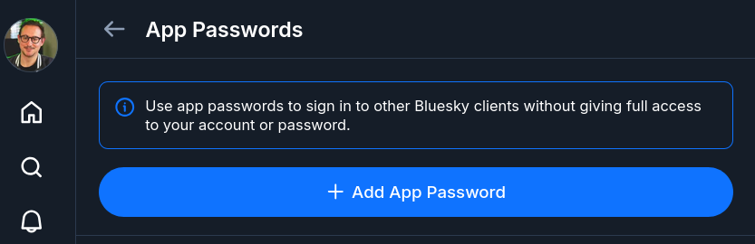
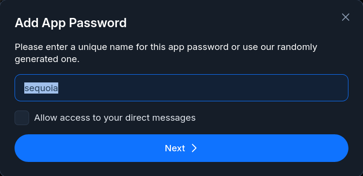
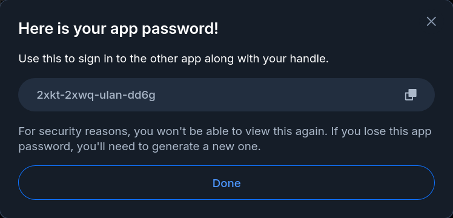

Je continue mon exploration d'AT Protocol.

Cette fois, j'ai essayé d'intégrer mon site sur AT Protocol avec standard.site.
Ça s'est plutôt révélé facile de mon côté, je vous explique ça.

<!--more-->

## standard.site

https://standard.site/ est une initiative visant à faciliter la publication de contenu long sur AT Protocol.

Le format des posts de Bluesky sont en effet plutôt orientés pour des contenus courts, au format micro-blogging.

[//]: # (TODO définition)
Là, c'est plutôt l'inverse, l'idée de standard.site est de proposer un _lexicon_ (je renviens sur la définition juste après), qui permet de stocker du contenu long, pages web, articles de blog, etc.

[//]: # (TODO add links to platforms)
Le projet est porté par des développeurs de plateformes de blogging qui s'appuient déjà sur AT Proto : Leaflet, Offprint et pckt.blog.

La promesse: rendre intéropérable ces plateformes (et les futures).
Plutôt que chaque plateforme n'utilise ses propres formats de données, le format est commun.

En plus de rendre la main aux utilisateurs sur l'hébergement de leurs données, la migration d'une plateforme à l'autre est maintenant directement possible, puisque le format est le même.
On peut aussi imaginer cross-poster sur les trois plateformes, ou pouvoir lire du contenu publié depuis une plateforme, depuis l'application d'une autre.

La promesse est élégante.

## Un peu de vocabulaire AT Proto

Pour la bonne compréhension de cet article, si vous n'êtes pas familier de AT Proto, il vous faut quelques notions basiques.

> Je vais rendre cette section la plus simple possible, histoire d'introduire uniquement le vocabulaire nécessaire. Je prends donc quelques raccourcis, et j'omets certains détails afin de ne pas complexifier le sujet.

Le _PDS_ (pour _Personal Data Server_) est le serveur qui stocke vos données. Ce _PDS_ peut être un de ceux hébergés par Bluesky, ou Eurosky, ou vous pouvez également l'auto-héberger.

Sur AT Proto, tous les éléments sont identifiés par des _URI_ (pour _Uniform Resource Identifier_).
Votre compte AT Proto est identifié par une URI du type "did:plc:XXXXXX".

Mon compte, que vous voyez sur Bluesky avec le handle `@CodeKaio` est identifié par l'URI `did:plc:a27wdjlmq3ebx4v5f2jpzvsk`.

Tout les éléments, post, likes, reposts, follows, etc, sont stockés dans le PDS associé à votre compte (Eurosky pour moi).
Chacun de ces éléments possède également une URI. On appelle ces éléments des _Records_. Un _Record_ est un simple objet JSON.

Voici encore pour exemple un post récent que j'ai fait sur Bluesky, qui a pour URI `at://did:plc:a27wdjlmq3ebx4v5f2jpzvsk/app.bsky.feed.post/3mucjlaofjk22`:

```json
{
  "text": "Bon, a priori c'est pas trop mal, on dirait que j'ai réussi à intégrer mon site avec standard.site\n\nJe vous prépare un court article qui décrit comment j'ai fait, c'est pas très compliqué.",
  "$type": "app.bsky.feed.post",
  "embed": {
    "$type": "app.bsky.embed.images",
    "images": [
      {
        "alt": "Screenshot de https://site-validator.fly.dev/ avec la validation d'une page de mon site.",
        "image": {
          "ref": {
            "$link": "bafkreic4p6b563fs3d5gbpgyngbpa6ngu5pn7kod67pseguxyw2vody2ru"
          },
          "size": 114277,
          "$type": "blob",
          "mimeType": "image/jpeg"
        },
        "aspectRatio": {
          "width": 1000,
          "height": 707
        }
      }
    ]
  },
  "langs": [
    "en"
  ],
  "facets": [
    {
      "index": {
        "byteEnd": 101,
        "byteStart": 88
      },
      "features": [
        {
          "uri": "https://standard.site",
          "$type": "app.bsky.richtext.facet#link"
        }
      ]
    }
  ],
  "createdAt": "2026-08-30T13:44:28.179Z"
}
```

> du JSON je vous disais

On y voit toute la structure d'un post, son contenu, et l'image associée.
Le dernier élément qui va nous intéresser est le `$type` d'un record, qui est `app.bsky.feed.post` dans l'exemple précédent.

Ce type définit quelle est la structure du _Record_, au sens d'un schéma JSON. Dans AT Protocol, ces schéma sont appelés des _Lexicon_.
Bluesky possède ses propres _Lexicon_ qui définissent les structures de ses objets.

Pour résumer, on a donc des _Lexicons_, qui définissent la structure des _Records_, les _Records_ sont stockés sur le _PDS_ d'un utilisateur.
Tous ces éléments possèdent leur propre _URI_.

## Comment fonctionne standard.site

_standard.site_ propose l'utilisation de deux _Lexicons_ principaux, permettant de déclarer du contenu:

* `standard.site.publication` qui permet de déclarer un site web ou un blog, qui possède comme attributs principaux une URL et un nom
* `standard.site.document` permet de déclarer une page de contenu, qui possède comme attributs principaux un titre, une date de publication, le contenu, et la référence du site qui contient le document

Donc pour publier du contenu sur AT Proto, il faut créer d'abord une _Publication_.

## Sequoia

Bien qu'il soit possible de créer ça à la main ou avec un bout de code, j'ai utilisé un CLI pour tout ça : `sequoia`

`sequoia` est un CLI simple, écrit en Node, qui permet de publier le contenu d'un site web statique sous la forme de _Records_ `standard.site.*`.

### Le setup

Rien de plus simple, comme j'utilise toujours `mise`, pour le setup de `sequoia` :

```shell
mise use npm:sequoia-cli
```

Pour pouvoir communiquer avec mon _PDS_, `sequoia` a besoin d'un jeton d'authentification. Ce jeton peut être obtenu de deux manières : avec une authentification interactive (OAuth2, avec mon login/mdp), ou avec un jeton _App Password_, qui permet de donner des droits à une appli (comme un compte de service).

J'ai choisi d'utiliser un jeton _App Password_ pour `sequoia`, et de le passer en variable d'environnement.
Cela me permet de le stocker de manière sécurisée avec `fnox`, et d'éviter de devoir faire des `sequoia login` sur toutes mes machines.
Ça permettra aussi à l'avenir de pouvoir exécuter des commandes `sequoia` depuis une intégration continue facilement.

La création d'un _App Password_ se fait sur Bluesky à cette URL : https://bsky.app/settings/app-passwords



Il suffit de donner un nom à l'app, puis de copier le jeton généré.





> Un des avantages des _App Password_ est qu'ils peuvent être révoqués, comme c'est le cas de celui du screenshot (pas la peine d'essayer de me 🏴‍☠️).
> Par contre, on ne peut pas les scoper (à certaines actions seulement), ce qui est un peu limitant du point de vue sécu, mais qui sera peut-être amélioré à l'avenir.

Une fois tous les éléments en ma possession, je crée mes deux variables d'environnement : `ATP_IDENTIFIER` avec mon identifiant de compte, et le `ATP_APP_PASSWORD` avec le jeton généré:

```bash
❯ mise set ATP_IDENTIFIER=codeka.io


❯ fnox set ATP_APP_PASSWORD
Enter secret value ************
✓ Set secret ATP_APP_PASSWORD
```


## Liens et références

Standard.site
  * Site web : https://standard.site/
  * Les lexicons sur Tangled : https://tangled.org/standard.site/lexicons

Sequoia :
  * Code sur Tangled : https://tangled.org/stevedylan.dev/sequoia
  * Site web : https://sequoia.pub

AT Protocol
  * Glossaire (en anglais) : https://atproto.com/guides/glossary

Bluesky
  * Lexicons : https://pdsls.dev/at://did:plc:4v4y5r3lwsbtmsxhile2ljac/com.atproto.lexicon.schema?reverse=true
* App Passwords : https://bsky.app/settings/app-passwords
* 