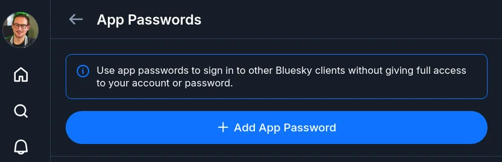
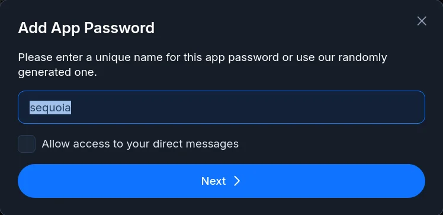
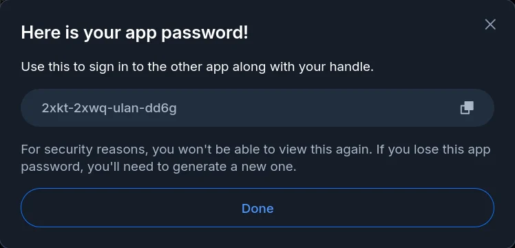
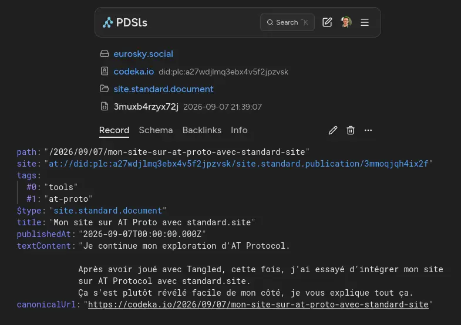
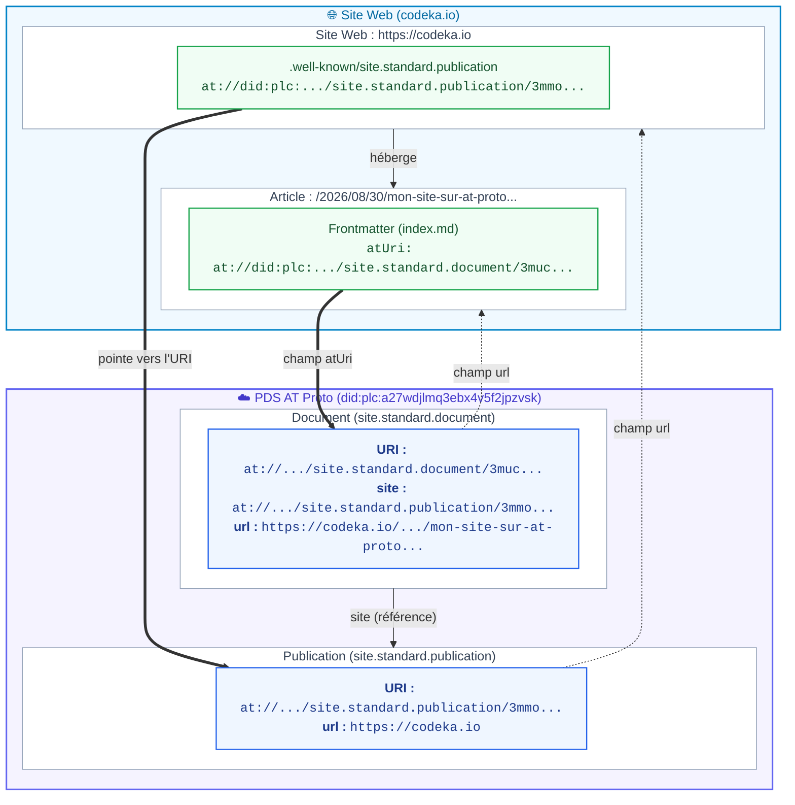
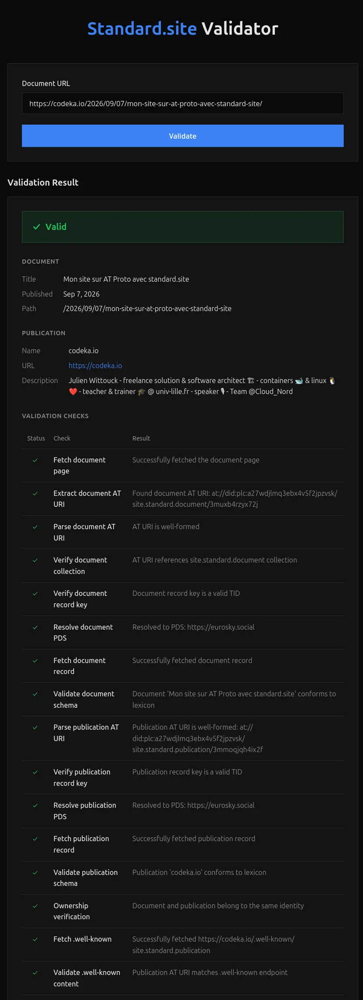
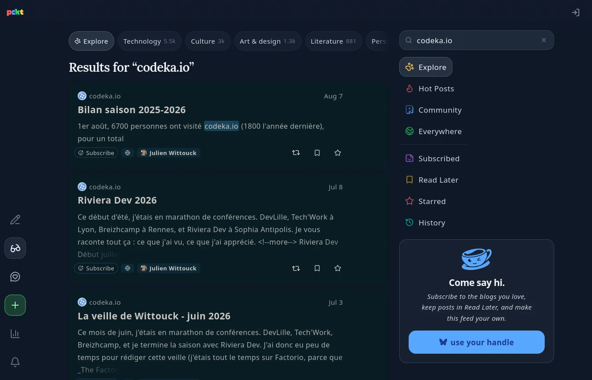
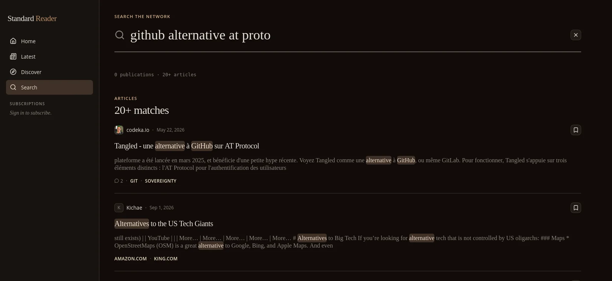

Je continue mon exploration d'AT Protocol.

Après avoir joué avec [Tangled](/2026/05/22/tangled/), cette fois, j'ai essayé d'intégrer mon site sur AT Protocol avec [standard.site](https://standard.site).
Ça s'est plutôt révélé facile de mon côté, je vous explique tout ça.

<!--more-->

## Un peu de vocabulaire AT Proto

Pour la bonne compréhension de cet article, si vous n'êtes pas familier de AT Proto, il vous faut quelques notions basiques.

> Je vais rendre cette section la plus simple possible, histoire d'introduire uniquement le vocabulaire nécessaire. Je prends donc quelques raccourcis, et j'omets certains détails afin de ne pas complexifier le sujet.

[AT Protocol](https://atproto.com/) (ou AT Proto) est le protocole de données développé et utilisé par Bluesky.
Ce protocole se veut ouvert ; les données sont publiques ; et extensible ; des applications autres que Bluesky pouvant utiliser le protocole pour y lire et écrire des données.

Les données ; vos posts Bluesky, likes et autres ; sont stockées dans un _PDS_ (pour _Personal Data Server_). Le _PDS_ peut être un de ceux hébergés par Bluesky, ou Eurosky, ou vous pouvez également l'auto-héberger.

Sur AT Proto, tous les éléments sont identifiés par des _URI_ (pour _Uniform Resource Identifier_).
Votre compte AT Proto est lui aussi identifié par une URI du type `did:plc:XXXXXX`.

Par exemple, mon compte, que vous voyez sur Bluesky avec le handle `@CodeKaio` est identifié par l'URI `did:plc:a27wdjlmq3ebx4v5f2jpzvsk`.

Tous les éléments ; post, likes, reposts, follows, etc ; sont stockés dans le _PDS_ associé à votre compte (Eurosky pour moi).
Chacun de ces éléments possède également une _URI_. On appelle ces éléments des _Records_. Un _Record_ est alors un simple objet JSON.

Voici encore, pour exemple, un post récent que j'ai fait sur Bluesky qui a pour URI `at://did:plc:a27wdjlmq3ebx4v5f2jpzvsk/app.bsky.feed.post/3mucjlaofjk22`:

```json
{
  "text": "Bon, a priori c'est pas trop mal, on dirait que j'ai réussi à intégrer mon site avec standard.site\n\nJe vous prépare un court article qui décrit comment j'ai fait, c'est pas très compliqué.",
  "$type": "app.bsky.feed.post",
  "embed": {
    "$type": "app.bsky.embed.images",
    "images": [
      {
        "alt": "Screenshot de https://site-validator.fly.dev/ avec la validation d'une page de mon site.",
        "image": {
          "ref": {
            "$link": "bafkreic4p6b563fs3d5gbpgyngbpa6ngu5pn7kod67pseguxyw2vody2ru"
          },
          "size": 114277,
          "$type": "blob",
          "mimeType": "image/jpeg"
        },
        "aspectRatio": {
          "width": 1000,
          "height": 707
        }
      }
    ]
  },
  "langs": [
    "en"
  ],
  "facets": [
    {
      "index": {
        "byteEnd": 101,
        "byteStart": 88
      },
      "features": [
        {
          "uri": "https://standard.site",
          "$type": "app.bsky.richtext.facet#link"
        }
      ]
    }
  ],
  "createdAt": "2026-08-30T13:44:28.179Z"
}
```

> du JSON je vous disais.
> 
> et si vous observez l'URI, vous verrez `at:// <compte> / <type> / <record>`,
> on ne peut s'empêcher de faire le paralèlle avec des URI `http:// <host> / <path>`

On y voit toute la structure d'un post, son contenu, et l'image associée.
Le dernier élément qui va nous intéresser est le `$type` d'un record, qui est `app.bsky.feed.post` dans l'exemple précédent.

Ce type définit quelle est la structure du _Record_, au sens d'un schéma JSON. Dans AT Protocol, ces schémas sont appelés des _Lexicon_.
Bluesky possède ses propres _Lexicon_ qui définissent les structures de ses objets.

> Pour résumer, on a donc des _Lexicons_, qui définissent la structure des _Records_, les _Records_ sont stockés sur le _PDS_ d'un utilisateur.
Tous ces éléments possèdent leur propre _URI_.

Maintenant que le vocabulaire de base est posé, on peut attaquer le vif du sujet.

## standard.site

[standard.site](https://standard.site) est une initiative visant à faciliter la publication de contenu long sur AT Protocol.

Initialement, le format des posts de Bluesky est en effet plutôt orienté pour des contenus courts, au format micro-blogging, avec une limitation à 300 caractères.
300 caractères, c'est hyper court (la phrase précédente en fait déjà 150, et ce paragraphe en fait 470, c'est pour dire), c'est pourquoi on voit beaucoup de personnes faire des _threads_, des suites de posts, qui forment un contenu complet.
C'est peu pratique à lire, mais c'est un moyen détourné efficace.

L'idée de _standard.site_ est de proposer un _Lexicon_ (une structure de _Records_ AT Proto si vous avez bien suivi), qui permet de stocker du contenu long, comme des pages web, articles de blog, etc.
Le projet est porté par des développeurs de plateformes de blogging qui s'appuient déjà sur AT Proto : [Leaflet](https://leaflet.pub/), [Offprint](https://offprint.app) et [pckt.blog](https://pckt.blog).

La promesse : rendre intéropérable ces plateformes (et les futures), et rendre la main aux utilisateurs sur l'hébergement de leurs données, _via_ des enregistrements sur AT Protocol.
Plutôt que chaque plateforme n'utilise ses propres formats de données, le format est commun.
La migration d'une plateforme à l'autre est alors directement possible.
On peut aussi imaginer pouvoir lire du contenu publié depuis une plateforme, sur l'application d'une autre.

> Imaginez un peu, qui n'a pas déjà galéré à migrer le contenu d'un Wordpress vers un autre système ? Ou pire, avoir du contenu sur une plateforme fermée comme dev.to ou medium.com qu'on cherche à rapatrier ?
Si l'outil ne convient plus, on change l'outil, on garde les données.
 
La promesse de standard.site est élégante.

## Comment fonctionne standard.site

_standard.site_ propose l'utilisation de deux _Lexicons_ principaux, permettant de déclarer du contenu :

* `standard.site.publication` qui permet de déclarer un site web ou un blog, qui possède comme attributs principaux une URL et un nom ;
* `standard.site.document` permet de déclarer une page de contenu, qui possède comme attributs principaux un titre, une date de publication, le contenu (optionnel), et la référence du site qui contient le document, ainsi qu'une URL de publication éventuelle.

> D'autres _Lexicons_ existent pour les souscriptions à des _Publications_ et des recommandations de _Documents_, mais on va ignorer ces aspects dans cet article.

Donc pour publier du contenu sur AT Proto avec _standard.site_, il faut créer d'abord une _Publication_, puis des _Documents_ attachés à cette publication, sous la forme de _Records_ dans notre _PDS_.

_standard.site_ n'est que la norme, comprenez les _Lexicons_. Charge aux plateformes et outils d'implémenter cette norme.
C'est exactement ce que font les plateformes de blogging _Leaflet_, _Offprint_ et _pckt.blog_.

Concrètement, une fois le contenu publié sur AT Proto dans le format standard.site, il peut être lisible depuis n'importe quelle plateforme respectant la norme.

Voici un [exemple de _Publication_](https://pdsls.dev/at://did:plc:re3ebnp5v7ffagz6rb6xfei4/site.standard.publication/3me5vykp6lf2y), celle utilisée par _standard.site_ (oui, on est un peu _meta_ là) :

```json
{
  "url": "https://standard.site",
  "icon": {
    "ref": {
      "$link": "bafkreicccrcq574fdbug4ebyx6w327xo7hkqo5wqhidlfvlpnz7qronqqy"
    },
    "size": 1696,
    "$type": "blob",
    "mimeType": "image/png"
  },
  "name": "Standard.site",
  "$type": "site.standard.publication",
  "createdAt": "2026-02-06T03:00:14.923Z",
  "description": "Standard.site provides shared lexicons for long-form publishing on AT Protocol. Making content easier to discover, index, and move across the ATmosphere.",
  "preferences": {
    "showInDiscover": true
  }
}
```

On y retrouve l'URL de la publication, sa description, ainsi qu'une icône pour représenter la publication.

Et voici maintenant un [exemple de _Document_](https://pdsls.dev/at://did:plc:re3ebnp5v7ffagz6rb6xfei4/site.standard.document/3mek5jhkri72r), encore une fois tiré du site de _standard.site_ :

```json
{
  "path": "/docs/quick-start",
  "site": "at://did:plc:re3ebnp5v7ffagz6rb6xfei4/site.standard.publication/3me5vykp6lf2y",
  "$type": "site.standard.document",
  "title": "Quick Start",
  "coverImage": {
    "ref": {
      "$link": "bafkreifecvayh6kl67bw7q3xvrdv52v4a3sfbx36qe4hulxivujh3shgbi"
    },
    "size": 101531,
    "$type": "blob",
    "mimeType": "image/png"
  },
  "description": "Getting started with Standard.site lexicons.",
  "publishedAt": "2026-02-10T00:00:00.000Z",
  "textContent": "import { StandardSite } from '@/app/components/docs'\n\nQuick Start\n\nGet started with <StandardSite /> lexicons.\n\nWhat You Need\n\n- An AT Protocol Identity\n- A website or blog (any domain works)\n\nBasic Implementation\n\n1. Reference the Lexicons\n\n<StandardSite /> lexicons are published under the site.standard namespace. The main lexicons are:\n\n- site.standard.publication - Publication metadata\n- site.standard.document - Document content and metadata\n- site.standard.graph.subscription - User-publication relationships\n\n2. Create a Publication Record\n\nA publication requires a url and name:\n\n3. Verify the Publication\n\nAdd a .well-known endpoint to the domain:\n\nThis should return the publication's AT-URI:\n\n4. Create a Document Record\n\nDocuments require site, title, and publishedAt:\n\n5. Verify the Document\n\nAdd a <link> tag to the document's HTML:\n\nExtensibility\n\nWhile the minimum required properties are straightforward, additional properties can be added as needed. The lexicons are designed to be starting points, not constraints.\n\nNext Steps\n\n- Learn about Verification in detail\n- Explore the Publication schema\n- Review Document properties and options\n- Check out Implementations for tools and examples",
  "canonicalUrl": "https://standard.site/docs/quick-start"
}
```

On y retrouve le lien vers la _Publication_ avec l'attribut `site` et sa valeur URI, ainsi qu'une description, une URL canonique de page web, une image de couverture et le contenu de la page en format texte.

Maintenant, comment faire pour importer ou publier mes articles ?

Étant donné que j'ai déjà mon site statique, développé avec Hugo, et que je souhaite le conserver (la question aurait pû se poser de migrer totalement vers une des plateformes), l'idéal pour moi serait de pouvoir importer mes articles avec _standard.site_, directement dans mon PDS, tout en conservant la publication de mon site comme tel, avec mon workflow Git/Hugo/Clever Cloud.
J'aurai pu me lancer dans le développement d'un plugin Hugo, ou d'un petit CLI custom qui fait le taf, mais flemme.
J'ai donc un peu fouillé pour trouver l'outil qui fait le taf pour moi, et je suis tombé sur `sequoia`.

## Sequoia

`sequoia` est un CLI simple, écrit en Node, qui permet de publier le contenu d'un site web statique sous la forme de _Records_ `standard.site.*`.

`sequoia` supporte les moteurs statiques `Jekyll` et `Astro`, mais aussi `Hugo` (et quelques autres que je connais moins).

Il analyse le contenu des sites statiques (en connaissant leur structure), et se charge de publier les _Records_ `standard.site.*` correspondants à chaque page.
Pour chaque page pour laquelle a été publié un _Record_, `sequoia` va également conserver l'URI du _Record_ et l'injecter dans les _Frontmatter_ de la page.
Cette mécanique permet de recréer un lien bidirectionnel entre la page qui est publiée sur le Web, et le _Record_ publié sur l'Atmosphère.

Enfin, `sequoia` propose également quelques fonctionnalités supplémentaires, comme l'intégration des commentaires sous un article directement avec Bluesky (cool), ainsi que la souscription et la recommandation d'articles avec les _Lexicons_ de _standard.site_.

> Ces features sont prometteuses, je prévois de les tester bientôt !

### Le setup

Rien de plus simple, comme j'utilise toujours `mise`, pour le setup de `sequoia` j'exécute la commande dans mon terminal :

```shell
mise use npm:sequoia-cli
```

Sinon, un `npm install -g sequoia-cli` fonctionnera tout aussi bien.

Pour pouvoir communiquer avec mon _PDS_, `sequoia` a besoin d'un jeton d'authentification. Ce jeton peut être obtenu de deux manières : avec une authentification interactive (OAuth2, avec mon login/mdp), ou avec un jeton _App Password_, qui permet de donner des droits à une appli (comme un compte de service).

J'ai choisi d'utiliser un jeton _App Password_ pour `sequoia`, et de le passer en [variable d'environnement](https://sequoia.pub/workflows#environment-variables).
Cela me permet de le stocker de manière sécurisée avec `fnox`, et d'éviter de devoir faire des `sequoia login` sur toutes mes machines.
Ça permettra aussi à l'avenir de pouvoir exécuter des commandes `sequoia` depuis une intégration continue facilement, pour pouvoir automatiser la publication.

La création d'un _App Password_ se fait sur Bluesky à cette URL : https://bsky.app/settings/app-passwords



Il suffit de donner un nom à l'app, puis de copier le jeton généré.





> Un des avantages des _App Password_ est qu'ils peuvent être révoqués, comme c'est le cas de celui du screenshot (pas la peine d'essayer de me 🏴‍☠️).
> Par contre, on ne peut pas les scoper (à certaines actions seulement), ce qui est un peu limitant du point de vue sécu, mais qui sera peut-être amélioré à l'avenir.

Une fois tous les éléments en ma possession, je crée mes variables d'environnement : `ATP_IDENTIFIER` avec mon identifiant de compte, `ATP_APP_PASSWORD` avec le jeton généré, ainsi que la variable `PDS_URL` qui permet de référencer mon PDS Eurosky :

```bash
❯ mise set ATP_IDENTIFIER=codeka.io

❯ mise set PDS_URL=https://eurosky.social

❯ fnox set ATP_APP_PASSWORD
Enter secret value ************
✓ Set secret ATP_APP_PASSWORD
```

### Création de la _Publication_

Maintenant que le setup est fait, l'étape suivante consiste à créer la _Publication_ _standard.site_.
La _Publication_ correspond donc à un site (ou un blog) particulier. Rien n'empêche d'avoir plusieurs _Publications_.

> Par contre, le mode de fonctionnement d'AT Proto implique qu'une publication appartienne à un seul compte. Ce qui est potentiellement limitant dans le cadre d'un site web ou d'un blog d'entreprise par exemple.
> Je n'ai pas testé d'associer des _Publications_ et des _Documents_ depuis des comptes différents. En principe ça devrait fonctionner, mais c'est à vérifier.

Une _Publication_ est donc un _Record_ AT Proto simple.

Pour créer ce record, `sequoia` propose la commande `sequoia init`. Cette commande interactive pose les questions qui permettent de créer le _Record_ correspondant à une _Publication_.
Les réponses aux différentes questions sont alors sauvegardées dans un fichier `sequoia.json`.

Cette étape nécessite une bonne connaissance du fonctionnement du moteur statique que vous utilisez.
Il vous sera demandé l'URL de publication de votre site, les répertoires de votre contenu Markdown, ainsi que les répertoires contenant vos fichiers statiques et de build.
`sequoia init` demande aussi les champs qu'il doit inspecter dans vos en-têtes de fichiers Markdown Frontmatter : titre, description, dates de publication et de modification, image de couverture, tags et statut "draft".
Tous ces champs ont des valeurs recherchées par défaut, donc si vous suivez les standards de vos outils, il vous suffira de passer rapidement sur ces champs.

Voici le contenu de mon fichier `sequoia.json` généré :

```json
{
  "$schema": "https://tangled.org/stevedylan.dev/sequoia/raw/main/sequoia.schema.json",
  "siteUrl": "https://codeka.io",
  "contentDir": "./content/posts",
  "imagesDir": "./content/posts",
  "publicDir": "./static",
  "outputDir": "./public",
  "publicationUri": "at://did:plc:a27wdjlmq3ebx4v5f2jpzvsk/site.standard.publication/3mmoqjqh4ix2f",
  "frontmatter": {
    "coverImage": "cover",
    "updatedAt": "lastmod",
    "slugField": "slug"
  },
  "publishContent": true,
  "pathTemplate": "{year}/{month}/{day}/{slug}",
  "removeIndexFromSlug": true,
  "stripDatePrefix": true
}
```

Toutes les clés de configuration disponibles sont documentées sur le site web de `sequoia` : https://sequoia.pub/config.

Pour ma part, j'ai des permalinks/slugs un peu particuliers que j'ai dû customiser avec les options `pathTemplate`, `removeIndexFromSlug` et `stripDatePrefix`.

Voici donc la _Publication_ correspondant à mon site web :

```json
{
  "url": "https://codeka.io",
  "name": "codeka.io",
  "$type": "site.standard.publication",
  "description": "Julien Wittouck - freelance solution & software architect 🏗 - containers 🐋 & linux 🐧 ❤️ - teacher & trainer 🎓 @ univ-lille.fr - speaker 🎙 - Team @Cloud_Nord"
}
```

L'URL de ce record est [`at://did:plc:a27wdjlmq3ebx4v5f2jpzvsk/site.standard.publication/3mmoqjqh4ix2f`](https://pdsls.dev/at://did:plc:a27wdjlmq3ebx4v5f2jpzvsk/site.standard.publication/3mmoqjqh4ix2f).

En complément, `sequoia` génère un fichier dans le répertoire de vos fichiers statiques, pour moi c'est dans `./static/.well-known/site.standard.publication`.
Ce fichier contient l'URL AT Proto de la publication, pour ma part c'est `at://did:plc:a27wdjlmq3ebx4v5f2jpzvsk/site.standard.publication/3mmoqjqh4ix2f`. Ce fonctionnement permet de faire une vérification double entre la publication et le site web publié.

```text {title="./static/.well-known/site.standard.publication"}
at://did:plc:a27wdjlmq3ebx4v5f2jpzvsk/site.standard.publication/3mmoqjqh4ix2f
```

### Import des articles existant comme _Documents_

Maintenant que la _Publication_ est créé, il est temps d'importer tout mon contenu existant.

La commande `sequoia publish` permet de parcourir l'ensemble des articles du site, et de générer les _Documents_ AT Proto correspondants.
Afin de ne pas générer de _Documents_ plusieurs fois pour un même article, un fichier `.sequoia-state.json` sert de cache et fait le lien entre un _Document_ et son fichier source et sa date de publication, ce qui permettra de gérer les mises à jour.

Un paramètre `--dry-run` permet de tester l'import sans générer de _Documents _:

```shell
❯ sequoia publish --dry-run --verbose
│
●  Site: https://codeka.io
│
●  Content directory: ./content/posts
│
◇  Found 71 posts
│
●  Skipping 8 draft posts
│
●
│  1 posts to publish:
│
│
│    + Mon site sur AT Proto avec standard.site (new post)
│   https://codeka.io/2026/08/30/mon-site-sur-at-proto-avec-standard-site
│
●
│  Dry run complete. No changes made.
```

Ici, mon nouveau post est bien détecté, et sera publié avec l'URL indiquée.

J'exécute ensuite `sequoia publish` pour générer les _Documents_ et les publier sur mon PDS.



Lors de la publication, `sequoia` va également injecter l'URI du _Document_ publié dans le Frontmatter de mon post, dans un attribut `atUri`.

```yaml
---
date: 2026-08-07
language: fr
title: Bilan saison 2025-2026
slug: bilan-saison-2025-2026
tags:
  - certifications
  - events
  - internet
atUri: "at://did:plc:a27wdjlmq3ebx4v5f2jpzvsk/site.standard.document/3mucgx4dpjj2r"
---
```

Cet attribut peut ensuite être utilisé pour générer une balise `link` à déposer
Cela permettra encore d'implémenter une double vérification entre le _Document_ et son URL indiquée dans le PDS, et la page web réellement publiée.
Deux possibilités pour la balise `link`, soit on utilise la commande `sequoia inject` ; qui vient modifier les pages web (après le build donc) pour y ajouter la balise ; soit on réalise l'injection soit même au build.

J'ai choisi la deuxième option, en modifiant mon `layout/meta.html` pour y ajouter le lien présent dans le Frontmatter :

```html
<!-- AT Proto URI standard.site -->
{{ with .Page.Params.atUri }}
<link rel="site.standard.document" href="{{ safeURL . }}">
{{ . }}
```

> Cette injection implique que la publication se fait en 2 étapes. On publie le _Document_ sur le PDS en premier, puis l'article sur le site web avec l'URI AT Proto pour créer le lien inverse.

[//]: # (TODO options sur le post, contenu, etc)

### Vérification

Une fois tous les éléments publiés sur le PDS, et le site web à jour avec les URLs de la _Publication_ et des _Documents_. On peut vérifier que tout est bien connecté.



Un outil en ligne permet de contrôler la bonne publication des différents éléments https://site-validator.fly.dev/.
On lui donne une URL de page web, et il s'occupe d'aller consulter tous les _Records_ associés.



Tout est au vert, ce qui signifie que la page est correctement référencée par le _Document_, et que le _Document_ référence correctement la page. Même vérification pour la _Publication_.

Toutes les étapes sont ok.

Mon site est maintenant sur AT Proto.

## Ça apporte quoi ?

Au delà du côté technique rigolo, concrètement, la publication sur AT Proto de mon contenu permet de le rendre lisible _là où le lecteur le souhaite_, exactement comme les flux _RSS_ le permettent.

Les plateformes AT Proto permettront peut-être aussi de rendre un peu plus visible mon contenu, une sorte de fédération de contenu gratuite (pour moi en tout cas).
Il est toujours possible qu'un acteur malveillant cherche à monétiser le contenu publié sur AT Proto. Auquel cas, on peut avoir l'approche de publier uniquement sur AT Proto des _Documents_ comportant l'URL Web canonique du contenu, sans intégrer le contenu lui-même dans le _Document_.

Voici par exemple comment pckt.blog affiche le contenu de mes articles lors d'une recherche sur mon handle :



Et voici une recherche ciblée, effectuée sur [standard-reader.app](https://standard-reader.app) :



Plutôt cool.

Bluesky a aussi annoncé supporter _standard.site_, lorsqu'un post référence une page web déclarée dans un _Document_, [Bluesky affiche une carte](https://atproto.com/blog/standard-site-bluesky-timeline) avec un format spécifique, affichant la _Publication_ et l'auteur.
C'est ce genre d'intégration qui est vraiment intéressant je trouve.

[//]: # (TODO screen bluesky)

## Conclusion

Hormis quelques itérations jusqu'à trouver la bonne config, je n'ai pas eu de difficultés particulières pour cette première étape d'intégration, sans grand changement sur ma façon habituelle de publier.

Et oui, je dis première étape, parce que j'ai envie de tester le reste : l'intégration des commentaires avec Bluesky, les souscriptions et recommandations.

Quelques parties ne fonctionnent pas encore correctement : mes images de couverture ne sont pas référencées ni publiées sur le _PDS_, et je ne parle même pas des images à l'intérieur du contenu lui-même.

Une fois toutes ces étapes franchies, une question pourrait se poser : garder `hugo` comme une simple coque de génération et de publication, et avoir mon contenu hébergé sur mon compte AT Proto en first-party (plutôt que les Markdown sur Git).

Je n'en suis pas encore là dans mon exploration, mais c'est une idée qui me plaît. Cependant, il faudra l'outillage associé, là où aujourd'hui j'ai simplement besoin d'un éditeur de texte et de Git, il me faudra un éditeur de contenu pour AT Proto (ce que sont les plateformes de blogging Leaflet, Offprint et pckt.blog finalement) ou un genre de driver FUSE.

La suite dans les mois qui viennent.

## Liens et références

Standard.site
  * Site web : https://standard.site/
  * Les _Lexicons_ _standard.site_ sur Tangled : https://tangled.org/standard.site/lexicons
  * Le validator : https://site-validator.fly.dev/

Sequoia :
  * Code sur Tangled : https://tangled.org/stevedylan.dev/sequoia
  * Site web : https://sequoia.pub
  * Package sur NPMX : https://www.npmx.dev/package//sequoia-cli
  * Clés de configuration : https://sequoia.pub/config
  * Configuration avec variables d'environnement : https://sequoia.pub/workflows#environment-variables

AT Protocol
  * Site web : https://atproto.com/
  * Glossaire (en anglais) : https://atproto.com/guides/glossary

Plateformes de Blogging sur AT Proto:
  * Leaflet : https://leaflet.pub/
  * Offprint : https://offprint.app/
  * pckt.blog : https://pckt.blog/
  * standard-reader.app (uniquement en lecture donc) : https://standard-reader.app/

Bluesky
  * Lexicons : https://pdsls.dev/at://did:plc:4v4y5r3lwsbtmsxhile2ljac/com.atproto.lexicon.schema?reverse=true
  * App Passwords : https://bsky.app/settings/app-passwords
  * Support de _standard.site_ : https://atproto.com/blog/standard-site-bluesky-timeline
