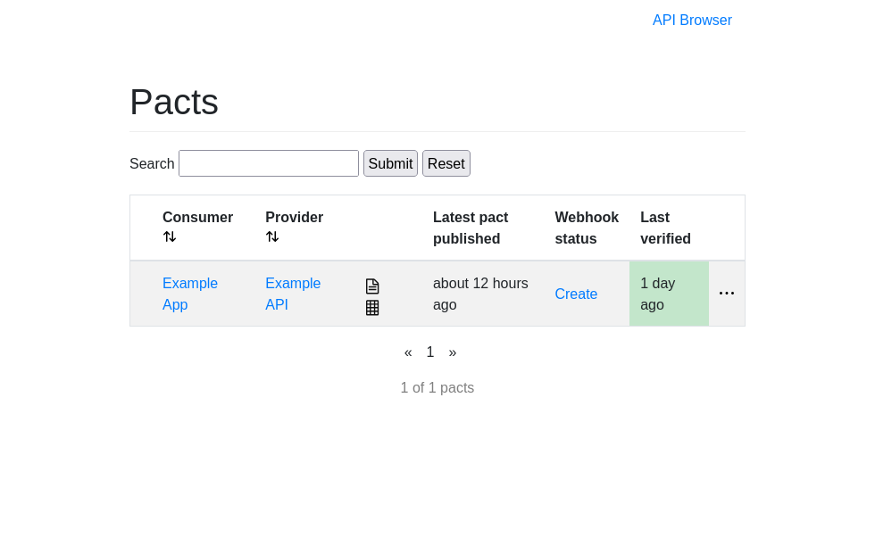

## Instanciation d'un broker

Un broker se démarre facilement avec Docker.

Le broker nécessite une base de données PostgreSQL pour pouvoir fonctionner.

Pour démarrer rapidement, un fichier `docker-compose.yml` est mis à disposition sur le GitHub de [pact-broker-docker](https://github.com/pact-foundation/pact-broker-docker/blob/master/docker-compose.yml).

J'en ai produit une version simplifiée, qui démarre une base de données, et une instance d'un pact-broker :

```yaml
services:
  pactbroker-db:
    image: postgres
    environment:
      - POSTGRES_USER=pactbrokeruser
      - POSTGRES_PASSWORD=PactPassword
      - POSTGRES_DB=pact
    healthcheck:
      test: [ "CMD-SHELL", "pg_isready -U pactbrokeruser -d pact" ]
      interval: 10s
      timeout: 5s
      retries: 5

  pactbroker:
    image: pactfoundation/pact-broker:2
    environment:
      PACT_BROKER_DATABASE_USERNAME: pactbrokeruser
      PACT_BROKER_DATABASE_PASSWORD: PactPassword
      PACT_BROKER_DATABASE_HOST: pactbroker-db
      PACT_BROKER_DATABASE_NAME: pact
      PACT_BROKER_DATABASE_CONNECT_MAX_RETRIES: 5
    ports:
      - "9292:9292"
    depends_on:
      - pactbroker-db
```

Une fois le broker démarré, il est disponible à l'URL http://localhost:8080, et il est chargé avec des données de test :



## Instanciation d'un _consumer_

Le _consumer_ est le composant effectuant les appels.

Pour créer le _consumer contract_, on passe par l'écriture de tests unitaires, qui seront exécutés sur un mock de serveur.

Voici un exemple 

## Liens et références

* Documentation de [pact](https://docs.pact.io/) :

* pact-broker-docker :
  * GitHub : https://github.com/pact-foundation/pact-broker-docker