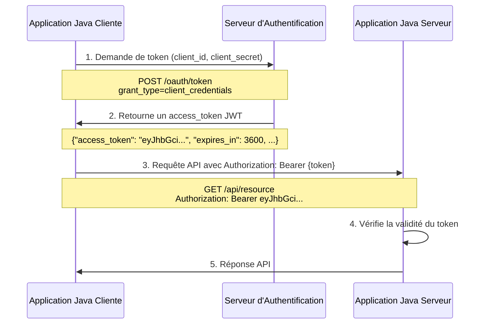

Pour les devs Java, Spring Security et OAuth2, ça reste souvent mal connu et mal maîtrisé.

Le but de cet article est simple : démystifier la configuration de Spring Security pour les applications utilisant OAuth 2 pour l'authentification.

Dans cet article, nous allons voir le premier côté du miroir : la partie cliente, appel d'un service sécurisé en Oauth2.
La partie serveur, exposition d'un service avec OAuth2, sera décrite dans un second article.

## Côté client

Le côté client consiste à pouvoir appeler un serveur sécurisé avec OAuth 2, depuis une application Spring Boot.

Voici un diagramme qui illustre les interactions entre les différents acteurs dans le flow OAuth2 `client_credentials` :



Cela consiste le plus souvent à récupérer un token _JWT_ auprès d'un serveur d'authentification, puis de transmettre ce token dans un header de requête HTTP.

Bien que cela semble simple en surface, la récupération du token _JWT_ peut être compliquée à implémenter proprement. Il faut gérer les différents flows existants, l'expiration du token, la gestion du _refresh token_, les scopes etc.
En fonction des implémentations et des configurations de serveurs d'authentification, la requête à envoyer pour récupérer le token peut aussi être différente.

Spring Security Oauth2 Client implémente la récupération d'un token OAuth2 côté client, ainsi que sa gestion, son stockage (en cache ou en base de données), et fournit un moyen pratique de pouvoir injecter le token dans des requêtes HTTP avec le RestClient.

### Les librairies nécessaires

Pour le côté client, il faut :

* `org.springframework.boot:spring-boot-starter-oauth2-client` : implémente la récupération d'un token OAuth2 côté client.

### Les classes intéressantes

OAuth2ClientHttpRequestInterceptor :

Cette classe permet d'intercepter les requêtes émises par un `RestClient` ou un `RestTemplate`. Lors de l'interception, l'authentification est effectuée si besoin (si le token n'a pas expiré), et le token est automatiquement ajouté au header `Bearer` de la requête sortante.

### L'auto configuration avec Spring Boot

```yaml
spring:
  security:
    oauth2:
      client:
        registration:
          your-registration-id:
            client-id: your-client-id
            client-secret: your-client-secret
            authorization-grant-type: client_credentials
            client-authentication-method: client_secret_post
            scope: read,write
            provider: your-registration-id
        provider:
          your-registration-id:
            token-uri: https://auth.example.com/oauth/token
            user-info-authentication-method: header
```

La configuration d'un `RestClient` se fait alors de cette manière :

```java
var interceptor = new OAuth2ClientHttpRequestInterceptor(authorizedClientManager);
var restClient = RestClient.builder()
    .baseUrl(apiUrl)
    .requestInterceptor(interceptor)
    .build();
```

Le code *magique* dans l'interceptor est la méthode `authorizeClient`, qui récupère 

```java
private void authorizeClient(HttpRequest request, Authentication principal) {
    String clientRegistrationId = this.clientRegistrationIdResolver.resolve(request);
    if (clientRegistrationId == null) {
        return;
    }

    OAuth2AuthorizeRequest authorizeRequest = OAuth2AuthorizeRequest.withClientRegistrationId(clientRegistrationId)
        .principal(principal)
        .build();
    OAuth2AuthorizedClient authorizedClient = this.authorizedClientManager.authorize(authorizeRequest);
    if (authorizedClient != null) {
        request.getHeaders().setBearerAuth(authorizedClient.getAccessToken().getTokenValue());
    }
}
```

La magie opère sur les dernières lignes. L'intercepteur demande à l'`authorizedClientManager` d'authentifier le `principal` avec la client registration, récupère un `authorizedClient`, et attache l'access token de ce client au header `Authorization: Bearer` de la requête HTTP.
