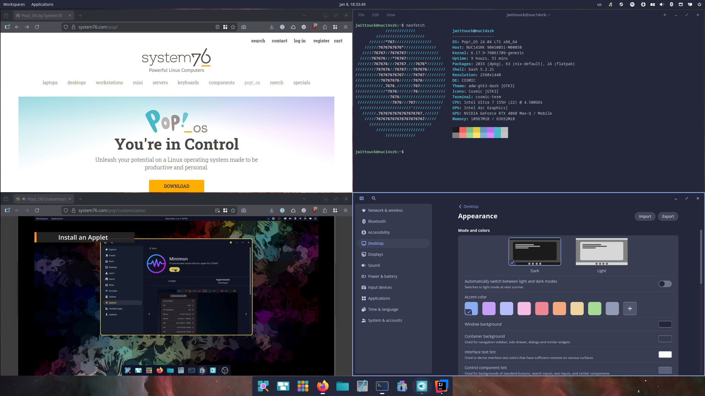
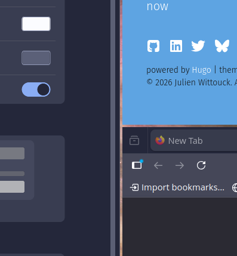

J'utilise la distribution Linux Pop!_OS depuis presque cinq ans. 
J'ai toujours apprécié leur démarche autour de l'auto-tiling, qui est une fonctionnalité qui manque cruellement à gnome (bien que des plugins existent).

Après quelques mois passés sous Manjaro Linux, et des galères liées à des montées de version hasardeuses qui ont plusieurs fois cassé mon système, et avec la sortie récente de Pop!_OS 24.04, il était temps pour moi de revenir sur cette distribution.

<!--more-->

## Cosmic

Pop!_OS n'a pas eu de mise à jour majeure depuis longtemps.
La raison est simple, leur effort était principalement concentré autour du développement de leur environnement de bureau Cosmic.

La promesse est forte : un environnement écrit en Rust pour avoir de bonnes performances et de la stabilité, un environnement pensé dès le départ pour supporter l'auto-tiling, ainsi que les workspaces dans un contexte multi-écran.
Cosmic est aussi pensé pour s'intégrer avec Wayland.

## La distribution

Pop!_OS est une distribution Linux basée sur Ubuntu. On y retrouve donc les outils habituels : apt et flatpak pour l'installation de paquets (pas de snap par défaut).
La distribution vient avec un ensemble de logiciels préinstallés : l'environnement de bureau Cosmic et ses logiciels inclus.
Au niveau de l'ISO, 2 versions sont disponibles : une version simple, et une version embarquant les drivers Nvidia (l'option que j'ai choisie).
L'installation est simple, et propose de chiffrer le disque dur avec un mot de passe, ce qui est une bonne pratique de sécurité.

Au niveau du noyau, on est sur une version 6.17 à l'écriture de cet article, pas la version la plus récente donc, mais c'était la dernière version disponible au moment de la release de la distribution, je pense que les versions suivantes arriveront dans les semaines qui viennent.
Le driver Nvidia est en version 580 (pas la dernière version disponible non plus).

Sont également fournis par défaut Firefox et Thunderbird en versions 146 et 128, la suite LibreOffice en version 24.2.

## Premières impressions
 
Et bien c'est joli.

Le bureau est agréable.


Le bureau est paramétré en fenêtre flottante par défaut, l'auto-tiling s'active d'un click dans le widget de la barre des tâches.

Les workspaces sont pratiques à manipuler, il est possible d'avoir des workspaces en mode horizontal ou vertical, et en cas de setup multi-écran de pouvoir les partager par écran ou les séparer.

L'auto-tiling est agréable à utiliser, même s'il va falloir que je remappe les touches prévues pour déplacer les fenêtres pour mon clavier split.
Glisser une fenêtre à la souris se fait très facilement, et on arrive vite à arranger les fenêtres comme on le souhaite.



La gestion des écrans est inspirée de celle de Gnome. À noter que les paramétrages sont plutôt fins, on peut régler un scaling pour chaque écran, et ça fonctionne bien.

TOUT A FONCTIONNÉ DU PREMIER COUP.

C'est, je pense, suffisamment bien pour pouvoir le mentionner en criant !
J'ai pu :
* imprimer ;
* connecter plusieurs casques bluetooth ;
* utiliser mon micro et ma webcam pour une visio ;
* partager mon écran ;
* prendre des screenshots

Et tout aussi important :

* installer Steam ;
* et jouer à Factorio !

Tout ça sans aucune galère.
C´est du niveau attendu pour toute distribution Linux moderne, mais je m'attendais à quelques galères plus importantes.

Il est possible de personnaliser le rendu, avec un mode Dark ou Light, et on peu facilement changer le thème global de l'interface, ce qui est chouette.
Les police de caractère proposées par défaut sont `Open Sans` et `Noto Sans Mono`, le rendu est propre et net.


Mon laptop possède un lecteur d'empreintes digitales, j'ai pu l'installer et le configurer avec les commandes suivantes :

[//]: # (TODO Ajout des commandes)

Et la lecture d'empreinte fonctionne parfaitement pour déverrouiller ma session, ou lors de l'exécution de `sudo`.


## Les petites galères et frustrations

J'ai constaté quelques lenteurs lors de copie de fichiers _via_ l'explorateur de fichiers.

J'ai aussi un souci de mapping clavier (plus embêtant) uniquement avec IntelliJ.
En fouillant un peu, j'ai découvert que IntelliJ n'utilisait pas Wayland, mais X11 par défaut. Il semble que Wayland embarque une couche de compatibilité avec Xorg pour que tout ça fonctionne.

Bref, pour vérifier ce point, j'ai trouvé cette page de documentation : https://blog.jetbrains.com/platform/2024/07/wayland-support-preview-in-2024-2/

En récupérant les propriétés de mon instance d'IntelliJ, je vois bien apparaître la ligne en cause : `Toolkit: sun.awt.X11.XToolkit
`.

```text
IntelliJ IDEA 2025.3.1.1
Build #IU-253.29346.240, built on January 8, 2026
Source revision: 45c13268926ea
Licensed to CodeKaio / Julien WITTOUCK
Runtime version: 21.0.9+10-b1163.86 amd64 (JCEF 137.0.17)
VM: OpenJDK 64-Bit Server VM by JetBrains s.r.o.
Toolkit: sun.awt.X11.XToolkit
Linux 6.17.9-76061709-generic
Pop!_OS 24.04 LTS; glibc: 2.39
GC: G1 Young Generation, G1 Concurrent GC, G1 Old Generation
Memory: 4096M
Cores: 22
```

Bref, j'ai activé le paramétrage suivant dans les options de la JVM d'IntelliJ et le problème a été résolu : `-Dawt.toolkit.name=WLToolkit`.

Passé ce point, il me reste une unique petite frustration. Les fenêtres sont définitivement carrées, ça manque d'un peu d'arrondi sur les coins.
Ça donne un effet un peu bizarre, un peu "sec" aux fenêtres, alors que le reste du système propose des arrondis un peu partout.



## En conclusion

## Liens et références

* [Pop!_OS 24.04](https://system76.com/pop/)
* La [documentation officielle](https://support.system76.com/) de Pop!_OS