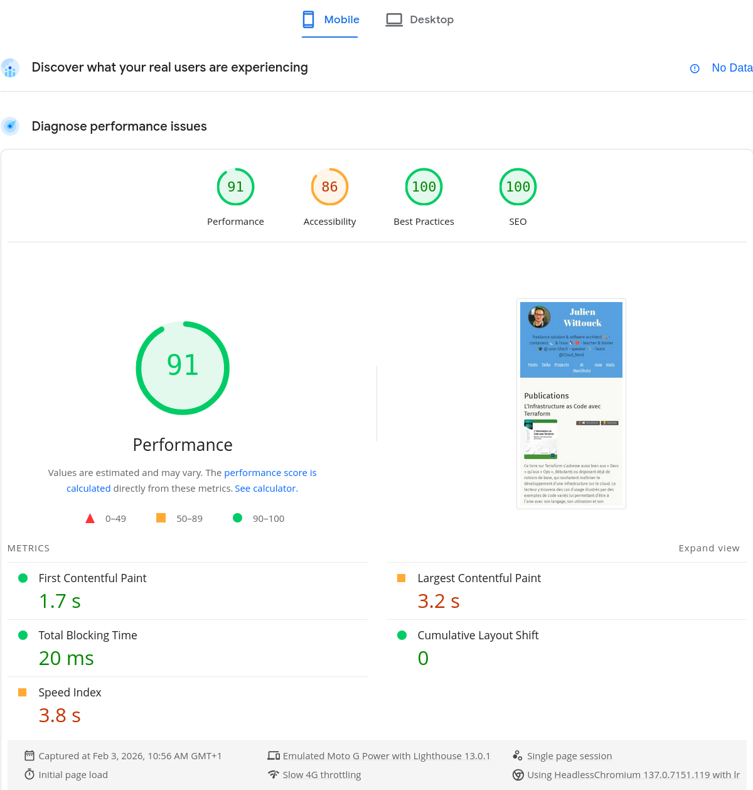
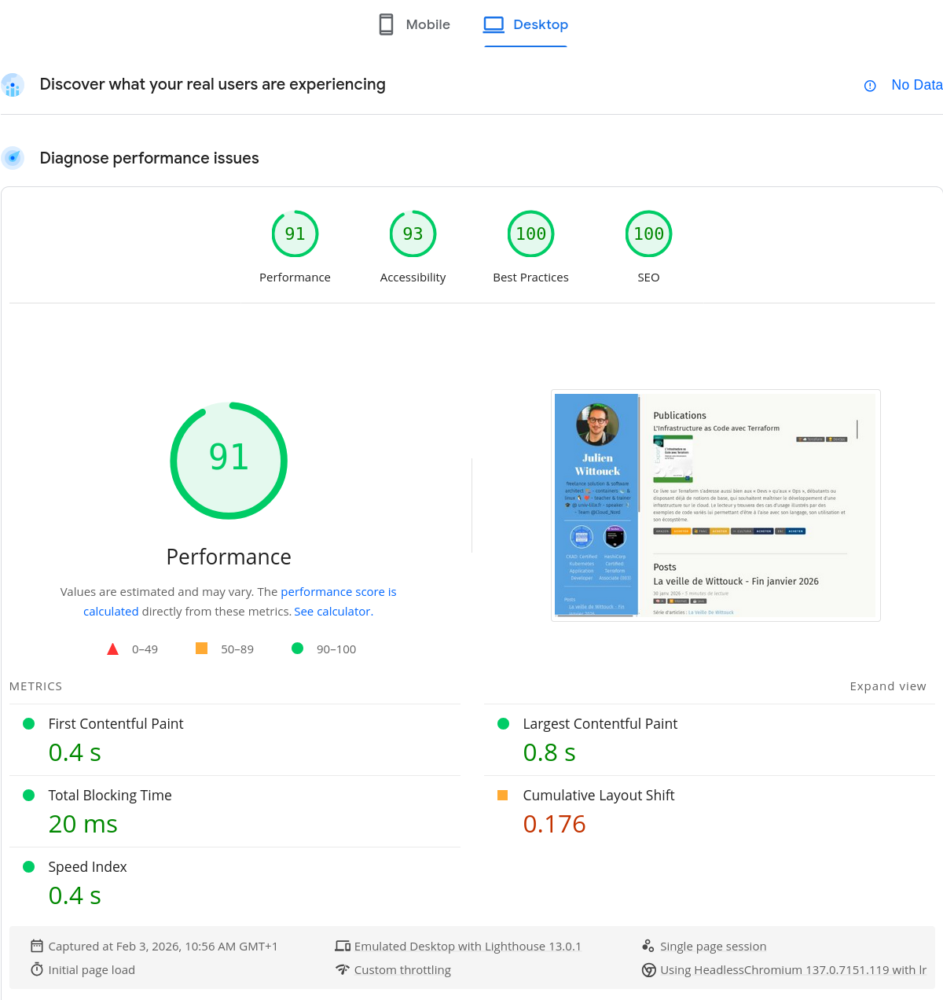
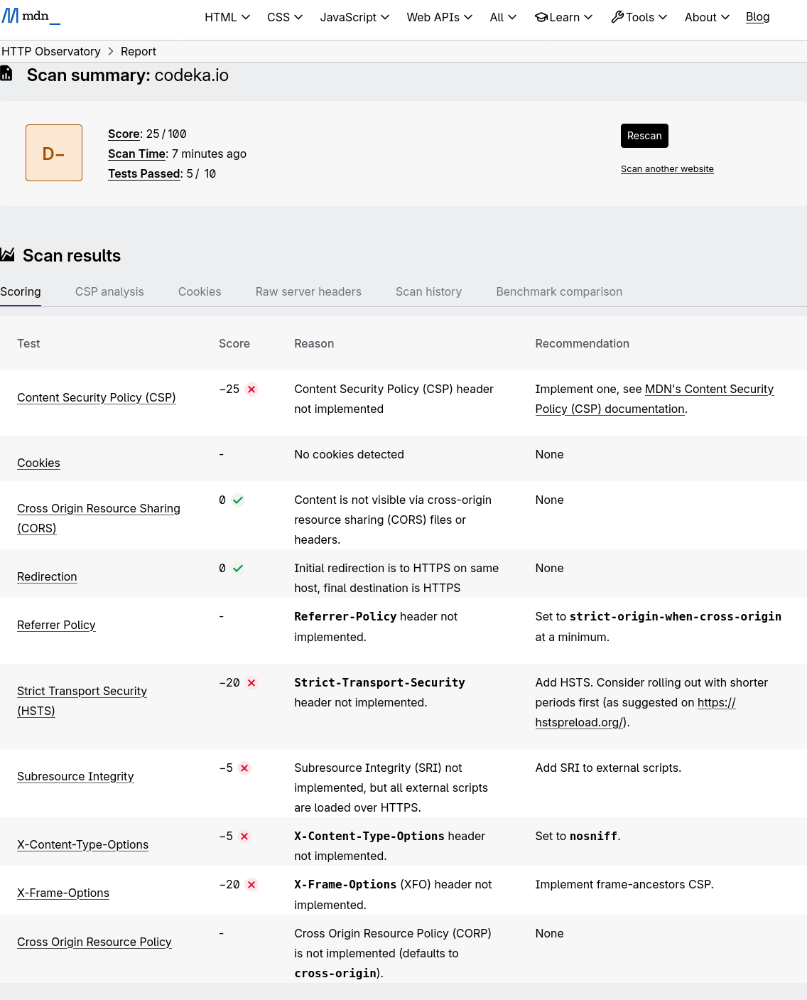

[//]: # (TODO link vers le blog d'antoine)
Sur les bons conseils du pote Antoine Caron, j'ai pris temps cette semaine d'optimiser un peu mon site.

Ce site que vous êtes en train de lire est un site statique, buildé avec Hugo.

J'ai déjà un peu travaillé la compression des différentes ressources, principalement les illustrations, mais je m'étais arrêté à ça.
Dans cet article, je détaille comment j'ai optimisé le build de ce site, pour minimiser les temps de chargement, et comment j'ai amélioré sa sécurité en suivant les bonnes pratiques poussées par MDN.

## Le score Lighthouse

Pour faire un premier travail sur les performances de ce site, j'ai utilisé [une analyse LightHouse](https://pagespeed.web.dev/analysis/https-codeka-io/we5dukzmku?form_factor=desktop).

Lighthouse permet en quelques minutes d'avoir une vue des performances d'une application ou d'un site web, à la fois pour une cible _Desktop_ et _Mobile_.
Il permet aussi de valider certaines propriétés d'accessibilité, comme des contrastes, la présence de texte alternatif pour les lecteurs d'écran, etc.

C'est, je pense, un bon point de départ.

Voici les scores de mon site à l'heure actuelle :






> J'ai clairement une marge d'amélioration sur l'accessibilité et les performances.

## Conversion des images en webp et redimensionnement

Une des actions que j'ai mis en place il y a un moment, est l'utilisation du format _webp_ pour compresser les illustrations que j'utilise dans mes articles.

J'utilise souvent des photos que j'ai capturées avec mon smartphone (pour les articles de conférence), des captures d'écran ou des schémas (produit sur draw.io le plus souvent), ou des photos _stock_ que je vais chercher pour illustrer mes articles de veille.

Ces photos sont souvent lourdes (plusieurs mégaoctets) et en haute résolution, et la première action simple consiste à redimensionner ces photo et les recompresser au format _webp_.

Hugo supporte la recompression des images dans différents formats à la volée, mais pas leur redimensionnement automatique.
Pour pouvoir redimensionner les images à la volée, la meilleure solution semble d'utiliser un hook "img" Hugo, qui permet de surcharger la traduction du markdown et d'y mettre le code qu'on souhaite.

Le hook utilisé par défaut est le suivant :

```go

{{- /* chomp trailing newline */ -}}
```

Pour redimensionner les images à une taille maximale de 820px (la taille utilisée sur la colonne de contenu de ce site), j'utilise le hook suivant :

```go
{{- $image := .Page.Resources.GetMatch .Destination -}}
{{- $width := math.Min 820 $image.Width -}}
{{- $resizeOpts := printf "%dx webp lossless q100 lanczos" (int $width) -}}
{{- with $image.Resize $resizeOpts -}}

{{- end -}}
{{- /* chomp trailing newline */ -}}
```

## Pré-compression des ressources statiques

Mon site est hébergé chez Clever Cloud, dans une instance de type _static_.
J'avais écrit un article à ce sujet l'année dernière : [Déployer des applications statiques sur Clever Cloud](/2025/06//2025-06-05-static-apps-clever).

Clever Cloud permet d'utiliser Caddy pour servir les fichiers statiques en surcharge de `static-web-server`, simplement en ajoutant un `Caddyfile` à la racine du projet.

Cette option va me permettre de pouvoir configurer Caddy pour servir le répertoire `public` du site :

```Caddyfile
# Clever Cloud needs us to listen on port 8080
:8080

file_server {
	# Clever Cloud serves the public directory in a cc_static_autobuilt directory
    root public
}

# Ask Caddy to compress static files 
encode
```

Lors de l'exécution d'une requête, Caddy va servir les fichiers statiques, et potentiellement compresser les réponses HTTP en alimentant le headers `Content-Encoding`.

Cette compression permet d'économiser de la bande passante et accélère le temps de chargement des pages.

Cependant, la compression se fait en utilisant un peu de CPU à la volée.
Il est alors intéressant de pré-compresser les ressources statiques à la phase de build pour économiser un peu de CPU.

Un directive Caddy permet de servir des fichiers statiques pré-compressés : `precompressed`.
Caddy va alors rechercher des variantes compressées des fichiers, sous la forme de fichiers sidecar.
À côté de chaque fichier statique, il faut donc générer les variantes compressées et les nommer en utilisant les extensions `.br` et `.gz` par exemple.

Hugo ne permet pas de générer ces variantes compressées, donc je dois utiliser un petit script qui s'exécutera en fin de la phase de build.

J'ai donc créé ce script dans mon fichier `mise.toml`:

```toml
[tasks.build]
description = "Build le site avec Hugo"
run = "hugo --gc --minify --destination public"

[tasks.post-build]
description = "Post build hooks"
depends_post = ["precompress"]

[tasks.precompress]
description = "Precompress static resources"
run = '''
COMPRESSREGEX=".*(html|css|js|xml|ico|svg|md|png|webp|pdf)$"
find public/ -type f -regextype egrep -regex $COMPRESSREGEX | xargs zstd -15 -f
find public/ -type f -regextype egrep -regex $COMPRESSREGEX | xargs zstd --format=gzip -15 -f
'''
```

Par défaut, Clever Cloud exécute une tâche `mise run build` si elle existe, donc l'ajouter dans mon fichier permet de pouvoir préciser mes options de build.

Pour la phase de compression, il suffit d'indiquer à Clever Cloud d'exécuter `mise run post-build`, cela se fait avec un hook sur 

Le script `precompress` est inspiré d'un [article de blog de Scott Laird](https://scottstuff.net/posts/2025/03/09/precompressing-content-with-hugo-and-caddy/) sur lequel je suis tombé en faisant quelques recherches.
Il recherche l'ensemble des fichiers matchant la regex donnée, et utilise `zstd` pour compresser ces fichiers.

L'exécution de ces scripts produit la sortie suivante : 

```bash
[build] $ hugo build hugo --gc --minify --destination public
Start building sites …
hugo v0.155.2-d8c0dfccf72ab43db2b2bca1483a61c8660021d9+extended linux/amd64 BuildDate=2026-02-02T10:04:51Z VendorInfo=gohugoio

                  │ EN │ FR
──────────────────┼────┼─────
 Pages            │ 75 │ 139
 Paginator pages  │  0 │   4
 Non-page files   │ 14 │ 222
 Static files     │ 36 │  36
 Processed images │  3 │ 275
 Aliases          │  1 │   8
 Cleaned          │  0 │   0

Total in 272 ms
[precompress] $ COMPRESSREGEX=".*(html|css|js|xml|ico|svg|md|png|webp|pdf)$"
593 files compressed : 90.10% (   165 MiB =>    149 MiB)                       B ==> 98%%
593 files compressed : 93.31% (   165 MiB =>    154 MiB)
Finished in 7.77s
```

On peut valider que les fichiers buildés sont précompressés comme souhaité, avec les extensions `.gz` et `.zst` :

```bash
$ ls public/
2020          ai-manifesto     icons             logo_blue.png.zst                       pp_ekite_itvw_hu_41404e93ad715bdf.webp.gz
2021          books            images            logo_transparent_background.png         pp_ekite_itvw_hu_41404e93ad715bdf.webp.zst
2022          credentials      index.html        logo_transparent_background.png.gz      projects
2023          css              index.html.gz     logo_transparent_background.png.zst     robots.txt
2024          ekite            index.html.zst    now                                     series
2025          en               index.xml         page                                    sitemap.xml
2026          favicon.png      index.xml.gz      posts                                   sitemap.xml.gz
404.html      favicon.png.gz   index.xml.zst     pp_ekite_itvw.png                       sitemap.xml.zst
404.html.gz   favicon.png.zst  js                pp_ekite_itvw.png.gz                    stats
404.html.zst  fonts            logo_blue.png     pp_ekite_itvw.png.zst                   tags
ai            fr               logo_blue.png.gz  pp_ekite_itvw_hu_41404e93ad715bdf.webp  talks
```

Pour ensuite servir les fichiers précompressés, il faut ajouter la directive `precompressed` dans le `Caddyfile` :

```Caddyfile
# Clever Cloud needs us to listen on port 8080
:8080

file_server {
	# Clever Cloud serves the public directory
    root public
    precompressed
}

# Ask Caddy to compress static files 
encode
```

On peut ensuite simplement vérifier que les fichiers compressés sont servis avec une commande `curl`.

Voici ce qui était renvoyé _avant_ la compression :

```bash
$ curl --compressed --head https://codeka.io

HTTP/1.1 200 OK
content-length: 81156
content-type: text/html
accept-ranges: bytes
last-modified: Tue, 03 Feb 2026 12:10:53 GMT
vary: accept-encoding
cache-control: max-age=86400
date: Fri, 06 Feb 2026 16:42:58 GMT
Sozu-Id: 01KGSXBPJWK3D8CZEF8FSPD1Y5
```

et la même commande après la compression :

```bash
$ curl --compressed --head https://codeka.io

HTTP/1.1 206 Partial Content
Accept-Ranges: bytes
Content-Encoding: zstd
Content-Length: 9487
Content-Range: bytes 0-9486/9487
Content-Type: text/html; charset=utf-8
Etag: "dg80yb3ycgay7bj"
Last-Modified: Fri, 06 Feb 2026 16:37:33 GMT
Server: Caddy
Vary: Accept-Encoding
Date: Fri, 06 Feb 2026 16:43:06 GMT
Sozu-Id: 01KGSXBY5TS81HK0BCRSYZSM4S
```

On passe d'une page HTML de 81ko à une donnée compressée de 13ko, sans impacter le CPU du serveur puisque la compression se fait au build !

## Headers de sécurité

La dernière étape de cette configuration consiste à moderniser les headers servis pour impléments un peu de sécurité supplémentaire.

Maintenant que Caddy sert le site et que j'ai un Caddyfile sur lequel j'ai la main, je peux contrôler les headers HTTP renvoyés.

Pour savoir quoi faire, sur les conseils d'Antoine, j'ai utilisé l'analyseur de MDN :

https://developer.mozilla.org/en-US/observatory/analyze?host=codeka.io#scoring



### HSTS

Le premier header intéressant à utiliser est le `Strict-Transport-Security`.

Ce header a pour effet de forcer les navigateurs à utiliser HTTPS.
Bien que j'ai déjà configuré une redirection HTTP vers HTTPS sur mon domaine avec Clever Cloud, c'est une mesure de sécurité supplémentaire.

La recommandation de MDN est de positionner cette valeur :

```HTTP
Strict-Transport-Security: max-age=63072000
```

Dans mon Caddyfile, rien de plus simple, j'ajoute le header `Strict-Transport-Security` :

```Caddyfile
# Clever Cloud needs us to listen on port 8080
:8080

file_server {
	# Clever Cloud serves the public directory
    root public
    precompressed
}

# Custom headers for security
header {
	Strict-Transport-Security "max-age=63072000"
}

# Ask Caddy to compress static files 
encode
```

### Content-Security-Policy

Le premier header intéressant à utiliser est le `Content-Security-Policy`.
Ce header indique au navigateur quelle politique de sécurité appliquer à l'exécution des scripts provenant de sources externes au site web.
C'est une mesure de sécurité permettant de se prémunir des injections de type XSS (Cross-Site Scripting).

Le header doit déclarer l'ensemble des sources (domaines) acceptés pour le chargement des scripts, styles, images et autres ressources.
Utiliser ce header a aussi pour effet de désactiver le CSS et le JS "inline", ce qui est plutôt une bonne pratique.

Après avoir supprimé tous les styles inlines de mon site, j'ai configuré le header dans mon Caddyfile :

```Caddyfile
# Clever Cloud needs us to listen on port 8080
:8080

file_server {
	# Clever Cloud serves the public directory
    root public
    precompressed
}

# Custom headers for security
header {
	Strict-Transport-Security "max-age=63072000"
	
    Content-Security-Policy "
	    script-src 'self' codeka.io plausible.io;
	    frame-src 'self' plausible.io www.youtube-nocookie.com openfeedback.io;
        img-src 'self' img.shields.io;
	    default-src 'self';
	"
}

# Ask Caddy to compress static files 
encode
```

J'utilise plausible.io pour suivre les visites de mes articles, donc son script doit pouvoir être chargé. De la même manière, j'ai des iframes (bouh) sur les pages de mes talks qui référencent les videos Youtube ainsi que les feedbacks OpenFeedback.io. Je dois donc aussi autoriser ces ressources.

La directive `default-src` sert de fallback pour toutes les directives possible, et indique que seul mon site est autorisé.

## Liens et références

* Configuration de l'optimisation des images avec Hugo : https://gohugo.io/configuration/imaging/#quality
* La méthode [Resize de Hugo](https://gohugo.io/methods/resource/resize/)
* [Le hookimage de Hugo](https://gohugo.io/render-hooks/images/#article)

* Documentation MDN :
  * [Content-Security-Policy](https://developer.mozilla.org/en-US/docs/Web/HTTP/Reference/Headers/Content-Security-Policy)

* [Precompressing Content With Hugo and Caddy](https://scottstuff.net/posts/2025/03/09/precompressing-content-with-hugo-and-caddy/)