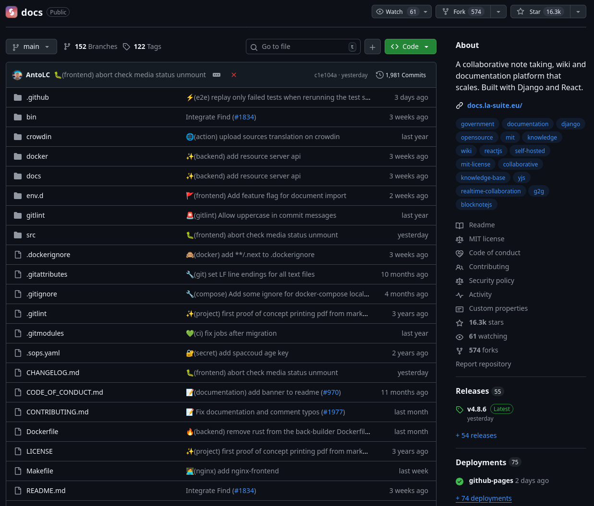
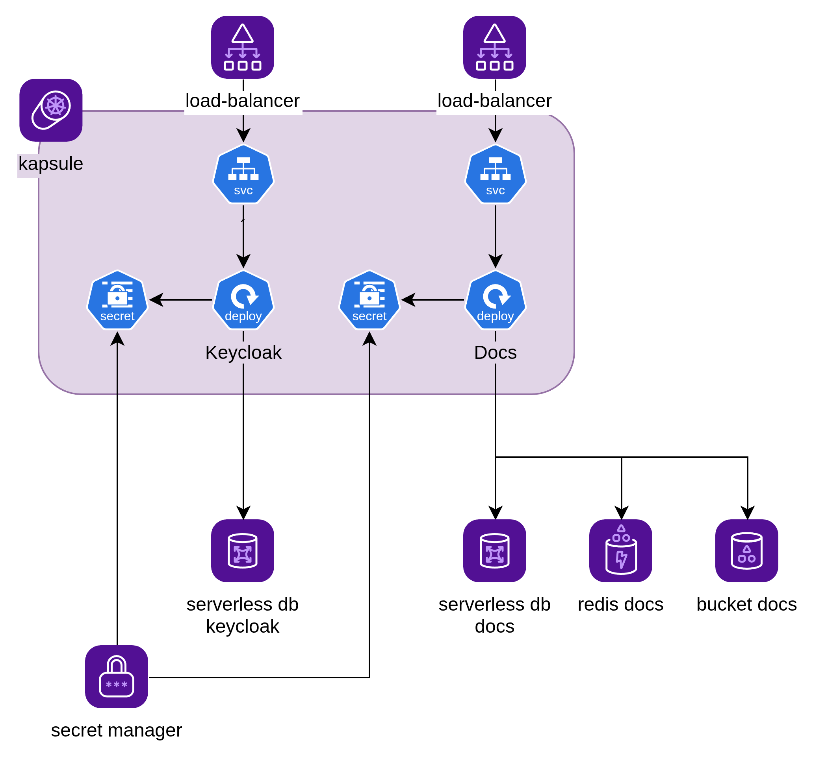
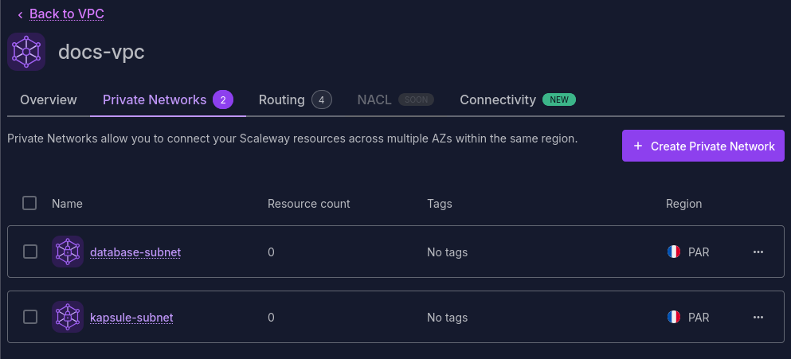
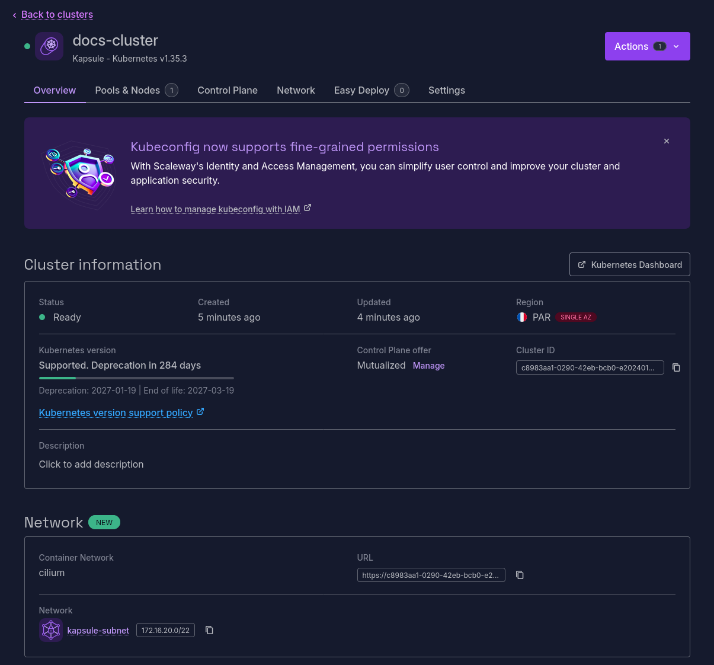
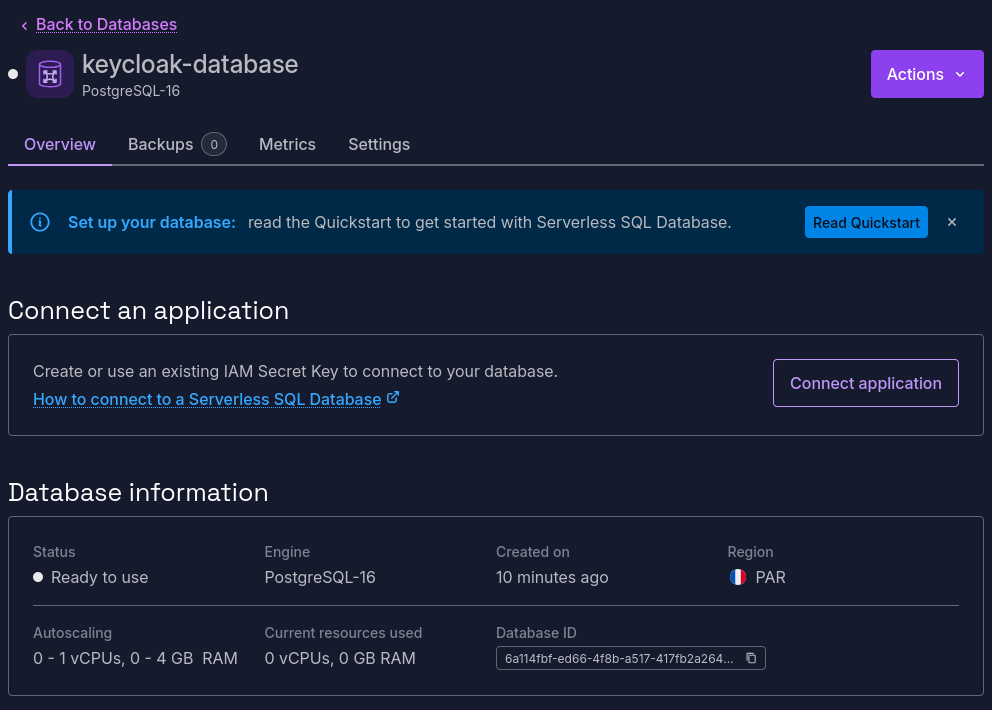
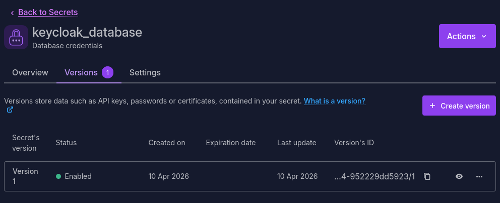
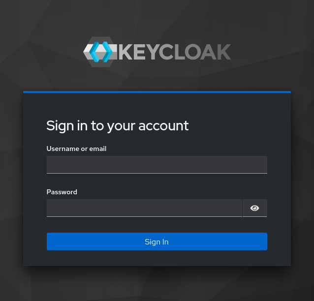
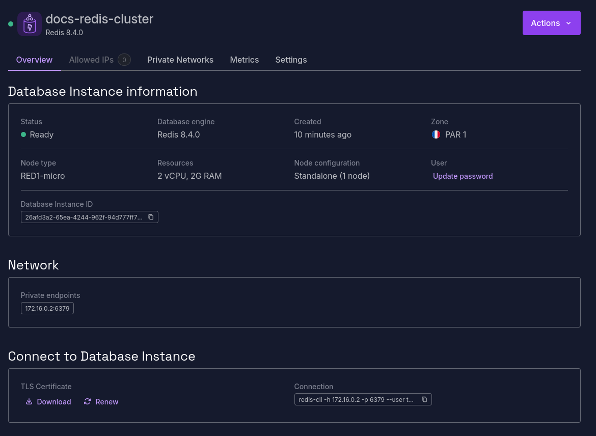
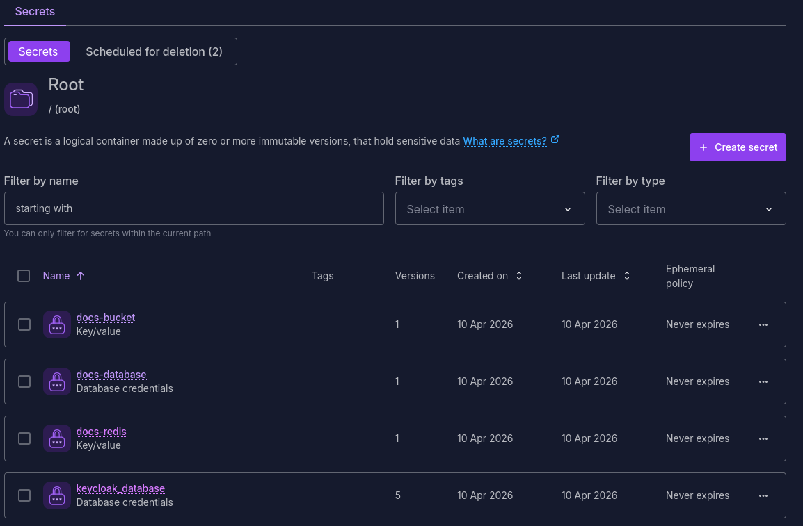

Vous avez probablement vu passer, comme moi, les annonces concernant "La Suite numérique".
La Suite est un ensemble d'outils développés par la DINUM, pour équiper les agents du service public d'un outillage moderne et intégré, qui vise à remplacer les outils des GAFAM (Google Workspace et Office 365 dans le viseur).

La suite se veut aussi être Open Source. Le code est disponible sur [GitHub](https://github.com/suitenumerique).

Et il s'avère qu'on peut facilement héberger sa propre instance.

Aujourd'hui, j'ai donc installé la suite sur mon compte Scaleway, pour jouer un peu et pouvoir avoir à terme un remplaçant à Notion.

<!--more-->

## Le repo github

Le repo GitHub de docs est complet : README, CHANGELOG, CONTRIBUTING. C'est propre et clair.
En bonus, un fichier UPGRADE.md est aussi présent pour aider à la mise à jour sur les différentes versions.



> Amusant, les messages de commit sont rédigés avec [GitMoji](https://gitmoji.dev/) 🤩

La documentation technique est assez bien fournie également. Elle est située dans le dossier `docs/` du repo (docs-ception 😅).

On y retrouve des ADRs (un seul pour l'instant), quelques schémas d'architecture, des procédures d'installation et de configuration avec les variables d'environnement.

## L'architecture cible

En quelques clics, je tombe sur la [procédure d'installation de docs sur Kubernetes](https://github.com/suitenumerique/docs/blob/main/docs/installation/kubernetes.md).

Quelques prérequis sont listés :

* Un cluster Kubernetes (jusque là, pas du surprise)
* Un provider OIDC pour authentifier les utilisateurs
* Un serveur PostgreSQL
* Un serveur Redis
* Un bucket S3 pour stocker les fichiers

La doc propose des exemples de solution complète avec Keycloak pour l'authentification, et Minio pour la partie S3.

Pour mon installation sur Scaleway, je vais partir sur une solution managée.

* Un cluster Kapsule
* Un Keycloak installé dans le cluster
* Deux instances serverless de PostgreSQL (une pour Keycloak et une pour docs)
* Une instance de Redis
* Un bucket object storage

Les différentes ressources seront provisionnées avec OpenTofu.

Le déploiement et la configuration de Keycloak et de Docs se feront avec Helm.



## Configuration de OpenTofu

### Création de l'application et de l'API Key pour OpenTofu

J'installe la dernière version du CLI Scaleway et d'OpenTofu avec `mise` :

```shell
❯ mise use scaleway
scaleway@2.54.0

❯ scw version
Version          2.54.0
BuildDate        2026-04-02T07:01:46Z
GoVersion        go1.26.1
GitBranch        HEAD
GitCommit        da45726d
GoArch           amd64
GoOS             linux
UserAgentPrefix  scaleway-cli

❯ mise use opentofu
opentofu@1.11.6

❯ tofu version
OpenTofu v1.11.6
on linux_amd64
```

Pour commencer, je configure OpenTofu avec mon compte Scaleway.

Je crée un projet "Docs" avec le CLI :

```shell
❯ scw account project create name=Docs
ID              7f715427-5a38-49ee-a2f5-910ec786506c
Name            Docs
OrganizationID  d2f60dce-f716-4e45-96cb-3837fe56f0d9
CreatedAt       now
UpdatedAt       now
Description     -
```

Ensuite, je crée une application pour mon OpenTofu :

```shell
❯ scw iam application create name=opentofu-docs
ID              092e0bdd-72b2-491e-947e-bcc1c9ce4e5c
Name            opentofu-docs
Description     -
CreatedAt       now
UpdatedAt       now
OrganizationID  d2f60dce-f716-4e45-96cb-3837fe56f0d9
Editable        true
Deletable       true
Managed         false
NbAPIKeys       0
```

Et j'attache une policy à mon application avec des droits élevés sur le projet :

```shell
❯ scw iam policy create name=opentofu-docs application-id=092e0bdd-72b2-491e-947e-bcc1c9ce4e5c rules.0.project-ids.0=7f715427-5a38-49ee-a2f5-910ec786506c rules.0.permission-set-names.0=AllProductsFullAccess
ID                c55a11d4-9b80-4aa8-a508-82de286aef84
Name              opentofu-docs
Description       -
OrganizationID    d2f60dce-f716-4e45-96cb-3837fe56f0d9
CreatedAt         now
UpdatedAt         now
Editable          true
Deletable         true
Managed           false
NbRules           0
NbScopes          0
NbPermissionSets  0
ApplicationID     092e0bdd-72b2-491e-947e-bcc1c9ce4e5c
```

Enfin, j'extrait une clé d'API pour mon application :

```shell
❯ scw iam api-key create application-id=092e0bdd-72b2-491e-947e-bcc1c9ce4e5c default-project-id=7f715427-5a38-49ee-a2f5-910ec786506c
AccessKey         SCW6DXYWXQE1EF0F7QV0
SecretKey         11a461bb-74fc-409b-b1ff-19fffc270ea4
ApplicationID     092e0bdd-72b2-491e-947e-bcc1c9ce4e5c
Description       -
CreatedAt         now
UpdatedAt         now
DefaultProjectID  7f715427-5a38-49ee-a2f5-910ec786506c
Editable          true
Deletable         true
Managed           false
CreationIP        81.254.129.78
```

Je sauvegarde l'id du projet, les Access Key et Secret Key dans des variables d'environnement pour que OpenTofu puisse les utiliser :

```shell
❯ fnox set SCW_DEFAULT_PROJECT_ID
Enter secret value ************
✓ Set secret SCW_DEFAULT_PROJECT_ID

❯ fnox set SCW_ACCESS_KEY
Enter secret value ************
✓ Set secret SCW_ACCESS_KEY

❯ fnox set SCW_SECRET_KEY
Enter secret value ************
✓ Set secret SCW_SECRET_KEY
```

### Configuration du provider Scaleway

Je commence par créer un Bucket pour venir y stocker le state de mon projet :

```shell
❯ scw object bucket create name=docs-opentofu-state
✅ Success.
ID                docs-opentofu-state
Region            fr-par
APIEndpoint       https://s3.fr-par.scw.cloud
BucketEndpoint    https://docs-opentofu-state.s3.fr-par.scw.cloud
EnableVersioning  false
Owner             7f715427-5a38-49ee-a2f5-910ec786506c
```

Une fois le bucket créé, je peux configurer le provider Scaleway et un backend S3 pour l'utiliser pour son state :

```hcl
provider "scaleway" {}

terraform {
  backend "s3" {
    bucket                      = "docs-opentofu-state"
    key                         = "docs.tfstate"
    region                      = "fr-par"
    endpoint                    = "https://s3.fr-par.scw.cloud"
    skip_credentials_validation = true
    use_path_style            = true
    skip_region_validation = true
    skip_requesting_account_id  = true
  }
}
```

Le backend S3 a besoin des access key et secret key au format AWS, donc je duplique mes clés :

```shell
❯ fnox set AWS_ACCESS_KEY_ID $(fnox get SCW_ACCESS_KEY)
✓ Set secret AWS_ACCESS_KEY_ID

❯ fnox set AWS_SECRET_ACCESS_KEY $(fnox get SCW_SECRET_KEY)
✓ Set secret AWS_SECRET_ACCESS_KEY
```

L'exécution de `tofu init` finalise mon setup, je peux commencer à configurer mon infrastructure :

```shell
❯ tofu init

Initializing the backend...

Initializing provider plugins...
- Reusing previous version of hashicorp/scaleway from the dependency lock file
- Using previously-installed hashicorp/scaleway v2.71.0

OpenTofu has been successfully initialized!
```

## Création de l'infrastructure pour Keycloak

### Les réseaux privés

Pour commencer, je crée l'infrastructure réseau :

* un VPC
* un subnet qui sera utilisé par le cluster Kapsule
* un subnet qui sera utilisé par les bases de données

```hcl
resource "scaleway_vpc" "this" {
  name           = "docs-vpc"
  enable_routing = true
}

resource "scaleway_vpc_private_network" "pn_kapsule" {
  name = "kapsule-subnet"

  vpc_id = scaleway_vpc.this.id
}

resource "scaleway_vpc_private_network" "pn_db" {
  name = "database-subnet"

  vpc_id = scaleway_vpc.this.id
}
```

Un coup de `tofu apply` et l'infratructure réseau est prête :

```shell
❯ tofu apply

OpenTofu used the selected providers to generate the following execution plan. Resource actions are indicated with the following symbols:
  + create

OpenTofu will perform the following actions:

  # scaleway_vpc.this will be created
  + resource "scaleway_vpc" "this"

  # scaleway_vpc_private_network.pn_db will be created
  + resource "scaleway_vpc_private_network" "pn_db"

  # scaleway_vpc_private_network.pn_kapsule will be created
  + resource "scaleway_vpc_private_network" "pn_kapsule"

Plan: 3 to add, 0 to change, 0 to destroy.

Do you want to perform these actions?
  OpenTofu will perform the actions described above.
  Only 'yes' will be accepted to approve.

  Enter a value: yes

scaleway_vpc.this: Creating...
scaleway_vpc.this: Creation complete after 1s [id=fr-par/c616f8b0-69b2-487f-a9ba-4bbe5b2a12c0]
scaleway_vpc_private_network.pn_kapsule: Creating...
scaleway_vpc_private_network.pn_db: Creating...
scaleway_vpc_private_network.pn_db: Creation complete after 1s [id=fr-par/bdd5962a-e390-4d9d-a6d3-19b616597cc8]
scaleway_vpc_private_network.pn_kapsule: Creation complete after 1s [id=fr-par/254c2900-0022-4ebf-a7da-2e564acace10]
```



### Création du cluster Kapsule

Je crée ensuite le cluster Kapsule et un node pool minimaliste :

```hcl
# Use the latest version
data "scaleway_k8s_version" "latest" {
  name = "latest"
}

resource "scaleway_k8s_cluster" "this" {
  name    = "docs-cluster"
  version = data.scaleway_k8s_version.latest.name

  type               = "kapsule"
  cni                = "cilium"
  private_network_id = scaleway_vpc_private_network.pn_kapsule.id

  delete_additional_resources = false
}

resource "scaleway_k8s_pool" "pool" {
  cluster_id = scaleway_k8s_cluster.this.id
  name       = "docs-cluster-pool"
  node_type  = "DEV1-M"
  size       = 1
}

output "cluster_id" {
  value = scaleway_k8s_cluster.this.id
}
```

L'exécution de `tofu apply` donne la sortie suivante :

```shell
❯ tofu apply
data.scaleway_k8s_version.latest: Reading...
scaleway_vpc.this: Refreshing state... [id=fr-par/c616f8b0-69b2-487f-a9ba-4bbe5b2a12c0]
data.scaleway_k8s_version.latest: Read complete after 0s [id=fr-par/1.35.3]
scaleway_vpc_private_network.pn_db: Refreshing state... [id=fr-par/bdd5962a-e390-4d9d-a6d3-19b616597cc8]
scaleway_vpc_private_network.pn_kapsule: Refreshing state... [id=fr-par/254c2900-0022-4ebf-a7da-2e564acace10]

OpenTofu used the selected providers to generate the following execution plan. Resource actions are indicated with the following symbols:
  + create

OpenTofu will perform the following actions:

  # scaleway_k8s_cluster.this will be created
  + resource "scaleway_k8s_cluster" "this"

  # scaleway_k8s_pool.pool will be created
  + resource "scaleway_k8s_pool" "pool"

Plan: 2 to add, 0 to change, 0 to destroy.

Do you want to perform these actions?
  OpenTofu will perform the actions described above.
  Only 'yes' will be accepted to approve.

  Enter a value: yes

scaleway_k8s_cluster.this: Creating...
scaleway_k8s_cluster.this: Creation complete after 5s [id=fr-par/c8983aa1-0290-42eb-bcb0-e20240146992]
scaleway_k8s_pool.pool: Creating...
scaleway_k8s_pool.pool: Creation complete after 3m12s [id=fr-par/537be92b-65c9-4a9a-a0e9-cd43109beaa5]

Outputs:

cluster_id = "fr-par/c8983aa1-0290-42eb-bcb0-e20240146992"
```

Après quelques minutes, le cluster est prêt :



Je peux extraire un fichier `kubeconfig` avec la commande suivante :

```shell
❯ scw k8s kubeconfig get c8983aa1-0290-42eb-bcb0-e20240146992 > kubeconfig.yaml

❯ mise set KUBECONFIG=kubeconfig.yaml
```

et essayer de m'y connecter :

```shell
❯ k get nodes
NAME                                             STATUS   ROLES    AGE     VERSION
scw-docs-cluster-docs-cluster-pool-d0f0306b16a   Ready    <none>   9m43s   v1.35.3
```

### Création de la base de données de Keycloak

Je crée ensuite les ressources nécessaires à Keycloak, sa base de données Serverless SQL, une application et une API Key pour l'authentification, et je stocke les informations dans un secret de Secret Manager :

```hcl
resource scaleway_iam_application "keycloak" {
  name = "keycloak"
}

resource scaleway_iam_policy "keycloak" {
  name           = "Keycloak Database Access"
  application_id = scaleway_iam_application.keycloak.id
  rule {
    project_ids = [data.scaleway_account_project.this.id]
    permission_set_names = ["ServerlessSQLDatabaseReadWrite"]
  }
}

resource scaleway_iam_api_key "keycloak" {
  application_id = scaleway_iam_application.keycloak.id
}

resource scaleway_sdb_sql_database "keycloak" {
  name    = "keycloak-database"
  min_cpu = 0
  max_cpu = 1
}

resource "scaleway_secret" "keycloak" {
  name = "keycloak_database"
  type = "database_credentials"
}

resource "scaleway_secret_version" "keycloak" {
  secret_id = scaleway_secret.keycloak.id
  data_wo = jsonencode({
    engine   = "postgresql"
    username = scaleway_iam_application.keycloak.id
    password = scaleway_iam_api_key.keycloak.secret_key
    host     = scaleway_iam_api_key.keycloak.host
    port     = "5432"
    dbname   = scaleway_sdb_sql_database.keycloak.name
  })
}
```

Une fois `tofu` exécuté (je vous passe les logs), les ressources sont prêtes :





## Configuration de External Secrets

Pour pouvoir récupérer les secrets de Secret Manager dans le cluster, Scaleway propose l'utilisation de [External Secrets](https://www.scaleway.com/en/docs/secret-manager/api-cli/external-secrets/#external-secrets---overview).

L'installation se fait assez simplement :

```shell
helm repo add external-secrets https://charts.external-secrets.io
helm repo update

helm upgrade --install external-secrets external-secrets/external-secrets \
    -n external-secrets \
    --create-namespace \
    --set installCRDs=true
```

Une fois External Secrets installé, il faut lui donner des accès à l'API Scaleway pour qu'il puisse récupérer les secrets et les charger dans le cluster.

Je crée donc une application, avec une policy read-only, et une API Key pour pour External Secrets, je fais ça avec Terraform cette fois-ci :

```hcl
resource scaleway_iam_application "external_secrets" {
  name = "external_secrets"
}

resource scaleway_iam_policy "external_secrets" {
  name           = "External Secrets Access"
  application_id = scaleway_iam_application.external_secrets.id
  rule {
    project_ids = [data.scaleway_account_project.this.id]
    permission_set_names = ["SecretManagerReadOnly", "SecretManagerSecretAccess"]
  }
}

resource scaleway_iam_api_key "external_secrets" {
  application_id = scaleway_iam_application.external_secrets.id
}

output "external_secrets_access_key" {
  value = scaleway_iam_api_key.external_secrets.access_key
  sensitive = true
}

output "external_secrets_secret_key" {
  value = scaleway_iam_api_key.external_secrets.secret_key
  sensitive = true
}
```

Puis je crée ensuite le fichier de configuration de External Secrets avec les informations de l'API Key :

```shell
❯ kubectl create secret generic scwsm-secret --namespace external-secrets \
  --from-literal=access_key=$(tofu output --raw external_secrets_access_key) \
  --from-literal=secret_key=$(tofu output --raw external_secrets_secret_key)
secret/scwsm-secret created
```

Le ClusterSecretStore va permettre de pouvoir récupérer les différents secrets depuis chaque namespace.

```yaml
apiVersion: external-secrets.io/v1
kind: ClusterSecretStore
metadata:
  name: secret-store
spec:
  provider:
    scaleway:
      region: fr-par
      projectId: 7f715427-5a38-49ee-a2f5-910ec786506c
      accessKey:
        secretRef:
          namespace: external-secrets
          name: scwsm-secret
          key: access_key
      secretKey:
        secretRef:
          namespace: external-secrets
          name: scwsm-secret
          key: secret_key
```

```shell
❯ k get clustersecretstore
NAME           AGE   STATUS   CAPABILITIES   READY
secret-store   55s   Valid    ReadWrite      True
```

## Installation et configuration de Keycloak

Maintenant que tout est prêt, je passe à l'installation de Keycloak sur le cluster.
Je commence par créer un namespace pour Keycloak :

```shell
❯ kubectl create ns keycloak
namespace/keycloak created
```

Puis je charge les secrets pour Keycloak en utilisant External Secrets :

```yaml
apiVersion: external-secrets.io/v1
kind: ExternalSecret
metadata:
  name: keycloak-database-secret
  namespace: keycloak
spec:
  refreshInterval: 1h
  secretStoreRef:
    kind: ClusterSecretStore
    name: secret-store
  target:
    name: keycloak-database-secret
    creationPolicy: Owner
  data:
    - secretKey: host
      remoteRef:
        key: name:keycloak_database
        property: host
    - secretKey: port
      remoteRef:
        key: name:keycloak_database
        property: port
    - secretKey: username
      remoteRef:
        key: name:keycloak_database
        property: username
    - secretKey: password
      remoteRef:
        key: name:keycloak_database
        property: password
    - secretKey: dbname
      remoteRef:
        key: name:keycloak_database
        property: dbname
```

Une fois l'External Secret chargé, les secrets de la database sont disponibles dans le cluster :

```shell
❯ k describe secret keycloak-database-secret
Name:         keycloak-database-secret
Namespace:    keycloak
Labels:       reconcile.external-secrets.io/created-by=f674ac18cab6d6ee187f41973b27253a186407dda3d4cc7b8a192cfd
              reconcile.external-secrets.io/managed=true
Annotations:  reconcile.external-secrets.io/data-hash: b5e84d691dc28d966906283f6aaf385c5cd406e82ba7ce7326e30299

Type:  Opaque

Data
====
dbname:    17 bytes
host:      43 bytes
password:  36 bytes
port:      4 bytes
username:  36 bytes
```

Je démarre ensuite mon instance de Keycloak :

```shell
❯ k apply -f keycloak/statefulset.yaml
statefulset.apps/keycloak configured
```

Après un peu d'attente, le serveur Keycloak est démarré :

```text
2026-04-10 15:10:04,527 INFO  [org.keycloak.services.resources.KeycloakApplication] (pool-6-thread-1) Bootstrap completed in 14.594000 seconds
```

### Exposer le Keycloak sur Internet

Je vais utiliser un sous-domaine `auth.codeka.io` pour y exposer mon Keycloak et `docs.codeka.io` pour y exposer mon instance de Docs.

Pour exposer mes instance sur Internet, il me faut utiliser un Ingress sur mon cluster Kapsule.

J'installe donc Traefik (je passe sur la configuration du TLS) :

```shell
helm repo add traefik https://traefik.github.io/charts
helm repo update

kubectl create namespace traefik
helm install --namespace traefik traefik traefik/traefik
```

Une fois traefik démarré, un Load Balancer est crée sur mon cluster :

```shell
❯ k get svc
NAME      TYPE           CLUSTER-IP   EXTERNAL-IP       PORT(S)                      AGE
traefik   LoadBalancer   10.32.7.27   163.172.173.104   80:31873/TCP,443:31696/TCP   2m44s
```

J'utilise l'IP externe de mon load balancer pour créer un enregistrement DNS sur mon domaine :

```shell
❯ dig +short auth.codeka.io
163.172.173.104
```

Pour expose mon Keycloak, je déclare une IngressRoute qui permet d'exposer mon instance en HTTPS :

```yaml
apiVersion: traefik.io/v1alpha1
kind: IngressRoute
metadata:
  name: keycloak-ingress-route
  namespace: keycloak
spec:
  entryPoints:
    - websecure
  routes:
    - match: Host(`auth.codeka.io`)
      kind: Rule
      services:
        - name: keycloak
          port: 8080
  tls:
    certResolver: le
```

Une fois tout ceci fait, mon instance de Keycloak est accessible :



La première moitié du travail est faite.

Je peux maintenant attaquer à l'infrastructure pour Docs.

## Création de l'infrastructure pour Docs

Docs a besoin d'une base de données PostgreSQL.
Je reprends le même processus pour créer cette base de données que ce que j'ai fait pour Keycloak, pas de surprise sur cette partie.

Cependant, Docs utilise des tables Temporaires, donc l'utilisation de Serverless SQL n'est pas possible.
Il faut donc utiliser une Managed SQL Database.

En complément, Docs a aussi besoin d'une instance de Redis et d'un bucket, je les crée avec OpenTofu :

```hcl
# Redis Cluster
resource "random_pet" "redis_user" {
}

resource "random_password" "redis_password" {
  length           = 16
  min_upper        = 1
  min_lower        = 1
  min_numeric      = 1
  min_special      = 1
  override_special = "!@#$%^&*()_+-=[]{}|;:,.<>?"
}

resource "scaleway_redis_cluster" "docs" {
  name         = "docs-redis-cluster"
  version      = "8.4.0"
  node_type    = "RED1-MICRO"
  user_name    = random_pet.redis_user.id
  password     = random_password.redis_password.result
  cluster_size = 1
  tls_enabled  = "true"

  private_network {
    id = scaleway_vpc_private_network.pn_db.id
  }
}

resource "scaleway_secret" "docs_redis" {
  name = "docs_redis"
  type = "key_value"
}

resource "scaleway_secret_version" "docs_redis" {
  secret_id = scaleway_secret.docs_redis.id
  data_wo = jsonencode({
    engine   = "redis"
    host     = scaleway_redis_cluster.docs.private_ips[0].address
    username = scaleway_redis_cluster.docs.user_name
    password = random_password.redis_password.result
  })
}
```

Docs a aussi besoin d'un bucket pour y stocker des fichiers.

Après avoir exécuté le code OpenTofu, le cluster Redis est disponible ainsi que le bucket et les secrets :





## L'installation de Docs

Tout est maintenant prêt pour l'installation de Docs !

Je commence par importer leur Chart :

```shell
❯ helm repo add impress https://suitenumerique.github.io/docs/

❯ helm repo update
```

Puis je génère un fichier de values :

```shell
❯ helm show values impress/docs > values.yaml
```

Je crée le namespace pour Docs :

```shell
❯ kubectl create namespace docs
namespace/docs created
```

J'applique ensuite le Chart :

```shell
❯ helm install docs impress/docs -f values.yaml --namespace docs

```

## Liens et références

* Le site de [présentation de Docs](https://lasuite.numerique.gouv.fr/produits/docs) au sein de La Suite
* Le site de [Docs](https://docs.la-suite.eu/home/)
* Le [GitHub de la Suite numérique](https://github.com/suitenumerique)
* Le [GitHub de Docs](https://github.com/suitenumerique/docs)

* [Installation de docs sur Kubernetes](https://github.com/suitenumerique/docs/blob/main/docs/installation/kubernetes.md)

Scaleway et OpenTofu :
* [Authentification du provider](https://registry.terraform.io/providers/scaleway/scaleway/latest/docs#authentication)
* [Configuration du Backend S3](https://registry.terraform.io/providers/scaleway/scaleway/latest/docs/guides/backend_guide#alternative-store-terraform-state-in-scaleway-object-storage-without-locking)


* [Deploying External Secrets on Kubernetes Kapsule](https://www.scaleway.com/en/docs/secret-manager/api-cli/external-secrets/#external-secrets---overview)

* Les [permission sets](https://www.scaleway.com/en/docs/iam/reference-content/permission-sets/) de Scaleway

Ressources Terraform :
* Kubernetes :
  * [scaleway_k8s_version](https://registry.terraform.io/providers/scaleway/scaleway/latest/docs/data-sources/k8s_version)
  * [scaleway_k8s_cluster](https://registry.terraform.io/providers/scaleway/scaleway/latest/docs/resources/k8s_cluster)
  * [scaleway_k8s_pool](https://registry.terraform.io/providers/scaleway/scaleway/latest/docs/resources/k8s_pool)
* Databases :
  * [scaleway_sdb_sql_database](https://registry.terraform.io/providers/scaleway/scaleway/latest/docs/resources/sdb_sql_database)
  * [scaleway_redis_cluster](https://registry.terraform.io/providers/scaleway/scaleway/latest/docs/resources/redis_cluster)
* Secrets Manager :
  * [scaleway_secret](https://registry.terraform.io/providers/scaleway/scaleway/latest/docs/resources/secret)
  * [scaleway_secret_version](https://registry.terraform.io/providers/scaleway/scaleway/latest/docs/resources/secret_version)