Avec la chute progressive de GitHub, on voit de plus en plus de messages d'entreprises ou de projets qui cherchent à en sortir.

Au-delà de l'hébergement d'un simple serveur Git, GitHub c'était aussi une espèce de réseau social.

Tangled se pose comme une alternative : un hébergement Git (presque classique), les interactions sociales qui l'accompagnent (stars, issues, etc.), l'hébergement de sites statiques (comme les GitHub Pages), et l'exécution de pipelines (similaire à GitHub Actions).

Et tout ça avec des notions d'auto-hébergement, liées à l'AT Protocol, mais aussi pour le code et les pipelines.

Ça a l'air plutôt complet, et c'est encore en version _alpha_, donc la stabilité et les features vont continuer à évoluer dans les prochains mois.

J'ai testé ça pour vous.

<!--more-->

## Tangled c'est quoi ?

Tangled, c'est donc une plateforme "sociale" d'hébergement de code.

Voyez donc ça comme une alternative à GitHub, ou même GitLab.

Pour fonctionner, Tangled s'appuie sur trois éléments distincts :

* l'AT Protocol pour l'authentification des utilisateurs, et le stockage des données sociales (stars, issues, PRs, etc.)
* des serveurs Git, nommés _knots_ pour le stockage des données du code
* des runners de CI nommées _spindle_

Par défaut, Tangled propose l'utilisation de son propre PDS AT Protocol (`tngl.sh`).
Si vous n'avez pas encore de compte AT Protocol (comme un compte Bluesky), vous pourrez en créer un qui sera hébergé sur `tngl.sh`. Si vous avez déjà un compte Bluesky, sur un PDS appartenant à Bluesky ou un autre (comme Eurosky), vous pouvez utiliser ce compte.

Le PDS de Tangled est hébergé en Finlande.

Et c'est là où est l'idée de génie. Toutes les données relatives à Tangled sont stockées sur votre PDS, dans des records préfixés `sh.tangled`. En cas de migration de compte sur un autre PDS, les données vous suivent.

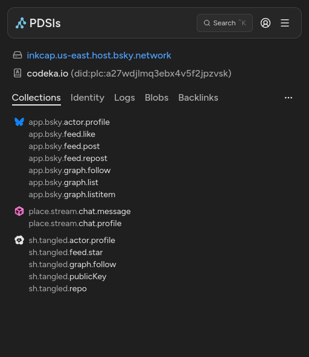

Les _knots_ sont des simples serveurs Git, auto-hébergeables. Encore une fois, Tangled a son propre _knot_, qui permet d'héberger le code sans avoir besoin de démarrer sa propre instance.
Mais si vous souhaitez héberger votre propre _knot_, pour conserver la maitrise de vos données, c'est aussi possible.

Enfin, le même principe s'applique pour les _spindle_, qui sont les runners de CI.
Ici aussi, Tangled propose son propre _spindle_, mais il est possible d'en auto-héberger un.

## Le setup du compte

Si vous avez déjà un compte AT Protocol (Bluesky principalement), la création de votre compte sur Tangled se fait simplement en se connectant avec votre compte existant.

Les données relatives à Tangled sont alors stockées sur votre PDS.

> Je n'ai pas encore migré mon compte sur un PDS de type Eurosky, donc je ne sais pas concrètement si ça fonctionne, mais je me doute que c'est bien le cas.

Une fois cette première étape franchie, on a accès à la plateforme.

La page d'accueil présente une timeline avec les activités d'autres personnes, et quelques repos _Trending_.

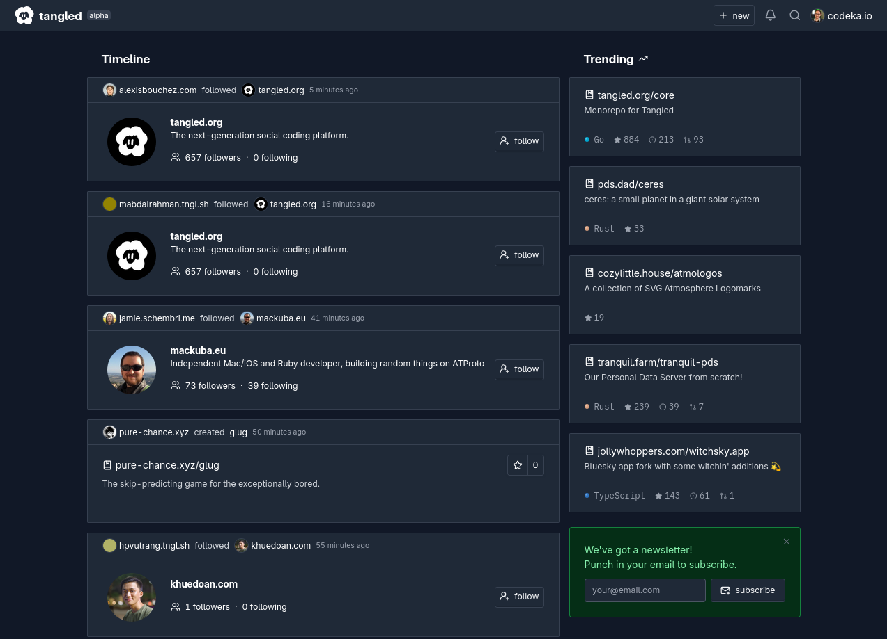

Comme pour tous les hébergements Git, il y a un peu de setup à faire : configurer les clés SSH qui permettront de pousser le code et configurer les adresses mails qui permettent de rattacher les commits au compte.

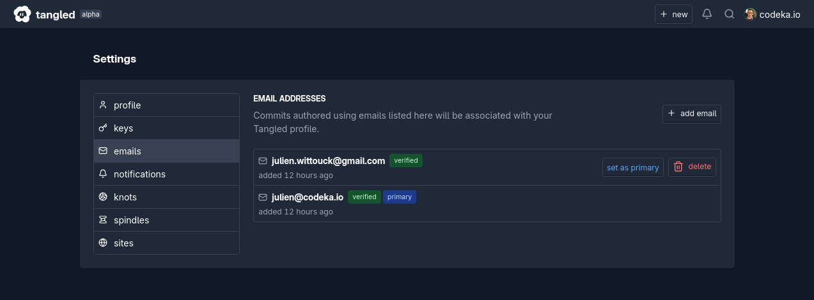

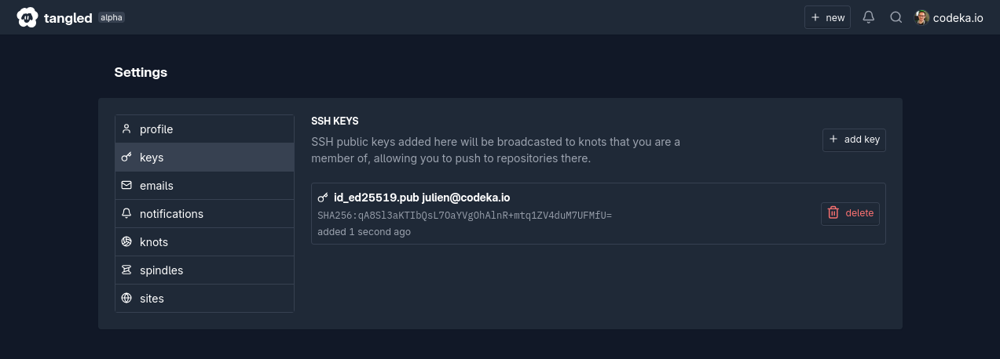

## Créer un nouveau repo

La création d'un repo se fait en quelques clics.

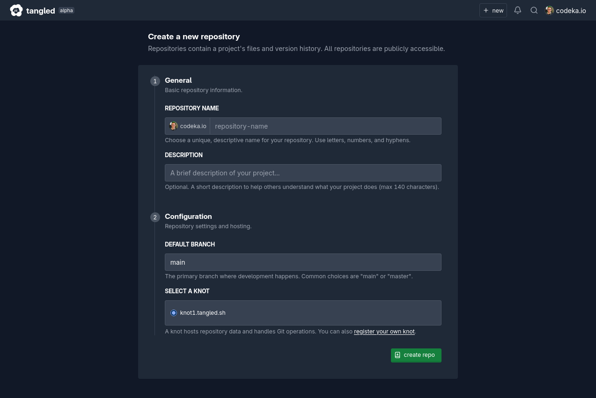

Une subtilité dans la création du repo est la sélection du _knot_, qui est le serveur qui héberge le repo. Je reviendrai sur ce point plus loin, en détaillant la partie liée à l'auto hébergement.

Une fois le repo crée, on nous propose simplement d'y pousser le code.

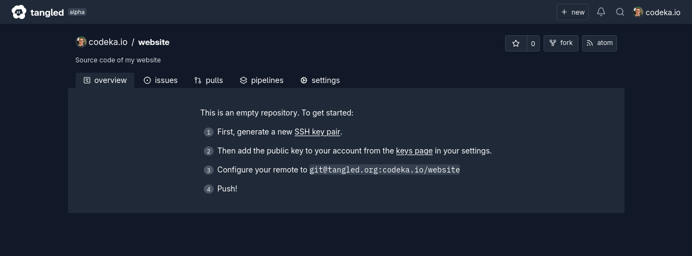

J'ajoute le repo à mes remote Git avec la commande `git remote`

```shell
$ git remote add tangled git@tangled.org:codeka.io/website

$ git push tangled
The authenticity of host 'tangled.org (2a04:3541:8000:1000:24de:d2ff:fe7c:6eaf)' can't be established.
ED25519 key fingerprint is SHA256:fLyp6ivr5HqmGI8yJiPYstTiJa2AXF/RAa9kF/ur1xo.
This key is not known by any other names.
Are you sure you want to continue connecting (yes/no/[fingerprint])? yes
Warning: Permanently added 'tangled.org' (ED25519) to the list of known hosts.

Welcome to Tangled's hosted knot! 🧶
Enumerating objects: 4145, done.
Counting objects: 100% (4145/4145), done.
Delta compression using up to 22 threads
Compressing objects: 100% (3858/3858), done.
Writing objects: 100% (4145/4145), 615.41 MiB | 9.50 MiB/s, done.
Total 4145 (delta 1993), reused 309 (delta 72), pack-reused 0
remote: Resolving deltas: 100% (1993/1993), done.
To tangled.org:codeka.io/website
 * [new branch]      main -> main
```

Le code apparait bien dans le repo, première étape franchie !

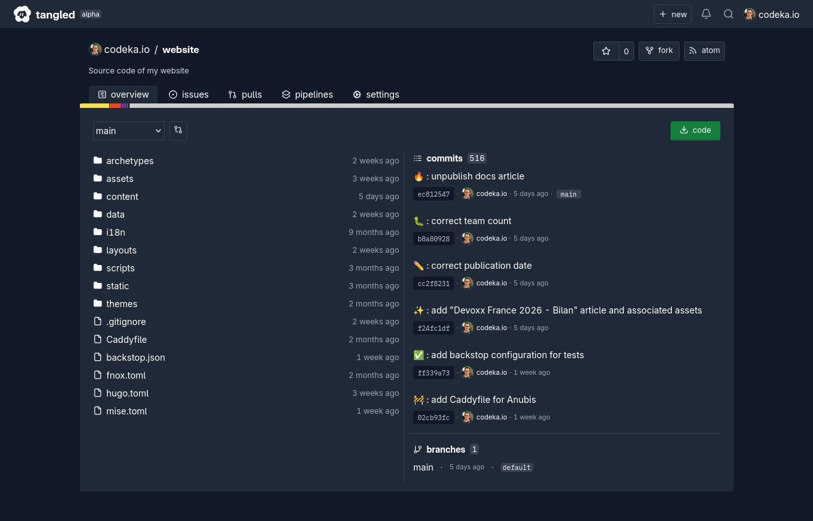

## Héberger son propre _knot_

Le _knot_ est le serveur qui héberge les données de Git.

Pour héberger un _knot_, il faut un serveur et un domaine DNS auquel le _knot_ sera accessible.
Le _knot_ doit également être accessible en HTTPS, un certificat SSL valide est donc aussi nécessaire.

Plusieurs méthodes d'installation sont proposées par Tangled : sur une VM _via_ [Nix](https://tangled.org/tangled.org/core/blob/master/nix/modules/knot.nix), _via_ une installation manuelle (à base de scripts), ou _via_ une image Docker.

Par simplicité, j'ai donc décidé de créer une VM sur Scaleway, et d'y installer mon _knot_ avec docker-compose.

Aucune specification minimale n'est indiquée pour l'installation, j'ai donc pris une machine minuscule (1vCPU et 1G de RAM). Le but est surtout que le service tourne, je ne m'attends pas particulièrement à ce qu'il soit performant.

Après avoir installé Docker et docker-compose (je vous passe ces étapes), je récupère le fichier `docker-compose.yml` de Tangled.

Il est relativement simple, il contient un container pour le _knot_, et un container pour _Caddy_, avec l'exposition en HTTPS.


L'image du _knot_ est disponible sur le registry _ATCR_ (lui aussi lié à AT Proto).

Lors de mes tests, cette image était un peu datée, donc j'ai dû en reconstruire une fraîche.

J'ai récupéré le repository https://tangled.org/tangled.org/knot-docker sur ma machine, 
lancé un 

```shell
docker image build -t rg.fr-par.scw.cloud/tangled/knot:latest .

docker image push rg.fr-par.scw.cloud/tangled/knot:latest
```

Une fois l'image buildée et pushée, je peux lancer le docker compose sur mon serveur :

```shell
$ docker-compose up -d

 ✔ Image caddy:alpine                    Pulled        4.4s
 ✔ Image atcr.io/tangled.org/knot:latest Pulled        9.3s
 ✔ Network tangled_default               Created       0.3s
 ✔ Container tangled-knot-1              Started       2.0s
 ✔ Container tangled-frontend-1          Started       1.7s
```

Une fois que tout est démarré, si j'accède à l'URL de mon _knot_ :
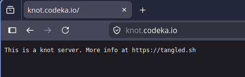

De retour dans l'interface de Tangled, je peux maintenant ajouter mon _knot_ :

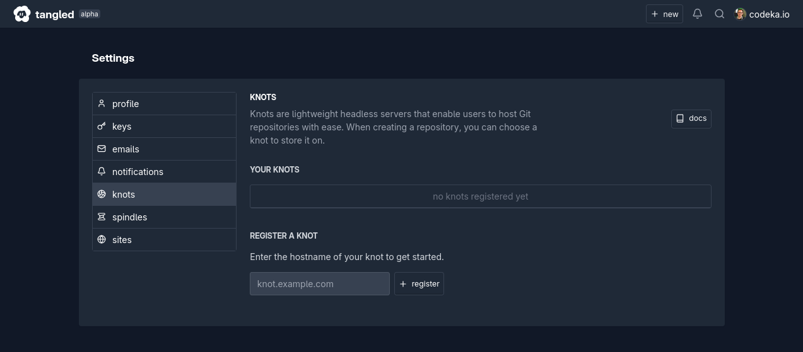

 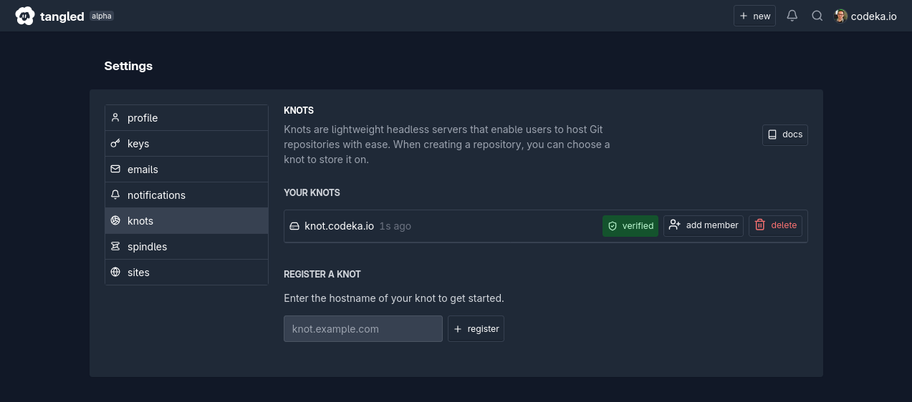

Une fois que mon knot est ajouté dans Tangled, lorsque je veux créer un repository, mon knot est proposé dans le formulaire.

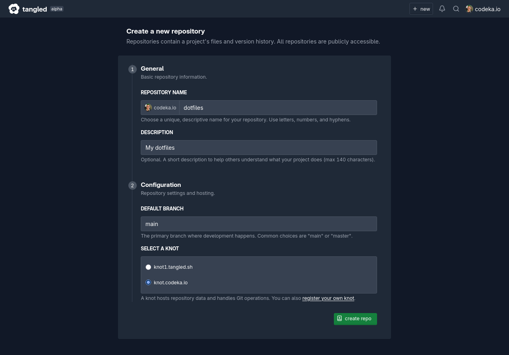

Lorsque le repo est créé, il apparaît alors sur mon _knot_, dans un répertoire portant pour nom son "did" AT Protocol :

```shell
tangled@tangled-knot:/home/tangled/repositories# ls
did:plc:uam62c7dmtnxgca3jlad63kg
```

## Ouvrir une pull request

Ouvrir une PR sur Tangled est assez similaire à d'autres outils.

Pour ce faire, il faut se rendre sur le repo souhaité, et cliquer sur le bouton "New".

Le formulaire propose alors de poser un `git diff` manuellement, ou d'extraire un diff de la comparaison d'un fork.

Il est aussi possible d'ajouter un titre et une description, qui sont optionnelles (Tangled extrait les informations du premier commit pour alimenter ces champs).

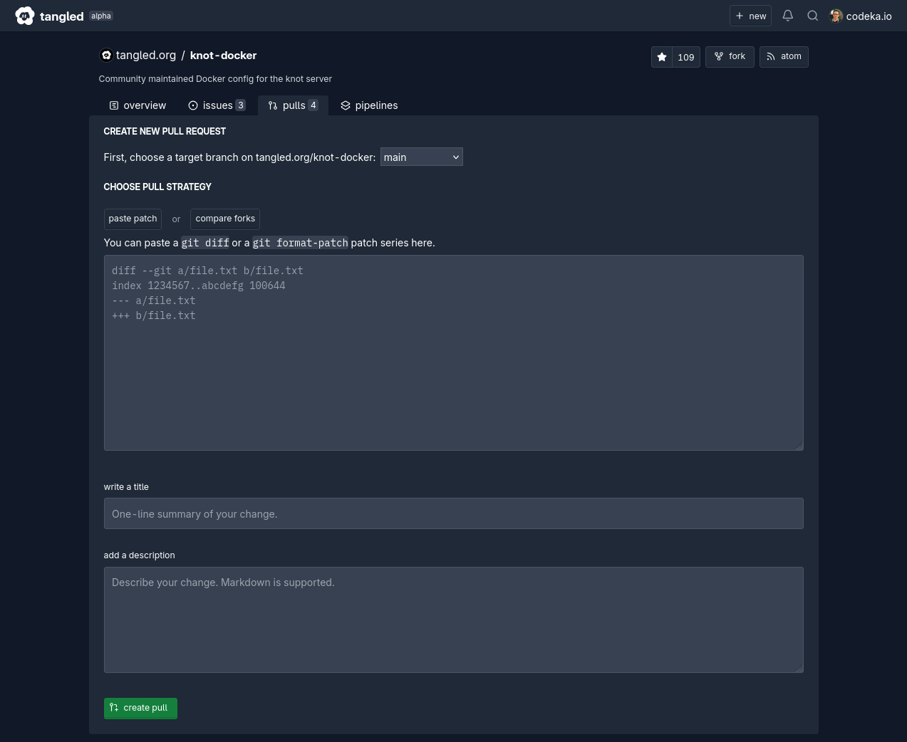

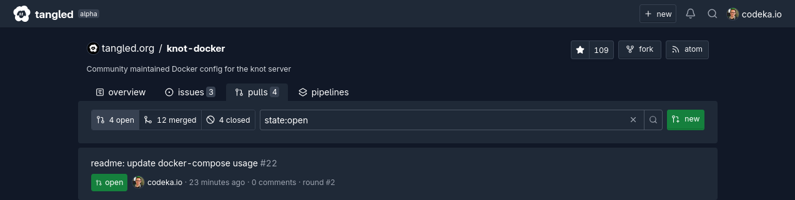

Une fois la PR créé, il est possible de push de nouveaux commits, de poser des commentaires, bref, c'est l'environnement habituel.

Les PR sont stockées sous la forme de records AT Protocol, dans le PDS de l'utilisateur qui ouvre la PR. L'URI du record est visible dans l'interface de Tangled. 

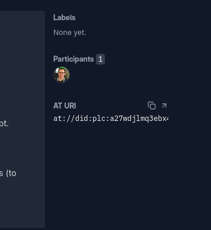

On peut alors directement voir le record AT Protocol, avec ses différents champs.
On y retrouve les informations sur la PR (titre et description), les _rounds_ correspondent aux push successifs, et référencent le blob qui contient le patch de la PR.

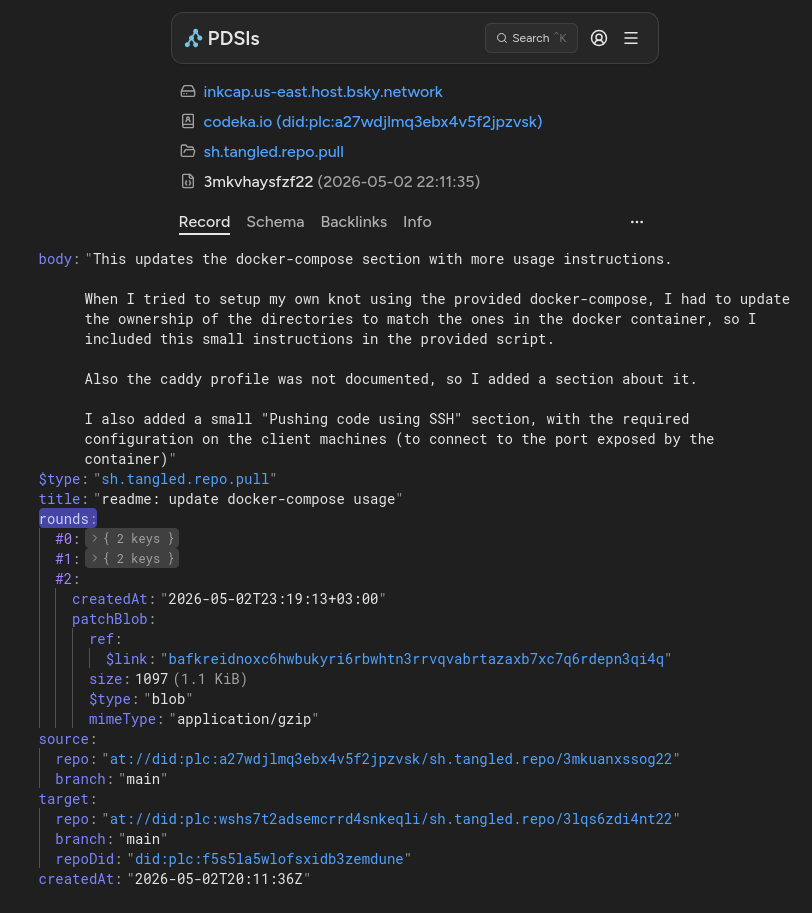

## Les issues et les labels

Concernant la gestion des issues et des labels, Tangled propose un système similaire à GitHub.

Les issues sont composées d'un titre, d'une description (tous deux en markdown) et de labels.

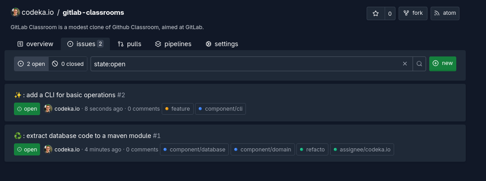

Chaque nouveau repo est initialisé avec des labels basiques (retenez bien ce terme) : "documentation", "duplicate", "good-first-issue", "wontfix".

Il est aussi possible de créer ses propres labels basiques, depuis la page de configuration d'un repo.

.

En plus des labels basiques, il existe des labels "Key-Value".
Ces labels portent un nom, et une valeur associée qui peut être une chaîne arbitraire, un _did_ AT Protocol, ou un nombre.

Les cas d'usages sont multiples, et le premier cas présenté par Tangled est un label "assignee", qui a pour valeur un _did_, donc la personne a qui on a assigné l'issue.
Il est ainsi possible d'avoir par exemple un label "component" qui référence le ou les composants impactés, ou même des labels de chiffrage (pour les foufous).

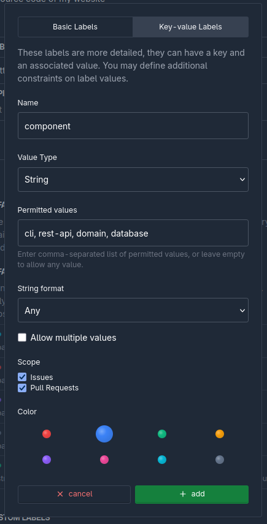

Sur une issue, les labels sont ensuite présentés sous la forme d'un petit formulaire, à côté de l'issue, ce qui est vraiment bien fait et pratique.

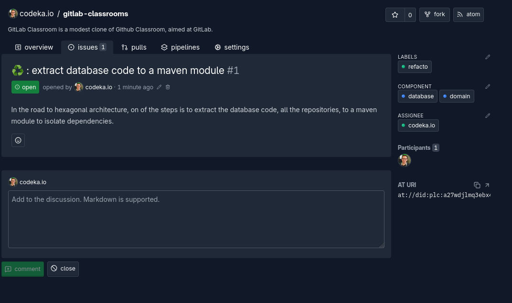

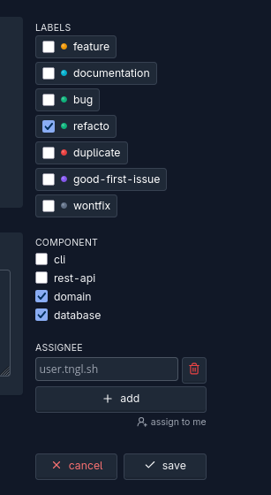

La flexibilité qu'offre ce système de labels est vraiment cool, je pense qu'on en trouvera des usages originaux dans le futur, mais c'est déjà très pratique de mon point de vue.

## Autres features

### Strings

Les strings sont des snippets partageables, l'équivalent d'un _gist_ dans GitHub.

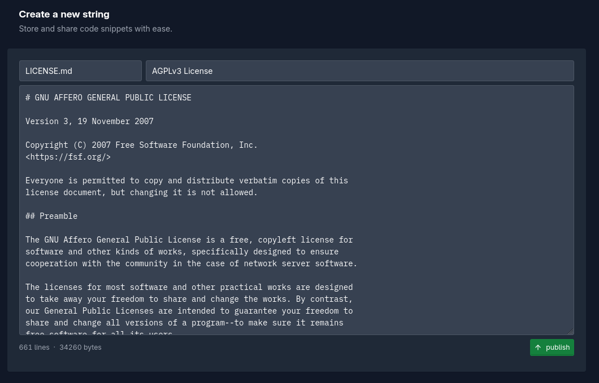

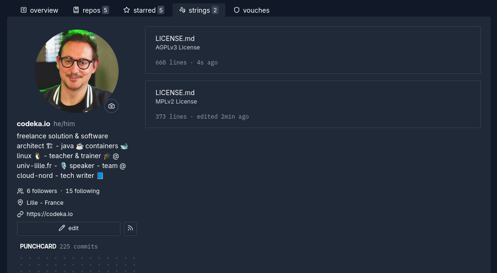

Les strings peuvent alors être partagés avec leur lien, qui est public.

> L'éditeur Markdown est hyper basique (champ de texte). C'est à la fois une bonne chose (on se concentre sur le contenu), mais un petit aperçu pour aider à la relecture manque quand même.

### Vouching

Le _vouching_, inspiré par [_vouch_](https://github.com/mitchellh/vouch/) de Mitchell Hashimoto, permet d'introduire la notion de confiance dans la plateforme.

Il permet de _vouch_ (témoigner) ou _denounce_ (signaler) d'autres utilisateurs avec lesquels on a intéragit.
Le but est de créer un écosystème de confiance, en particulier pour éloigner les contributions de mauvaise qualité (souvent générés avec un LLM d'ailleurs).

Chaque témoignage ou signalement doit être accompagné d'un commentaire. Les informations sont alors visibles sur le cercle direct (vous avez vous même _vouched_ ou _denounced_ quelqu'un), ou indirect (quelqu'un que vous avez _vouched_ ou _denounced_ a _vouched_ ou _denounced_ quelqu'un d'autre).

Un article détaillé a été publié à ce sujet sur le blog de Tangled : [combat LLM spam by building a web of trust](https://blog.tangled.org/vouching/).

## Conclusion

## Liens et références

* [Knot self-hosting guide](https://docs.tangled.org/knot-self-hosting-guide#knot-self-hosting-guide)
  * [Module Nix](https://tangled.org/tangled.org/core/blob/master/nix/modules/knot.nix)
  * [Image Docker](https://tangled.org/tangled.org/knot-docker)
* Vouching
  * [combat LLM spam by building a web of trust](https://blog.tangled.org/vouching/)
  * https://github.com/mitchellh/vouch/