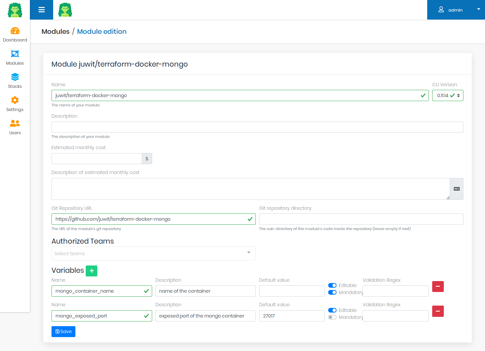
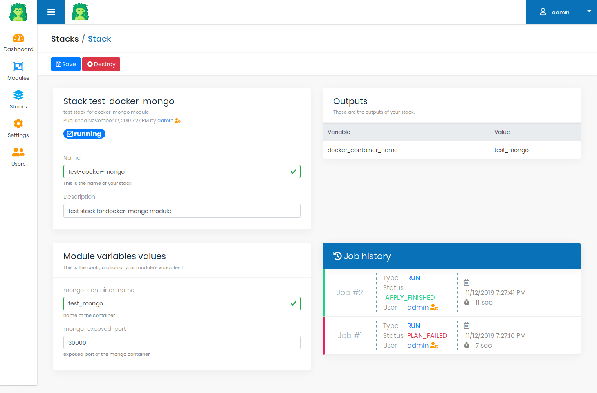
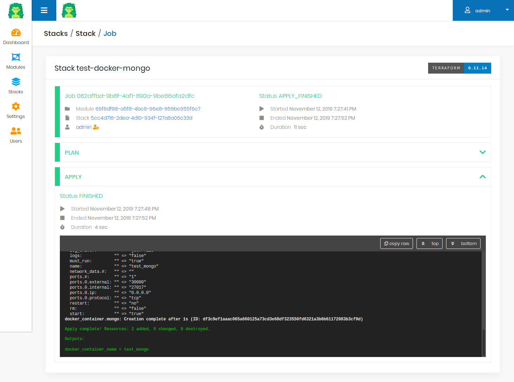

  

Gaia is a Terraform UI for your Terraform modules, and self-service infrastructure.

## What is it?

Gaia is a web application to import and run your Terraform modules.
It features : 
* importing modules from source code (Github/Gitlab)
* validation of Terraform variables values (mandatory variables, regex-based validation)
* setting up default values or masking variables for your users
* running modules (plan/apply/destroy) in one click and managing Terraform state
* team management

## Documentation

Go to [docs.gaia-app.io](https://docs.gaia-app.io) for the full documentation.

## Screenshots

The module edition view allows you to edit module details, such as variables and their validation.

The stack view helps you to input your variable values, and shows job results and latest output values.

The job view shows you the Terraform workflow, and the logs of the `plan` and `apply` logs

## Requirements

Gaia needs :
 * a docker daemon (used to run Terraform itself)
 * and a MongoDb database (to store its data)
   * we currently support MongoDb 4.0 only

## Quick start

See the documentation at [https://docs.gaia-app.io/](https://docs.gaia-app.io/getting-started/quick-start/) for quick-start instructions.

## Contributors

Gaia is made with ❤️ in  🇫🇷 by [Cyril DUBUISSON](https://github.com/cdubuisson) and [Julien WITTOUCK](https://github.com/juwit)
